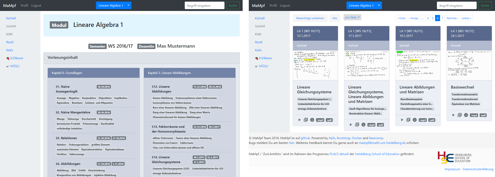
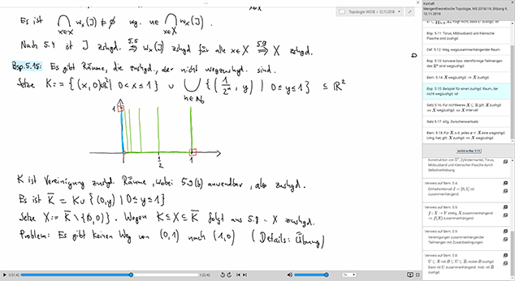
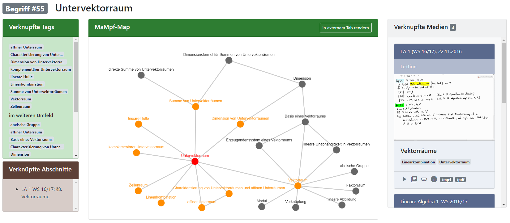
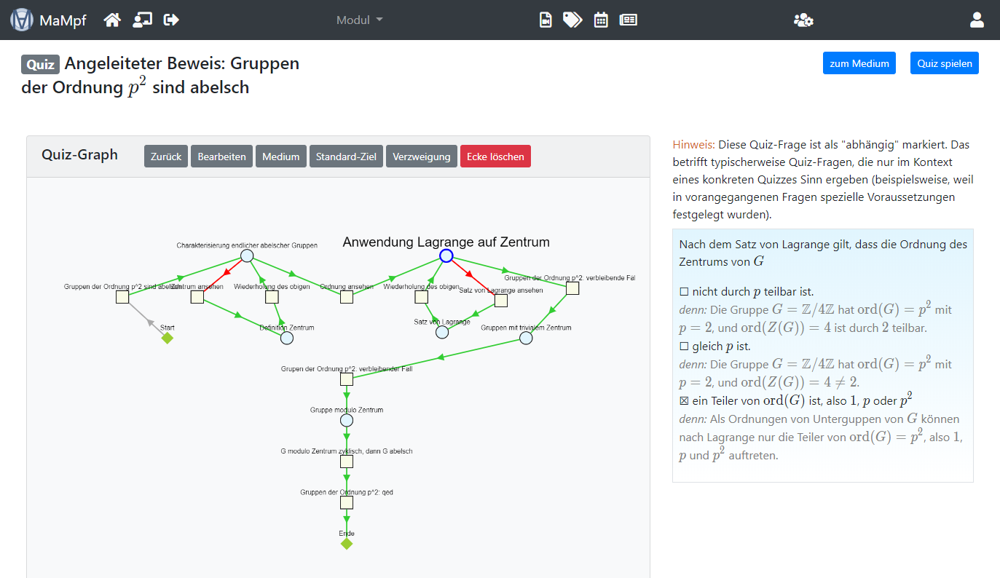

# README

## About

MaMpf (*Mathematische Medienplattform*) is an innovative open source E-Learning platform for the mathematical sciences.
Central point is the interconnection between different content in the sense
of a hypermedia system.

MaMpf uses the contextual classification of a course as visual leitmotiv,
instead of organizational aspects.



MaMpf comes with its own hypermedia player and editor THymE
(*The hypermedia Experience*). ThymeE uses the internal structure of
mathematical content (consisting of theorems, remarks, definitions etc.) and allows
exact navigation between content that is related, but temporally apart.
References can be created not only to content within the same video, but within
the whole MaMpf database.



ThymE is lean and makes use of WebVTT and HTML5 video capabilites
of modern browsers. A sample hypervideo can be found
[here](https://mampf.mathi.uni-heidelberg.de/media/384/play).

MaMpf is equipped with a tagging system and rich visualisations for content relations,
making use of [cytoscape.js](http://js.cytoscape.org/).



MaMpf has a quiz system that allows you to create complex quizzes quite easily.



MaMpf makes use of the JS based symbolic math expression evaluator
[nerdamer](https://github.com/jiggzson/nerdamer) to parse student's input in quizzes.


For more information see this [blog](https://mampfdev.wordpress.com).
There you can also find a [screenshot gallery](https://mampfdev.wordpress.com/gallery/).
## System background

[](https://dashboard.cypress.io/projects/v45wg9/runs)
[](https://codecov.io/gh/MaMpf-HD/mampf)

MaMpf is implemented in Ruby on Rails.

* Ruby version: 2.7.2
* Rails Version: 6.0.3.2
* Test suite: rspec, cypress
* support for I18n

## Installation (with docker-compose)

To simply try out mampf you can use docker-compose. Simply clone the mampf repository and run docker-compose by executing
```
git clone -b main --recursive git@github.com:fosterfarrell9/mampf.git
cd mampf/docker/development/
docker-compose up
```
For more information about that visit [INSTALL.md](./INSTALL.md).

