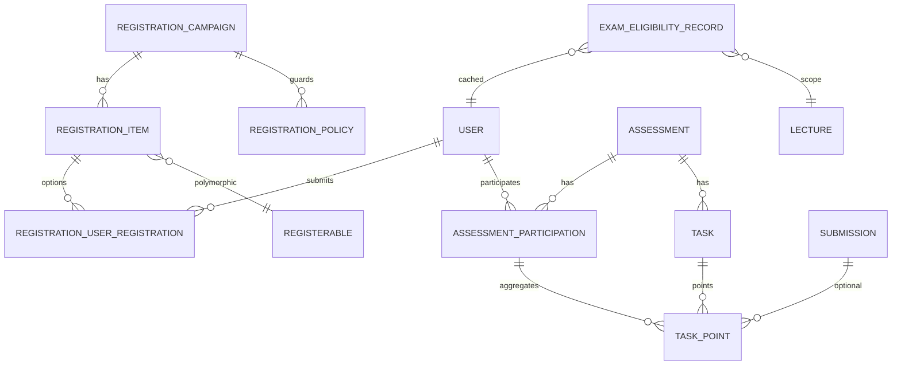

# Domain Model (Summary)

This chapter summarizes principal entities; authoritative behavioral details live in the referenced chapters.

## Registration Layer

| Component | Type | Description |
|-----------|------|-------------|
| Registration::Campaign | ActiveRecord | Time‑bounded process (modes: FCFS, preference_based) |
| Registration::Item | ActiveRecord | Wrapper exposing a registerable option under a campaign |
| Registration::UserRegistration | ActiveRecord | (user, item) intent + status (pending/confirmed/rejected) + optional preference_rank |
| Registration::Policy | ActiveRecord | Ordered eligibility rule (exam_eligibility, institutional_email, prerequisite_campaign, custom_script) |
| Registration::Campaignable | Concern | Enables a model to host registration campaigns |
| Registration::Registerable | Concern | Enables a model to be an option within a campaign |
| Registration::PolicyEngine | Service | Executes ordered active policies; short‑circuits on first failure |
| Registration::AllocationMaterializer | Service | Applies confirmed assignments → registerable.materialize_allocation! |

## Materialization & Rosters

- Rosterable (concern): unified roster API (roster_user_ids, replace_roster!, add/remove).
- AllocationMaterializer (service, implied): applies confirmed assignments → registerable.materialize_allocation!.
- RegisterableRosterService: post‑allocation admin (move/add/remove) with capacity enforcement.

## Assessments & Grading

- Assessment: grade/points container (assignment, exam, talk).
- AssessmentParticipation: per user totals, grade, status.
- Task: per‑assessment graded component (if requires_points).
- TaskPoint: per (participation, task) points + grader + state.
- Submission: artifact (team-capable) optionally linked to a task.
- Concerns: Assessable, Pointable, Gradable.
- GradeSubmissionService: submission-centered fan‑out to TaskPoints.

## Eligibility & Exam Schemes

- ExamEligibilityPolicy (config stored in Registration::Policy or dedicated model) & service computing ExamEligibilityRecords.
- ExamEligibilityRecord: cached points, percentage, computed_status, overrides (override_status/reason/by/at).
- GradeScheme (future / lightweight): JSON config describing mapping raw → grade_value.

## Assignment Algorithm

| Component | Type | Description |
|-----------|------|-------------|
| Registration::AssignmentService | Service | Strategy dispatcher using pluggable solvers (Min-Cost Flow, future CP-SAT) |
| Registration::Solvers::MinCostFlow | Service | OR-Tools SimpleMinCostFlow implementation for bipartite preference assignment |
| Registration::Solvers::CpSat | Service | Future CP-SAT solver for advanced constraints (fairness, mutual exclusion, quotas) |

## Achievements

- LectureAchievement: qualitative counts (e.g., blackboard_explanation) used in eligibility rules.

## Linking Concepts

- User: links to Registration::UserRegistrations and AssessmentParticipations.
- Lecture/Tutorial/Talk/Assignment/Exam: domain models that can become registerable and/or assessable.

## High-Level ERD (Simplified)

See details:

- [Registration System](02-registration-system.md)
- [Allocation & Rosters](03-allocation-and-rosters.md)
- [Assessments & Grading](04-assessments-and-grading.md)
- [Exam Eligibility & Schemes](05-exam-eligibility-and-grading-schemes.md)
- [Algorithm Details](07-algorithm-details.md)
