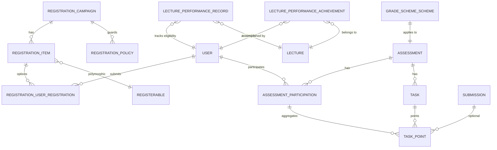

# Domain Model

This chapter summarizes principal entities; authoritative behavioral details live in the referenced chapters.

## Registration

| Component | Type | Description |
|-----------|------|-------------|
| Registration::Campaign | ActiveRecord | Time‑bounded process (modes: FCFS, preference_based) |
| Registration::Item | ActiveRecord | Wrapper exposing a registerable option under a campaign |
| Registration::UserRegistration | ActiveRecord | (user, item) intent + status (pending/confirmed/rejected) + optional preference_rank |
| Registration::Policy | ActiveRecord | Ordered eligibility rule (lecture_performance, institutional_email, prerequisite_campaign, custom_script) |
| Registration::Campaignable | Concern | Enables a model to host registration campaigns |
| Registration::Registerable | Concern | Enables a model to be an option within a campaign |
| Registration::PolicyEngine | Service | Executes ordered active policies; short‑circuits on first failure |
| Registration::AllocationMaterializer | Service | Applies confirmed allocations → registerable.materialize_allocation! |

## Rosters

| Component | Type | Description |
|-----------|------|-------------|
| Roster::Rosterable | Concern | Unified roster API (`roster_user_ids`, `replace_roster!`, etc.) |
| Roster::MaintenanceService | Service | Post-allocation admin (move/add/remove) with capacity enforcement |

## Assessments & Grading

| Component | Type | Description |
|-----------|------|-------------|
| Assessment::Assessment | ActiveRecord | Gradebook container for graded work (assignment, exam, talk, achievement) |
| Assessment::Participation | ActiveRecord | Per-user totals, grade, status, submission timestamps |
| Assessment::Task | ActiveRecord | Per-assessment graded component (only if requires_points) |
| Assessment::TaskPoint | ActiveRecord | Per (participation, task) points + grader + submission link |
| Assessment::Assessable | Concern | Enables a model to be linked to an Assessment::Assessment |
| Assessment::Pointable | Concern | Extends Assessable to enable per-task point tracking |
| Assessment::Gradable | Concern | Extends Assessable to enable final grade recording |
| Assessment::SubmissionGrader | Service | Submission-centered fan-out to TaskPoints for team grading |
| Submission | ActiveRecord | Team-capable artifact optionally linked to a task |

## Exam Eligibility

| Component | Type | Description |
|-----------|------|-------------|
| LecturePerformance::Record      | ActiveRecord | Materialized lecture performance per (lecture, user) with override support |
| LecturePerformance::Rule        | ActiveRecord | Configuration for eligibility criteria (thresholds, required achievements) |
| Achievement                     | ActiveRecord | Assessable type for qualitative accomplishments (e.g., blackboard presentations, attendance) with Assessment infrastructure |
| LecturePerformance::Service | Service | Computes eligibility from points and achievements; triggers recomputation before registration |
| Registration::Policy (kind: exam_eligibility) | Integration | Queries materialized records and triggers recomputation during exam registration |

## Grading Schemes

| Component | Type | Description |
|-----------|------|-------------|
| GradeScheme::Scheme | ActiveRecord | Versioned configuration for converting assessment points to final grades |
| GradeScheme::Applier | Service | Applies scheme to compute and persist final grades for all participations |

## Allocation Algorithm

| Component | Type | Description |
|-----------|------|-------------|
| Registration::AllocationService | Service | Strategy dispatcher using pluggable solvers (Min-Cost Flow, future CP-SAT) |
| Registration::Solvers::MinCostFlow | Service | OR-Tools SimpleMinCostFlow implementation for bipartite preference allocation |
| Registration::Solvers::CpSat | Service | Future CP-SAT solver for advanced constraints (fairness, mutual exclusion, quotas) |

## Linking Concepts

```admonish info "What are linking concepts?"
These are the "glue" entities that connect the core domain models (User, Lecture, Tutorial, etc.) to the systems above. They enable domain models to participate in registration, assessment, and eligibility tracking.
```

**Core Domain Models:**
- `User` - Students, teachers, tutors who participate in the system
- `Lecture` - A course offering (e.g., "Linear Algebra WS 2024/25")
- `Tutorial` - A tutorial group within a lecture
- `Talk` - A student presentation or seminar talk
- `Assignment` - A homework assignment
- `Exam` - An exam assessment

**How they link to the systems:**

| Domain Model | Links To | Via | Purpose |
|--------------|----------|-----|---------|
| Lecture | Registration | `Registration::Campaignable` concern | Host exam registration campaigns |
| Tutorial | Registration | `Registration::Registerable` concern | Become a registerable option in tutorial allocation |
| Exam | Registration | `Registration::Campaignable` concern | Host exam registration campaigns |
| Assignment | Assessment | `Assessment::Pointable` concern | Track per-task points for homework |
| Exam | Assessment | `Assessment::Gradable` concern | Record final exam grades |
| Talk | Assessment | `Assessment::Gradable` concern | Grade student presentations |
| User | All Systems | Direct associations | Student participates in registrations, assessments, eligibility |
| Lecture | Exam Eligibility | Direct association | Scope eligibility records to specific lecture |

**Example Flows:**

1. **Tutorial Registration:** `Lecture` (campaignable) → creates `Registration::Campaign` → contains `Registration::Item` wrapping `Tutorial` (registerable) → students submit `Registration::UserRegistration`

2. **Homework Grading:** `Assignment` (pointable) → linked to `Assessment::Assessment` → contains `Assessment::Task` → tutors record `Assessment::TaskPoint` → aggregated into `Assessment::Participation`

3. **Exam Eligibility:** `Lecture` → students complete `Assignment` assessments → `LecturePerformance::Service` aggregates points → creates `LecturePerformance::Record` → `Registration::Policy` (kind: exam_eligibility) checks records when student attempts `Exam` (campaignable) registration

## High-Level ERD (Simplified)



See details:

- [Registration System](02-registration.md)
- [Allocation & Rosters](03-rosters.md)
- [Assessments & Grading](04-assessments-and-grading.md)
- [Exam Model](05a-exam-model.md)
- [Lecture Performance](05-lecture-performance.md)
- [Grading Schemes](05b-grading-schemes.md)
- [Algorithm Details](07-algorithm-details.md)
