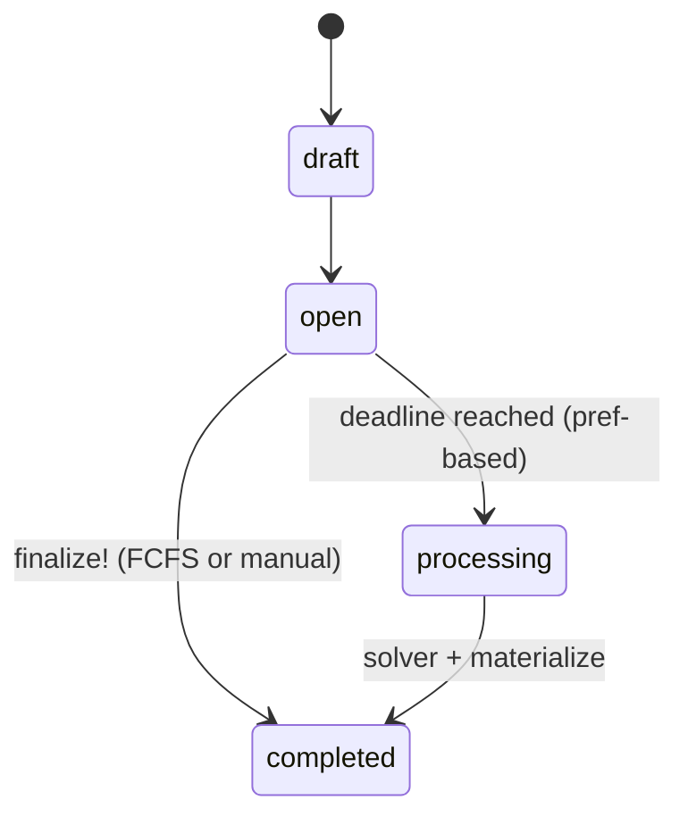
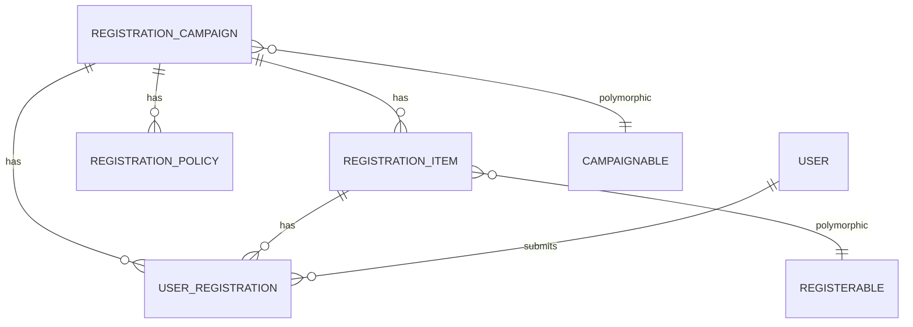

# Registration System

## Problem Overview
MaMpf needs a flexible registration system to handle:
- **Regular courses:** Students register for tutorials within a lecture
- **Seminars:** Students register for talks within a seminar (special type of lecture)
- **Mixed scenarios:** Combining lecture enrollment with tutorial/talk assignment via a chained process

## Solution Architecture
We use a unified system with:
- **Registration Campaigns:** Time-bounded processes for registration
- **Polymorphic Design:** Any model can become registerable or campaignable (host campaigns)
- **Two-step Chaining:** Optional prerequisite campaigns (e.g., must register for seminar before selecting talks) implemented via a `prerequisite_campaign` policy
- **Allocation Persistence:** Store the final allocation (confirmed vs rejected) and optional per-item counters
- **Strategy Layer:** Pluggable solver for preference-based allocation (Min-Cost Flow now; CP-SAT later)
- **Domain Materialization (mandatory):** After allocation, propagate confirmed assignments back into domain models (e.g., populate talk speakers, tutorial rosters)
- **Registration Policies:** Composable eligibility rules (exam eligibility, institutional email, prerequisite, etc.)
- **Policy Engine:** Evaluates ordered active policies; short-circuits on first failure

---

## RegistrationCampaign (ActiveRecord Model)
**_The Registration Process Orchestrator_**

```admonish info "What it represents"
- A time-bounded administrative process where users can register for specific items under a chosen mode.
```

```admonish tip "Think of it as"
- “Tutorial Registration Week”, “Seminar Talk Selection Period”, “Exam Slot Signup”
```

The main fields and methods of `RegistrationCampaign` are:

| Name/Field                | Type/Kind         | Description                                                                                  |
|---------------------------|-------------------|----------------------------------------------------------------------------------------------|
| `campaignable_type`       | DB column         | Polymorphic type for the campaign host (e.g., Lecture, Seminar)                              |
| `campaignable_id`         | DB column         | Polymorphic ID for the campaign host                                                         |
| `title`                   | DB column         | Human-readable campaign title                                                                 |
| `assignment_mode`         | DB column (Enum)  | Registration mode: `first_come_first_serve` or `preference_based`                            |
| `status`                  | DB column (Enum)  | Campaign state: `draft`, `open`, `processing`, `completed`                                   |
| `registration_deadline`   | DB column         | Deadline for user submissions                                                                |
| `registration_items`      | Association       | Items available for registration within this campaign                                        |
| `user_registrations`      | Association       | User submissions for this campaign                                                           |
| `registration_policies`   | Association       | Eligibility and other policies attached to this campaign                                     |
| `eligible_user?(user)`    | Method            | Returns eligibility result for a user (delegates to Policy Engine)                           |
| `open_for_submissions?`   | Method            | Returns true if campaign is currently accepting submissions                                  |
| `finalize!`               | Method            | Finalizes and materializes allocation                                                        |
| `run_assignment!`         | Method            | Runs allocation solver and finalizes campaign                                                |

```admonish note
Eligibility is not a single field or method, but is determined dynamically by evaluating all active `registration_policies` for the campaign using the `eligible_user?(user)` method, which delegates to the policy engine.
```

### Behavior Highlights

- Guards submission window (`open?`)
- Delegates fine-grained eligibility to ordered `RegistrationPolicies` via Policy Engine
- Triggers solver (preference-based) at/after deadline
- Finalizes and materializes allocation once only (idempotent)

### Example Implementation

```ruby
belongs_to :campaignable, polymorphic: true
has_many :registration_items, dependent: :destroy
has_many :user_registrations, dependent: :destroy
has_many :registration_policies, dependent: :destroy

enum assignment_mode: { first_come_first_serve: 0, preference_based: 1 }
enum status: { draft: 0, open: 1, processing: 2, completed: 3 }

validates :title, :registration_deadline, presence: true

# Unified eligibility
def eligible_user?(user)
  return RegistrationPolicyEngine::Result.new(pass: false, code: :campaign_not_open) unless open?
  engine = RegistrationPolicyEngine.new(self)
  engine.eligible?(user)
end

def open_for_submissions?
  open?
end

def finalize!
  return false unless open? || processing?
  AllocationMaterializer.new(self).materialize!
  update!(status: :completed)
end

def run_assignment!
  return false unless preference_based? && open? && Time.current >= registration_deadline
  update!(status: :processing)
  RegistrationAssignmentService.new(self, strategy: :min_cost_flow).assign!
  finalize!
end
```

### Usage Scenarios

- **Lecture** is campaignable for “Tutorial Registration” campaign for its tutorials
- **Seminar** is campaignable for “Talk Assignment” campaign for its talks
- **Exam** is campaignable for “Exam Registration” campaign with `exam_eligibility` and `institutional_email` policies

---

## 2) RegistrationItem — Available Options Within a Campaign

```admonish info "What it represents"
- One selectable option inside a campaign (e.g., a specific tutorial group, talk, slot).
```

```admonish note "Think of it as"
- The individual “choice” that users can target with a registration
```

Key fields:
- registration_campaign_id
- registerable_type, registerable_id (polymorphic)
- assigned_count (optional, denormalized counter for confirmed users)

Relationships and helpers:
- Capacity is provided by the underlying registerable (e.g., tutorial.capacity).

```ruby
class RegistrationItem < ApplicationRecord
	belongs_to :registration_campaign
	belongs_to :registerable, polymorphic: true
	has_many :user_registrations, dependent: :destroy

	# Convenience for UI/reporting
	def assigned_users
		user_registrations.confirmed.includes(:user).map(&:user)
	end
end
```

Examples:
- “Tutorial A (Mon 10:00)”, “Tutorial B (Wed 14:00)”
- “Talk: Machine Learning Advances”
- “Exam: Morning Session”

---

## 3) Registerable Concern (Polymorphic Target)

```admonish info "What it represents"
A lightweight concern mixed into any domain model that can be the target of a `RegistrationItem` (i.e. something users are ultimately allocated to).
```

```admonish note "Think of it as"
“The domain object the infrastructure points at” — tutorials, talks, (optionally) the lecture itself, future exam slots, etc.
```

#### Responsibilities
- Provide a capacity (fixed column or computed).
- Optionally expose current allocated users (for reporting).
- Implement `materialize_allocation!(user_ids:, campaign:)` to apply confirmed results idempotently.
- Remain agnostic of solver / eligibility logic (those live in policies & services).

#### Not Responsibilities
- Eligibility checks (policies handle that).
- Storing pending registrations (that’s `UserRegistration`).
- Orchestrating allocation (campaign + assignment service).

#### Minimal Interface (conventional)
| Method | Purpose | Required |
|--------|---------|----------|
| `capacity` | Integer seat count | Yes |
| `materialize_allocation!(user_ids:, campaign:)` | Persist authoritative roster for this campaign | Yes |
| `allocated_user_ids` | Current materialized users (for diffing / reporting) | Optional |
| `remaining_capacity`, `full?` | Convenience derived helpers | Optional |

#### Example Concern

```ruby
# app/models/concerns/registerable.rb
module Registerable
  extend ActiveSupport::Concern

  # Optionally add reverse relation if needed:
  # included { has_many :registration_items, as: :registerable, dependent: :restrict_with_error }

  def capacity
    self[:capacity] || raise(NotImplementedError, "#{self.class} must define #capacity")
  end

  def allocated_user_ids
    [] # Override in concrete model for efficiency
  end

  def remaining_capacity
    [capacity - allocated_user_ids.size, 0].max
  end

  def full?
    remaining_capacity.zero?
  end

  # Must be overridden per model; should be idempotent (replace prior state from this campaign).
  def materialize_allocation!(user_ids:, campaign:)
    raise NotImplementedError, "#{self.class} must implement #materialize_allocation!"
  end
end
```

#### How This Fits the Polymorphic Association
`RegistrationItem` uses `belongs_to :registerable, polymorphic: true`. Any model including `Registerable` (e.g., `Tutorial`, `Talk`, `Lecture`) becomes a valid target. No extra schema per model is required—only the shared polymorphic columns on `registration_items`.

#### Materialization Pattern (Concrete Model Example)

```ruby
def materialize_allocation!(user_ids:, campaign:)
  transaction do
    # Example (HABTM or join model based):
    # self.student_ids = user_ids
    # save! if changed?
    #
    # Or with provenance:
    # memberships.where(source_campaign_id: campaign.id).delete_all
    # user_ids.each { |uid| memberships.create!(user_id: uid, source_campaign_id: campaign.id) }
  end
end
```

#### Implementations Here
- `Lecture` (when directly enrollable, e.g., seminar)
- `Tutorial` (tutorial rosters)
- `Talk` (speaker assignment)
- Future: `ExamSlot` (session seat selection)

---

## 4) Campaignable Concern (Polymorphic Host)

```admonish info "What it represents"
A lightweight concern mixed into any domain model that can serve as the context or "campaignable" for a `RegistrationCampaign`.
```

#### Responsibilities

- Provides a central point for grouping related campaigns.
- Simplifies finding campaigns related to a specific object (e.g., all registrations for a given lecture).

#### Example Concern

```ruby
# app/models/concerns/campaignable.rb
module Campaignable
  extend ActiveSupport::Concern

  included do
	has_many :registration_campaigns, as: :campaignable, dependent: :destroy
  end
end
```

---

## 5) UserRegistration — Individual User Submissions

```admonish info "What it represents"
- A user’s intent/application for one item within a specific campaign.
```

```admonish note "Think of it as"
- One row per (user, item) with an optional rank in preference-based mode.
```

Key fields:
- user_id
- registration_campaign_id
- registration_item_id
- status (enum): pending, confirmed, rejected
- preference_rank (nullable integer; only for preference-based)

Status semantics:
- pending: stored preference awaiting allocation
- confirmed: user allocated this item (allocation result or FCFS accept)
- rejected: user not allocated to this item

Constraints:
- At most one confirmed per user per campaign (logic + optional DB index).
- Unique (user, campaign, preference_rank) to ensure ranks are unique per user.

```ruby
class UserRegistration < ApplicationRecord
	belongs_to :user
	belongs_to :registration_campaign
	belongs_to :registration_item

	enum status: { pending: 0, confirmed: 1, rejected: 2 }

	validates :preference_rank,
						presence: true,
						if: -> { registration_campaign.preference_based? }
	validates :preference_rank,
						uniqueness: { scope: [:user_id, :registration_campaign_id] },
						allow_nil: true
end
```

Examples:
- Alice ranks Tutorial A (1), Tutorial B (2).
- Bob registers FCFS for “Exam Morning Session” and is confirmed immediately.

---

## 6) User — Enhanced

```admonish info "What it represents"
- Existing MaMpf user; no schema changes required.
```

```ruby
class User < ApplicationRecord
	has_many :user_registrations, dependent: :destroy
	has_many :registration_campaigns, through: :user_registrations
	has_many :registration_items, through: :user_registrations
end
```

---

## 7) Lecture — Enhanced

```admonish info "What it represents"
- Existing MaMpf lecture model that can both be campaignable (host campaigns) AND be registered for.
```

Dual role:

- As Campaignable: Can organize tutorial registration, talk assignment campaigns
- As Registerable: Students can register for the lecture itself (seminars)

```ruby
class Lecture < ApplicationRecord
	include Campaignable      # Can host campaigns for tutorials/talks
	include Registerable      # Can be registered for (seminar enrollment)
	# ... existing code ...
end
```

Examples:
- Lecture is campaignable for "Tutorial Registration" for students to pick tutorial sections
- Seminar is campaignable for "Talk Assignment" campaign for students to pick presentation topics
- Seminar itself becomes registerable item in "Seminar Enrollment" campaign

---

## 8) Tutorial — Enhanced

```admonish info "What it represents"
- Existing MaMpf tutorial model that students can register for.
```

```ruby
class Tutorial < ApplicationRecord
	include Registerable
	# ... existing code ...

	# Materialize allocated students (adapt to your model)
	# Example if you use TutorialMemberships or a has_many :students relation:
	def materialize_allocation!(user_ids:, campaign:)
		# Example 1: replace a membership join table
		# TutorialMembership.transaction do
		#   tutorial_memberships.where(source_campaign_id: campaign.id).delete_all
		#   user_ids.each { |uid| tutorial_memberships.create!(user_id: uid, source_campaign_id: campaign.id) }
		# end

		# Example 2: direct HABTM list
		# self.student_ids = user_ids
		# save! if changed?
	end
end
```

Examples:
- "Tutorial A (Monday 10am)" - capacity: 25 students
- "Tutorial B (Wednesday 2pm)" - capacity: 30 students

---

## 9) Talk — Enhanced

```admonish info "What it represents"
- Existing MaMpf talk model that can be assigned to students.
```

```ruby
class Talk < ApplicationRecord
	include Registerable
	# ... existing code ...

	# Materialize allocated speakers from confirmed registrations
	def materialize_allocation!(user_ids:, campaign:)
		self.speaker_ids = user_ids
		save! if changed?
	end
end
```

Examples:
- "Machine Learning Advances" - capacity: 1 speaker
- "Quantum Computing Basics" - capacity: 1 speaker

---

## 10) RegistrationPolicy — Composable Eligibility Rule

```admonish info "What it represents"
- A single, configurable eligibility condition attached to a campaign.
```

```admonish note "Think of it as"
- “One rule card” (exam qualification, email domain restriction, prerequisite confirmation).
```

Key fields:
- registration_campaign_id
- kind (string / enum): exam_eligibility, institutional_email, prerequisite_campaign, custom_script (extensible)
- config (jsonb): per-kind parameters (e.g., { "lecture_id": 42 }, { "allowed_domains": [...] })
- position (integer): evaluation order
- active (boolean)

Behavior highlights:
- Evaluated in ascending position.
- Returns structured outcome (pass/fail + code + optional details).
- Short-circuit on first failure.
- Adding a new rule = insert new row; no schema change.

```ruby
class RegistrationPolicy < ApplicationRecord
	belongs_to :registration_campaign
	acts_as_list scope: :registration_campaign

	enum kind: {
		exam_eligibility: "exam_eligibility",
		institutional_email: "institutional_email",
		prerequisite_campaign: "prerequisite_campaign",
		custom_script: "custom_script"
	}

	scope :active, -> { where(active: true) }

	def evaluate(user)
		case kind.to_sym
		when :exam_eligibility      then eval_exam(user)
		when :institutional_email   then eval_email(user)
		when :prerequisite_campaign then eval_prereq(user)
		when :custom_script         then eval_custom(user)
		else fail_result(:unknown_kind, "Unknown policy kind")
		end
	end

	private

	def pass_result(code=:ok, details={}); { pass: true, code: code, details: details }; end
	def fail_result(code, message, details={}); { pass: false, code: code, message: message, details: details }; end

		lecture_id = config["lecture_id"] || registration_campaign.campaignable_id
		rec = ExamEligibilityRecord.find_by(lecture_id: lecture_id, user_id: user.id)
		return fail_result(:no_record, "No eligibility record") unless rec
		rec.eligible_final? ? pass_result(:eligible) : fail_result(:not_eligible, "Exam eligibility failed")
	end

	def eval_email(user)
		allowed = Array(config["allowed_domains"])
		return pass_result(:no_constraint) if allowed.empty?
		domain = user.email.to_s.split("@").last
		allowed.include?(domain) ? pass_result(:domain_ok) :
															 fail_result(:domain_blocked, "Email domain not allowed",
																					 domain: domain, allowed: allowed)
	end

	def eval_prereq(user)
		prereq_id = config["prerequisite_campaign_id"]
		return fail_result(:missing_prerequisite_id, "No prerequisite specified") unless prereq_id
		ok = UserRegistration.exists?(user_id: user.id,
																	registration_campaign_id: prereq_id,
																	status: :confirmed)
		ok ? pass_result(:prerequisite_ok) :
				 fail_result(:prerequisite_missing, "Prerequisite not confirmed")
	end

	def eval_custom(_user)
		# Placeholder for future safe scripting / DSL
		pass_result(:custom_not_implemented)
	end
end
```

Examples:
- Email constraint: kind: institutional_email, config: { allowed_domains: ["uni.edu","student.uni.edu"] }
- Exam gate: kind: exam_eligibility, config: { lecture_id: 42 }
- Prerequisite: kind: prerequisite_campaign, config: { prerequisite_campaign_id: 55 }

---

## 11) Policy Engine — Ordered Aggregation

```admonish info "What it represents"
- The orchestrator that evaluates all active policies for a campaign.
```

```admonish note "Think of it as"
- “Eligibility pipeline” with tracing.
```

Key fields:
- campaign (implicit) — supplies ordered active policies.

Behavior highlights:
- Iterates policies in position order.
- Stops at first failure (fast fail).
- Returns structured trace for UI (“why blocked”).
- Stable interface used by RegistrationCampaign#eligible_user?.

```ruby
class RegistrationPolicyEngine
	Result = Struct.new(:pass, :failed_policy, :trace, keyword_init: true)

	def initialize(campaign)
		@campaign = campaign
	end

	def eligible?(user)
		trace = []
		@campaign.registration_policies.active.order(:position).each do |policy|
			outcome = policy.evaluate(user)
			trace << { policy_id: policy.id, kind: policy.kind, outcome: outcome }
			return Result.new(pass: false, failed_policy: policy, trace: trace) unless outcome[:pass]
		end
		Result.new(pass: true, failed_policy: nil, trace: trace)
	end
end
```

Examples:
- Trace with two passes + one failure (institutional email blocked) used to show user-side message.
- Engine reused for bulk audits (iterate all users, inspect failed_policy).

---

## RegistrationAssignmentService (Service Object)
**_The Allocation Solver_**

```admonish info "What it represents"
A service object that encapsulates the complex logic of assigning users to items based on their preferences and a chosen strategy.
```

```admonish tip "Think of it as"
The 'brain' that solves the puzzle of who gets what in a preference-based campaign.
```

### Public Interface

| Method                          | Purpose                                                              |
|---------------------------------|----------------------------------------------------------------------|
| `initialize(campaign, strategy:)` | Sets up the service with a campaign and a specific allocation strategy. |
| `assign!`                       | Executes the allocation logic based on the chosen strategy.          |

### Responsibilities

- Takes a `RegistrationCampaign` as input.
- Gathers all `pending` `UserRegistration` records with their preference ranks.
- Gathers all `RegistrationItem` records with their capacities.
- Executes a specific allocation strategy (e.g., Min-Cost Flow) to find an optimal assignment.
- Updates the `status` of each `UserRegistration` to either `:confirmed` or `:rejected` based on the solver's output.

### Not Responsibilities

- It does **not** materialize the results into the final domain models (e.g., `Tutorial` rosters). That is handled by the `AllocationMaterializer` called within `finalize!`. This keeps the concerns of "solving the assignment" and "persisting the results" separate.

### Example Implementation

```ruby
class RegistrationAssignmentService
  def initialize(campaign, strategy: :min_cost_flow)
    @campaign = campaign
    @strategy = strategy
    # The strategy could be a class or a symbol that maps to a solver
  end

  def assign!
    # 1. Gather data
    users_with_preferences = gather_preferences
    items_with_capacities = gather_items

    # 2. Execute the chosen strategy
    solver = "Solvers::#{@strategy.to_s.camelize}".constantize.new(
      users: users_with_preferences,
      items: items_with_capacities
    )
    allocation_result = solver.solve

    # 3. Persist the results back to UserRegistration statuses
    persist_allocation(allocation_result)
  end

  private

  def gather_preferences
    # Logic to query and structure user registrations
  end

  def gather_items
    # Logic to query and structure registration items
  end

  def persist_allocation(result)
    # Logic to update UserRegistration statuses in a transaction
  end
end
```

---

## Campaign Lifecycle (State Diagram)



## ERD




---

## Proposed Folder Structure

To keep the new components organized according to Rails conventions, the new files would be placed as follows:

```text
app/
├── models/
│   ├── concerns/
│   │   ├── campaignable.rb
│   │   └── registerable.rb
│   ├── registration_campaign.rb
│   ├── registration_item.rb
│   ├── registration_policy.rb
│   └── user_registration.rb
│
└── services/
    ├── solvers/
    │   └── min_cost_flow.rb
    ├── allocation_materializer.rb
    ├── registration_assignment_service.rb
    └── registration_policy_engine.rb
```

This structure separates the ActiveRecord models, shared concerns, and business logic (service objects and solvers) into their conventional directories.