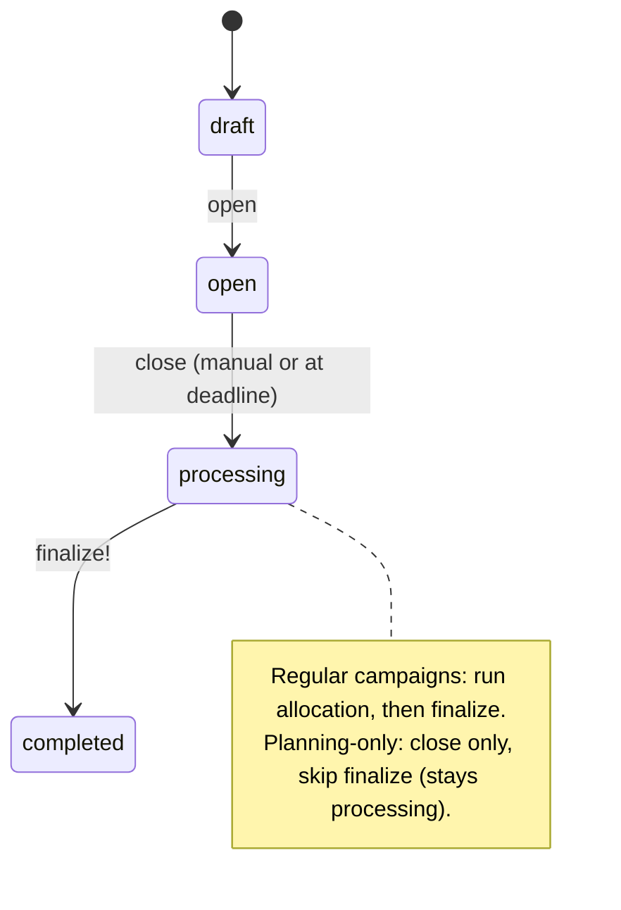
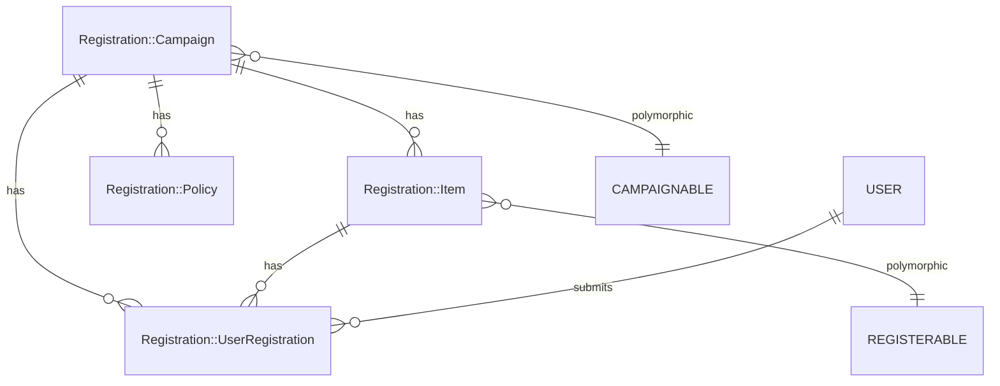
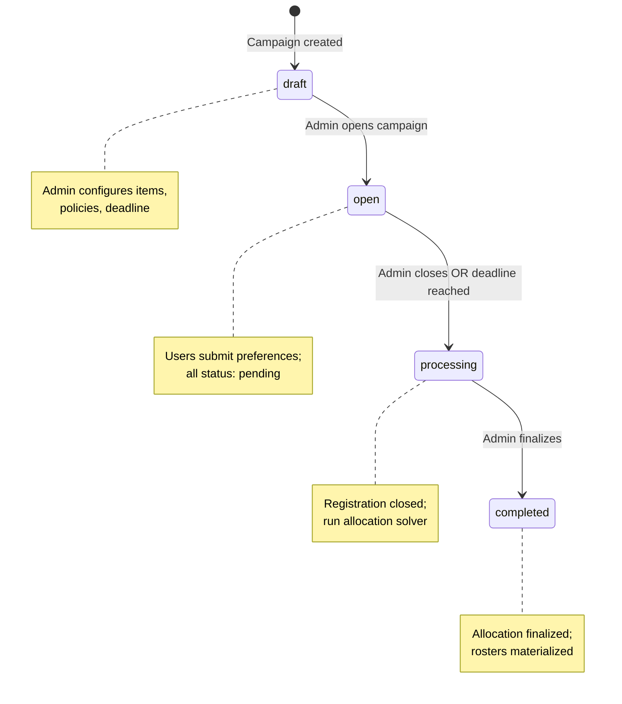
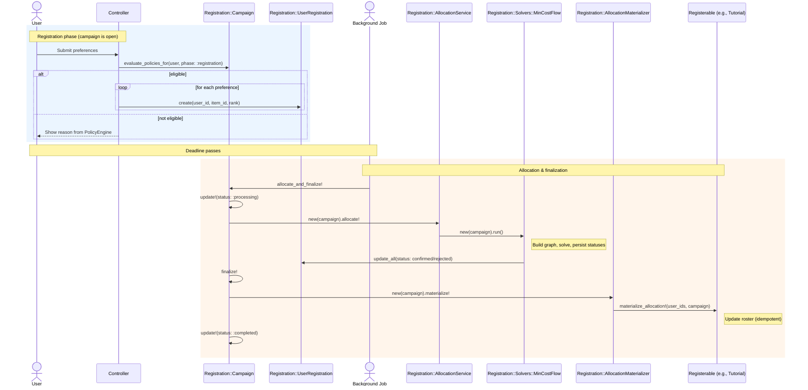
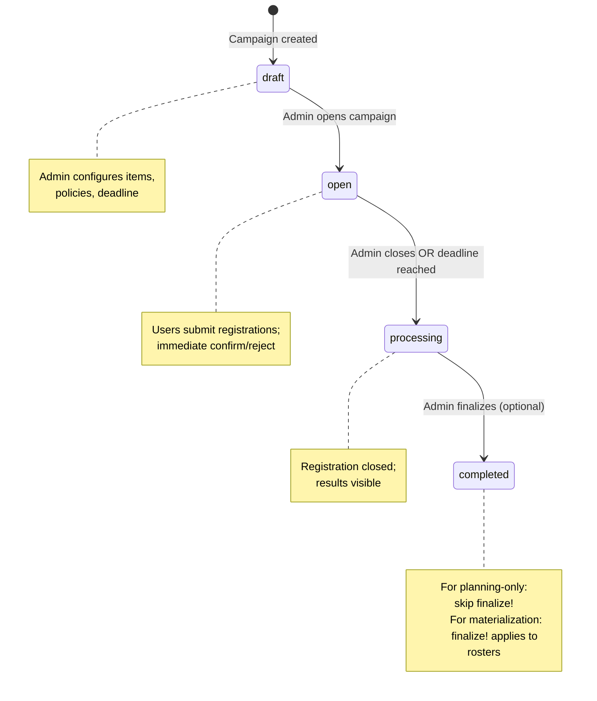
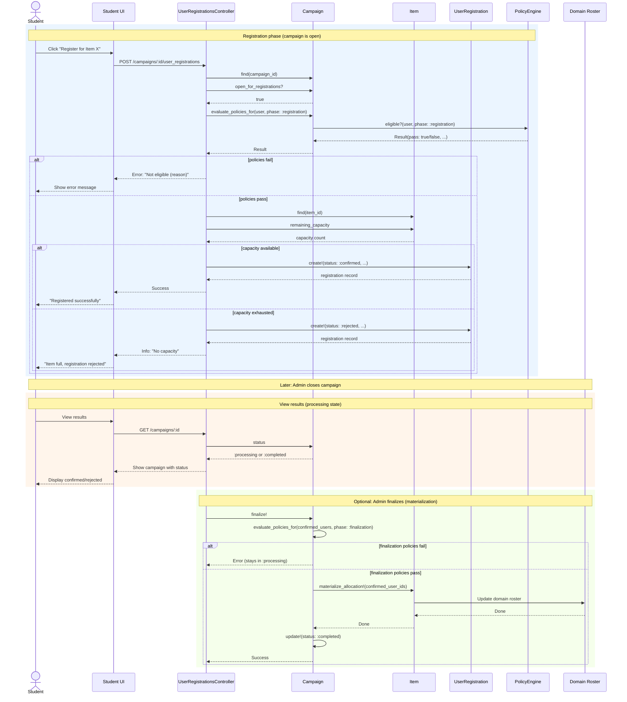

# Registration System

```admonish question "What is a 'Registration System'?"
A registration system manages time-bounded processes where users sign up for course-related activities with constraints and preferences.

- **Common Examples:** "Tutorial signup for Linear Algebra", "Seminar talk selection", "Exam registration with eligibility checks"
- **In this context:** A flexible campaign-based system supporting direct assignment, preference-based allocation, and composable eligibility policies with automated domain materialization.
```

## Problem Overview
MaMpf needs a flexible registration system to handle:
- **Regular courses:** Students register for tutorials within a lecture
- **Seminars:** Students register for talks within a seminar (special type of lecture)
- **Mixed scenarios:** Combining lecture enrollment with tutorial/talk assignment via a chained process

## Solution Architecture
We use a unified system with:
- **Registration Campaigns:** Time-bounded processes for registration
- **Polymorphic Design:** Any model can become registerable or campaignable (host campaigns)
- **Two-step Chaining:** Optional prerequisite campaigns (e.g., must register for seminar before selecting talks) implemented via a `prerequisite_campaign` policy
- **Allocation Persistence:** Store the final allocation (confirmed vs rejected) and optional per-item counters
- **Strategy Layer:** Pluggable solver for preference-based allocation (Min-Cost Flow now; CP-SAT later)
- **Domain Materialization (mandatory):** After allocation, propagate confirmed assignments back into domain models (e.g., populate talk speakers, tutorial rosters)
- **Registration Policies:** Composable eligibility rules (lecture performance, institutional email, prerequisite, etc.)
- **Policy Phases:** Policies declare a phase: `registration`, `finalization`, or `both`. Only policies applicable to the current phase are evaluated/enforced. See Lecture Performance → Certification (`05-lecture-performance.md`) for how finalization uses Certification.
- **Policy Engine:** Phase-aware evaluation of ordered active policies; short-circuits on first failure

---

```admonish tip "Glossary (Registration)"
- **Allocation mode:** Enum selecting `first_come_first_serve` or `preference_based`.
- **AllocationService:** Computes allocations (preference-based) via `allocate!`.
- **AllocationMaterializer:** Applies confirmed allocations to domain rosters.
- **Campaign methods:** `allocate!`, `finalize!`, `allocate_and_finalize!`.
- **Policy phases:** `registration` gates intake; `finalization` gates roster materialization; `both` applies in both places.
- **Assigned users:** Users with `confirmed` status in the registration system (`Registration::UserRegistration.confirmed`). This is registration-side data.
- **Allocated users:** Users materialized into the domain roster after finalization (`Tutorial#students`, `Talk#speakers`, etc.). This is domain-side data. After finalization, assigned and allocated should match.
```

```admonish tip "Related UI mockups"
- Campaigns index (lecture): [Campaigns index](../mockups/campaigns_index.html)
- Campaigns index (current term): [Campaigns index (current term)](../mockups/campaigns_index_current_term.html)
- Exam Registration (Show): [Exam Show](../mockups/campaigns_show_exam.html)
- Tutorial Registration (preference-based, open): [Tutorial Show (open)](../mockups/campaigns_show_tutorial_open.html)
- Tutorial Registration (preference-based, completed): [Tutorial Show (completed)](../mockups/campaigns_show_tutorial.html)
- Tutorial Registration (FCFS, open): [Tutorial FCFS Show (open)](../mockups/campaigns_show_tutorial_fcfs_open.html)
- Interest Registration (planning-only, draft): [Interest Show (draft)](../mockups/campaigns_show_interest_draft.html)
- Student Registration (Index – tabs): [Student index](../mockups/student_registration_index_tabs.html)
```

## Registration::Campaign (ActiveRecord Model)
**_The Registration Process Orchestrator_**

```admonish info "What it represents"
A time-bounded administrative process where users can register for specific items under a chosen mode.
```

```admonish tip "Think of it as"
“Tutorial Registration Week”, “Seminar Talk Selection Period”, “Exam Signup”
```

The main fields and methods of `Registration::Campaign` are:

| Name/Field                | Type/Kind         | Description                                                                                  |
|---------------------------|-------------------|----------------------------------------------------------------------------------------------|
| `campaignable_type`       | DB column         | Polymorphic type for the campaign host (e.g., Lecture)                                     |
| `campaignable_id`         | DB column         | Polymorphic ID for the campaign host                                                         |
| `title`                   | DB column         | Human-readable campaign title                                                                 |
| `allocation_mode`         | DB column (Enum)  | Registration mode: `first_come_first_serve` or `preference_based`                            |
| `status`                  | DB column (Enum)  | Campaign state: `draft`, `open`, `processing`, `completed`                                   |
| `planning_only`           | DB column (Bool)  | Planning/reporting only; prevents materialization/finalization (default: false)              |
| `registration_deadline`   | DB column         | Deadline for user registrations (registration requests)                                      |
| `registration_items`      | Association       | Items available for registration within this campaign                                        |
| `user_registrations`      | Association       | User registrations (registration requests) for this campaign                                 |
| `registration_policies`   | Association       | Eligibility and other policies attached to this campaign                                     |
| `evaluate_policies_for(user, phase: :registration)` | Method      | Returns a structured eligibility result for the given phase (delegates to Policy Engine)                         |
| `policies_satisfied?(user, phase: :registration)` | Method      | Boolean convenience that returns true when all applicable policies pass                                 |
| `open_for_registrations?` | Method            | Returns true if campaign is currently accepting registrations                                 |
| `allocate!`               | Method            | Computes allocation (preference-based) without materialization                               |
| `finalize!`               | Method            | Enforces finalization-phase policies, then materializes the latest allocation into domain rosters                                       |
| `allocate_and_finalize!`  | Method            | Convenience: computes allocation and then finalizes                                          |

```admonish note
Eligibility is not a single field or method, but is determined dynamically by evaluating all active `registration_policies` for the campaign using the `evaluate_policies_for(user, phase:)` method, which delegates to the phase-aware policy engine. Use `policies_satisfied?(user, phase:)` as a boolean convenience.
```

```admonish tip "API at a glance"
- `evaluate_policies_for(user, phase: :registration)` → Result (fields: `pass`, `failed_policy`, `trace`, `details`)
- `policies_satisfied?(user, phase: :registration)` → Boolean (`true` when all applicable policies pass)
- `open_for_registrations?` → Boolean (campaign currently accepts registrations)

 See also: Controller endpoints in [Controller Architecture → Registration Controllers](11-controllers.md#registration-controllers).
```

### Behavior Highlights

- Guards registration window (`open?`)
- Delegates fine-grained eligibility to ordered `RegistrationPolicies` via Policy Engine
- Triggers solver (preference-based) after close (often at/after deadline)
- Finalizes and materializes allocation once only (idempotent)

#### Assigned vs Unassigned

- Assigned: the student has exactly one `confirmed` `Registration::UserRegistration` in the campaign after allocation/close.
- Unassigned: the student participated (has registrations) but has zero `confirmed` entries. On close/finalization, any remaining `pending` entries are normalized to `rejected` so the state is explicit.
- No extra tables are required. Helper methods on `Registration::Campaign` can expose `unassigned_user_ids`, `unassigned_users`, and `unassigned_count` computed from `UserRegistration` records.

```admonish note "Status semantics"
Statuses are mode-specific:
- First-come-first-serve (FCFS): registrations are immediately `confirmed` or `rejected`.
- Preference-based: registrations are `pending` until allocation, then resolved to `confirmed` or `rejected` on finalize.

Do not overload `pending` to represent eligibility uncertainty in FCFS; use policy `details` (e.g., `stability`) purely for UI messaging.
```

#### Close vs Finalize

- **Close registration:** stops intake and edits; transitions `open → processing`.
  Used to lock the window early or when the deadline passes automatically.
- **Finalize results:** before materialization, evaluates all active policies whose phase is `finalization` or `both` for each confirmed user (via a `Registration::FinalizationGuard`). A `lecture_performance` policy in finalization phase requires `Certification=passed` for all confirmed users. If any user fails a finalization-phase policy (or has missing/pending certification) the process aborts and status remains `processing` for remediation. After passing guards, materializes confirmed results and transitions `processing → completed`.
- **Planning-only campaigns:** close only; do not call `finalize!`. Results remain in reporting tables and are not materialized. When `planning_only` is true, `finalize!`/`allocate_and_finalize!` are no-ops.
- **Lecture performance completeness checks:**
  - **Campaign save:** Warns if any students lack certifications (any phase with lecture_performance policy)
  - **Campaign open:** Hard-fails if any students have missing/pending certifications (registration or both phase)
  - **Campaign finalize:** Hard-fails if any confirmed registrants have missing/pending certifications (finalization or both phase); auto-rejects students with failed certifications

See also: Lecture Performance → Certification (`05-lecture-performance.md`).

```admonish tip "UI hooks for unassigned"
After completion, the Campaign Show can surface an "Unassigned registrants"
table (name, matriculation, top preferences) with actions to place users into
groups via Roster Maintenance. In roster screens, add a filter
"Candidates from campaign X" that lists these unassigned users for quick moves.
```

### Example Implementation (Phase-aware planned state)

```ruby
module Registration
  class Campaign < ApplicationRecord
    belongs_to :campaignable, polymorphic: true
    has_many :registration_items,
             class_name: "Registration::Item",
             dependent: :destroy
    has_many :user_registrations,
             class_name: "Registration::UserRegistration",
             dependent: :destroy
    has_many :registration_policies,
             class_name: "Registration::Policy",
             dependent: :destroy

    enum allocation_mode: { first_come_first_serve: 0, preference_based: 1 }
    enum status: { draft: 0, open: 1, processing: 2, completed: 3 }

    validates :title, :registration_deadline, presence: true
    validate :valid_status_transition, on: :update

    def evaluate_policies_for(user, phase: :registration)
      if phase == :registration
        return Registration::PolicyEngine::Result.new(pass: false, code: :campaign_not_open) unless open?
      end
      engine = Registration::PolicyEngine.new(self)
      engine.eligible?(user, phase: phase)
    end

    def policies_satisfied?(user, phase: :registration)
      evaluate_policies_for(user, phase: phase).pass
    end

    def open_for_registrations?
      open?
    end

    def finalize!
      return false if planning_only?
      return false unless open? || processing?
      Registration::FinalizationGuard.new(self).check!
      Registration::AllocationMaterializer.new(self).materialize!
      update!(status: :completed)
    end

    def allocate!
      return false unless preference_based? && open? && Time.current >= registration_deadline
      update!(status: :processing)
      Registration::AllocationService.new(self, strategy: :min_cost_flow).allocate!
      true
    end

    def allocate_and_finalize!
      return false if planning_only?
      return false unless allocate!
      finalize!
    end

    def close!
      update!(status: :processing) if status == "open"
    end

    private

    def valid_status_transition
      return unless status_changed?

      valid_transitions = {
        "draft" => ["open"],
        "open" => ["processing"],
        "processing" => ["completed"]
      }

      allowed = valid_transitions[status_was]
      return if allowed&.include?(status)

      errors.add(:status, "cannot transition from #{status_was} to #{status}")
    end
  end
end
```

The system automatically calls `close!` when `registration_deadline` is reached via a scheduled job.

### Usage Scenarios

```admonish info
Entry points: Teacher/Editor starts at Campaigns index; Student starts at
Student Registration index.
```

- A **"Tutorial Registration" campaign** is created for a `Lecture`. It's `preference_based` and allows students to rank their preferred tutorial slots. Items point to `Tutorial`. (Admin UI: [Tutorial Show (open)](../mockups/campaigns_show_tutorial_open.html); Student UI: [Show – preference-based](../mockups/student_registration.html), [Confirmation](../mockups/student_registration_confirmation.html))
- A **"Talk Assignment" campaign** is created for a `Lecture` (often a seminar). It's `preference_based` or `first_come_first_serve` and assigns talk slots. Items point to `Talk`.
- A **"Lecture Registration" campaign** is created for a `Lecture` (commonly seminars). It's typically `first_come_first_serve` and enrolls students directly. The single item points to the `Lecture`. (Student UI: [Show – FCFS](../mockups/student_registration_fcfs.html))
- A **"Seminar Enrollment" campaign** is created for a `Lecture` (acting as a seminar). It's `first_come_first_serve` to quickly fill the limited seminar seats. (Student UI: [Show – FCFS](../mockups/student_registration_fcfs.html))
- An **"Interest Registration" campaign** is created for a `Lecture` before the term to gauge demand (planning-only). It's `first_come_first_serve` with a very high capacity; when it ends, you do not call `finalize!`. Results are used for hiring/planning and are not materialized to rosters. (Admin UI: [Interest Show (draft)](../mockups/campaigns_show_interest_draft.html))
- An **"Exam Registration" campaign** is created for an `Exam`. It is `first_come_first_serve` and may include a `lecture_performance` policy (phase: `registration` or `both`) for advisory eligibility messaging; finalization enforces Certification=passed only if a finalization-phase `lecture_performance` policy exists. Items point to `Exam`. (Admin UI: [Exam Show](../mockups/campaigns_show_exam.html); Student UI: [Show – exam (FCFS)](../mockups/student_registration_fcfs_exam.html); see also [action required: institutional email](../mockups/student_registration_fcfs_exam_action_required_email.html))

---

### Planning-only campaigns (Interest Registration)

```admonish example "Planning-only Interest Registration"
Goal: Measure demand before a lecture starts to plan staffing (e.g., hire
tutors) without changing any rosters.

- Host: `Lecture` (campaignable).
- Items: Single item pointing to the `Lecture` (registerable).
- Mode: `first_come_first_serve`.
- Capacity: Very high (effectively unlimited) to capture demand signal.
- Timing: Open well before the term; close before main registrations.
- Finalization: Do not invoke `finalize!`. No domain materialization occurs.
- Reporting: Use counts from `Registration::UserRegistration` (e.g.,
  confirmed) for planning and exports.

See also the Campaigns index mockups where the planning-only row appears as
"Interest Registration" with a note like "Planning only; not materialized".
```

## Registration::Campaignable (Concern)
**_The Campaign Host_**

```admonish info "What it represents"
A role for domain models (like `Lecture`) that allows them to 'host' or own registration campaigns.
```

```admonish note "Think of it as"
The 'container' for a set of related registration campaigns. A lecture 'contains' the campaign for its tutorials.
```

#### Responsibilities

- Provides a central point for grouping related campaigns.
- Simplifies finding campaigns related to a specific object (e.g., all registrations for a given lecture).

#### Example Implementation

```ruby
# app/models/concerns/registration/campaignable.rb
module Registration
  module Campaignable
    extend ActiveSupport::Concern

    included do
      has_many :registration_campaigns,
               as: :campaignable,
               class_name: "Registration::Campaign",
               dependent: :destroy
    end
  end
end
```

#### Implementations Here
- **`Lecture`**: Hosts campaigns for its tutorials or talks.
- **`Exam`**: Hosts a campaign for exam seat registration.

---

## Registration::Item (ActiveRecord Model)
**_The Selectable Catalog Entry_**

```admonish info "What it represents"
A selectable entry in a `Registration::Campaign`'s "catalog". Each entry points to a real-world `Registerable` object (like a `Tutorial` or `Talk`).
```

```admonish note "Think of it as"
- **Restaurant Analogy:** An item on a restaurant menu. The `Registerable` is the actual dish prepared in the kitchen. The `RegistrationItem` is the line on the menu for a specific day (the campaign). You order from the menu, not by pointing at the dish in the kitchen.

- **Teaching Analogy:** A slot in the registration system. The `Registerable` is the actual tutorial group that meets every Monday at 10am. The `RegistrationItem` is the entry for that tutorial in this semester's "Linear Algebra" registration (the campaign). Students sign up for the slot in the system, not by walking into the classroom.
```

The main fields and methods of `Registration::Item` are:

| Name/Field                | Type/Kind         | Description                                                              |
|---------------------------|-------------------|--------------------------------------------------------------------------|
| `registration_campaign_id`| DB column         | Foreign key for the parent campaign.                                     |
| `registerable_type`       | DB column         | Polymorphic type for the registerable object (e.g., `Tutorial`).         |
| `registerable_id`         | DB column         | Polymorphic ID for the registerable object.                              |
| `registration_campaign`   | Association       | The parent `Registration::Campaign`.                                      |
| `registerable`            | Association       | The underlying domain object (e.g., a `Tutorial` instance).              |
| `user_registrations`      | Association       | All user registrations (registration requests) for this item.            |
| `assigned_users`          | Method            | Returns users with confirmed registration (registration system data).    |
| `capacity`                | Method            | The maximum number of users, delegated from the `registerable`.          |


```ruby
module Registration
  class Item < ApplicationRecord
    belongs_to :registration_campaign,
               class_name: "Registration::Campaign"
    belongs_to :registerable, polymorphic: true
    has_many :user_registrations,
             class_name: "Registration::UserRegistration",
             dependent: :destroy

    def assigned_users
      user_registrations.confirmed.includes(:user).map(&:user)
    end
  end
end
```

### Usage Scenarios

Each scenario below is the item-side view of the campaign types listed
earlier. The `Registration::Item` belongs to the associated campaign and
wraps the concrete `registerable` record that users ultimately get
assigned to.

- **For a "Tutorial Registration" campaign:** A `RegistrationItem` is created for each `Tutorial` (e.g., "Tutorial A (Mon 10:00)"). The `registerable` association points to the `Tutorial` record.
- **For a "Talk Assignment" campaign:** A `RegistrationItem` is created for each `Talk` (e.g., "Talk: Machine Learning Advances"). The `registerable` association points to the `Talk` record.
- **For a "Lecture Registration" campaign:** A `RegistrationItem` is created for the lecture itself. The `registerable` association points to the `Lecture` record. This will be useful mostly when the lecture is a seminar. `Lecture` then has a dual role: as campaignable and as registerable.
- **For an "Exam Registration" campaign:** A `RegistrationItem` is created for the exam itself. The `registerable` association points to the `Exam` record. The campaign's `campaignable` is the parent `Lecture`. Each exam (Hauptklausur, Nachklausur, Wiederholungsklausur) gets its own campaign hosted by the lecture, with that exam as the sole registerable item.

```admonish warning "Registration::Item vs. Registration::Registerable"
It's crucial to understand the difference between these two concepts:

- **`Registration::Registerable`** is the **actual domain object** that a user is ultimately assigned to. Think of it as the real-world entity, like a `Tutorial` or a `Talk`. It's a role provided by a concern.

- **`Registration::Item`** is a **proxy or wrapper** that makes a registerable object available within a specific campaign. Think of it as a "listing in a catalog." If you have a "Tutorial Registration" campaign, you create one `Registration::Item` for each `Tutorial` that students can sign up for in that campaign.

Users register for a `Registration::Item`, not directly for a `Registerable`. This separation allows the same `Tutorial` to potentially be part of different campaigns over time without conflict.
```

---

## Registration::Registerable (Concern)
**_The Registration Target_**

```admonish info "What it represents"
A role for domain models (like `Tutorial` or `Talk`) that allows them to be the ultimate target of a registration.
```

```admonish note "Think of it as"
The actual group or event a user is enrolled in, such as a specific tutorial group or being assigned as the speaker for a talk.
```

#### Responsibilities
- Provide a capacity (fixed column or computed).
- Implement `materialize_allocation!(user_ids:, campaign:)` to apply confirmed results idempotently.
- Remain agnostic of solver or eligibility logic.

#### Not Responsibilities
- Eligibility checks (policies handle that).
- Storing pending registrations (that’s `UserRegistration`).
- Orchestrating allocation (that's the `Registration::Campaign`).

#### Public Interface
| Method                                      | Purpose                                                | Required |
|---------------------------------------------|--------------------------------------------------------|----------|
| `capacity`                                  | Integer seat count.                                    | Yes      |
| `materialize_allocation!(user_ids:, campaign:)` | Persists the authoritative roster for this campaign.   | Yes      |
| `allocated_user_ids`                        | Current materialized users from domain roster (delegates to roster system). | Yes |
| `remaining_capacity`, `full?`               | Convenience derived helpers.                           | Optional |

#### Example Implementation

```ruby
# app/models/concerns/registration/registerable.rb
module Registration
  module Registerable
    extend ActiveSupport::Concern

    def capacity
      self[:capacity] || raise(NotImplementedError, "#{self.class} must define #capacity")
    end

    def allocated_user_ids
      raise NotImplementedError, "#{self.class} must implement #allocated_user_ids to delegate to roster"
    end

    def remaining_capacity
      [capacity - allocated_user_ids.size, 0].max
    end

    def full?
      remaining_capacity.zero?
    end

    def materialize_allocation!(user_ids:, campaign:)
      raise NotImplementedError, "#{self.class} must implement #materialize_allocation!"
    end
  end
end
```

#### Implementation Details

The `Registration::Item` model uses `belongs_to :registerable, polymorphic: true`. Any model that includes the `Registration::Registerable` concern (e.g., `Tutorial`, `Talk`) becomes a valid target for this association.

The `materialize_allocation!` method is the most critical part of the interface. It is responsible for taking the final list of `user_ids` from the allocation process and persisting them into the domain model's own roster.

This method **must be idempotent**, meaning running it multiple times with the same `user_ids` and `campaign` produces the same result. A common pattern is to first remove all roster entries associated with the given `campaign` and then add the new ones, all within a single database transaction. Concrete examples are shown in the `Tutorial` and `Talk` sections later in this document.

The `allocated_user_ids` method **must be implemented** by each registerable model to delegate to its roster system. This returns the current materialized roster (domain data), as opposed to `Registration::Item#assigned_users` which returns users with confirmed registrations (registration system data). After finalization, these should match.


#### Usage Scenarios
- A **`Tutorial`** includes `Registerable` to manage its student roster.
- A **`Talk`** includes `Registerable` to designate students as its speakers.
- A **`Lecture`** (acting as a seminar) includes `Registerable` to manage direct enrollment.
- A future **`Exam`** model would include `Registerable` to manage allocation for an exam.

---

## Registration::UserRegistration (ActiveRecord Model)
**_A User's Application for an Item_**

```admonish info "What it represents"
A record of a single user's application for a specific item within a campaign.
```

```admonish note "Think of it as"
A user's 'ballot' or 'application form' for one specific choice. In preference-based mode, it's one ranked choice on their list.
```

The main fields and methods of `Registration::UserRegistration` are:

| Name/Field                | Type/Kind         | Description                                                      |
|---------------------------|-------------------|------------------------------------------------------------------|
| `user_id`                 | DB column         | Foreign key for the user submitting.                             |
| `registration_campaign_id`| DB column         | Foreign key for the parent campaign.                             |
| `registration_item_id`    | DB column         | Foreign key for the selected item.                               |
| `status`                  | DB column (Enum)  | `pending`, `confirmed`, `rejected`.                              |
| `preference_rank`         | DB column         | Nullable integer for preference-based mode.                      |
| `user`                    | Association       | The user who submitted.                                          |
| `registration_campaign`   | Association       | The parent campaign.                                             |
| `registration_item`       | Association       | The selected item.                                               |

### Behavior Highlights
- The `status` tracks the lifecycle: `pending` (awaiting allocation), `confirmed` (successful), or `rejected` (unsuccessful).
- The `preference_rank` is only used in `preference_based` campaigns and must be unique per user within a campaign.
- In `first_come_first_serve` mode, a registration is typically created directly with `confirmed` status if capacity allows.
- Business logic should enforce that a user can only have one `confirmed` registration per campaign.

### Example Implementation
```ruby
module Registration
  class UserRegistration < ApplicationRecord
    belongs_to :user
    belongs_to :registration_campaign,
               class_name: "Registration::Campaign"
    belongs_to :registration_item,
               class_name: "Registration::Item"

    enum status: { pending: 0, confirmed: 1, rejected: 2 }

    validates :preference_rank,
              presence: true,
              if: -> { registration_campaign.preference_based? }
    validates :preference_rank,
              uniqueness: { scope: [:user_id, :registration_campaign_id] },
              allow_nil: true
  end
end
```

### Usage Scenarios
- **Preference-based:** Alice submits two `Registration::UserRegistration` records for a campaign: one for "Tutorial A" with `preference_rank: 1`, and one for "Tutorial B" with `preference_rank: 2`. Both have `status: :pending`.
- **First-Come-First-Serve:** Bob registers for the "Seminar Algebraic Geometry". A single `Registration::UserRegistration` record is created with `status: :confirmed` immediately, as long as there is capacity.

### First-Come-First-Serve Workflow

In FCFS mode, registration status is determined immediately upon submission:

**Controller Logic (recommended):**
```ruby
# app/controllers/registration/user_registrations_controller.rb
def create
  campaign = Registration::Campaign.find(params[:campaign_id])
  item = campaign.registration_items.find(params[:item_id])

  return unless campaign.policies_satisfied?(current_user, phase: :registration)

  status = item.remaining_capacity > 0 ? :confirmed : :rejected

  Registration::UserRegistration.create!(
    user: current_user,
    registration_campaign: campaign,
    registration_item: item,
    status: status,
    preference_rank: nil  # Not used in FCFS
  )
end
```

**Key Differences from Preference-Based:**

| Aspect | FCFS | Preference-Based |
|--------|------|------------------|
| Initial status | `:confirmed` or `:rejected` | Always `:pending` |
| When decided | Immediately on create | After allocation runs |
| Multiple items | User registers for ONE item | User ranks MULTIPLE items |
| Solver needed | No | Yes |
| Finalization | Optional (roster may already be live) | Required |

**Capacity Enforcement:**
- Check `item.remaining_capacity` before creating the registration
- If capacity exhausted, create with `status: :rejected` (no waitlist)
- Alternatively, return error and don't create record at all

---

## Registration::Policy (ActiveRecord Model)
**_A Composable Eligibility Rule_**

```admonish info "What it represents"
A single, configurable eligibility condition attached to a campaign.
```

```admonish note "Think of it as"
“One rule card” (lecture performance gate, email domain restriction, prerequisite confirmation).
```

The main fields and methods of `Registration::Policy` are:

| Name/Field                | Type/Kind         | Description                                                      |
|---------------------------|-------------------|------------------------------------------------------------------|
| `registration_campaign_id`| DB column         | Foreign key for the parent campaign.                             |
| `kind`                    | DB column (Enum)  | The type of rule to apply (e.g., `lecture_performance`).         |
| `phase`                   | DB column (Enum)  | `registration`, `finalization`, or `both`.                       |
| `config`                  | DB column (JSONB) | Parameters for the rule (e.g., `{ "allowed_domains": ["uni-heidelberg.de "] }`).          |
| `position`                | DB column         | The evaluation order for policies within a campaign.             |
| `active`                  | DB column         | A boolean to enable or disable the policy.                       |
| `registration_campaign`   | Association       | The parent `Registration::Campaign`.                              |
| `evaluate(user)`          | Method            | Evaluates the policy for a given user and returns a result hash. |


### Behavior Highlights
- Policies are evaluated in ascending `position` order.
- The `PolicyEngine` short-circuits on the first policy that fails.
- Returns a structured outcome (`{ pass: true/false, ... }`) for clear feedback.
- Adding a new rule type involves adding to the `kind` enum and implementing its logic in `evaluate`, with no schema changes required.

The `evaluate` method of a policy returns a hash. While the top-level structure is consistent (containing a boolean `pass` key), individual policies can enrich the result with a `details` hash, providing context-specific information. This is particularly useful for complex rules like lecture performance eligibility.

```admonish info "Lecture performance advisory payload"
For early exam registration messaging, the `lecture_performance` policy attaches a concise `details` hash (points, required_points, stability). Rich progress and "may still become eligible" guidance lives in the Lecture Performance views, not here.
```

### Example Implementation
```ruby
module Registration
  class Policy < ApplicationRecord
    belongs_to :registration_campaign,
               class_name: "Registration::Campaign"
    acts_as_list scope: :registration_campaign

    enum kind: {
      lecture_performance: "lecture_performance",
      institutional_email: "institutional_email",
      prerequisite_campaign: "prerequisite_campaign",
      custom_script: "custom_script"
    }

    enum phase: {
      registration: "registration",
      finalization: "finalization",
      both: "both"
    }

    scope :active, -> { where(active: true) }
    scope :for_phase, ->(p) { where(phase: ["both", p.to_s]) }

    def evaluate(user)
  case kind.to_sym
  when :lecture_performance then eval_lecture_performance(user)
      when :institutional_email then eval_email(user)
      when :prerequisite_campaign then eval_prereq(user)
      when :custom_script then eval_custom(user)
      else fail_result(:unknown_kind, "Unknown policy kind")
      end
    end

    private

    def pass_result(code = :ok, details = {})
      { pass: true, code: code, details: details }
    end

    def fail_result(code, message, details = {})
      { pass: false, code: code, message: message, details: details }
    end

    def eval_lecture_performance(user)
      lecture = Lecture.find(config["lecture_id"])

      cert = LecturePerformance::Certification.find_by(lecture: lecture, user: user)

      if cert&.passed?
        pass_result(:certification_passed)
      else
        fail_result(
          :certification_not_passed,
          "Lecture performance certification required",
          certification_status: cert&.status || :missing
        )
      end
    end

    def eval_email(user)
      allowed = Array(config["allowed_domains"])
      return pass_result(:no_constraint) if allowed.empty?
      domain = user.email.to_s.split("@").last
      if allowed.include?(domain)
        pass_result(:domain_ok)
      else
        fail_result(:domain_blocked, "Email domain not allowed",
                    domain: domain, allowed: allowed)
      end
    end

    def eval_prereq(user)
      prereq_id = config["prerequisite_campaign_id"]
      return fail_result(:missing_prerequisite_id, "No prerequisite specified") unless prereq_id

      prereq_campaign = Registration::Campaign.find_by(id: prereq_id)
      return fail_result(:prerequisite_not_found, "Prerequisite campaign not found") unless prereq_campaign

      lecture = prereq_campaign.campaignable
      ok = lecture.respond_to?(:roster) && lecture.roster.include?(user)

      ok ? pass_result(:prerequisite_ok) : fail_result(:prerequisite_missing, "Not on prerequisite roster")
    end

    def eval_custom(_user)
      pass_result(:custom_not_implemented)
    end
  end
end
```

```admonish tip "Policy config: typed UI, JSONB storage"
`config` is stored as JSONB for flexibility, but the UI must present
typed fields per policy kind. Do not expose raw JSON to end users. Normalize
inputs and validate per kind in the model. Controllers whitelist per-kind config keys.
```

### Policy Result Reference

Each policy kind returns a standardized result hash with optional `details`. The following table documents the expected `details` keys for each policy kind:

| Policy Kind | Success `details` Keys | Failure `details` Keys | Example |
|-------------|----------------------|----------------------|---------|
| `lecture_performance` | None | `certification_status` (`:missing`, `:pending`, `:failed`) | `{ certification_status: :pending }` |
| `institutional_email` | None | `domain` (string), `allowed` (array of strings) | `{ domain: "gmail.com", allowed: ["uni.edu"] }` |
| `prerequisite_campaign` | None | `prerequisite_campaign_id` (integer) | `{ prerequisite_campaign_id: 42 }` |
| `custom_script` | Defined by script | Defined by script | N/A (implementation-specific) |

All results include:
- `pass` (boolean): Whether the policy passed
- `code` (symbol): Machine-readable result code (e.g., `:certification_passed`, `:domain_blocked`)
- `message` (string, optional): Human-readable message (only on failure)
- `details` (hash, optional): Additional context as documented above

#### Why JSONB for Policy.config?

Policies are composable and heterogeneous. Each `kind` needs different
parameters (domains list, lecture reference, prerequisite campaign id,
future custom scripts). Using JSONB for `config` avoids schema churn and
lets us:

- Add new policy kinds without migrations.
- Evolve per-kind parameters independently.
- Keep the public API stable (`kind`, `config`), while the typed UI and
  per-kind validations enforce structure.

Constraints and guardrails:

- The UI is typed per kind; users never edit raw JSON.
- Models validate allowed keys and shapes per kind.
- Index JSONB keys if needed for queries (e.g., `config ->> 'lecture_id'`).
- Only minimal data belongs here. For exam eligibility, thresholds and
  criteria live in `LecturePerformance::Rule`; the policy stores only
  `{ "lecture_id": <id> }`.

See UI: Policies tab in [Exam Show](../mockups/campaigns_show_exam.html).

### Usage Scenarios
- **Email constraint:** `kind: :institutional_email`, `phase: :registration`, `config: { "allowed_domains": ["uni.edu"] }`
- **Lecture performance gate (advisory + enforcement):** `kind: :lecture_performance`, `phase: :both`, `config: { "lecture_id": 42 }`
- **Prerequisite:** `kind: :prerequisite_campaign`, `phase: :registration`, `config: { "prerequisite_campaign_id": 55 }`

---

## Registration::PolicyEngine (Service Object)
**_The Eligibility Pipeline_**

```admonish info "What it represents"
A service that evaluates a user's eligibility by processing all of a campaign's active policies in order.
```

```admonish note "Think of it as"
An 'eligibility checklist' processor that stops at the first failed check and provides a trace.
```

### Public Interface
| Method           | Purpose                                                              |
|------------------|----------------------------------------------------------------------|
| `initialize(campaign)` | Sets up the engine with the campaign whose policies will be used.    |
| `eligible?(user)`| Evaluates policies for the user and returns a structured `Result`.   |

### Behavior Highlights
- Iterates policies in `position` order.
- Stops at the first failure (fast fail).
- Returns a structured `Result` object containing the pass/fail status, the policy that failed (if any), and a full trace of all evaluations.
- This `Result` object is used by `Registration::Campaign#evaluate_policies_for` to provide clear feedback to the UI.

```admonish tip "Lecture performance: data completeness requirement"
Unlike other policies, `lecture_performance` requires data preparation before the phase starts. Campaign save/open/finalize will validate that all required certifications exist and are non-pending. See Lecture Performance chapter (05-lecture-performance.md) for pre-flight validation details.
```

```admonish tip "Freshness vs certification"
The `lecture_performance` policy checks the Certification table at runtime (no JIT recomputation during registration). Facts (Record) are updated by background jobs or teacher-triggered recomputation. This keeps registration fast and deterministic.
```

### Example Implementation
```ruby
module Registration
  class PolicyEngine
    Result = Struct.new(:pass, :failed_policy, :trace, keyword_init: true)

    def initialize(campaign)
      @campaign = campaign
    end

    def eligible?(user, phase: :registration)
      trace = []
      applicable = @campaign.registration_policies.active.for_phase(phase).order(:position)
      applicable.each do |policy|
        outcome = policy.evaluate(user)
        trace << { policy_id: policy.id, kind: policy.kind, phase: policy.phase, outcome: outcome }
        return Result.new(pass: false, failed_policy: policy, trace: trace) unless outcome[:pass]
      end
      Result.new(pass: true, failed_policy: nil, trace: trace)
    end
  end
end
```

### Usage Scenarios
- A trace showing two passed registration-phase policies and one failed policy produces a clear message to the user.
- A finalization guard iterates confirmed users with `phase: :finalization`; any failure aborts materialization.

---

## Registration::AllocationService (Service Object)
**_The Allocation Solver_**

```admonish info "What it represents"
A service object that encapsulates the complex logic of assigning users to items based on their preferences and a chosen strategy.
```

```admonish tip "Think of it as"
The 'brain' that solves the puzzle of who gets what in a preference-based campaign.
```

### Public Interface

| Method                          | Purpose                                                              |
|---------------------------------|----------------------------------------------------------------------|
| `initialize(campaign, strategy:)` | Sets up the service with a campaign and a specific allocation strategy. |
| `allocate!`                       | Executes the allocation logic based on the chosen strategy.          |

### Responsibilities

- Takes a `Registration::Campaign` as input.
- Gathers all `pending` `Registration::UserRegistration` records with their preference ranks.
- Gathers all `Registration::Item` records with their capacities.
- Executes a specific allocation strategy (e.g., Min-Cost Flow) to find an optimal assignment.
- Updates the `status` of each `Registration::UserRegistration` to either `:confirmed` or `:rejected` based on the solver's output.

### Not Responsibilities

- It does **not** materialize the results into the final domain models (e.g., `Tutorial` rosters). That is handled by the `AllocationMaterializer` called within `finalize!`. This keeps the concerns of "solving the assignment" and "persisting the results" separate.

### Implementation Details

The service uses a **Strategy Pattern** to delegate the actual solving to a dedicated class based on the chosen `strategy`. This allows for different solver implementations (e.g., Min-Cost Flow, CP-SAT) to be used interchangeably.

For a detailed breakdown of the graph modeling and solver implementation, see the [Allocation Algorithm Details](07-algorithm-details.md) chapter.

### Example Implementation

```ruby
# This service acts as a dispatcher for different solver strategies.
module Registration
  class AllocationService
    def initialize(campaign, strategy: :min_cost_flow, **opts)
      @campaign = campaign
      @strategy = strategy
      @opts = opts
    end

    def allocate!
      solver =
        case @strategy
        when :min_cost_flow then Registration::Solvers::MinCostFlow.new(@campaign, **@opts)
        # when :cp_sat then Registration::Solvers::CpSat.new(@campaign, **@opts) # Future
        else
          raise ArgumentError, "Unknown strategy: #{@strategy}"
        end
      solver.run
    end
  end
end

# Example of a concrete solver strategy class.
# See 07-algorithm-details.md for the full implementation.
module Registration
  module Solvers
    class MinCostFlow
      def initialize(campaign, **opts)
        @campaign = campaign
        # ... gather users, items, preferences ...
      end

      def run
        # 1. Build the graph model for the solver
        # 2. Solve the model
        # 3. Persist the results back to Registration::UserRegistration statuses
      end
    end
  end
end
```

### Usage Scenarios
- After the deadline for a `preference_based` tutorial registration campaign, a background job calls `Registration::AllocationService.new(campaign).allocate!`. The service runs the solver and updates thousands of `Registration::UserRegistration` records to either `:confirmed` or `:rejected`.
- An administrator manually triggers the assignment for a seminar's talk selection via a button in the UI, which in turn calls this service.

---

## Registration::AllocationMaterializer (Service Object)
**_The Roster Populator_**

```admonish info "What it represents"
A service that translates the final allocation results (`Registration::UserRegistration` statuses) into concrete domain rosters.
```

```admonish tip "Think of it as"
The "secretary" that takes the list of confirmed attendees from the registration system and updates the official class lists.
```

### Public Interface
| Method           | Purpose                                                              |
|------------------|----------------------------------------------------------------------|
| `initialize(campaign)` | Sets up the materializer with the campaign to be finalized.          |
| `materialize!`   | Executes the materialization process.                                |

### Responsibilities
- Gathers all `confirmed` `Registration::UserRegistration` records for the campaign.
- Groups them by their `Registration::Item`.
- For each `Registration::Item`, it calls `materialize_allocation!` on the underlying `registerable` object, passing the final list of user IDs.
- This process is the crucial hand-off from the temporary registration system to the permanent domain models.

### Example Implementation
```ruby
module Registration
  class AllocationMaterializer
    # Missing top-level docstring, please formulate one yourself 😁
    def initialize(campaign)
      @campaign = campaign
    end

    def materialize!
      registrations_by_item = @campaign.user_registrations
                                       .confirmed
                                       .includes(:registration_item)
                                       .group_by(&:registration_item)

      ActiveRecord::Base.transaction do
        registrations_by_item.each do |item, registrations|
          user_ids = registrations.map(&:user_id)
          item.registerable.materialize_allocation!(user_ids: user_ids, campaign: @campaign)
        end
      end
    end
  end
end
```

---

## Registration::FinalizationGuard (Service Object)
**_The Finalization Gatekeeper_**

```admonish info "What it represents"
Ensures every confirmed user passes all finalization-phase policies before roster materialization. For lecture_performance policies, enforces certification completeness and auto-rejects failed certifications.
```

### Public Interface
| Method           | Purpose |
|------------------|---------|
| `initialize(campaign)` | Prepare guard for a campaign. |
| `check!`         | Raises on first violation; returns true when all confirmed users pass. Auto-rejects students with failed lecture performance certifications. |

### Example Implementation
```ruby
module Registration
  class FinalizationGuard
    def initialize(campaign)
      @campaign = campaign
    end

    def check!
      policies = @campaign.registration_policies.active.for_phase(:finalization).order(:position)
      return true if policies.empty?

      confirmed = @campaign.user_registrations.confirmed.includes(:user)

      confirmed.each do |ur|
        user = ur.user
        policies.each do |policy|
          if policy.kind == "lecture_performance"
            lecture = Lecture.find(policy.config["lecture_id"])
            cert = LecturePerformance::Certification.find_by(lecture: lecture, user: user)

            if cert.nil? || cert.pending?
              raise StandardError, "Finalization blocked: certification missing or pending for user #{user.id}"
            elsif cert.failed?
              ur.update!(status: :rejected)
              next
            end
          else
            outcome = policy.evaluate(user)
            unless outcome[:pass]
              raise StandardError, "Finalization blocked by policy #{policy.id} (#{policy.kind})"
            end
          end
        end
      end
      true
    end
  end
end
```

### Behavior Highlights

- **Auto-reject failed certifications:** Students with `LecturePerformance::Certification.status == :failed` are automatically moved to `rejected` status
- **Hard-fail on missing/pending:** If any confirmed student has no certification or `status: :pending`, raise error and block finalization
- **Remediation UI trigger:** The error message should trigger UI showing which students need certification resolution
- **Other policies:** Evaluated normally; any failure blocks finalization

See also: Lecture Performance → Certification and Pre-flight Validation (`05-lecture-performance.md`).

---

## Enhanced Domain Models

The following sections describe how existing MaMpf models will be enhanced to integrate with the registration system.

### User (Enhanced)
**_The Registrant_**

```admonish info "What it represents"
Existing MaMpf user; no schema changes required.
```

#### Example Implementation
```ruby
class User < ApplicationRecord
  has_many :user_registrations,
       class_name: "Registration::UserRegistration",
       dependent: :destroy
  has_many :registration_campaigns,
       through: :user_registrations
  has_many :registration_items,
       through: :user_registrations
end
```

### Lecture (Enhanced)
**_The Primary Host and Seminar Target_**

```admonish info "What it represents"
- Existing MaMpf lecture model that can both host campaigns and be registered for.
```

#### Dual Role
- **As `Registration::Campaignable`**: Can organize tutorial registration or talk selection campaigns.
- **As `Registration::Registerable`**: Students can register for the lecture itself (common for seminars).

#### Example Implementation
```ruby
class Lecture < ApplicationRecord
  include Registration::Campaignable      # Can host campaigns for tutorials/talks
  include Registration::Registerable      # Can be registered for (seminar enrollment)
    # ... existing code ...

    # Implements the contract from the Registerable concern
    def materialize_allocation!(user_ids:, campaign:)
        # This method is the hand-off point to the roster management system.
        # Its responsibility is to take the final list of user IDs and
        # persist them as the official roster for this lecture (seminar),
        # sourced from this specific campaign.
        #
        # The concrete implementation using the Roster::Rosterable concern is detailed
        # in the "Allocation & Rosters" chapter.
    end
end
```

### Tutorial (Enhanced)
**_A Common Registration Target_**

```admonish info "What it represents"
Existing MaMpf tutorial model that students can register for.
```

#### Example Implementation
```ruby
class Tutorial < ApplicationRecord
  include Registration::Registerable
    # ... existing code ...

    # Implements the contract from the Registerable concern
    def materialize_allocation!(user_ids:, campaign:)
        # This method is the hand-off point to the roster management system.
        # Its responsibility is to take the final list of user IDs and
        # persist them as the official roster for this tutorial, sourced
        # from this specific campaign.
        #
        # The concrete implementation using the Roster::Rosterable concern is detailed
        # in the "Allocation & Rosters" chapter.
    end
end
```

### Talk (Enhanced)
**_A Target for Speaker Allocation_**

```admonish info "What it represents"
Existing MaMpf talk model that can be assigned to students.
```

#### Example Implementation
```ruby
class Talk < ApplicationRecord
  include Registration::Registerable
    # ... existing code ...

    # Implements the contract from the Registerable concern
    def materialize_allocation!(user_ids:, campaign:)
        # Similar to the Tutorial, this method hands off the final list
        # of speakers to the roster management system.
        #
        # The concrete implementation using the Roster::Rosterable concern is detailed
        # in the "Allocation & Rosters" chapter.
    end
end
```

---

## Campaign Lifecycle (State Diagram)



## ERD



## Preference-Based State Diagram



## Sequence Diagram (Preference-Based Flow)

This diagram shows the typical lifecycle for a preference-based campaign.



## FCFS State Diagram



## Sequence Diagram (FCFS Flow)

This diagram shows the lifecycle for a first-come-first-serve campaign.



---

## Proposed Folder Structure

To keep the new components organized according to Rails conventions, the new files would be placed as follows:

```text
app/
├── models/
│   ├── concerns/
│   │   └── registration/
│   │       ├── campaignable.rb
│   │       └── registerable.rb
│   └── registration/
│       ├── campaign.rb
│       ├── item.rb
│       ├── policy.rb
│       └── user_registration.rb
│
└── services/
  └── registration/
    ├── solvers/
    │   ├── min_cost_flow.rb
    │   └── cp_sat.rb (future)
    ├── allocation_service.rb
    ├── allocation_materializer.rb
    └── policy_engine.rb
```

This structure separates the ActiveRecord models, shared concerns, and business logic (service objects and solvers) into their conventional directories.

### Key Files
- `app/models/registration/campaign.rb` - Orchestrates the registration process
- `app/models/registration/user_registration.rb` - Records user registrations (registration requests)
- `app/models/registration/policy.rb` - Defines eligibility rules
- `app/services/registration/allocation_service.rb` - Runs allocation solver
- `app/services/registration/allocation_materializer.rb` - Persists results to domain models

---

## Database Tables

- `registration_campaigns` - Campaign orchestration records
- `registration_items` - Catalog entries linking campaigns to registerables
- `registration_user_registrations` - User registration request records with status and preference rank
- `registration_policies` - Eligibility rules with kind, phase, config, and position

```admonish note
Column details for each table are documented in the respective model sections above.
```