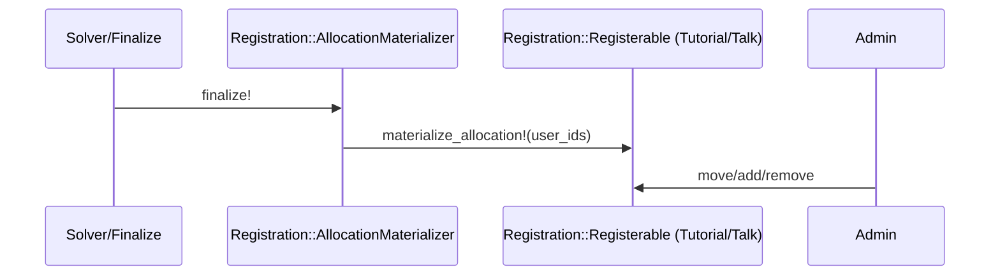

# Allocation & Rosters

## Problem Overview
- After campaigns are completed and allocations are materialized into domain models, staff must maintain real rosters.
- Typical actions: move users between tutorials/talks, add late-comers, remove dropouts, apply exceptional overrides.
- Non-goals: This system does not re-run the automated solver (`Registration::AssignmentService`) or reopen the campaign. It is strictly for manual roster adjustments after the initial allocation is complete.

## Solution Architecture
- Canonical source: domain rosters on registerables (e.g., Tutorial.students, Talk.speakers).
- Uniform API: Rosterable concern providing roster_user_ids, replace_roster!, add/remove helpers.
- Single service: RegisterableRosterService for atomic move/add/remove with capacity checks and logging.
- Campaign-independent: actions operate directly on registerables; no campaign required.
- Fast dashboards: maintenance service updates Registration::Item.assigned_count to reflect current roster sizes.
- Optional reflection: synchronize changes back to Registration::UserRegistration for reporting/auditing; not required for daily maintenance.

## 1) Domain Rosters — Source of Truth

```admonish info "What it represents"
- The canonical, ongoing enrollment lists after an allocation is finalized.
```

```admonish note "Think of it as"
- “Tutorial roster” (students in a tutorial), “Talk speakers” (assigned presenters).
```

Key fields (per registerable):
- capacity (integer)
- roster association (e.g., Tutorial.student_ids, Talk.speaker_ids)
- assigned_count on RegistrationItem (optional, denormalized for dashboards)

Behavior highlights:
- No campaign dependency: staff manage rosters directly on domain models.
- Actions include moving users between items, adding late-comers, removing dropouts.
- Capacity is enforced by the maintenance service (with optional override).
- Optional: reflect roster changes back to UserRegistration for reporting/audit.

Examples:
- Get a tutorial’s roster: tutorial.student_ids or tutorial.students
- Get a talk’s speakers: talk.speaker_ids or talk.speakers

---

## 2) Rosterable — Universal Roster API (Concern)

```admonish info "What it represents"
- A small adapter that gives any registerable model a uniform roster interface.
```

```admonish note "Think of it as"
- “The contract” required by the maintenance service and admin UI.
```

Key methods:
- roster_user_ids → Array<Integer>
- replace_roster!(user_ids:) → persist entire roster
- add_user_to_roster!(user_id)
- remove_user_from_roster!(user_id)

Materialization link:
- During allocation finalization the system calls `materialize_allocation!(user_ids:, campaign:)` on each registerable. For models including Rosterable, the recommended implementation is simply: `materialize_allocation!(...) { replace_roster!(user_ids: user_ids) }`, establishing the initial roster before any post-allocation admin adjustments.

Behavior highlights:
- Idempotent: calling replace with the same set does nothing.
- No capacity checks here; the service enforces capacity.

```ruby
# filepath: app/models/concerns/rosterable.rb
module Rosterable
	extend ActiveSupport::Concern

	# Must be implemented by including class:
	# - def capacity -> Integer
	# - def roster_user_ids -> Array<Integer>
	# - def replace_roster!(user_ids:) -> persist entire roster

	def add_user_to_roster!(user_id)
		ids = roster_user_ids
		return if ids.include?(user_id)
		replace_roster!(user_ids: ids + [user_id])
	end

	def remove_user_from_roster!(user_id)
		replace_roster!(user_ids: roster_user_ids - [user_id])
	end
end
```

Examples:
- Tutorial and Talk include Rosterable and define roster_user_ids/replace_roster!.

---

## 3) Talk — Rosterable Implementation

```admonish info "What it represents"
- A talk with one or more assigned speakers.
```

```admonish note "Think of it as"
- A roster of presenters.
```

Key fields:
- speaker_ids (HABTM or has_many through)

Behavior highlights:
- replace_roster! sets speaker_ids atomically.

```ruby
# filepath: app/models/talk.rb
class Talk < ApplicationRecord
	include Registration::Registerable
	include Rosterable

	# speakers: has_many association via speaker_ids (or similar)

	def roster_user_ids
		speaker_ids
	end

	def replace_roster!(user_ids:)
		self.speaker_ids = user_ids
		save! if changed?
	end
end
```

Examples:
- talk.add_user_to_roster!(user.id) adds a speaker.
- talk.remove_user_from_roster!(user.id) removes a speaker.

---

## 4) Tutorial — Rosterable Implementation

```admonish info "What it represents"
- A tutorial group with a student roster.
```

```admonish note "Think of it as"
- A class list.
```

Key fields:
- student_ids (HABTM) or a membership join table.

Behavior highlights:
- Works with either HABTM or custom membership table (adapt as needed).

```ruby
# filepath: app/models/tutorial.rb
class Tutorial < ApplicationRecord
	include Registration::Registerable
	include Rosterable

	# Example: HABTM students or a membership table

	def roster_user_ids
		student_ids # or tutorial_memberships.pluck(:user_id)
	end

	def replace_roster!(user_ids:)
		self.student_ids = user_ids
		save! if changed?
	end
end
```

Examples:
- tutorial.add_user_to_roster!(user.id) enrolls a student.
- tutorial.replace_roster!(user_ids: [a, b, c]) resets the roster.

---

## 5) RegisterableRosterService — Staff Maintenance

```admonish info "What it represents"
- The single place where staff-initiated roster changes are performed.
```

```admonish note "Think of it as"
- An admin “move/add/remove” service with capacity checks and logging.
```

```admonish note "How this is different from Registration::AssignmentService"
- `Registration::AssignmentService` is the **automated solver** that runs once to create the initial allocation during a campaign.
- `RegisterableRosterService` is the **manual tool** for staff to make individual changes to rosters *after* the campaign is finished.
```

Key methods:
- move_user!(user_id:, from:, to:, allow_overfill: false, reason: nil)
- add_user!(user_id:, to:, allow_overfill: false, reason: nil)
- remove_user!(user_id:, from:, reason: nil)

Behavior highlights:
- Transactional (atomic moves).
- Enforces capacity unless allow_overfill is true.
- Updates assigned_count on RegistrationItem (if present) to keep dashboards in sync.
- Logs each change (add basic auditing now; can add PaperTrail later).

```ruby
# filepath: app/services/registerable_roster_service.rb
class RegisterableRosterService
	def initialize(actor:)
		@actor = actor
	end

	def move_user!(user_id:, from:, to:, allow_overfill: false, reason: nil)
		raise ArgumentError, "type mismatch" unless from.class == to.class
		ActiveRecord::Base.transaction do
			enforce_capacity!(to) unless allow_overfill
			from.remove_user_from_roster!(user_id)
			to.add_user_to_roster!(user_id)
			touch_counts!(from, to)
			log(:move, user_id:, from:, to:, reason:)
		end
	end
```

---

## 6) Sequence (Placeholder)




