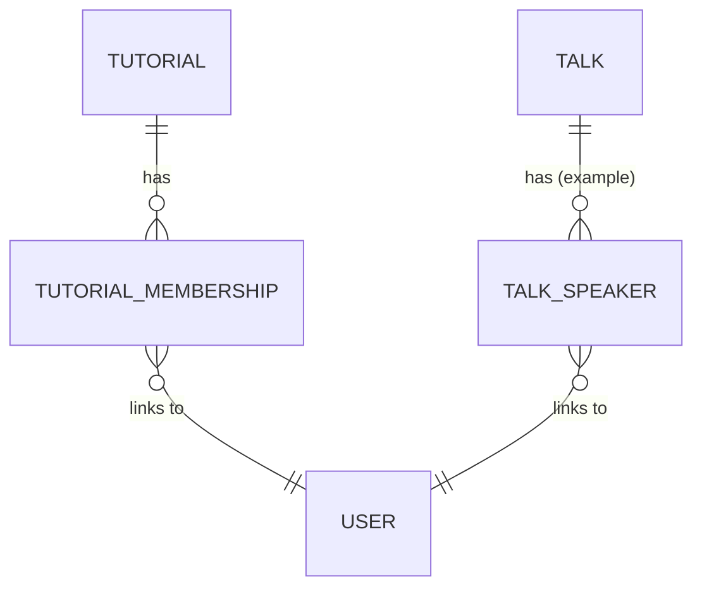
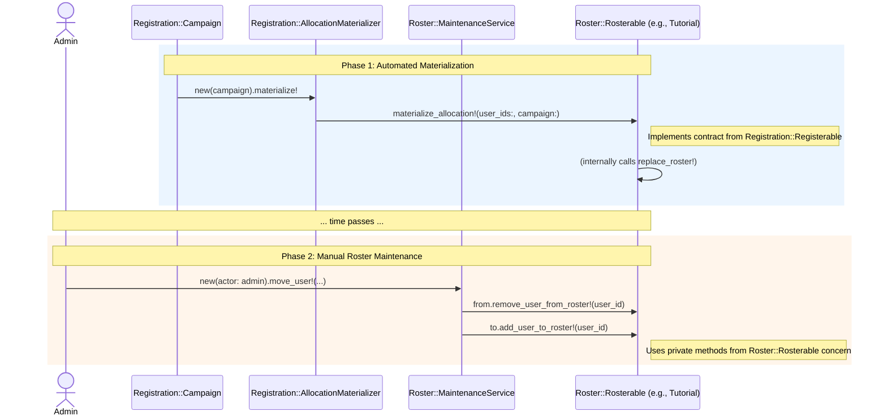

# Rosters

```admonish question "What is a 'Roster'?"
A "roster" is a list of names of people belonging to a particular group, team, or event.

- **Common Examples:** A class roster (a list of all students in a class), a team roster (a list of all players on a sports team), or a duty roster (a schedule showing who is working at what time).
- **In this context:** It refers to the official list of students enrolled in a tutorial or the list of speakers assigned to a seminar talk.
```

## Problem Overview
- After campaigns are completed and allocations are materialized into domain models, staff must maintain real rosters.
- Typical actions: move users between tutorials/talks, add late-comers, remove dropouts, apply exceptional overrides.
- Non-goals: This system does not re-run the automated solver (`Registration::AssignmentService`) or reopen the campaign. It is strictly for manual roster adjustments after the initial allocation is complete.

## Solution Architecture
- **Canonical Source:** Domain rosters on registerable models (e.g., `Tutorial.students`, `Talk.speakers`).
- **Uniform API:** A `Roster::Rosterable` concern provides a consistent interface (`roster_user_ids`, `replace_roster!`, etc.).
- **Single Service:** A `Roster::MaintenanceService` handles atomic moves, adds, and removals with capacity checks and logging.
- **Campaign-Independent:** Actions operate directly on `Roster::Rosterable` models; no campaign context is needed for manual changes.
- **Fast Dashboards:** The maintenance service can update denormalized counters like `Registration::Item.assigned_count` to keep UIs in sync.
- **Auditing (Future Enhancement):** The service includes a `log()` method as a hook for future auditing. This can be implemented later to write to a dedicated audit trail (e.g., a `RosterChangeEvent` model or using a gem like PaperTrail). This would provide a full history of all manual roster modifications, separate from the immutable record of the initial automated assignment stored in `Registration::UserRegistration`.

---

## Roster::Rosterable (Concern)
**_The Universal Roster API_**

```admonish info "What it represents"
A concern that gives any `Registration::Registerable` model a uniform roster management interface.
```

```admonish note "Think of it as"
The “contract” required by the maintenance service, defining how to read and write to a model's roster.
```

### Public Interface & Contract

| Method | Provided/Required | Description |
|---|---|---|
| `roster_user_ids` | **Required (Override)** | Returns the current list of user IDs on the roster as an `Array<Integer>`. |
| `replace_roster!(user_ids:)` | **Required (Override)** | Atomically replaces the entire roster with the given list of user IDs. |
| `add_user_to_roster!(user_id)` | Provided (private) | Adds a single user to the roster if not already present. |
| `remove_user_from_roster!(user_id)` | Provided (private) | Removes a single user from the roster. |

### Behavior Highlights
- **Explicit Contract:** The concern raises a `NotImplementedError` if an including class fails to override `#roster_user_ids` or `#replace_roster!`, ensuring the contract is met.
- **Idempotent:** Calling `replace_roster!` with the same set of IDs should result in no change.
// ...existing code...
### Example Implementation
```ruby
# filepath: app/models/concerns/roster/rosterable.rb
module Roster
  module Rosterable
    extend ActiveSupport::Concern

    # The including class MUST override the following public methods.
    def roster_user_ids
      raise NotImplementedError, "#{self.class.name} must implement #roster_user_ids"
    end

    def replace_roster!(user_ids:)
      raise NotImplementedError, "#{self.class.name} must implement #replace_roster!"
    end

    private

    def add_user_to_roster!(user_id)
      ids = roster_user_ids
      return if ids.include?(user_id)
      replace_roster!(user_ids: ids + [user_id])
    end

    def remove_user_from_roster!(user_id)
      replace_roster!(user_ids: roster_user_ids - [user_id])
    end
  end
end
```

### Usage Scenarios
- `Tutorial` and `Talk` both include `Roster::Rosterable`.
- `Tutorial` implements `roster_user_ids` by reading from its `tutorial_memberships` join table.
- `Talk` implements `replace_roster!` by setting its `speaker_ids` association.

---

## Roster::MaintenanceService 
**_Staff Maintenance_**

```admonish info "What it represents"
The single, safe entry point for all staff-initiated roster changes after an allocation is complete.
```

```admonish note "Think of it as"
An admin “move/add/remove” service with capacity checks and logging.
```

```admonish note "How this is different from Registration::AssignmentService"
- `Registration::AssignmentService` is the **automated solver** that runs once to create the initial allocation.
- `Roster::MaintenanceService` is the **manual tool** for staff to make individual changes to rosters *after* the campaign is finished.
```

### Public Interface

| Method | Description |
|---|---|
| `initialize(actor:)` | Sets up the service with the acting user for auditing. |
| `move_user!(user_id:, from:, to:, ...)` | Atomically moves a user from one `Roster::Rosterable` to another. |
| `add_user!(user_id:, to:, ...)` | Adds a user to a `Roster::Rosterable`. |
| `remove_user!(user_id:, from:, ...)` | Removes a user from a `Roster::Rosterable`. |

### Behavior Highlights
- **Transactional:** All operations, especially `move_user!`, are performed within a database transaction to ensure atomicity.
- **Capacity Enforcement:** Enforces the `capacity` of the target `Roster::Rosterable` unless an `allow_overfill: true` flag is passed.
- **Auditing Hook:** Calls a `log()` method to provide a hook for future audit trail implementation.
- **Denormalization:** Can update denormalized counters like `Registration::Item.assigned_count` to keep dashboards in sync.

### Example Implementation
```ruby
# filepath: app/services/roster/maintenance_service.rb
class Roster::MaintenanceService
  def initialize(actor:)
    @actor = actor
  end

  def move_user!(user_id:, from:, to:, allow_overfill: false, reason: nil)
    raise ArgumentError, "type mismatch" unless from.class == to.class
    ActiveRecord::Base.transaction do
      enforce_capacity!(to) unless allow_overfill
      from.send(:remove_user_from_roster!, user_id)
      to.send(:add_user_to_roster!, user_id)
      touch_counts!(from, to)
      log(:move, user_id: user_id, from: from, to: to, reason: reason)
    end
  end

  def add_user!(user_id:, to:, allow_overfill: false, reason: nil)
    ActiveRecord::Base.transaction do
      enforce_capacity!(to) unless allow_overfill
      to.send(:add_user_to_roster!, user_id)
      touch_counts!(to)
      log(:add, user_id: user_id, to: to, reason: reason)
    end
  end

  def remove_user!(user_id:, from:, reason: nil)
    ActiveRecord::Base.transaction do
      from.send(:remove_user_from_roster!, user_id)
      touch_counts!(from)
      log(:remove, user_id: user_id, from: from, reason: reason)
    end
  end

  private

  def enforce_capacity!(rosterable)
    raise "Capacity reached" if rosterable.full?
  end

  def touch_counts!(*rosterables)
    # Logic to find associated Registration::Items and update assigned_count
  end

  def log(action, **data)
    # Hook for future auditing (e.g., create RosterChangeEvent record)
  end
end
```

### Usage Scenarios
- **Moving a student:** An administrator moves a student from a full tutorial to one with free space.
  ```ruby
  service = Roster::MaintenanceService.new(actor: current_admin)
  tutorial_from = Tutorial.find(1)
  tutorial_to = Tutorial.find(2)
  student_id = 123
  service.move_user!(user_id: student_id, from: tutorial_from, to: tutorial_to, reason: "Balancing class sizes")
  ```

- **Adding a late-comer:** A student who missed the deadline is manually added to a tutorial.
  ```ruby
  service = Roster::MaintenanceService.new(actor: current_admin)
  tutorial = Tutorial.find(5)
  student_id = 456
  service.add_user!(user_id: student_id, to: tutorial, reason: "Late registration approved by professor")
  ```

- **Removing a dropout:** A student officially drops the course.
  ```ruby
  service = Roster::MaintenanceService.new(actor: current_admin)
  tutorial = Tutorial.find(3)
  student_id = 789
  service.remove_user!(user_id: student_id, from: tutorial, reason: "Student dropped course")
  ```

---

## Enhanced Domain Models

The following sections describe how existing MaMpf models are enhanced to integrate with the roster management system by implementing the `Rosterable` concern.

### Tutorial (Enhanced)
**_A Rosterable Target_**

```admonish info "What it represents"
An existing MaMpf tutorial model, enhanced to manage its student list.
```

#### Rosterable Implementation
The `Tutorial` model includes the `Roster::Rosterable` concern to provide a standard interface for managing its student roster via a join table.

| Method | Implementation Detail |
|---|---|
| `roster_user_ids` | Plucks `user_id`s from the `tutorial_memberships` join table. |
| `replace_roster!(user_ids:)` | Deletes existing memberships and creates new ones in a transaction. |

#### Example Implementation
```ruby
# filepath: app/models/tutorial.rb
class Tutorial < ApplicationRecord
  include Registration::Registerable
  include Roster::Rosterable

  has_many :tutorial_memberships, dependent: :destroy
  has_many :students, through: :tutorial_memberships, source: :user

  def roster_user_ids
    tutorial_memberships.pluck(:user_id)
  end

  def replace_roster!(user_ids:)
    TutorialMembership.transaction do
      tutorial_memberships.delete_all
      user_ids.each { |uid| tutorial_memberships.create!(user_id: uid) }
    end
  end
end
```

---

### Talk (Enhanced)
**_A Rosterable Target_**

```admonish info "What it represents"
An existing MaMpf talk model, enhanced to manage its speaker list.
```

#### Rosterable Implementation
The `Talk` model includes the `Roster::Rosterable` concern to provide a standard interface for managing its speakers.

| Method | Implementation Detail |
|---|---|
| `roster_user_ids` | Returns `speaker_ids` from its `has_many` association. |
| `replace_roster!(user_ids:)` | Sets the `speaker_ids` association directly. |

#### Example Implementation
```ruby
# filepath: app/models/talk.rb
class Talk < ApplicationRecord
  include Registration::Registerable
  include Roster::Rosterable

  def roster_user_ids
    speaker_ids
  end

  def replace_roster!(user_ids:)
    self.speaker_ids = user_ids
  end
end
```
---

## ERD for Roster Implementations

This diagram shows the concrete database relationships for the two example `Roster::Rosterable` implementations. The `Roster::Rosterable` concern provides a uniform API over these different underlying structures.



---

## Sequence Diagram

This diagram shows the two distinct phases: the initial, automated materialization of the roster, followed by ongoing manual maintenance by staff.



## Proposed Folder Structure

To keep the new components organized, the new files would be placed as follows:

```text
app/
├── models/
│   └── concerns/
│       └── roster/
│           └── rosterable.rb
│
└── services/
    └── roster/
        └── maintenance_service.rb

