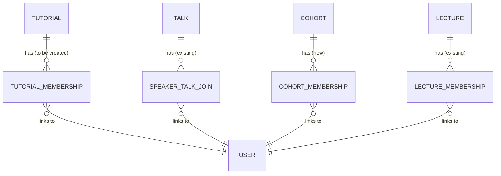
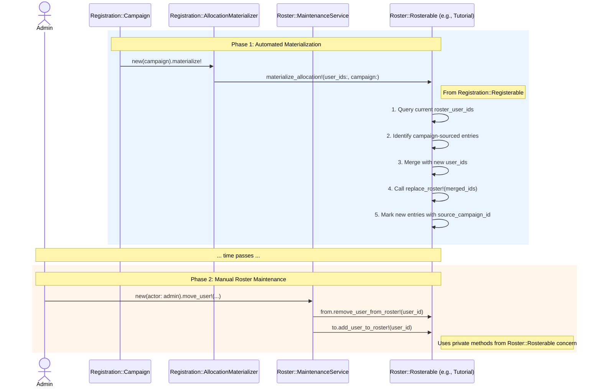

# Rosters

```admonish question "What is a 'Roster'?"
A "roster" is a list of names of people belonging to a particular group, team, or event.

- **Common Examples:** A class roster (a list of all students in a class), a team roster (a list of all players on a sports team), or a duty roster (a schedule showing who is working at what time).
- **In this context:** It refers to the official list of students enrolled in a tutorial or the list of speakers assigned to a seminar talk.
```

## The Core Concept: Lecture Roster as Superset

**Definition:**
The **Lecture Roster** (`lecture_memberships`) is the central registry for all students participating in a lecture. It acts as the single source of truth for authorization (who can access Moodle, videos, etc.) and communication.

**The Golden Rule:**
$$ \text{Members(Tutorials)} \cup \text{Members(Talks)} \subseteq \text{Members(Lecture)} $$

**Behavioral Invariants:**
1.  **Upstream Propagation (Addition):**
    When a student is added to an official sub-group (**Tutorial** or **Talk**), they are **automatically** added to the Lecture Roster.
2.  **Sticky Membership (Removal from Group):**
    When a student is removed from a sub-group, they remain on the Lecture Roster. They transition to an "Unassigned" state within the lecture context. This preserves their history and access rights during group switches.
3.  **Cascading Deletion (Removal from Lecture):**
    When a student is removed from the Lecture Roster, they are **automatically** removed from all associated sub-groups.

### Feature: Sidecar Rosters (Cohorts)
**Cohorts** function as "Sidecars". Unlike Tutorials or Talks, they satisfy the `Rosterable` interface but **do not** automatically propagate their members to the Lecture Roster.
- **Purpose:** Waitlists, Latecomer lists, organizational groups.
- **Access Rights:** Students in a Cohort *do not* receive automatic access rights to the lecture details (Moodle/Videos). They must be promoted to the Lecture Roster or a Tutorial to gain access.

## The Tracks

### A. The Group Track (Complex Courses)
*   **Use Case:** Large lectures with tutorials or seminars with multiple talks.
*   **Workflow:**
    1.  **Main Campaign:** Students register for Tutorials/Talks. Materialization grants them access via Upstream Propagation.
    2.  **Sidecars (Optional):** "Waitlist" or "Latecomer" Cohorts collect students separately. These students do not get access until staff manually moves them to a Tutorial.
*   **Result:** The Lecture Roster is the union of all Tutorials/Talks plus any manually added students.

### B. The Enrollment Track (Simple Courses)
*   **Use Case:** Seminars without subgroups, or lectures without tutorials.
*   **Workflow:**
    1.  **Main Campaign:** Students register for the **Lecture** directly.
    2.  **Repeaters:** Can be managed via a parallel Lecture Campaign (effectively merging them into the roster).
*   **Result:** The Lecture Roster contains the flat list of participants.

### Concurrent Lecture Campaigns

It is valid and supported to run a **Lecture Campaign** (a campaign targeting the Lecture itself) alongside Group Campaigns (targeting Tutorials/Talks).

*   **Purpose:** This serves to populate the Lecture Roster directly, without assigning students to a specific sub-group.
*   **Idempotency:** If a student registers for a Tutorial (Group Track) AND a Lecture Campaign (Enrollment Track), they are materialized into the Lecture Roster. The system handles this idempotently; they will simply exist on the roster and in the specific tutorial.
*   **Result:** These students appear as "Unassigned" in the Group Maintenance view (unless they also secured a group spot), effectively implementing a "Course Auditor" or "Waiting List" pattern.


---

## Roster::Rosterable (Concern)
**_The Universal Roster API_**

```admonish info "What it represents"
A concern that gives any `Registration::Registerable` model a uniform roster management interface.
```

```admonish note "Think of it as"
The “contract” required by the maintenance service, defining how to read and write to a model's roster.
```

### Public Interface & Contract

| Method | Provided/Required | Description |
|---|---|---|
| `roster_user_ids` | **Required (Override)** | Returns the current list of user IDs on the roster as an `Array<Integer>`. |
| `replace_roster!(user_ids:)` | **Required (Override)** | Atomically replaces the entire roster with the given list of user IDs. |
| `roster_entries` | **Required (Override)** | Returns an ActiveRecord relation to the join table for campaign tracking. |
| `mark_campaign_source!(user_ids, campaign)` | **Required (Override)** | Marks the given user roster entries as sourced from the specified campaign. |
| `allocated_user_ids` | Provided | Delegates to `roster_user_ids` to satisfy `Registration::Registerable` contract. |
| `materialize_allocation!(user_ids:, campaign:)` | Provided | Implements the allocation materialization from `Registration::Registerable`. |
| `add_user_to_roster!(user_id)` | Provided (private) | Adds a single user to the roster if not already present. |
| `remove_user_from_roster!(user_id)` | Provided (private) | Removes a single user from the roster. |

### Behavior Highlights
- **Explicit Contract:** The concern raises a `NotImplementedError` if an including class fails to override required methods (`#roster_user_ids`, `#replace_roster!`, `#roster_entries`, `#mark_campaign_source!`), ensuring the contract is met.
- **Idempotent:** Calling `replace_roster!` with the same set of IDs should result in no change.
- **Registration Integration:** Provides `allocated_user_ids` and `materialize_allocation!` to satisfy the `Registration::Registerable` interface, allowing rosters to be managed by the registration system.
- **Campaign Tracking:** The `materialize_allocation!` method preserves manually-added roster entries while replacing campaign-sourced entries, using the `source_campaign` field on join table records.

### Management Mode & Campaign Integration
The `Rosterable` concern introduces a `skip_campaigns` boolean flag to explicitly control the lifecycle of the roster.

- **Campaign Mode (`skip_campaigns: false`):** The roster is managed by registration campaigns. This is the default state. Even in campaign mode, manual adjustments (moves/adds) are allowed *after* the campaign is completed.
- **Direct Management (`skip_campaigns: true`):** The roster is managed exclusively by staff. Users can be added or removed directly at any time. This is intended for groups that will *never* be part of a registration campaign (e.g., special "late-comers" groups or directly managed seminars).
- **Transition Rules:**
  - **Campaign → Skip:** Only allowed if the group has **never** been part of a real (non-planning) campaign. Once a group is used in a campaign, it is locked into campaign mode to ensure the integrity of the allocation process.
  - **Skip → Campaign:** Only allowed if the roster is currently **empty**. This prevents data inconsistency where manually added students might be overwritten or ignored by the campaign allocation logic.

This flag serves as a safety guardrail, ensuring that items with existing memberships aren't accidentally attached to a campaign which might overwrite them.

### Example Implementation
```ruby
# filepath: app/models/concerns/roster/rosterable.rb
module Roster
  module Rosterable
    extend ActiveSupport::Concern

    def roster_user_ids
      raise NotImplementedError, "#{self.class.name} must implement #roster_user_ids"
    end

    def replace_roster!(user_ids:)
      raise NotImplementedError, "#{self.class.name} must implement #replace_roster!"
    end

    def allocated_user_ids
      roster_user_ids
    end

    def materialize_allocation!(user_ids:, campaign:)
      transaction do
        current_ids = roster_user_ids
        campaign_sourced_ids = current_ids.select do |uid|
          roster_entries.exists?(user_id: uid, source_campaign: campaign)
        end

        other_ids = current_ids - campaign_sourced_ids
        new_ids = (other_ids + user_ids).uniq

        replace_roster!(user_ids: new_ids)
        mark_campaign_source!(user_ids, campaign)
      end
    end

    private

    def add_user_to_roster!(user_id)
      ids = roster_user_ids
      return if ids.include?(user_id)
      replace_roster!(user_ids: ids + [user_id])
    end

    def remove_user_from_roster!(user_id)
      replace_roster!(user_ids: roster_user_ids - [user_id])
    end

    def roster_entries
      raise NotImplementedError, "#{self.class.name} must implement #roster_entries for campaign tracking"
    end

    def mark_campaign_source!(user_ids, campaign)
      raise NotImplementedError, "#{self.class.name} must implement #mark_campaign_source! for campaign tracking"
    end
  end
end
```

### Usage Scenarios
- `Tutorial` and `Talk` both include `Roster::Rosterable`.
- `Tutorial` implements `roster_user_ids` by reading from a new `tutorial_memberships` join table (to be created).
- `Talk` implements `replace_roster!` using its existing `speaker_talk_joins` association.

---

## Roster::MaintenanceService
**_Staff Maintenance_**

```admonish info "What it represents"
The single, safe entry point for all staff-initiated roster changes after an allocation is complete.
```

```admonish note "Think of it as"
An admin “move/add/remove” service with capacity checks and logging.
```

```admonish note "How this is different from Registration::AllocationService"
- `Registration::AllocationService` is the **automated solver** that runs once to create the initial allocation.
- `Roster::MaintenanceService` is the **manual tool** for staff to make individual changes to rosters *after* the campaign is finished.
```

### Public Interface

| Method | Description |
|---|---|
| `initialize(actor:)` | Sets up the service with the acting user for auditing. |
| `move_user!(user_id:, from:, to:, ...)` | Atomically moves a user from one `Roster::Rosterable` to another. |
| `add_user!(user_id:, to:, ...)` | Adds a user to a `Roster::Rosterable`. |
| `remove_user!(user_id:, from:, ...)` | Removes a user from a `Roster::Rosterable`. |

### Behavior Highlights
- **Transactional:** All operations, especially `move_user!`, are performed within a database transaction to ensure atomicity.
- **Capacity Enforcement:** Enforces the `capacity` of the target `Roster::Rosterable` unless an `allow_overfill: true` flag is passed.
- **Auditing Hook:** Calls a `log()` method to provide a hook for future audit trail implementation.
- **Denormalization:** Can update denormalized counters like `Registration::Item.assigned_count` to keep dashboards in sync.

### Example Implementation
```ruby
# filepath: app/services/roster/maintenance_service.rb
class Roster::MaintenanceService
  def initialize(actor:)
    @actor = actor
  end

  def move_user!(user_id:, from:, to:, allow_overfill: false, reason: nil)
    raise ArgumentError, "type mismatch" unless from.class == to.class
    ActiveRecord::Base.transaction do
      enforce_capacity!(to) unless allow_overfill
      from.send(:remove_user_from_roster!, user_id)
      to.send(:add_user_to_roster!, user_id)
      touch_counts!(from, to)
      log(:move, user_id: user_id, from: from, to: to, reason: reason)
    end
  end

  def add_user!(user_id:, to:, allow_overfill: false, reason: nil)
    ActiveRecord::Base.transaction do
      enforce_capacity!(to) unless allow_overfill
      to.send(:add_user_to_roster!, user_id)
      touch_counts!(to)
      log(:add, user_id: user_id, to: to, reason: reason)
    end
  end

  def remove_user!(user_id:, from:, reason: nil)
    ActiveRecord::Base.transaction do
      from.send(:remove_user_from_roster!, user_id)
      touch_counts!(from)
      log(:remove, user_id: user_id, from: from, reason: reason)
    end
  end

  private

  def enforce_capacity!(rosterable)
    raise "Capacity reached" if rosterable.full?
  end

  def touch_counts!(*rosterables)
    # Logic to find associated Registration::Items and update assigned_count
  end

  def log(action, **data)
    # Hook for future auditing (e.g., create RosterChangeEvent record)
  end
end
```

### Usage Scenarios
- **Moving a student:** An administrator moves a student from a full tutorial to one with free space.
  ```ruby
  service = Roster::MaintenanceService.new(actor: current_admin)
  tutorial_from = Tutorial.find(1)
  tutorial_to = Tutorial.find(2)
  student_id = 123
  service.move_user!(user_id: student_id, from: tutorial_from, to: tutorial_to, reason: "Balancing class sizes")
  ```

- **Adding a late-comer:** A student who missed the deadline is manually added to a tutorial.
  ```ruby
  service = Roster::MaintenanceService.new(actor: current_admin)
  tutorial = Tutorial.find(5)
  student_id = 456
  service.add_user!(user_id: student_id, to: tutorial, reason: "Late registration approved by professor")
  ```

- **Removing a dropout:** A student officially drops the course.
  ```ruby
  service = Roster::MaintenanceService.new(actor: current_admin)
  tutorial = Tutorial.find(3)
  student_id = 789
  service.remove_user!(user_id: student_id, from: tutorial, reason: "Student dropped course")
  ```

---

## Enhanced Domain Models

The following sections describe how existing MaMpf models are enhanced to integrate with the roster management system by implementing the `Rosterable` concern.

### Tutorial (Enhanced)
**_A Rosterable Target_**

```admonish info "What it represents"
An existing MaMpf tutorial model, enhanced to manage its student list.
```

#### Rosterable Implementation
The `Tutorial` model includes the `Roster::Rosterable` concern to provide a standard interface for managing its student roster via a join table.

| Method | Implementation Detail |
|---|---|
| `roster_user_ids` | Plucks `user_id`s from the `tutorial_memberships` join table (to be created). |
| `replace_roster!(user_ids:)` | Deletes existing memberships and creates new ones in a transaction. |

#### Example Implementation
```ruby
# filepath: app/models/tutorial.rb
class Tutorial < ApplicationRecord
  include Registration::Registerable
  include Roster::Rosterable

  has_many :tutorial_memberships, dependent: :destroy
  has_many :students, through: :tutorial_memberships, source: :user

  def roster_user_ids
    tutorial_memberships.pluck(:user_id)
  end

  def replace_roster!(user_ids:)
    TutorialMembership.transaction do
      tutorial_memberships.delete_all
      user_ids.each { |uid| tutorial_memberships.create!(user_id: uid) }
    end
  end

  def roster_entries
    tutorial_memberships
  end

  def mark_campaign_source!(user_ids, campaign)
    tutorial_memberships.where(user_id: user_ids)
                       .update_all(source_campaign_id: campaign.id)
  end
end
```

The `tutorial_memberships` table should include a `source_campaign_id` column (nullable) to track which campaign materialized each roster entry.

---

### Talk (Enhanced)
**_A Rosterable Target_**

```admonish info "What it represents"
An existing MaMpf talk model, enhanced to manage its speaker list.
```

#### Rosterable Implementation
The `Talk` model includes the `Roster::Rosterable` concern to provide a standard interface for managing its speakers.

| Method | Implementation Detail |
|---|---|
| `roster_user_ids` | Plucks `speaker_id`s from the `speaker_talk_joins` join table. |
| `replace_roster!(user_ids:)` | Deletes existing joins and creates new ones in a transaction. |

#### Example Implementation
```ruby
# filepath: app/models/talk.rb
class Talk < ApplicationRecord
  include Registration::Registerable
  include Roster::Rosterable

  has_many :speaker_talk_joins, dependent: :destroy
  has_many :speakers, through: :speaker_talk_joins

  def roster_user_ids
    speaker_talk_joins.pluck(:speaker_id)
  end

  def replace_roster!(user_ids:)
    SpeakerTalkJoin.transaction do
      speaker_talk_joins.delete_all
      user_ids.each { |uid| speaker_talk_joins.create!(speaker_id: uid) }
    end
  end

  def roster_entries
    speaker_talk_joins
  end

  def mark_campaign_source!(user_ids, campaign)
    speaker_talk_joins.where(speaker_id: user_ids)
                      .update_all(source_campaign_id: campaign.id)
  end
end
```

The `speaker_talk_joins` table should include a `source_campaign_id` column (nullable) to track which campaign materialized each speaker assignment.

---

### Cohort (Rosterable Implementation)
**_A Rosterable Target_**

```admonish info "What it represents"
A generic group of students, managed via `cohort_memberships`.
```

#### Rosterable Implementation
The `Cohort` model includes the `Roster::Rosterable` concern.

| Method | Implementation Detail |
|---|---|
| `roster_user_ids` | Plucks `user_id`s from the `cohort_memberships` join table. |
| `replace_roster!(user_ids:)` | Deletes existing memberships and creates new ones. |

#### Example Implementation
```ruby
class Cohort < ApplicationRecord
  include Registration::Registerable
  include Roster::Rosterable

  belongs_to :context, polymorphic: true
  has_many :cohort_memberships, dependent: :destroy
  has_many :members, through: :cohort_memberships, source: :user

  def roster_user_ids
    cohort_memberships.pluck(:user_id)
  end

  def replace_roster!(user_ids:)
    CohortMembership.transaction do
      cohort_memberships.delete_all
      user_ids.each { |uid| cohort_memberships.create!(user_id: uid) }
    end
  end

  def roster_entries
    cohort_memberships
  end

  def mark_campaign_source!(user_ids, campaign)
    cohort_memberships.where(user_id: user_ids)
                      .update_all(source_campaign_id: campaign.id)
  end
end
```

## ERD for Roster Implementations

This diagram shows the concrete database relationships for the `Roster::Rosterable` implementations. The `Roster::Rosterable` concern provides a uniform API over these different underlying structures.



---

## Sequence Diagram

This diagram shows the two distinct phases: the initial, automated materialization of the roster, followed by ongoing manual maintenance by staff.



## Proposed Folder Structure

To keep the new components organized, the new files would be placed as follows:

```text
app/
├── models/
│   └── concerns/
│       └── roster/
│           └── rosterable.rb
│
└── services/
    └── roster/
        └── maintenance_service.rb
```

### Key Files
- `app/models/concerns/roster/rosterable.rb` - Uniform roster API concern
- `app/services/roster/maintenance_service.rb` - Manual roster modification service

---

## Database Tables

The roster system doesn't introduce new database tables. Instead, it provides a uniform API over existing and to-be-created join tables:

- `tutorial_memberships` (to be created) - Join table for tutorial student rosters
- `speaker_talk_joins` (existing) - Join table for talk speaker assignments
- `cohort_memberships` (to be created) - Join table for cohort student memberships

```admonish note
The `Roster::Rosterable` concern provides a uniform interface (`roster_user_ids`, `replace_roster!`) regardless of the underlying table structure. Column details are shown in the example implementations above.
```

