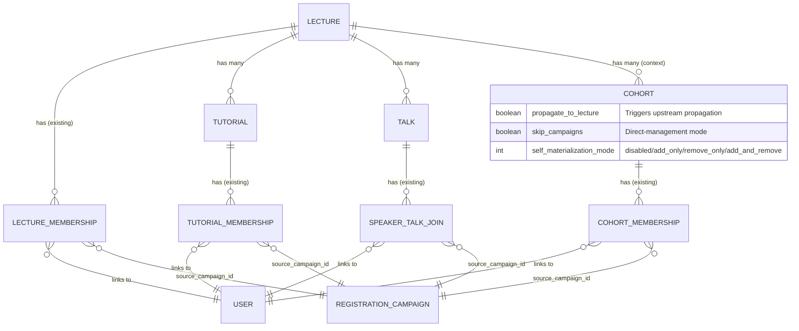
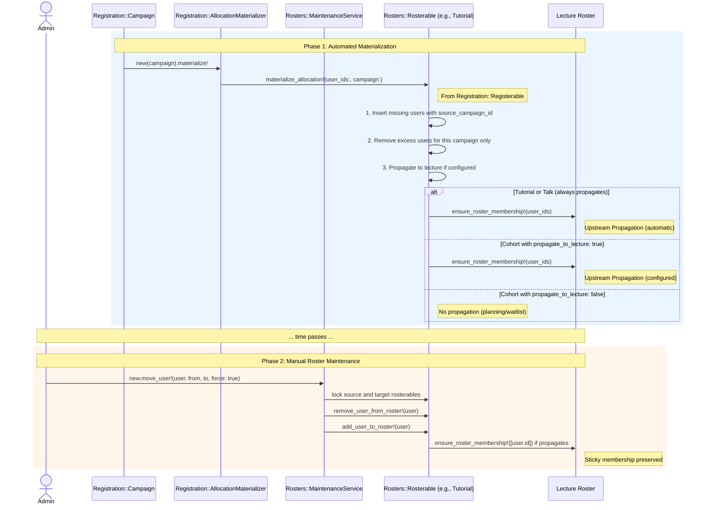

# Rosters

```admonish question "What is a 'Roster'?"
A "roster" is a list of names of people belonging to a particular group, team, or event.

- **Common Examples:** A class roster (a list of all students in a class), a team roster (a list of all players on a sports team), or a duty roster (a schedule showing who is working at what time).
- **In this context:** It refers to the official list of students enrolled in a tutorial or the list of speakers assigned to a seminar talk.
```

## The Core Concept: Lecture Roster as Superset

**Definition:**
The **Lecture Roster** (`lecture_memberships`) is the central registry for all students participating in a lecture. It acts as the single source of truth for authorization (who can access Moodle, videos, etc.) and communication.

**The Golden Rule:**
$$ \text{Current Group Members} \subseteq \text{Lecture Roster} $$

More precisely, the Lecture Roster contains **all current and former group members** due to sticky membership:
$$ \text{Lecture Roster} = \bigcup_{t \in \text{History}} \text{Members}_t(\text{Groups}) $$

**Behavioral Invariants:**
1.  **Upstream Propagation (Addition):**
    When a student is added to a group that propagates (**Tutorial**, **Talk**, or **Cohort with `propagate_to_lecture: true`**), they are **automatically** added to the Lecture Roster.
2.  **Sticky Membership (Removal from Group):**
    When a student is removed from a sub-group, they remain on the Lecture Roster. They transition to an "Unassigned" state within the lecture context. This preserves their history and access rights during group switches.
3.  **Cascading Deletion (Removal from Lecture):**
  When a student is removed from the Lecture Roster through roster maintenance, they are **automatically** removed from Tutorials, Talks, and propagating Cohorts of that lecture.

### Cohort Propagation
**Cohorts** are flexible groups with configurable propagation via the `propagate_to_lecture` flag:
- **Propagating Cohorts** (`propagate_to_lecture: true`): Behave like Tutorials/Talks. Membership grants lecture access.
  - Example: Cohorts used as the enrollment path for simple courses.
- **Non-Propagating Cohorts** (`propagate_to_lecture: false`): Act as "sidecars". Membership does NOT grant lecture access.
  - Example: Waitlists and planning cohorts.

**Implementation Mechanism:**
Propagation is implemented in roster service/concern code:
1. **Campaign materialization:** `Rosters::Rosterable#materialize_allocation!` adds missing group members and then calls `propagate_to_lecture!(...)` for propagating groups.
2. **Manual maintenance:** `Rosters::MaintenanceService#add_user!` and `#move_user!` call `propagate_to_lecture!(...)` after modifying a group.
3. **Group removal:** Removing a user from a sub-group does not remove them from the lecture roster, preserving sticky membership.

This ensures Cohorts seamlessly integrate with the Superset Model without requiring manual service calls.

## The Unified Model: All Materialization Flows Through Groups

**Core Principle:** In the supported workflow and UI, students enter the lecture roster via a **Group** (Tutorial, Talk, or Cohort). There is no direct lecture enrollment path in the UI; simple courses use a propagating Cohort.

### Pattern 1: Complex Courses (Tutorials/Talks)
*   **Use Case:** Large lectures with tutorials or seminars with multiple talks.
*   **Workflow:**
    1.  **Main Campaign:** Students register for Tutorials/Talks. Materialization grants them access via Upstream Propagation.
    2.  **Sidecars (Optional):** "Waitlist" or "Latecomer" Cohorts (`propagate_to_lecture: false`) collect students separately. These students do not get access until staff manually moves them to a Tutorial.
*   **Result:** The Lecture Roster is the union of all Tutorials/Talks plus any students from propagating cohorts.

### Pattern 2: Simple Courses (Enrollment Cohort)
*   **Use Case:** Lectures without tutorials (e.g., advanced seminars, standalone courses).
*   **Workflow:**
    1.  **Main Campaign:** Students register for a **Cohort** with `propagate_to_lecture: true`.
    2.  **Quick-Create:** Teacher creates this cohort via "Enable Simple Enrollment" button in Roster Overview.
*   **Result:** The Lecture Roster contains members of the enrollment cohort. Technically identical to Pattern 1 with one group.

### Pattern 3: Demand Forecasting (Planning Cohort)
*   **Use Case:** Gauge interest before the semester without granting access.
*   **Workflow:**
    1.  **Survey Campaign:** Students register for a **Cohort** with `propagate_to_lecture: false`.
    2.  **Repeatable:** Multiple non-propagating cohorts are allowed per lecture (e.g., "Oct Survey", "Nov Survey").
*   **Result:** Cohort roster is materialized but doesn't propagate to lecture. Used for staffing decisions.

### Mixing Patterns

It is valid to mix groups in one campaign:
*   **Tutorial + Waitlist Cohort:** Main allocation to tutorials, overflow to non-propagating waitlist.
*   **Talk + Audit Cohort:** Talk selection with audit listener option (non-propagating).
*   **Enrollment Cohort + Late Registration Cohort:** Multiple cohorts feeding into the same lecture.

**Key:** Propagation flag determines behavior. System handles idempotency automatically.


---

## Rosters::Rosterable (Concern)
**_The Universal Roster API_**

```admonish info "What it represents"
A concern that gives any `Registration::Registerable` model a uniform roster management interface.
```

```admonish note "Think of it as"
The “contract” required by the maintenance service, defining how to read and write to a model's roster.
```

### Public Interface & Contract

| Method | Provided/Required | Description |
|---|---|---|
| `roster_entries` | **Required (Override)** | Returns the ActiveRecord relation for the join table used as the roster. |
| `roster_user_id_column` | Provided / Optional Override | User foreign key on roster entries. Defaults to `:user_id`; `Talk` overrides it to `:speaker_id`. |
| `roster_association_name` | Provided / Optional Override | Association name used for loaded-count optimizations. |
| `allocated_user_ids` | Provided | Returns the current user IDs on the roster, satisfying the `Registration::Registerable` contract. |
| `materialize_allocation!(user_ids:, campaign:)` | Provided | Implements the allocation materialization from `Registration::Registerable`. |
| `add_user_to_roster!(user, source_campaign = nil)` | Provided | Adds a single user to the roster. |
| `remove_user_from_roster!(user)` | Provided | Removes a single user from the roster. |
| `propagate_to_lecture!(user_ids)` | Provided | Propagates users to the lecture roster when the group is configured to do so. |
| `full?`, `over_capacity?` | Provided | Capacity helpers based on the current roster. |
| `locked?` | Provided | Returns whether manual maintenance is currently blocked. |
| `in_campaign?`, `in_completed_campaign?` | Provided | Helpers describing campaign association state. |
| `can_skip_campaigns?`, `can_unskip_campaigns?` | Provided | Guardrail helpers for toggling management mode. |
| `self_materialization_mode` | Provided (enum) | Controls student self-service roster access: `disabled`, `add_only`, `remove_only`, `add_and_remove`. |
| `destructible?` | Provided | Returns whether the group can be safely destroyed. |

### Behavior Highlights
- **Explicit Contract:** The concern requires `#roster_entries`. Optional overrides exist for nonstandard user-key or association names.
- **Registration Integration:** Provides `allocated_user_ids` and `materialize_allocation!` to satisfy the `Registration::Registerable` interface, allowing rosters to be managed by the registration system.
- **Campaign Tracking:** The `materialize_allocation!` method adds missing users with `source_campaign_id`, removes excess users for the same campaign only, and preserves manually-added entries or entries from other campaigns.
- **Self-Materialization:** The current implementation provides the `self_materialization_mode` enum and validation rules. Student-facing join/leave operations are not implemented in this concern yet.

### Management Mode & Campaign Integration
The `Rosterable` concern introduces a `skip_campaigns` boolean flag to explicitly control the lifecycle of the roster.

- **Campaign Mode (`skip_campaigns: false`):** The roster is managed by registration campaigns. This is the default state for registerables. Manual adjustments are blocked while the item is locked and become available after a completed campaign.
- **Direct Management (`skip_campaigns: true`):** The roster is managed exclusively by staff. Users can be added or removed directly at any time. This is intended for groups that will *never* be part of a registration campaign (e.g., special "late-comers" groups or directly managed seminars).
- **Transition Rules:**
  - **Campaign → Skip:** Only allowed if the group has **never** been part of a campaign. Once a group is used in a campaign, it is locked into campaign mode to ensure the integrity of the allocation process.
  - **Skip → Campaign:** Only allowed if the roster is currently **empty**. This prevents data inconsistency where manually added students might be overwritten or ignored by the campaign allocation logic.

Enabling `self_materialization_mode` on a group that is not already in a campaign auto-enables `skip_campaigns`, so direct student access and campaign management are not enabled together.

This flag serves as a safety guardrail, ensuring that items with existing memberships aren't accidentally attached to a campaign which might overwrite them.

### Example Implementation
```ruby
# filepath: app/models/rosters/rosterable.rb
module Rosters
  module Rosterable
    extend ActiveSupport::Concern

    included do
      def roster_entries
        raise(NotImplementedError, "#{self.class} must implement #roster_entries")
      end

      def roster_user_id_column
        :user_id
      end

      def roster_association_name
        :"#{self.class.name.underscore}_memberships"
      end

      enum :self_materialization_mode, {
        disabled: 0,
        add_only: 1,
        remove_only: 2,
        add_and_remove: 3
      }, prefix: true

      before_validation :enforce_consistency_between_modes
      validate :validate_skip_campaigns_switch
      validate :validate_self_materialization_switch
    end

    def allocated_user_ids
      roster_entries.pluck(roster_user_id_column)
    end

    def materialize_allocation!(user_ids:, campaign:)
      transaction do
        current_ids = roster_entries.pluck(roster_user_id_column)
        target_ids = user_ids.uniq

        add_missing_users!(target_ids, current_ids, campaign)
        remove_excess_users!(target_ids, campaign)
        propagate_to_lecture!(target_ids)
      end
    end

    def add_user_to_roster!(user, source_campaign = nil)
      roster_entries.create!(
        roster_user_id_column => user.id,
        :source_campaign => source_campaign
      )
    end

    def remove_user_from_roster!(user)
      roster_entries.find_by(roster_user_id_column => user.id)&.destroy
    end

    private

    def add_missing_users!(target_ids, current_ids, campaign)
      # omitted
    end
  end
end
```

### Usage Scenarios
- `Tutorial`, `Talk`, `Cohort`, and `Lecture` all include `Rosters::Rosterable`.
- `Tutorial`, `Cohort`, and `Lecture` use the default `user_id` roster column and mainly implement `roster_entries`.
- `Talk` overrides `roster_user_id_column` to `:speaker_id` and `roster_association_name` to `:speaker_talk_joins`.

---

## Rosters::MaintenanceService
**_Staff Maintenance_**

```admonish info "What it represents"
The single, safe entry point for all staff-initiated roster changes after an allocation is complete.
```

```admonish note "Think of it as"
An admin “move/add/remove” service with capacity checks and propagation handling.
```

```admonish note "How this is different from Registration::AllocationService"
- `Registration::AllocationService` is the **automated solver** that runs once to create the initial allocation.
- `Rosters::MaintenanceService` is the **manual tool** for staff to make individual changes to rosters after allocation and in direct-management flows.
```

### Public Interface

| Method | Description |
|---|---|
| `add_user!(user, rosterable, force: false)` | Adds a user to a rosterable, optionally bypassing capacity checks. |
| `remove_user!(user, rosterable)` | Removes a user from a rosterable. |
| `move_user!(user, from_rosterable, to_rosterable, force: false)` | Atomically moves a user between two rosterables. |

### Behavior Highlights
- **Transactional:** All operations, especially `move_user!`, are performed within a database transaction to ensure atomicity.
- **Locking:** Locks one or two rosterables in a stable order to avoid race conditions during manual changes.
- **Capacity Enforcement:** Enforces the `capacity` of the target rosterable unless a `force: true` flag is passed.
- **Tutorial Uniqueness:** Prevents a user from being in multiple tutorials of the same lecture.
- **Propagation:** Adding or moving into a propagating group also ensures lecture-roster membership.
- **Lecture Removal Cascade:** Removing a user from the lecture roster removes them from tutorials, talks, and propagating cohorts of that lecture.
- **Materialization Tracking:** Manual additions update `materialized_at` for matching registration records on items associated with the target rosterable.

### Example Implementation
```ruby
# filepath: app/models/rosters/maintenance_service.rb
module Rosters
  class MaintenanceService
    class CapacityExceededError < StandardError; end

    def add_user!(user, rosterable, force: false)
      rosterable.with_lock do
        add_user_without_lock!(user, rosterable, force: force)
      end
    end

    def move_user!(user, from_rosterable, to_rosterable, force: false)
      lock_rosterables_in_order(from_rosterable, to_rosterable) do
        remove_user_without_lock!(user, from_rosterable)
        add_user_without_lock!(user, to_rosterable, force: force)
      end
    end
  end
end
```

### Usage Scenarios
- **Moving a student:** An administrator moves a student from a full tutorial to one with free space.
  ```ruby
  service = Rosters::MaintenanceService.new
  tutorial_from = Tutorial.find(1)
  tutorial_to = Tutorial.find(2)
  student = User.find(123)
  service.move_user!(student, tutorial_from, tutorial_to, force: true)
  ```

- **Adding a late-comer:** A student who missed the deadline is manually added to a tutorial.
  ```ruby
  service = Rosters::MaintenanceService.new
  tutorial = Tutorial.find(5)
  student = User.find(456)
  service.add_user!(student, tutorial, force: true)
  ```

- **Removing a dropout:** A student officially drops the course.
  ```ruby
  service = Rosters::MaintenanceService.new
  tutorial = Tutorial.find(3)
  student = User.find(789)
  service.remove_user!(student, tutorial)
  ```

---

## Enhanced Domain Models

The following sections describe how existing MaMpf models are enhanced to integrate with the roster management system by implementing the `Rosterable` concern.

### Tutorial (Enhanced)
**_A Rosterable Target_**

```admonish info "What it represents"
An existing MaMpf tutorial model, enhanced to manage its student list.
```

#### Rosterable Implementation
The `Tutorial` model includes the `Rosters::Rosterable` concern.

| Method | Implementation Detail |
|---|---|
| `roster_entries` | Returns the `tutorial_memberships` relation. |
| `materialize_allocation!` | Extends the default implementation by first removing the user from sibling tutorials of the same lecture. |

#### Example Implementation
```ruby
# filepath: app/models/tutorial.rb
class Tutorial < ApplicationRecord
  include Registration::Registerable
  include Rosters::Rosterable

  has_many :tutorial_memberships, dependent: :destroy
  has_many :members, through: :tutorial_memberships, source: :user

  def roster_entries
    tutorial_memberships
  end

  def materialize_allocation!(user_ids:, campaign:)
    transaction do
      enforce_lecture_uniqueness!(user_ids)
      super
    end
  end
end
```

The `tutorial_memberships` table already includes a `source_campaign_id` column to track which campaign materialized each roster entry.

---

### Talk (Enhanced)
**_A Rosterable Target_**

```admonish info "What it represents"
An existing MaMpf talk model, enhanced to manage its speaker list.
```

#### Rosterable Implementation
The `Talk` model includes the `Rosters::Rosterable` concern.

| Method | Implementation Detail |
|---|---|
| `roster_entries` | Returns the `speaker_talk_joins` relation. |
| `roster_user_id_column` | Overrides the default to `:speaker_id`. |
| `roster_association_name` | Overrides the default to `:speaker_talk_joins`. |

#### Example Implementation
```ruby
# filepath: app/models/talk.rb
class Talk < ApplicationRecord
  include Registration::Registerable
  include Rosters::Rosterable

  has_many :speaker_talk_joins, dependent: :destroy
  has_many :speakers, through: :speaker_talk_joins
  has_many :members, through: :speaker_talk_joins, source: :speaker

  def roster_entries
    speaker_talk_joins
  end

  def roster_user_id_column
    :speaker_id
  end

  def roster_association_name
    :speaker_talk_joins
  end
end
```

The `speaker_talk_joins` table already includes a `source_campaign_id` column to track which campaign materialized each speaker assignment.

---

### Cohort (Rosterable Implementation)
**_A Rosterable Target_**

```admonish info "What it represents"
A generic group of students, managed via `cohort_memberships`.
```

#### Rosterable Implementation
The `Cohort` model includes the `Rosters::Rosterable` concern.

| Method | Implementation Detail |
|---|---|
| `roster_entries` | Returns the `cohort_memberships` relation. |
| `lecture` | Returns the lecture context when the cohort belongs to a lecture. |

#### Example Implementation
```ruby
class Cohort < ApplicationRecord
  include Registration::Registerable
  include Rosters::Rosterable

  belongs_to :context, polymorphic: true
  has_many :cohort_memberships, dependent: :destroy
  has_many :users, through: :cohort_memberships
  has_many :members, through: :cohort_memberships, source: :user

  def roster_entries
    cohort_memberships
  end

  def lecture
    context if context.is_a?(Lecture)
  end
end
```

---

### Lecture (Enhanced)
**_The Central Roster Hub_**

```admonish info "What it represents"
The lecture roster is the authoritative list of all students with access to lecture materials, Moodle, videos, etc. It serves as the **superset** that all sub-group rosters (Tutorials, Talks, Cohorts) propagate into.
```

#### Rosterable Implementation
The `Lecture` model includes the `Rosters::Rosterable` concern to manage the central student roster.

| Method | Implementation Detail |
|---|---|
| `roster_entries` | Returns the `lecture_memberships` relation. |
| `ensure_roster_membership!(user_ids)` | Efficiently inserts missing lecture memberships without duplicating existing rows. |

#### Behavioral Notes
- **Never Materialized Directly:** Lectures do NOT include `Registration::Registerable`. They only receive students via **Upstream Propagation** from sub-groups.
- **Sticky Membership:** Students remain in the lecture roster even after leaving all sub-groups. Manual removal via `Rosters::MaintenanceService` is required.
- **Cascading Deletion:** When a student is removed from the lecture roster through maintenance, they are automatically removed from tutorials, talks, and propagating cohorts of that lecture.

#### Example Implementation
```ruby
class Lecture < ApplicationRecord
  include Registration::Campaignable
  include Rosters::Rosterable

  has_many :lecture_memberships, dependent: :destroy
  has_many :members, through: :lecture_memberships, source: :user

  has_many :tutorials
  has_many :talks
  has_many :cohorts, as: :context

  def roster_entries
    lecture_memberships
  end

  def ensure_roster_membership!(user_ids)
    LectureMembership.insert_all(
      user_ids.map { |uid| { user_id: uid, lecture_id: id } },
      unique_by: [:user_id, :lecture_id]
    )
  end
end
```

The `lecture_memberships` table already includes a `source_campaign_id` column to track which campaign initially granted access (via which sub-group).

```admonish warning "Lecture Removal Cascade"
The cascade from lecture roster removal to subgroup removal is currently implemented in `Rosters::MaintenanceService`, not as an ActiveRecord callback on `LectureMembership`.
```

---

## ERD for Roster Implementations

This diagram shows the concrete database relationships for the `Rosters::Rosterable` implementations. The `Rosters::Rosterable` concern provides a uniform API over these different underlying structures.


```mermaid
erDiagram
    LECTURE ||--o{ LECTURE_MEMBERSHIP : "has (existing)"
    LECTURE_MEMBERSHIP }o--|| USER : "links to"

    LECTURE ||--o{ TUTORIAL : "has many"
    TUTORIAL ||--o{ TUTORIAL_MEMBERSHIP : "has (existing)"
    TUTORIAL_MEMBERSHIP }o--|| USER : "links to"
    TUTORIAL_MEMBERSHIP }o--|| REGISTRATION_CAMPAIGN : "source_campaign_id"

    LECTURE ||--o{ TALK : "has many"
    TALK ||--o{ SPEAKER_TALK_JOIN : "has (existing)"
    SPEAKER_TALK_JOIN }o--|| USER : "links to"
    SPEAKER_TALK_JOIN }o--|| REGISTRATION_CAMPAIGN : "source_campaign_id"

    LECTURE ||--o{ COHORT : "has many (context)"
    COHORT ||--o{ COHORT_MEMBERSHIP : "has (existing)"
    COHORT_MEMBERSHIP }o--|| USER : "links to"
    COHORT_MEMBERSHIP }o--|| REGISTRATION_CAMPAIGN : "source_campaign_id"
    COHORT {
        boolean propagate_to_lecture "Triggers upstream propagation"
      boolean skip_campaigns "Direct-management mode"
      int self_materialization_mode "disabled/add_only/remove_only/add_and_remove"
    }
    LECTURE_MEMBERSHIP }o--|| REGISTRATION_CAMPAIGN : "source_campaign_id"
```

**Propagation Rules:**
- **Tutorials & Talks:** Always propagate to Lecture roster (automatic)
- **Cohorts:** Propagate only if `propagate_to_lecture: true` (configurable)
- **Sticky Membership:** Removal from sub-group does NOT remove from Lecture roster

---

## Sequence Diagram

This diagram shows the two distinct phases: the initial, automated materialization of the roster, followed by ongoing manual maintenance by staff. It also illustrates the upstream propagation from sub-groups to the lecture roster.


```mermaid
sequenceDiagram
    actor Admin
    participant Campaign as Registration::Campaign
    participant Materializer as Registration::AllocationMaterializer
    participant RosterService as Rosters::MaintenanceService
    participant SubGroup as Rosters::Rosterable (e.g., Tutorial)
    participant Lecture as Lecture Roster

    rect rgb(235, 245, 255)
    note over Campaign,Lecture: Phase 1: Automated Materialization
    Campaign->>Materializer: new(campaign).materialize!
    Materializer->>SubGroup: materialize_allocation!(user_ids:, campaign:)
    note right of SubGroup: From Registration::Registerable
    SubGroup->>SubGroup: 1. Insert missing users with source_campaign_id
    SubGroup->>SubGroup: 2. Remove excess users for this campaign only
    SubGroup->>SubGroup: 3. Propagate to lecture if configured

    alt Tutorial or Talk (always propagates)
      SubGroup->>Lecture: ensure_roster_membership!(user_ids)
        note right of Lecture: Upstream Propagation (automatic)
    else Cohort with propagate_to_lecture: true
      SubGroup->>Lecture: ensure_roster_membership!(user_ids)
        note right of Lecture: Upstream Propagation (configured)
    else Cohort with propagate_to_lecture: false
        note right of SubGroup: No propagation (planning/waitlist)
    end
    end

    note over Admin, Lecture: ... time passes ...

    rect rgb(255, 245, 235)
    note over Admin,Lecture: Phase 2: Manual Roster Maintenance
    Admin->>RosterService: new.move_user!(user, from, to, force: true)
    RosterService->>SubGroup: lock source and target rosterables
    RosterService->>SubGroup: remove_user_from_roster!(user)
    RosterService->>SubGroup: add_user_to_roster!(user)
    SubGroup->>Lecture: ensure_roster_membership!([user.id]) if propagates
    note right of Lecture: Sticky membership preserved
    end
```

  ## Current Folder Structure

  The roster-related implementation currently lives in the following locations:

```text
app/
├── models/
│   └── rosters/
│       ├── rosterable.rb
│       └── maintenance_service.rb
│
└── controllers/
    └── roster/
        └── maintenance_controller.rb
```

### Key Files
- `app/models/rosters/rosterable.rb` - Uniform roster API concern
- `app/models/rosters/maintenance_service.rb` - Manual roster modification service
- `app/controllers/roster/maintenance_controller.rb` - Lecture-level roster maintenance UI

---

## Database Tables

The roster system currently uses the following join tables:

- `lecture_memberships` - Join table for lecture roster membership
- `tutorial_memberships` - Join table for tutorial student rosters
- `speaker_talk_joins` - Join table for talk speaker assignments
- `cohort_memberships` - Join table for cohort student memberships

All four tables now include an optional `source_campaign_id` foreign key for campaign tracking.

```admonish note
The `Rosters::Rosterable` concern provides a uniform interface over these different join tables through `roster_entries`, `roster_user_id_column`, and shared materialization helpers.
```

