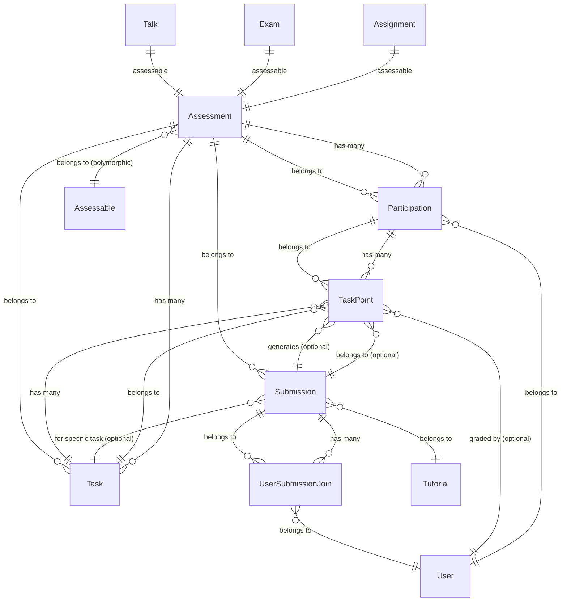
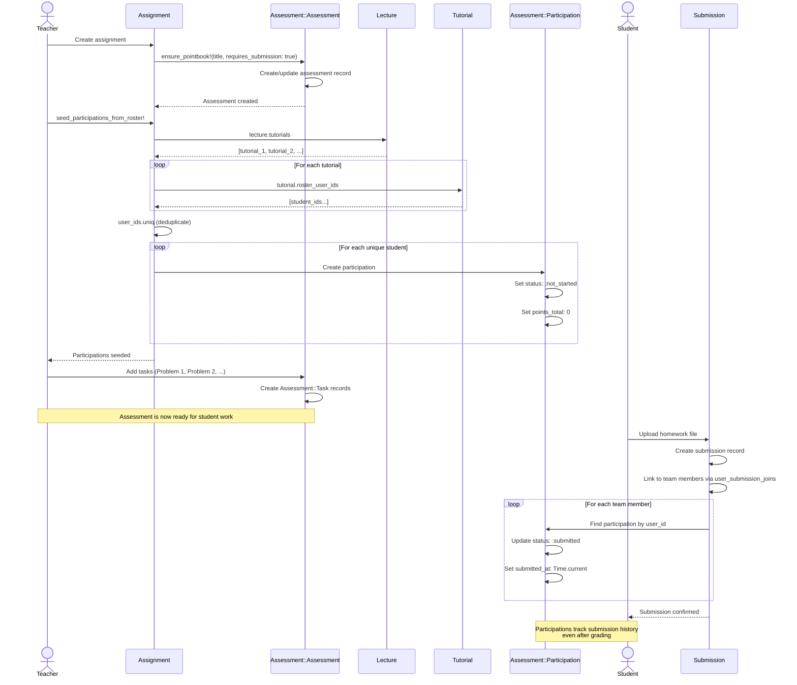
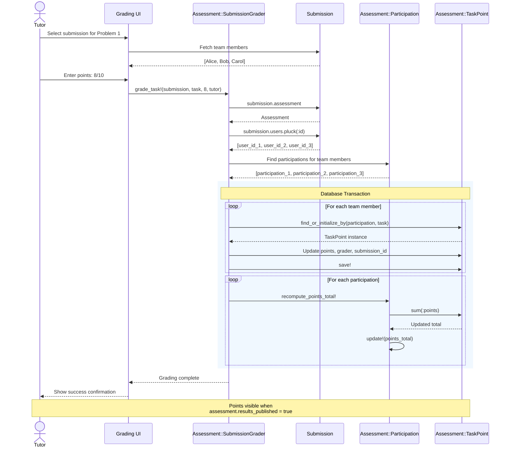
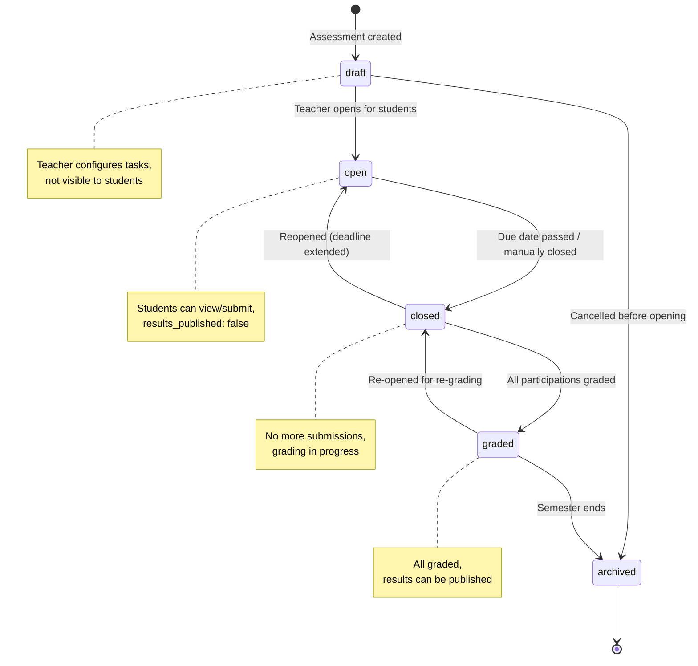

# Assessments & Grading

```admonish question "What is an 'Assessment'?"
An "assessment" is a structured evaluation of student learning and performance.

- **Common Examples:** A homework assignment with multiple problems, an exam or a seminar talk presentation.
- **In this context:** It refers to the grading infrastructure for any evaluable artifact in MaMpf, encompassing both per-task point tracking and final grade recording.
```

## Problem Overview
After registrations and allocations are finalized, MaMpf needs to:
- **Grade diverse items:** Support assignments (with per-task points), exams (points + final grade), and talks (final grade only).
- **Handle team submissions:** One file uploaded by a team should be graded once, with points automatically distributed to all team members.
- **Track granular progress:** Break down assignments into tasks (problems), record points per task per student, and aggregate totals.
- **Support flexible workflows:** Allow draft grading, provisional review, publication, and post-publication adjustments.
- **Maintain audit trails:** Link graded submissions back to the points awarded for transparency and appeals.

## Solution Architecture
We use a unified grading model with clear separation of concerns:
- **Canonical Source:** `Assessment::Assessment` acts as the single gradebook for any graded work (Assignment, Exam, Talk).
- **Dual Capability Model:** Two concerns provide orthogonal features:
  - `Assessment::Pointable`: Enables per-task point tracking ("pointbook" mode).
  - `Assessment::Gradable`: Enables final grade recording without tasks ("gradebook" mode).
- **Participation Tracking:** `Assessment::Participation` records aggregate points, grade, and status per (user, assessment).
- **Granular Points:** `Assessment::Task` and `Assessment::TaskPoint` models support breakdown into graded components when `requires_points = true`.
- **Team-Aware Grading:** `Assessment::SubmissionGrader` implements a fan-out pattern: grade one `Submission`, create `Assessment::TaskPoint` records for all team members.
- **Roster Integration:** Participations are seeded from `Roster::Rosterable` models (tutorials, talks) or lecture rosters.
- **Idempotent Operations:** Re-grading the same submission overwrites points consistently; totals are recomputed atomically.

---

## Assessment::Assessment (ActiveRecord Model)
**_The Gradebook Container_**

```admonish info "What it represents"
The central grading record for a single piece of graded work (assignment, exam, or talk). It holds configuration, tasks, and aggregates all student participations.
```

```admonish tip "Think of it as"
"Homework 3 Gradebook", "Final Exam Points Ledger", "Seminar Talk Grading Sheet"
```

The main fields and methods of `Assessment` are:

| Name/Field                | Type/Kind         | Description                                                              |
|---------------------------|-------------------|--------------------------------------------------------------------------|
| `assessable_type`         | DB column         | Polymorphic type for the graded work (e.g., `Assignment`, `Exam`, `Talk`) |
| `assessable_id`           | DB column         | Polymorphic ID for the graded work                                       |
| `lecture_id`              | DB column         | Optional foreign key for fast scoping to a lecture                       |
| `title`                   | DB column         | Human-readable assessment title                                          |
| `requires_points`         | DB column         | Boolean: whether this assessment tracks per-task points                  |
| `requires_submission`     | DB column         | Boolean: whether students must upload files                              |
| `total_points`            | DB column         | Optional maximum points (computed from tasks if blank)                   |
| `status`                  | DB column (Enum)  | Workflow state: `draft` (0), `open` (1), `closed` (2), `graded` (3), `archived` (4) |
| `visible_from`            | DB column         | Timestamp when assessment becomes visible to students                    |
| `due_at`                  | DB column         | Deadline for submissions                                                 |
| `results_published`       | DB column         | Boolean: whether students can see their points and grades                |
| `participations`          | Association       | All student records for this assessment                                  |
| `tasks`                   | Association       | Tasks (problems) for this assessment (only if `requires_points`)         |
| `task_points`             | Association       | All task points through participations                                   |
| `effective_total_points`  | Method            | Returns `total_points` or sum of task max_points                         |
| `seed_participations_from!(user_ids:)` | Method | Creates participation records for given users                    |

```admonish warning "Submission Support - Current Scope"
The `requires_submission` field is currently only used for **Assignment** types. Submission interfaces (upload, view, grade) are only implemented for assignments. For Exams and Talks, this field should remain `false` as no submission workflow exists for these types yet. See [Future Extensions](10-future-extensions.md) for planned support.
```

### Behavior Highlights

- Acts as the single source of truth for grading configuration
- Guards task creation: tasks exist only when `requires_points = true`
- Supports two modes: "pointbook" (granular task points) and "gradebook" (final grade only)
- Aggregates student records (participations) which are seeded from rosters

### Example Implementation

```ruby
# filepath: app/models/assessment/assessment.rb
module Assessment
  class Assessment < ApplicationRecord
    belongs_to :assessable, polymorphic: true
    belongs_to :lecture, optional: true

    has_many :tasks, dependent: :destroy, class_name: "Assessment::Task"
    has_many :participations, dependent: :destroy,
      class_name: "Assessment::Participation"
    has_many :task_points, through: :participations,
      class_name: "Assessment::TaskPoint"

  enum status: { draft: 0, open: 1, closed: 2, graded: 3, archived: 4 }

  validates :title, presence: true
  validate :tasks_only_when_requires_points

  def effective_total_points
    total_points.presence || tasks.sum(:max_points)
  end

  def seed_participations_from!(user_ids:)
    existing = participations.pluck(:user_id).to_set
    (user_ids - existing.to_a).each do |uid|
      participations.create!(user_id: uid)
    end
  end

  private

  def tasks_only_when_requires_points
    if tasks.any? && !requires_points
      errors.add(:base, "Tasks are only allowed when requires_points is true")
    end
  end
end
```

```admonish info collapsible=true title="Assessment Creation Timing (Implementation Details)"
The timing of assessment creation differs by type to match real-world workflows:

**Assignments & Exams (Explicit Creation):**
- Created explicitly via "New Assessment" UI in the Assessments tab
- Teacher navigates to Lecture → Assessments → New Assessment → selects type
- Both domain model (Assignment/Exam) and Assessment record created together in one transaction
- Teacher controls exactly when the assessment is created during the semester

**Talks (Automatic Creation):**
- Created automatically when Talk is created in the Content tab (seminars only)
- Talks are created early for campaign registration, often before the semester starts
- Assessment record is auto-generated via `talk.ensure_gradebook!` after Talk save
- Participations seeded from speakers immediately
- Grading happens later via the Assessments tab (see [Grading Talks in Seminars](#grading-talks-in-seminars))

**Why the difference:**
Assignments and exams are created on-demand during the semester. Talks must exist early for registration campaigns, but grading happens much later—auto-creating the assessment ensures the grading infrastructure is ready when needed.
```

### Usage Scenarios

- **For a homework assignment:** A teacher creates an `Assignment` record via the "New Assessment" UI. The system creates both the `Assignment` and a linked `Assessment::Assessment` record in one transaction, configured with `requires_points: true` and `requires_submission: true`. The teacher adds tasks for each problem (P1, P2, P3). Student records are seeded automatically from the tutorial roster.

- **For an exam:** A teacher creates an `Exam` record via the "New Assessment" UI. The system creates both the `Exam` and a linked `Assessment::Assessment` whose `assessable` is that exam, with `requires_points: true` to track per-question scores. After the teacher defines all tasks and grades them, a final `grade_value` can be computed and stored for each student to represent the official exam grade.

- **For a seminar talk:** A teacher creates a `Talk` record in the Content tab. The system automatically creates a linked `Assessment::Assessment` whose `assessable` is that talk, with `requires_points: false`. Later, the teacher records only a final grade for each speaker via the Assessments tab—no tasks or submissions are needed.

---

## Assessment::Participation (ActiveRecord Model)
**_Per-Student Grade Record_**

```admonish info "What it represents"
A single student's grading record within an assessment. It tracks their total points, final grade, submission status, and links to all their task-level points.
```

```admonish note "Think of it as"
One row in the gradebook spreadsheet for a specific student in a specific assessment.
```

### Key Fields & Associations

| Name/Field       | Type/Kind        | Description                                                    |
|------------------|------------------|----------------------------------------------------------------|
| `assessment_id`  | DB column (FK)   | The assessment this participation belongs to                   |
| `user_id`        | DB column (FK)   | The student being graded                                       |
| `tutorial_id`    | DB column (FK)   | Tutorial context at participation creation time (optional, null for exams/talks) |
| `points_total`   | DB column        | Aggregate points across all tasks (denormalized)               |
| `grade_value`    | DB column        | Final grade (e.g., "1.3", "Pass") - optional                   |
| `status`         | DB column (Enum) | Workflow state: `not_started`, `in_progress`, `submitted`, `graded`, `exempt` |
| `submitted_at`   | DB column        | Timestamp when submission was uploaded (persists after grading)|
| `grader_id`      | DB column (FK)   | The tutor/teacher who graded this (optional)                   |
| `graded_at`      | DB column        | Timestamp when grading was completed                           |
| `results_published_at` | DB column  | Per-participation publication timestamp (optional)             |
| `published`      | DB column        | Boolean: whether results are visible to the student            |
| `locked`         | DB column        | Boolean: prevents further edits after publication              |
| `task_points`    | Association      | All task-level point records for this student in this assessment |

```admonish info collapsible=true title="Tutorial Context Details"
The `tutorial_id` field captures which tutorial the student was in **at the time of participation creation** (when `seed_participations_from_roster!` runs during assessment setup). This field:
- Is **set once** when participations are initialized from the roster
- Is **never updated** if the student changes tutorials mid-semester
- Is **nullable** for assessments without tutorial context (e.g., exams, talks)
- Enables **per-tutorial publication** control for assignments
- Provides **performance optimization** for tutor grading queries
```

### Behavior Highlights

- Enforces uniqueness per (assessment, user) via database constraint
- Maintains `points_total` as the sum of all associated `TaskPoint` records
- Preserves submission history via `submitted_at` even after status transitions to `:graded`
- Can carry both granular points (via tasks) and a final grade (for exams)
- Supports workflow states from initial submission through final grading
- Provides locking mechanism to prevent post-publication tampering

### Example Implementation

```ruby
# filepath: app/models/assessment/participation.rb
module Assessment
  class Participation < ApplicationRecord
    self.table_name = "assessment_participations"

    belongs_to :assessment, class_name: "Assessment::Assessment"
    belongs_to :user
    belongs_to :tutorial, optional: true
    belongs_to :grader, class_name: "User", optional: true

    has_many :task_points, dependent: :destroy,
      class_name: "Assessment::TaskPoint"

  enum status: {
    not_started: 0,
    in_progress: 1,
    submitted: 2,
    graded: 3,
    exempt: 4
  }

  validates :user_id, uniqueness: { scope: :assessment_id }

  def recompute_points_total!
    update!(points_total: task_points.sum(:points))
  end

  def results_visible?
    results_published_at.present?
  end
end
```

```admonish warning collapsible=true title="Tutorial ID Behavior (Implementation Details)"
The `tutorial_id` on participation is **never updated** after creation. It represents which tutorial the student was in when participations were initialized during assessment setup, not their current tutorial assignment.

**When `tutorial_id` is set:**
- **Assignments**: Set when `seed_participations_from_roster!` runs after assignment creation, capturing the tutorial each student belongs to at that moment
- **Exams**: Set to `nil` (exams don't have tutorial context)
- **Talks**: Set to `nil` (talks have speakers, not tutorial participants)

**Why it doesn't update:**
- Preserves historical grading context (which tutor graded this work)
- Determines publication control (which tutorial can publish results)
- Provides audit trail for grade complaints
- Enables fast queries without roster joins

**Edge case - student switches tutorials:**
- Participation keeps original `tutorial_id`
- Original tutorial's tutor still grades their work
- Original tutorial's publication controls still apply
- If manual reassignment is needed, teacher can update `tutorial_id` as admin action
```

### Usage Scenarios

- **After assessment setup:** When an assignment is created, `assignment.seed_participations_from_roster!` runs, creating one `Assessment::Participation` record for each student across all lecture tutorials. Each participation is initialized with `status: :not_started`, `points_total: 0`, `submitted_at: nil`, and `tutorial_id` set to the tutorial the student currently belongs to.

- **Student submits work:** A student uploads their homework file. The system sets their participation to `status: :submitted` and records `submitted_at: Time.current`. This timestamp persists even after grading. The `tutorial_id` remains unchanged.

- **After grading a submission:** A tutor grades a team submission for Problem 1. The grading service creates or updates `Assessment::TaskPoint` records for each team member, then calls `recompute_points_total!` on their participation to update the aggregate score. The status transitions to `:graded` and `graded_at` is set, but `submitted_at` and `tutorial_id` remain unchanged—preserving the submission and tutorial history.

- **Publishing exam results:** After all exam tasks are graded, the teacher marks participations as `published: true` and their status is `:graded`. Students can now see their points breakdown and final grade (if `grade_value` is set). Exam participations have `tutorial_id: nil` since exams don't have tutorial context.

- **Per-tutorial publication (assignments):** Tutorial A completes grading on Monday. The tutor sets `results_published_at: Time.current` for all participations where `tutorial_id = tutorial_a.id`. Students in Tutorial A can now see their results. Tutorial B's students (with `tutorial_id = tutorial_b.id` and `results_published_at: nil`) still see "pending" status.

- **Handling exemptions:** A student provides a medical certificate and is marked `status: :exempt`. Their participation record exists but no points are computed, no grade is assigned, and both `submitted_at` and `graded_at` remain `nil`. The `tutorial_id` is preserved for audit purposes.

- **Distinguishing submission vs non-submission:** After grading is complete, the teacher can query `submitted_at.present?` to distinguish students who submitted work (even if they received 0 points for quality) from those who never submitted at all.

- **Student switches tutorials mid-semester:** Alice is in Tutorial A when participations are initialized for Homework 3. Her participation has `tutorial_id: 1` (Tutorial A). In week 6, she switches to Tutorial B. When Tutorial A publishes results, Alice's Homework 3 results become visible because her participation's `tutorial_id` still points to Tutorial A. Her future assignments will have new participations with `tutorial_id: 2` (Tutorial B).

---

## Assessment::Task (ActiveRecord Model)
**_Atomic Graded Component_**

```admonish info "What it represents"
One graded component (problem, question, or rubric item) within an assessment that tracks points independently.
```

```admonish note "Think of it as"
"Problem 1 (worth 10 points)" on a homework assignment or "Question 3 (worth 5 points)" on an exam.
```

### Key Fields & Associations

| Name/Field       | Type/Kind        | Description                                                    |
|------------------|------------------|----------------------------------------------------------------|
| `assessment_id`  | DB column (FK)   | The assessment this task belongs to                            |
| `title`          | DB column        | Human-readable task name (e.g., "Problem 1", "Question 3a")    |
| `position`       | DB column        | Display order within the assessment                            |
| `max_points`     | DB column        | Maximum achievable points for this task                        |
| `description`    | DB column        | Optional detailed instructions or rubric text                  |
| `task_points`    | Association      | All point records across all students for this task            |

### Behavior Highlights

- Exists only when the parent assessment has `requires_points: true`
- Enforces `max_points >= 0` via validation
- Position determines display order in grading interfaces
- Deletion cascades to all associated `TaskPoint` records

### Example Implementation

```ruby
# filepath: app/models/assessment/task.rb
module Assessment
  class Task < ApplicationRecord
    self.table_name = "assessment_tasks"

    belongs_to :assessment, class_name: "Assessment::Assessment"
    has_many :task_points, dependent: :destroy,
      class_name: "Assessment::TaskPoint"

    validates :title, presence: true
    validates :max_points, numericality: { greater_than_or_equal_to: 0 }
    validates :position, numericality: { only_integer: true }, allow_nil: true

    acts_as_list scope: :assessment
  end
end
```

```admonish note "Multiple Choice Exam Extension"
For exams with multiple choice components requiring legal compliance, see the [Multiple Choice Exams](05c-multiple-choice-exams.md) chapter. That extension adds `is_multiple_choice` and `grade_scheme_id` fields with associated validations.
```

### Usage Scenarios

- **Creating tasks for a homework:** After setting up an assignment's assessment, the teacher creates tasks: `assessment.tasks.create!(title: "Problem 1", max_points: 10, position: 1)`, `assessment.tasks.create!(title: "Problem 2", max_points: 15, position: 2)`. Each task defines a gradeable component.

- **Exam with multiple questions:** An exam assessment has tasks for each question. A task titled "Question 3: Proof of Theorem" with `max_points: 8` allows tutors to grade that specific question independently across all students.

- **Automatic total calculation:** If the assessment's `total_points` field is blank, calling `assessment.effective_total_points` sums all task `max_points` values (e.g., 10 + 15 + 8 = 33 total points).

- **Reordering tasks:** Teachers can adjust the `position` field to reorder how tasks appear in the grading interface without changing the underlying data structure.

---

## Assessment::TaskPoint (ActiveRecord Model)
**_Per-Student, Per-Task Grade Record_**

```admonish info "What it represents"
The points and feedback assigned to a specific student for a specific task within an assessment.
```

```admonish note "Think of it as"
"Alice earned 8 out of 10 points on Problem 1, with comment: 'Minor calculation error in step 3.'"
```

### Key Fields & Associations

| Name/Field                    | Type/Kind        | Description                                                    |
|-------------------------------|------------------|----------------------------------------------------------------|
| `assessment_participation_id` | DB column (FK)   | Links to the student's participation record                    |
| `task_id`                     | DB column (FK)   | The task being graded                                          |
| `points`                      | DB column        | Points awarded (must be ≥ 0 and ≤ task.max_points)            |
| `comment`                     | DB column        | Optional feedback text for the student                         |
| `grader_id`                   | DB column (FK)   | The tutor who assigned these points (optional)                 |
| `submission_id`               | DB column (FK)   | Links to the graded submission for audit trail (optional)      |

### Behavior Highlights

- Enforces uniqueness per (participation, task) via database constraint
- Triggers recomputation of `Assessment::Participation.points_total` on save
- Visibility controlled by `assessment.results_published`, not per-task state
- Links back to the specific submission that was graded for audit trails
- Validation ensures points do not exceed task maximum
- Maintains update history via `updated_at` for complaint resolution tracking

### Example Implementation

```ruby
# filepath: app/models/assessment/task_point.rb
module Assessment
  class TaskPoint < ApplicationRecord
    self.table_name = "assessment_task_points"

    belongs_to :assessment_participation,
      class_name: "Assessment::Participation"
    belongs_to :task, class_name: "Assessment::Task"
    belongs_to :grader, class_name: "User", optional: true
    belongs_to :submission, optional: true

  validates :points, numericality: { greater_than_or_equal_to: 0 }

  after_commit :bubble_totals

  private

  def bubble_totals
    assessment_participation.recompute_points_total!
  end
end
```

```admonish note "Extra Points Allowed"
Points are allowed to exceed task maximum to support extra credit and bonus points scenarios. There is no upper bound validation on the `points` field.
```

### Usage Scenarios

- **Grading a team submission:** A tutor grades Problem 1 of a team homework. The grading service creates or updates one `Assessment::TaskPoint` record per team member, all with the same points value (e.g., 8/10), linking each to `submission_id: 42` for audit purposes.

- **Bonus points:** A tutor awards 12 points out of 10 for exceptional work on a problem. The system accepts this without validation errors, allowing the student's total to exceed the nominal maximum.

- **Publishing results:** After completing all grading, the teacher sets `assessment.results_published = true`. Students can now see all their task points and comments at once.

- **Recomputation trigger:** After saving a TaskPoint with 8 points, the `after_commit` callback automatically calls `assessment_participation.recompute_points_total!`, updating the student's aggregate score across all tasks.

- **Handling complaints:** A student views their exam and submits a complaint about Question 2. The tutor reviews the work, agrees there was a grading error, and updates the `Assessment::TaskPoint` from 5 to 7 points. The `updated_at` timestamp records when the adjustment was made. The recomputation callback updates the student's `points_total` and potentially their final `grade_value`.

- **Audit trail:** Months later, a student appeals their grade. The teacher queries `task_point.submission` to retrieve the original PDF that was graded, verifying the points awarded match the work submitted.

### Re-grading and Corrections

The grading interface remains available even after an assessment transitions to `graded` status. This supports corrections for:
- Discovered grading mistakes
- Student complaints requiring point adjustments
- Late bonus point awards

When accessing grading for a `graded` or published assessment, the UI should display a warning:

> **Results already published**  
> Changes will be visible to students immediately. Continue?

This ensures teachers are aware that modifications affect published results. The `results_published` flag controls visibility, not editability—`TaskPoint` records remain mutable across all assessment states, and `recompute_points_total!` is idempotent.

```admonish info collapsible=true title="Per-Tutorial Result Publication (Implementation Details)"
For assignments with multiple tutorials, results can be published independently per tutorial as grading completes. This eliminates coordination burden and provides faster feedback to students.

**Publication Model:**
- Each `Assessment::Participation` has a `results_published_at` timestamp (nullable)
- Tutor can publish results for their tutorial when grading is complete
- Publication is per-tutorial, not lecture-wide
- Students see results when `participation.results_visible?` returns true

**Implementation:**

```ruby
def results_visible?
  results_published_at.present?
end
```

**Workflow:**
1. Tutorial A completes grading on Monday
2. Tutor clicks "Publish Results for Tutorial A"
3. System sets `results_published_at = Time.current` for all participations where `tutorial_id = tutorial_a.id`
4. Students in Tutorial A immediately see their points and grades
5. Tutorial B continues grading, their students still see "pending"
6. Tutorial B completes Thursday, publishes independently

**Benefits:**
- No waiting for slowest tutorial to finish
- Tutors control their own publication timeline
- Teacher oversight still possible (can hide results per tutorial)
- Maintains audit trail of when results were released

**Cross-Tutorial Teams (Edge Case):**
When team members are in different tutorials:
- Publish when *any* member's tutorial publishes (permissive)
- OR: Require *all* members' tutorials to publish (strict)
- Recommended: Use permissive model for simplicity

**Query Examples:**

```ruby
# Publish results for Tutorial X
tutorial_x_participations = assessment.participations
  .where(tutorial_id: tutorial_x.id)
tutorial_x_participations.update_all(results_published_at: Time.current)

# Student view query
participation.results_visible?  # true if results_published_at is set

# Teacher dashboard: which tutorials have published?
assessment.participations
  .select(:tutorial_id, "COUNT(*) as total")
  .where.not(results_published_at: nil)
  .group(:tutorial_id)
```

**Exam and Talk Publication:**
Exams and talks have `tutorial_id: nil` on their participations. Publication control uses the legacy `assessment.results_published` boolean instead of per-participation timestamps. Per-tutorial publication only applies to assignments.
```

---

## Assessment::Assessable (Concern)
**_Base Contract for Gradeable Models_**

```admonish info "What it represents"
A concern that enables any domain model (Assignment, Exam, Talk) to be linked to an Assessment::Assessment record and manage its grading lifecycle.
```

```admonish note "Think of it as"
The minimal "make me gradeable" interface that all graded work must implement.
```

### Public Interface

| Method | Description |
|--------|-------------|
| `assessment` | Returns the linked Assessment::Assessment record (polymorphic `has_one` association) |
| `ensure_assessment!(...)` | Creates or updates the linked Assessment::Assessment with given configuration |
| `seed_participations_from_roster!` | Creates Assessment::Participation records for all students in the roster |

### Behavior Highlights

- Establishes the polymorphic link via `has_one :assessment, as: :assessable`
- Provides a safe method to create/update the assessment without duplication
- `seed_participations_from_roster!` should be overridden by including classes to define roster logic
- Does not enforce whether points or grades are used—that's delegated to `Assessment::Pointable` and `Assessment::Gradable`

### Example Implementation

```ruby
# filepath: app/models/assessment/assessable.rb
module Assessment
  module Assessable
    extend ActiveSupport::Concern

    included do
      has_one :assessment, as: :assessable, dependent: :destroy,
        class_name: "Assessment::Assessment"
  end

  def ensure_assessment!(title:, requires_points:, requires_submission: false,
                        visible_from: nil, due_at: nil)
    a = assessment || build_assessment
    a.title = title
    a.requires_points = requires_points
    a.requires_submission = requires_submission
    a.visible_from ||= visible_from if visible_from
    a.due_at ||= due_at if due_at
    a.lecture ||= try(:lecture)
    a.save! if a.changed?
    a
  end

  # Override this method in including classes to define roster logic
  # For Assignment: aggregate from lecture.tutorials
  # For Exam: use exam registration roster
  # For Talk: use speaker roster
  def seed_participations_from_roster!
    raise NotImplementedError,
      "#{self.class.name} must implement seed_participations_from_roster!"
  end
end
end
```

### Usage Scenarios

- **Initial setup for an assignment:** After creating an `Assignment` record, the teacher calls `assignment.ensure_assessment!(title: "Homework 3", requires_points: true, requires_submission: true)` to create the linked Assessment::Assessment. Then `assignment.seed_participations_from_roster!` aggregates students from all lecture tutorials and creates participation records for each.

- **Updating assessment metadata:** A teacher realizes the due date was wrong and calls `assignment.ensure_assessment!(title: "Homework 3", requires_points: true, due_at: 1.week.from_now)` again. The method is idempotent—it updates the existing Assessment::Assessment rather than creating a duplicate.

- **For exams after registration:** An `Exam` becomes `Rosterable` after its registration campaign is completed and allocations are materialized. When calling `exam.seed_participations_from_roster!`, the concern reads from the exam's roster (the confirmed exam registrants) to seed participations. Only students who successfully registered for the exam will have participation records created.

---

## Assessment::Pointable (Concern)
**_Enables Per-Task Point Tracking_**

```admonish info "What it represents"
A concern that extends `Assessment::Assessable` to enable granular, per-task point tracking for graded work that can be broken down into components.
```

```admonish note "Think of it as"
"Turn on pointbook mode" for assignments and exams that need task-by-task grading.
```

### Public Interface

| Method | Description |
|--------|-------------|
| `ensure_pointbook!(...)` | Creates or updates the linked Assessment::Assessment with `requires_points: true` |

### Behavior Highlights

- Includes `Assessment::Assessable` and builds on its interface
- Forces `requires_points: true` when creating the assessment
- Enables the creation of `Assessment::Task` records for breaking down graded components
- Allows optional submission requirement based on the work type
- Assessment will aggregate points from all task-level grades

### Example Implementation

```ruby
# filepath: app/models/assessment/pointable.rb
module Assessment
  module Pointable
    extend ActiveSupport::Concern
    include Assessment::Assessable

  def ensure_pointbook!(title:, requires_submission: false, **opts)
    ensure_assessment!(
      title: title,
      requires_points: true,
      requires_submission: requires_submission,
      **opts
    )
  end
end
```

### Usage Scenarios

- **For homework assignments:** After creating an assignment, call `assignment.ensure_pointbook!(title: "Homework 3", requires_submission: true, due_at: 1.week.from_now)`. The assessment is configured for task-level grading, and students must upload files. Tasks are then added for each problem.

- **For exams with per-question tracking:** An exam includes this concern to track points per question. Call `exam.ensure_pointbook!(title: "Final Exam", requires_submission: false)` since students don't upload files for in-person exams. Tasks represent individual exam questions.

- **Idempotent reconfiguration:** A teacher realizes they set the wrong due date and calls `assignment.ensure_pointbook!(title: "Homework 3", requires_submission: true, due_at: 2.weeks.from_now)`. The method updates the existing assessment without creating a duplicate.

---

## Assessment::Gradable (Concern)
**_Enables Final Grade Recording_**

```admonish info "What it represents"
A concern that extends `Assessment::Assessable` to enable recording a final grade without task-level breakdown.
```

```admonish note "Think of it as"
"Turn on gradebook mode" for seminar talks or other work that receives only a single grade.
```

### Public Interface

| Method | Description |
|--------|-------------|
| `ensure_gradebook!(...)` | Creates or updates the linked Assessment::Assessment with `requires_points: false` by default while preserving an existing `requires_points: true` configuration |
| `set_grade!(user:, value:, grader:)` | Records a final grade for a specific student |

### Behavior Highlights

- Includes `Assessment::Assessable` and builds on its interface
- Defaults `requires_points` to `false` when creating the assessment, but retains `true` if it was already enabled (e.g., when combined with `Assessment::Pointable`)
- No tasks or submissions are required
- Directly updates `Assessment::Participation.grade_value` for each student
- Can be combined with `Assessment::Pointable` for exams that need both points and final grades

### Example Implementation

```ruby
# filepath: app/models/assessment/gradable.rb
module Assessment
  module Gradable
    extend ActiveSupport::Concern
    include Assessment::Assessable

  def ensure_gradebook!(title:, **opts)
    requires_points = assessment&.requires_points
    ensure_assessment!(
      title: title,
      requires_points: requires_points.nil? ? false : requires_points,
      requires_submission: false,
      **opts
    )
  end

  def set_grade!(user:, value:, grader: nil)
    a = assessment || raise("No gradebook; call ensure_gradebook! first")
    part = a.participations.find_or_create_by!(user_id: user.id)
    part.update!(
      grade_value: value,
      grader_id: grader&.id,
      graded_at: Time.current,
      status: :graded
    )
  end
end
```

### Usage Scenarios

- **For seminar talks:** After creating a talk, call `talk.ensure_gradebook!(title: "Seminar Talk: Topology")` to create an assessment without tasks. After the presentation, call `talk.set_grade!(user: speaker, value: "1.0", grader: professor)` to record the final grade.

- **For exams with final grades:** An exam includes both `Assessment::Pointable` and `Assessment::Gradable`. After all tasks are graded and points computed, the teacher can call `exam.set_grade!(user: student, value: "1.3", grader: professor)` to store the official grade that appears on transcripts.

- **Idempotent grade updates:** A teacher corrects a mistakenly entered grade by calling `talk.set_grade!` again with the new value. The method updates the existing participation record rather than creating a duplicate.

---

## Enhanced Domain Models

The following sections describe how existing MaMpf models are enhanced to integrate with the assessment system by implementing the grading concerns.

### Assignment (Enhanced)
**_A Pointable Target with Submissions_**

```admonish info "What it represents"
An existing MaMpf assignment model, enhanced to manage per-task grading with team submissions.
```

#### Grading Implementation
The `Assignment` model includes the `Assessment::Pointable` concern to provide per-task point tracking.

| Concern/Method | Implementation Detail |
|---|---|
| `Assessment::Pointable` | Enables task-by-task grading with aggregated points |
| Roster integration | Students aggregated from all lecture tutorials |
| Submission requirement | `requires_submission: true` in the assessment |

#### Example Implementation
```ruby
class Assignment < ApplicationRecord
  include Assessment::Pointable

  belongs_to :lecture
  has_many :submissions, dependent: :destroy

  after_create :setup_grading

  private

  def setup_grading
    ensure_pointbook!(
      title: title,
      requires_submission: true,
      due_at: deadline
    )
    seed_participations_from_roster!
  end

  def seed_participations_from_roster!
    return unless assessment

    # Aggregate students from all tutorials in the lecture
    lecture.tutorials.each do |tutorial|
      user_ids = tutorial.roster_user_ids
      user_ids.each do |user_id|
        assessment.participations.find_or_create_by!(user_id: user_id) do |part|
          part.tutorial_id = tutorial.id
        end
      end
    end
  end
end
```

### Talk (Enhanced)
**_A Gradable Target_**

```admonish info "What it represents"
An existing MaMpf talk model, enhanced to record only final grades without task breakdown.
```

#### Grading Implementation
The `Talk` model includes the `Assessment::Gradable` concern for simple grade recording.

| Concern/Method | Implementation Detail |
|---|---|
| `Assessment::Gradable` | Records final grade only, no tasks |
| Roster integration | Speakers come from the talk's roster via `Roster::Rosterable` |
| Submission requirement | `requires_submission: false` and `requires_points: false` |

#### Example Implementation
```ruby
class Talk < ApplicationRecord
  include Roster::Rosterable
  include Assessment::Gradable

  after_create :setup_grading

  private

  def setup_grading
    ensure_gradebook!(title: title)
    seed_participations_from_roster!
  end
end
```

### Grading Talks in Seminars

```admonish info "Seminar-Specific Workflow"
Talks in seminars follow a different workflow than assignments and exams. Talks are created early (often before the semester starts) for campaign registration, but grading happens much later after presentations are delivered.
```

#### Workflow Overview

1. **Talk Creation (Early):**
   - Teacher creates talks in the Content tab of a seminar
   - Each talk is created for registration campaign purposes (students sign up for presentation slots)
   - Assessment record is automatically created via `after_create :setup_grading` hook
   - Participations are seeded from speakers immediately

2. **Campaign & Registration:**
   - Students register for talk slots via registration campaign
   - Talks exist with linked assessment records, but no grading yet

3. **Presentation Delivery:**
   - Semester progresses, students deliver presentations
   - Assessment records are already in place, ready for grading

4. **Grading (Late):**
   - Teacher navigates to Assessments tab in seminar
   - Tab shows read-only list of all talks with inline grading interface
   - Teacher enters final grade directly in the list (no per-task breakdown)
   - Optionally clicks talk title for detailed view to add feedback notes

#### UI Design for Seminar Assessments

**Assessments Tab (Seminar Context):**
- Shows only talks (no assignments or exams in seminars)
- **No "New Assessment" button** (talks are created via Content tab)
- Inline grade input per row for fast grading workflow
- Columns: Title | Speaker(s) | Grade (inline dropdown) | Status | Actions (view details)
- Help text: "Talks are created in the Content tab"

**Grading UX:**
- One click to focus grade dropdown, one click to save
- Grade range: 1.0 - 5.0 (German grading scale) or Pass/Fail
- Auto-save on blur or explicit Save button
- Click talk title → opens assessment show page for detailed feedback

```admonish tip "Why Auto-Create Assessments?"
Creating the assessment record early ensures the grading infrastructure is ready when needed. Teachers don't have to remember to "prepare talks for grading" later—the system handles it automatically.
```

```admonish warning "Seminar-Specific Constraints"
- Talks have `requires_points: false` (no task breakdown)
- Talks have `requires_submission: false` (no file uploads for presentations)
- Assessments tab is read-only for talk creation (Content tab owns talk CRUD)
```

### Exam
**_A Flexible Gradable Target_**

```admonish info "See Dedicated Chapter"
The `Exam` model is fully documented in the [Exam Model](05a-exam-model.md) chapter, including registration, grading, and multiple choice exam support. This section provides a brief overview of its assessment integration.
```

#### Assessment Integration
The `Exam` model includes both `Assessment::Pointable` and `Assessment::Gradable` concerns for flexible exam grading. The grading mode is configurable per exam instance.

| Concern/Method | Implementation Detail |
|---|---|
| `Assessment::Pointable` | **Optional:** Tracks points per exam question/problem when needed |
| `Assessment::Gradable` | **Always included:** Records final grade for transcripts |
| `Assessment::Assessable` | Base concern linking exam to Assessment::Assessment |
| Roster integration | Students come from exam registration via `Registration::Registerable` → `Roster::Rosterable` |
| Submission requirement | `requires_submission: false` since exams are typically graded in person (or scanned separately) |

#### Grading Modes

**With Pointbook (Pointbook + Gradebook):**
- Includes both `Assessment::Pointable` and `Assessment::Gradable`
- Tutors grade per-question/problem points via tasks
- System computes `points_total` for each student
- Staff applies grade scheme to convert points to final grades
- **Use cases:** Written exams with detailed point breakdown, oral exams with rubric scoring

**Without Pointbook (Gradebook only):**
- Includes only `Assessment::Gradable`
- Examiner records final grade directly
- No per-question breakdown needed
- No points tracking, just final grade (e.g., "1.0", "2.3")
- **Use cases:** Holistic oral exams, pass/fail written exams, interviews

#### Grading Workflow

**With per-question points:**
1. Students register for exam via registration campaign
2. Campaign materializes → exam roster is populated
3. After exam is administered, staff creates `Assessment::Assessment` with `requires_points: true`
4. `seed_participations_from_roster!` creates participation records
5. Tutors grade per-question points via tasks
6. System computes `points_total` for each student
7. Staff applies grade scheme to convert points to final grades

**Without per-question points:**
1. Students register for exam via registration campaign
2. Campaign materializes → exam roster is populated
3. Staff creates `Assessment::Assessment` with `requires_points: false`
4. `seed_participations_from_roster!` creates participation records
5. Examiner records final grade directly after examination
6. No point calculation needed

For multiple choice exam support and legal compliance, see [Exam Model - Multiple Choice Exams](05a-exam-model.md#multiple-choice-exams).

---

## Submission (Extended Model)
**_Team-Capable Graded Work_**

```admonish info "What it represents"
A file or set of files uploaded by one or more students for grading. Supports both individual and team submissions.
```

```admonish note "Think of it as"
"HW3.pdf uploaded by Alice and Bob" or "Problem1.pdf submitted by a team of three students"
```

### Existing Structure

The `Submission` model already handles team uploads:

| Field/Association        | Type/Kind        | Description                                                    |
|--------------------------|------------------|----------------------------------------------------------------|
| `assignment_id`          | DB column (FK)   | The assignment this submission belongs to                      |
| `tutorial_id`            | DB column (FK)   | The tutorial context (preserved for performance and historical accuracy) |
| `user_submission_joins`  | Association      | Join table linking submission to team members                  |
| `users`                  | Association      | All team members who submitted this file                       |
| `manuscript_data`        | DB column        | Uploaded PDF via Shrine                                        |
| `correction_data`        | DB column        | Graded/annotated PDF via Shrine                                |
| `token`                  | DB column        | Unique identifier for secure access                            |
| `accepted`               | DB column        | Boolean for late submission approval                           |
| `invited_user_ids`       | DB column        | Array of invited team members                                  |

### Assessment Integration (Changed)

To integrate with the grading system, the submission structure changes:

| Field/Association | Type/Kind        | Description                                                    |
|-------------------|------------------|----------------------------------------------------------------|
| `assessment_id`   | DB column (FK)   | **Replaces `assignment_id`:** Now links directly to Assessment for generality |
| `tutorial_id`     | DB column (FK)   | **Kept:** Provides tutorial context, fast queries, and historical accuracy even if rosters change |
| `task_id`         | DB column (FK)   | **New:** Optional link to a specific task for per-task uploads |
| `task_points`     | Association      | **New:** TaskPoint records created when grading this submission |

### Rationale for Key Decisions

**Why change `assignment_id` to `assessment_id`:**
- More general: Enables future support for exam and talk submissions (e.g., scanned answer sheets, presentation files)
- Decouples submissions from specific domain models
- Aligns with unified grading architecture

```admonish info "Current Implementation Scope"
The model uses `assessment_id` instead of `assignment_id` to enable future extensibility. However, **the current implementation is limited to assignments only**. Submission UI, upload workflows, and grading interfaces exist only for the Assignment type. Support for exam and talk submissions is documented in [Future Extensions](10-future-extensions.md).
```

**Why keep `tutorial_id`:**
- **Performance:** Fast queries for "all submissions in Tutorial X" without user joins
- **Disambiguation:** Determines which tutorial grades cross-tutorial teams (edge case)
- **Historical accuracy:** Preserves context even if students change tutorials mid-semester

### Migration Guide

**Overview:** Transition existing submissions from `assignment_id` to `assessment_id`.

**Steps:**
1. Add `assessment_id` column to `submissions` table (with foreign key constraint)
2. Backfill: for each submission, set `assessment_id` from `submission.assignment.assessment.id`
3. Remove the old `assignment_id` column and its foreign key
4. Update Submission model:
   - Change `belongs_to :assignment` to `belongs_to :assessment, class_name: "Assessment::Assessment"`
   - Update any code that references `submission.assignment` to use assessment navigation

**Consideration:** Ensure all assignments have their assessments created before running the backfill migration.

### Behavior Highlights

- Team submissions already work via `has_many :users` through `user_submission_joins`
- One submission can have multiple owners (team members)
- Optional `task_id` enables per-task file uploads for granular grading
- Grading service targets the submission and fans out points to all team members
- File uploads handled via Shrine for manuscript and correction PDFs
- Token-based sharing for team formation

### Usage Scenarios

- **Team homework submission:** Alice, Bob, and Carol form a team for Homework 3. Alice uploads `HW3.pdf` via the submission interface. The system creates one `Submission` record linked to all three students via `user_submission_joins`, then updates each team member's `Assessment::Participation` record: `status: :submitted` and `submitted_at: Time.current`. When a tutor grades this submission, `TaskPoint` records are created for all three team members with identical points.

- **Per-task uploads (new feature):** An assignment allows students to upload separate files for each problem. The team uploads `Problem1.pdf` with `task_id: 1`, `Problem2.pdf` with `task_id: 2`. Each upload updates the team members' `Assessment::Participation.submitted_at` timestamp (idempotent if already set). Tutors can grade each problem independently, and the grading service still fans out points to all team members for each task.

- **Audit trail for complaints:** A student complains about their grade on Problem 2. The teacher queries the `TaskPoint` record, follows the `submission_id` link, and retrieves the original `Problem2.pdf` file to review the grading decision.

- **Individual submissions:** For assignments that don't allow teams, each student uploads their own file. The `Submission` has only one entry in `user_submission_joins`, maintaining backward compatibility with the existing single-user flow.

---

## Assessment::SubmissionGrader (Service)
**_Team-Aware Grading Orchestrator_**

```admonish info "What it represents"
Coordinates the grading workflow: takes one submission and distributes points to all team members automatically.
```

```admonish note "Think of it as"
"Grade the file once, points apply to the whole team."
```

### Public Interface

| Method | Description |
|--------|-------------|
| `grade_task!(submission:, task:, points:, grader:, comment: nil)` | Grades one task for all team members |
| `grade_tasks!(submission:, grades_by_task_id:, grader:)` | Bulk grades multiple tasks at once |

### Behavior Highlights

- Fan-out pattern: one submission graded → `Assessment::TaskPoint` created for each team member
- Idempotent: re-grading the same submission/task overwrites points consistently
- Links each `Assessment::TaskPoint` back to the `submission_id` for audit trail
- Triggers `Assessment::Participation.recompute_points_total!` after grading
- Validates that the task belongs to the submission's assessment
- Wraps all operations in a database transaction for atomicity
- Visibility controlled separately via `assessment.results_published`

### Example Implementation

```ruby
# filepath: app/services/assessment/submission_grader.rb
module Assessment
  class SubmissionGrader
    def grade_task!(submission:, task:, points:, grader:, comment: nil)
      assessment = submission.assessment
      raise ArgumentError, "Task not in assessment" unless
        task.assessment_id == assessment.id

      member_ids = submission.users.pluck(:id)
      parts = assessment.participations.where(user_id: member_ids)

      ApplicationRecord.transaction do
        parts.find_each do |part|
          tp = Assessment::TaskPoint.find_or_initialize_by(
          assessment_participation_id: part.id,
          task_id: task.id
        )
        tp.points = points
        tp.grader = grader
        tp.comment = comment if comment.present?
        tp.submission_id = submission.id
        tp.save!
      end
      parts.find_each(&:recompute_points_total!)
    end
  end

  def grade_tasks!(submission:, grades_by_task_id:, grader:)
    Task.where(id: grades_by_task_id.keys).find_each do |t|
      grade_task!(
        submission: submission,
        task: t,
        points: grades_by_task_id[t.id],
        grader: grader
      )
    end
  end
end
```

### Usage Scenarios

- **Grading a team homework:** A tutor grades Problem 1 of a submission by Alice, Bob, and Carol. They call `Assessment::SubmissionGrader.new.grade_task!(submission: sub, task: problem1, points: 8, grader: tutor)`. The service creates three `Assessment::TaskPoint` records (one per team member), each with 8 points and linked to the same submission. Each team member's `Assessment::Participation.points_total` is updated.

- **Bulk grading all tasks:** After reviewing the entire submission, the tutor calls `service.grade_tasks!(submission: sub, grades_by_task_id: { 1 => 8, 2 => 12, 3 => 5 }, grader: tutor)`. The service iterates through each task and fans out points, updating all participations in a single transaction.

- **Re-grading after complaint:** A student complains about Problem 2. The tutor reviews and agrees, calling `grade_task!` again with updated points. The existing `Assessment::TaskPoint` records are overwritten (upsert), and totals are recomputed. The audit trail via `submission_id` remains intact.

- **Publishing results:** Tutors grade all submissions. Once grading is complete, the teacher calls `assessment.update!(results_published: true)`, making all points visible to students at once.

---

## ERD



---

## Sequence Diagram: Assessment Creation & Submission Workflow



---

## Sequence Diagram: Team Grading Workflow



---

## State Diagram: Assessment Status Transitions



---

## Proposed Folder Structure

```text
app/
├── models/
│   ├── assessment/
│   │   ├── assessment.rb
│   │   ├── participation.rb
│   │   ├── task.rb
│   │   ├── task_point.rb
│   │   ├── assessable.rb
│   │   ├── pointable.rb
│   │   └── gradable.rb
│   │
│   ├── assignment.rb           # includes Assessment::Pointable
│   ├── talk.rb                 # includes Assessment::Gradable
│   ├── exam.rb                 # includes both concerns + Registration + Roster
│   └── submission.rb           # extended with assessment_id
│
└── services/
    └── assessment/
        └── submission_grader.rb
```

**Key Files:**
- **Models:** `app/models/assessment/` contains all namespaced models
- **Concerns:** Assessable, Pointable, Gradable live within the namespace
- **Services:** `app/services/assessment/submission_grader.rb` handles team grading
- **Enhanced Models:** Assignment, Talk, Exam include the assessment concerns
- **Migrations:** Will include changes to add `assessment_id` to submissions table

---

## Database Tables

The following tables support the assessment system:

| Table Name | Namespace Model | Purpose |
|------------|-----------------|---------|
| `assessments` | `Assessment::Assessment` | Gradebook containers for graded work |
| `assessment_participations` | `Assessment::Participation` | Per-student grade records |
| `assessment_tasks` | `Assessment::Task` | Graded components within assessments |
| `assessment_task_points` | `Assessment::TaskPoint` | Per-student, per-task points |
| `submissions` | `Submission` | Existing model, extended with `assessment_id` |

**Naming rationale:** Namespaced table names follow Rails conventions and prevent collisions with potential future models (e.g., `Quiz::Task`, `Exercise::Task`).

### Schema Updates for Per-Tutorial Publication

**New columns for `assessment_participations`:**

```ruby
# filepath: db/migrate/20250105000000_add_tutorial_and_publication_to_participations.rb
class AddTutorialAndPublicationToParticipations < ActiveRecord::Migration[7.0]
  def change
    add_reference :assessment_participations, :tutorial,
      foreign_key: true, null: true, index: true
    add_column :assessment_participations, :results_published_at,
      :datetime, null: true
    add_index :assessment_participations, :results_published_at
  end
end
```

**Migration rationale:**
- `tutorial_id`: Nullable to support exams and talks without tutorial context
- `results_published_at`: Enables per-tutorial publication for assignments
- Indexed for fast tutorial-scoped queries and publication status checks
- Foreign key constraint maintains referential integrity

**Backfill strategy for existing data:**
```ruby
# For existing assignment participations, backfill tutorial_id from submission
Submission.includes(:users, :tutorial).find_each do |sub|
  sub.users.each do |user|
    participation = Assessment::Participation.find_by(
      assessment_id: sub.assessment_id,
      user_id: user.id
    )
    participation&.update_column(:tutorial_id, sub.tutorial_id)
  end
end
```


