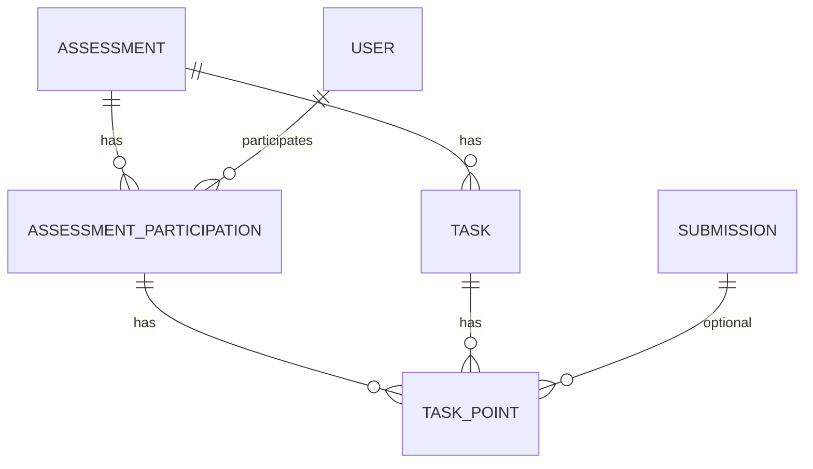
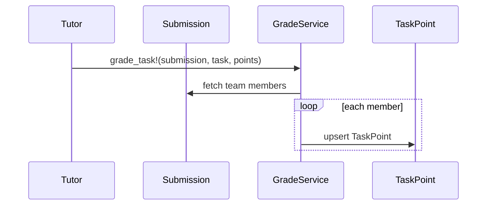

# Assessments & Grading

## Problem Overview
After registrations and allocations are finalized, MaMpf needs to:
- Define graded artifacts (assignments, exams, talks) with or without per-task points.
- Collect submissions for homework (single PDF) or per task (optional).
- Support team submissions (one submission graded once; points apply to all members).
- Enter/compute task points and final grades, then publish.

## Solution Architecture
We use a unified grading model with:
- Assessment (polymorphic): one gradebook per “assessable” domain object (Assignment, Exam, Talk).
- Two capabilities via concerns:
	- Pointable: enables per-task points (“pointbook”).
	- Gradable: enables final grade recording (“gradebook”).
- AssessmentParticipation: one row per (user, assessment) holding totals/grade/status.
- Task/TaskPoint: per-assessment tasks and per-user points (Pointable only).
- Submission (extended): keep the existing assignment-level, team-capable submissions. Extend with an optional submissions.task_id for per-task uploads. Tutors grade a submission once; a service fans out TaskPoints to each submission member’s participation.

---

## 1) Assessment — The Gradebook Container

```admonish info "What it represents"
- The gradebook for a single domain artifact (assignment, exam, talk).
```

```admonish note "Think of it as"
- “Midterm gradebook”, “Homework 3 points ledger”, “Talk grading sheet”.
```

Key fields:
- assessable_type, assessable_id (polymorphic to Assignment, Exam, Talk)
- lecture_id (optional fast scope)
- title, assessment_type (assignment, exam, talk)
- requires_points (bool), requires_submission (bool)
- total_points (optional; derives from tasks if blank)
- status (draft, open, closed, graded, archived), visibility times

Behavior highlights:
- Single source of truth for tasks, points, and/or final grade per artefact.
- Tasks allowed only when requires_points = true.
- Participations seeded from rosters; totals derived from TaskPoints.

```ruby
# filepath: app/models/assessment.rb
class Assessment < ApplicationRecord
	belongs_to :assessable, polymorphic: true
	belongs_to :lecture, optional: true

	has_many :tasks, dependent: :destroy
	has_many :assessment_participations, dependent: :destroy
	has_many :task_points, through: :assessment_participations

	enum assessment_type: { assignment: 0, exam: 1, talk: 2 }
	enum status: { draft: 0, open: 1, closed: 2, graded: 3, archived: 4 }

	validates :title, presence: true

	def effective_total_points
		total_points.presence || tasks.sum(:max_points)
	end

	def seed_participations_from!(user_ids:)
		existing = assessment_participations.pluck(:user_id).to_set
		(user_ids - existing.to_a).each { |uid| assessment_participations.create!(user_id: uid) }
	end
end
```

Examples:
- Assessment for Assignment “HW3” with tasks P1–P4.
- Assessment for Talk “Presentation” (no tasks; final grade only).

---

## 2) AssessmentParticipation — Per User, Per Assessment

```admonish info "What it represents"
- A learner’s record in a specific assessment (points, grade, status).
```

```admonish note "Think of it as"
- The grade row for one student in this gradebook.
```

Key fields:
- assessment_id, user_id
- points_total (decimal), grade_value (string/decimal)
- status (not_started, in_progress, submitted, graded, exempt)
- grader_id, graded_at, published, locked

Behavior highlights:
- Keeps totals in sync with TaskPoints.
- Can carry a final grade even when requires_points is true (exams: points → grade).

```ruby
# filepath: app/models/assessment_participation.rb
class AssessmentParticipation < ApplicationRecord
	belongs_to :assessment
	belongs_to :user
	belongs_to :grader, class_name: "User", optional: true

	has_many :task_points, dependent: :destroy

	enum status: { not_started: 0, in_progress: 1, submitted: 2, graded: 3, exempt: 4 }

	def recompute_points_total!
		update!(points_total: task_points.sum(:points))
	end
end
```

Examples:
- “Alice in HW3”: points_total = 28, grade_value = “1.7”, status = graded.

---

## 3) Task — Atomic Graded Unit

```admonish info "What it represents"
- One graded component (problem, section, rubric item) inside an assessment.
```

```admonish note "Think of it as"
- “Problem 1 (10 pts)”.
```

Key fields:
- assessment_id, title, position, max_points
- requires_submission (optional policy)

Behavior highlights:
- Exists only for Pointable assessments (requires_points = true).
- Drives TaskPoints entries for each participating student.

```ruby
# filepath: app/models/task.rb
class Task < ApplicationRecord
	belongs_to :assessment
	has_many :task_points, dependent: :destroy

	validates :title, presence: true
	validates :max_points, numericality: { greater_than_or_equal_to: 0 }
end
```

Examples:
- HW3 has tasks: P1(10), P2(10), P3(10), P4(10).

---

## 4) TaskPoint — Per User, Per Task

```admonish info "What it represents"
- The points and comments assigned to a student for a specific task.
```

```admonish note "Think of it as"
- “Alice got 8/10 on Problem 1 (comment: minor mistake).”
```

Key fields:
- assessment_participation_id, task_id
- points, comment, grader_id
- state (draft, provisional, published)
- submission_id (optional; traceability to the graded submission)

Behavior highlights:
- Bubbles totals to AssessmentParticipation on change.
- Enforce points ≤ task.max_points (recommended).
- Links back to the graded Submission for audit and exports.
- Bulk publish note: if you flip many TaskPoints from provisional→published via `update_all`, be sure totals were already recomputed (callbacks are skipped by update_all). Prefer running recompute or the grading service first, then mass flip states.

```ruby
# filepath: app/models/task_point.rb
class TaskPoint < ApplicationRecord
	belongs_to :assessment_participation
	belongs_to :task
	belongs_to :grader, class_name: "User", optional: true
	belongs_to :submission, optional: true

	enum state: { draft: 0, provisional: 1, published: 2 }
	validates :points, numericality: { greater_than_or_equal_to: 0 }

	after_commit :bubble_totals
	def bubble_totals
		assessment_participation.recompute_points_total!
	end
end
```

Examples:
- TaskPoint(user: Alice, task: P1, points: 8, state: provisional, submission_id: 42).

---

## 5) Submission — Team-Capable Evidence (Extended)

```admonish info "What it represents"
- Artifacts submitted by students for grading; a submission can be owned by multiple users (team).
```

```admonish note "Think of it as"
- “HW3.pdf uploaded by Alice and Bob” or “P1.pdf for Task 1 uploaded by a team”.
```

Key fields (current system + additive):
- assignment_id (existing), tutorial_id (existing)
- team members (existing or additive): has_many :users through a join table
- task_id (additive, optional) to enable per-task uploads without replacing legacy flows
- files, timestamps, token (existing)

Behavior highlights:
- Today: one PDF per assignment; team submissions via Submission.users.
- Extended: optionally allow one PDF per task by setting submissions.task_id.
- Grading targets the Submission; points are written/upserted for every member’s participation (fan-out). One graded file; no team model needed.

```ruby
# filepath: app/models/submission.rb
class Submission < ApplicationRecord
	belongs_to :tutorial
	belongs_to :assignment

	has_many :user_submission_joins, dependent: :destroy # [`UserSubmissionJoin`](app/models/user_submission_join.rb)
	has_many :users, through: :user_submission_joins     # team members

	# Optional: per-task uploads (additive; keep commented until tasks exist)
	# belongs_to :task, optional: true

	# ...existing code...
end
```

Examples:
- Assessment-level: team uploads HW3.pdf → tutor grades P1/P2/P3 → TaskPoints created for all team members.
- Task-level: team uploads P1.pdf with task_id=P1.id → P1 tutor grades → fan-out.

---

## 6) Concerns — How Models Opt In

### Assessable — Base Wiring

```admonish info "What it represents"
- Minimal contract to attach an Assessment to any domain model.
```

```admonish note "Think of it as"
- “Make me gradeable in general (points and/or final grade).”
```

Behavior highlights:
- Adds has_one :assessment (polymorphic).
- Helper to create/configure assessment and seed participations from rosters (Roster::Rosterable when available; lecture fallback otherwise).

```ruby
# filepath: app/models/concerns/assessable.rb
module Assessable
	extend ActiveSupport::Concern

	included do
		has_one :assessment, as: :assessable, dependent: :destroy
	end

	def ensure_assessment!(title:, requires_points:, requires_submission: false, visible_from: nil, due_at: nil)
		a = assessment || build_assessment
		a.title = title
		a.requires_points = requires_points
		a.requires_submission = requires_submission
		a.visible_from ||= visible_from if visible_from
		a.due_at ||= due_at if due_at
		a.lecture ||= try(:lecture)
		a.save! if a.changed?
		a
	end

	def seed_participations_from_roster!
		return unless assessment
		user_ids =
			if respond_to?(:roster_user_ids) then roster_user_ids
			elsif respond_to?(:students) then students.pluck(:id)
			else []
			end
		assessment.seed_participations_from!(user_ids: user_ids)
	end
end
```

### Pointable — Per-task Points (“Pointbook”)

```ruby
# filepath: app/models/concerns/pointable.rb
module Pointable
	extend ActiveSupport::Concern
	include Assessable

	def ensure_pointbook!(title:, requires_submission: false, **opts)
		ensure_assessment!(title: title, requires_points: true, requires_submission: requires_submission, **opts)
	end
end
```

### Gradable — Final Grade (“Gradebook”)

```ruby
# filepath: app/models/concerns/gradable.rb
module Gradable
	extend ActiveSupport::Concern
	include Assessable

	def ensure_gradebook!(title:, **opts)
		ensure_assessment!(title: title, requires_points: false, requires_submission: false, **opts)
	end

	def set_grade!(user:, value:, grader: nil)
		a = assessment || raise("No gradebook; call ensure_gradebook! first")
		part = a.assessment_participations.find_or_create_by!(user_id: user.id)
		part.update!(grade_value: value, grader_id: grader&.id, graded_at: Time.current, status: :graded)
	end
end
```

Examples (usage on domain models):

```ruby
# filepath: app/models/assignment.rb
class Assignment < ApplicationRecord
	include Pointable
	# after_create { ensure_pointbook!(title: title, requires_submission: true); seed_participations_from_roster! }
end

# filepath: app/models/exam.rb
class Exam < ApplicationRecord
	include Pointable
	include Gradable
end

# filepath: app/models/talk.rb
class Talk < ApplicationRecord
	include Gradable
end
```

---

## 7) Grading Flow — Submission-Centered, Team-Aware (Fan-out)

```admonish info "What it represents"
- Tutors grade a submission once; the system applies points to all team members.
```

```admonish note "Think of it as"
- “Grade the file; the system distributes points.”
```

Key steps:
- Given a Submission and Task, upsert one TaskPoint per member’s AssessmentParticipation, set submission_id for traceability, recompute totals.
- Idempotent: re-grading the same submission+task overwrites consistently.
- Works with either assessment-level or per-task uploads (if submissions.task_id is present).

```ruby
# filepath: app/services/grade_submission_service.rb
class GradeSubmissionService
	def grade_task!(submission:, task:, points:, grader:, state: :provisional, comment: nil)
		assignment = submission.assignment
		assessment = assignment.assessment or raise "Missing assessment for assignment #{assignment.id}"
		raise ArgumentError, "Task not in assessment" unless task.assessment_id == assessment.id

		member_ids = submission.users.select(:id) # expects team membership via submissions -> users
		parts = assessment.assessment_participations.where(user_id: member_ids)

		ApplicationRecord.transaction do
			parts.find_each do |part|
				tp = TaskPoint.find_or_initialize_by(assessment_participation_id: part.id, task_id: task.id)
				tp.points = points
				tp.grader = grader
				tp.state = state
				tp.comment = comment if comment.present?
				tp.submission_id = submission.id
				tp.save!
			end
			parts.find_each(&:recompute_points_total!)
		end
	end

	def grade_tasks!(submission:, grades_by_task_id:, grader:, state: :provisional)
		Task.where(id: grades_by_task_id.keys).find_each do |t|
			grade_task!(submission:, task: t, points: grades_by_task_id[t.id], grader:, state:)
		end
	end
end
```

---

## 8) Integrity & Invariants

```admonish info "What it represents"
- System-wide rules to keep grades consistent.
```

```admonish note "Think of it as"
- “Things that must always hold.”
```

Key points:
- One AssessmentParticipation per (assessment, user) — unique index recommended.
- One TaskPoint per (participation, task) — unique index recommended.
- points_total = sum(task_points.points) — recomputed on change.
- Tasks exist only if assessment.requires_points = true.
- Submission can have many users; grading fans out, not duplicate graded files.
- Optional: TaskPoint.points ≤ Task.max_points.

Behavior highlights:
- Lock a participation to prevent edits (e.g., after publication).
- Publication can flip TaskPoints to published and set participation.status to graded.

---

## Diagrams (Placeholders)





