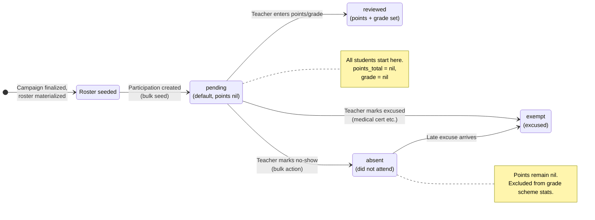
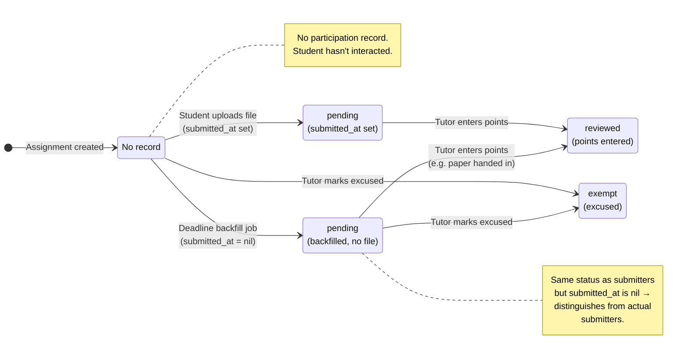
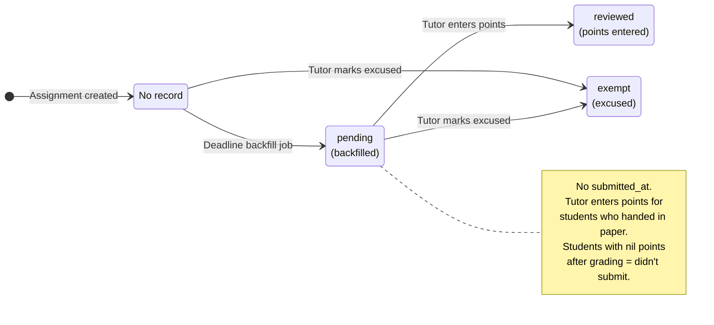
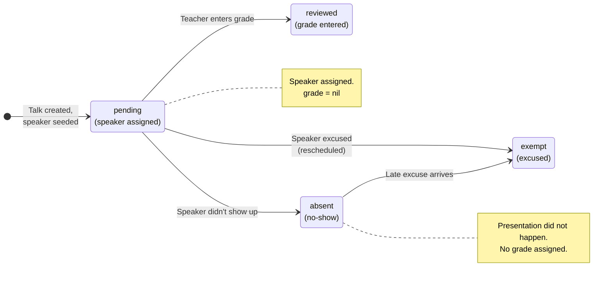
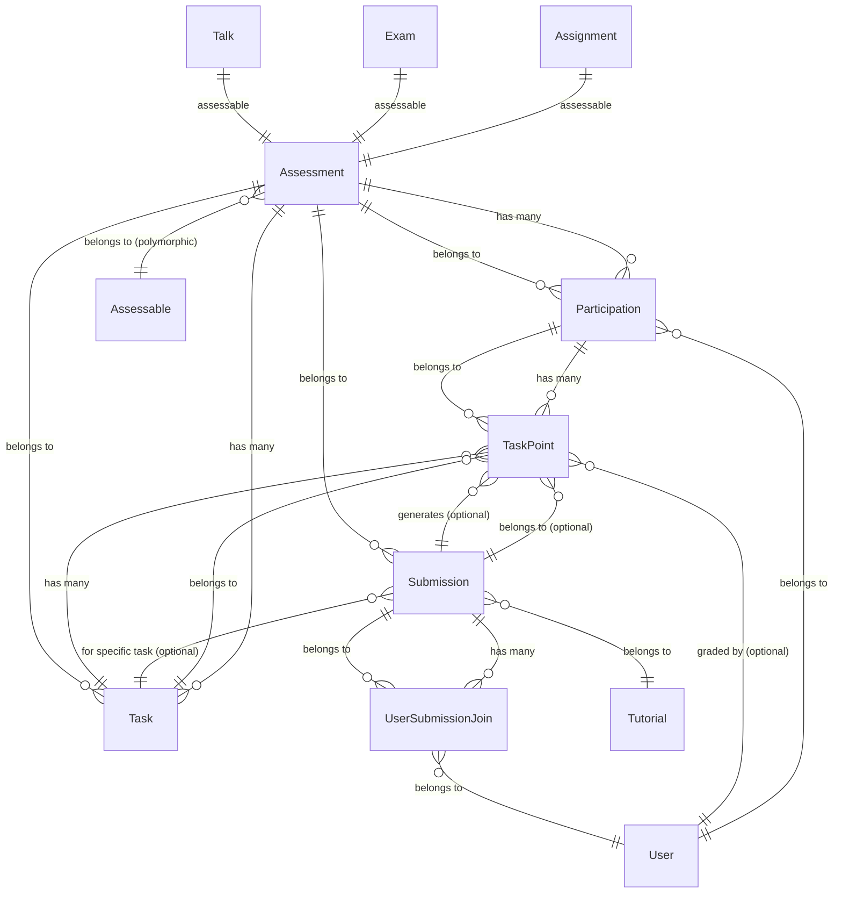
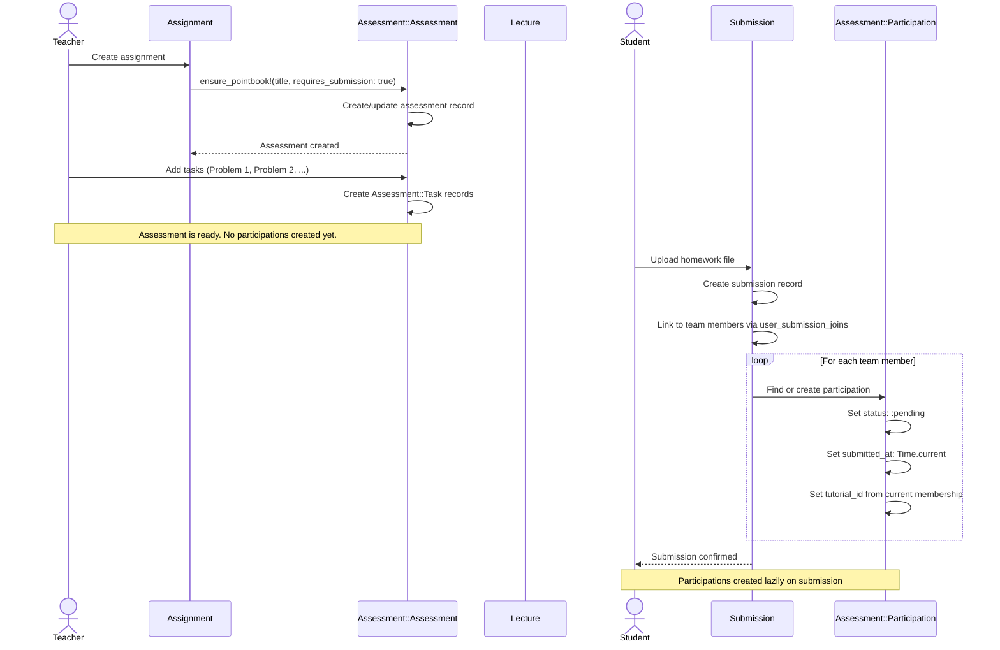
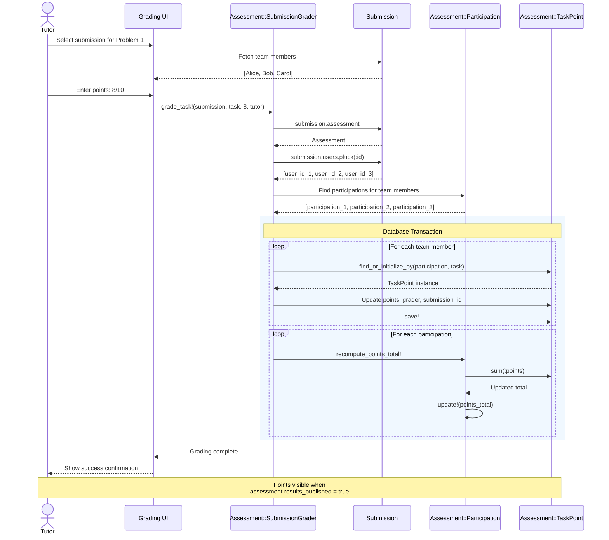
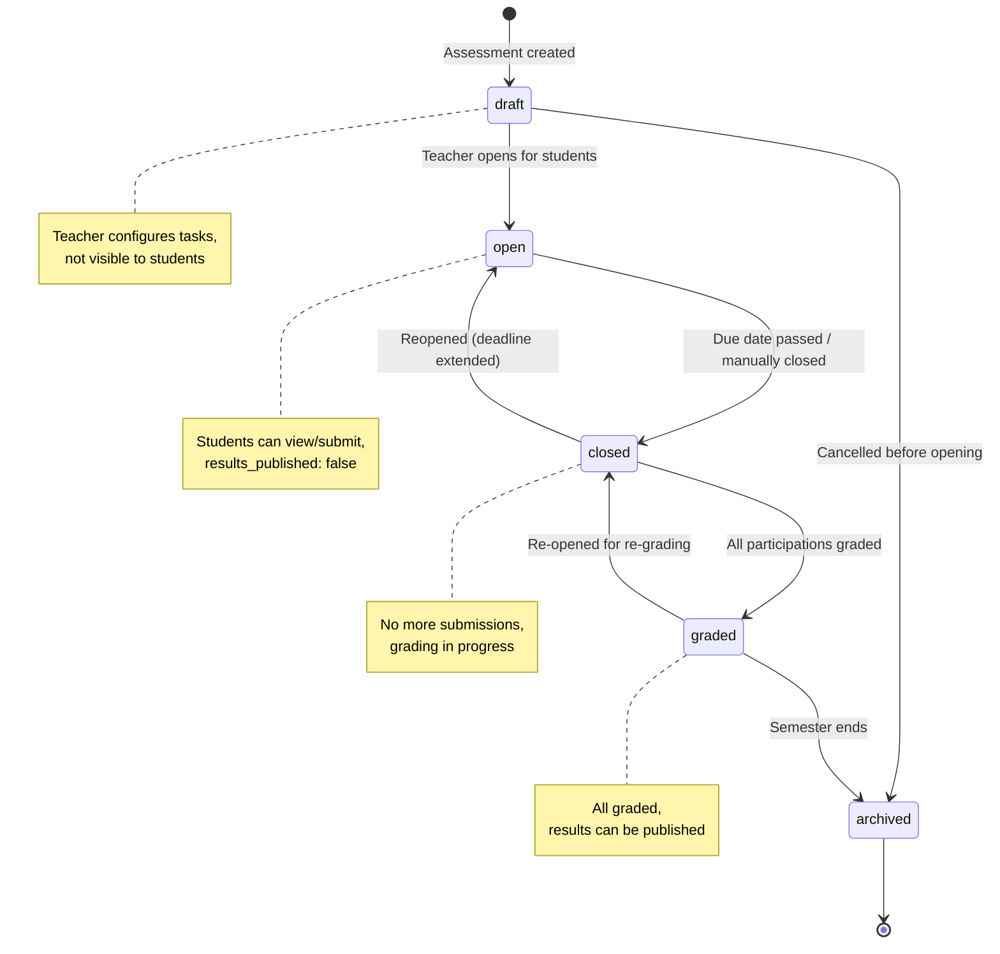

# Assessments & Grading

```admonish question "What is an 'Assessment'?"
An "assessment" is a structured evaluation of student learning and performance.

- **Common Examples:** A homework assignment with multiple problems, an exam or a seminar talk presentation.
- **In this context:** It refers to the grading infrastructure for any evaluable artifact in MaMpf, encompassing both per-task point tracking and final grade recording.
```

## Problem Overview
After registrations and allocations are finalized, MaMpf needs to:
- **Grade diverse items:** Support assignments (with per-task points), exams (points + final grade), and talks (final grade only).
- **Handle team submissions:** One file uploaded by a team should be graded once, with points automatically distributed to all team members.
- **Track granular progress:** Break down assignments into tasks (problems), record points per task per student, and aggregate totals.
- **Support flexible workflows:** Allow draft grading, provisional review, publication, and post-publication adjustments.
- **Maintain audit trails:** Link graded submissions back to the points awarded for transparency and appeals.

## Solution Architecture
We use a unified grading model with clear separation of concerns:
- **Canonical Source:** `Assessment::Assessment` acts as the single gradebook for any graded work (Assignment, Exam, Talk, Achievement).
- **Dual Capability Model:** Two concerns provide orthogonal features:
  - `Assessment::Pointable`: Enables per-task point tracking ("pointbook" mode).
  - `Assessment::Gradable`: Enables final grade recording without tasks ("gradebook" mode).
- **Participation Records:** `Assessment::Participation` records aggregate points, grade, and status per (user, assessment).
- **Granular Points:** `Assessment::Task` and `Assessment::TaskPoint` models support breakdown into graded components when `requires_points = true`.
- **Team-Aware Grading:** `Assessment::SubmissionGrader` implements a fan-out pattern: grade one `Submission`, create `Assessment::TaskPoint` records for all team members.
- **Roster Integration:** Participations are seeded from `Roster::Rosterable` models (tutorials, talks) or lecture rosters.
- **Idempotent Operations:** Re-grading the same submission overwrites points consistently; totals are recomputed atomically.

---

## Tab Organization & Creation Contexts

```admonish tip "Understanding the Separation"
Assessable items (Assignments, Exams, Talks) are **created** in different tabs based on their primary purpose, but all are **graded** in a unified Assessments tab. This separates the creation context from the grading context.
```

### Where Things Are Created & Graded

| Assessable Type | Created In        | Graded In         | Rationale                                                   |
|-----------------|-------------------|-------------------|-------------------------------------------------------------|
| **Assignment**  | Assessments Tab   | Assessments Tab   | Pure grading artifact; homework exists primarily to be graded |
| **Exam**        | Assessments Tab   | Assessments Tab   | Pure grading artifact; exams exist primarily to assess knowledge |
| **Talk**        | Roster/Groups Tab | Assessments Tab   | Seminar presentation created as part of roster setup; grading is secondary |
| **Achievement** | TBD               | Assessments Tab   | Future: certificates/badges awarded based on performance |

### Tab Purposes

**Assessments Tab (Grading Hub):**
- Primary interface for **all grading activities**
- Lists assignments, exams, and talks together
- Unified grading workflow for all types
- Manage tasks/questions, enter grades, publish results
- **Focus:** "What needs to be graded this week?"

**Roster/Groups Tab (Seminar Organization):**
- Create talks for seminars
- Set up talk registration campaigns
- Allocate students to presentation slots
- Manage speaker rosters
- **Focus:** "Who is presenting when?"

**Registration Tab (Logistics Service):**
- Configure registration campaigns **for existing exams**
- Students register for exam slots
- Allocate students to exam times/rooms
- Finalize exam rosters
- **Focus:** "Who is taking this exam and where?"

### Workflow Examples

**Creating an Assignment:**
1. Teacher goes to **Assessments Tab**
2. Clicks "New Assignment"
3. System creates Assignment + Assessment (if flag enabled)
4. Seeds participations from lecture tutorials
5. Teacher adds tasks/problems
6. Stays in Assessments Tab to grade

**Creating an Exam:**
1. Teacher goes to **Assessments Tab**
2. Creates exam with date, duration, room capacity
3. Adds exam questions as tasks
4. (Later) Goes to **Registration Tab** to set up registration campaign
5. Students register, allocations finalized, roster populated
6. Returns to **Assessments Tab** to grade

**Creating a Talk:**
1. Teacher goes to **Roster/Groups Tab**
2. Creates talk slot for seminar
3. Sets up registration campaign for speakers
4. Allocates students to presentation slots
5. Talk appears automatically in **Assessments Tab** (if flag enabled)
6. After presentation, goes to **Assessments Tab** to grade

### Unified Assessments Index

The Assessments Tab shows all gradeable items in one list, regardless of creation origin:

```
📊 Assessments for Linear Algebra WS2026

┌─────────────────────────────────────────────────────┐
│ Type       │ Title                │ Status          │
├─────────────────────────────────────────────────────┤
│ Assignment │ Homework 1           │ Graded ✓        │
│ Assignment │ Homework 2           │ Grading... ⏳    │
│ Exam       │ Midterm              │ Graded ✓        │
│ Talk       │ Group Theory Talk    │ Pending grade   │
│ Assignment │ Homework 3           │ Not started     │
│ Exam       │ Final Exam           │ Registration ⏳  │
└─────────────────────────────────────────────────────┘
```

```admonish success "Key Principle"
**Creation context preserves domain meaning, grading context unifies workflow.**

Teachers create items where they make semantic sense (homework vs presentations), but grade everything in one place for consistency and efficiency.
```

### Grading Tab vs. Performance Tab

```admonish question "Why do we have both a Grading tab and a Performance tab?"
The **Grading tab** (in the per-assessment Dashboard) and the **Performance tab** (in the lecture-level Assessments overview) serve different purposes despite some apparent overlap.
```

| Dimension | Grading Tab (per-assessment) | Performance Tab (Assessments overview) |
|-----------|--------------------------|--------------------------|
| **Location** | Assessment Dashboard (single assessment) | Assessments overview (lecture-wide) |
| **Primary axis** | Tasks (columns) × Students (rows) | Assessments (columns) × Students (rows) |
| **Editing** | Yes — enter points per task | No — read-only aggregate |
| **Scope** | One assessment (e.g., "Homework 3") | All assessments in the lecture |
| **Question answered** | "How did students do on Problem 2?" | "Is Alice eligible for the exam?" |
| **User journey** | Grading workflow → enter data | Certification workflow → review eligibility |

**The "filter to one assignment" overlap:** The Performance tab can filter to show a single assessment, which superficially resembles the Grading tab. However:
1. Performance tab remains **read-only** — it consumes grading data, it doesn't produce it.
2. Grading tab shows **task-level breakdown** — Performance shows only the total per assessment.
3. Performance tab provides **cross-assessment context** — even when filtered, switching views is instant.

### Assessments Overview Subtab Structure

The Assessments overview (lecture-level) is organized into sibling subtabs:

```
Assessments Tab
├── Assessments (default — list of assignments, exams, talks)
├── Performance (computed records + evaluator proposals)
├── Rules (eligibility criteria — read-only in PR 10.3, editable in PR 10.4)
└── Certifications (pass/fail dashboard — added in PR 10.4)
```

Each subtab is feature-flag gated by `:student_performance`
(Performance, Rules, Certifications) or always visible (Assessments).
The `AssessmentsOverviewComponent` renders the tab navigation and
lazy-loads subtab content via Turbo Frames.

```admonish tip "Design Pattern"
This layered approach (detail view + aggregate view) is common in well-designed systems:
- **Banking:** Transaction details vs. account statement
- **LMS (Moodle/Canvas):** Assignment grading page vs. gradebook overview
- **GitHub:** PR diff view vs. repository insights

The names already signal the distinction: **grading** (verb, action) vs. **performance** (noun, outcome).
```

## Assessment::Assessment (ActiveRecord Model)
**_The Gradebook Container_**

```admonish info "What it represents"
The central grading record for a single piece of graded work (assignment, exam, talk, or achievement). It holds configuration, tasks, and aggregates all student participations.
```

```admonish tip "Think of it as"
"Homework 3 Gradebook", "Final Exam Points Ledger", "Seminar Talk Grading Sheet"
```

The main fields and methods of `Assessment` are:

| Name/Field                | Type/Kind         | Description                                                              |
|---------------------------|-------------------|--------------------------------------------------------------------------|
| `assessable_type`         | DB column         | Polymorphic type for the graded work (e.g., `Assignment`, `Exam`, `Talk`, `Achievement`) |
| `assessable_id`           | DB column         | Polymorphic ID for the graded work                                       |
| `lecture_id`              | DB column         | Optional foreign key for fast scoping to a lecture                       |
| `title`                   | DB column         | Human-readable assessment title                                          |
| `requires_points`         | DB column         | Boolean: whether this assessment tracks per-task points                  |
| `requires_submission`     | DB column         | Boolean: whether students must upload files                              |
| `total_points`            | DB column         | Optional maximum points (computed from tasks if blank)                   |
| `results_published_at`    | DB column         | Timestamp when results were published (null = unpublished)               |
| `results_published_at`    | DB column         | Timestamp when results were published (null = unpublished)               |
| `participations`          | Association       | All student records for this assessment                                  |
| `tasks`                   | Association       | Tasks (problems) for this assessment (only if `requires_points`)         |
| `task_points`             | Association       | All task points through participations                                   |
| `effective_total_points`  | Method            | Returns `total_points` or sum of task max_points                         |
| `seed_participations_from!(user_ids:)` | Method | Creates participation records for given users                    |

```admonish warning "Submission Support - Configurable for Assignments"
The `requires_submission` field controls whether students must upload files:

- **Assignments:** Configurable. Defaults to `true` (digital submission), but can be set to `false` for paper-based homework collected during tutorials. Editable in the Assessment Settings tab.
- **Exams:** Always `false`. Exams are graded in person or from scanned papers.
- **Talks:** Always `false`. Presentations are graded live.

When `requires_submission: false`, no file uploads occur and `submitted_at` remains `nil`. The Grading Tab shows only grading progress (not submission progress).
```

### Behavior Highlights

- Acts as the single source of truth for grading configuration
- Guards task creation: tasks exist only when `requires_points = true`
- Supports two modes: "pointbook" (granular task points) and "gradebook" (final grade only)
- Aggregates student records (participations) which are seeded from rosters

### Example Implementation

```ruby
# filepath: app/models/assessment/assessment.rb
module Assessment
  class Assessment < ApplicationRecord
    belongs_to :assessable, polymorphic: true
    belongs_to :lecture, optional: true

    has_many :tasks, dependent: :destroy, class_name: "Assessment::Task"
    has_many :participations, dependent: :destroy,
      class_name: "Assessment::Participation"
    has_many :task_points, through: :participations,
      class_name: "Assessment::TaskPoint"

  validates :title, presence: true
  validate :tasks_only_when_requires_points

  def effective_total_points
    total_points.presence || tasks.sum(:max_points)
  end

  def results_published?
    results_published_at.present?
  end

  def seed_participations_from!(user_ids:)
    existing = participations.pluck(:user_id).to_set
    (user_ids - existing.to_a).each do |uid|
      participations.create!(user_id: uid)
    end
  end

  private

  def tasks_only_when_requires_points
    if tasks.any? && !requires_points
      errors.add(:base, "Tasks are only allowed when requires_points is true")
    end
  end
end
```

```admonish info collapsible=true title="Assessment Creation Timing (Implementation Details)"
The timing of assessment creation differs by type to match real-world workflows:

**Assignments & Exams (Explicit Creation):**
- Created explicitly via "New Assessment" UI in the Assessments tab
- Teacher navigates to Lecture → Assessments → New Assessment → selects type
- Both domain model (Assignment/Exam) and Assessment record created together in one transaction
- Teacher controls exactly when the assessment is created during the semester

**Talks (Automatic Creation):**
- Created automatically when Talk is created in the Content tab (seminars only)
- Talks are created early for campaign registration, often before the semester starts
- Assessment record is auto-generated via `talk.ensure_gradebook!` after Talk save
- Participations seeded from speakers immediately
- Grading happens later via the Assessments tab (see [Grading Talks in Seminars](#grading-talks-in-seminars))

**Why the difference:**
Assignments and exams are created on-demand during the semester. Talks must exist early for registration campaigns, but grading happens much later—auto-creating the assessment ensures the grading infrastructure is ready when needed.
```

### Usage Scenarios

- **For a homework assignment (digital):** A teacher creates an `Assignment` record via the "New Assessment" UI. The system creates both the `Assignment` and a linked `Assessment::Assessment` record in one transaction, configured with `requires_points: true` and `requires_submission: true`. The teacher adds tasks for each problem (P1, P2, P3). Student records are seeded automatically from the tutorial roster.

- **For a homework assignment (paper):** Same as above, but the teacher sets `requires_submission: false` in the Assessment Settings tab. Students hand in physical papers during tutorial sessions. Tutors enter points directly without expecting file uploads. No file uploads occur and `submitted_at` remains `nil` for all participations.

- **For an exam:** A teacher creates an `Exam` record via the "New Assessment" UI. The system creates both the `Exam` and a linked `Assessment::Assessment` whose `assessable` is that exam, with `requires_points: true` to track per-question scores. After the teacher defines all tasks and grades them, a final `grade_value` can be computed and stored for each student to represent the official exam grade.

- **For a seminar talk:** A teacher creates a `Talk` record in the Content tab. The system automatically creates a linked `Assessment::Assessment` whose `assessable` is that talk, with `requires_points: false`. Later, the teacher records only a final grade for each speaker via the Assessments tab—no tasks or submissions are needed.

- **For an achievement:** A teacher creates an `Achievement` record via the "New Assessment" UI (e.g., "Blackboard Presentation" with `value_type: boolean`). The system creates both the `Achievement` and a linked `Assessment::Assessment`, configured with `requires_points: false` and `requires_submission: false`. Participations are seeded for all students in the lecture. Tutors mark completion by setting each participation's `grade_value` to "Pass" or "Fail" (for boolean), or entering a count/percentage (for numeric/percentage types).

---

## Assessment::Participation (ActiveRecord Model)
**_Per-Student Grade Record_**

```admonish info "What it represents"
A single student's grading record within an assessment. It tracks their total points, final grade, submission status, and links to all their task-level points.
```

```admonish note "Think of it as"
One row in the gradebook spreadsheet for a specific student in a specific assessment.
```

### Key Fields & Associations

| Name/Field       | Type/Kind        | Description                                                    |
|------------------|------------------|----------------------------------------------------------------|
| `assessment_id`  | DB column (FK)   | The assessment this participation belongs to                   |
| `user_id`        | DB column (FK)   | The student being graded                                       |
| `tutorial_id`    | DB column (FK)   | Tutorial context at participation creation time (optional, null for exams/talks) |
| `points_total`   | DB column        | Aggregate points across all tasks (denormalized)               |
| `grade_numeric`  | DB column (Decimal 2,1) | German grade (1.0-5.0) - for exam grades                    |
| `grade_text`     | DB column (String) | Text-based grade ("pass", "fail", "exempt") - for achievements |
| `status`         | DB column (Enum) | Grading workflow state: `pending`, `reviewed`, `exempt`, `absent` (see Status Workflow below) |
| `submitted_at`   | DB column        | Timestamp when submission was uploaded (persists after grading)|
| `grader_id`      | DB column (FK)   | The tutor/teacher who graded this (optional)                   |
| `graded_at`      | DB column        | Timestamp when grading was completed                           |
| `results_published_at` | DB column  | Per-participation publication timestamp (optional)             |
| `published`      | DB column        | Boolean: whether results are visible to the student            |
| `locked`         | DB column        | Boolean: prevents further edits after publication              |
| `task_points`    | Association      | All task-level point records for this student in this assessment |

```admonish info collapsible=true title="Grade Fields: Numeric vs Text"
Two separate grade fields support different assessment types:

**`grade_numeric` (Decimal):** For German exam grades (1.0, 1.3, 1.7, 2.0, 2.3, 2.7, 3.0, 3.3, 3.7, 4.0, 5.0)
- Type-safe: Database constraint prevents invalid values like "1,3" or "2.5"
- Fast input: Tutors can type "1.3" directly in grading forms
- Analyzable: Can compute averages, distributions (`participations.average(:grade_numeric)`)
- Display: Format as "1.3" (strip trailing zeros for integer grades: "4.0" → "4")

**`grade_text` (String):** For pass/fail achievements, ECTS grades, and non-numeric assessments
- Canonical values: "pass", "fail", "exempt" (lowercase, English)
- ECTS grades: "A", "B", "C", "D", "E", "F" (for relative grading)
- I18n display: Translate on render (`t("assessment.grades.#{grade_text}")` → "Bestanden")
- Flexible: Can store counts ("5"), percentages ("85"), or boolean results

**Usage rule:** At least one of `grade_numeric` or `grade_text` should be present. Both can coexist (e.g., German absolute grade 1.7 + ECTS relative grade "B").
```

```admonish info collapsible=true title="Tutorial Context Details"
The `tutorial_id` field captures which tutorial the student was in **at the time of participation creation** (when they submit work or are graded). This field:
- Is **set once** when the participation record is created
- Is **never updated** if the student changes tutorials after submission
- Is **nullable** for assessments without tutorial context (e.g., exams, talks)
- Enables **per-tutorial publication** control for assignments
- Provides **performance optimization** for tutor grading queries
```

### Behavior Highlights

- Enforces uniqueness per (assessment, user) via database constraint
- Maintains `points_total` as the sum of all associated `TaskPoint` records
- Preserves submission history via `submitted_at` even after status transitions to `:reviewed`
- Separates concerns: `status` tracks grading workflow position; `submitted_at` tracks student submission (orthogonal axes)
- Can carry both granular points (via tasks) and a final grade (for exams)
- Supports simple workflow states without intermediate "in progress" tracking
- Provides locking mechanism to prevent post-publication tampering

### Status Workflow

The `status` enum tracks a participation's position in the **grading workflow**. It does *not* track whether the student submitted work — that is captured orthogonally by `submitted_at`.

| Status | Meaning | Trigger |
|--------|---------|--------|
| *(no record)* | No participation exists | Student has not interacted with assessment |
| `pending` | In grading pipeline, awaiting review | Roster seed (exams/talks), submission upload (assignments), deadline backfill job |
| `reviewed` | All grading complete | Tutor/teacher marks grading done (all task points entered) |
| `exempt` | Excused from assessment | Manual exemption (medical certificate, etc.) |
| `absent` | Did not attend (in-person) | Teacher marks student as no-show (explicit action) |

```admonish tip "Submission is orthogonal to status"
`submitted_at` records whether and when the student delivered work. It is independent of `status`:
- `pending` + `submitted_at` present → student submitted, not yet graded
- `pending` + `submitted_at` nil → roster-seeded or backfilled, no submission
- `reviewed` + `submitted_at` present → graded, had submitted work
- `reviewed` + `submitted_at` nil → graded without file submission (paper, exam)

This separation keeps the enum clean and future-proof (e.g. digital exam submissions would set `submitted_at` without needing a new status value).
```

```admonish warning "Where absent applies"
The `absent` status is an **attendance** concept. It only applies to assessments with a specific time and place where students are expected to show up physically:
- **Exams:** Student was on the roster but did not attend on exam day.
- **Talks:** Speaker was assigned a presentation slot but did not show up.

For **assignments**, `absent` does not apply. Non-submission is captured differently (see lifecycle diagrams below).
```

### Participation Lifecycle per Assessable Type

The participation lifecycle differs significantly by assessable type. These diagrams document the full flow for implementers of PR-8.5 (participation creation), PR-8.7/8.8 (interactive grading), and beyond.

#### Exam Participation Lifecycle

Exam participations are **pre-seeded** from the exam roster after the registration campaign is finalized. All students start with a participation record before the exam takes place.


```mermaid
stateDiagram-v2
    direction LR

    state "Roster seeded" as seeded
    state "pending<br/>(default, points nil)" as pending
    state "reviewed<br/>(points + grade set)" as reviewed
    state "absent<br/>(did not attend)" as absent
    state "exempt<br/>(excused)" as exempt

    [*] --> seeded : Campaign finalized,<br/>roster materialized
    seeded --> pending : Participation created<br/>(bulk seed)
    pending --> reviewed : Teacher enters points/grade
    pending --> absent : Teacher marks no-show<br/>(bulk action)
    pending --> exempt : Teacher marks excused<br/>(medical cert etc.)
    absent --> exempt : Late excuse arrives

    note right of pending
        All students start here.
        points_total = nil,
        grade = nil
    end note

    note right of absent
        Points remain nil.
        Excluded from grade scheme stats.
    end note
```

**Key points for implementers:**
- All exam participations exist *before* grading begins (via `seed_participations_from!`)
- After the exam, teacher first marks no-shows (bulk "Mark as absent"), then grades the rest
- `absent` → `exempt` is the only allowed status "upgrade" (late excuse)
- Grade scheme `Applier` must filter out `absent` and `exempt` when computing distribution stats

#### Assignment Participation Lifecycle (Digital Submission)

Assignment participations are **lazy** — created on first interaction (submission or grading). After the deadline, a backfill job seeds remaining roster students.


```mermaid
stateDiagram-v2
    direction LR

    state "No record" as none
    state "pending<br/>(submitted_at set)" as pending_sub
    state "pending<br/>(backfilled, no file)" as pending_bf
    state "reviewed<br/>(points entered)" as reviewed
    state "exempt<br/>(excused)" as exempt

    [*] --> none : Assignment created
    none --> pending_sub : Student uploads file<br/>(submitted_at set)
    none --> exempt : Tutor marks excused
    pending_sub --> reviewed : Tutor enters points
    none --> pending_bf : Deadline backfill job<br/>(submitted_at = nil)
    pending_bf --> reviewed : Tutor enters points<br/>(e.g. paper handed in)
    pending_bf --> exempt : Tutor marks excused

    note right of none
        No participation record.
        Student hasn't interacted.
    end note

    note right of pending_bf
        Same status as submitters
        but submitted_at is nil →
        distinguishes from actual
        submitters.
    end note
```

**Key points for implementers:**
- `absent` is **not used** for assignments — non-submission is captured by `submitted_at.nil?`
- Both submission and backfill create participations with `status: :pending`; `submitted_at` distinguishes them
- After deadline backfill, **all** roster students have participations
- The grading grid should show all roster students; those without participations appear as `"—"`
- Tutors can still mark students as `exempt` (sick, personal reasons)

#### Assignment Participation Lifecycle (Paper / No Digital Submission)

When `requires_submission: false`, the submission step is skipped entirely. The backfill job seeds everyone; tutors enter points directly.


```mermaid
stateDiagram-v2
    direction LR

    state "No record" as none
    state "pending<br/>(backfilled)" as pending
    state "reviewed<br/>(points entered)" as reviewed
    state "exempt<br/>(excused)" as exempt

    [*] --> none : Assignment created
    none --> pending : Deadline backfill job
    none --> exempt : Tutor marks excused
    pending --> reviewed : Tutor enters points
    pending --> exempt : Tutor marks excused

    note right of pending
        No submitted_at.
        Tutor enters points for
        students who handed in paper.
        Students with nil points
        after grading = didn't submit.
    end note
```

**Key points for implementers:**
- Same as digital, but no `submitted_at` distinction (nobody uploads files)
- "Didn't hand in paper" = participation with `status: :pending`, `points_total: nil` after grading is complete
- `absent` is **not used** — there's no physical event to attend

#### Talk Participation Lifecycle

Talk participations are **pre-seeded** from the speaker roster when the talk is created. Each talk typically has one speaker.


```mermaid
stateDiagram-v2
    direction LR

    state "pending<br/>(speaker assigned)" as pending
    state "reviewed<br/>(grade entered)" as reviewed
    state "absent<br/>(no-show)" as absent
    state "exempt<br/>(excused)" as exempt

    [*] --> pending : Talk created,<br/>speaker seeded
    pending --> reviewed : Teacher enters grade
    pending --> absent : Speaker didn't show up
    pending --> exempt : Speaker excused<br/>(rescheduled)
    absent --> exempt : Late excuse arrives

    note right of pending
        Speaker assigned.
        grade = nil
    end note

    note right of absent
        Presentation did not happen.
        No grade assigned.
    end note
```

**Key points for implementers:**
- Talks are Gradable only (no points/tasks) — teacher enters a final grade directly
- `absent` applies because the talk is a physical event (presentation slot)
- A no-show talk may be rescheduled (`absent` → `exempt` → new talk created) or recorded as failed

```admonish note "Why no 'in_progress' status?"
We intentionally omit an `in_progress` status because:
1. Tutors typically grade all tasks in one sitting (seconds to minutes)
2. The partial grading window is too brief to be a meaningful dashboard metric
3. Partial grading state can be **computed** from `task_points` when needed

To determine grading progress, query the data directly:
- Fully graded: `task_points.count == assessment.tasks.count`
- Partially graded: `task_points.any? && task_points.count < assessment.tasks.count`
- Not started: `task_points.none?`
```

```admonish tip "Grading Progress Display"
For dashboard views showing grading progress per tutorial:

| Tutorial | Graded | Progress |
|----------|--------|----------|
| Tutorial 1 | 16/20 | ████████░░ 80% |
| Tutorial 2 | 12/20 | ██████░░░░ 60% |

This is computed from participation status, not stored as a separate field.
```

### Absence Tracking & No-Shows

```admonish info "The Problem"
For in-person assessments (exams, talks), participations are seeded from the roster before the event. After the event, all ungraded students look identical: no points, no grade. The teacher needs to distinguish "not yet graded" from "did not attend".

For assignments, this problem does not arise: non-submission is captured by the absence of `submitted_at` (see lifecycle diagrams above).
```

The `absent` status solves this by recording an attendance fact separately from grading data:

| Scenario | Status | Points | Grade | Display |
|----------|--------|--------|-------|---------|
| Not yet graded | `pending` | `nil` | `nil` | — |
| Graded | `reviewed` | 42.0 | 2.3 | 42 |
| Excused (medical cert) | `exempt` | `nil` | `nil` | exempt |
| Did not attend | `absent` | `nil` | `nil` | n/a |

**Design decisions:**

- **`absent` does not imply 0 points.** Points remain `nil`; the status alone carries the attendance fact. The teacher or a grade scheme can later decide whether absent = 0 or absent = excluded from averages.
- **`absent` → `exempt` transition is allowed.** If a late excuse arrives (e.g. medical certificate submitted days after), the teacher can upgrade `absent` to `exempt`.
- **Marking no-shows is an explicit teacher action.** After an exam, the teacher uses a bulk action ("Mark as absent") on unchecked students. The system never auto-marks students as absent.
- **`absent` is only for in-person assessments.** See the applicability table below.

| Assessable | `absent` applicable? | Non-participation signal |
|---|---|---|
| **Exam** | Yes | Physical event; roster pre-seeded |
| **Talk** | Yes | Physical event; speaker pre-seeded |
| **Assignment (digital)** | No | `submitted_at.nil?` on pending participation |
| **Assignment (paper)** | No | `points_total.nil?` after grading complete |

**The `note` column:**

A nullable `note` text column on `assessment_participations` provides free-text annotation for any status. It is status-agnostic and internal (teacher/tutor-facing, not shown to students).

| Status | Example `note` |
|--------|---------------|
| `exempt` | "Medical cert ref #1234, received 2026-02-15" |
| `absent` | "Contacted student, no response" |
| `reviewed` | "Re-graded after appeal, +2 pts on P3" |

This keeps the schema simple while covering immediate needs. If structured querying becomes necessary (e.g. "show all medical exemptions this semester"), a dedicated `reason` enum column can be added later without breaking the `note` field.

```admonish warning "Future Extension Point"
The `note` column is deliberately minimal. If structured reasons or audit trails are needed later, implementers can add:
- A `reason` enum column (e.g. `medical`, `personal`, `unexcused`, `other`) alongside `note`
- A separate `participation_events` log table for full status change history

The `note` column remains useful in both cases and requires no migration.
```

### Example Implementation

```ruby
# filepath: app/models/assessment/participation.rb
module Assessment
  class Participation < ApplicationRecord
    self.table_name = "assessment_participations"

    belongs_to :assessment, class_name: "Assessment::Assessment"
    belongs_to :user
    belongs_to :tutorial, optional: true
    belongs_to :grader, class_name: "User", optional: true

    has_many :task_points, dependent: :destroy,
      class_name: "Assessment::TaskPoint"

  enum status: {
    pending: 0,
    reviewed: 1,
    absent: 2,
    exempt: 3
  }

  validates :user_id, uniqueness: { scope: :assessment_id }

  def recompute_points_total!
    update!(points_total: task_points.sum(:points))
  end

  def results_visible?
    results_published_at.present?
  end
end
```

```admonish warning collapsible=true title="Tutorial ID Behavior (Implementation Details)"
The `tutorial_id` on participation is **never updated** after creation. It represents which tutorial the student was in when the participation was created, not their current tutorial assignment.

**When `tutorial_id` is set:**
- **Assignments**: Set when participation is created (on submission, grading, or deadline backfill), capturing the tutorial each student belongs to at that moment
- **Exams**: Set to `nil` (exams don't have tutorial context)
- **Talks**: Set to `nil` (talks have speakers, not tutorial participants)

**Why it doesn't update:**
- Preserves historical grading context (which tutor graded this work)
- Determines publication control (which tutorial can publish results)
- Provides audit trail for grade complaints
- Enables fast queries without roster joins

**Edge case - student switches tutorials:**
- Participation keeps original `tutorial_id`
- Original tutorial's tutor still grades their work
- Original tutorial's publication controls still apply
- If manual reassignment is needed, teacher can update `tutorial_id` as admin action
```

### Usage Scenarios

- **After assessment setup:** When an assignment is created, an `Assessment::Assessment` record is automatically created via the `Assessable` concern. No participation records are created at this point—they are created lazily when students submit work or tutors enter grades.
- **Lazy participation creation:** Participations are **not** created eagerly when an assignment is set up. Instead, they are created on-demand when a student submits work, when a tutor enters a grade, or via a scheduled job after the deadline passes. The "expected" count for progress tracking comes from querying the current roster, not pre-seeded participations.

- **Student submits work:** A student uploads their homework file. The system creates a participation with `status: :pending` and records `submitted_at: Time.current`. This timestamp persists even after grading. The `tutorial_id` remains unchanged.

- **After grading a submission:** A tutor grades a team submission for Problem 1. The grading service creates or updates `Assessment::TaskPoint` records for each team member, then calls `recompute_points_total!` on their participation to update the aggregate score. The status transitions to `:reviewed` and `graded_at` is set, but `submitted_at` and `tutorial_id` remain unchanged—preserving the submission and tutorial history.

- **Publishing exam results:** After all exam tasks are graded, the teacher marks participations as `published: true` and their status is `:reviewed`. Students can now see their points breakdown and final grade (if `grade_value` is set). Exam participations have `tutorial_id: nil` since exams don't have tutorial context.

- **Per-tutorial publication (assignments):** Tutorial A completes grading on Monday. The tutor sets `results_published_at: Time.current` for all participations where `tutorial_id = tutorial_a.id`. Students in Tutorial A can now see their results. Tutorial B's students (with `tutorial_id = tutorial_b.id` and `results_published_at: nil`) still see "pending" status.

- **Handling exemptions:** A student provides a medical certificate. The teacher explicitly creates a participation with `status: :exempt`. No points are computed, no grade is assigned, and both `submitted_at` and `graded_at` remain `nil`. The `tutorial_id` is set to the student's current tutorial for audit purposes.

- **Handling no-shows (exams):** After an exam, the teacher opens the grading view. Students who did not attend are marked `status: :absent` via a bulk action ("Mark as absent"). Points remain `nil` — the status alone carries the attendance fact. If a late excuse arrives, the teacher can change `absent` → `exempt`. The `note` field can capture the reason (e.g. "medical cert received 2026-02-20").

- **Distinguishing submission vs non-submission:** After grading is complete, the teacher can query `submitted_at.present?` to distinguish students who submitted work (even if they received 0 points for quality) from those who never submitted at all.

- **Student switches tutorials mid-semester:** Alice is in Tutorial A when she submits Homework 3. Her participation is created with `tutorial_id: 1` (Tutorial A). In week 6, she switches to Tutorial B. When Tutorial A publishes results, Alice's Homework 3 results become visible because her participation's `tutorial_id` still points to Tutorial A. Her future submissions will create participations with `tutorial_id: 2` (Tutorial B).

---

## Assessment::Task (ActiveRecord Model)
**_Atomic Graded Component_**

```admonish info "What it represents"
One graded component (problem, question, or rubric item) within an assessment that tracks points independently.
```

```admonish note "Think of it as"
"Problem 1 (worth 10 points)" on a homework assignment or "Question 3 (worth 5 points)" on an exam.
```

### Key Fields & Associations

| Name/Field       | Type/Kind        | Description                                                    |
|------------------|------------------|----------------------------------------------------------------|
| `assessment_id`  | DB column (FK)   | The assessment this task belongs to                            |
| `position`       | DB column        | Display order within the assessment                            |
| `max_points`     | DB column        | Maximum achievable points for this task                        |
| `description`    | DB column        | Optional detailed instructions or rubric text                  |
| `task_points`    | Association      | All point records across all students for this task            |

### Behavior Highlights

- Exists only when the parent assessment has `requires_points: true`
- Enforces `max_points >= 0` via validation
- Position determines display order in grading interfaces
- Deletion cascades to all associated `TaskPoint` records

### Example Implementation

```ruby
# filepath: app/models/assessment/task.rb
module Assessment
  class Task < ApplicationRecord
    self.table_name = "assessment_tasks"

    belongs_to :assessment, class_name: "Assessment::Assessment"
    has_many :task_points, dependent: :destroy,
      class_name: "Assessment::TaskPoint"

    validates :title, presence: true
    validates :max_points, numericality: { greater_than_or_equal_to: 0 }
    validates :position, numericality: { only_integer: true }, allow_nil: true

    acts_as_list scope: :assessment
  end
end
```

```admonish note "Multiple Choice Exam Extension"
For exams with multiple choice components requiring legal compliance, see the [Multiple Choice Exams](05c-multiple-choice-exams.md) chapter. That extension adds `is_multiple_choice` and `grade_scheme_id` fields with associated validations.
```

### Usage Scenarios

- **Creating tasks for a homework:** After setting up an assignment's assessment, the teacher creates tasks: `assessment.tasks.create!(title: "Problem 1", max_points: 10, position: 1)`, `assessment.tasks.create!(title: "Problem 2", max_points: 15, position: 2)`. Each task defines a gradeable component.

- **Exam with multiple questions:** An exam assessment has tasks for each question. A task titled "Question 3: Proof of Theorem" with `max_points: 8` allows tutors to grade that specific question independently across all students.

- **Automatic total calculation:** If the assessment's `total_points` field is blank, calling `assessment.effective_total_points` sums all task `max_points` values (e.g., 10 + 15 + 8 = 33 total points).

- **Reordering tasks:** Teachers can adjust the `position` field to reorder how tasks appear in the grading interface without changing the underlying data structure.

---

## Assessment::TaskPoint (ActiveRecord Model)
**_Per-Student, Per-Task Grade Record_**

```admonish info "What it represents"
The points and feedback assigned to a specific student for a specific task within an assessment.
```

```admonish note "Think of it as"
"Alice earned 8 out of 10 points on Problem 1, with comment: 'Minor calculation error in step 3.'"
```

### Key Fields & Associations

| Name/Field                    | Type/Kind        | Description                                                    |
|-------------------------------|------------------|----------------------------------------------------------------|
| `assessment_participation_id` | DB column (FK)   | Links to the student's participation record                    |
| `task_id`                     | DB column (FK)   | The task being graded                                          |
| `points`                      | DB column        | Points awarded (must be ≥ 0 and ≤ task.max_points)            |
| `comment`                     | DB column        | Optional feedback text for the student                         |
| `grader_id`                   | DB column (FK)   | The tutor who assigned these points (optional)                 |
| `submission_id`               | DB column (FK)   | Links to the graded submission for audit trail (optional)      |

```admonish info collapsible=true title="Why submission_id? Team Grading and Audit Trail"
The `submission_id` field enables critical workflows for team assignments:

**Team Grading Fan-Out:**
- One team submission → Tutor grades once → System creates TaskPoint records for **each team member**
- All team members' TaskPoints link back to the **same submission_id**
- Example: Alice, Bob, Carol submit together → 6 TaskPoint records (3 students × 2 tasks) all reference `submission_id: abc-123`

**Audit Trail Benefits:**
- **Grade complaints:** "Show me the submission that produced my grade" → `task_point.submission.manuscript_url`
- **Re-grading:** "Re-grade this submission for all team members" → `submission.task_points.destroy_all`
- **Team context:** "Did this student work alone or in a team?" → `task_point.submission.users.count`
- **Turnaround time:** "How long did grading take?" → `task_point.created_at - task_point.submission.created_at`

Without this field, linking grades back to the graded artifact requires complex joins through participation → user → user_submission_join → submission, which breaks if students switch teams.
```

### Behavior Highlights

- Enforces uniqueness per (participation, task) via database constraint
- Triggers recomputation of `Assessment::Participation.points_total` on save
- Visibility controlled by `assessment.results_published?` (checks results_published_at), not per-task state
- Links back to the specific submission that was graded for audit trails
- Validation ensures points do not exceed task maximum
- Maintains update history via `updated_at` for complaint resolution tracking

### Example Implementation

```ruby
# filepath: app/models/assessment/task_point.rb
module Assessment
  class TaskPoint < ApplicationRecord
    self.table_name = "assessment_task_points"

    belongs_to :assessment_participation,
      class_name: "Assessment::Participation"
    belongs_to :task, class_name: "Assessment::Task"
    belongs_to :grader, class_name: "User", optional: true
    belongs_to :submission, optional: true

  validates :points, numericality: { greater_than_or_equal_to: 0 }

  after_commit :bubble_totals

  private

  def bubble_totals
    assessment_participation.recompute_points_total!
  end
end
```

```admonish note "Extra Points Allowed"
Points are allowed to exceed task maximum to support extra credit and bonus points scenarios. There is no upper bound validation on the `points` field.
```

### Usage Scenarios

- **Grading a team submission:** A tutor grades Problem 1 of a team homework. The grading service creates or updates one `Assessment::TaskPoint` record per team member, all with the same points value (e.g., 8/10), linking each to `submission_id: 42` for audit purposes.

- **Bonus points:** A tutor awards 12 points out of 10 for exceptional work on a problem. The system accepts this without validation errors, allowing the student's total to exceed the nominal maximum.

- **Publishing results:** After completing all grading, the teacher sets `assessment.results_published_at = Time.current`. Students can now see all their task points and comments at once by checking `assessment.results_published?`.

- **Recomputation trigger:** After saving a TaskPoint with 8 points, the `after_commit` callback automatically calls `assessment_participation.recompute_points_total!`, updating the student's aggregate score across all tasks.

- **Handling complaints:** A student views their exam and submits a complaint about Question 2. The tutor reviews the work, agrees there was a grading error, and updates the `Assessment::TaskPoint` from 5 to 7 points. The `updated_at` timestamp records when the adjustment was made. The recomputation callback updates the student's `points_total` and potentially their final `grade_value`.

- **Audit trail:** Months later, a student appeals their grade. The teacher queries `task_point.submission` to retrieve the original PDF that was graded, verifying the points awarded match the work submitted.

### Re-grading and Corrections

The grading interface remains available even after an assessment transitions to `graded` status. This supports corrections for:
- Discovered grading mistakes
- Student complaints requiring point adjustments
- Late bonus point awards

When accessing grading for a `graded` or published assessment, the UI should display a warning:

> **Results already published**
> Changes will be visible to students immediately. Continue?

This ensures teachers are aware that modifications affect published results. The `results_published_at` timestamp controls visibility (checked via `results_published?`), not editability—`TaskPoint` records remain mutable across all assessment states, and `recompute_points_total!` is idempotent.

````admonish info collapsible=true title="Per-Tutorial Result Publication (Implementation Details)"
For assignments with multiple tutorials, results can be published independently per tutorial as grading completes. This eliminates coordination burden and provides faster feedback to students.

**Publication Model:**
- Each `Assessment::Participation` has a `results_published_at` timestamp (nullable)
- Tutor can publish results for their tutorial when grading is complete
- Publication is per-tutorial, not lecture-wide
- Students see results when `participation.results_visible?` returns true

**Implementation:**

```ruby
def results_visible?
  results_published_at.present?
end
```

**Workflow:**
1. Tutorial A completes grading on Monday
2. Tutor clicks "Publish Results for Tutorial A"
3. System sets `results_published_at = Time.current` for all participations where `tutorial_id = tutorial_a.id`
4. Students in Tutorial A immediately see their points and grades
5. Tutorial B continues grading, their students still see "pending"
6. Tutorial B completes Thursday, publishes independently

**Benefits:**
- No waiting for slowest tutorial to finish
- Tutors control their own publication timeline
- Teacher oversight still possible (can hide results per tutorial)
- Maintains audit trail of when results were released

**Cross-Tutorial Teams (Edge Case):**
When team members are in different tutorials:
- Publish when *any* member's tutorial publishes (permissive)
- OR: Require *all* members' tutorials to publish (strict)
- Recommended: Use permissive model for simplicity

**Query Examples:**

```ruby
# Publish results for Tutorial X
tutorial_x_participations = assessment.participations
  .where(tutorial_id: tutorial_x.id)
tutorial_x_participations.update_all(results_published_at: Time.current)

# Student view query
participation.results_visible?  # true if results_published_at is set

# Teacher dashboard: which tutorials have published?
assessment.participations
  .select(:tutorial_id, "COUNT(*) as total")
  .where.not(results_published_at: nil)
  .group(:tutorial_id)
```

**Exam and Talk Publication:**
Exams and talks have `tutorial_id: nil` on their participations. Publication control uses the legacy `assessment.results_published` boolean instead of per-participation timestamps. Per-tutorial publication only applies to assignments.
````

---

## Assessment::Assessable (Concern)
**_Base Contract for Gradeable Models_**

```admonish info "What it represents"
A concern that enables any domain model (Assignment, Exam, Talk, Achievement) to be linked to an Assessment::Assessment record and manage its grading lifecycle.
```

```admonish note "Think of it as"
The minimal "make me gradeable" interface that all graded work must implement.
```

### Public Interface

| Method | Description |
|--------|-------------|
| `assessment` | Returns the linked Assessment::Assessment record (polymorphic `has_one` association) |
| `ensure_assessment!(...)` | Creates or updates the linked Assessment::Assessment with given configuration |

### Behavior Highlights

- Establishes the polymorphic link via `has_one :assessment, as: :assessable`
- Provides a safe method to create/update the assessment without duplication
- Does not eagerly seed participations—participations are created lazily on submission/grading
- Does not enforce whether points or grades are used—that's delegated to `Assessment::Pointable` and `Assessment::Gradable`

### Example Implementation

```ruby
# filepath: app/models/assessment/assessable.rb
module Assessment
  module Assessable
    extend ActiveSupport::Concern

    included do
      has_one :assessment, as: :assessable, dependent: :destroy,
                           class_name: "Assessment::Assessment"
      end

    def ensure_assessment!(requires_points:, requires_submission: false)
      a = assessment || build_assessment
      a.requires_points = requires_points
      a.requires_submission = requires_submission
      a.lecture ||= try(:lecture)
      a.save! if a.changed?
      a
    end

  end
end
```

```admonish info "Simplified Parameter Design"
The `ensure_assessment!` method only takes `requires_points` and `requires_submission` parameters.
Other attributes are accessed through delegation:
- **Title:** `assessment.title` delegates to `assessable.title`
- **Deadline:** Access via `assessment.assessable.deadline`
- **Start date:** Access via `assessment.assessable.valid_from`

This design avoids data duplication and ensures consistency with the source model.
```

### Concrete Implementations

**Assignment:**

```ruby
# filepath: app/models/assignment.rb
class Assignment < ApplicationRecord
  include Assessment::Assessable

  after_create :setup_assessment, if: -> { Flipper.enabled?(:assessment_grading) }

  private

  def setup_assessment
    ensure_assessment!(
      title: title,
      requires_points: true,
      requires_submission: true,

    )
  end
end
```

**Talk:**

```ruby
# filepath: app/models/talk.rb
class Talk < ApplicationRecord
  include Assessment::Assessable

  after_create :setup_assessment, if: -> { Flipper.enabled?(:assessment_grading) }

  private

  def setup_assessment
    ensure_assessment!(
      title: title,
      requires_points: false,
      requires_submission: false,
    )
  end
end
```

**Assessment bulk creation method (for deadline backfill job or manual seeding):**

```ruby
# filepath: app/models/assessment/assessment.rb
class Assessment::Assessment < ApplicationRecord
  def seed_participations_from!(user_ids:, tutorial_mapping:)
    existing = assessment_participations.pluck(:user_id).to_set
    new_user_ids = user_ids.reject { |uid| existing.include?(uid) }

    participations_data = new_user_ids.map do |user_id|
      {
        assessment_id: id,
        user_id: user_id,
        tutorial_id: tutorial_mapping[user_id],
        status: 0,
        points_total: 0.0,
        created_at: Time.current,
        updated_at: Time.current
      }
    end

    Participation.insert_all(participations_data) if participations_data.any?
  end
end
```

### Lazy Participation Creation

```admonish success "Why No Eager Seeding"
Participations are created **lazily** rather than on assignment creation for several reasons:

1. **No timing assumptions:** Assignments can be created before, during, or after roster materialization
2. **Always current:** The roster may change between assignment creation and deadline
3. **Reduced complexity:** No callbacks, no bulk insert workarounds, no race conditions
4. **Clear semantics:** A participation record means something happened (submission, grading, exemption)

The "expected" count for progress tracking comes from querying the current roster at display time.
```

### Usage Scenarios

- **Initial setup for an assignment:** After creating an `Assignment` record, the `setup_assessment` callback calls `ensure_assessment!(requires_points: true, requires_submission: ...)` to create the linked Assessment::Assessment. No participations are created at this point—they will be created lazily on submission or grading.

- **Updating assessment metadata:** A teacher realizes a setting was wrong and calls `ensure_assessment!` again. The method is idempotent—it updates the existing Assessment::Assessment rather than creating a duplicate.

- **For exams after registration:** An `Exam` becomes `Rosterable` after its registration campaign is completed and allocations are materialized. Exam participations are created when grades are entered or results are finalized.

### Developer Guide: Adding New Assessable Types

```admonish tip "Step-by-Step Integration"
Follow this pattern when making a new model assessable (e.g., Achievement, Quiz):
```

**1. Include the Concern**

```ruby
class YourModel < ApplicationRecord
  include Assessment::Assessable
end
```

**2. Add Lifecycle Hook (Feature Flag Gated)**

```ruby
after_create :setup_assessment, if: -> { Flipper.enabled?(:assessment_grading) }
```

**3. Implement `setup_assessment` (Private)**

```ruby
private

def setup_assessment
  ensure_assessment!(
    title: your_title,
    requires_points: true_or_false,    # Does this need per-task grading?
    requires_submission: true_or_false, # Do students upload files?
  )
end
```

**4. Write Tests**

Test both feature flag states:

```ruby
RSpec.describe YourModel, type: :model do
  describe "assessment integration" do
    context "when assessment_grading flag is enabled" do
      before { Flipper.enable(:assessment_grading) }
      after { Flipper.disable(:assessment_grading) }

      it "creates assessment on model creation" do
        model = FactoryBot.create(:your_model)
        expect(model.assessment).to be_present
      end

      it "seeds participations from roster" do
        model = FactoryBot.create(:your_model)
        expect(model.assessment.assessment_participations.count).to eq(expected_count)
      end
    end

    context "when assessment_grading flag is disabled" do
      it "does not create assessment" do
        model = FactoryBot.create(:your_model)
        expect(model.assessment).to be_nil
      end
    end
  end
end
```

**6. Verify Lazy Creation**

Ensure participations are created lazily, not eagerly:

```ruby
it "does not create participations on assignment creation" do
  assignment = FactoryBot.create(:assignment)

  expect(assignment.assessment.assessment_participations.count).to eq(0)
end

it "creates participation on first submission" do
  assignment = FactoryBot.create(:assignment)
  student = FactoryBot.create(:user)

  submission = assignment.submissions.create!(user: student)

  expect(assignment.assessment.assessment_participations.count).to eq(1)
  expect(assignment.assessment.assessment_participations.first.status).to eq("pending")
end
```

---

## Assessment::Pointable (Concern)
**_Enables Per-Task Point Tracking_**

```admonish info "What it represents"
A concern that extends `Assessment::Assessable` to enable granular, per-task point tracking for graded work that can be broken down into components.
```

```admonish note "Think of it as"
"Turn on pointbook mode" for assignments and exams that need task-by-task grading.
```

### Public Interface

| Method | Description |
|--------|-------------|
| `ensure_pointbook!(...)` | Creates or updates the linked Assessment::Assessment with `requires_points: true` |

### Behavior Highlights

- Includes `Assessment::Assessable` and builds on its interface
- Forces `requires_points: true` when creating the assessment
- Enables the creation of `Assessment::Task` records for breaking down graded components
- Allows optional submission requirement based on the work type
- Assessment will aggregate points from all task-level grades

### Example Implementation

```ruby
# filepath: app/models/assessment/pointable.rb
module Assessment
  module Pointable
    extend ActiveSupport::Concern
    include Assessment::Assessable

  def ensure_pointbook!(requires_submission: false)
    ensure_assessment!(
      requires_points: true,
      requires_submission: requires_submission
    )
  end
end
```

### Usage Scenarios

- **For homework assignments:** After creating an assignment, the `setup_assessment` callback calls `ensure_pointbook!(requires_submission: true)`. The assessment is configured for task-level grading, and students must upload files. Tasks are then added for each problem.

- **For exams with per-question tracking:** An exam includes this concern to track points per question. The callback calls `ensure_pointbook!(requires_submission: false)` since students don't upload files for in-person exams. Tasks represent individual exam questions.

- **Idempotent reconfiguration:** The method is idempotent—calling it again updates the existing assessment rather than creating a duplicate. Configuration changes can be done through the Assessment Settings UI.

---

## Assessment::Gradable (Concern)
**_Enables Final Grade Recording_**

```admonish info "What it represents"
A concern that extends `Assessment::Assessable` to enable recording a final grade without task-level breakdown.
```

```admonish note "Think of it as"
"Turn on gradebook mode" for seminar talks or other work that receives only a single grade.
```

### Public Interface

| Method | Description |
|--------|-------------|
| `ensure_gradebook!(...)` | Creates or updates the linked Assessment::Assessment with `requires_points: false` by default while preserving an existing `requires_points: true` configuration |
| `set_grade!(user:, value:, grader:)` | Records a final grade for a specific student |

### Behavior Highlights

- Includes `Assessment::Assessable` and builds on its interface
- Defaults `requires_points` to `false` when creating the assessment, but retains `true` if it was already enabled (e.g., when combined with `Assessment::Pointable`)
- No tasks or submissions are required
- Directly updates `Assessment::Participation.grade_value` for each student
- Can be combined with `Assessment::Pointable` for exams that need both points and final grades

### Example Implementation

```ruby
# filepath: app/models/assessment/gradable.rb
module Assessment
  module Gradable
    extend ActiveSupport::Concern
    include Assessment::Assessable

  def ensure_gradebook!
    requires_points = assessment&.requires_points
    ensure_assessment!(
      requires_points: requires_points.nil? ? false : requires_points,
      requires_submission: false
    )
  end

  def set_grade!(user:, value:, grader: nil)
    a = assessment || raise("No gradebook; call ensure_gradebook! first")
    part = a.participations.find_or_create_by!(user_id: user.id)
    part.update!(
      grade_value: value,
      grader_id: grader&.id,
      graded_at: Time.current,
      status: :reviewed
    )
  end
end
```

### Usage Scenarios

- **For seminar talks:** After creating a talk, the `setup_assessment` callback calls `ensure_gradebook!` to create an assessment without tasks. After the presentation, call `talk.set_grade!(user: speaker, value: "1.0", grader: professor)` to record the final grade.

- **For exams with final grades:** An exam includes both `Assessment::Pointable` and `Assessment::Gradable`. After all tasks are graded and points computed, the teacher can call `exam.set_grade!(user: student, value: "1.3", grader: professor)` to store the official grade that appears on transcripts.

- **Idempotent grade updates:** A teacher corrects a mistakenly entered grade by calling `talk.set_grade!` again with the new value. The method updates the existing participation record rather than creating a duplicate.

---

## Enhanced Domain Models

The following sections describe how existing MaMpf models are enhanced to integrate with the assessment system by implementing the grading concerns.

### Assignment (Enhanced)
**_A Pointable Target with Submissions_**

```admonish info "What it represents"
An existing MaMpf assignment model, enhanced to manage per-task grading with team submissions.
```

#### Grading Implementation
The `Assignment` model includes the `Assessment::Pointable` concern to provide per-task point tracking.

| Concern/Method | Implementation Detail |
|---|---|
| `Assessment::Pointable` | Enables task-by-task grading with aggregated points |
| Roster integration | Students aggregated from all lecture tutorials |
| Submission requirement | `requires_submission: true` in the assessment |

#### Example Implementation
```ruby
class Assignment < ApplicationRecord
  include Assessment::Pointable

  belongs_to :lecture
  has_many :submissions, dependent: :destroy

  after_create :setup_grading

  private

  def setup_grading
    ensure_pointbook!(requires_submission: true)
    # Participations created lazily on first interaction (submission or grading)
  end
end
```

### Talk (Enhanced)
**_A Gradable Target_**

```admonish info "What it represents"
An existing MaMpf talk model, enhanced to record only final grades without task breakdown.
```

#### Grading Implementation
The `Talk` model includes the `Assessment::Gradable` concern for simple grade recording.

| Concern/Method | Implementation Detail |
|---|---|
| `Assessment::Gradable` | Records final grade only, no tasks |
| Roster integration | Speakers come from the talk's roster via `Roster::Rosterable` |
| Submission requirement | `requires_submission: false` and `requires_points: false` |

#### Example Implementation
```ruby
class Talk < ApplicationRecord
  include Roster::Rosterable
  include Assessment::Gradable

  after_create :setup_grading

  private

  def setup_grading
    ensure_gradebook!(title: title)
    # Participations created lazily when speaker is assigned and teacher grades
  end
end
```

### Grading Talks in Seminars

```admonish info "Seminar-Specific Workflow"
Talks in seminars follow a different workflow than assignments and exams. Talks are created early (often before the semester starts) for campaign registration, but grading happens much later after presentations are delivered.
```

#### Workflow Overview

1. **Talk Creation (Early):**
   - Teacher creates talks in the Content tab of a seminar
   - Each talk is created for registration campaign purposes (students sign up for presentation slots)
   - Assessment record is automatically created via `after_create :setup_grading` hook
   - Participations created lazily when speakers are assigned

2. **Campaign & Registration:**
   - Students register for talk slots via registration campaign
   - Talks exist with linked assessment records, but no grading yet

3. **Presentation Delivery:**
   - Semester progresses, students deliver presentations
   - Assessment records are already in place, ready for grading

4. **Grading (Late):**
   - Teacher navigates to Assessments tab in seminar
   - Tab shows read-only list of all talks with inline grading interface
   - Teacher enters final grade directly in the list (no per-task breakdown)
   - Optionally clicks talk title for detailed view to add feedback notes

#### UI Design for Seminar Assessments

**Assessments Tab (Seminar Context):**
- Shows only talks (no assignments or exams in seminars)
- **No "New Assessment" button** (talks are created via Content tab)
- Inline grade input per row for fast grading workflow
- Columns: Title | Speaker(s) | Grade (inline dropdown) | Status | Actions (view details)
- Help text: "Talks are created in the Content tab"

**Grading UX:**
- One click to focus grade dropdown, one click to save
- Grade range: 1.0 - 5.0 (German grading scale) or Pass/Fail
- Auto-save on blur or explicit Save button
- Click talk title → opens assessment show page for detailed feedback

```admonish tip "Why Auto-Create Assessments?"
Creating the assessment record early ensures the grading infrastructure is ready when needed. Teachers don't have to remember to "prepare talks for grading" later—the system handles it automatically.
```

```admonish warning "Seminar-Specific Constraints"
- Talks have `requires_points: false` (no task breakdown)
- Talks have `requires_submission: false` (no file uploads for presentations)
- Assessments tab is read-only for talk creation (Content tab owns talk CRUD)
```

### Exam
**_A Flexible Gradable Target_**

```admonish info "See Dedicated Chapter"
The `Exam` model is fully documented in the [Exam Model](05a-exam-model.md) chapter, including registration, grading, and multiple choice exam support. This section provides a brief overview of its assessment integration.
```

#### Assessment Integration
The `Exam` model includes both `Assessment::Pointable` and `Assessment::Gradable` concerns for flexible exam grading. The grading mode is configurable per exam instance.

| Concern/Method | Implementation Detail |
|---|---|
| `Assessment::Pointable` | **Optional:** Tracks points per exam question/problem when needed |
| `Assessment::Gradable` | **Always included:** Records final grade for transcripts |
| `Assessment::Assessable` | Base concern linking exam to Assessment::Assessment |
| Roster integration | Students come from exam registration via `Registration::Registerable` → `Roster::Rosterable` |
| Submission requirement | `requires_submission: false` since exams are typically graded in person (or scanned separately) |

#### Grading Modes

**With Pointbook (Pointbook + Gradebook):**
- Includes both `Assessment::Pointable` and `Assessment::Gradable`
- Tutors grade per-question/problem points via tasks
- System computes `points_total` for each student
- Staff applies grade scheme to convert points to final grades
- **Use cases:** Written exams with detailed point breakdown, oral exams with rubric scoring

**Without Pointbook (Gradebook only):**
- Includes only `Assessment::Gradable`
- Examiner records final grade directly
- No per-question breakdown needed
- No points tracking, just final grade (e.g., "1.0", "2.3")
- **Use cases:** Holistic oral exams, pass/fail written exams, interviews

#### Grading Workflow

**With per-question points:**
1. Students register for exam via registration campaign
2. Campaign materializes → exam roster is populated
3. After exam is administered, staff creates `Assessment::Assessment` with `requires_points: true`
4. Staff enters points → participations created lazily for each student on first point entry
5. System computes `points_total` for each student
6. Staff applies grade scheme to convert points to final grades

**Without per-question points:**
1. Students register for exam via registration campaign
2. Campaign materializes → exam roster is populated
3. Staff creates `Assessment::Assessment` with `requires_points: false`
4. Examiner records final grade directly → participations created lazily on grade entry
5. No point calculation needed

For multiple choice exam support and legal compliance, see [Exam Model - Multiple Choice Exams](05a-exam-model.md#multiple-choice-exams).

---

## Submission (Extended Model)
**_Team-Capable Graded Work_**

```admonish info "What it represents"
A file or set of files uploaded by one or more students for grading. Supports both individual and team submissions.
```

```admonish note "Think of it as"
"HW3.pdf uploaded by Alice and Bob" or "Problem1.pdf submitted by a team of three students"
```

### Existing Structure

The `Submission` model already handles team uploads:

| Field/Association        | Type/Kind        | Description                                                    |
|--------------------------|------------------|----------------------------------------------------------------|
| `assignment_id`          | DB column (FK)   | The assignment this submission belongs to                      |
| `tutorial_id`            | DB column (FK)   | The tutorial context (preserved for performance and historical accuracy) |
| `user_submission_joins`  | Association      | Join table linking submission to team members                  |
| `users`                  | Association      | All team members who submitted this file                       |
| `manuscript_data`        | DB column        | Uploaded PDF via Shrine                                        |
| `correction_data`        | DB column        | Graded/annotated PDF via Shrine                                |
| `token`                  | DB column        | Unique identifier for secure access                            |
| `accepted`               | DB column        | Boolean for late submission approval                           |
| `invited_user_ids`       | DB column        | Array of invited team members                                  |

### Assessment Integration (Changed)

To integrate with the grading system, the submission structure changes:

| Field/Association | Type/Kind        | Description                                                    |
|-------------------|------------------|----------------------------------------------------------------|
| `assessment_id`   | DB column (FK)   | **Replaces `assignment_id`:** Now links directly to Assessment for generality |
| `tutorial_id`     | DB column (FK)   | **Kept:** Provides tutorial context, fast queries, and historical accuracy even if rosters change |
| `task_id`         | DB column (FK)   | **New:** Optional link to a specific task for per-task uploads |
| `task_points`     | Association      | **New:** TaskPoint records created when grading this submission |

### Rationale for Key Decisions

**Why change `assignment_id` to `assessment_id`:**
- More general: Enables future support for exam and talk submissions (e.g., scanned answer sheets, presentation files)
- Decouples submissions from specific domain models
- Aligns with unified grading architecture

```admonish info "Current Implementation Scope"
The model uses `assessment_id` instead of `assignment_id` to enable future extensibility. However, **the current implementation is limited to assignments only**. Submission UI, upload workflows, and grading interfaces exist only for the Assignment type. Support for exam and talk submissions is documented in [Future Extensions](10-future-extensions.md).
```

**Why keep `tutorial_id`:**
- **Performance:** Fast queries for "all submissions in Tutorial X" without user joins
- **Disambiguation:** Determines which tutorial grades cross-tutorial teams (edge case)
- **Historical accuracy:** Preserves context even if students change tutorials mid-semester

### Migration Guide

**Overview:** Transition existing submissions from `assignment_id` to `assessment_id`.

**Steps:**
1. Add `assessment_id` column to `submissions` table (with foreign key constraint)
2. Backfill: for each submission, set `assessment_id` from `submission.assignment.assessment.id`
3. Remove the old `assignment_id` column and its foreign key
4. Update Submission model:
   - Change `belongs_to :assignment` to `belongs_to :assessment, class_name: "Assessment::Assessment"`
   - Update any code that references `submission.assignment` to use assessment navigation

**Consideration:** Ensure all assignments have their assessments created before running the backfill migration.

### Behavior Highlights

- Team submissions already work via `has_many :users` through `user_submission_joins`
- One submission can have multiple owners (team members)
- Optional `task_id` enables per-task file uploads for granular grading
- Grading service targets the submission and fans out points to all team members
- File uploads handled via Shrine for manuscript and correction PDFs
- Token-based sharing for team formation

### Usage Scenarios

- **Team homework submission:** Alice, Bob, and Carol form a team for Homework 3. Alice uploads `HW3.pdf` via the submission interface. The system creates one `Submission` record linked to all three students via `user_submission_joins`, then updates each team member's `Assessment::Participation` record: `status: :pending` and `submitted_at: Time.current`. When a tutor grades this submission, `TaskPoint` records are created for all three team members with identical points.

- **Per-task uploads (new feature):** An assignment allows students to upload separate files for each problem. The team uploads `Problem1.pdf` with `task_id: 1`, `Problem2.pdf` with `task_id: 2`. Each upload updates the team members' `Assessment::Participation.submitted_at` timestamp (idempotent if already set). Tutors can grade each problem independently, and the grading service still fans out points to all team members for each task.

- **Audit trail for complaints:** A student complains about their grade on Problem 2. The teacher queries the `TaskPoint` record, follows the `submission_id` link, and retrieves the original `Problem2.pdf` file to review the grading decision.

- **Individual submissions:** For assignments that don't allow teams, each student uploads their own file. The `Submission` has only one entry in `user_submission_joins`, maintaining backward compatibility with the existing single-user flow.

---

## Service Layer Architecture

```admonish tip "Layered Design"
The grading system uses a layered approach: base grade entry service works for all Gradables, specialized services build on top for specific workflows.
```

### Layer 1: Grade Entry (Foundation)

**`Assessment::GradeEntryService`** - Base service for setting final grades

**Purpose:** Direct grade assignment for any Gradable (talks, oral exams, manual entry)

**Interface:**
```ruby
Assessment::GradeEntryService.set_grade(
  participation:,
  grade:,
  grader:,
  comment: nil
)
```

**Behavior:**
- Sets `participation.grade` with validation
- Validates grade format (letter grade, pass/fail, numeric, etc.)
- Tracks audit information (`graded_by_id`, `graded_at`)
- Works for ANY Gradable type
- Used by: manual entry UI, grade schemes (as output), talk grading

**Use Cases:**
- **Talk grading:** Teacher enters "1.0" after seminar presentation
- **Oral exam:** Teacher enters "2.3" directly (no written tasks)
- **Small exam override:** 3 students, teacher skips points and enters final grades
- **Grade scheme output:** Scheme calculates "2.7" from total points, calls this service

---

### Layer 2: Point Entry (Specialized for Pointables)

**`Assessment::PointEntryService`** - Task-based point tracking

**Purpose:** Enter points per task, calculate totals, optionally trigger grade calculation

**Interface:**
```ruby
Assessment::PointEntryService.enter_points(
  participation:,
  task_points:,  # Hash of task_id => points
  grader:
)
```

**Behavior:**
- Creates/updates `Assessment::TaskPoint` records
- Calculates `participation.total_points` from task points
- For Pointable+Gradable (exams): can trigger grade scheme
- Validates point ranges per task
- Works only for Pointable assessments

**Use Cases:**
- **Assignment grading:** Tutor enters points for Problems 1-3
- **Exam grading:** Teacher enters points per question
- **Partial grading:** Enter points for some tasks, leave others for later

---

### Layer 3: Team Submission Grading (Specialized for Submissions)

## Assessment::SubmissionGrader (Service)
**_Team-Aware Grading Orchestrator_**

```admonish info "What it represents"
Coordinates the grading workflow: takes one submission and distributes points to all team members automatically. Builds on PointEntryService for the actual point recording.
```

```admonish note "Think of it as"
"Grade the file once, points apply to the whole team."
```

### Public Interface

| Method | Description |
|--------|-------------|
| `score_task!(submission:, task:, points:, scorer:, comment: nil)` | Enters points for one task for all team members |
| `score_tasks!(submission:, points_by_task_id:, scorer:)` | Bulk enters points for multiple tasks at once |

### Behavior Highlights

- Fan-out pattern: one submission scored → `Assessment::TaskPoint` created for each team member
- Delegates to `PointEntryService` for actual point recording
- Idempotent: re-scoring the same submission/task overwrites points consistently
- Links each `Assessment::TaskPoint` back to the `submission_id` for audit trail
- Triggers `Assessment::Participation.recompute_points_total!` after point entry
- Validates that the task belongs to the submission's assessment
- Wraps all operations in a database transaction for atomicity
- Visibility controlled separately via `assessment.results_published`

### Service Interaction by Assessment Type

**For Assignments (Pointable only):**
```
Student uploads → Submission
                     ↓
Tutor enters points → SubmissionGrader (team fan-out)
                        ↓
                   PointEntryService (create TaskPoints)
                        ↓
                   Participation.total_points updated
                   (END - no grades for assignments)
```

**For Exams with Grade Schemes (Pointable + Gradable):**
```
Student takes exam → Participation seeded from roster
                      ↓
Staff enters points → PointEntryService (via grading UI)
                      ↓
                  TaskPoints created
                      ↓
                  Participation.total_points updated
                      ↓
Teacher applies scheme → Grade scheme calculation
                          ↓
                      GradeEntryService (set final grade)
```

```admonish note "Who enters exam points?"
This varies by lecture. Some teachers allow tutors to enter points for exam questions; others restrict point entry to the teacher only. The system supports both workflows through permission configuration.
```

**For Talks (Gradable only):**
```
Student presents → Participation seeded from roster
                    ↓
Teacher enters grade → GradeEntryService (set final grade)
                    (END - no points for talks)
```

### Example Implementation

### Behavior Highlights

- Fan-out pattern: one submission graded → `Assessment::TaskPoint` created for each team member
- Idempotent: re-grading the same submission/task overwrites points consistently
- Links each `Assessment::TaskPoint` back to the `submission_id` for audit trail
- Triggers `Assessment::Participation.recompute_points_total!` after grading
- Validates that the task belongs to the submission's assessment
- Wraps all operations in a database transaction for atomicity
- Visibility controlled separately via `assessment.results_published`

### Example Implementation

```ruby
# filepath: app/services/assessment/submission_grader.rb
module Assessment
  class SubmissionGrader
    def score_task!(submission:, task:, points:, scorer:, comment: nil)
      assessment = submission.assessment
      raise ArgumentError, "Task not in assessment" unless
        task.assessment_id == assessment.id

      member_ids = submission.users.pluck(:id)
      parts = assessment.participations.where(user_id: member_ids)

      ApplicationRecord.transaction do
        parts.find_each do |part|
          tp = Assessment::TaskPoint.find_or_initialize_by(
          assessment_participation_id: part.id,
          task_id: task.id
        )
        tp.points = points
        tp.grader = scorer
        tp.comment = comment if comment.present?
        tp.submission_id = submission.id
        tp.save!
      end
      parts.find_each(&:recompute_points_total!)
    end
  end

  def score_tasks!(submission:, points_by_task_id:, scorer:)
    Task.where(id: points_by_task_id.keys).find_each do |t|
      score_task!(
        submission: submission,
        task: t,
        points: points_by_task_id[t.id],
        scorer: scorer
      )
    end
  end
end
```

### Usage Scenarios

- **Scoring a team homework:** A tutor enters points for Problem 1 of a submission by Alice, Bob, and Carol. They call `Assessment::SubmissionGrader.new.score_task!(submission: sub, task: problem1, points: 8, scorer: tutor)`. The service creates three `Assessment::TaskPoint` records (one per team member), each with 8 points and linked to the same submission. Each team member's `Assessment::Participation.points_total` is updated.

- **Bulk point entry for all tasks:** After reviewing the entire submission, the tutor calls `service.score_tasks!(submission: sub, points_by_task_id: { 1 => 8, 2 => 12, 3 => 5 }, scorer: tutor)`. The service iterates through each task and fans out points, updating all participations in a single transaction.

- **Re-scoring after complaint:** A student complains about Problem 2. The tutor reviews and agrees, calling `score_task!` again with updated points. The existing `Assessment::TaskPoint` records are overwritten (upsert), and totals are recomputed. The audit trail via `submission_id` remains intact.

- **Publishing results:** Tutors enter points for all submissions. Once point entry is complete, the teacher calls `assessment.update!(results_published: true)`, making all points visible to students at once.

---

## ERD


```mermaid
erDiagram
    Assessment ||--o{ Participation : "has many"
    Assessment ||--o{ Task : "has many"
    Assessment }o--|| Assessable : "belongs to (polymorphic)"

    Participation ||--o{ TaskPoint : "has many"
    Participation }o--|| User : "belongs to"
    Participation }o--|| Assessment : "belongs to"

    Task ||--o{ TaskPoint : "has many"
    Task }o--|| Assessment : "belongs to"

    TaskPoint }o--|| Participation : "belongs to"
    TaskPoint }o--|| Task : "belongs to"
    TaskPoint }o--|| Submission : "belongs to (optional)"
    TaskPoint }o--|| User : "graded by (optional)"

    Submission ||--o{ TaskPoint : "generates (optional)"
    Submission ||--o{ UserSubmissionJoin : "has many"
    Submission }o--|| Assessment : "belongs to"
    Submission }o--|| Tutorial : "belongs to"
    Submission }o--|| Task : "for specific task (optional)"

    UserSubmissionJoin }o--|| Submission : "belongs to"
    UserSubmissionJoin }o--|| User : "belongs to"

    Assignment ||--|| Assessment : "assessable"
    Exam ||--|| Assessment : "assessable"
    Talk ||--|| Assessment : "assessable"
```

---

## Sequence Diagram: Assessment Creation & Submission Workflow


```mermaid
sequenceDiagram
    actor Teacher
    participant A as Assignment
    participant Assess as Assessment::Assessment
    participant L as Lecture
    actor Student
    participant Sub as Submission
    participant Part as Assessment::Participation

    Teacher->>A: Create assignment
    A->>Assess: ensure_pointbook!(title, requires_submission: true)
    Assess->>Assess: Create/update assessment record
    Assess-->>A: Assessment created

    Teacher->>Assess: Add tasks (Problem 1, Problem 2, ...)
    Assess->>Assess: Create Assessment::Task records

    Note over Teacher,Assess: Assessment is ready. No participations created yet.

    Student->>Sub: Upload homework file
    Sub->>Sub: Create submission record
    Sub->>Sub: Link to team members via user_submission_joins

    loop For each team member
        Sub->>Part: Find or create participation
        Part->>Part: Set status: :pending
        Part->>Part: Set submitted_at: Time.current
        Part->>Part: Set tutorial_id from current membership
    end

    Sub-->>Student: Submission confirmed

    Note over Student,Part: Participations created lazily on submission
```

---

## Sequence Diagram: Team Grading Workflow


```mermaid
sequenceDiagram
    actor Tutor
    participant UI as Grading UI
    participant SG as Assessment::SubmissionGrader
    participant Sub as Submission
    participant Part as Assessment::Participation
    participant TP as Assessment::TaskPoint

    Tutor->>UI: Select submission for Problem 1
    UI->>Sub: Fetch team members
    Sub-->>UI: [Alice, Bob, Carol]

    Tutor->>UI: Enter points: 8/10
    UI->>SG: grade_task!(submission, task, 8, tutor)

    SG->>Sub: submission.assessment
    Sub-->>SG: Assessment
    SG->>Sub: submission.users.pluck(:id)
    Sub-->>SG: [user_id_1, user_id_2, user_id_3]

    SG->>Part: Find participations for team members
    Part-->>SG: [participation_1, participation_2, participation_3]

    rect rgb(240, 248, 255)
        Note over SG,TP: Database Transaction

        loop For each team member
            SG->>TP: find_or_initialize_by(participation, task)
            TP-->>SG: TaskPoint instance
            SG->>TP: Update points, grader, submission_id
            SG->>TP: save!
        end

        loop For each participation
            SG->>Part: recompute_points_total!
            Part->>TP: sum(:points)
            TP-->>Part: Updated total
            Part->>Part: update!(points_total)
        end
    end

    SG-->>UI: Grading complete
    UI-->>Tutor: Show success confirmation

    Note over Tutor,TP: Points visible when<br/>assessment.results_published = true
```

---

## State Diagram: Assessment Status Transitions


```mermaid
stateDiagram-v2
    [*] --> draft: Assessment created

    draft --> open: Teacher opens for students
    draft --> archived: Cancelled before opening

    open --> closed: Due date passed / manually closed

    closed --> graded: All participations graded
    closed --> open: Reopened (deadline extended)

    graded --> archived: Semester ends
    graded --> closed: Re-opened for re-grading

    archived --> [*]

    note right of draft
        Teacher configures tasks,
        not visible to students
    end note

    note right of open
        Students can view/submit,
        results_published: false
    end note

    note right of closed
        No more submissions,
        grading in progress
    end note

    note right of graded
        All graded,
        results can be published
    end note
```

---

## Proposed Folder Structure

```text
app/
├── models/
│   ├── assessment/
│   │   ├── assessment.rb
│   │   ├── participation.rb
│   │   ├── task.rb
│   │   ├── task_point.rb
│   │   ├── assessable.rb
│   │   ├── pointable.rb
│   │   └── gradable.rb
│   │
│   ├── assignment.rb           # includes Assessment::Pointable
│   ├── talk.rb                 # includes Assessment::Gradable
│   ├── exam.rb                 # includes both concerns + Registration + Roster
│   └── submission.rb           # extended with assessment_id
│
└── services/
    └── assessment/
        └── submission_grader.rb
```

**Key Files:**
- **Models:** `app/models/assessment/` contains all namespaced models
- **Concerns:** Assessable, Pointable, Gradable live within the namespace
- **Services:** `app/services/assessment/submission_grader.rb` handles team grading
- **Enhanced Models:** Assignment, Talk, Exam include the assessment concerns
- **Migrations:** Will include changes to add `assessment_id` to submissions table

---

## Database Tables

The following tables support the assessment system:

| Table Name | Namespace Model | Purpose |
|------------|-----------------|---------|
| `assessments` | `Assessment::Assessment` | Gradebook containers for graded work |
| `assessment_participations` | `Assessment::Participation` | Per-student grade records |
| `assessment_tasks` | `Assessment::Task` | Graded components within assessments |
| `assessment_task_points` | `Assessment::TaskPoint` | Per-student, per-task points |
| `submissions` | `Submission` | Existing model, extended with `assessment_id` |

**Naming rationale:** Namespaced table names follow Rails conventions and prevent collisions with potential future models (e.g., `Quiz::Task`, `Exercise::Task`).

### Schema Updates for Per-Tutorial Publication

**New columns for `assessment_participations`:**

```ruby
# filepath: db/migrate/20250105000000_add_tutorial_and_publication_to_participations.rb
class AddTutorialAndPublicationToParticipations < ActiveRecord::Migration[7.0]
  def change
    add_reference :assessment_participations, :tutorial,
      foreign_key: true, null: true, index: true
    add_column :assessment_participations, :results_published_at,
      :datetime, null: true
    add_index :assessment_participations, :results_published_at
  end
end
```

**Migration rationale:**
- `tutorial_id`: Nullable to support exams and talks without tutorial context
- `results_published_at`: Enables per-tutorial publication for assignments
- Indexed for fast tutorial-scoped queries and publication status checks
- Foreign key constraint maintains referential integrity

**Backfill strategy for existing data:**
```ruby
# For existing assignment participations, backfill tutorial_id from submission
Submission.includes(:users, :tutorial).find_each do |sub|
  sub.users.each do |user|
    participation = Assessment::Participation.find_by(
      assessment_id: sub.assessment_id,
      user_id: user.id
    )
    participation&.update_column(:tutorial_id, sub.tutorial_id)
  end
end
```

### Schema Update for Absence Tracking

**New column for `assessment_participations`:**

```ruby
# filepath: db/migrate/20260213000000_add_note_to_assessment_participations.rb
class AddNoteToAssessmentParticipations < ActiveRecord::Migration[7.0]
  def change
    add_column :assessment_participations, :note, :text, null: true
  end
end
```

**Migration rationale:**
- `note`: Nullable free-text column for teacher/tutor annotations on any participation status (exempt reasons, absent context, grading remarks). Internal only — not exposed to students.
- No new `absent` migration needed: the `absent: 2` enum value is added in the model code (PR-6.1); the existing integer `status` column already supports it.


