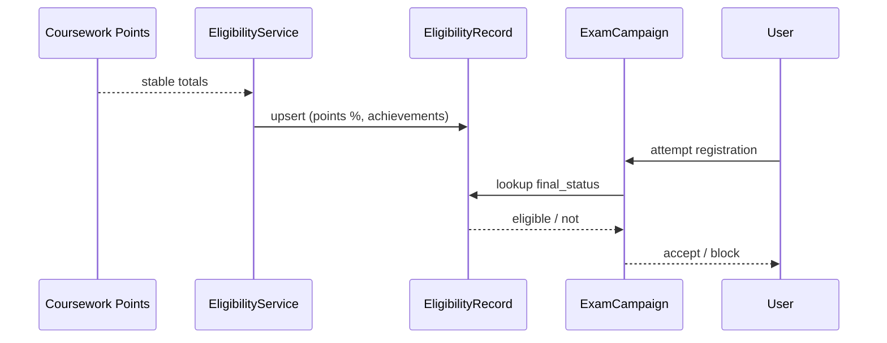

# Exam Eligibility & Grading Schemes

```admonish info "What it represents"
Integrates two adjacent concerns: (1) determining who may register for an exam, and (2) mapping exam (and optionally coursework) points to final grade values.
```

## 1. Eligibility Data Inputs
From Coursework & Achievements:
- Aggregated points & percentages per user (AssessmentParticipations + TaskPoints).
- Qualitative counts (LectureAchievements).
- Optional absolute/percentage thresholds (policy config).

From Registration:
- Confirmed roster membership (e.g., must be enrolled in lecture or prerequisite campaign).

## 2. Exam Eligibility Policy (Registration Gate)
```admonish note "Think of it as"
Implemented as a RegistrationPolicy (kind: exam_eligibility) evaluated inside the policy engine before allowing an Exam RegistrationCampaign submission (see [Registration System](02-registration-system.md)).
```

Typical config
```json
{
	"lecture_id": 42,
	"min_percentage": 50,
	"min_points_absolute": null,
	"required_achievement_kind": "blackboard_explanation",
	"required_achievement_count": 1,
	"included_assessment_types": ["assignment"],
	"include_archived": false
}
```

Computation (batch or targeted):
1. Collect candidate user ids (lecture roster or all with participations).
2. Sum relevant AssessmentParticipation points; derive percentage = (earned / max).
3. Count achievements of required kind.
4. Compute computed_status: eligible / ineligible.
5. Upsert ExamEligibilityRecord (points_total_cached, percentage_cached, achievement_count, computed_status, rule_details JSON).
6. Respect overrides (override_status present → final_status = override).

Override fields:
- override_status (e.g., override_eligible, override_ineligible)
- override_reason
- override_by (user_id)
- override_at (timestamp)

Final check in policy evaluator:
- Find record; use final_status to pass/fail.

## 3. Lifecycle Touch Points (Workflow Phases)
- Before Phase 7: coursework stabilizes (Phase 5) + achievements (Phase 6).
- Phase 7: compute eligibility records.
- Phase 8: exam registration policy consults records.
- After registration: changes to coursework may trigger recompute if before exam close (Phase 10).

## 4. Grading Schemes (Curves)
```admonish info "What it represents"
Applied after the exam is graded (Phase 9). Goal: convert raw exam (or combined coursework + exam) points into final grade_value.
```

Scheme Examples
- Absolute Cutoffs: percentage bands → grade.
- Percentile Bands: sorted distribution thresholds.
- Linear Scaling: grade = a * pct + b (clamped).
- Piecewise Mapping: explicit segments (e.g., 0–40 fail, 40–50 4.0, …).
- Future: Standardization (z-score) + mapping.

Suggested GradeScheme table (lightweight):
- assessment_id
- kind (absolute, percentile, linear, piecewise)
- config (jsonb) (bands, coefficients, piecewise segments)
- applied_at, applied_by
- version_hash (deterministic hash of config for idempotency)

Application Algorithm
1. Load or create GradeScheme (draft).
2. Analyze distribution (min, max, mean, percentiles) for UI.
3. Instructor edits config → persist.
4. Apply service iterates AssessmentParticipations:
	 - Skip if manual override flag set.
	 - Compute normalized pct (points / max_points).
	 - Map to grade_value.
5. Persist grade_value, set status/published if final.
6. Store version_hash; re-applying identical config is no-op.

Manual Adjustments:
- participation.manual_grade_value or manual flag triggers bypass on future applications.

## 5. Combining Coursework + Exam
```admonish note "Think of it as"
Two-stage approach keeps decoupling:
- Exam grade derived from exam assessment only.
- Course final grade (future) = weight_exam * exam_pct + weight_coursework * coursework_pct (configurable service).
- Optionally store aggregated CourseGradeRecord.
```

## 6. Recommended Indexes
- exam_eligibility_records (lecture_id, user_id) unique
- user_registrations partial index: unique where status=confirmed per (registration_campaign_id, user_id)
- grade_scheme (assessment_id) unique (active scheme)

## 7. Integrity Hooks
- Recompute eligibility after any significant published points delta (Phase 10) if before exam registration close.
- Preserve audit of overrides (immutable override_at).

## 8. Minimal Example (Pseudo)
```ruby
policy = lecture.exam_eligibility_policy
ExamEligibilityService.compute!(lecture: lecture, user_ids: target_ids)

if exam_campaign.eligible_user?(current_user)
	# Allow registration…
end

scheme = GradeScheme.find_or_create_by!(assessment: exam_assessment, kind: :absolute)
scheme.update!(config: { bands: [
	{ min_pct: 0.90, grade: "1.0" },
	{ min_pct: 0.80, grade: "1.3" },
	{ min_pct: 0.70, grade: "1.7" },
	{ min_pct: 0.60, grade: "2.3" },
	{ min_pct: 0.50, grade: "3.0" },
	{ min_pct: 0.40, grade: "3.7" }
]})
ExamGradeSchemeApplier.new(scheme).apply!
```

## 9. Sequence (Eligibility + Exam Registration)


