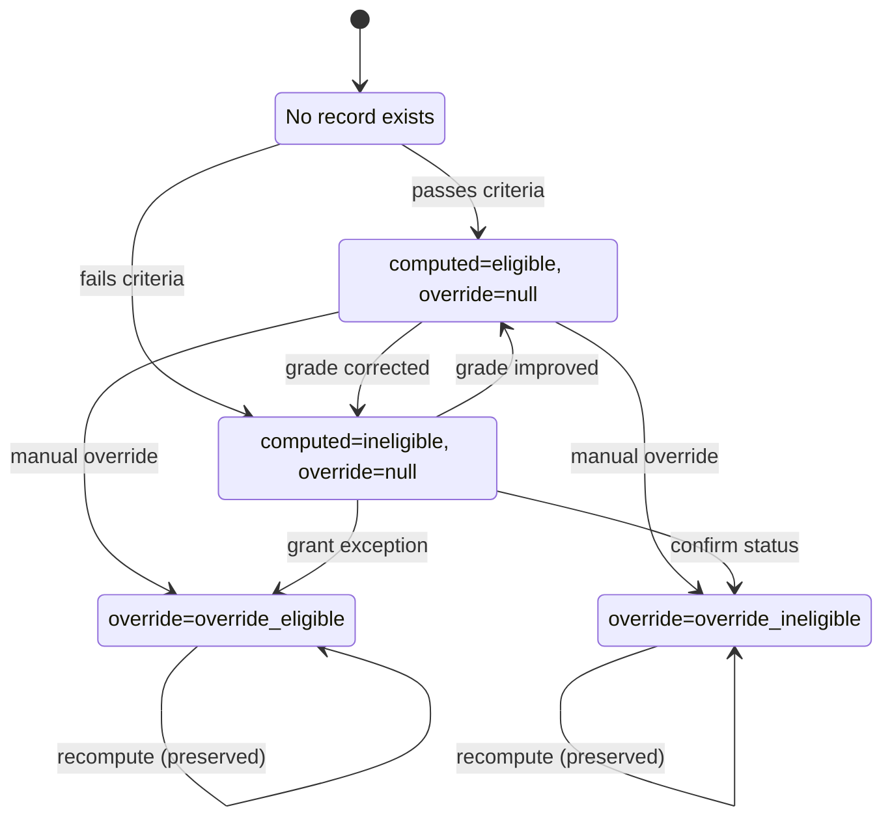
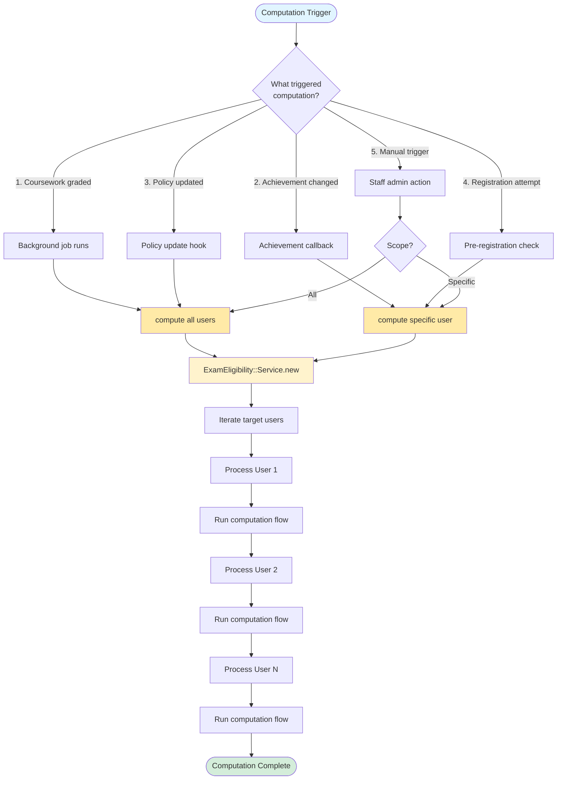
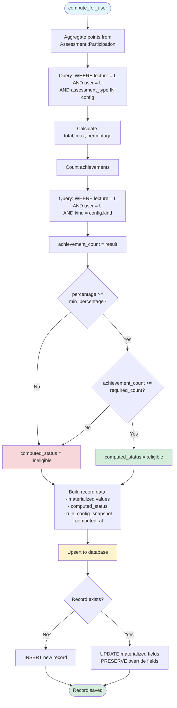
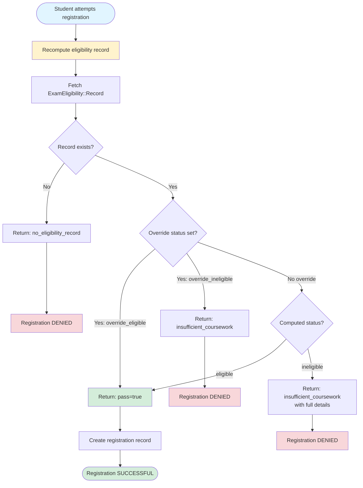
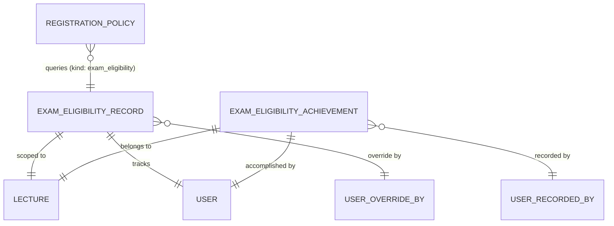
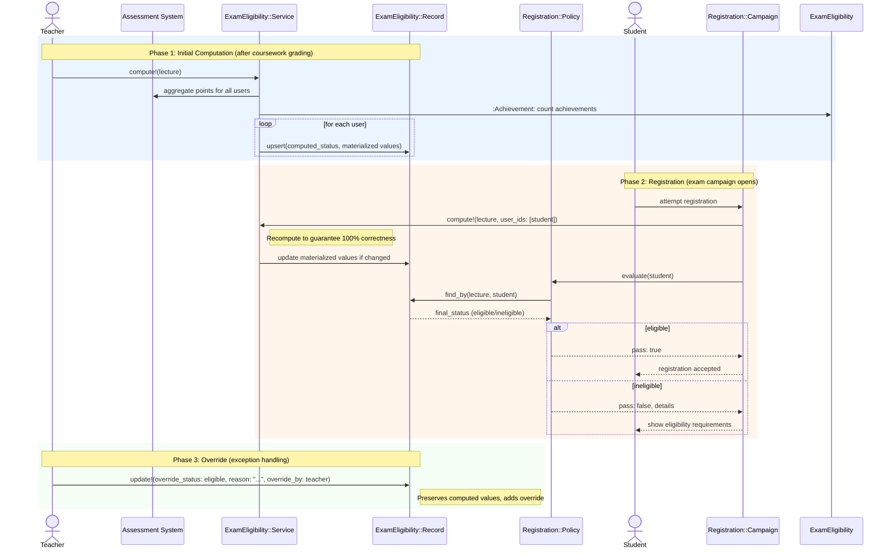

# Exam Eligibility

```admonish question "What is 'Exam Eligibility'?"
Exam eligibility is the determination of which students are permitted to register for an exam based on their coursework performance and achievements.

- **Common Examples:** "Must earn 50% of homework points to take the final exam", "Must present at least one blackboard explanation to qualify"
- **In this context:** A materialized eligibility status stored in the database that gates exam registration campaigns, computed from assessment points and lecture achievements and recomputed on demand to guarantee correctness.
```

## Problem Overview
After coursework and achievements are recorded, MaMpf needs to:
- **Enforce prerequisites:** Prevent unqualified students from registering for exams
- **Support flexible criteria:** Combine point thresholds (absolute/percentage), achievement counts, and custom rules
- **Materialize results:** Store computed eligibility to avoid expensive queries during registration
- **Guarantee correctness:** Recompute eligibility on demand at critical moments (registration time) to ensure 100% accuracy
- **Allow overrides:** Enable staff to manually grant or revoke eligibility with audit trail
- **Trigger recomputation:** Update eligibility when coursework grades change or policies are updated
- **Integrate with registration:** Work seamlessly with the Registration::Policy system

## Solution Architecture
We use a materialized eligibility model with policy-based evaluation and on-demand recomputation:
- **Canonical Source:** `ExamEligibility::Record` stores computed eligibility per (lecture, user) in the database
- **Not a Cache:** This is an authoritative computed record, not a performance optimization cache—correctness is guaranteed via recomputation at registration time
- **Policy Integration:** `Registration::Policy` with `kind: :exam_eligibility` queries records and triggers recomputation before finalizing registration
- **Service-Based Computation:** `ExamEligibility::Service` aggregates points and achievements, respects overrides
- **Achievement Tracking:** `ExamEligibility::Achievement` records qualitative accomplishments (e.g., blackboard presentations)
- **Recomputation Triggers:** Automatic updates when achievements change, policies update, or before any registration attempt
- **Idempotent Updates:** Re-running computation with same inputs produces same results
- **Audit Trail:** Override fields preserve who, when, and why manual adjustments were made
- **Lifecycle Integration:** Fits between coursework completion (Phase 5-6) and exam registration (Phase 8)

---

## ExamEligibility::Record (ActiveRecord Model)
**_Materialized Eligibility Status_**

```admonish info "What it represents"
A materialized database record of a student's eligibility to register for an exam in a specific lecture, computed from their coursework performance and achievements. This is not a cache—it's an authoritative computed record that can be recomputed on demand to guarantee correctness.
```

```admonish tip "Think of it as"
"Alice has earned 58% of homework points and completed 2 presentations, making her eligible for the Linear Algebra exam"
```

The main fields and methods of `ExamEligibility::Record` are:

| Name/Field                | Type/Kind         | Description                                                              |
|---------------------------|-------------------|--------------------------------------------------------------------------|
| `lecture_id`              | DB column (FK)    | The lecture this eligibility applies to                                  |
| `user_id`                 | DB column (FK)    | The student whose eligibility is materialized                            |
| `points_total_materialized` | DB column       | Sum of relevant assessment points at computation time                    |
| `points_max_materialized` | DB column         | Maximum possible points at computation time                              |
| `percentage_materialized` | DB column         | Computed percentage (points_total / points_max)                          |
| `achievement_count`       | DB column         | Count of required achievements (e.g., presentations)                     |
| `computed_status`         | DB column (Enum)  | System-computed status: `eligible`, `ineligible`                         |
| `override_status`         | DB column (Enum)  | Manual override: `override_eligible`, `override_ineligible`, `null`      |
| `override_reason`         | DB column         | Explanation for override (required if override_status present)           |
| `override_by_id`          | DB column (FK)    | User who applied the override                                            |
| `override_at`             | DB column         | Timestamp of override (immutable for audit)                              |
| `rule_config_snapshot`    | DB column (JSONB) | Copy of policy config used for this computation                          |
| `computed_at`             | DB column         | Timestamp of last computation                                            |
| `final_status`            | Method            | Returns override_status if present, otherwise computed_status            |

### Behavior Highlights

- Enforces uniqueness per (lecture, user) via database constraint
- `final_status` method provides the authoritative eligibility answer
- Overrides are immutable once set (audit trail)
- Re-computation updates materialized values and `computed_at` but preserves overrides
- `rule_config_snapshot` enables debugging: "What rule was used?"

### State Diagram: Record Lifecycle



### Example Implementation

```ruby
module ExamEligibility
  class Record < ApplicationRecord
    self.table_name = "exam_eligibility_records"

    belongs_to :lecture
    belongs_to :user
    belongs_to :override_by, class_name: "User", optional: true

    enum computed_status: { eligible: 0, ineligible: 1 }
    enum override_status: { override_eligible: 0, override_ineligible: 1 }

    validates :lecture_id, uniqueness: { scope: :user_id }
    validates :override_reason, presence: true, if: -> { override_status.present? }

    def final_status
      return override_status if override_status.present?
      computed_status
    end

    def eligible?
      final_status.to_s.include?("eligible") && !final_status.to_s.include?("ineligible")
    end
  end
end
```

### Usage Scenarios

- **After coursework completion:** A background job runs `ExamEligibility::Service.compute!(lecture: lecture)` to create or update records for all students. Alice's record shows `points_total_materialized: 58`, `points_max_materialized: 100`, `percentage_materialized: 58`, `achievement_count: 2`, `computed_status: :eligible`.

- **Registration attempt:** Bob tries to register for the exam. Before finalizing registration, the system runs `ExamEligibility::Service.compute!(lecture: lecture, user_ids: [bob.id])` to ensure 100% accuracy. The `Registration::Policy` (kind: :exam_eligibility) queries `ExamEligibility::Record.find_by(lecture: lecture, user: bob)` and checks `final_status`. Bob's record shows `computed_status: :ineligible` (only 42%), so registration is blocked.

- **Manual override:** Carol missed one homework due to illness but has a medical certificate. The professor manually overrides: `record.update!(override_status: :override_eligible, override_reason: "Medical exception approved", override_by: professor, override_at: Time.current)`. Now `final_status` returns `:override_eligible`.

- **Recomputation after grade change:** A tutor corrects Dave's homework score after the deadline. The system triggers `ExamEligibility::Service.compute!(lecture: lecture, user_ids: [dave.id])`. Dave's materialized values update (new `points_total_materialized`, `percentage_materialized`), but Carol's override remains untouched.

---

## ExamEligibility::Achievement (ActiveRecord Model)
**_Qualitative Accomplishment Tracker_**

```admonish info "What it represents"
A record of a specific qualitative accomplishment by a student in a lecture, such as presenting at the blackboard or leading a discussion. Used specifically for exam eligibility determination.
```

```admonish note "Think of it as"
"Alice presented the solution to Exercise 3.5 at the blackboard on 2024-11-15"
```

### Key Fields & Associations

| Name/Field       | Type/Kind        | Description                                                    |
|------------------|------------------|----------------------------------------------------------------|
| `lecture_id`     | DB column (FK)   | The lecture this achievement belongs to                        |
| `user_id`        | DB column (FK)   | The student who accomplished this                              |
| `kind`           | DB column (Enum) | Type of achievement: `blackboard_explanation`, `discussion_lead`, etc. |
| `description`    | DB column        | Optional details (e.g., "Presented Exercise 3.5")              |
| `achieved_at`    | DB column        | Date of accomplishment                                         |
| `recorded_by_id` | DB column (FK)   | Tutor or teacher who recorded this                             |

### Behavior Highlights

- Multiple achievements of same kind are allowed (count them)
- Soft-deletable to handle mistakes without breaking audit trail
- Simple model: no complex state, just a fact record

### Example Implementation

```ruby
module ExamEligibility
  class Achievement < ApplicationRecord
    self.table_name = "exam_eligibility_achievements"

    belongs_to :lecture
    belongs_to :user
    belongs_to :recorded_by, class_name: "User"

  enum kind: {
    blackboard_explanation: 0,
    discussion_lead: 1,
    peer_review: 2,
    optional_homework: 3
  }

  validates :lecture_id, :user_id, :kind, :achieved_at, presence: true

  scope :for_eligibility, -> { where.not(kind: :optional_homework) }
  end
end
```

### Usage Scenarios

- **During tutorial:** Tutor records that Emma presented: `ExamEligibility::Achievement.create!(lecture: lecture, user: emma, kind: :blackboard_explanation, description: "Exercise 4.2", achieved_at: Date.today, recorded_by: tutor)`.

- **Eligibility computation:** The service queries `ExamEligibility::Achievement.where(lecture: lecture, user: user, kind: :blackboard_explanation).count` to check if the student has met the requirement.

---

## ExamEligibility::Service (Service Object)
**_Eligibility Computer_**

```admonish info "What it represents"
A service that computes exam eligibility by aggregating assessment points, counting achievements, and upserting materialized records while respecting overrides. Guarantees correctness via on-demand recomputation at critical moments.
```

```admonish tip "Think of it as"
The "eligibility calculator" that runs after coursework is graded and before exam registration opens.
```

### Public Interface

| Method | Purpose |
|--------|---------|
| `initialize(lecture:, policy_config:)` | Sets up the service with lecture and eligibility rules |
| `compute!(user_ids: nil)` | Computes or updates eligibility for specified users (or all if nil) |
| `recompute_if_needed!(user_ids:)` | Only recomputes if exam registration is still open |

### Behavior Highlights

- **Batch or targeted:** Can compute for all users or specific subset
- **Respects overrides:** Never overwrites `override_status`, only updates materialized values and `computed_status`
- **Idempotent:** Running twice with same inputs produces same result
- **Correctness guarantee:** Recomputes before registration finalization to ensure 100% accuracy
- **Transaction-safe:** Uses database transaction for consistency
- **Efficient queries:** Aggregates points in single query, counts achievements separately

### Recomputation Triggers

The service is invoked in several scenarios to keep eligibility records accurate:
1. **After coursework grading:** Background job after assignment submission windows close
2. **After achievement changes:** When tutors record or correct lecture achievements
3. **After policy updates:** When staff modifies eligibility criteria mid-semester
4. **Before registration:** Explicit recomputation before finalizing any exam registration to guarantee 100% correctness
5. **On-demand by staff:** Manual trigger via admin interface for debugging or corrections

### Computation Workflow



### Service Computation Process



### Example Implementation

```ruby
module ExamEligibility
  class Service
    def initialize(lecture:, policy_config:)
      @lecture = lecture
      @config = policy_config
    end

    def compute!(user_ids: nil)
      target_users = user_ids || @lecture.subscribed_user_ids
      
      target_users.each do |user_id|
        record = compute_for_user(user_id)
        upsert_record(record)
      end
    end

    private

    def compute_for_user(user_id)
      points_data = aggregate_points(user_id)
      achievement_count = count_achievements(user_id)
      
      computed_status = determine_status(
        percentage: points_data[:percentage],
        achievement_count: achievement_count
      )

      {
        lecture_id: @lecture.id,
        user_id: user_id,
        points_total_materialized: points_data[:total],
        points_max_materialized: points_data[:max],
        percentage_materialized: points_data[:percentage],
        achievement_count: achievement_count,
        computed_status: computed_status,
        rule_config_snapshot: @config,
        computed_at: Time.current
      }
    end

    def aggregate_points(user_id)
      # Query Assessment::Participation for relevant assessments
      # Return { total:, max:, percentage: }
    end

    def count_achievements(user_id)
      ExamEligibility::Achievement
        .where(lecture: @lecture, user_id: user_id)
        .where(kind: @config["required_achievement_kind"])
        .count
    end

    def determine_status(percentage:, achievement_count:)
      meets_points = percentage >= @config["min_percentage"]
      meets_achievements = achievement_count >= @config["required_achievement_count"]
      
      (meets_points && meets_achievements) ? :eligible : :ineligible
    end

    def upsert_record(data)
      ExamEligibility::Record.upsert(
        data,
        unique_by: [:lecture_id, :user_id],
        update_only: [
          :points_total_materialized,
          :points_max_materialized,
          :percentage_materialized,
          :achievement_count,
          :computed_status,
          :rule_config_snapshot,
          :computed_at
        ]
      )
    end
  end
end
```

### Usage Scenarios

- **Initial computation:** After all homework is graded and before exam registration opens, an admin triggers: `ExamEligibility::Service.new(lecture: lecture, policy_config: policy.config).compute!`. The service processes all 200 students in the lecture.

- **Targeted recomputation:** A tutor changes one student's homework grade. A callback triggers: `ExamEligibility::Service.new(lecture: lecture, policy_config: policy.config).compute!(user_ids: [student.id])`. This ensures the student's record reflects current data.

- **Policy change:** The professor adjusts the threshold from 50% to 45%. The system re-runs: `ExamEligibility::Service.new(lecture: lecture, policy_config: new_config).compute!`. All `computed_status` values update, but overrides remain.

- **Before registration finalization:** When a student clicks "Confirm Registration", the system first runs `ExamEligibility::Service.new(lecture: lecture, policy_config: policy.config).compute!(user_ids: [student.id])` to guarantee the record is current, then checks eligibility. This guarantees 100% correctness at the critical moment.

---

## Integration with Registration::Policy

```admonish info "What it represents"
Exam eligibility is implemented as a special kind of `Registration::Policy` that queries materialized `ExamEligibility::Record` data and triggers recomputation before finalizing registration to guarantee correctness.
```

### Architecture Overview

The integration follows a clear separation of concerns:

**`ExamEligibility::Record`** (materialized data layer)
- Stores what the student has achieved (points, achievements, computed status)
- Can be recomputed from source data at any time
- Persists in database for efficient querying

**`Registration::Policy`** (gating logic layer)
- Defines what requirements must be met to register
- Queries `ExamEligibility::Record` to check if student passes
- Returns structured evaluation results for display

**`ExamEligibility::Service`** (computation layer)
- Aggregates assessment points and counts achievements
- Creates or updates `ExamEligibility::Record` entries
- Invoked before policy evaluation to guarantee correctness

### Policy Configuration

When a teacher creates an exam campaign with eligibility checking, they create a `Registration::Policy` record:

```ruby
campaign.registration_policies.create!(
  kind: :exam_eligibility,
  position: 1,
  active: true,
  config: {
    "lecture_id" => 42,
    "min_percentage" => 50,
    "min_points_absolute" => nil,
    "required_achievement_kind" => "blackboard_explanation",
    "required_achievement_count" => 1,
    "included_assessment_types" => ["assignment"],
    "include_archived" => false
  }
)
```

#### Config Field Reference

| Field | Type | Purpose |
|-------|------|---------|
| `lecture_id` | Integer | Which lecture this eligibility applies to |
| `min_percentage` | Float | Minimum percentage of points (0-100), mutually exclusive with `min_points_absolute` |
| `min_points_absolute` | Integer | Minimum absolute points, mutually exclusive with `min_percentage` |
| `required_achievement_kind` | String | Which achievement type to count (must match `ExamEligibility::Achievement.kinds`) |
| `required_achievement_count` | Integer | How many achievements of that kind are required |
| `included_assessment_types` | Array | Which assessment types to include in point calculation (e.g., `["assignment", "quiz"]`) |
| `include_archived` | Boolean | Whether to include archived assessments in calculation |

#### Why JSONB for Config?

The config is stored as JSONB (flexible key-value structure) rather than fixed columns because:

1. **Per-lecture customization:** Different lectures have different rules without schema migrations
2. **Mid-semester adjustments:** Teachers can change thresholds (e.g., from 50% to 45%) by updating the JSON
3. **Future extensibility:** New criteria types can be added without altering database structure
4. **Rule snapshots:** `ExamEligibility::Record.rule_config_snapshot` preserves the exact config used for computation

#### Achievement Kind Validation

The `required_achievement_kind` in config must reference a valid enum value from `ExamEligibility::Achievement`:

```ruby
# In ExamEligibility::Achievement
enum kind: {
  blackboard_explanation: 0,
  discussion_lead: 1,
  peer_review: 2,
  optional_homework: 3
}
```

This creates a validation bridge:

```ruby
class Registration::Policy < ApplicationRecord
  validate :valid_achievement_kind, if: -> { kind == "exam_eligibility" }

  private

  def valid_achievement_kind
    required = config["required_achievement_kind"]
    return if required.blank?
    
    valid_kinds = ExamEligibility::Achievement.kinds.keys.map(&:to_s)
    unless valid_kinds.include?(required)
      errors.add(:config, "references unknown achievement kind: #{required}")
    end
  end
end
```

### Evaluation Flow

When a student attempts to register, the system follows this sequence:

#### Step 1: Ensure Data Freshness

```ruby
# Before policy evaluation
ExamEligibility::Service.new(
  lecture: lecture,
  policy_config: policy.config
).compute!(user_ids: [student.id])
```

This recomputes the student's eligibility record from current source data (assessment participations, achievements). Even if a record already exists, it's updated to reflect any recent grade changes.

#### Step 2: Evaluate Policy

```ruby
# In Registration::Policy#evaluate(user)
def evaluate(user)
  # Fetch the materialized record
  record = ExamEligibility::Record.find_by(
    lecture_id: config["lecture_id"],
    user_id: user.id
  )
  
  # No record means student never participated in coursework
  return { pass: false, code: :no_eligibility_record } unless record
  
  # Check final_status (respects overrides)
  if record.eligible?
    { pass: true }
  else
    {
      pass: false,
      code: :insufficient_coursework,
      details: {
        percentage: record.percentage_materialized,
        required: config["min_percentage"],
        achievements: record.achievement_count,
        required_achievements: config["required_achievement_count"]
      }
    }
  end
end
```

#### Step 3: Registration Decision

```ruby
# In Registration::Campaign#process_registration(user)
evaluation = registration_policies
  .active
  .order(:position)
  .map { |policy| policy.evaluate(user) }
  .find { |result| !result[:pass] }

if evaluation.nil?
  # All policies passed
  create_registration!(user)
else
  # At least one policy failed
  render_error(evaluation[:code], evaluation[:details])
end
```

### Flowchart: Registration Evaluation Process



### Complete Example Walkthrough

**Setup Phase:**

1. Professor creates Linear Algebra lecture with weekly homework assignments
2. Professor sets up exam campaign for final exam
3. Professor adds eligibility policy:
   ```ruby
   policy = campaign.registration_policies.create!(
     kind: :exam_eligibility,
     config: {
       "lecture_id" => linear_algebra.id,
       "min_percentage" => 50,
       "required_achievement_kind" => "blackboard_explanation",
       "required_achievement_count" => 1
     }
   )
   ```

**Computation Phase:**

1. Semester progresses, students submit homework, tutors grade
2. After final homework deadline, background job runs:
   ```ruby
   ExamEligibility::Service.new(
     lecture: linear_algebra,
     policy_config: policy.config
   ).compute!
   ```
3. System creates `ExamEligibility::Record` entries:
   - Alice: 58/100 points (58%), 2 presentations → eligible
   - Bob: 42/100 points (42%), 0 presentations → ineligible
   - Carol: 65/100 points (65%), 0 presentations → ineligible (missing achievement)

**Registration Phase:**

1. Alice attempts registration:
   ```ruby
   # Recompute to ensure freshness
   service.compute!(user_ids: [alice.id])
   
   # Evaluate policy
   result = policy.evaluate(alice)
   # => { pass: true }
   
   # Registration succeeds
   ```

2. Bob attempts registration:
   ```ruby
   # Recompute
   service.compute!(user_ids: [bob.id])
   
   # Evaluate
   result = policy.evaluate(bob)
   # => {
   #   pass: false,
   #   code: :insufficient_coursework,
   #   details: { percentage: 42, required: 50, achievements: 0, required_achievements: 1 }
   # }
   
   # Registration blocked, details shown to Bob
   ```

3. Carol attempts registration (enough points, but missing presentation):
   ```ruby
   result = policy.evaluate(carol)
   # => {
   #   pass: false,
   #   code: :insufficient_coursework,
   #   details: { percentage: 65, required: 50, achievements: 0, required_achievements: 1 }
   # }
   
   # Registration blocked despite having 65% points
   ```

4. Professor grants override for Carol (medical exception):
   ```ruby
   record = ExamEligibility::Record.find_by(lecture: linear_algebra, user: carol)
   record.update!(
     override_status: :override_eligible,
     override_reason: "Medical exemption for presentation requirement",
     override_by: professor,
     override_at: Time.current
   )
   ```

5. Carol attempts registration again:
   ```ruby
   # Recompute (preserves override)
   service.compute!(user_ids: [carol.id])
   
   # Evaluate
   result = policy.evaluate(carol)
   # record.final_status returns :override_eligible
   # => { pass: true }
   
   # Registration succeeds
   ```

### Policy Evaluation Guarantees

The integration provides several guarantees:

1. **Freshness:** Recomputation before evaluation ensures no stale data
2. **Consistency:** All students evaluated against same criteria (from policy config)
3. **Auditability:** `rule_config_snapshot` in record shows exact rules used
4. **Override preservation:** Manual overrides survive recomputation
5. **Idempotency:** Repeated evaluation with same data yields same result

### Multiple Policies

A campaign can have multiple policies that must all pass:

```ruby
# Example: Eligibility + enrollment deadline + course prerequisite
campaign.registration_policies.create!([
  { kind: :exam_eligibility, position: 1, config: { ... } },
  { kind: :deadline, position: 2, config: { ... } },
  { kind: :course_prerequisite, position: 3, config: { ... } }
])
```

Policies are evaluated in `position` order. First failure stops evaluation and returns that failure to the user.

---

## ERD



---

## Sequence Diagram



---

## Proposed Folder Structure

```text
app/
├── models/
│   └── exam_eligibility/
│       ├── record.rb
│       └── achievement.rb
│
└── services/
    └── exam_eligibility/
        └── service.rb
```

### Key Files
- `app/models/exam_eligibility/record.rb` - Materialized eligibility status with recomputation support
- `app/models/exam_eligibility/achievement.rb` - Qualitative accomplishments for eligibility
- `app/services/exam_eligibility/service.rb` - Eligibility computation logic with correctness guarantees

---

## Database Tables

- `exam_eligibility_records` - Materialized per-user eligibility with overrides
- `exam_eligibility_achievements` - Qualitative accomplishment records for eligibility

```admonish note
Column details for each table are documented in the respective model sections above.
```

