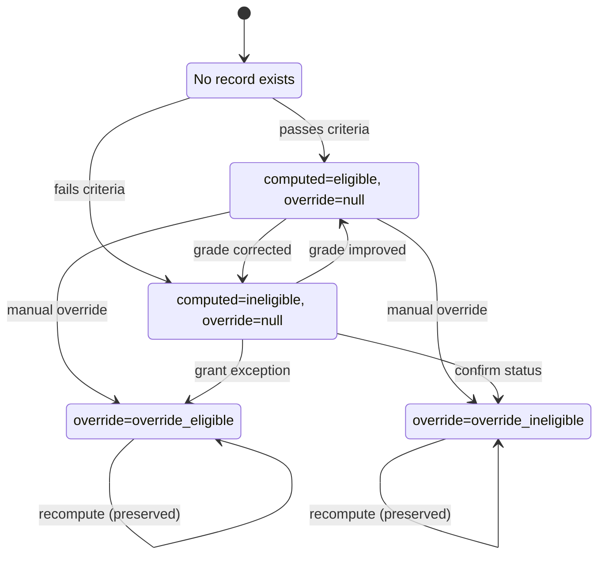
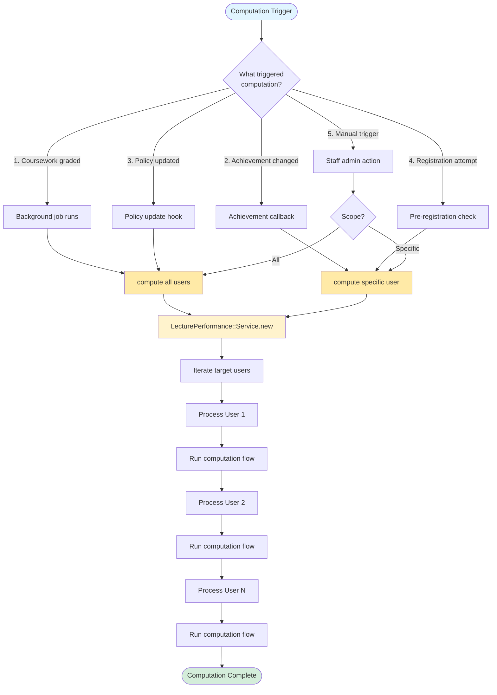
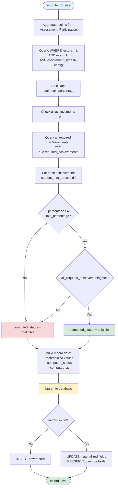
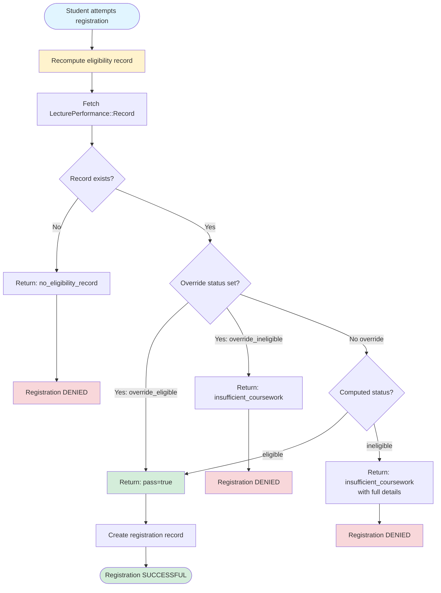
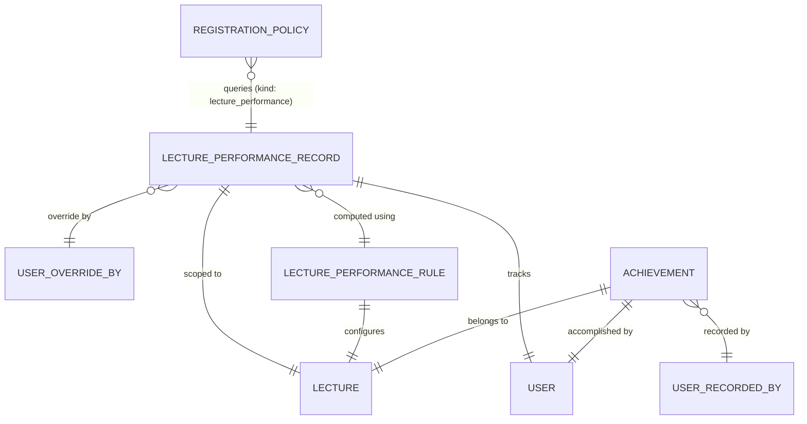
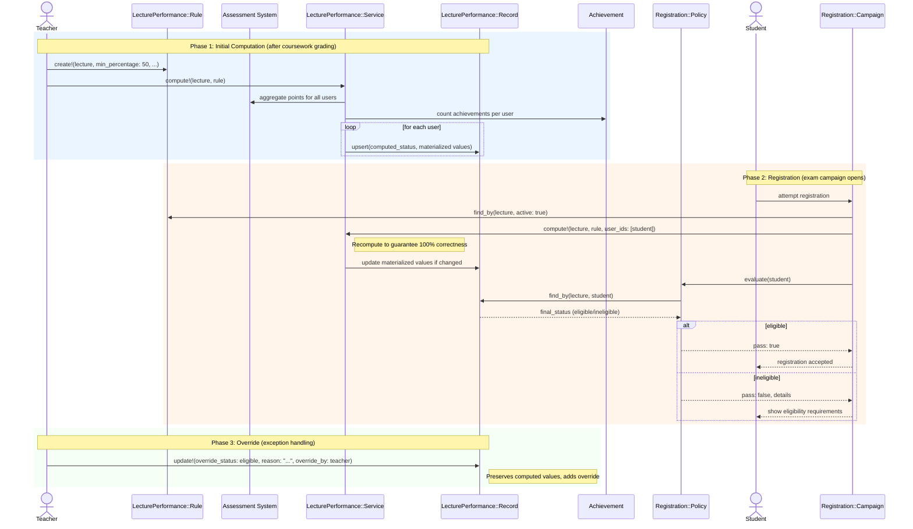

# Lecture Performance

```admonish question "What is 'Lecture Performance'?"
A lecture performance system tracks and materializes student achievement across all coursework in a lecture for multiple purposes.

- **Common Examples:** "Alice earned 80% of homework points", "Bob completed 2 presentations", "Carol is eligible for the exam"
- **In this context:** A unified system that materializes student performance data (points, achievements, computed eligibility status) for use in dashboards, exam registration policies, certificates, and early intervention.
```

## Problem Overview
Students participate in lectures by completing assignments, giving presentations, and attending tutorials. This generates scattered performance data across multiple assessments. MaMpf needs to:
- **Compute exam eligibility:** Determine which students meet criteria for exam registration
- **Track achievements:** Record qualitative accomplishments (presentations, participation)
- **Support dashboards:** Surface progress and completion status to students and teachers
- **Enable policies:** Integrate performance data into registration policies for exam gating

## Solution Architecture
We use a materialized view pattern with override support:
- **Canonical Source:** `LecturePerformance::Record` stores computed performance per (lecture, user) in the database

## Problem Overview
After coursework and achievements are recorded, MaMpf needs to:
- **Enforce prerequisites:** Prevent unqualified students from registering for exams
- **Support flexible criteria:** Combine point thresholds (absolute/percentage), achievement counts, and custom rules
- **Materialize results:** Store computed eligibility to avoid expensive queries during registration
- **Guarantee correctness:** Recompute eligibility on demand at critical moments (registration time) to ensure 100% accuracy
- **Allow overrides:** Enable staff to manually grant or revoke eligibility with audit trail
- **Trigger recomputation:** Update eligibility when coursework grades change or policies are updated
- **Integrate with registration:** Work seamlessly with the Registration::Policy system

## Solution Architecture
We use a materialized eligibility model with policy-based evaluation and on-demand recomputation:
- **Canonical Source:** `LecturePerformance::Record` stores computed eligibility per (lecture, user) in the database
- **Not a Cache:** This is an authoritative computed record, not a performance optimization cache—correctness is guaranteed via recomputation at registration time
- **Policy Integration:** `Registration::Policy` with `kind: :lecture_performance` queries records and triggers recomputation before finalizing registration
- **Service-Based Computation:** `LecturePerformance::Service` aggregates points and achievements, respects overrides
- **Achievement Tracking:** Top-level `Achievement` model records qualitative accomplishments (e.g., blackboard presentations)
- **Recomputation Triggers:** Automatic updates when achievements change, policies update, or before any registration attempt
- **Idempotent Updates:** Re-running computation with same inputs produces same results
- **Audit Trail:** Override fields preserve who, when, and why manual adjustments were made
- **Lifecycle Integration:** Fits between coursework completion (Phase 5-6) and exam registration (Phase 8)

<!-- Stability & Early Registration sections relocated below core models/services -->

---

## LecturePerformance::Record (ActiveRecord Model)
**_Materialized Eligibility Status_**

```admonish info "What it represents"
A materialized database record of a student's eligibility to register for an exam in a specific lecture, computed from their coursework performance and achievements. This is not a cache—it's an authoritative computed record that can be recomputed on demand to guarantee correctness.

**Records exist for all students enrolled in the lecture**, regardless of whether they register for the exam. This ensures legal compliance and transparency: every student's eligibility status is documented and auditable.
```

```admonish tip "Think of it as"
"Alice has earned 58% of homework points and completed 2 presentations, making her eligible for the Linear Algebra exam"
```

```admonish warning "Performance Records vs Exam Roster"
`LecturePerformance::Record` covers **all lecture students** (e.g., 150 students).

The **exam roster** (materialized after registration) contains only **students who successfully registered** (e.g., 85 of 126 eligible students).

These are two distinct lists serving different purposes:
- Performance records: Track achievement for dashboards, certificates, and eligibility verification
- Exam roster: Operational list for exam administration and grading
```

The main fields and methods of `LecturePerformance::Record` are:

| Name/Field                | Type/Kind         | Description                                                              |
|---------------------------|-------------------|--------------------------------------------------------------------------|
| `lecture_id`              | DB column (FK)    | The lecture this eligibility applies to                                  |
| `user_id`                 | DB column (FK)    | The student whose eligibility is materialized                            |
| `points_total_materialized` | DB column       | Sum of relevant assessment points at computation time                    |
| `points_max_materialized` | DB column         | Maximum possible points at computation time                              |
| `percentage_materialized` | DB column         | Computed percentage (points_total / points_max)                          |
| `all_required_achievements_met` | DB column (Bool)  | Whether student met all required achievements                    |
| `computed_status`         | DB column (Enum)  | System-computed status: `eligible`, `ineligible`                         |
| `override_status`         | DB column (Enum)  | Manual override: `override_eligible`, `override_ineligible`, `null`      |
| `override_reason`         | DB column         | Explanation for override (required if override_status present)           |
| `override_by_id`          | DB column (FK)    | User who applied the override                                            |
| `override_at`             | DB column         | Timestamp of override (immutable for audit)                              |
| `computed_at`             | DB column         | Timestamp of last computation                                            |
| `final_status`            | Method            | Returns override_status if present, otherwise computed_status            |

### Behavior Highlights

- Enforces uniqueness per (lecture, user) via database constraint
- `final_status` method provides the authoritative eligibility answer
- Overrides are immutable once set (audit trail)
- Re-computation updates materialized values and `computed_at` but preserves overrides

### State Diagram: Record Lifecycle



### Example Implementation

```ruby
module LecturePerformance
  class Record < ApplicationRecord
    self.table_name = "lecture_performance_records"

    belongs_to :lecture
    belongs_to :user
    belongs_to :override_by, class_name: "User", optional: true

    enum computed_status: { eligible: 0, ineligible: 1 }
    enum override_status: { override_eligible: 0, override_ineligible: 1 }

    validates :lecture_id, uniqueness: { scope: :user_id }
    validates :override_reason, presence: true, if: -> { override_status.present? }

    def final_status
      return override_status if override_status.present?
      computed_status
    end

    def eligible?
      final_status.to_s.include?("eligible") && !final_status.to_s.include?("ineligible")
    end
  end
end
```

```admonish note "Dispatcher difference"
The `Registration::Policy#evaluate` in the Registration chapter uses a
`case` dispatch to delegate to `eval_exam`, `eval_email`, etc. This
chapter focuses only on the exam (lecture performance) branch and shows
its internal logic. For the canonical dispatcher, see Registration →
`Registration::Policy` and the `eval_exam` note that points back here.
```

### Usage Scenarios

- **After coursework completion:** A background job runs `LecturePerformance::Service.compute!(lecture: lecture)` to create or update records for all students. Alice's record shows `points_total_materialized: 58`, `points_max_materialized: 100`, `percentage_materialized: 58`, `all_required_achievements_met: true`, `computed_status: :eligible`.

- **Registration attempt:** Bob tries to register for the exam. Before finalizing registration, the system runs `LecturePerformance::Service.compute!(lecture: lecture, user_ids: [bob.id])` to ensure 100% accuracy. The `Registration::Policy` (kind: :lecture_performance) queries `LecturePerformance::Record.find_by(lecture: lecture, user: bob)` and checks `final_status`. Bob's record shows `computed_status: :ineligible` (only 42%), so registration is blocked.

- **Manual override:** Carol missed one homework due to illness but has a medical certificate. The professor manually overrides: `record.update!(override_status: :override_eligible, override_reason: "Medical exception approved", override_by: professor, override_at: Time.current)`. Now `final_status` returns `:override_eligible`.

- **Recomputation after grade change:** A tutor corrects Dave's homework score after the deadline. The system triggers `LecturePerformance::Service.compute!(lecture: lecture, user_ids: [dave.id])`. Dave's materialized values update (new `points_total_materialized`, `percentage_materialized`), but Carol's override remains untouched.

---

## Achievement (ActiveRecord Model)
**_Qualitative Student Accomplishments (Assessable Type)_**

```admonish info "What it represents"
An assessable type that tracks qualitative student accomplishments during a lecture (e.g., blackboard presentations, discussion participation). Unlike assignments or exams, achievements can be boolean (pass/fail), numeric (count-based), or percentage-based. They integrate with the Assessment infrastructure for participation tracking and tutor grading workflows.
```

```admonish tip "Think of it as"
"Blackboard Presentation Achievement (boolean pass/fail)", "Attendance Achievement (numeric: 12 of 15)", "Lab Participation Achievement (percentage: 80%)"
```

### Key Fields & Associations

| Name/Field       | Type/Kind       | Description                                              |
|------------------|-----------------|----------------------------------------------------------|
| `lecture_id`     | DB column (FK)  | The lecture this achievement belongs to                  |
| `title`          | DB column       | Human-readable name (e.g., "Blackboard Presentation")    |
| `value_type`     | DB column (Enum)| How achievement is measured: `boolean`, `numeric`, `percentage` |
| `threshold`      | DB column       | Required value for completion (nil for boolean, count for numeric, percentage for percentage) |
| `description`    | DB column (Text)| Optional explanation shown to students                   |
| `rule_achievements` | Association  | Has many `LecturePerformance::RuleAchievement` (join table)|
| `assessment`     | Association     | Has one `Assessment::Assessment` (polymorphic assessable)|

### Value Types

| Type         | Threshold Meaning                        | Participation Grade Encoding           | Example                          |
|--------------|------------------------------------------|----------------------------------------|----------------------------------|
| `boolean`    | Not used (always pass/fail)              | `"Pass"` or `"Fail"`                   | Blackboard presentation (yes/no) |
| `numeric`    | Required count                           | Integer count as `grade_value`         | Attendance: 12 of 15             |
| `percentage` | Required percentage (0-100)              | Percentage as `grade_value`            | Lab participation: 75%           |

### Behavior Highlights

- **Assessable Integration:** Each Achievement has one `Assessment::Assessment` record where `assessable_type = "Achievement"` and `assessable_id = achievement.id`
- **Participation Seeding:** When created, participations are seeded for all students in the lecture roster
- **Tutor Grading:** Tutors mark achievement completion via existing `Assessment::Participation` editing UI:
  - Boolean: Check/uncheck "Completed" → sets `grade_value: "Pass"/"Fail"`
  - Numeric: Enter count → sets `grade_value: <count>`
  - Percentage: Enter percentage → sets `grade_value: <percentage>`
- **No Tasks/Submissions:** Achievements do not use `Assessment::Task` (no per-task breakdown) and do not require file uploads (`requires_submission: false`)
- **Eligibility Checking:** LecturePerformance::Service reads participation `grade_value` to determine if student meets threshold
- **Deletion Protection:** Cannot delete achievement if referenced by any rule (`dependent: :restrict_with_error`). Database FK constraint provides additional layer (`on_delete: :restrict`)

### Example Implementation

```ruby
class Achievement < ApplicationRecord
  include Assessment::Assessable
  
  belongs_to :lecture
  has_many :rule_achievements, 
           class_name: "LecturePerformance::RuleAchievement",
           dependent: :restrict_with_error

  enum value_type: { boolean: 0, numeric: 1, percentage: 2 }

  validates :lecture_id, :value_type, :title, presence: true
  validates :threshold, numericality: { greater_than: 0 }, if: -> { numeric? || percentage? }
  validates :threshold, absence: true, if: :boolean?

  after_create :create_assessment_infrastructure

  def create_assessment_infrastructure
    ensure_assessment!(
      title: title,
      requires_points: false,
      requires_submission: false
    )
    seed_participations_from_roster!
  end

  def seed_participations_from_roster!
    # Override from Assessment::Assessable concern
    # Achievement roster = all lecture students
    assessment.seed_participations_from!(user_ids: lecture.students.pluck(:id))
  end

  def student_met_threshold?(user)
    participation = assessment.participations.find_by(user: user)
    return false unless participation&.grade_value.present?

    case value_type
    when "boolean"
      participation.grade_value == "Pass"
    when "numeric"
      participation.grade_value.to_i >= threshold
    when "percentage"
      participation.grade_value.to_f >= threshold
    end
  end
end
```

### Usage Scenarios

- **Teacher creates achievement:** Navigate to Lecture → Assessments → New Assessment → select "Achievement". Enter title ("Blackboard Presentation"), choose value_type ("boolean"). System creates Achievement + Assessment + Participations for all students.

- **Tutor marks completion:** In tutorial roster view, tutor sees participation list for "Blackboard Presentation" achievement. Checks box next to Emma's name → `participation.grade_value = "Pass"`.

- **Eligibility computation:** LecturePerformance::Service calls `achievement.student_met_threshold?(emma)` which checks if Emma's participation has `grade_value: "Pass"`.

---

## LecturePerformance::Rule (ActiveRecord Model)
**_Eligibility Criteria Configuration_**

```admonish info "What it represents"
A configuration record that defines the criteria a student must meet to be eligible for an exam. Each lecture has at most one rule that is evaluated to determine eligibility.
```

```admonish tip "Think of it as"
"To be eligible for the Linear Algebra exam, you need 50% homework points AND 1 blackboard presentation"
```

### Key Fields & Associations

| Name/Field                     | Type/Kind        | Description                                                    |
|--------------------------------|------------------|----------------------------------------------------------------|
| `lecture_id`                   | DB column (FK)   | The lecture this rule applies to                               |
| `min_percentage`               | DB column        | Minimum percentage of points (0-100), mutually exclusive with `min_points_absolute` |
| `min_points_absolute`          | DB column        | Minimum absolute points, mutually exclusive with `min_percentage` |
| `included_assessment_types`    | DB column (Array)| Which assessment types to include (e.g., `["assignment", "quiz"]`) |
| `include_archived`             | DB column (Bool) | Whether to include archived assessments                        |
| `active`                       | DB column (Bool) | Whether this rule is currently in effect                       |
| `rule_achievements`            | Association      | Join records linking to required achievements                  |
| `required_achievements`        | Association      | Achievement records that must be completed (via `rule_achievements`) |

### Behavior Highlights

- Stored as a database record (not just JSONB config) for better querying and validation
- One lecture can have one active rule at a time
- References multiple achievements via join table (`lecture_performance_rule_achievements`)
- Database-level integrity prevents deletion of achievements still referenced by rules
- Enforces mutual exclusivity of percentage vs absolute point thresholds

### Example Implementation

```ruby
module LecturePerformance
  class Rule < ApplicationRecord
    self.table_name = "lecture_performance_rules"

    belongs_to :lecture
    has_many :rule_achievements, 
             class_name: "LecturePerformance::RuleAchievement",
             dependent: :destroy
    has_many :required_achievements, 
             through: :rule_achievements, 
             source: :achievement

    validates :lecture_id, presence: true
    validates :min_percentage, numericality: { greater_than_or_equal_to: 0, less_than_or_equal_to: 100 }, allow_nil: true
    validates :min_points_absolute, numericality: { greater_than_or_equal_to: 0 }, allow_nil: true
    validate :percentage_or_absolute_not_both

    def to_config
      {
        "lecture_id" => lecture_id,
        "min_percentage" => min_percentage,
        "min_points_absolute" => min_points_absolute,
        "required_achievement_ids" => required_achievements.pluck(:id),
        "included_assessment_types" => included_assessment_types,
        "include_archived" => include_archived
      }
    end

    private

    def percentage_or_absolute_not_both
      if min_percentage.present? && min_points_absolute.present?
        errors.add(:base, "Cannot specify both percentage and absolute point threshold")
      end
    end
  end
end

module LecturePerformance
  class RuleAchievement < ApplicationRecord
    self.table_name = "lecture_performance_rule_achievements"
    
    belongs_to :rule, class_name: "LecturePerformance::Rule"
    belongs_to :achievement
    
    validates :rule_id, uniqueness: { scope: :achievement_id }
    validates :position, presence: true
    
    acts_as_list scope: :rule  # For ordering in UI
  end
end
```

### Usage Scenarios

- **Professor sets up rule:** Teacher first creates achievements: 
  ```ruby
  presentation = Achievement.create!(lecture: linear_algebra, title: "Blackboard Presentation", value_type: :boolean)
  attendance = Achievement.create!(lecture: linear_algebra, title: "Lab Attendance", value_type: :numeric, threshold: 12)
  ```
  Then creates rule and associates achievements:
  ```ruby
  rule = LecturePerformance::Rule.create!(lecture: linear_algebra, min_percentage: 50)
  rule.required_achievements << [presentation, attendance]
  ```

- **Mid-semester adjustment:** Professor realizes 50% is too strict, updates: `rule.update!(min_percentage: 45)`. System triggers recomputation for all students.

- **Adding achievement to rule:** Professor adds new requirement: `rule.required_achievements << bonus_achievement`. Join table automatically creates relationship.

- **Preventing achievement deletion:** Teacher tries to delete achievement used in rule: `presentation.destroy` raises `ActiveRecord::InvalidForeignKey`. UI shows: "Cannot delete - used in 2 performance rules".

- **Service uses rule:** The computation service loads the active rule: `rule = LecturePerformance::Rule.find_by(lecture: lecture, active: true)` and accesses `rule.required_achievements` for evaluation.

---

## LecturePerformance::Service (Service Object)
**_Performance Computer_**

```admonish info "What it represents"
A service that computes lecture performance by aggregating assessment points, counting achievements, and upserting materialized records while respecting overrides. Guarantees correctness via on-demand recomputation at critical moments.
```

```admonish tip "Think of it as"
The "performance calculator" that runs after coursework is graded and before exam registration opens.
```

### Public Interface

| Method | Purpose |
|--------|---------|
| `initialize(lecture:, policy_config:)` | Sets up the service with lecture and eligibility rules |
| `compute!(user_ids: nil)` | Computes or updates eligibility for specified users (or all if nil) |
| `recompute_if_needed!(user_ids:)` | Only recomputes if exam registration is still open |

### Behavior Highlights

- **Batch or targeted:** Can compute for all users or specific subset
- **Respects overrides:** Never overwrites `override_status`, only updates materialized values and `computed_status`
- **Idempotent:** Running twice with same inputs produces same result
- **Correctness guarantee:** Recomputes before registration finalization to ensure 100% accuracy
- **Transaction-safe:** Uses database transaction for consistency
- **Efficient queries:** Aggregates points in single query, counts achievements separately

### Recomputation Triggers

The service is invoked in several scenarios to keep eligibility records accurate:
1. **After coursework grading:** Background job after assignment submission windows close
2. **After achievement changes:** When tutors record or correct lecture achievements
3. **After policy updates:** When staff modifies eligibility criteria mid-semester
4. **Before registration:** Explicit recomputation before finalizing any exam registration to guarantee 100% correctness
5. **On-demand by staff:** Manual trigger via admin interface for debugging or corrections

### Computation Workflow



### Service Computation Process



### Example Implementation

```ruby
module LecturePerformance
  class Service
    def initialize(lecture:, rule:)
      @lecture = lecture
      @rule = rule
    end

    def compute!(user_ids: nil)
      target_users = user_ids || @lecture.subscribed_user_ids
      
      target_users.each do |user_id|
        record = compute_for_user(user_id)
        upsert_record(record)
      end
    end

    private

    def compute_for_user(user_id)
      points_data = aggregate_points(user_id)
      all_achievements_met = check_all_achievements_met(user_id)
      
      computed_status = determine_status(
        percentage: points_data[:percentage],
        all_achievements_met: all_achievements_met
      )

      {
        lecture_id: @lecture.id,
        user_id: user_id,
        points_total_materialized: points_data[:total],
        points_max_materialized: points_data[:max],
        percentage_materialized: points_data[:percentage],
        all_required_achievements_met: all_achievements_met,
        computed_status: computed_status,
        computed_at: Time.current
      }
    end

    def aggregate_points(user_id)
      # Query Assessment::Participation for relevant assessments
      # Return { total:, max:, percentage: }
    end

    def check_all_achievements_met(user_id)
      required = @rule.required_achievements.to_a
      return true if required.empty?
      
      required.all? do |achievement|
        achievement.student_met_threshold?(User.find(user_id))
      end
    end

    def determine_status(percentage:, all_achievements_met:)
      threshold = @rule.min_percentage || calculate_percentage(@rule.min_points_absolute)
      meets_points = percentage >= threshold
      
      (meets_points && all_achievements_met) ? :eligible : :ineligible
    end

    def calculate_percentage(absolute_points)
      # Convert absolute points to percentage based on total available points
    end

    def upsert_record(data)
      LecturePerformance::Record.upsert(
        data,
        unique_by: [:lecture_id, :user_id],
        update_only: [
          :points_total_materialized,
          :points_max_materialized,
          :percentage_materialized,
          :all_required_achievements_met,
          :computed_status,
          :computed_at
        ]
      )
    end
  end
end
```

### Usage Scenarios

- **Initial computation:** After all homework is graded and before exam registration opens, an admin triggers: `rule = LecturePerformance::Rule.find_by(lecture: lecture, active: true); LecturePerformance::Service.new(lecture: lecture, rule: rule).compute!`. The service processes all 200 students in the lecture.

- **Targeted recomputation:** A tutor changes one student's homework grade. A callback triggers: `LecturePerformance::Service.new(lecture: lecture, rule: rule).compute!(user_ids: [student.id])`. This ensures the student's record reflects current data.

- **Rule change:** The professor adjusts the threshold from 50% to 45%. After updating the rule: `rule.update!(min_percentage: 45)`, the system re-runs: `LecturePerformance::Service.new(lecture: lecture, rule: rule).compute!`. All `computed_status` values update, but overrides remain.

- **Before registration finalization:** When a student clicks "Confirm Registration", the system first runs `LecturePerformance::Service.new(lecture: lecture, rule: rule).compute!(user_ids: [student.id])` to guarantee the record is current, then checks eligibility. This guarantees 100% correctness at the critical moment.

---

## Integration with Registration::Policy

```admonish info "What it represents"
Exam eligibility is implemented as a special kind of `Registration::Policy` that queries materialized `LecturePerformance::Record` data and triggers recomputation before finalizing registration to guarantee correctness.
```

### Architecture Overview

The integration follows a clear separation of concerns:

**`LecturePerformance::Record`** (materialized data layer)
- Stores what the student has achieved (points, achievements, computed status)
- Can be recomputed from source data at any time
- Persists in database for efficient querying

**`Registration::Policy`** (gating logic layer)
- Defines what requirements must be met to register
- Queries `LecturePerformance::Record` to check if student passes
- Returns structured evaluation results for display

**`LecturePerformance::Service`** (computation layer)
- Aggregates assessment points and counts achievements
- Creates or updates `LecturePerformance::Record` entries
- Invoked before policy evaluation to guarantee correctness

### Policy Configuration

When a teacher creates an exam campaign with eligibility checking, they create a `Registration::Policy` record that **references the lecture's performance rule**:

```ruby
campaign.registration_policies.create!(
  kind: :lecture_performance,
  position: 1,
  active: true,
  config: {
    "lecture_id" => 42  # That's all - references the lecture's active rule
  }
)
```

The policy queries `LecturePerformance::Rule.find_by(lecture_id: 42, active: true)` to get the actual criteria.

#### Config Field Reference

| Field | Type | Purpose |
|-------|------|---------|
| `lecture_id` | Integer | Which lecture this eligibility applies to (references that lecture's active `LecturePerformance::Rule`) |

#### Why This Design?

**Single source of truth:** The `LecturePerformance::Rule` model defines what "sufficient performance" means. Registration policies just check "does this student have sufficient performance for lecture X?"

**Benefits:**
1. **No duplication:** Criteria defined once in `LecturePerformance::Rule`
2. **Consistent across exams:** Main exam and retake exam both reference the same performance requirements
3. **Easy updates:** Professor changes `rule.update!(min_percentage: 45)` and all exam campaigns automatically use new threshold
4. **Clear separation:** Rule defines performance criteria, policy gates registration based on those criteria

**Example:** A lecture has one `LecturePerformance::Rule` (50% points + presentation). Multiple exam campaigns (midterm, final, retake) all have `Registration::Policy` records with `kind: :lecture_performance, config: { lecture_id: 42 }`. All reference the same rule.

#### Policy Config Reference

Exam eligibility policies (`Registration::Policy` with `kind: :lecture_performance`) store only a minimal JSONB config:

```json
{ "lecture_id": 42 }
```

All threshold and achievement criteria live in `LecturePerformance::Rule` (regular columns, associations). Changing a threshold (e.g. 50 → 45) is done by updating the rule record, not the policy config. The JSONB usage rationale (generic policy kinds need flexible keyed configs) is documented centrally in the Registration chapter; this chapter only notes the minimal linkage.

### Evaluation Flow

When a student attempts to register, the system follows this sequence:

#### Step 1: Ensure Data Freshness

```ruby
# Before policy evaluation
lecture_id = policy.config["lecture_id"]
rule = LecturePerformance::Rule.find_by(lecture_id: lecture_id, active: true)

LecturePerformance::Service.new(
  lecture: Lecture.find(lecture_id),
  rule: rule
).compute!(user_ids: [student.id])
```

This recomputes the student's eligibility record from current source data (assessment participations, achievements). Even if a record already exists, it's updated to reflect any recent grade changes.

#### Step 2: Evaluate Policy

```ruby
# In Registration::Policy#evaluate(user)
def evaluate(user)
  lecture_id = config["lecture_id"]
  
  # Fetch the materialized record
  record = LecturePerformance::Record.find_by(
    lecture_id: lecture_id,
    user_id: user.id
  )
  
  # No record means student never participated in coursework
  return { pass: false, code: :no_eligibility_record } unless record
  
  # Check final_status (respects overrides)
  if record.eligible?
    { pass: true }
  else
    # Get rule details for error message
    rule = LecturePerformance::Rule.find_by(lecture_id: lecture_id, active: true)
    
    {
      pass: false,
      code: :insufficient_performance,
      details: {
        percentage: record.percentage_materialized,
        required: rule.min_percentage,
        achievements_met: record.all_required_achievements_met,
        required_achievements: rule.required_achievements.map do |ach|
          {
            title: ach.title,
            met: ach.student_met_threshold?(user)
          }
        end
      }
    }
  end
end
```

#### Step 3: Registration Decision

```ruby
# In Registration::Campaign#process_registration(user)
evaluation = registration_policies
  .active
  .order(:position)
  .map { |policy| policy.evaluate(user) }
  .find { |result| !result[:pass] }

if evaluation.nil?
  # All policies passed
  create_registration!(user)
else
  # At least one policy failed
  render_error(evaluation[:code], evaluation[:details])
end
```

### Flowchart: Registration Evaluation Process



### Complete Example Walkthrough

**Setup Phase:**

1. Professor creates Linear Algebra lecture with weekly homework assignments
2. Professor creates achievements: 
   ```ruby
   presentation = Achievement.create!(
     lecture: linear_algebra,
     title: "Blackboard Presentation",
     value_type: :boolean
   )
   attendance = Achievement.create!(
     lecture: linear_algebra,
     title: "Lab Attendance",
     value_type: :numeric,
     threshold: 12
   )
   ```
3. Professor creates performance rule (ONCE for the lecture):
   ```ruby
   rule = LecturePerformance::Rule.create!(
     lecture: linear_algebra,
     min_percentage: 50,
     active: true
   )
   rule.required_achievements << [presentation, attendance]
   ```
4. Professor sets up exam campaign for final exam
5. Professor adds registration policy that **references the lecture** (not the rule directly):
   ```ruby
   policy = campaign.registration_policies.create!(
     kind: :lecture_performance,
     config: {
       "lecture_id" => linear_algebra.id  # Just the lecture ID
     }
   )
   ```
6. Later, professor sets up retake exam campaign
7. Professor adds the same policy type (reuses the same rule):
   ```ruby
   retake_campaign.registration_policies.create!(
     kind: :lecture_performance,
     config: {
       "lecture_id" => linear_algebra.id  # Same rule applies
     }
   )
   ```

**Computation Phase:**

1. Semester progresses, students submit homework, tutors grade
2. After final homework deadline, background job runs:
   ```ruby
   rule = LecturePerformance::Rule.find_by(lecture: linear_algebra, active: true)
   LecturePerformance::Service.new(
     lecture: linear_algebra,
     rule: rule
   ).compute!
   ```
3. System creates `LecturePerformance::Record` entries:
   - Alice: 58/100 points (58%), all_required_achievements_met: true → eligible
   - Bob: 42/100 points (42%), all_required_achievements_met: false → ineligible (insufficient points)
   - Carol: 65/100 points (65%), all_required_achievements_met: false → ineligible (missing Lab Attendance)

**Registration Phase:**

1. Alice attempts registration:
   ```ruby
   # Recompute to ensure freshness
   service.compute!(user_ids: [alice.id])
   
   # Evaluate policy
   result = policy.evaluate(alice)
   # => { pass: true }
   
   # Registration succeeds
   ```

2. Bob attempts registration:
   ```ruby
   # Recompute
   service.compute!(user_ids: [bob.id])
   
   # Evaluate
   result = policy.evaluate(bob)
   # => {
   #   pass: false,
   #   code: :insufficient_performance,
   #   details: {
   #     percentage: 42,
   #     required: 50,
   #     achievements_met: false,
   #     required_achievements: [
   #       { title: "Blackboard Presentation", met: false },
   #       { title: "Lab Attendance", met: false }
   #     ]
   #   }
   # }
   
   # Registration blocked, details shown to Bob
   ```

3. Carol attempts registration (enough points, but missing achievements):
   ```ruby
   result = policy.evaluate(carol)
   # => {
   #   pass: false,
   #   code: :insufficient_performance,
   #   details: {
   #     percentage: 65,
   #     required: 50,
   #     achievements_met: false,
   #     required_achievements: [
   #       { title: "Blackboard Presentation", met: true },
   #       { title: "Lab Attendance", met: false }
   #     ]
   #   }
   # }
   # }
   
   # Registration blocked despite having 65% points
   ```

4. Professor grants override for Carol (medical exception):
   ```ruby
   record = LecturePerformance::Record.find_by(lecture: linear_algebra, user: carol)
   record.update!(
     override_status: :override_eligible,
     override_reason: "Medical exemption for presentation requirement",
     override_by: professor,
     override_at: Time.current
   )
   ```

5. Carol attempts registration again:
   ```ruby
   # Recompute (preserves override)
   service.compute!(user_ids: [carol.id])
   
   # Evaluate
   result = policy.evaluate(carol)
   # record.final_status returns :override_eligible
   # => { pass: true }
   
   # Registration succeeds
   ```

### Policy Evaluation Guarantees

The integration provides several guarantees:

1. **Freshness:** Recomputation before evaluation ensures no stale data
2. **Consistency:** All students evaluated against same criteria (from policy config)
3. **Auditability:** Rely on `computed_at` and overrides; no rule history or per-record rule snapshot is stored.
4. **Override preservation:** Manual overrides survive recomputation
5. **Idempotency:** Repeated evaluation with same data yields same result

### Multiple Policies

A campaign can have multiple policies that must all pass:

```ruby
# Example: Eligibility + enrollment deadline + course prerequisite
campaign.registration_policies.create!([
  { kind: :lecture_performance, position: 1, config: { ... } },
  { kind: :deadline, position: 2, config: { ... } },
  { kind: :course_prerequisite, position: 3, config: { ... } }
])
```

Policies are evaluated in `position` order. First failure stops evaluation and returns that failure to the user.

---

<!-- Sections moved below ERD to follow standard chapter order -->

## Exam Registration

```admonish info "Scope"
How eligibility data is interpreted and surfaced when students register for an
exam, for both fully graded and still-grading scenarios.
```

### Lecture model fields (persistence)

These columns live on the `Lecture` model and support exam eligibility flows.

| Field | Type | Required? | Purpose |
|-------|------|-----------|---------|
| `performance_total_points` | Integer | Optional (required for early registration) | Declared total points used as denominator for percentage and theoretical max computations. Must be set before opening exam registration early; not needed if registration opens after grading is complete. |
| `grading_completed_at` | DateTime | Optional | Timestamp staff set when grading is fully complete for eligibility-relevant assessments. Null indicates grading may still change; used to derive stability. |

Derived convenience (not persisted): `grading_completed? = grading_completed_at.present?`.

### All grading completed (stable case)

```admonish info "Definition"
All assessments relevant to the eligibility rule have final published grading.
Percentages and achievement completion are final; future recomputations can only
incorporate overrides or rule changes, not new points.
```

When `grading_completed?` is true, policy evaluations treat all records as
`stable` and omit theoretical projections.

### Not all grading completed (early registration)

```admonish info "Purpose"
Support opening exam registration before grading is finalized while signaling
whether eligibility is already safe.
```

Additional derived (not persisted) values:

| Value | Definition | Persistence |
|-------|------------|-------------|
| `theoretical_max_percentage` | Current earned points + remaining unrealized max points for still-open assessments divided by `performance_total_points` | Not stored (computed per evaluation) |
| `stability` | `stable` if `grading_completed?` or worst-case future points = 0 keeps student ≥ threshold; else `volatile` | Not stored |
| `eligibility_now` | Immediate eligibility (`eligible` / `ineligible`) based on `final_status` (override first) | Derived from record |

These appear in the `details` hash of the `Registration::Policy` result for
`kind: :lecture_performance` only when early grading uncertainty exists
(`grading_completed_at` is null).

#### Roster finalization recheck
Before exam roster materialization (campaign finalization) the system recomputes
all affected records and filters out students who became ineligible since
registration. Overrides remain authoritative.

```admonish tip "Lean persistence"
`performance_total_points` and `grading_completed_at` live on `Lecture`.
Ephemeral planning data (`theoretical_max_percentage`, `stability`) is derived
per evaluation; no new columns on `LecturePerformance::Record`.
```

---

## ERD


 
---

## Sequence Diagram



---

## Proposed Folder Structure

```text
app/
├── models/
│   ├── achievement.rb (top-level)
│   └── lecture_performance/
│       ├── record.rb
│       └── rule.rb
│
└── services/
  └── lecture_performance/
    └── service.rb
```

### Key Files
- `app/models/achievement.rb` - Top-level qualitative accomplishments (used across features)
- `app/models/lecture_performance/record.rb` - Materialized performance status with recomputation support
- `app/models/lecture_performance/rule.rb` - Eligibility criteria configuration
- `app/services/lecture_performance/service.rb` - Performance computation logic with correctness guarantees

---

## Database Tables

- `achievements` - Top-level assessable type for qualitative accomplishments (integrates with Assessment infrastructure)
- `lecture_performance_records` - Materialized per-user performance with overrides
- `lecture_performance_rules` - Eligibility criteria configuration per lecture
- `lecture_performance_rule_achievements` - Join table linking rules to required achievements (ensures referential integrity)

```admonish note
Column details for each table are documented in the respective model sections above.
```

---

