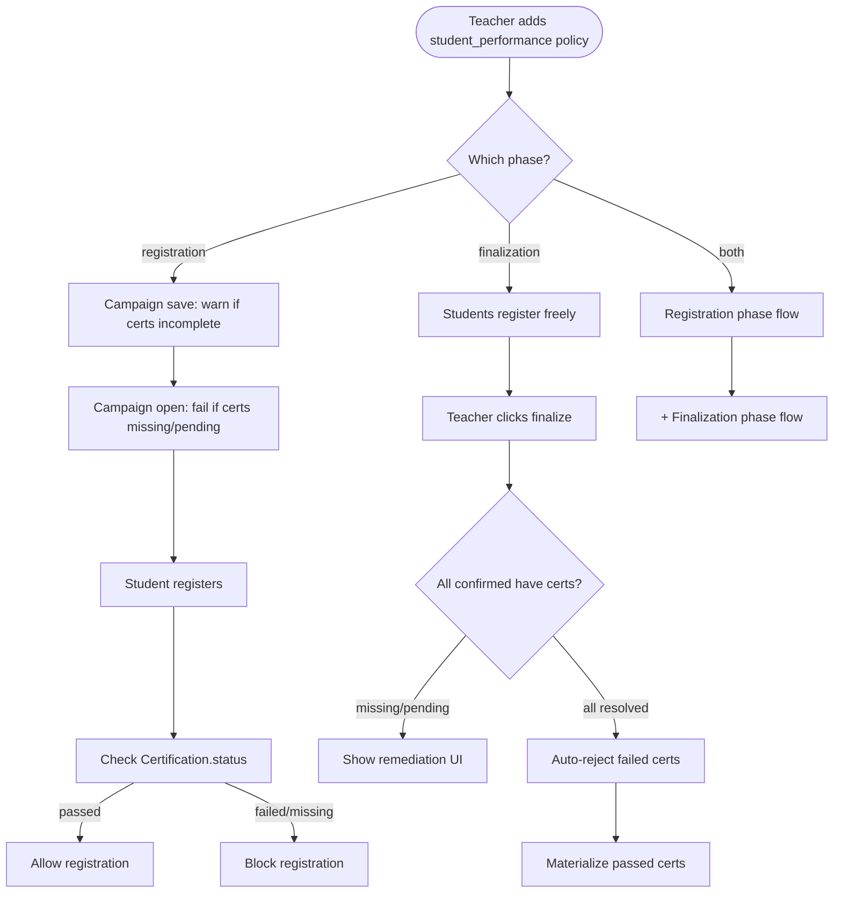
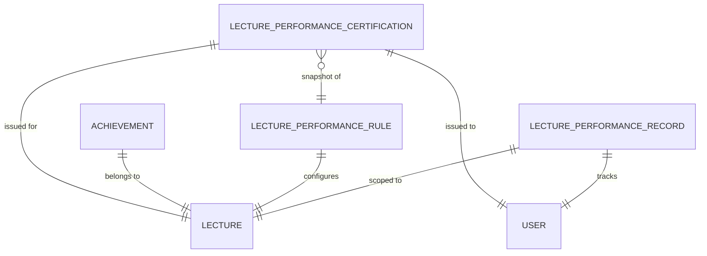
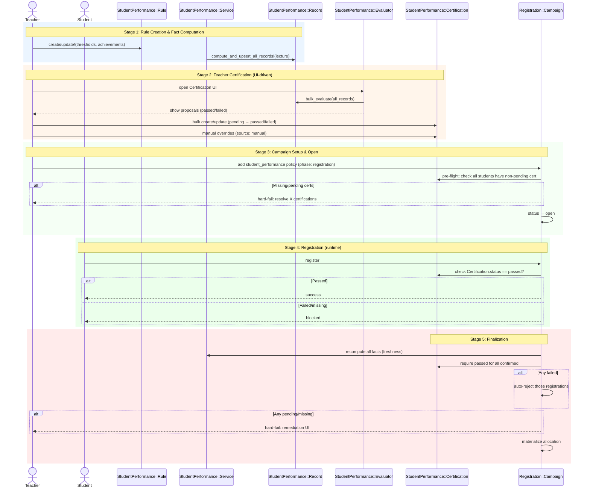

# Student Performance

```admonish question "What is 'Student Performance'?"
A student performance system tracks and materializes student achievement across all coursework in a lecture for multiple purposes.

- **Common Examples:** "Alice earned 80% of homework points", "Bob completed 2 presentations"
- **In this context:** A unified system that materializes student performance data (points, achievements) for use in dashboards, exam registration policies, certificates, and early intervention.
```

## Problem Overview
After coursework and achievements are recorded, MaMpf needs to:
- **Enforce prerequisites:** Prevent unqualified students from being finalized on exam rosters.
- **Support flexible criteria:** Combine point thresholds, achievement counts, and custom rules.
- **Materialize results:** Store computed performance data to avoid expensive queries during registration page loads.
- **Guarantee correctness:** Recompute performance data on demand to ensure decisions use fresh facts.
- **Allow teacher certification:** Let teachers confirm pass/fail (with manual overrides) with an audit trail.
- **Trigger recomputation:** Update materialized data when coursework grades change or policies are updated.
- **Integrate with registration:** Work seamlessly with the `Registration::Policy` system.

## Solution Architecture
We use a factual materialization + teacher certification + phased policy checks:
- **Factual Source:** `StudentPerformance::Record` stores materialized performance data per (lecture, user). It contains facts only, not interpretations.
- **Not a Cache:** This is an authoritative data snapshot for reads. Correctness is ensured by just-in-time recomputation in critical flows.
- **Teacher Certification:** `StudentPerformance::Certification` captures teacher-declared status (`pending`, `passed`, `failed`) with audit fields and a snapshot of the rule used when certifying. Manual overrides are encoded as `source: :manual`.
- **Policy Phases:** `Registration::Policy` entries are evaluated by phase: `registration`, `finalization`, or `both`. Enforcement happens only if a policy is configured for that phase. Policies check Certification status at runtime once certifications are complete.
- **Service-Based Computation:** `StudentPerformance::Service` aggregates points and achievements and upserts the factual `StudentPerformance::Record`.
- **Evaluator (Teacher Tool):** `StudentPerformance::Evaluator` is a teacher-facing tool that interprets factual records to generate bulk certification proposals and show rule change impact. It is never called during registration/finalization runtime.
- **Achievement Tracking:** A top-level `Achievement` model records qualitative accomplishments (e.g., blackboard presentations).
- **Recomputation Triggers:** Background jobs and on-demand triggers keep the data fresh and guarantee correctness.
- **Audit Trail:** Certification provides the authoritative decision and audit (who, when, source, rule snapshot). The Record stays facts-only.

---

## StudentPerformance::Record (ActiveRecord Model)
**_Materialized Performance Snapshot_**

```admonish info "What it represents"
A materialized database record of a student's performance in a specific lecture, computed from their coursework and achievements. This record contains only facts (points, achievements met) and does not store an interpretation like 'eligible' or 'passed'.

Its purpose is to provide a high-performance data source for read-heavy operations (like dashboards) and to serve as an auditable snapshot of performance at a specific point in time. Correctness for critical operations is guaranteed by just-in-time recomputation.
```

```admonish tip "Think of it as"
"As of today, Alice has earned 58% of homework points and completed 2 presentations for the Linear Algebra lecture."
```

```admonish warning "Performance Records vs Exam Roster"
`StudentPerformance::Record` covers **all lecture students** (e.g., 150 students).

The **exam roster** (materialized after registration) contains only **students who successfully registered** (e.g., 85 of 126 eligible students).

These are two distinct lists serving different purposes:
- Performance records: Track achievement for dashboards, certificates, and eligibility verification
- Exam roster: Operational list for exam administration and grading
```

The main fields and methods of `StudentPerformance::Record` are:

| Name/Field                | Type/Kind         | Description                                                              |
|---------------------------|-------------------|--------------------------------------------------------------------------|
| `lecture_id`              | DB column (FK)    | The lecture this performance record applies to                           |
| `user_id`                 | DB column (FK)    | The student whose performance is materialized                            |
| `points_total_materialized` | DB column       | Sum of relevant assessment points at computation time                    |
| `points_max_materialized` | DB column         | Maximum possible points from graded assessments at computation time      |
| `percentage_materialized` | DB column         | Computed percentage (points_total / points_max)                          |
| `achievements_met_ids`    | DB column (JSONB) | Optional list of achievement IDs currently met (factual audit)           |
| `computed_at`             | DB column         | Timestamp of last computation                                            |

### Behavior Highlights

- Enforces uniqueness per (lecture, user) via database constraint.
- Contains only factual data; interpretation is handled by `Evaluator` and teacher certification.
- Re-computation updates materialized values and `computed_at`.

### Example Implementation

```ruby
module StudentPerformance
  class Record < ApplicationRecord
    self.table_name = "student_performance_records"

    belongs_to :lecture
    belongs_to :user

    validates :lecture_id, uniqueness: { scope: :user_id }
  end
end
```

```admonish note "Dispatcher difference"
The `Registration::Policy#evaluate` in the Registration chapter uses a
`case` dispatch to delegate to `eval_exam`, `eval_email`, etc. This
chapter focuses only on the exam (student performance) branch and shows
its internal logic. For the canonical dispatcher, see Registration →
`Registration::Policy` and the `eval_exam` note that points back here.
```

### Usage Scenarios

- **After coursework completion:** A background job runs `StudentPerformance::Service.new(lecture: ...).compute_and_upsert_all_records!`. Alice's record is created with `points_total_materialized: 58`, `percentage_materialized: 58`. The record itself does not say if she passed.

- **Teacher certification workflow:** The teacher opens the Certification UI, which uses the `Evaluator` to generate proposals for all students. The teacher reviews and creates `Certification` rows (pending/passed/failed). Manual edge cases are set with `source: :manual`.

- **Registration runtime:** Bob tries to register for the exam. The system:
  1. Recomputes Bob's record just-in-time to ensure facts are current
  2. Checks if Bob has a `Certification` with `status: :passed`
  3. Allows or blocks registration based on certification status

- **Finalization runtime:** Before materializing the exam roster, the system checks that all confirmed registrants have `Certification` with `status: :passed`. Any missing/pending/failed certifications block finalization and trigger remediation UI.

---

## Achievement (ActiveRecord Model)
**_Qualitative Student Accomplishments (Assessable Type)_**

```admonish info "What it represents"
An assessable type that tracks qualitative student accomplishments during a lecture (e.g., blackboard presentations, discussion participation). Unlike assignments or exams, achievements can be boolean (pass/fail), numeric (count-based), or percentage-based. They integrate with the Assessment infrastructure for participation tracking and tutor grading workflows.
```

```admonish tip "Think of it as"
"Blackboard Presentation Achievement (boolean pass/fail)", "Attendance Achievement (numeric: 12 of 15)", "Lab Participation Achievement (percentage: 80%)"
```

### Key Fields & Associations

| Name/Field       | Type/Kind       | Description                                              |
|------------------|-----------------|----------------------------------------------------------|
| `lecture_id`     | DB column (FK)  | The lecture this achievement belongs to                  |
| `title`          | DB column       | Human-readable name (e.g., "Blackboard Presentation")    |
| `value_type`     | DB column (Enum)| How achievement is measured: `boolean`, `numeric`, `percentage` |
| `threshold`      | DB column       | Required value for completion (nil for boolean, count for numeric, percentage for percentage) |
| `description`    | DB column (Text)| Optional explanation shown to students                   |
| `rule_achievements` | Association  | Has many `StudentPerformance::RuleAchievement` (join table)|
| `assessment`     | Association     | Has one `Assessment::Assessment` (polymorphic assessable)|

### Value Types

| Type         | Threshold Meaning                        | Participation Grade Encoding           | Example                          |
|--------------|------------------------------------------|----------------------------------------|----------------------------------|
| `boolean`    | Not used (always pass/fail)              | `"Pass"` or `"Fail"`                   | Blackboard presentation (yes/no) |
| `numeric`    | Required count                           | Integer count as `grade_value`         | Attendance: 12 of 15             |
| `percentage` | Required percentage (0-100)              | Percentage as `grade_value`            | Lab participation: 75%           |

### Behavior Highlights

- **Assessable Integration:** Each Achievement has one `Assessment::Assessment` record where `assessable_type = "Achievement"` and `assessable_id = achievement.id`
- **Participation Seeding:** When created, participations are seeded for all students in the lecture roster
- **Tutor Grading:** Tutors mark achievement completion via existing `Assessment::Participation` editing UI:
  - Boolean: Check/uncheck "Completed" → sets `grade_value: "Pass"/"Fail"`
  - Numeric: Enter count → sets `grade_value: <count>`
  - Percentage: Enter percentage → sets `grade_value: <percentage>`
- **No Tasks/Submissions:** Achievements do not use `Assessment::Task` (no per-task breakdown) and do not require file uploads (`requires_submission: false`)
- **Eligibility Checking:** StudentPerformance::Service reads participation `grade_value` to determine if student meets threshold
- **Deletion Protection:** Cannot delete achievement if referenced by any rule (`dependent: :restrict_with_error`). Database FK constraint provides additional layer (`on_delete: :restrict`)

### Example Implementation

```ruby
class Achievement < ApplicationRecord
  include Assessment::Assessable

  belongs_to :lecture
  has_many :rule_achievements,
           class_name: "StudentPerformance::RuleAchievement",
           dependent: :restrict_with_error

  enum value_type: { boolean: 0, numeric: 1, percentage: 2 }

  validates :lecture_id, :value_type, :title, presence: true
  validates :threshold, numericality: { greater_than: 0 }, if: -> { numeric? || percentage? }
  validates :threshold, absence: true, if: :boolean?

  after_create :create_assessment_infrastructure

  def create_assessment_infrastructure
    ensure_assessment!(
      title: title,
      requires_points: false,
      requires_submission: false
    )
    seed_participations_from_roster!
  end

  def seed_participations_from_roster!
    # Override from Assessment::Assessable concern
    # Achievement roster = all lecture students
    assessment.seed_participations_from!(user_ids: lecture.students.pluck(:id))
  end

  def student_met_threshold?(user)
    participation = assessment.participations.find_by(user: user)
    return false unless participation&.grade_value.present?

    case value_type
    when "boolean"
      participation.grade_value == "Pass"
    when "numeric"
      participation.grade_value.to_i >= threshold
    when "percentage"
      participation.grade_value.to_f >= threshold
    end
  end
end
```

### Usage Scenarios

- **Teacher creates achievement:** Navigate to Lecture → Assessments → New Assessment → select "Achievement". Enter title ("Blackboard Presentation"), choose value_type ("boolean"). System creates Achievement + Assessment + Participations for all students.

- **Tutor marks completion:** In tutorial roster view, tutor sees participation list for "Blackboard Presentation" achievement. Checks box next to Emma's name → `participation.grade_value = "Pass"`.

- **Eligibility computation:** StudentPerformance::Service calls `achievement.student_met_threshold?(emma)` which checks if Emma's participation has `grade_value: "Pass"`.

---

## StudentPerformance::Rule (ActiveRecord Model)
**_Eligibility Criteria Configuration_**

```admonish info "What it represents"
A configuration record that defines the criteria a student must meet to be eligible for an exam. Each lecture has at most one rule that is evaluated to determine eligibility.
```

```admonish tip "Think of it as"
"To be eligible for the Linear Algebra exam, you need 50% homework points AND 1 blackboard presentation"
```

### Key Fields & Associations

| Name/Field                     | Type/Kind        | Description                                                    |
|--------------------------------|------------------|----------------------------------------------------------------|
| `lecture_id`                   | DB column (FK)   | The lecture this rule applies to                               |
| `min_percentage`               | DB column        | Minimum percentage of points (0-100), mutually exclusive with `min_points_absolute` |
| `min_points_absolute`          | DB column        | Minimum absolute points, mutually exclusive with `min_percentage` |
| `active`                       | DB column (Bool) | Whether this rule is currently in effect                       |
| `rule_achievements`            | Association      | Join records linking to required achievements                  |
| `required_achievements`        | Association      | Achievement records that must be completed (via `rule_achievements`) |

### Behavior Highlights

- Stored as a database record (not just JSONB config) for better querying and validation
- One lecture can have one active rule at a time
- References multiple achievements via join table (`student_performance_rule_achievements`)
- Database-level integrity prevents deletion of achievements still referenced by rules
- Enforces mutual exclusivity of percentage vs absolute point thresholds
- Points are aggregated from all assignments of the lecture (no filtering by type or archived status)

### Example Implementation

```ruby
module StudentPerformance
  class Rule < ApplicationRecord
    self.table_name = "student_performance_rules"

    belongs_to :lecture
    has_many :rule_achievements,
             class_name: "StudentPerformance::RuleAchievement",
             dependent: :destroy
    has_many :required_achievements,
             through: :rule_achievements,
             source: :achievement

    validates :lecture_id, presence: true
    validates :min_percentage, numericality: { greater_than_or_equal_to: 0, less_than_or_equal_to: 100 }, allow_nil: true
    validates :min_points_absolute, numericality: { greater_than_or_equal_to: 0 }, allow_nil: true
    validate :percentage_or_absolute_not_both

    private

    def percentage_or_absolute_not_both
      if min_percentage.present? && min_points_absolute.present?
        errors.add(:base, "Cannot specify both percentage and absolute point threshold")
      end
    end
  end
end

module StudentPerformance
  class RuleAchievement < ApplicationRecord
    self.table_name = "student_performance_rule_achievements"

    belongs_to :rule, class_name: "StudentPerformance::Rule"
    belongs_to :achievement

    validates :rule_id, uniqueness: { scope: :achievement_id }
    validates :position, presence: true

    acts_as_list scope: :rule  # For ordering in UI
  end
end
```

### Usage Scenarios

- **Professor sets up rule:** Teacher first creates achievements:
  ```ruby
  presentation = Achievement.create!(lecture: linear_algebra, title: "Blackboard Presentation", value_type: :boolean)
  attendance = Achievement.create!(lecture: linear_algebra, title: "Lab Attendance", value_type: :numeric, threshold: 12)
  ```
  Then creates rule and associates achievements:
  ```ruby
  rule = StudentPerformance::Rule.create!(lecture: linear_algebra, min_percentage: 50)
  rule.required_achievements << [presentation, attendance]
  ```

- **Mid-semester adjustment:** Professor realizes 50% is too strict, updates: `rule.update!(min_percentage: 45)`. System triggers recomputation for all students.

- **Adding achievement to rule:** Professor adds new requirement: `rule.required_achievements << bonus_achievement`. Join table automatically creates relationship.

- **Preventing achievement deletion:** Teacher tries to delete achievement used in rule: `presentation.destroy` raises `ActiveRecord::InvalidForeignKey`. UI shows: "Cannot delete - used in 2 performance rules".

- **Service uses rule:** The computation service loads the active rule: `rule = StudentPerformance::Rule.find_by(lecture: lecture, active: true)` and accesses `rule.required_achievements` for evaluation. Points are aggregated from all lecture assignments.

---

## StudentPerformance::Service (Service Object)
**_Performance Computer_**

```admonish info "What it represents"
A service that computes a student's performance by aggregating assessment points and checking achievements. It upserts these facts into a materialized `StudentPerformance::Record`.
```

```admonish tip "Think of it as"
The "performance calculator" that gathers all the data and stamps it into a student's performance file.
```

### Public Interface

| Method | Purpose |
|--------|---------|
| `initialize(lecture:)` | Sets up the service with the lecture whose rule will be used. |
| `compute_and_upsert_record_for(user)` | Computes performance for a single user and upserts their `StudentPerformance::Record`. Returns the fresh record. |
| `compute_and_upsert_all_records!` | Computes performance for all students in the lecture. |

### Behavior Highlights

- **Batch or targeted:** Can compute for all users or a specific subset.
- **Idempotent:** Running twice with the same inputs produces the same factual record.
- **Factual updates only:** The service is responsible for creating/updating the materialized facts, not for interpreting them.

### Recomputation Triggers

The service is invoked in several scenarios to keep performance records accurate:
1.  **After coursework grading:** A background job can trigger a full recomputation.
2.  **After achievement changes:** When tutors record or correct lecture achievements for a user.
3.  **Just-in-Time:** The `Registration::Policy` triggers a recomputation for a single user at the moment of an exam registration attempt to guarantee 100% correctness.
4.  **On-demand by staff:** Manual trigger via an admin interface for debugging or corrections.

### Example Implementation

```ruby
module StudentPerformance
  class Service
    def initialize(lecture:)
      @lecture = lecture
      @rule = lecture.student_performance_rule
    end

    def compute_and_upsert_record_for(user)
      points_data = aggregate_points(user)

      met_ids = @rule.required_achievements.select do |achievement|
        achievement.student_met_threshold?(user)
      end.map(&:id)

      record_data = {
        lecture_id: @lecture.id,
        user_id: user.id,
        points_total_materialized: points_data[:total],
        points_max_materialized: points_data[:max],
        percentage_materialized: points_data[:percentage],
        achievements_met_ids: met_ids,
        computed_at: Time.current
      }

      StudentPerformance::Record.upsert(record_data, unique_by: [:lecture_id, :user_id])
      StudentPerformance::Record.find_by(lecture_id: @lecture.id, user_id: user.id)
    end

    def compute_and_upsert_all_records!
      @lecture.students.find_each do |user|
        compute_and_upsert_record_for(user)
      end
    end

    private

    def aggregate_points(user)
      # Implementation aggregates assessment points based on rule configuration
      # Returns hash with :total, :max, :percentage
    end
  end
end
```

---

## StudentPerformance::Evaluator (Service Object)
**_Teacher-Facing Proposal Generator_**

```admonish info "What it represents"
A teacher-facing tool that interprets factual `StudentPerformance::Record` entries against a `StudentPerformance::Rule` to generate bulk certification proposals. Used exclusively in the teacher UI for bulk certification workflows and rule change impact analysis. Never called during student registration or finalization runtime.
```

```admonish tip "Think of it as"
The "proposal calculator" for teachers: shows which students would pass/fail based on current rules, but doesn't make authoritative decisions (that's Certification's job).
```

### Public Interface

| Method | Purpose |
|--------|---------|
| `initialize(rule)` | Sets up the evaluator with the rule to be used for interpretation. |
| `evaluate(record)` | Evaluates a single `StudentPerformance::Record` and returns a structured proposal. |
| `bulk_evaluate(records)` | Convenience method to evaluate multiple records at once for UI display. |

### Behavior Highlights
- **Teacher-only tool:** Used in Certification UI and rule editing workflows
- **No runtime gating:** Never called by `Registration::Policy` during registration/finalization
- **Proposal generator:** Outputs are suggestions for teachers, not authoritative decisions
- **Rule change preview:** Shows impact when teacher edits thresholds (50% → 45%)

### Usage Contexts

**Where Evaluator IS used:**
- Bulk Certification UI: "Generate proposals for all students"
- Rule Edit Modal: "Preview: 12 students would change from failed → passed"
- Teacher Dashboard: "23 students currently meet requirements"

**Where Evaluator is NOT used:**
- Student registration attempts (Policy checks Certification directly)
- Finalization guards (Policy requires Certification=passed)
- Any automated student-facing flows

### Example Implementation

```ruby
module StudentPerformance
  class Evaluator
    Result = Struct.new(:proposed_status, :details, keyword_init: true)

    def initialize(rule)
      @rule = rule
    end

    def evaluate(record)
      return Result.new(proposed_status: :failed, details: {}) unless record

      req_pts = required_points(@rule)
      meets_points = req_pts.nil? || record.points_total_materialized.to_i >= req_pts
      meets_achievements = includes_all?(
        record.achievements_met_ids,
        @rule.required_achievements.pluck(:id)
      )
      proposed = (meets_points && meets_achievements) ? :passed : :failed

      Result.new(
        proposed_status: proposed,
        details: {
          current_points: record.points_total_materialized,
          required_points: req_pts,
          current_achievement_ids: record.achievements_met_ids,
          required_achievement_ids: @rule.required_achievements.pluck(:id)
        }
      )
    end

    def bulk_evaluate(records)
      records.map { |record| [record, evaluate(record)] }.to_h
    end

    private

    def required_points(rule)
      return rule.min_points_absolute if rule.min_points_absolute.present?
      return nil unless rule.min_percentage.present?

      total = rule.lecture.assignments.sum(:max_points)
      (total * rule.min_percentage / 100.0).ceil
    end

    def includes_all?(have_ids, need_ids)
      return true if need_ids.blank?
      have = Array(have_ids).map(&:to_i).to_set
      need = Array(need_ids).map(&:to_i).to_set
      have >= need
    end
  end
end
```

---

## StudentPerformance::Certification (ActiveRecord Model)
**_Teacher-declared pass/fail with audit_**

```admonish info "What it represents"
An authoritative teacher decision per (lecture, user) with a status lifecycle
and audit fields. Can be created early as `pending`, then resolved to
`passed`/`failed`. Manual overrides are encoded as `source: :manual`.
```

### Main fields & associations

| Field | Type | Description |
|-------|------|-------------|
| `lecture_id` | FK | Lecture the certification belongs to |
| `user_id` | FK | Student being certified |
| `status` | Enum | `pending`, `passed`, `failed` |
| `source` | Enum | `computed` (from evaluator) or `manual` (teacher override) |
| `certified_by_id` | FK User | Who set a non-pending certification |
| `certified_at` | DateTime | When it was set (non-null unless pending) |
| `rule_id` | FK (optional) | Rule in effect when set (may be null if rule deleted) |
| `note` | Text | Optional human note |

Uniqueness: one certification per (lecture_id, user_id).

### Behavior highlights

- **Default status:** New certifications created as `pending` during bulk generation.
- **Bulk proposal workflow:** Teacher uses Evaluator UI to generate proposals; reviews and accepts/modifies; creates Certification rows with `source: :computed`.
- **Manual overrides:** Teacher can create/update certifications with `source: :manual` for special cases (medical exemption, etc.).
- **Pre-flight validation (completeness check):**
  - **Registration phase:** When campaign with registration-phase student_performance policy is saved, warn if certifications are missing. On campaign open, hard-fail if any certifications are missing/pending.
  - **Finalization phase:** When campaign with finalization-phase student_performance policy finalizes, hard-fail if any confirmed registrants have missing/pending/failed certifications. Show remediation UI.
- **Auto-reject at finalization:** Students with `status: :failed` are automatically moved to rejected status during finalization (if finalization-phase policy exists).
- **Rule change handling:** When teacher edits rule thresholds, show diff modal with:
  - Computed certifications that would flip (failed → passed or vice versa)
  - Manual certifications that conflict with new proposal
  - Teacher reviews and applies changes manually via modal
  - No automatic updates to Certification table; teacher must confirm

### Example (conceptual)

```ruby
module StudentPerformance
  class Certification < ApplicationRecord
    self.table_name = "student_performance_certifications"

    enum status: { pending: 0, passed: 1, failed: 2 }
    enum source: { computed: 0, manual: 1 }

    belongs_to :lecture
    belongs_to :user
    belongs_to :certified_by, class_name: "User", optional: true
    belongs_to :rule, class_name: "StudentPerformance::Rule", optional: true

    validates :lecture_id, uniqueness: { scope: :user_id }
    validates :certified_by, presence: true, unless: :pending?
    validates :certified_at, presence: true, unless: :pending?

    def self.passed?(lecture:, user:)
      find_by(lecture: lecture, user: user)&.passed? || false
    end
  end
end
```

---

## Integration with Registration::Policy

```admonish info "What it represents"
Exam eligibility can be implemented as a `Registration::Policy` of
`kind: :student_performance`. Policies are evaluated by phase:
`registration`, `finalization`, or `both`. Unlike other policy types (email, deadline) that gate at runtime, student_performance policies enforce data completeness before the phase starts, then check Certification status at runtime.
```

### Architecture Overview

The integration follows a clear separation of concerns:

**`StudentPerformance::Record`** (materialized data layer)
- Stores what the student has achieved (points, achievements).
- Is recomputed on demand to ensure freshness.

**`StudentPerformance::Certification`** (authoritative decision layer)
- Stores teacher-declared pass/fail status per student.
- Required to be complete before registration/finalization phases can start.
- Policy checks this table at runtime, never calls Evaluator.

**`Registration::Policy`** (gating layer)
- Enforces data prerequisites: certifications must be complete before phase starts.
- Runtime evaluation: checks `Certification.status == :passed` for each student.
- Never computes or proposes; just reads authoritative certification data.

**`StudentPerformance::Service`** (computation layer)
- Aggregates assessment points and checks achievements.
- Creates or updates the factual `StudentPerformance::Record`.
- Used for background updates and teacher dashboards, not runtime gating.

### Policy Configuration

When a teacher wants student performance gating, they add a `Registration::Policy`
record that references the lecture whose active rule applies:

```ruby
campaign.registration_policies.create!(
  kind: :student_performance,
  phase: :finalization, # or :registration or :both for completeness checks at both stages
  active: true,
  position: 1,
  config: { "lecture_id" => 42 }
)
```

The policy queries `StudentPerformance::Rule.find_by(lecture_id: 42, active: true)` to get the actual criteria for UI display, but enforcement is done via Certification table lookups.

#### Pre-flight Validation (Data Completeness)

Unlike other policy types, student_performance policies require data preparation before the phase starts:

**Registration phase policy:**
- **On campaign save:** Warn if any lecture students lack a Certification (any status)
- **On campaign open:** Hard-fail if any lecture students lack a Certification or have `status: :pending`
- **Runtime (student registers):** Check `Certification.status == :passed` for that student

**Finalization phase policy:**
- **On finalize trigger:** Hard-fail if any confirmed registrants lack a Certification or have `status: :pending`
- Show remediation UI for teacher to resolve pending → passed/failed
- Auto-reject students with `status: :failed`
- Only materialize students with `status: :passed`

#### Config Field Reference

| Field | Type | Purpose |
|-------|------|---------|
| `lecture_id` | Integer | Which lecture this eligibility applies to (references that lecture's active `StudentPerformance::Rule`) |

#### Why This Design?

**Single source of truth:** The `StudentPerformance::Rule` model defines what "sufficient performance" means. Registration policies just check "does this student have sufficient performance for lecture X?"

**Benefits:**
1. **No duplication:** Criteria defined once in `StudentPerformance::Rule`
2. **Consistent across exams:** Main exam and retake exam both reference the same performance requirements
3. **Easy updates:** Professor changes `rule.update!(min_percentage: 45)` and all exam campaigns automatically use new threshold
4. **Clear separation:** Rule defines performance criteria, policy gates registration based on those criteria

**Example:** A lecture has one `StudentPerformance::Rule` (50% points + presentation). Multiple exam campaigns (midterm, final, retake) all have `Registration::Policy` records with `kind: :student_performance, config: { lecture_id: 42 }`. All reference the same rule.

#### Policy Config Reference

Exam eligibility policies (`Registration::Policy` with `kind: :student_performance`) store only a minimal JSONB config:

```json
{ "lecture_id": 42 }
```

All threshold and achievement criteria live in `StudentPerformance::Rule` (regular columns, associations). Changing a threshold (e.g. 50 → 45) is done by updating the rule record via a diff modal, not the policy config. The JSONB usage rationale (generic policy kinds need flexible keyed configs) is documented centrally in the Registration chapter; this chapter only notes the minimal linkage.

### Runtime Evaluation

Once certifications are complete and the phase is open, evaluation is simple:

```ruby
# Pseudo-code for Registration::Policy#evaluate(user) when kind == :student_performance
def eval_student_performance(user)
  lecture = Lecture.find(config["lecture_id"])

  cert = StudentPerformance::Certification.find_by(lecture: lecture, user: user)

  if cert&.passed?
    pass_result(:certification_passed)
  else
    fail_result(:certification_not_passed, "Lecture performance certification not passed")
  end
end
```

No Evaluator calls, no Service calls at registration time. Just a simple table lookup.

### Flowchart: Student Performance Policy Flow



### Complete Example Walkthrough

**Setup Phase:**

1. Professor creates Linear Algebra lecture with weekly homework assignments
2. Professor creates achievements:
   ```ruby
   presentation = Achievement.create!(
     lecture: linear_algebra,
     title: "Blackboard Presentation",
     value_type: :boolean
   )
   attendance = Achievement.create!(
     lecture: linear_algebra,
     title: "Lab Attendance",
     value_type: :numeric,
     threshold: 12
   )
   ```
3. Professor creates performance rule (ONCE for the lecture):
   ```ruby
   rule = StudentPerformance::Rule.create!(
     lecture: linear_algebra,
     min_percentage: 50,
     active: true
   )
   rule.required_achievements << [presentation, attendance]
   ```

**Computation Phase:**

1. Semester progresses, students submit homework, tutors grade.
2. After final homework deadline, a background job runs:
   ```ruby
   StudentPerformance::Service.new(lecture: linear_algebra).compute_and_upsert_all_records!
   ```
3. System creates `StudentPerformance::Record` entries:
    - Alice: 58/100 points (58%), achievements_met_ids: [1, 2]
    - Bob: 42/100 points (42%), achievements_met_ids: []
    - Carol: 65/100 points (65%), achievements_met_ids: [1]

**Certification Phase:**

1. Professor opens Certification UI, clicks "Generate Proposals"
2. Evaluator runs for all students, showing:
    - Alice: proposed_status: :passed (has points + achievements)
    - Bob: proposed_status: :failed (insufficient points)
    - Carol: proposed_status: :failed (missing attendance achievement)
3. Professor reviews and bulk-creates certifications:
   ```ruby
   # Alice: accept proposal
   StudentPerformance::Certification.create!(
     lecture: linear_algebra, user: alice,
     status: :passed, source: :computed,
     certified_by: professor, certified_at: Time.current,
     rule: rule
   )

   # Bob: accept proposal
   StudentPerformance::Certification.create!(
     lecture: linear_algebra, user: bob,
     status: :failed, source: :computed,
     certified_by: professor, certified_at: Time.current,
     rule: rule
   )   # Carol: manual override (medical exemption for attendance)
   StudentPerformance::Certification.create!(
     lecture: linear_algebra, user: carol,
     status: :passed, source: :manual,
     certified_by: professor, certified_at: Time.current,
     note: "Medical exemption for attendance requirement"
   )
   ```

**Campaign Setup:**

4. Professor sets up exam campaign for final exam
5. Professor adds registration policy:
   ```ruby
   policy = campaign.registration_policies.create!(
     kind: :student_performance,
     phase: :both,
     config: { "lecture_id" => linear_algebra.id }
   )
   ```
6. Campaign save: system checks all students have certifications (all have status, so warning clears)
7. Professor clicks "Open Registration": system verifies no pending certifications remain (all passed/failed, so opens successfully)

**Registration Phase:**

8. Alice attempts registration:
    - Policy evaluates: finds `Certification` with `status: :passed`
    - Registration succeeds
9. Bob attempts registration:
    - Policy evaluates: finds `Certification` with `status: :failed`
    - Registration blocked with message
10. Carol attempts registration:
    - Policy evaluates: finds `Certification` with `status: :passed`
    - Registration succeeds (manual override respected)

**Finalization Phase:**

11. Professor clicks "Finalize Campaign"
12. System checks finalization policies:
    - Alice: Certification=passed ✓
    - Carol: Certification=passed ✓
    - (Bob never registered, so not checked)
13. System materializes exam roster with Alice and Carol

### Policy Evaluation Guarantees

The integration provides several guarantees:

1.  **Data Completeness:** Pre-flight checks ensure certifications exist before phase opens
2.  **Simple Runtime:** Policy just checks Certification table (no computation during registration)
3.  **Auditability:** Certification stores who decided what and when
4.  **Manual Override Support:** Teachers can override via `source: :manual`
5.  **Idempotency:** Repeated checks with same certification data yield same result

### Multiple Policies

A campaign can have multiple policies that must all pass:

```ruby
# Example: Eligibility + enrollment deadline + course prerequisite
campaign.registration_policies.create!([
  { kind: :student_performance, position: 1, config: { ... } },
  { kind: :deadline, position: 2, config: { ... } },
  { kind: :course_prerequisite, position: 3, config: { ... } }
])
```

Policies are evaluated in `position` order. First failure stops evaluation and returns that failure to the user.

---

## ERD



---

## Sequence Diagram



---

## Proposed Folder Structure

```text
app/
├── models/
│   ├── achievement.rb (top-level)
│   └── student_performance/
│       ├── record.rb
│       └── rule.rb
│
└── services/
  └── student_performance/
    └── service.rb
```

### Key Files
- `app/models/achievement.rb` - Top-level qualitative accomplishments (used across features)
- `app/models/student_performance/record.rb` - Materialized performance status with recomputation support
- `app/models/student_performance/rule.rb` - Eligibility criteria configuration
- `app/services/student_performance/service.rb` - Performance computation logic with correctness guarantees

---

## Database Tables

- `achievements` - Top-level assessable type for qualitative accomplishments (integrates with Assessment infrastructure)
- `student_performance_records` - Materialized per-user performance (facts only)
- `student_performance_rules` - Eligibility criteria configuration per lecture
- `student_performance_rule_achievements` - Join table linking rules to required achievements (ensures referential integrity)
- `student_performance_certifications` - Teacher certification (pending/passed/failed) with audit and rule snapshot

```admonish note
Column details for each table are documented in the respective model sections above.
```

