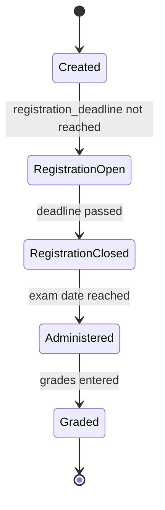

# Exam Model

```admonish question "What is an 'Exam'?"
An exam is a scheduled assessment event where students demonstrate their knowledge under controlled conditions.

- **Common Examples:** "Final Exam Linear Algebra", "Midterm Calculus", "Retake Exam Analysis"
- **In this context:** A new domain model that combines registration capabilities (students sign up for exam slots), roster management (tracking who is registered), and assessment functionality (recording exam grades).
```

## Problem Overview
MaMpf needs a formal representation of exams that can:
- Manage exam registration with capacity limits and eligibility checks (see [Exam Eligibility](05-exam-eligibility.md))
- Track which students are registered for which exam dates/locations
- Link to the assessment system for grading
- Support multiple exam dates (e.g., regular exam vs. retake)

## Solution Architecture
We introduce a new `Exam` model that implements three key concerns:
- **`Registration::Campaignable`**: Hosts exam registration campaigns
- **`Registration::Registerable`**: Acts as a registration target (students register for the exam)
- **`Roster::Rosterable`**: Manages the list of registered students
- **`Assessment::Assessable`**: Links to an `Assessment::Assessment` for grading

This gives `Exam` a triple role: it's a registration container, a registration target, and an assessment container.

---

## Exam (ActiveRecord Model)

```admonish info "What it represents"
A scheduled exam event with date, location, capacity, and registration deadline.
```

```admonish tip "Think of it as"
The exam equivalent of a Tutorial—it's both a thing students register for and a thing that gets graded.
```

### Key Attributes

| Field | Type | Description |
|-------|------|-------------|
| `lecture_id` | FK | The lecture this exam belongs to |
| `title` | String | Exam title (e.g., "Final Exam", "Midterm") |
| `date` | DateTime | Scheduled exam date and time |
| `location` | String | Physical location or online meeting link |
| `capacity` | Integer | Maximum number of exam participants |
| `registration_deadline` | DateTime | Last date for exam registration |
| `description` | Text | Additional exam details and instructions |

### Triple Role

**1. As Campaignable (Registration Host)**
```ruby
# An exam can host a registration campaign
exam.registration_campaigns.create!(
  title: "Final Exam Registration",
  allocation_mode: :first_come_first_serve,
  registration_deadline: exam.registration_deadline
)
```

**2. As Registerable (Registration Target)**
```ruby
# Students register for the exam via a Registration::Item
campaign.registration_items.create!(registerable: exam)
```

**3. As Assessable (Grading Container)**
```ruby
# After the exam, link it to an assessment for grading
assessment = Assessment::Assessment.create!(
  assessable: exam,
  lecture: exam.lecture,
  title: "#{exam.title} Grading"
)
```

### Example Implementation

```ruby
class Exam < ApplicationRecord
  belongs_to :lecture

  include Registration::Campaignable
  include Registration::Registerable
  include Roster::Rosterable
  include Assessment::Assessable

  validates :title, presence: true
  validates :date, presence: true
  validates :capacity, numericality: { greater_than: 0 }

  def materialize_allocation!(user_ids:, campaign:)
    replace_roster!(
      user_ids: user_ids,
      source_type: "Registration::Campaign",
      source_id: campaign.id
    )
  end

  def registration_open?
    Time.current < registration_deadline
  end

  def past?
    date < Time.current
  end
end
```

### Database Migration

```ruby
class CreateExams < ActiveRecord::Migration[7.0]
  def change
    create_table :exams do |t|
      t.references :lecture, null: false, foreign_key: true
      t.string :title, null: false
      t.datetime :date, null: false
      t.string :location
      t.integer :capacity, null: false
      t.datetime :registration_deadline
      t.text :description

      t.timestamps
    end

    add_index :exams, [:lecture_id, :date]
  end
end
```

```admonish note "Multiple Choice Exam Extension"
For exams that include multiple choice components requiring legal compliance, see the [Multiple Choice Exams](05c-multiple-choice-exams.md) chapter. That extension adds `has_multiple_choice` and `mc_weight` fields to the schema.
```

---

## Exam Registration Flow

```admonish success "Goal"
Enable students to register for an exam slot while enforcing eligibility and capacity constraints.
```

```admonish info "Eligibility Requirement"
Exam registration typically requires students to meet certain criteria (e.g., earning 50% of homework points). This is handled by the exam eligibility system documented in [Exam Eligibility](05-exam-eligibility.md). The eligibility check is enforced via a `Registration::Policy` with `kind: :exam_eligibility`.
```

### Setup (Staff Actions)

| Step | Action | Technical Details |
|------|--------|-------------------|
| 1 | Create exam | `Exam.create!(lecture: lecture, date: ..., capacity: 150)` |
| 2 | Create campaign | `exam.registration_campaigns.create!(...)` (exam as campaignable) |
| 3 | Create item | `campaign.registration_items.create!(registerable: exam)` |
| 4 | Add eligibility policy | `campaign.registration_policies.create!(kind: :exam_eligibility)` - see [Exam Eligibility](05-exam-eligibility.md) |

### Student Experience

1. Student views open exam registration campaigns
2. System checks eligibility via `Registration::PolicyEngine` (queries `ExamEligibility::Record` - see [Exam Eligibility](05-exam-eligibility.md))
3. If eligible, student submits registration
4. Registration is confirmed immediately (FCFS) or after deadline (preference-based, if multiple exam dates)
5. After registration closes, `materialize_allocation!` updates exam roster

---

## Exam Grading Flow

```admonish success "Goal"
Record and process exam grades using the assessment system.
```

### After Exam is Administered

| Step | Action | Technical Details |
|------|--------|-------------------|
| 1 | Create assessment | `Assessment::Assessment.create!(assessable: exam, ...)` |
| 2 | Seed participations | System creates `Assessment::Participation` for each registered student |
| 3 | Define tasks | Staff creates `Assessment::Task` records (e.g., Problem 1, Problem 2) |
| 4 | Enter grades | Tutors record `Assessment::TaskPoint` for each student/task |
| 5 | Apply grade scheme | Staff applies `GradeScheme::Scheme` to convert points to letter grades |

```admonish note "Multiple Choice Exam Extension"
For exams with multiple choice components requiring legal compliance, see the [Multiple Choice Exams](05c-multiple-choice-exams.md) chapter for the two-stage grading process.
```

---

## Usage Scenarios

### Scenario 1: Regular Final Exam
```ruby
exam = lecture.exams.create!(
  title: "Final Exam",
  date: Date.new(2025, 2, 15),
  location: "Main Hall",
  capacity: 200,
  registration_deadline: Date.new(2025, 2, 1)
)

campaign = exam.registration_campaigns.create!(
  title: "Final Exam Registration",
  allocation_mode: :first_come_first_serve,
  registration_deadline: exam.registration_deadline
)

campaign.registration_policies.create!(
  kind: :exam_eligibility,
  config: { lecture_id: lecture.id }
)
```

### Scenario 2: Multiple Exam Dates (Regular + Retake)
```ruby
regular_exam = lecture.exams.create!(
  title: "Regular Exam",
  date: Date.new(2025, 2, 15),
  capacity: 200
)

retake_exam = lecture.exams.create!(
  title: "Retake Exam",
  date: Date.new(2025, 3, 15),
  capacity: 50
)

campaign = lecture.registration_campaigns.create!(
  title: "Exam Date Selection",
  allocation_mode: :preference_based
)

campaign.registration_items.create!(registerable: regular_exam)
campaign.registration_items.create!(registerable: retake_exam)
```

---

## State Diagram



---

## Proposed File Structure

```text
app/
└── models/
    └── exam.rb
```
