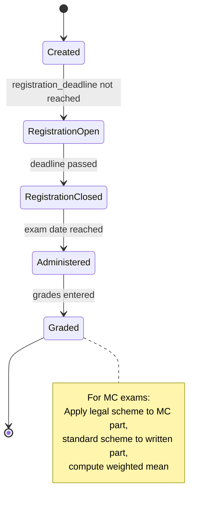

# Exam Model

```admonish question "What is an 'Exam'?"
An exam is a scheduled assessment event where students demonstrate their knowledge under controlled conditions.

- **Common Examples:** "Final Exam Linear Algebra", "Midterm Calculus", "Retake Exam Analysis"
- **In this context:** A new domain model that combines registration capabilities (students sign up for exam slots), roster management (tracking who is registered), and assessment functionality (recording exam grades).
```

## Problem Overview
MaMpf needs a formal representation of exams that can:
- Manage exam registration with capacity limits and eligibility checks (see [Exam Eligibility](05-exam-eligibility.md))
- Track which students are registered for which exam dates/locations
- Link to the assessment system for grading
- Support multiple exam dates (e.g., regular exam vs. retake)

## Solution Architecture
We introduce a new `Exam` model that implements three key concerns:
- **`Registration::Campaignable`**: Hosts exam registration campaigns
- **`Registration::Registerable`**: Acts as a registration target (students register for the exam)
- **`Roster::Rosterable`**: Manages the list of registered students
- **`Assessment::Assessable`**: Links to an `Assessment::Assessment` for grading

This gives `Exam` a triple role: it's a registration container, a registration target, and an assessment container.

---

## Exam (ActiveRecord Model)

```admonish info "What it represents"
A scheduled exam event with date, location, capacity, and registration deadline.
```

```admonish tip "Think of it as"
The exam equivalent of a Tutorial—it's both a thing students register for and a thing that gets graded.
```

### Key Attributes

| Field | Type | Description |
|-------|------|-------------|
| `lecture_id` | FK | The lecture this exam belongs to |
| `title` | String | Exam title (e.g., "Final Exam", "Midterm") |
| `date` | DateTime | Scheduled exam date and time |
| `location` | String | Physical location or online meeting link |
| `capacity` | Integer | Maximum number of exam participants |
| `registration_deadline` | DateTime | Last date for exam registration |
| `description` | Text | Additional exam details and instructions |

### Triple Role

**1. As Campaignable (Registration Host)**
```ruby
# An exam can host a registration campaign
exam.registration_campaigns.create!(
  title: "Final Exam Registration",
  assignment_mode: :first_come_first_serve,
  registration_deadline: exam.registration_deadline
)
```

**2. As Registerable (Registration Target)**
```ruby
# Students register for the exam via a Registration::Item
campaign.registration_items.create!(registerable: exam)
```

**3. As Assessable (Grading Container)**
```ruby
# After the exam, link it to an assessment for grading
assessment = Assessment::Assessment.create!(
  assessable: exam,
  lecture: exam.lecture,
  title: "#{exam.title} Grading"
)
```

### Example Implementation

```ruby
class Exam < ApplicationRecord
  belongs_to :lecture

  include Registration::Campaignable
  include Registration::Registerable
  include Roster::Rosterable
  include Assessment::Assessable

  validates :title, presence: true
  validates :date, presence: true
  validates :capacity, numericality: { greater_than: 0 }

  def materialize_allocation!(user_ids:, campaign:)
    replace_roster!(
      user_ids: user_ids,
      source_type: "Registration::Campaign",
      source_id: campaign.id
    )
  end

  def registration_open?
    Time.current < registration_deadline
  end

  def past?
    date < Time.current
  end
end
```

### Database Migration

```ruby
class CreateExams < ActiveRecord::Migration[7.0]
  def change
    create_table :exams do |t|
      t.references :lecture, null: false, foreign_key: true
      t.string :title, null: false
      t.datetime :date, null: false
      t.string :location
      t.integer :capacity, null: false
      t.datetime :registration_deadline
      t.text :description
      t.boolean :has_multiple_choice, default: false, null: false
      t.decimal :mc_weight, precision: 5, scale: 2

      t.timestamps
    end

    add_index :exams, [:lecture_id, :date]
  end
end
```

---

## Multiple Choice Exams

```admonish warning "Legal Requirement"
Some exams include a multiple choice part that must be graded according to legally mandated schemes, separate from the written part.
```

### Problem

When an exam has both MC and written parts:
- MC part must use a fixed legal grading scheme (defined by law)
- Written part uses standard exam grading (curve-based)
- Final grade is weighted mean of both parts
- Without automation, staff must manually compute this for hundreds of students

### Solution

Set `has_multiple_choice: true` on the exam and specify `mc_weight`:

```ruby
exam = Exam.create!(
  lecture: lecture,
  title: "Final Exam",
  has_multiple_choice: true,
  mc_weight: 0.3  # MC part counts for 30% of final grade
)
```

### Grading Flow for MC Exams

| Step | Action |
|------|--------|
| 1 | Create assessment with tasks, marking one as `is_multiple_choice: true` |
| 2 | Create a `GradeScheme::Scheme` for the MC part and assign to MC task |
| 3 | Tutors grade all tasks normally (MC questions + written problems) |
| 4 | Staff calls `Assessment::McGrader.new(assessment).apply_legal_scheme!` |
| 5 | Service automatically computes MC threshold with sliding clause, checks each student, computes final grades |

### Legal Requirements

```admonish info "German Law (Prüfungsordnung)"
The law requires a minimum passing threshold for the MC part:
- **Default threshold:** 60% of MC points
- **Sliding clause (Gleitklausel):** If (mean - 20%) < 60%, threshold becomes (mean - 20%)
- **Floor:** Threshold cannot go below 50% of max MC points
- Students who fail to meet the MC threshold fail the entire exam (grade 5.0)
```

**Example:** If average MC score is 70%:
- Sliding threshold: 70% - 20% = 50%
- Since 50% < 60%, threshold becomes 50%
- Students need at least 50% on MC to pass

**Example 2:** If average MC score is 85%:
- Sliding threshold: 85% - 20% = 65%
- Since 65% > 60%, threshold stays at 60%
- Students need at least 60% on MC to pass

```admonish warning "Grade Scheme Adjustment"
When the Gleitklausel lowers the threshold below 60%, the MC task's grade scheme must be dynamically adjusted:

**Without Gleitklausel (threshold = 60%):**
- Original scheme: 60% → 4.0, 70% → 3.0, 80% → 2.0, 90% → 1.0

**With Gleitklausel (threshold = 50%):**
- Adjusted scheme: 50% → 4.0, 60% → 3.0, 70% → 2.0, 80% → 1.0
- All grade boundaries shift by the same amount (10 percentage points in this example)

The `McGrader` service handles this adjustment automatically.
```

### Task Configuration

`Assessment::Task` has two fields relevant for MC exams:

| Field | Purpose |
|-------|---------|
| `is_multiple_choice` | Boolean flag marking this task as the MC part |
| `grade_scheme_id` | Links to the grade scheme specifically for this MC task |

```admonish note "Why Task-Level Grade Scheme?"
MC tasks need their own grade scheme because:
- The MC part may have different max points than the written part
- Staff may want a relative (curve-based) scheme for MC but absolute for written, or vice versa
- Each exam can configure this independently

The validation ensures only MC tasks can have their own scheme—regular tasks use the assessment-level scheme.
```

### Task Model Validations

```ruby
module Assessment
  class Task < ApplicationRecord
    belongs_to :assessment
    belongs_to :grade_scheme, class_name: "GradeScheme::Scheme",
               optional: true

    validates :is_multiple_choice, inclusion: { in: [true, false] }
    validate :mc_flag_only_for_exams
    validate :at_most_one_mc_task_per_assessment
    validate :grade_scheme_only_for_mc_tasks

    scope :multiple_choice, -> { where(is_multiple_choice: true) }
    scope :regular, -> { where(is_multiple_choice: false) }

    private

    def mc_flag_only_for_exams
      return unless is_multiple_choice?
      return if assessment.assessable.is_a?(Exam)

      errors.add(:is_multiple_choice,
                 "can only be set for exam assessments")
    end

    def at_most_one_mc_task_per_assessment
      return unless is_multiple_choice?
      return unless assessment

      other_mc_tasks = assessment.tasks.multiple_choice
                                 .where.not(id: id)

      if other_mc_tasks.exists?
        errors.add(:is_multiple_choice,
                   "only one MC task allowed per assessment")
      end
    end

    def grade_scheme_only_for_mc_tasks
      return unless grade_scheme_id.present?
      return if is_multiple_choice?

      errors.add(:grade_scheme,
                 "can only be assigned to multiple choice tasks")
    end
  end
end
```

```admonish note "Why Task-Level Grade Scheme?"
MC tasks need their own grade scheme because:
- The MC part may have a different max points than the written part
- Staff may want a relative (curve-based) scheme for MC but absolute for written, or vice versa
- Each exam can configure this independently

The validation ensures only MC tasks can have their own scheme—regular tasks use the assessment-level scheme.
```

### McGrader Implementation

```ruby
module Assessment
  class McGrader
    def initialize(assessment)
      @assessment = assessment
      @exam = assessment.assessable
    end

    def apply_legal_scheme!
      return unless @exam.is_a?(Exam) && @exam.has_multiple_choice?

      mc_task = @assessment.tasks.multiple_choice.first
      regular_tasks = @assessment.tasks.regular

      mc_threshold = compute_mc_threshold(mc_task)

      @assessment.participations.find_each do |participation|
        mc_points = participation.task_points
                                 .find_by(task: mc_task)&.points || 0
        mc_percentage = mc_points.to_f / mc_task.max_points

        if mc_percentage < mc_threshold
          participation.update!(
            grade_value: 5.0,
            passed: false,
            failure_reason: "MC threshold not met (#{(mc_threshold * 100).round}%)"
          )
          next
        end

        mc_grade = compute_mc_grade(mc_points, mc_task, mc_threshold)
        regular_grade = compute_regular_grade(participation, regular_tasks)

        final_grade = (@exam.mc_weight * mc_grade) +
                      ((1 - @exam.mc_weight) * regular_grade)

        participation.update!(grade_value: final_grade, passed: final_grade <= 4.0)
      end
    end

    private

    def compute_mc_threshold(mc_task)
      all_mc_points = @assessment.participations
                                  .joins(:task_points)
                                  .where(task_points: { task: mc_task })
                                  .pluck("task_points.points")

      return 0.60 if all_mc_points.empty?

      mean_points = all_mc_points.sum.to_f / all_mc_points.size
      mean_percentage = mean_points / mc_task.max_points

      default_threshold = 0.60
      sliding_threshold = mean_percentage - 0.20
      floor_threshold = 0.50

      if sliding_threshold < default_threshold
        [sliding_threshold, floor_threshold].max
      else
        default_threshold
      end
    end

    def compute_mc_grade(mc_points, mc_task, threshold_percentage)
      raise "MC task must have a grade scheme" unless mc_task.grade_scheme

      adjusted_scheme = adjust_scheme_for_threshold(
        mc_task.grade_scheme,
        threshold_percentage
      )

      GradeScheme::Applier.compute_grade(
        mc_points,
        mc_task.max_points,
        adjusted_scheme
      )
    end

    def adjust_scheme_for_threshold(original_scheme, threshold)
      # When Gleitklausel lowers threshold below 60%, shift all grade boundaries
      # Example: threshold=50% means shift=-10%, so 60%→4.0 becomes 50%→4.0
      default_threshold = 0.60

      return original_scheme if threshold == default_threshold

      shift = threshold - default_threshold

      original_scheme.bands.map do |band|
        {
          min_percentage: [band[:min_percentage] + shift, 0.0].max,
          grade: band[:grade]
        }
      end
    end

    def compute_regular_grade(participation, regular_tasks)
      total = participation.task_points
                          .where(task: regular_tasks)
                          .sum(:points)
      max = regular_tasks.sum(:max_points)

      GradeScheme::Applier.compute_grade(
        total,
        max,
        @assessment.grade_scheme
      )
    end
  end
end
```

```admonish note "Two-Stage Grading Process"
The `McGrader` implements a two-stage process:

1. **Threshold Check:** First, compute the MC threshold using the sliding clause. Any student below this threshold automatically fails (grade 5.0) regardless of their written part performance.

2. **Grade Computation:** For students who pass the MC threshold, compute:
   - MC grade using the legal grade scheme (based on percentage achieved)
   - Written grade using the standard exam scheme
   - Final grade as weighted mean

This ensures compliance with German examination law while automating the entire process.
```

```admonish todo "Rounding Strategy"
The weighted mean of two grades (e.g., 0.3 × 1.3 + 0.7 × 2.0 = 1.79) is not necessarily a well-defined grade in the German system. We need to decide on a rounding strategy:
- Round to nearest 0.3 step (1.0, 1.3, 1.7, 2.0, 2.3, 2.7, 3.0, ...)?
- Round down/up consistently?
- Allow arbitrary decimal grades?

This detail should be clarified later.
```

```admonish warning "MC Task Constraints"
The `is_multiple_choice` flag on tasks is protected by two validations:
1. **Only for exams:** Can only be set `true` if the assessment's assessable is an `Exam`
2. **At most one per exam:** Only one task per assessment can have `is_multiple_choice: true`

These constraints prevent misuse and ensure the MC grading logic has exactly one MC task to work with.
```

---

## Exam Registration Flow

```admonish success "Goal"
Enable students to register for an exam slot while enforcing eligibility and capacity constraints.
```

```admonish info "Eligibility Requirement"
Exam registration typically requires students to meet certain criteria (e.g., earning 50% of homework points). This is handled by the exam eligibility system documented in [Exam Eligibility](05-exam-eligibility.md). The eligibility check is enforced via a `Registration::Policy` with `kind: :exam_eligibility`.
```

### Setup (Staff Actions)

| Step | Action | Technical Details |
|------|--------|-------------------|
| 1 | Create exam | `Exam.create!(lecture: lecture, date: ..., capacity: 150)` |
| 2 | Create campaign | `exam.registration_campaigns.create!(...)` (exam as campaignable) |
| 3 | Create item | `campaign.registration_items.create!(registerable: exam)` |
| 4 | Add eligibility policy | `campaign.registration_policies.create!(kind: :exam_eligibility)` - see [Exam Eligibility](05-exam-eligibility.md) |

### Student Experience

1. Student views open exam registration campaigns
2. System checks eligibility via `Registration::PolicyEngine` (queries `ExamEligibility::Record` - see [Exam Eligibility](05-exam-eligibility.md))
3. If eligible, student submits registration
4. Registration is confirmed immediately (FCFS) or after deadline (preference-based, if multiple exam dates)
5. After registration closes, `materialize_allocation!` updates exam roster

---

## Exam Grading Flow

```admonish success "Goal"
Record and process exam grades using the assessment system.
```

### After Exam is Administered

| Step | Action | Technical Details |
|------|--------|-------------------|
| 1 | Create assessment | `Assessment::Assessment.create!(assessable: exam, ...)` |
| 2 | Seed participations | System creates `Assessment::Participation` for each registered student |
| 3 | Define tasks | Staff creates `Assessment::Task` records (e.g., Problem 1, Problem 2) |
| 4 | Enter grades | Tutors record `Assessment::TaskPoint` for each student/task |
| 5 | Apply grade scheme | Staff applies `GradeScheme::Scheme` to convert points to letter grades |

---

## Usage Scenarios

### Scenario 1: Regular Final Exam
```ruby
exam = lecture.exams.create!(
  title: "Final Exam",
  date: Date.new(2025, 2, 15),
  location: "Main Hall",
  capacity: 200,
  registration_deadline: Date.new(2025, 2, 1)
)

campaign = exam.registration_campaigns.create!(
  title: "Final Exam Registration",
  assignment_mode: :first_come_first_serve,
  registration_deadline: exam.registration_deadline
)

campaign.registration_policies.create!(
  kind: :exam_eligibility,
  config: { lecture_id: lecture.id }
)
```

### Scenario 2: Multiple Exam Dates (Regular + Retake)
```ruby
regular_exam = lecture.exams.create!(
  title: "Regular Exam",
  date: Date.new(2025, 2, 15),
  capacity: 200
)

retake_exam = lecture.exams.create!(
  title: "Retake Exam",
  date: Date.new(2025, 3, 15),
  capacity: 50
)

campaign = lecture.registration_campaigns.create!(
  title: "Exam Date Selection",
  assignment_mode: :preference_based
)

campaign.registration_items.create!(registerable: regular_exam)
campaign.registration_items.create!(registerable: retake_exam)
```

---

## State Diagram



---

## Proposed File Structure

```text
app/
├── models/
│   └── exam.rb
└── services/
    └── assessment/
      └── mc_grader.rb


```
