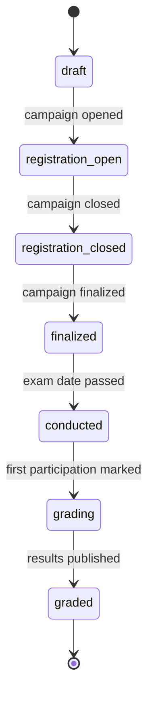

# Exam Model

```admonish question "What is an 'Exam'?"
An exam is a scheduled assessment event where students demonstrate their knowledge under controlled conditions.

- **Common Examples:** "Final Exam Linear Algebra", "Midterm Calculus", "Retake Exam Analysis"
- **In this context:** A new domain model that acts as a registration target (students sign up for exam slots), manages rosters (tracking who is registered), and links to the assessment system for grading. Exams belong to a lecture.
```

## Problem Overview
MaMpf needs a formal representation of exams that can:
- Act as a registration target with capacity limits and eligibility checks (see [Student Performance](05-student-performance.md))
- Track which students are registered for which exam dates/locations
- Link to the assessment system for grading
- Support multiple exam dates per lecture (e.g., Hauptklausur, Nachklausur, Wiederholungsklausur)

## Solution Architecture
We introduce a new `Exam` model that:
- **Belongs to a `Lecture`**: Each exam is scoped to a specific lecture offering
- **Implements `Registration::Registerable`**: Acts as a registration target (students register for the exam)
- **Implements `Rosters::Rosterable`**: Manages the list of registered students
- **Implements `Assessment::Pointable` and `Assessment::Gradable`**: Links to an `Assessment::Assessment` for points and grades. Both concerns include `Assessment::Assessable`, so the exam gets the shared assessment interface through them rather than directly

The parent `Lecture` (which implements `Registration::Campaignable`) hosts the registration campaigns. Each exam (Hauptklausur, Nachklausur, etc.) gets its own campaign with that exam as the sole registerable item.

---

## Exam (ActiveRecord Model)

```admonish info "What it represents"
A scheduled exam event with date, location, capacity, and registration deadline.
```

```admonish tip "Think of it as"
The exam equivalent of a Tutorial—it's both a thing students register for and a thing that gets graded.
```

### Key Attributes

| Field | Type | Description |
|-------|------|-------------|
| `lecture_id` | FK | The lecture this exam belongs to (required) |
| `title` | String | Exam title (e.g., "Hauptklausur", "Nachklausur") |
| `date` | DateTime | Scheduled exam date and time |
| `location` | String | Physical location or online meeting link |
| `capacity` | Integer | Maximum number of exam participants (nullable; nil = unlimited) |
| `description` | Text | Additional exam details and instructions |
| `skip_campaigns` | Boolean | Participants are managed by hand; no registration campaign is created |
| `self_materialization_mode` | Integer | Whether students may add or remove themselves (see [Rosters](03-rosters.md)) |

There is deliberately **no** `registration_deadline` column: the deadline belongs
to the campaign. `Exam#registration_deadline` is an `attr_accessor` that carries
the value between the form and the campaign — see
[Exam Registration Flow](#exam-registration-flow).

### Role in the System

**1. As Registerable (Registration Target)**
```ruby
# Creating the exam is the whole step: an after_create hook adds the campaign,
# hosted by the parent lecture, and the single item pointing back at the exam.
exam = lecture.exams.create!(
  title: "Hauptklausur",
  date: 3.weeks.from_now,
  capacity: 200
)

exam.registration_campaign            # draft, first_come_first_served
exam.registration_campaign.registration_deadline  # exam date minus three days
```

Passing `registration_deadline:` to the exam overrides that default, and
`skip_campaigns: true` suppresses the campaign entirely — for exams whose
participants are managed by hand.

**2. As Rosterable (Student Tracking)**
```ruby
# After allocation, students are materialized into the exam roster
exam.allocated_user_ids # => [101, 102, 103, ...]
```

**3. As Pointable and Gradable (Grading Container)**
```ruby
# Nothing to link: the assessment came into being with the exam
exam.assessment                  # => Assessment::Assessment
exam.assessment.requires_points  # => true
```

### Example Implementation

```ruby
class Exam < ApplicationRecord
  belongs_to :lecture

  include Registration::Registerable
  include Rosters::Rosterable
  include Assessment::Pointable
  include Assessment::Gradable

  attr_accessor :registration_deadline, :reopen_after_deadline_fix

  validates :title, presence: true
  validates :capacity, numericality: { greater_than: 0, allow_nil: true }
  validate :registration_deadline_before_exam_date
  validate :registration_deadline_in_future

  after_create :setup_assessment, if: -> { Flipper.enabled?(:assessment_grading) }
  after_create :create_registration_campaign,
               if: -> { !skip_campaigns && Flipper.enabled?(:registration_campaigns) }
  after_update :update_campaign_deadline, if: -> { registration_deadline.present? && ... }
  before_destroy :destroy_draft_campaign

  # ...

  private

    def setup_assessment
      ensure_pointbook!(requires_submission: false)
    end
end
```

`materialize_allocation!` and the roster methods come from `Rosters::Rosterable`;
the exam only overrides `add_user_to_roster!` and `remove_user_from_roster!`.
Note that `date` carries no presence validation — an exam may be entered before
its date is fixed.

```admonish tip "The assessment is created with the exam"
`setup_assessment` runs on creation and calls `ensure_pointbook!`, which produces
an `Assessment::Assessment` with `requires_points: true`. So an exam never exists
with a roster but no gradebook, and the grading slice adds the grade scheme on
top without touching this model.

It is behind the `assessment_grading` flag. An exam created while the flag is off
gets no assessment, and nothing creates one later — `ensure_pointbook!` is called
from here and nowhere else.
```

### Database Migration

```ruby
class CreateExams < ActiveRecord::Migration[7.0]
  def change
    create_table :exams do |t|
      t.references :lecture, null: false, foreign_key: true
      t.string :title, null: false
      t.datetime :date
      t.text :location
      t.integer :capacity
      t.text :description
      t.boolean :skip_campaigns, default: false, null: false
      t.integer :self_materialization_mode, default: 0

      t.timestamps
    end

    add_index :exams, [:lecture_id, :date]
    add_index :exams, :self_materialization_mode
  end
end
```

```admonish note "Multiple Choice Exam Extension"
For exams that include multiple choice components requiring legal compliance, see the [Multiple Choice Exams](05c-multiple-choice-exams.md) chapter. That extension adds `has_multiple_choice` and `mc_weight` fields to the schema.
```

---

## Exam Registration Flow

```admonish success "Goal"
Enable students to register for an exam slot while enforcing eligibility and capacity constraints.
```

```admonish info "Eligibility Requirement"
Exam registration typically requires students to meet certain criteria (e.g., earning 50% of homework points). This is handled by the student performance certification system documented in [Student Performance](05-student-performance.md). The eligibility check is enforced via a `Registration::Policy` with `kind: :student_performance`.
```

```admonish warning "The shape of an exam campaign"
An exam campaign holds one item — the exam — and its allocation mode is always
`first_come_first_served`. Preference-based allocation ranks the items on offer,
and here there is only ever the one, so there is nothing to rank.

Both halves are model validations, checked from either side; see
[Uniqueness Constraints](02-registration.md#uniqueness-constraints).

The mode is also what makes eligibility apply at all.
`Registration::FinalizationGuard#check` returns success for a preference-based
campaign *before* it reaches the `ScreeningService`, so an exam campaign in that
mode would admit every registrant, certification or not. That is a consequence
of the rule rather than its reason, but it is the reason the rule is worth
enforcing rather than merely intending.
```

### Setup (Staff Actions)

| Step | Action | Technical Details |
|------|--------|-------------------|
| 1 | Create exam | `lecture.exams.create!(title: "Hauptklausur", date: ..., capacity: 150)` — the campaign (lecture as campaignable) and its single item are created with it |
| 2 | Check the registration deadline | Defaults to three days before the exam. For an exam less than three days out that default is already past, and the campaign cannot be opened until it is corrected |
| 3 | Add eligibility policy | `campaign.registration_policies.create!(kind: :student_performance)` - see [Student Performance](05-student-performance.md) |
| 4 | Create certifications | Teacher creates `StudentPerformance::Certification` records for eligible students (see [Student Performance](05-student-performance.md)) |
| 5 | Pre-flight check | Before opening, verify all active users have certifications (see [End-to-End Workflow Phase 7](06-end-to-end-workflow.md#phase-7-teacher-certification)) |
| 6 | Finalization filtering | On finalize, only allocate students with `Certification.status IN (:passed, :forced_passed)` |
| Preconditions | `lecture.performance_total_points` must be set; certifications must exist for all active lecture users |

### Student Experience

1. Student visits exam registration campaign page
2. System checks eligibility via `Registration::PolicyEngine` (queries `StudentPerformance::Certification.status`)
3. If ineligible, student sees error message explaining why (e.g., "Certification pending" or "Certification failed")
4. If eligible (status IN passed/forced_passed), student sees registration interface
5. Student submits registration
6. Registration is confirmed immediately — exam campaigns are always first-come-first-served
7. After registration closes, `materialize_allocation!` updates exam roster (allocation filtered to only certified students)

---

## Exam Grading Flow

```admonish success "Goal"
Record and process exam grades using the assessment system.
```

### After Exam is Administered

| Step | Action | Technical Details |
|------|--------|-------------------|
| — | Assessment already exists | Created with the exam by `setup_assessment`, see [Example Implementation](#example-implementation) |
| 1 | Seed participations | System creates `Assessment::Participation` for each registered student |
| 2 | Define tasks | Staff creates `Assessment::Task` records (e.g., Problem 1, Problem 2) |
| 3 | Enter grades | Tutors record `Assessment::TaskPoint` for each student/task |
| 4 | Apply grade scheme | Staff applies `Assessment::GradeScheme` to convert points to letter grades |

```admonish note "Multiple Choice Exam Extension"
For exams with multiple choice components requiring legal compliance, see the [Multiple Choice Exams](05c-multiple-choice-exams.md) chapter for the two-stage grading process.
```

---

## Usage Scenarios

### Scenario 1: Regular Final Exam
```ruby
exam = lecture.exams.create!(
  title: "Final Exam",
  date: Date.new(2025, 2, 15),
  location: "Main Hall",
  capacity: 200,
  registration_deadline: Date.new(2025, 2, 1)
)

campaign = exam.registration_campaigns.create!(
  title: "Final Exam Registration",
  allocation_mode: :first_come_first_served,
  registration_deadline: exam.registration_deadline
)

campaign.registration_policies.create!(
  kind: :student_performance,
  config: { lecture_id: lecture.id }
)

# Teacher creates certifications for eligible students
lecture.active_users.find_each do |user|
  evaluator = StudentPerformance::Evaluator.new(lecture: lecture, user: user)
  proposal = evaluator.proposal

  StudentPerformance::Certification.create!(
    lecture: lecture,
    user: user,
    status: proposal[:status],  # :passed or :failed
    rule_snapshot: proposal[:rule_snapshot],
    notes: proposal[:notes]
  )
end

# Pre-flight check before opening
campaign.validate_certifications!  # raises if missing certifications
```

### Scenario 2: Multiple Exam Dates (Regular + Retake)

Each exam carries its own campaign; there is no campaign that offers both and
lets students rank them. Sitting the regular exam and the retake are separate
decisions, so registering for one says nothing about the other.

```ruby
regular_exam = lecture.exams.create!(
  title: "Regular Exam",
  date: Date.new(2025, 2, 15),
  capacity: 200
)

retake_exam = lecture.exams.create!(
  title: "Retake Exam",
  date: Date.new(2025, 3, 15),
  capacity: 50
)

# Creating the exam creates its campaign and the single item pointing at it.
regular_exam.registration_campaign  # first_come_first_served, one item
retake_exam.registration_campaign   # a separate campaign, likewise
```

---

## Lifecycle

An exam outlives its registration campaign. The campaign ends at finalization;
the exam then still has to be sat, marked, and released to the students. That
whole arc is what `Exam#status_phase` returns, and it is the only place the
teacher sees it — the status column of the exam list on the lecture's edit page.


```mermaid
stateDiagram-v2
    [*] --> draft
    draft --> registration_open : campaign opened
    registration_open --> registration_closed : campaign closed
    registration_closed --> finalized : campaign finalized
    finalized --> conducted : exam date passed
    conducted --> grading : first participation marked
    grading --> graded : results published
    graded --> [*]
```

### Where each phase comes from

Three sources feed the phase, not one. While the campaign is still running it
decides alone; once it is finalized — or was never created — the calendar and
the assessment take over.

| Phase | Derived from |
|-------|--------------|
| `draft` | Campaign is a draft |
| `registration_open` | Campaign is open |
| `registration_closed` | Campaign is closed or processing |
| `finalized` | Campaign finalized, **or none at all**, and the exam date has not passed |
| `conducted` | Exam date has passed |
| `grading` | Any participation has reached `reviewed` |
| `graded` | `assessment.results_published_at` is set |

Note the fallback: an exam with `skip_campaigns: true` never has a campaign, so
it reports `finalized` until its date passes. Nothing was ever finalized there —
the phase only means "not open for registration, not yet sat".

```admonish tip "Why the phase is computed, not stored"
A column would have to be rewritten whenever the campaign changes status, when
the first mark is entered, when results are published — and **when the clock
passes the exam date**. Nothing fires at midnight, so a stored phase would be
wrong on exam day, which is exactly the day anyone looks. Deriving it costs a
query per exam, and the exam list is always scoped to one lecture, which holds a
handful of exams.
```

~~~admonish warning "`grading` and `graded` are not reachable yet"
Both phases are defined and tested, but nothing in this stack can trigger them.

`grading` needs a participation at `reviewed`. No controller writes that status;
the point and grade entry lives in the separate tutor grading view.

`graded` needs `assessment.results_published_at`. That column exists and is read
by `results_published?`, but **no code anywhere writes it** — the action that
releases results to students has still to be built.

So an exam in this stack comes to rest at `conducted`.
~~~

---

## Proposed File Structure

```text
app/
└── models/
    └── exam.rb
```
