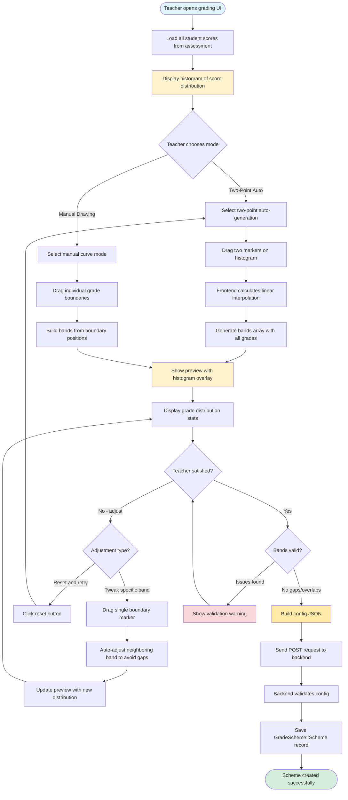
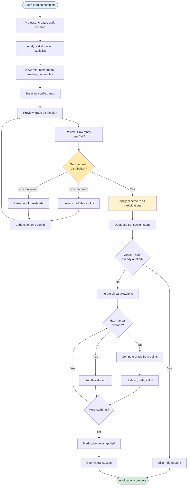
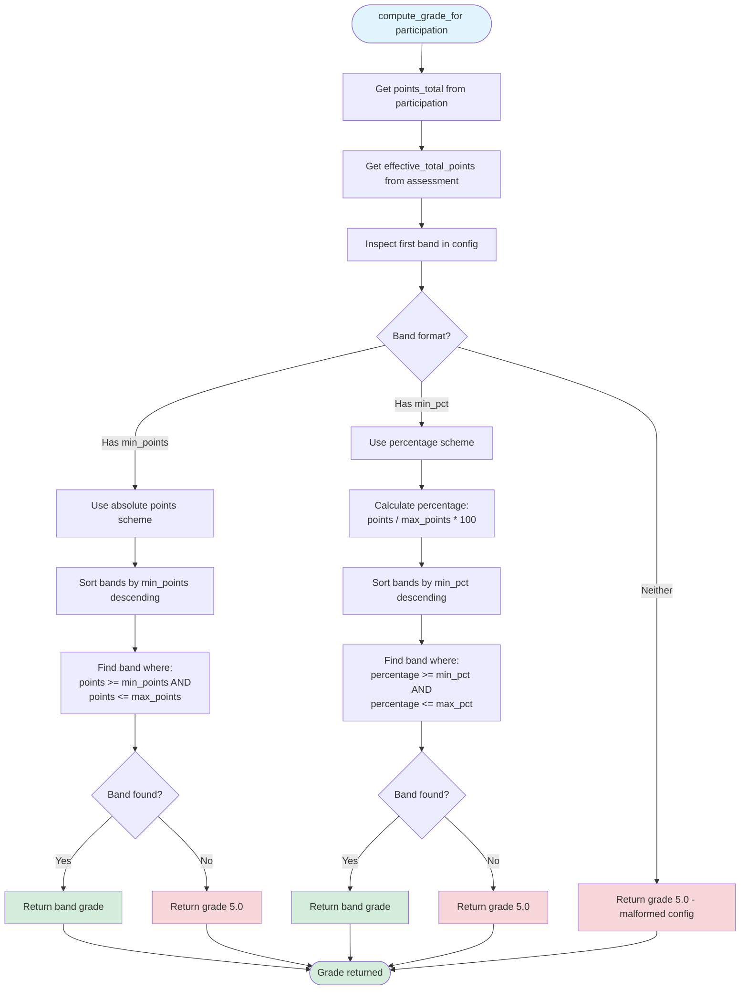
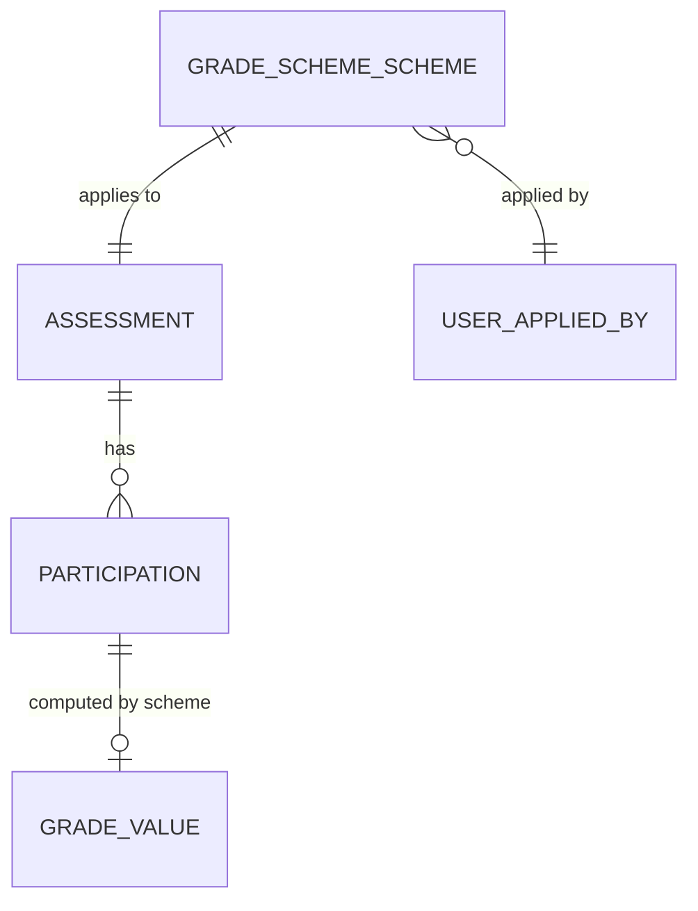
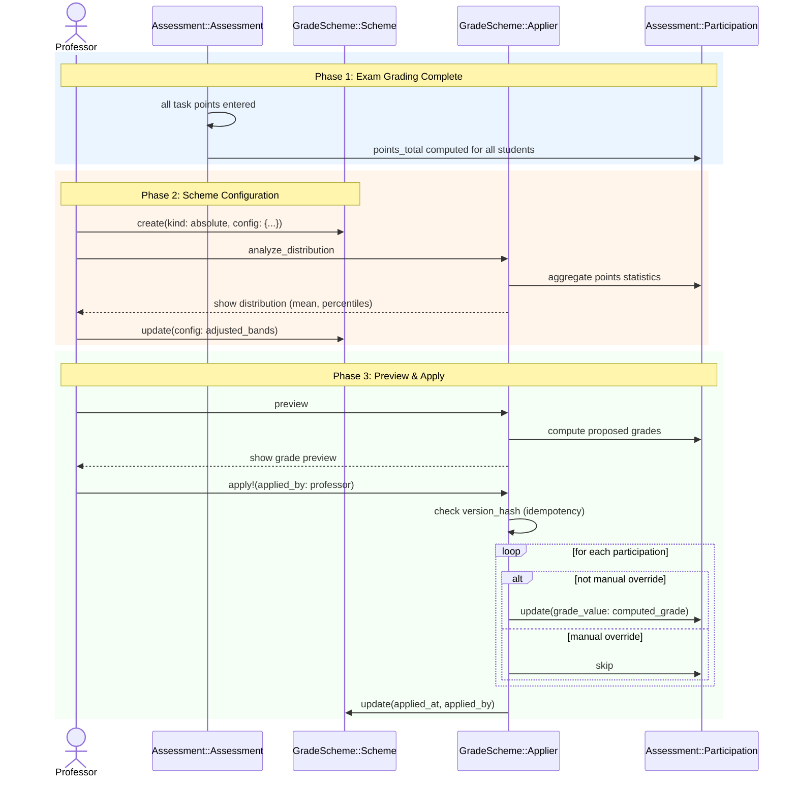

# Grading Schemes

```admonish question "What is a 'Grading Scheme'?"
A grading scheme is a systematic method for converting raw assessment points into final grade values.

- **Common Examples:** "54-60 points = 1.0, 48-53 points = 1.3, ...", "30 points or more to pass (grade 4.0)", "90-100% = 1.0, 80-89% = 1.3, ..."
- **In this context:** A configurable, versioned mapping applied to exam assessments to compute final grades from points using fixed bands.
```

## Problem Overview
After an exam is graded and all points are recorded, MaMpf needs to:
- **Convert points to grades:** Map raw points/percentages to grade values (e.g., German scale 1.0-5.0)
- **Support flexible config:** Absolute point thresholds or percentage-based bands
- **Enable analysis:** Show distribution statistics before applying scheme
- **Allow adjustments:** Let instructors tweak cutoffs based on difficulty
- **Handle manual overrides:** Respect individual grade adjustments for special cases
- **Ensure idempotency:** Re-applying same scheme produces same results
- **Maintain audit trail:** Track which scheme was applied when and by whom

## Solution Architecture
We use a configurable scheme model with service-based application:
- **Canonical Source:** `GradeScheme::Scheme` stores scheme configuration per assessment
- **Absolute Bands:** JSON config defines grade bands with either absolute points or percentages
- **Service-Based Application:** `GradeScheme::Applier` iterates participations and computes grades
- **Version Control:** Hash-based versioning prevents duplicate applications
- **Override Respect:** Manual grades bypass scheme application
- **Distribution Analysis:** Service provides statistics for informed decision-making
- **Integration Point:** Updates `Assessment::Participation.grade_value` field

---

## GradeScheme::Scheme (ActiveRecord Model)
**_Grade Mapping Configuration_**

```admonish info "What it represents"
A versioned configuration that defines how to convert assessment points into final grades for a specific assessment.
```

```admonish tip "Think of it as"
"The grading curve for the Linear Algebra final exam: 54+ points gets 1.0, 48-53 points gets 1.3, ... or alternatively 90%+ gets 1.0, 80-89% gets 1.3, ..."
```

The main fields and methods of `GradeScheme::Scheme` are:

| Name/Field       | Type/Kind        | Description                                                    |
|------------------|------------------|----------------------------------------------------------------|
| `assessment_id`  | DB column (FK)   | The assessment this scheme applies to                          |
| `kind`           | DB column (Enum) | Scheme type: currently only `absolute`                         |
| `config`         | DB column (JSONB)| Scheme-specific configuration (bands, coefficients, etc.)      |
| `version_hash`   | DB column        | MD5 hash of config for idempotency checking                    |
| `applied_at`     | DB column        | Timestamp when scheme was last applied (nil if draft)          |
| `applied_by_id`  | DB column (FK)   | User who applied the scheme                                    |
| `active`         | DB column        | Boolean: whether this is the currently active scheme           |
| `assessment`     | Association      | The linked assessment                                          |
| `applied_by`     | Association      | The user who applied the scheme                                |
| `compute_hash`   | Method           | Generates deterministic hash from config                       |
| `applied?`       | Method           | Returns true if scheme has been applied (applied_at present)   |

### Behavior Highlights

- Only one active scheme per assessment (enforced via validation)
- Config structure varies by `kind` (see "Scheme Configurations" section below)
- `version_hash` enables idempotency: applying identical config is a no-op
- Draft schemes (not applied) can be edited freely
- Applied schemes are immutable (create new version to change)

### Example Implementation

```ruby
module GradeScheme
  class Scheme < ApplicationRecord
    self.table_name = "grade_schemes"

    belongs_to :assessment, class_name: "Assessment::Assessment"
    belongs_to :applied_by, class_name: "User", optional: true

    enum kind: { absolute: 0 }

  validates :assessment_id, uniqueness: { scope: :active, if: :active? }
  validates :config, presence: true
  validate :config_matches_kind

  before_save :compute_hash, if: :config_changed?

  def applied?
    applied_at.present?
  end

  def compute_hash
    self.version_hash = Digest::MD5.hexdigest(config.to_json)
  end

  private

  def config_matches_kind
    case kind.to_sym
    when :absolute
      # Check for either absolute points or percentage-based bands
      has_bands = config["bands"].is_a?(Array)
      errors.add(:config, "must have bands array") unless has_bands
      
      if has_bands
        first_band = config["bands"].first
        has_points = first_band&.key?("min_points")
        has_pct = first_band&.key?("min_pct")
        
        unless has_points || has_pct
          errors.add(:config, "bands must have either min_points/max_points or min_pct/max_pct")
        end
      end
    end
  end
  end
end
```

### Usage Scenarios

- **Creating a draft scheme:** After an exam is graded, the professor creates: `GradeScheme::Scheme.create!(assessment: exam_assessment, kind: :absolute, active: true, config: { bands: [...] })`. The scheme is saved but `applied_at` remains `nil`.

- **Analyzing distribution:** Before applying, the professor requests distribution stats: `GradeScheme::Applier.new(scheme).analyze_distribution`. This returns `{ min: 15, max: 98, mean: 72, median: 74, percentiles: { 10 => 45, 25 => 60, ... } }`.

- **Adjusting cutoffs:** Seeing the exam was harder than expected, the professor lowers cutoffs: `scheme.update!(config: { bands: [...] })`. The `version_hash` updates automatically.

- **Applying scheme:** The professor finalizes: `GradeScheme::Applier.new(scheme).apply!(applied_by: professor)`. All participations get `grade_value` computed, `scheme.applied_at` is set.

- **Preventing re-application:** Someone tries to apply again: `GradeScheme::Applier.new(scheme).apply!(applied_by: professor)`. The service checks `version_hash`, sees it matches, and returns early (idempotent).

---

## Scheme Configurations

```admonish info "Configuration Overview"
The `config` JSONB field contains scheme-specific configuration. Currently, MaMpf supports two grading approaches that are actively used in practice at Heidelberg University.
```

| Scheme Type | Primary Use Case | Config Format | Status |
|-------------|------------------|---------------|--------|
| Absolute Points | Standard approach - fixed point thresholds | `min_points`/`max_points` | ✅ In use |
| Percentage-Based | Cross-exam comparison | `min_pct`/`max_pct` | ✅ In use |
| Interactive Curve | UI convenience for teachers | Generates absolute config | 🚧 Planned |
| Percentile/Linear | Advanced statistical schemes | N/A | ⏸️ Future |

### Absolute Cutoffs

```admonish tip "When to use"
**Use absolute points when:** Students and instructors think in terms of concrete point values ("You need 30 points to pass"), which is standard in German mathematics education.
```

**Config structure (typical 60-point exam):**
```json
{
  "bands": [
    { "min_points": 54, "max_points": 60, "grade": "1.0" },
    { "min_points": 48, "max_points": 53, "grade": "1.3" },
    { "min_points": 42, "max_points": 47, "grade": "1.7" },
    { "min_points": 36, "max_points": 41, "grade": "2.0" },
    { "min_points": 33, "max_points": 35, "grade": "2.3" },
    { "min_points": 30, "max_points": 32, "grade": "3.0" },
    { "min_points": 27, "max_points": 29, "grade": "3.7" },
    { "min_points": 24, "max_points": 26, "grade": "4.0" },
    { "min_points": 0, "max_points": 23, "grade": "5.0" }
  ]
}
```

**Field reference:**

| Field | Type | Description | Example |
|-------|------|-------------|---------|
| `min_points` | Integer | Lower boundary (inclusive) | 54 |
| `max_points` | Integer | Upper boundary (inclusive) | 60 |
| `grade` | String | German grade value | "1.0" |

```admonish success "Why absolute points are preferred"
1. **Clarity:** "You need 30 points to pass" is clearer than "You need 50%"
2. **Transparency:** Easier to discuss individual exercises and their point values
3. **Cultural fit:** Matches traditional German grading practice
4. **Precision:** Avoids rounding issues with percentage calculations
5. **Flexibility:** Instructors can adjust bands based on exam difficulty without percentage confusion
```

**Grading example (60-point exam):**

| Student | Score | Percentage | Grade | Result |
|---------|-------|------------|-------|--------|
| Alice | 55 pts | 91.67% | 1.0 | Excellent |
| Bob | 38 pts | 63.33% | 2.0 | Good |
| Carol | 28 pts | 46.67% | 3.7 | Sufficient |
| Dave | 22 pts | 36.67% | 5.0 | Failed |

### Percentage-Based Cutoffs

```admonish tip "When to use"
**Use percentages when:** You need to compare performance across multiple assessments with different maximum points, or want universal standards independent of exam length.
```

**Config structure:**
```json
{
  "bands": [
    { "min_pct": 90, "max_pct": 100, "grade": "1.0" },
    { "min_pct": 80, "max_pct": 89.99, "grade": "1.3" },
    { "min_pct": 70, "max_pct": 79.99, "grade": "1.7" },
    { "min_pct": 60, "max_pct": 69.99, "grade": "2.0" },
    { "min_pct": 55, "max_pct": 59.99, "grade": "2.3" },
    { "min_pct": 50, "max_pct": 54.99, "grade": "3.0" },
    { "min_pct": 45, "max_pct": 49.99, "grade": "3.7" },
    { "min_pct": 40, "max_pct": 44.99, "grade": "4.0" },
    { "min_pct": 0, "max_pct": 39.99, "grade": "5.0" }
  ]
}
```

**Field reference:**

| Field | Type | Description | Example |
|-------|------|-------------|---------|
| `min_pct` | Float | Lower boundary percentage (inclusive) | 90.0 |
| `max_pct` | Float | Upper boundary percentage (inclusive) | 100.0 |
| `grade` | String | German grade value | "1.0" |

**Grading example (same students, 60-point exam):**

| Student | Score | Percentage | Grade | Result |
|---------|-------|------------|-------|--------|
| Alice | 55 pts | 91.67% | 1.0 | Excellent |
| Bob | 38 pts | 63.33% | 2.0 | Good |
| Carol | 28 pts | 46.67% | 3.7 | Sufficient |
| Dave | 22 pts | 36.67% | 5.0 | Failed |

```admonish note "Detection Logic"
The `GradeScheme::Applier` automatically detects whether `min_points`/`max_points` or `min_pct`/`max_pct` is used by inspecting the first band. Both formats use the same `kind: :absolute` enum value.
```

### Interactive Curve Generation (Frontend Convenience)

```admonish warning "Implementation Status"
**Backend:** ✅ Already supported via `absolute` scheme  
**Frontend:** 🚧 Planned - Interactive UI needs to be built
```

```admonish info "Design Philosophy"
The backend only needs to support the `absolute` scheme with bands. The "curve generation" is purely a **frontend convenience feature** that produces valid `absolute` configs by helping teachers visualize and set boundaries.
```

**Comparison of UI approaches:**

| Approach | Speed | Flexibility | Best For | Status |
|----------|-------|-------------|----------|--------|
| Two-Point Auto | ⚡⚡⚡ Fast | ⭐⭐ Medium | Standard linear curves | Recommended starter |
| Manual Drawing | ⚡ Slow | ⭐⭐⭐ High | Custom non-linear curves | Power users |
| Hybrid | ⚡⚡ Medium | ⭐⭐⭐ High | Auto-generate + tweak | **Recommended** |

#### Approach 1: Two-Point Auto-Generation

```admonish example "Quick Setup"
Teacher sets just two anchors ("54+ gets 1.0", "30+ gets 4.0"), system fills in the rest via linear interpolation.
```

**Workflow:**
1. Teacher opens grading UI and sees histogram of all student scores
2. Teacher selects "Auto-generate from two points" mode
3. Teacher drags two markers on the histogram:
   - **Excellence threshold:** "54 points and above get 1.0"
   - **Passing threshold:** "30 points and above get 4.0 (pass)"
4. Frontend calculates linear interpolation for intermediate grades
5. Frontend displays preview: "54-60→1.0, 48-53→1.3, 42-47→1.7, ..."
6. Teacher can manually adjust any band boundary if desired (see below)
7. Frontend sends final `absolute` config to backend

**Example JavaScript helper:**
```javascript
function generateLinearBands(excellentPts, passingPts, maxPts, gradeSteps) {
  const range = excellentPts - passingPts;
  const stepSize = range / (gradeSteps.length - 1);
  
  const bands = gradeSteps.map((grade, index) => {
    const minPts = Math.round(passingPts + (stepSize * index));
    const maxPts = index === 0 ? maxPts : 
                   Math.round(passingPts + (stepSize * (index + 1)) - 1);
    return { min_points: minPts, max_points: maxPts, grade };
  });
  
  // Add fail band below passing threshold
  bands.push({ min_points: 0, max_points: passingPts - 1, grade: "5.0" });
  
  return bands.sort((a, b) => b.min_points - a.min_points);
}

// Usage
const bands = generateLinearBands(54, 30, 60, 
  ["1.0", "1.3", "1.7", "2.0", "2.3", "3.0", "3.7", "4.0"]
);
// Send to backend: { kind: "absolute", config: { bands } }
```

| Benefit | Description |
|---------|-------------|
| ⚡ Speed | Quick setup for standard linear grading curves |
| 🎯 Simplicity | Teacher doesn't need to think about each boundary individually |
| 🔧 Flexibility | Can still be manually tweaked afterward |

#### Approach 2: Full Manual Curve Drawing

```admonish example "Maximum Control"
Teacher drags individual boundary markers for each grade on the histogram.
```

**Workflow:**
1. Teacher opens grading UI and sees histogram
2. Teacher selects "Manual curve" mode
3. Teacher drags individual boundary markers for each grade:
   - Drag "1.0/1.3 boundary" to set where 1.0 ends and 1.3 begins
   - Drag "1.3/1.7 boundary" to adjust next boundary
   - ... (continues for all grades)
4. Frontend displays current band configuration
5. Frontend sends complete `absolute` config to backend

| Benefit | Description |
|---------|-------------|
| 🎨 Flexibility | Maximum control - teacher adjusts every boundary |
| 📊 Non-linear | Can create custom curves (generous with top grades, strict with passing) |
| 🧠 Intentional | Works for any grading philosophy |

#### Approach 3: Hybrid (Recommended)

```admonish success "Best of Both Worlds"
Auto-generate initial bands from two points, then allow manual tweaking of individual boundaries.
```

**Workflow:**
1. Teacher selects "Auto-generate from two points"
2. System generates initial bands via linear interpolation
3. **Teacher can then manually adjust individual boundaries:**
   - "Hmm, let me be more generous with 1.0"
   - Drags the 1.0 minimum from 54 down to 50
   - System either:
     - **Option A:** Auto-adjusts neighboring bands to fill gaps
     - **Option B:** Shows warning "Gap detected between 1.0 and 1.3"
4. Teacher previews grade distribution with adjusted boundaries
5. Frontend sends final `absolute` config to backend

**Example of manual adjustment after auto-generation:**
```javascript
// Auto-generated
const initialBands = generateLinearBands(54, 30, 60, grades);
// [{ min: 54, max: 60, grade: "1.0" }, { min: 48, max: 53, grade: "1.3" }, ...]

// Teacher drags 1.0 boundary down to 50
function adjustBand(bands, gradeToAdjust, newMinPoints) {
  const index = bands.findIndex(b => b.grade === gradeToAdjust);
  bands[index].min_points = newMinPoints;
  
  // Auto-adjust next band to avoid gaps
  if (index < bands.length - 1) {
    bands[index + 1].max_points = newMinPoints - 1;
  }
  
  return bands;
}

const adjustedBands = adjustBand(initialBands, "1.0", 50);
// [{ min: 50, max: 60, grade: "1.0" }, { min: 46, max: 49, grade: "1.3" }, ...]
```

**Recommended UI elements:**

| Element | Purpose |
|---------|---------|
| 📊 Histogram | Shows score distribution of all students |
| 📍 Draggable markers | Boundary markers overlaid on histogram for visual adjustment |
| 👁️ Live preview | "X students would get 1.0, Y would fail, ..." |
| 🔄 Reset button | Regenerate from current two-point anchors |
| 🥧 Distribution chart | Pie/bar chart showing final grade distribution |

```admonish note "Backend Simplicity"
- Backend receives only `{ kind: "absolute", config: { bands: [...] } }`
- Doesn't know or care how bands were generated (manual, auto, or hybrid)
- No special "two-point" or "curve" scheme type needed
- Simple validation: bands must not overlap, must cover 0 to max_points
```

### Interactive UI Workflow (Hybrid Approach)



### Future Extensions

```admonish todo "Not Currently Needed"
Additional grading schemes (percentile-based ranking, piecewise mapping, etc.) could be added if needed, but are **not currently in use** at Heidelberg and thus not implemented.

The flexible JSONB config structure makes it easy to add new scheme types without database migrations.
```

---

## GradeScheme::Applier (Service Object)
**_Grade Computer_**

```admonish info "What it represents"
A service that applies a grading scheme to an assessment's participations, computing and persisting final grades.
```

```admonish tip "Think of it as"
The "grade calculator" that transforms points into grades according to the configured scheme.
```

### Public Interface

| Method | Purpose |
|--------|---------|
| `initialize(scheme)` | Sets up the applier with a specific grade scheme |
| `analyze_distribution` | Returns statistics about current points distribution |
| `apply!(applied_by:)` | Computes grades for all participations and persists them |
| `preview` | Shows what grades would be assigned without persisting |

### Behavior Highlights

- **Idempotent:** Checks `version_hash` before applying; skip if already applied
- **Manual override respect:** Skips participations with `manual_grade_override` flag
- **Transaction-safe:** Uses database transaction for consistency
- **Efficient:** Single query to load all participations, batch updates
- **Statistics:** Analyzes distribution for informed decision-making

### Scheme Application Workflow



### Grade Computation Algorithm



### Example Implementation

```ruby
module GradeScheme
  class Applier
    def initialize(scheme)
      @scheme = scheme
      @assessment = scheme.assessment
    end

  def analyze_distribution
    participations = @assessment.participations.where(status: :graded)
    points = participations.pluck(:points_total)
    max_points = @assessment.effective_total_points

    {
      count: points.size,
      min: points.min,
      max: points.max,
      mean: points.sum.to_f / points.size,
      median: points.sort[points.size / 2],
      percentiles: calculate_percentiles(points),
      max_possible: max_points
    }
  end

  def apply!(applied_by:)
    return if already_applied?

    Assessment::Participation.transaction do
      participations = @assessment.participations.where(status: :graded)
      
      participations.each do |participation|
        next if participation.manual_grade_override?
        
        grade = compute_grade_for(participation)
        participation.update!(grade_value: grade)
      end

      @scheme.update!(applied_at: Time.current, applied_by: applied_by)
    end
  end

  def preview
    participations = @assessment.participations.where(status: :graded)
    
    participations.map do |p|
      {
        user_id: p.user_id,
        points: p.points_total,
        percentage: percentage_for(p),
        proposed_grade: compute_grade_for(p),
        current_grade: p.grade_value
      }
    end
  end

  private

  def already_applied?
    @scheme.applied? && @scheme.version_hash == @scheme.compute_hash
  end

  def compute_grade_for(participation)
    points = participation.points_total
    max_points = @assessment.effective_total_points
    
    # Determine if using absolute points or percentage-based
    first_band = @scheme.config["bands"].first
    
    if first_band.key?("min_points")
      apply_absolute_points_scheme(points)
    elsif first_band.key?("min_pct")
      percentage = percentage_for(participation)
      apply_percentage_scheme(percentage)
    else
      "5.0" # Fallback if config is malformed
    end
  end

  def percentage_for(participation)
    max = @assessment.effective_total_points
    return 0 if max.zero?
    (participation.points_total.to_f / max * 100).round(2)
  end

  def apply_absolute_points_scheme(points)
    bands = @scheme.config["bands"].sort_by { |b| -b["min_points"] }
    band = bands.find { |b| points >= b["min_points"] && points <= b["max_points"] }
    band ? band["grade"] : "5.0"
  end

  def apply_percentage_scheme(percentage)
    bands = @scheme.config["bands"].sort_by { |b| -b["min_pct"] }
    band = bands.find { |b| percentage >= b["min_pct"] && percentage <= b["max_pct"] }
    band ? band["grade"] : "5.0"
  end

  def calculate_percentiles(points)
    sorted = points.sort
    {
      10 => sorted[(sorted.size * 0.1).floor],
      25 => sorted[(sorted.size * 0.25).floor],
      50 => sorted[(sorted.size * 0.5).floor],
      75 => sorted[(sorted.size * 0.75).floor],
      90 => sorted[(sorted.size * 0.9).floor]
    }
  end
  end
end
```

### Usage Scenarios

- **Preview before applying:** Professor wants to see results: `preview = GradeScheme::Applier.new(scheme).preview`. They review the proposed grades and see that 5 students would fail.

- **Adjust and re-preview:** Professor lowers the passing threshold: `scheme.update!(config: { ... })`, then previews again. Now only 2 students fail, which seems fair.

- **Final application:** Professor applies: `GradeSchemeApplier.new(scheme).apply!(applied_by: professor)`. All 150 students get their `grade_value` set.

- **Manual override:** One student had exceptional circumstances. The tutor marks: `participation.update!(manual_grade_override: true, grade_value: "2.0")`. Future scheme applications will skip this record.

- **Idempotent reapplication:** System accidentally triggers apply again: `GradeSchemeApplier.new(scheme).apply!(applied_by: professor)`. The service detects identical `version_hash` and returns immediately.

---

## Integration with Assessment System

```admonish info "What it represents"
Grading schemes extend the Assessment system by providing automated grade computation for assessments that track points.
```

### Relationship to Assessment::Gradable

The `Assessment::Gradable` concern already provides:
- `grade_value` field on `Assessment::Participation`
- Manual grade entry capability

Grading schemes add:
- **Automated computation** from points
- **Configurable mapping** logic
- **Version control** and audit trail
- **Distribution analysis** tools

### When to Use

| Scenario | Use Grading Scheme? |
|----------|---------------------|
| Homework assignments | ❌ No - just track points |
| Midterm exam with grade | ✅ Yes - convert points to grade |
| Final exam with grade | ✅ Yes - convert points to grade |
| Seminar talk presentation | ❌ No - manual grade entry suffices |
| Combined course grade | ✅ Yes (future) - weight multiple assessments |

### Usage Scenarios

- **After exam grading:** All task points are entered and `Assessment::Participation.points_total` values are computed. The professor creates a `GradeScheme::Scheme` to convert these points to final grades.

- **Manual grade override:** A student with exceptional circumstances gets `participation.manual_grade_override = true` and a direct grade entry. When the scheme is applied, this participation is skipped.

- **Re-grading scenario:** A mistake is found in one student's exam. The tutor corrects their task points. The `points_total` updates via callback. The professor could re-apply the scheme (with same config) to update just that grade, but the idempotency check would skip all unchanged participations.

---

## ERD



---

## Sequence Diagram



---

## Proposed Folder Structure

```text
app/
└── models/
    └── grade_scheme/
        ├── scheme.rb
        └── applier.rb
```

### Key Files
- `app/models/grade_scheme/scheme.rb` - Versioned scheme configuration
- `app/models/grade_scheme/applier.rb` - Grade computation and application logic

---

## Database Tables

- `grade_schemes` - Scheme configurations with version control

```admonish note
Column details are documented in the GradeScheme::Scheme model section above.
```
