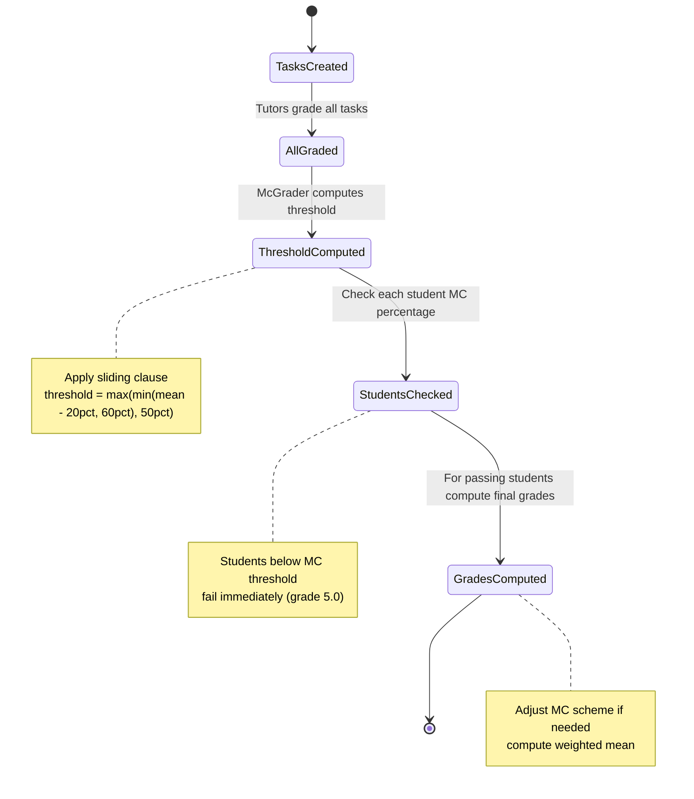

# Multiple Choice Exams

```admonish warning "Extension Feature"
This chapter documents an optional extension for exams that include multiple choice components requiring special legal compliance. This feature should be implemented after the core assessment and exam infrastructure is complete.
```

```admonish question "What are MC Exams?"
MC (Multiple Choice) exams are exams that include a multiple choice section which must be graded according to legally mandated schemes, separate from the written part.

- **Common Example:** "Final Exam with 30% MC part, 70% written part"
- **Legal Context:** German examination law (Prüfungsordnung) requires specific grading rules for MC components
- **In this context:** An extension to the base Exam model that adds MC-specific grading automation
```

## Problem Overview
When an exam has both MC and written parts:
- MC part must use a fixed legal grading scheme (defined by law)
- Written part uses standard exam grading (curve-based or absolute)
- Final grade is weighted mean of both parts
- Students must meet a minimum MC threshold to pass
- Threshold can be lowered by a "sliding clause" (Gleitklausel) based on average performance
- Without automation, staff must manually compute this for hundreds of students

## Solution Architecture
We extend the base `Exam` model with:
- **MC Configuration:** `has_multiple_choice` flag and `mc_weight` percentage
- **Task-Level Scheme:** `Assessment::Task` gets `is_multiple_choice` flag and `grade_scheme_id`
- **Legal Grader Service:** `Assessment::McGrader` implements the two-stage grading process
- **Automatic Adjustment:** Service computes threshold, checks eligibility, adjusts grade bands, computes final grades

---

## Exam Model Extension

### Additional Fields

| Field | Type | Description |
|-------|------|-------------|
| `has_multiple_choice` | Boolean | Whether this exam includes an MC part |
| `mc_weight` | Decimal | Weight of MC part in final grade (e.g., 0.3 = 30%) |

### Example Configuration

```ruby
exam = Exam.create!(
  lecture: lecture,
  title: "Final Exam",
  date: Date.new(2025, 2, 15),
  has_multiple_choice: true,
  mc_weight: 0.3  # MC part counts for 30% of final grade
)
```

---

## Assessment::Task Extensions

### MC-Specific Fields

| Field | Type | Description |
|-------|------|-------------|
| `is_multiple_choice` | Boolean | Marks this task as the MC part |
| `grade_scheme_id` | FK (optional) | Links to a grade scheme specifically for this task |

### Validations

```ruby
module Assessment
  class Task < ApplicationRecord
    validates :is_multiple_choice, inclusion: { in: [true, false] }
    validate :mc_flag_only_for_exams
    validate :at_most_one_mc_task_per_assessment
    validate :grade_scheme_only_for_mc_tasks

    scope :multiple_choice, -> { where(is_multiple_choice: true) }
    scope :regular, -> { where(is_multiple_choice: false) }

    private

    def mc_flag_only_for_exams
      return unless is_multiple_choice?
      return if assessment.assessable.is_a?(Exam)

      errors.add(:is_multiple_choice,
                 "can only be set for exam assessments")
    end

    def at_most_one_mc_task_per_assessment
      return unless is_multiple_choice?
      return unless assessment

      other_mc_tasks = assessment.tasks.multiple_choice
                                 .where.not(id: id)

      if other_mc_tasks.exists?
        errors.add(:is_multiple_choice,
                   "only one MC task allowed per assessment")
      end
    end

    def grade_scheme_only_for_mc_tasks
      return unless grade_scheme_id.present?
      return if is_multiple_choice?

      errors.add(:grade_scheme,
                 "can only be assigned to multiple choice tasks")
    end
  end
end
```

```admonish note "Why Task-Level Grade Scheme?"
MC tasks need their own grade scheme because:
- The MC part may have different max points than the written part
- Staff may want a relative (curve-based) scheme for MC but absolute for written, or vice versa
- Each exam can configure this independently

The validation ensures only MC tasks can have their own scheme—regular tasks use the assessment-level scheme.
```

---

## Legal Requirements

```admonish info "German Law (Prüfungsordnung)"
The law requires a minimum passing threshold for the MC part:
- **Default threshold:** 60% of MC points
- **Sliding clause (Gleitklausel):** If (mean - 20%) < 60%, threshold becomes (mean - 20%)
- **Floor:** Threshold cannot go below 50% of max MC points
- Students who fail to meet the MC threshold fail the entire exam (grade 5.0)
```

### Threshold Computation Examples

**Example 1:** Average MC score is 70%
- Sliding threshold: 70% - 20% = 50%
- Since 50% < 60%, threshold becomes 50%
- Students need at least 50% on MC to pass

**Example 2:** Average MC score is 85%
- Sliding threshold: 85% - 20% = 65%
- Since 65% > 60%, threshold stays at 60%
- Students need at least 60% on MC to pass

**Example 3:** Average MC score is 65%
- Sliding threshold: 65% - 20% = 45%
- Since 45% < 50% (floor), threshold becomes 50%
- Students need at least 50% on MC to pass

### Grade Scheme Adjustment

```admonish warning "Dynamic Grade Bands"
When the Gleitklausel lowers the threshold below 60%, the MC task's grade scheme must be dynamically adjusted:

**Without Gleitklausel (threshold = 60%):**
- Original scheme: 60% → 4.0, 70% → 3.0, 80% → 2.0, 90% → 1.0

**With Gleitklausel (threshold = 50%):**
- Adjusted scheme: 50% → 4.0, 60% → 3.0, 70% → 2.0, 80% → 1.0
- All grade boundaries shift by the same amount (10 percentage points in this example)

The `McGrader` service handles this adjustment automatically.
```

---

## Assessment::McGrader (Service)

```admonish info "What it represents"
A service that implements the legally mandated two-stage grading process for exams with MC components.
```

### Public Interface

| Method | Description |
|--------|-------------|
| `apply_legal_scheme!` | Computes threshold, checks eligibility, computes grades for all students |

### Two-Stage Process

**Stage 1: MC Threshold Check**
1. Compute average MC score across all students
2. Apply sliding clause: `threshold = max(min(mean - 20%, 60%), 50%)`
3. Check each student's MC percentage against threshold
4. Students below threshold fail immediately (grade 5.0)

**Stage 2: Grade Computation (for passing students)**
1. Adjust MC grade scheme if threshold < 60%
2. Compute MC grade using adjusted scheme
3. Compute written grade using standard scheme
4. Compute final grade: `final = mc_weight × mc_grade + (1 - mc_weight) × written_grade`

### Implementation

```ruby
module Assessment
  class McGrader
    def initialize(assessment)
      @assessment = assessment
      @exam = assessment.assessable
    end

    def apply_legal_scheme!
      return unless @exam.is_a?(Exam) && @exam.has_multiple_choice?

      mc_task = @assessment.tasks.multiple_choice.first
      regular_tasks = @assessment.tasks.regular

      mc_threshold = compute_mc_threshold(mc_task)

      @assessment.participations.find_each do |participation|
        mc_points = participation.task_points
                                 .find_by(task: mc_task)&.points || 0
        mc_percentage = mc_points.to_f / mc_task.max_points

        if mc_percentage < mc_threshold
          participation.update!(
            grade_value: 5.0,
            passed: false,
            failure_reason: "MC threshold not met (#{(mc_threshold * 100).round}%)"
          )
          next
        end

        mc_grade = compute_mc_grade(mc_points, mc_task, mc_threshold)
        regular_grade = compute_regular_grade(participation, regular_tasks)

        final_grade = (@exam.mc_weight * mc_grade) +
                      ((1 - @exam.mc_weight) * regular_grade)

        participation.update!(grade_value: final_grade, passed: final_grade <= 4.0)
      end
    end

    private

    def compute_mc_threshold(mc_task)
      all_mc_points = @assessment.participations
                                  .joins(:task_points)
                                  .where(task_points: { task: mc_task })
                                  .pluck("task_points.points")

      return 0.60 if all_mc_points.empty?

      mean_points = all_mc_points.sum.to_f / all_mc_points.size
      mean_percentage = mean_points / mc_task.max_points

      default_threshold = 0.60
      sliding_threshold = mean_percentage - 0.20
      floor_threshold = 0.50

      if sliding_threshold < default_threshold
        [sliding_threshold, floor_threshold].max
      else
        default_threshold
      end
    end

    def compute_mc_grade(mc_points, mc_task, threshold_percentage)
      raise "MC task must have a grade scheme" unless mc_task.grade_scheme

      adjusted_scheme = adjust_scheme_for_threshold(
        mc_task.grade_scheme,
        threshold_percentage
      )

      GradeScheme::Applier.compute_grade(
        mc_points,
        mc_task.max_points,
        adjusted_scheme
      )
    end

    def adjust_scheme_for_threshold(original_scheme, threshold)
      default_threshold = 0.60

      return original_scheme if threshold == default_threshold

      shift = threshold - default_threshold

      original_scheme.bands.map do |band|
        {
          min_percentage: [band[:min_percentage] + shift, 0.0].max,
          grade: band[:grade]
        }
      end
    end

    def compute_regular_grade(participation, regular_tasks)
      total = participation.task_points
                          .where(task: regular_tasks)
                          .sum(:points)
      max = regular_tasks.sum(:max_points)

      GradeScheme::Applier.compute_grade(
        total,
        max,
        @assessment.grade_scheme
      )
    end
  end
end
```

---

## Grading Workflow for MC Exams

| Step | Action | Technical Details |
|------|--------|-------------------|
| 1 | Create assessment | Staff creates `Assessment::Assessment` for the exam |
| 2 | Create tasks | Staff creates tasks, marking one with `is_multiple_choice: true` |
| 3 | Configure MC scheme | Staff creates and assigns a `GradeScheme::Scheme` to the MC task |
| 4 | Grade all tasks | Tutors grade MC questions and written problems normally |
| 5 | Apply MC grader | Staff calls `Assessment::McGrader.new(assessment).apply_legal_scheme!` |
| 6 | Results | Service computes threshold, checks eligibility, adjusts scheme, computes final grades |

```admonish note "MC Task Grade Scheme"
The MC task has its own grade scheme (can be relative/curve-based or absolute). Only MC tasks can have task-level schemes—this is enforced by validation. Regular tasks use the assessment-level scheme.
```

---

## Database Schema Extensions

### Exams Table Migration

```ruby
# filepath: db/migrate/20250101000000_add_multiple_choice_to_exams.rb
class AddMultipleChoiceToExams < ActiveRecord::Migration[7.0]
  def change
    add_column :exams, :has_multiple_choice, :boolean, default: false, null: false
    add_column :exams, :mc_weight, :decimal, precision: 5, scale: 2

    reversible do |dir|
      dir.up do
        execute <<-SQL
          ALTER TABLE exams
          ADD CONSTRAINT exams_mc_weight_when_mc
          CHECK (NOT has_multiple_choice OR mc_weight IS NOT NULL);
        SQL
      end

      dir.down do
        execute "ALTER TABLE exams DROP CONSTRAINT IF EXISTS exams_mc_weight_when_mc;"
      end
    end
  end
end
```

### Assessment Tasks Table Migration

```ruby
# filepath: db/migrate/20250102000000_add_multiple_choice_to_tasks.rb
class AddMultipleChoiceToTasks < ActiveRecord::Migration[7.0]
  def change
    add_column :assessment_tasks, :is_multiple_choice, :boolean,
               default: false, null: false
    add_reference :assessment_tasks, :grade_scheme, foreign_key: true,
                  index: true
  end
end
```

### Assessment Participations Table Migration

```ruby
# filepath: db/migrate/20250103000000_add_failure_reason_to_participations.rb
class AddFailureReasonToParticipations < ActiveRecord::Migration[7.0]
  def change
    add_column :assessment_participations, :failure_reason, :text
  end
end
```

```admonish note "Application-Level Constraints"
The "at most one MC task per assessment" constraint is enforced via ActiveRecord validation, not database constraint, to provide better error messages.
```

---

## Usage Scenarios

### Creating an MC Exam

```ruby
exam = Exam.create!(
  lecture: lecture,
  title: "Final Exam",
  date: Date.new(2025, 2, 15),
  has_multiple_choice: true,
  mc_weight: 0.3
)

assessment = exam.assessment
assessment.tasks.create!(title: "MC Questions", max_points: 30, is_multiple_choice: true)
assessment.tasks.create!(title: "Problem 1", max_points: 20)
assessment.tasks.create!(title: "Problem 2", max_points: 25)
assessment.tasks.create!(title: "Problem 3", max_points: 25)

mc_task = assessment.tasks.multiple_choice.first
mc_scheme = GradeScheme::Scheme.create!(
  title: "MC Legal Scheme",
  kind: :absolute,
  bands: [
    { min_percentage: 0.90, grade: 1.0 },
    { min_percentage: 0.80, grade: 2.0 },
    { min_percentage: 0.70, grade: 3.0 },
    { min_percentage: 0.60, grade: 4.0 }
  ]
)
mc_task.update!(grade_scheme: mc_scheme)
```

### Grading and Computing Final Grades

```ruby
Assessment::McGrader.new(assessment).apply_legal_scheme!
```

This single call:
- Computes the MC threshold with sliding clause
- Fails students below the threshold
- Adjusts the MC grade scheme if needed
- Computes MC and written grades
- Computes weighted final grades

---

## Integrity Constraints

```sql
-- At most one MC task per assessment (enforced in application layer)
-- See Assessment::Task#at_most_one_mc_task_per_assessment validation

-- Grade scheme only for MC tasks
-- See Assessment::Task#grade_scheme_only_for_mc_tasks validation

-- MC flag only for exam assessments
-- See Assessment::Task#mc_flag_only_for_exams validation
```

---

## Open Questions

```admonish todo "Rounding Strategy"
The weighted mean of two grades (e.g., 0.3 × 1.3 + 0.7 × 2.0 = 1.79) is not necessarily a well-defined grade in the German system. We need to decide on a rounding strategy:
- Round to nearest 0.3 step (1.0, 1.3, 1.7, 2.0, 2.3, 2.7, 3.0, ...)?
- Round down/up consistently?
- Allow arbitrary decimal grades?

This detail should be clarified before implementation.
```

---

## Proposed File Structure

```text
app/
├── models/
│   ├── assessment/
│   │   └── task.rb (extended with MC fields and validations)
│   └── exam.rb (extended with has_multiple_choice and mc_weight)
└── services/
    └── assessment/
        └── mc_grader.rb (new service)
```

---

## State Diagram


