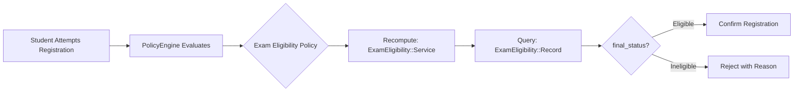
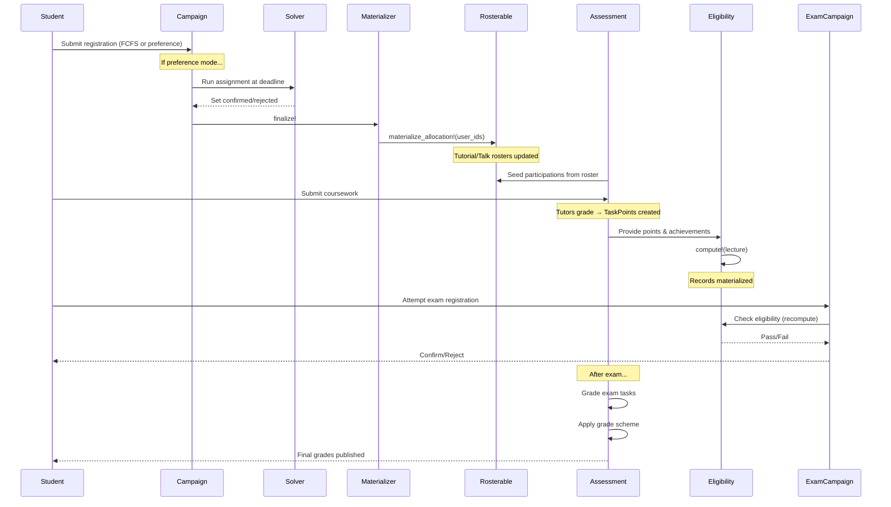

# End-to-End Workflow

This chapter walks through a complete semester lifecycle, showing how all the components from previous chapters work together in practice.

```admonish tip "Reading Guide"
Each phase below shows the **Goal**, **Key Actions**, and **Technical Flow** for that stage of the semester. Follow the phases sequentially to understand how registration flows into grading, which then feeds into eligibility and exam registration.
```

## Phase 0: Semester Setup

```admonish info "Setup Phase"
At the start of the semester, staff configures the basic teaching structure.
```

**Staff Actions:**

| Action | Details |
|--------|---------|
| Create Lecture | Set up the lecture record (e.g., "Linear Algebra WS 2024/25") |
| Create Tutorials | Define tutorial groups with times, locations, and capacities |
| (Optional) Create Talks | For seminars, define talk slots for student presentations |

## Phase 1: Tutorial/Talk Registration Campaign

```admonish success "Goal"
Assign students to tutorial groups or seminar talks
```

**Staff Actions:**

| Action | Details |
|--------|---------|
| Create Campaign | Staff creates a `Registration::Campaign` for the lecture |
| Set Mode | Choose `allocation_mode`: `first_come_first_serve` or `preference_based` |
| Add Items | Create one `Registration::Item` for each tutorial or talk |
| Attach Policies | Add `Registration::Policy` records (e.g., `institutional_email`, `prerequisite_campaign`) |
| Open Campaign | Make available for student registrations (registration requests) |

**Student Experience:**

```admonish note "Two Registration Modes"
- **FCFS Mode:** Click to register, get immediate confirmation or rejection
- **Preference Mode:** Rank options in order of preference, wait for allocation
```

**Technical Flow:**
- Each registration request creates a `Registration::UserRegistration` with status `pending` or `confirmed` (FCFS)
- `Registration::PolicyEngine` evaluates all active policies in order
- If any policy fails, registration is rejected with specific reason code

## Phase 2: Preference-Based Allocation (if applicable)

```admonish success "Goal"
Compute optimal assignment respecting preferences and constraints
```

```admonish warning "Only for Preference-Based Campaigns"
This phase is skipped if the campaign uses `first_come_first_serve` mode.
```

**Staff Actions:**
- At or after registration deadline, staff triggers `campaign.allocate_and_finalize!`
- Campaign status transitions: `open` → `processing` → `completed`

**Technical Details:**

| Aspect | Implementation |
|--------|----------------|
| Service | `Registration::AllocationService` delegates to solver (e.g., Min-Cost Flow) |
| Cost Model | Preferences treated as costs (rank 1 = cost 1, rank 2 = cost 2, etc.) |
| Constraints | Respects capacity from `Registerable#capacity` |
| Output | One confirmed `UserRegistration` per user, rejects others |
| Idempotency | Operation can be re-run if needed with same results |

## Phase 3: Allocation Materialization

```admonish success "Goal"
Apply confirmed registrations to domain model rosters
```

**Staff Actions:**
- Staff calls `campaign.finalize!`
- `Registration::AllocationMaterializer` iterates through all `Registration::Item` records
- For each item, collects confirmed user IDs and calls `registerable.materialize_allocation!(user_ids:, campaign:)`

**Domain Effects:**

| Model | Effect |
|-------|--------|
| `Tutorial` | Student rosters updated |
| `Talk` | Speaker assignments updated |
| Authority | Rosters are now the authoritative source for course operations |
| Idempotency | Same inputs produce same results (can be re-run safely) |

---

## Phase 4: Post-Allocation Roster Maintenance

```admonish success "Goal"
Handle late registrations, drops, and moves
```

**Staff Operations via `Roster::MaintenanceService`:**

| Operation | Method | Purpose |
|-----------|--------|---------|
| Transfer | `move_user!(from:, to:)` | Move student between tutorials |
| Add | `add_user!(to:)` | Add late arrival |
| Remove | `remove_user!(from:)` | Remove dropout |

```admonish note "Guardrails"
- Service enforces capacity limits (unless `allow_overfill: true`)
- All operations are transactional (atomic)
- Changes are logged for audit trail
- Operates on domain rosters directly, independent of campaign
```

## Phase 5: Coursework Assessments & Grading

```admonish success "Goal"
Track student performance on assignments and presentations
```

**Setup Flow:**

| Step | Action |
|------|--------|
| 1. Create Assessment | For each `Assignment`, create linked `Assessment::Assessment` with `requires_points: true` |
| 2. Seed Participations | Call `assessment.seed_participations_from!(user_ids: tutorial.roster_user_ids)` |
| 3. Define Tasks | Create `Assessment::Task` records for each problem/component |
| 4. Student Submission | Students upload `Submission` records (possibly as teams) |
| 5. Grading | Tutors grade via `Assessment::SubmissionGrader` |

**Grading Flow:**

```admonish note "Team Grading Fan-Out"
Service creates `Assessment::TaskPoint` for each team member automatically. Points are validated against `Task#max_points`, and `Participation#points_total` is recomputed automatically.
```

**Publication:**
- Staff publishes results by setting `assessment.results_published = true`

**For Talks (Simplified):**

| Aspect | Difference |
|--------|------------|
| Mode | `requires_points: false` (grade-only mode) |
| Seeding | Seed from talk speaker roster |
| Grading | Record final `grade_value` directly on `Assessment::Participation` |

---

## Phase 6: Achievement Tracking

```admonish success "Goal"
Record qualitative accomplishments for eligibility
```

**Staff Actions:**
- Staff creates `ExamEligibility::Achievement` records for students
- Examples: `blackboard_presentation`, `class_participation`, `peer_review`
- These augment quantitative points for eligibility determination

## Phase 7: Exam Eligibility Computation

```admonish success "Goal"
Determine eligibility status for all lecture students
```

```admonish info "Scope"
Eligibility is computed for **all students enrolled in the lecture** (e.g., 150 students), not just those who plan to register. This provides transparency and legal compliance: every student can verify their eligibility status.
```

**Staff Configuration:**
- Configure eligibility rules (minimum percentage, achievement counts, included assessment types)
- System runs `ExamEligibility::Service.compute!(lecture:)` before exam registration opens

**Materialized Data in `ExamEligibility::Record`:**

| Field | Content |
|-------|---------|
| `points_total_materialized` | Sum of relevant coursework points |
| `percentage_materialized` | Percentage of maximum possible points |
| `achievement_count` | Count of recorded achievements |
| `computed_status` | System-computed: `eligible` or `ineligible` |
| `rule_config_snapshot` | Copy of rules used (for audit trail) |

**Staff Actions:**
- Review **Eligibility Overview** screen showing all 150 lecture students
- Verify eligibility computation is correct
- Apply manual overrides if needed (with documented reasons)

**Override Capability:**

```admonish note "Manual Overrides"
Staff can manually set `override_status` with required `override_reason`. Overrides persist across recomputations. The `final_status` method returns override if present, else computed status.
```

---

## Phase 8: Exam Registration Campaign

```admonish success "Goal"
Allow eligible students to register for exam (FCFS)
```

```admonish info "Complete Exam Documentation"
For full details on the Exam model, see [Exam Model](05a-exam-model.md).
```

**Campaign Setup:**

| Step | Action |
|------|--------|
| 1. Create Exam | Staff creates the `Exam` record with date, location, and capacity |
| 2. Create Campaign | Staff creates `Registration::Campaign` for the exam |
| 3. Attach Policy | Add `Registration::Policy` with `kind: :exam_eligibility` (see [Exam Eligibility](05-exam-eligibility.md)) |
| 4. Optional Policies | May also attach other policies (e.g., `institutional_email`) |
| 5. Open | Campaign opens for registrations (registration requests) |

**Student Experience:**
- Students see their eligibility status (eligible students can proceed)
- Only eligible students can successfully register
- Registration is first-come-first-served until capacity is reached
- Students receive immediate confirmation or rejection with reason

**Registration Flow:**



```admonish tip "100% Accuracy Guarantee"
Eligibility is recomputed at registration time to ensure absolute accuracy, even if grades changed after initial computation.
```

**After Registration Closes:**
- Staff calls `campaign.finalize!` to close registration
- Campaign materializes confirmed registrations to exam roster
- **Exam Roster** now contains subset of eligible students who registered (e.g., 85 of 126 eligible)
- Staff views **Exam Roster** screen (distinct from Eligibility Overview) to manage participants

```admonish warning "Two Distinct Lists"
- **Eligibility Overview** (Phase 7): All 150 lecture students with eligibility status
- **Exam Roster** (Phase 8+): Only 85 registered students who will take the exam

The roster is used for exam administration (room assignments, grading), while eligibility records remain for audit/legal purposes.
```

## Phase 9: Exam Grading & Grade Schemes

```admonish success "Goal"
Record exam scores and assign final grades
```

**Grading Setup:**

| Step | Action |
|------|--------|
| 1. Create Assessment | After exam is administered, create `Assessment::Assessment` for the exam |
| 2. Seed Participations | From confirmed exam registrants |
| 3. Define Tasks | Create `Assessment::Task` records for each exam problem |
| 4. Enter Points | Tutors enter points via grading interface |
| 5. Aggregate | Points aggregate to `Participation#points_total` |

**Grade Scheme Application:**

```admonish note "Converting Points to Grades"
Staff analyzes score distribution (histogram, percentiles), then creates and applies a `GradeScheme::Scheme`.
```

| Step | Process |
|------|---------|
| Analyze | View distribution statistics and histogram |
| Configure | Create `GradeScheme::Scheme` with absolute point bands or percentage cutoffs |
| Apply | Call `GradeScheme::Applier.apply!(scheme)` |
| Result | Service computes `grade_value` for each participation based on points |
| Override | Manual adjustments possible for exceptional cases |

```admonish note "Multiple Choice Exam Extension"
For exams with multiple choice components requiring legal compliance, see the [Multiple Choice Exams](05c-multiple-choice-exams.md) chapter for the two-stage grading workflow.
```

**Final Result:**
- Students have both granular points (`TaskPoint` records) and final grade (`Participation#grade_value`)

---

## Phase 10: Late Adjustments & Recomputation

```admonish warning "Scenario"
Coursework grades change after initial eligibility computation
```

**System Response:**

| Trigger | Action |
|---------|--------|
| Grade Change | System automatically triggers `ExamEligibility::Service.compute!(lecture:, user_ids: [affected_ids])` |
| Update | Materialized values update in `ExamEligibility::Record` |
| Preserve | Overrides remain unchanged (manual decisions preserved) |
| If Exam Open | Updated eligibility applies immediately |
| If Exam Closed | Change only affects reporting/records |

---

## Phase 11: Reporting & Administration

```admonish success "Goal"
Ongoing monitoring and data integrity
```

**Ongoing Activities:**

| Activity | Source |
|----------|--------|
| Participation Reports | `Assessment::Participation` data |
| Eligibility Export | `ExamEligibility::Record` |
| Registration Audit | `Registration::UserRegistration` |
| Roster Adjustments | `Roster::MaintenanceService` as needed |
| Data Integrity | Background jobs monitoring consistency |

---

## Key Invariants Throughout the Workflow

```admonish warning "System Constraints"
These constraints are maintained across all phases to ensure data integrity.
```

| Invariant | Description |
|-----------|-------------|
| One Record per (lecture, user) | `ExamEligibility::Record` uniqueness |
| One Participation per (assessment, user) | `Assessment::Participation` uniqueness |
| One Confirmed Registration per (user, campaign) | `Registration::UserRegistration` constraint |
| One TaskPoint per (participation, task) | `Assessment::TaskPoint` uniqueness |
| Idempotent Materialization | `materialize_allocation!` produces same results with same inputs |
| Ordered Policy Evaluation | Short-circuits on first failure |
| Persistent Overrides | Remain across recomputations until explicitly cleared |
| Exam Assessment Timing | Created only after exam registration closes |

---

## Chronological Summary

```admonish tip "High-Level Flow"
A bird's-eye view of the complete workflow from setup to final grades.
```

| Phase | Summary |
|-------|---------|
| **Setup** | Create domain models → Configure registrables & rosters |
| **Registration** | Open campaign → Students register → (Optional: Run solver) → Materialize to rosters |
| **Coursework** | Seed participations → Define tasks → Students submit → Tutors grade → Publish results |
| **Eligibility** | Record achievements → Compute eligibility → Apply overrides |
| **Exam Registration** | Open exam campaign → Policies gate access (recompute eligibility) → Confirm registrations |
| **Exam Grading** | Seed exam participations → Grade tasks → Apply grade scheme → Publish grades |
| **Ongoing** | Maintain rosters → Update grades → Recompute eligibility → Generate reports |

---

## Sequence Diagram




