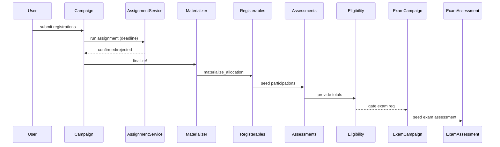

# End-to-End Workflow (Phases 0–13)

## Phase 0 — Domain & Roster Foundations
- Core domain models exist: Lecture, Tutorial, Talk, Assignment, Exam.
- Registerable models define capacity and (if roster-managed) include Rosterable (roster_user_ids, replace_roster!).
- Optional initial enrollment campaign populates the lecture roster.

## Phase 1 — Campaign-Based Registration
- Create a Registration::Campaign (assignment_mode: first_come_first_serve or preference_based).
- Create RegistrationItems (one per Tutorial, Talk, Exam session, etc.).
- Attach ordered RegistrationPolicies (exam_eligibility, prerequisite_campaign, institutional_email, etc.).
- Users submit UserRegistrations:
	- FCFS: immediate confirm/reject based on capacity.
	- Preference-based: store ranked pending registrations.

## Phase 2 — Preference-Based Allocation (If Used)
- At/after deadline, run assignment strategy (e.g., min_cost_flow).
- Service sets one confirmed Registration::UserRegistration per user (others rejected).
- Campaign transitions to processing then completed.

## Phase 3 — Allocation Materialization
- Registration::AllocationMaterializer iterates confirmed registrations per Registration::Item.
- Calls registerable.materialize_allocation!(user_ids:, campaign:) to set authoritative rosters (Tutorial: student_ids, Talk: speaker_ids).
- Idempotent: re-running with same data produces no changes.

## Phase 4 — Post-Allocation Administration
- Staff adjust rosters (swap, add, remove) via roster services.
- Adjustments do not alter historical allocation; they reflect current truth only.
- Optional sync back to Registration::UserRegistration for audit (manual_override flag).

## Phase 5 — Assessments & Grading (Pre-Exam Coursework)
- For each Assignment/Talk needing grading:
	- ensure_pointbook! (per-task points) or ensure_gradebook!.
	- Seed AssessmentParticipations from current rosters.
	- Define Tasks (if points).
	- Students (possibly teams) submit Submissions.
	- Tutors grade via GradeSubmissionService → TaskPoints fan out to all team members.
	- Recompute and publish totals.

## Phase 6 — Achievement & Eligibility Data Accumulation
- Record qualitative achievements (LectureAchievement), e.g. blackboard_explanation.
- Coursework TaskPoints stabilize; data ready for eligibility evaluation.

## Phase 7 — Exam Eligibility Computation
- Define ExamEligibilityPolicy (min_percentage, optional min_points_absolute, required achievement counts, included_assessment_types).
- Run ExamEligibilityService.compute!(lecture: L) to upsert ExamEligibilityRecords (points, percentage, computed_status, rule_details).
- Apply overrides (override_status, override_reason, override_by, override_at) where justified.

## Phase 8 — Exam Registration (Policy-Gated)
- Create exam Registration::Campaign (items may represent sessions/rooms if multiple).
- Attach Registration::Policy(kind: exam_eligibility) and any additional constraints (institutional_email, prerequisite_campaign).
- Users attempt registration; RegistrationPolicyEngine evaluates policies in order.

## Phase 9 — Exam Assessment Creation & Grading
- After exam registration closes:
	- Create Exam (or Assignment with assessment_type: exam).
	- ensure_pointbook! (and optionally ensure_gradebook!).
	- Seed participations from confirmed exam registrants (not necessarily the full lecture).
	- Define exam Tasks (problem sections).
	- Enter or import scores via grading service (submissions optional).
	- Recompute totals; optionally assign final exam grade values.
	- (Optional) Apply a grading scheme (curve) after seeing the score distribution:
		- Compute distribution (min/mean/percentiles) and show histogram in UI.
		- Instructor selects scheme (absolute cutoffs / percentile / linear scaling / piecewise).
		- Persist scheme (lightweight JSON config) and apply: populate `grade_value` for exam participations.
		- Allow manual post-application overrides (exceptional adjustments) without re-running scheme.
	- (Optional) Compute overall course grade (e.g., coursework weight + exam weight).

## Phase 10 — Late Adjustments & Recomputes
- If coursework points or achievements change before exam registration closes: recompute eligibility (full or targeted users).
- Overrides remain persistent.
- Exam grading changes affect final grade reporting but not prior eligibility.

## Phase 11 — Ongoing Administration & Reporting
- Continue roster adjustments (tutorials, talks) independent of finalized eligibility.
- Generate reports combining:
	- Registration outcomes (Registration::UserRegistration)
	- Current rosters (domain models)
	- Eligibility snapshots (ExamEligibilityRecord.rule_details)
	- Grading data (AssessmentParticipations, TaskPoints)

## Phase 12 — Integrity & Invariants
- One active ExamEligibilityPolicy per lecture.
- One ExamEligibilityRecord per (lecture, user).
- One AssessmentParticipation per (assessment, user); one TaskPoint per (participation, task).
- One confirmed Registration::UserRegistration per user per campaign.
- materialize_allocation! replaces roster in a single idempotent step.
- Policy evaluation is ordered and short-circuits on first failure.
- Eligibility excludes the exam itself (exam Assessment created only after registration).
- Overrides supersede computed eligibility until cleared.

## Phase 13 — Extension Points
- Add new eligibility rule: create new Registration::Policy.kind + evaluator method.
- Add solver strategies: plug into Registration::AssignmentService.
- Enhance exam/course grading: introduce CourseGrade aggregation service.
- Expand policy knobs: drop-lowest-k assignments, minimum published participations, weighting schemes.
- Introduce per-task submissions fully via Submittable (Assessment/Task polymorphic attachment).
- Add caching/tracing layers (policy engine trace persisted if needed).

## Chronological Summary
Campaign setup → User registrations → (Optional solver) → Allocation materialization → Administrative roster tuning → Coursework assessments graded → Achievements logged → Eligibility computed + overrides → Exam registration (policy-gated) → Exam assessment seeded & graded → Optional late recomputes (pre-exam close) → Final reporting & grade aggregation.

## Sequence Diagram (Placeholder)

## Related
Registration System (02), Allocation & Rosters (03), Assessments & Grading (04), Algorithm (07).

