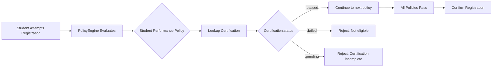
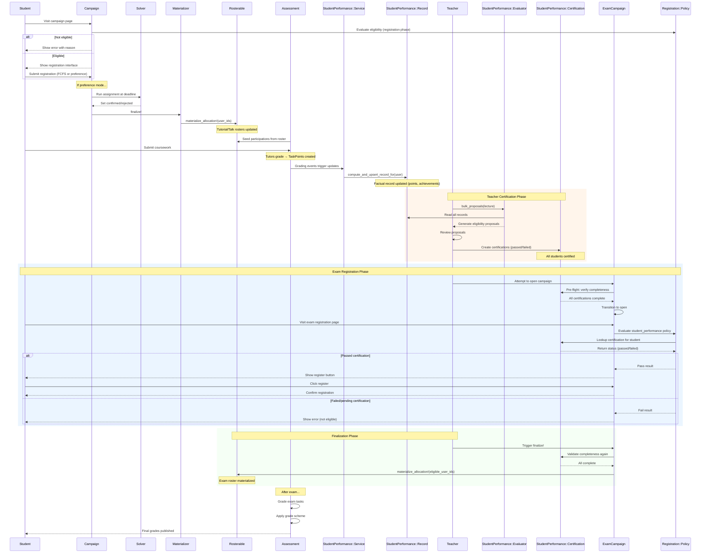

# End-to-End Workflow

This chapter walks through a complete semester lifecycle, showing how all the components from previous chapters work together in practice.

```admonish tip "Reading Guide"
Each phase below shows the **Goal**, **Key Actions**, and **Technical Flow** for that stage of the semester. Follow the phases sequentially to understand how registration flows into grading, which then feeds into eligibility and exam registration.
```

## Phase 0: Semester Setup

```admonish info "Setup Phase"
At the start of the semester, staff configures the basic teaching structure.
```

**Staff Actions:**

| Action | Details |
|--------|---------|
| Create Lecture | Set up the lecture record (e.g., "Linear Algebra WS 2024/25") |
| Create Tutorials | Define tutorial groups with times, locations, and capacities |
| (Optional) Create Talks | For seminars, define talk slots for student presentations |

## Phase 1: Tutorial/Talk Registration Campaign

```admonish success "Goal"
Assign students to tutorial groups or seminar talks
```

**Staff Actions:**

| Action | Details |
|--------|---------|
| Create Campaign | Staff creates a `Registration::Campaign` for the lecture |
| Set Mode | Choose `allocation_mode`: `first_come_first_served` or `preference_based` |
| Add Items | Create one `Registration::Item` for each tutorial or talk |
| Attach Policies | Add `Registration::Policy` records (e.g., `institutional_email`, `prerequisite_campaign`) |
| Open Campaign | Make available for student registrations (registration requests) |

**Student Experience:**

```admonish note "Two Registration Modes"
- **FCFS Mode:** Visit page, check eligibility, register if eligible (immediate confirmation/rejection)
- **Preference Mode:** Visit page, check eligibility, rank options if eligible, wait for allocation
```

**Technical Flow:**
- Eligibility check via `Campaign#evaluate_policies_for` happens when user visits the campaign page
- Ineligible users see an error message explaining the reason
- Eligible users see the registration interface (register buttons for FCFS, preference form for preference-based)
- Each registration request creates a `Registration::UserRegistration` with status `pending` (preference-based) or `confirmed/rejected` (FCFS)
- `Registration::PolicyEngine` evaluates all active policies in order during the initial eligibility check

## Phase 2: Preference-Based Allocation (if applicable)

```admonish success "Goal"
Compute optimal assignment respecting preferences and constraints
```

```admonish warning "Only for Preference-Based Campaigns"
This phase is skipped if the campaign uses `first_come_first_served` mode.
```

**Staff Actions:**
- At or after registration deadline, staff triggers `campaign.allocate_and_finalize!`
- Campaign status transitions: `open` → `closed` → `processing` → `completed`

**Technical Details:**

| Aspect | Implementation |
|--------|----------------|
| Service | `Registration::AllocationService` delegates to solver (e.g., Min-Cost Flow) |
| Cost Model | Preferences treated as costs (rank 1 = cost 1, rank 2 = cost 2, etc.) |
| Constraints | Respects capacity from `Registerable#capacity` |
| Output | One confirmed `UserRegistration` per user, rejects others |
| Idempotency | Operation can be re-run if needed with same results |

## Phase 3: Allocation Materialization

```admonish success "Goal"
Apply confirmed registrations to domain model rosters
```

**Staff Actions:**
- Staff calls `campaign.finalize!`
- `Registration::AllocationMaterializer` iterates through all `Registration::Item` records
- For each item, collects confirmed user IDs and calls `registerable.materialize_allocation!(user_ids:, campaign:)`

**Domain Effects:**

| Model | Effect |
|-------|--------|
| `Tutorial` | Student rosters updated |
| `Talk` | Speaker assignments updated |
| `Exam` | Before writing roster, eligibility is revalidated; ineligible users are excluded |
| Authority | Rosters are now the authoritative source for course operations |
| Idempotency | Same inputs produce same results (can be re-run safely) |

---

## Phase 4: Post-Allocation Roster Maintenance

```admonish success "Goal"
Handle late registrations, drops, and moves
```

**Staff Operations via `Roster::MaintenanceService`:**

| Operation | Method | Purpose |
|-----------|--------|---------|
| Transfer | `move_user!(from:, to:)` | Move student between tutorials |
| Add | `add_user!(to:)` | Add late arrival |
| Remove | `remove_user!(from:)` | Remove dropout |

```admonish note "Guardrails"
- Service enforces capacity limits (unless `allow_overfill: true`)
- All operations are transactional (atomic)
- Changes are logged for audit trail
- Operates on domain rosters directly, independent of campaign
```

## Phase 5: Coursework Assessments & Grading

```admonish success "Goal"
Track student performance on assignments and presentations
```

**Setup Flow:**

| Step | Action |
|------|--------|
| 1. Create Assessment | For each `Assignment`, create linked `Assessment::Assessment` with `requires_points: true` |
| 2. Seed Participations | Call `assessment.seed_participations_from!(user_ids: tutorial.roster_user_ids)` |
| 3. Define Tasks | Create `Assessment::Task` records for each problem/component |
| 4. Student Submission | Students upload `Submission` records (possibly as teams) |
| 5. Grading | Tutors grade via `Assessment::SubmissionGrader` |

**Grading Flow:**

```admonish note "Team Grading Fan-Out"
Service creates `Assessment::TaskPoint` for each team member automatically. Points are validated against `Task#max_points`, and `Participation#points_total` is recomputed automatically.
```

**Publication:**
- Staff publishes results by setting `assessment.results_published = true`

**For Talks (Simplified):**

| Aspect | Difference |
|--------|------------|
| Mode | `requires_points: false` (grade-only mode) |
| Seeding | Seed from talk speaker roster |
| Grading | Record final `grade_value` directly on `Assessment::Participation` |

---

## Phase 6: Achievement Tracking

```admonish success "Goal"
Record qualitative accomplishments for eligibility
```

**Staff Actions:**
- Staff creates `Achievement` records for students
- Examples: `blackboard_presentation`, `class_participation`, `peer_review`
- These augment quantitative points for eligibility determination

## Phase 7: Student Performance Materialization

```admonish success "Goal"
Materialize student performance facts for all lecture students.
```

```admonish info "Scope"
Performance data is computed for **all students enrolled in the lecture** (e.g., 150 students), not just those who plan to register. This provides transparency and legal compliance: every student can verify their eligibility status.
```

**Staff Configuration:**
- Staff configures the `StudentPerformance::Rule` for the lecture (minimum points, required achievements, etc.).
- A background job runs `StudentPerformance::Service.compute_and_upsert_all_records!(lecture)`, which populates or updates the `StudentPerformance::Record` for every student in the lecture.

**Materialized Data in `StudentPerformance::Record`:**

| Field | Content |
|-------|---------|
| `points_total` | Sum of relevant coursework points earned so far. |
| `achievements_met` | A set of `Achievement` IDs the student has earned. |
| `computed_at` | Timestamp of last factual recomputation. |
| `rule_id` | Foreign key to the `StudentPerformance::Rule` used. |

```admonish note "Factual Data Only"
The `Record` stores only raw factual data (points, achievements). It does NOT store eligibility status or interpretations. Those are determined later during teacher certification.
```

**Staff Actions:**
- Staff reviews the materialized records to verify correctness
- Staff can trigger manual recomputation if needed
- Records are ready for teacher certification (next phase)

**Staff Actions:**
- Staff reviews the materialized records to verify correctness
- Staff can trigger manual recomputation if needed
- Records are ready for teacher certification (next phase)

---

## Phase 8: Teacher Certification

```admonish success "Goal"
Teachers review materialized performance data and certify eligibility decisions for all students.
```

```admonish info "The Certification Step"
This is where human judgment enters the process. Teachers use the `StudentPerformance::Evaluator` to generate eligibility proposals, then review and certify them, creating persistent `StudentPerformance::Certification` records.
```

**Staff Workflow:**

| Step | Action | Technical Detail |
|------|--------|------------------|
| 1. Generate Proposals | Staff triggers `StudentPerformance::Evaluator.bulk_proposals(lecture)` | Creates proposals for all students based on Record + Rule |
| 2. Review Proposals | Staff reviews the **Certification Dashboard** | Shows proposed status (passed/failed) for each student |
| 3. Bulk Accept | Staff clicks "Accept All Proposals" (common case) | Creates Certification records with `status: :passed` or `:failed` |
| 4. Manual Overrides | For exceptional cases, staff manually overrides individual certifications | Sets custom status with required `note` field |
| 5. Verify Completeness | System checks all lecture students have certifications | Required before campaigns can open |

**Certification Data (`StudentPerformance::Certification`):**

| Field | Content |
|-------|---------|
| `user_id` | Foreign key to student |
| `lecture_id` | Foreign key to lecture |
| `record_id` | Foreign key to the performance Record (optional) |
| `rule_id` | Foreign key to Rule used (optional, for audit) |
| `status` | Enum: `passed`, `failed`, or `pending` |
| `note` | Teacher's note (required for manual overrides) |
| `certified_at` | Timestamp of certification |
| `certified_by_id` | Foreign key to teacher who certified |

```admonish warning "Pending Status"
Certifications with `status: :pending` are considered incomplete. Campaigns cannot open or finalize until all certifications are resolved to `passed` or `failed`.
```

**Rule Change Handling:**

```admonish note "Rule Updates After Certification"
If staff modifies the `StudentPerformance::Rule` after certifications exist:
- System shows a "Rule Changed" warning
- Staff can view diff: "12 students would change: failed → passed"
- Staff must review and re-certify affected students
- System marks old certifications as stale
```

**Recomputation Triggers:**

| Trigger | Effect |
|---------|--------|
| Grade Change | Record recomputed, Certification marked for review |
| Achievement Added | Record recomputed, Certification marked for review |
| Rule Modified | All certifications marked for review |

---

## Phase 9: Exam Registration Campaign

```admonish success "Goal"
Allow eligible students to register for the exam (FCFS).
```

```admonish info "Complete Exam Documentation"
For full details on the Exam model, see [Exam Model](05a-exam-model.md).
```

**Campaign Setup:**

| Step | Action |
|------|--------|
| 1. Create Exam | Staff creates the `Exam` record with date, location, and capacity. |
| 2. Create Campaign | Staff creates a `Registration::Campaign` for the exam. |
| 3. Attach Policy | Add a `Registration::Policy` with `kind: :student_performance`. |
| 4. Optional Policies | May also attach other policies (e.g., `institutional_email`). |
| 5. Open | The campaign opens for registrations. |

## Phase 9: Exam Registration Campaign

```admonish success "Goal"
Allow eligible students to register for the exam (FCFS).
```

```admonish info "Complete Exam Documentation"
For full details on the Exam model, see [Exam Model](05a-exam-model.md).
```

**Pre-Flight Checks:**

```admonish warning "Campaign Cannot Open Without Complete Certifications"
Before staff can transition a campaign to `open` status:
1. System verifies all lecture students have `StudentPerformance::Certification` records
2. All certifications must have `status: :passed` or `:failed` (no `pending`)
3. If checks fail, campaign opening is blocked with clear error message
```

**Campaign Setup:**

| Step | Action |
|------|--------|
| 1. Create Exam | Staff creates the `Exam` record with date, location, and capacity. |
| 2. Create Campaign | Staff creates a `Registration::Campaign` for the exam. |
| 3. Attach Policy | Add a `Registration::Policy` with `kind: :student_performance`, `phase: :registration`. |
| 4. Optional Policies | May also attach other policies (e.g., `institutional_email`). |
| 5. Pre-Flight Check | System validates certification completeness. |
| 6. Open | The campaign opens for registrations (only if pre-flight passes). |

**Student Experience:**
- Students see their eligibility status based on their `Certification.status`
- Only students with `status: :passed` certifications can successfully register
- Registration is first-come-first-served until capacity is reached
- Students receive immediate confirmation or rejection with a reason

**Registration Flow:**



```admonish tip "No Runtime Recomputation"
Unlike the old approach, the registration flow does NOT trigger any recomputation. It simply looks up the pre-existing `Certification` record and checks its status. This ensures consistency and prevents race conditions.
```

**After Registration Phase:**
- Campaign remains `open` while students register
- When registration deadline is reached, staff calls `campaign.close!`
- Campaign transitions to `processing` status
- Staff then proceeds to finalization (Phase 10)

**After Registration Phase:**
- Campaign remains `open` while students register
- When registration deadline is reached, staff calls `campaign.close!`
- Campaign transitions to `processing` status
- Staff then proceeds to finalization (Phase 10)

---

## Phase 10: Exam Registration Finalization

```admonish success "Goal"
Materialize confirmed exam registrations to the exam roster.
```

**Pre-Finalization Checks:**

```admonish warning "Finalization Requires Complete Certifications"
Before staff can finalize the campaign:
1. System re-validates that all lecture students have certifications
2. All certifications must still be `passed` or `failed` (no `pending`)
3. System checks if any certifications are marked as stale (due to rule changes or record updates)
4. If any issues exist, finalization is blocked with a remediation prompt
```

**Remediation Workflow:**

| Issue | Resolution |
|-------|-----------|
| Pending Certifications | Staff must resolve to `passed` or `failed` |
| Stale Certifications | Staff must review and re-certify affected students |
| Missing Certifications | System auto-generates proposals, staff must certify |

**Finalization Process:**

| Step | Action |
|------|--------|
| 1. Validation | System runs pre-finalization checks |
| 2. Eligibility Filter | Only confirmed registrants with `Certification.status: :passed` are included |
| 3. Materialization | Calls `exam.materialize_allocation!(user_ids:, campaign:)` |
| 4. Status Update | Campaign transitions to `completed` |

**Post-Finalization State:**
- **Exam Roster** now contains subset of eligible students who registered (e.g., 85 of 126 eligible)
- Staff views **Exam Roster** screen to manage participants
- Roster is ready for exam administration (room assignments, grading)

```admonish warning "Two Distinct Lists"
- **Certification Dashboard** (Phase 8): All 150 lecture students with eligibility status
- **Exam Roster** (Phase 10+): Only 85 registered students who will take the exam

The roster is used for exam administration, while certifications remain for audit/legal purposes.
```

---

## Phase 11: Exam Grading & Grade Schemes

```admonish success "Goal"
Record exam scores and assign final grades
```

**Grading Setup:**

| Step | Action |
|------|--------|
| 1. Create Assessment | After exam is administered, create `Assessment::Assessment` for the exam |
| 2. Seed Participations | From confirmed exam registrants |
| 3. Define Tasks | Create `Assessment::Task` records for each exam problem |
| 4. Enter Points | Tutors enter points via grading interface |
| 5. Aggregate | Points aggregate to `Participation#points_total` |

**Grade Scheme Application:**

```admonish note "Converting Points to Grades"
Staff analyzes score distribution (histogram, percentiles), then creates and applies a `GradeScheme::Scheme`.
```

| Step | Process |
|------|---------|
| Analyze | View distribution statistics and histogram |
| Configure | Create `GradeScheme::Scheme` with absolute point bands or percentage cutoffs |
| Apply | Call `GradeScheme::Applier.apply!(scheme)` |
| Result | Service computes `grade_value` for each participation based on points |
| Override | Manual adjustments possible for exceptional cases |

```admonish note "Multiple Choice Exam Extension"
For exams with multiple choice components requiring legal compliance, see the [Multiple Choice Exams](05c-multiple-choice-exams.md) chapter for the two-stage grading workflow.
```

**Final Result:**
- Students have both granular points (`TaskPoint` records) and final grade (`Participation#grade_value`)

---

## Phase 11: Exam Grading & Grade Schemes

```admonish success "Goal"
Record exam scores and assign final grades
```

**Grading Setup:**

| Step | Action |
|------|--------|
| 1. Create Assessment | After exam is administered, create `Assessment::Assessment` for the exam |
| 2. Seed Participations | From confirmed exam registrants |
| 3. Define Tasks | Create `Assessment::Task` records for each exam problem |
| 4. Enter Points | Tutors enter points via grading interface |
| 5. Aggregate | Points aggregate to `Participation#points_total` |

**Grade Scheme Application:**

```admonish note "Converting Points to Grades"
Staff analyzes score distribution (histogram, percentiles), then creates and applies a `GradeScheme::Scheme`.
```

| Step | Process |
|------|---------|
| Analyze | View distribution statistics and histogram |
| Configure | Create `GradeScheme::Scheme` with absolute point bands or percentage cutoffs |
| Apply | Call `GradeScheme::Applier.apply!(scheme)` |
| Result | Service computes `grade_value` for each participation based on points |
| Override | Manual adjustments possible for exceptional cases |

```admonish note "Multiple Choice Exam Extension"
For exams with multiple choice components requiring legal compliance, see the [Multiple Choice Exams](05c-multiple-choice-exams.md) chapter for the two-stage grading workflow.
```

**Final Result:**
- Students have both granular points (`TaskPoint` records) and final grade (`Participation#grade_value`)

---

## Phase 12: Late Adjustments & Recomputation

```admonish warning "Scenario"
A student's coursework grade changes after the initial bulk computation.
```

**System Response:**

| Trigger | Action |
|---------|--------|
| Grade Change | The system automatically triggers `StudentPerformance::Service.compute_and_upsert_record_for(user)`. |
| Update | The factual data (`points_total`, `achievements_met`) in the student's `StudentPerformance::Record` is updated. |
| Preserve | Any manual `override_status` on the record remains untouched. |
| Effect | The next time the student's eligibility is checked (e.g., on the overview screen or during an exam registration attempt), the `Evaluator` will use the new factual data, providing an up-to-date status. |

---

## Phase 12: Late Adjustments & Recomputation

```admonish warning "Scenario"
A student's coursework grade changes after certifications have been created.
```

**System Response:**

| Trigger | Action |
|---------|--------|
| Grade Change | The system automatically triggers `StudentPerformance::Service.compute_and_upsert_record_for(user)`. |
| Update | The factual data (`points_total`, `achievements_met`) in the student's `StudentPerformance::Record` is updated. |
| Mark Stale | The associated `Certification` is marked for review (e.g., `needs_review: true` flag). |
| Notify | System alerts staff that certifications need re-review. |
| Re-Certify | Staff must review and re-certify before any new campaigns can open. |

```admonish note "Certification Stability"
Once a certification is created, it remains valid until explicitly updated by staff, even if the underlying Record changes. This ensures consistency during active registration campaigns.
```

---

## Phase 13: Reporting & Administration

```admonish success "Goal"
Ongoing monitoring and data integrity
```

**Ongoing Activities:**

| Activity | Source |
|----------|--------|
| Participation Reports | `Assessment::Participation` data |
| Eligibility Export | `StudentPerformance::Record` |
| Registration Audit | `Registration::UserRegistration` |
| Roster Adjustments | `Roster::MaintenanceService` as needed |
| Data Integrity | Background jobs monitoring consistency |

---

## Key Invariants Throughout the Workflow

```admonish warning "System Constraints"
These constraints are maintained across all phases to ensure data integrity.
```

---

## Phase 13: Reporting & Administration

```admonish success "Goal"
Ongoing monitoring and data integrity
```

**Ongoing Activities:**

| Activity | Source |
|----------|--------|
| Participation Reports | `Assessment::Participation` data |
| Eligibility Export | `StudentPerformance::Certification` |
| Registration Audit | `Registration::UserRegistration` |
| Roster Adjustments | `Roster::MaintenanceService` as needed |
| Data Integrity | Background jobs monitoring consistency |

---

## Key Invariants Throughout the Workflow

```admonish warning "System Constraints"
These constraints are maintained across all phases to ensure data integrity.
```

| Invariant | Description |
|-----------|-------------|
| One Record per (lecture, user) | `StudentPerformance::Record` uniqueness. |
| One Certification per (lecture, user) | `StudentPerformance::Certification` uniqueness. |
| One Participation per (assessment, user) | `Assessment::Participation` uniqueness. |
| One Confirmed Registration per (user, campaign) | `Registration::UserRegistration` constraint. |
| One TaskPoint per (participation, task) | `Assessment::TaskPoint` uniqueness. |
| Idempotent Materialization | `materialize_allocation!` produces the same results with the same inputs. |
| Ordered Policy Evaluation | Short-circuits on the first failure. |
| Certification Completeness | Campaigns cannot open or finalize without complete, non-pending certifications. |
| Certification Stability | Existing certifications remain valid until explicitly updated by staff. |
| Phase-Aware Policies | Only policies matching the current phase are evaluated. |
| Exam Assessment Timing | Created only after exam registration closes. |

---

## Chronological Summary

```admonish tip "High-Level Flow"
A bird's-eye view of the complete workflow from setup to final grades.
```

| Phase | Summary |
|-------|---------|
| **Setup** | Create domain models → Configure registrables & rosters |
| **Registration** | Open campaign → Students register → (Optional: Run solver) → Materialize to rosters |
| **Coursework** | Seed participations → Define tasks → Students submit → Tutors grade → Publish results |
| **Performance** | Record achievements → Compute performance records |
| **Certification** | Generate proposals → Teachers review → Create certifications → Verify completeness |
| **Exam Registration** | Pre-flight checks → Open campaign → Students register → Close campaign |
| **Finalization** | Validate certifications → Materialize to exam roster → Complete campaign |
| **Exam Grading** | Seed exam participations → Grade tasks → Apply grade scheme → Publish grades |
| **Ongoing** | Maintain rosters → Update grades → Recompute records → Re-certify as needed |

---

## Sequence Diagram




