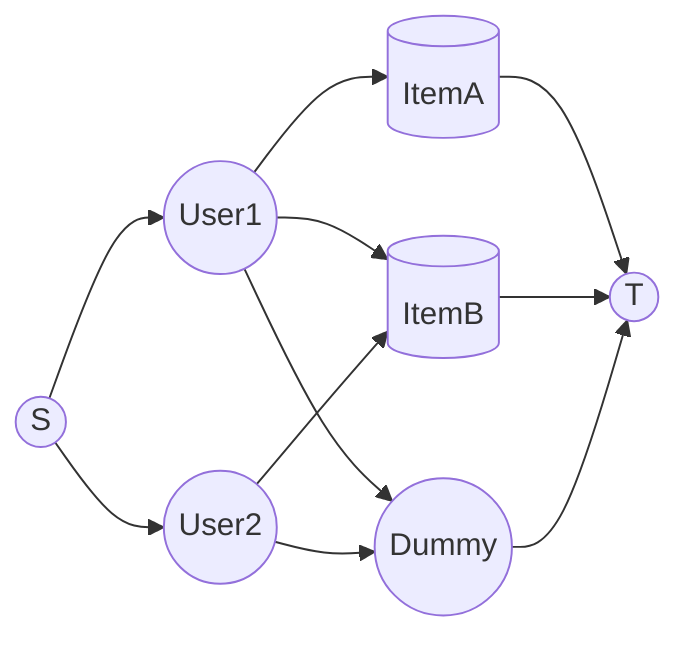

# Allocation Algorithm Details

## Purpose
This chapter details the algorithm for allocating users to `Registration::Item`s (tutorials, talks, etc.) based on ranked preferences while respecting item capacities.

The initial implementation uses a **Min-Cost Flow** algorithm for its speed and simplicity. The system is designed with a pluggable service interface, allowing a more powerful **CP-SAT** solver to be used in the future when advanced constraints are needed.

---

## The Strategy Pattern Approach

The system uses a **Strategy Pattern** to separate the high-level allocation process from the low-level solver implementation. A single service entry point is exposed:

```ruby
Registration::AllocationService.new(campaign, strategy: :min_cost_flow).allocate!
```

This allows different solver strategies to be added (e.g., `strategy: :cp_sat`) without changing any calling code.

```admonish info "Why Start With Min-Cost Flow?"
- **Fast and Simple:** It has very low model-building overhead and is extremely fast for bipartite assignment problems with linear costs.
- **Good Fit:** It perfectly matches the current requirements of the system.
- **Debuggable:** The underlying graph model is transparent and easier to debug operationally.
```

```admonish tip "When To Migrate / Offer CP-SAT"
A CP-SAT solver should be implemented if any of the following advanced constraints are needed:

- **Fairness Tiers:** Lexicographic minimization (e.g., first minimize unassigned users, then minimize users with their 2nd choice, etc.).
- **Mutual Exclusion:** A user cannot be assigned to two simultaneous events.
- **Group Assignment:** Two or more users must be assigned to the same item.
- **Soft Constraints:** Complex penalties for time-of-day, instructor preference, etc.
- **Quotas:** Diversity constraints or per-track limits.
```

---

## Performance

Typical wall time for a campaign with 1,000 users, 50 items, and 3–10 preferences each:

| Solver                       | Build + Solve Time | Notes                                  |
|------------------------------|--------------------|----------------------------------------|
| SimpleMinCostFlow            | ~1–5 ms            | Very stable, scales well.              |
| CP-SAT (simple model)        | ~15–60 ms          | Solver overhead dominates; power unused. |
| CP-SAT (complex constraints) | ~50–300 ms         | Still acceptable for background jobs.  |

**Conclusion:** Min-Cost Flow is more than sufficient for the initial scope and scales well. Even with 10,000 users, it remains sub-second.

---

## Modeling Details (Min-Cost Flow)

### Graph Components
- **Source (S):** The starting point for all "flow" (users).
- **User Nodes (U):** One node for each participating user.
- **Item Nodes (I):** One node for each available `Registration::Item`.
- **Dummy Node (D):** An optional node representing the "unassigned" state.
- **Sink (T):** The final destination for all flow.

### Graph Arcs (Edges)
- **`S → u`**: For each user `u`, an arc with capacity 1 and cost 0.
- **`u → i`**: For each stated preference, an arc from user `u` to item `i` with capacity 1 and cost equal to the `preference_rank`.
- **`i → T`**: For each item `i`, an arc with capacity equal to `item.capacity` and cost 0.
- **`u → D`**: (If allowing unassigned) An arc from each user `u` to the dummy node `D` with capacity 1 and a high penalty cost.
- **`D → T`**: (If allowing unassigned) An arc from `D` to `T` with capacity equal to the total number of users.

This model guarantees that exactly one unit of flow per user leaves the source, ensuring each user is assigned to at most one real item.

### Cost Calibration
- **Preference Rank:** The cost is the rank itself (1, 2, 3...).
- **Fallback Cost:** For "fill unlisted items" mode, the cost is `max_rank + 2`.
- **Penalty Cost:** The cost for the "unassigned" dummy path is a large constant (e.g., `10_000`) to ensure it's only used as a last resort.

```admonish warning "Failure Modes"
With the dummy node enabled, the model should always find a feasible solution. A failure would only occur due to an internal solver error or corrupted input data (e.g., negative capacities).
```

---

### Unassigned semantics and defaults

- Defaults we use in tutorial campaigns:
    - `fill_unlisted: true` at campaign level, no per-student opt-in. This adds edges from each user to all eligible, unranked items at cost `max_rank + 2`, ensuring a high chance of receiving a seat even beyond the ranked list.
    - `allow_unassigned: true` with a large dummy penalty. This guarantees feasibility; the dummy path is used only if every eligible item is saturated.
- After allocation and upon close-out/finalization, any remaining `pending` registrations must be normalized to `rejected`. A user is considered "assigned" if they have exactly one `confirmed` registration in the campaign; otherwise they are "unassigned".
- The "unassigned" cohort is derived data: users who participated in the campaign but ended up with no `confirmed` registration. No extra tables are required.

## Service Implementation (Strategy Pattern Skeleton)

```ruby
# filepath: app/services/registration/allocation_service.rb
module Registration
    class AllocationService
        def initialize(campaign, strategy: :min_cost_flow, **opts)
            @campaign = campaign
            @strategy = strategy
            @opts = opts
        end

    def allocate!
            solver =
                case @strategy
                when :min_cost_flow
                    Registration::Solvers::MinCostFlow.new(@campaign, **@opts)
                # when :cp_sat then Registration::Solvers::CpSat.new(@campaign, **@opts)
                else
                    raise ArgumentError, "Unknown strategy #{@strategy}"
                end
            solver.run
        end
    end
end

# Solvers are placed in their own module for organization.
module Registration
    module Solvers
    class MinCostFlow
            BIG_PENALTY = 10_000

            def initialize(campaign, fill_unlisted: false, allow_unassigned: true)
                @campaign = campaign
                @fill_unlisted = fill_unlisted
                @allow_unassigned = allow_unassigned
                @prefs = campaign.user_registrations.where.not(preference_rank: nil)
                                                                                        .includes(:registration_item)
                @users = @prefs.map(&:user_id).uniq
                @items = campaign.registration_items.includes(:registerable)
                @prefs_by_user = @prefs.group_by(&:user_id)
                @max_rank = (@prefs.map(&:preference_rank).max || 1)
                @fallback_cost = @max_rank + 2
            end

            def run
                return finalize_empty if @users.empty?
                build_and_solve
            end

            private

            def finalize_empty
                @campaign.update!(status: 'completed')
            end

            def build_and_solve
                mcf = ORTools::SimpleMinCostFlow.new

                source = 0
                user_offset = 1
                item_offset = user_offset + @users.size
                sink_real = item_offset + @items.size
                dummy_node = sink_real + 1 if @allow_unassigned
                sink_final = @allow_unassigned ? dummy_node + 1 : sink_real

                idx_user = {}
                idx_item = {}

                @users.each_with_index { |uid, i| idx_user[uid] = user_offset + i }
                @items.each_with_index { |item, i| idx_item[item.id] = item_offset + i }

                mcf.set_node_supply(source, @users.size)
                mcf.set_node_supply(sink_final, -@users.size)
                (user_offset...item_offset).each { |n| mcf.set_node_supply(n, 0) }
                (item_offset...sink_real).each { |n| mcf.set_node_supply(n, 0) }
                if @allow_unassigned
                    mcf.set_node_supply(sink_real, 0)
                    mcf.set_node_supply(dummy_node, 0)
                end

                @users.each do |uid|
                    mcf.add_arc_with_capacity_and_unit_cost(source, idx_user[uid], 1, 0)
                end

                @prefs.each do |reg|
                    mcf.add_arc_with_capacity_and_unit_cost(
                        idx_user[reg.user_id],
                        idx_item[reg.registration_item_id],
                        1,
                        reg.preference_rank.to_i <= 0 ? 1 : reg.preference_rank.to_i
                    )
                end

                if @fill_unlisted
                    @users.each do |uid|
                        listed = (@prefs_by_user[uid] || []).map(&:registration_item_id)
                        (@items.map(&:id) - listed).each do |iid|
                            mcf.add_arc_with_capacity_and_unit_cost(
                                idx_user[uid],
                                idx_item[iid],
                                1,
                                @fallback_cost
                            )
                        end
                    end
                end

                @items.each do |item|
                    cap = [item.registerable.capacity.to_i, 0].max
                    mcf.add_arc_with_capacity_and_unit_cost(
                        idx_item[item.id],
                        (@allow_unassigned ? sink_real : sink_final),
                        cap,
                        0
                    )
                end

                if @allow_unassigned
                    mcf.add_arc_with_capacity_and_unit_cost(dummy_node, sink_final, @users.size, 0)
                    @users.each do |uid|
                        mcf.add_arc_with_capacity_and_unit_cost(idx_user[uid], dummy_node, 1, BIG_PENALTY)
                    end
                end

                status = mcf.solve
                return fail_solver unless status == ORTools::SimpleMinCostFlow::OPTIMAL

                apply_solution(mcf, idx_user, idx_item, dummy_node)
            end
        end
    end
end
```

## Graph Diagram (Placeholder)



