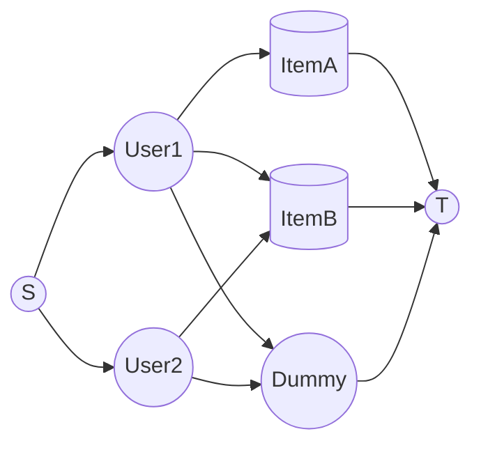

# Assignment Algorithm Details

# Preference-Based Assignment Algorithm

## Purpose
Assign users to RegistrationItems (tutorials, talks, etc.) based on ranked preferences while respecting item capacities. Initial implementation uses OR-Tools SimpleMinCostFlow for speed and simplicity. We keep a pluggable service interface so we can later swap in a CP-SAT–based solver when advanced constraints are needed.

## Core Requirements (Current Scope)
- Each user is assigned to at most one real item.
- Respect item capacities.
- Minimize total sum of (preference_rank) across assigned users.
- Allow users to remain unassigned if capacity is insufficient.
- (Configurable later) Optionally fill leftover capacity with users’ non-listed items.

## Solver Abstraction
We expose a single service entrypoint:
RegistrationAssignmentService.new(campaign, strategy: :min_cost_flow).assign!
Later a CP-SAT strategy can be added (strategy: :cp_sat) without changing callers.

## Why Start With Min-Cost Flow
- Very small model build overhead.
- Deterministic, extremely fast for bipartite assignment with linear additive costs.
- Fits current constraints exactly.
- Easier operational debugging (arc list is transparent).

## When To Migrate / Offer CP-SAT
Adopt CP-SAT if you need any of:
- Fairness tiers (lexicographic minimization: minimize unassigned, then rank>1 users, etc.).
- Time overlap / mutual exclusion (cannot attend two simultaneous tutorials).
- Group or paired assignment (two users must share an item).
- Soft constraints (penalties for time-of-day, instructor, etc.).
- Quotas / diversity / per-track limits.
- Multi-round or staged capacity release.
Min-Cost Flow cannot natively express those without complex graph gadgets; CP-SAT adds them directly.

## Performance (Typical Wall Time: 1000 Users / 50 Items / 3–10 Preferences Each)
| Solver | Build + Solve | Notes |
|--------|---------------|-------|
| SimpleMinCostFlow | ~1–5 ms | Very stable, O(E * log V) practical |
| CP-SAT (same simple model) | ~15–60 ms | Overhead dominates; power unused |
| CP-SAT (with extra fairness/constraints) | ~50–300 ms | Still acceptable for background jobs |

Scaling rule: Even 10k users × 100 items (<= 1M preference edges) stays sub‑second for MinCostFlow; CP-SAT remains under a few seconds unless heavily constrained.

## Modeling Details (Min-Cost Flow)

### Graph
- Source S
- User nodes U
- Item nodes I
- (Optional) Dummy node D (represents “unassigned”)
- Sink T

### Edges
- S → u (cap 1, cost 0)
- u → i for each stated preference (cap 1, cost = preference_rank)
- i → T (cap = capacity_i, cost 0)
- If allowing unassigned: u → D (cap 1, cost = BIG_PENALTY), D → T (cap = |U|)
- (Optional fill mode) u → any unlisted item with fallback_cost > max_rank

Result: Exactly one unit of flow per user leaves S; it either reaches a real item (assigned) or dummy (unassigned). “At most one real assignment” is thus enforced.

### Cost Calibration
- rank r as-is (1,2,3…).
- fallback_cost = max_rank + 2 (if fill mode on).
- BIG_PENALTY (dummy) = a large constant (e.g. 10_000) >> fallback_cost to ensure dummy only used when all cheaper options blocked.

## Failure Modes
With dummy enabled and every user having at least one outgoing arc, infeasibility should not occur. Fail only on internal solver error or corrupt data (negative capacities).

## Service Implementation (Strategy Pattern Skeleton)

```ruby
# filepath: app/services/registration_assignment_service.rb
class RegistrationAssignmentService
	def initialize(campaign, strategy: :min_cost_flow, **opts)
		@campaign = campaign
		@strategy = strategy
		@opts = opts
	end

	def assign!
		solver =
			case @strategy
			when :min_cost_flow then MinCostFlowAssignment.new(@campaign, **@opts)
			# when :cp_sat then CPSatAssignment.new(@campaign, **@opts)  # future
			else
				raise ArgumentError, "Unknown strategy #{@strategy}"
			end
		solver.run
	end
end

class MinCostFlowAssignment
	BIG_PENALTY = 10_000

	def initialize(campaign, fill_unlisted: false, allow_unassigned: true)
		@campaign = campaign
		@fill_unlisted = fill_unlisted
		@allow_unassigned = allow_unassigned
		@prefs = campaign.user_registrations.where.not(preference_rank: nil)
												.includes(:registration_item)
		@users = @prefs.map(&:user_id).uniq
		@items = campaign.registration_items.includes(:registerable)
		@prefs_by_user = @prefs.group_by(&:user_id)
		@max_rank = (@prefs.map(&:preference_rank).max || 1)
		@fallback_cost = @max_rank + 2
	end

	def run
		return finalize_empty if @users.empty?
		build_and_solve
	end

	private

	def finalize_empty
		@campaign.update!(status: 'completed')
	end

	def build_and_solve
		mcf = ORTools::SimpleMinCostFlow.new

		source = 0
		user_offset = 1
		item_offset = user_offset + @users.size
		sink_real = item_offset + @items.size
		dummy_node = sink_real + 1 if @allow_unassigned
		sink_final = @allow_unassigned ? dummy_node + 1 : sink_real

		idx_user = {}
		idx_item = {}

		@users.each_with_index { |uid, i| idx_user[uid] = user_offset + i }
		@items.each_with_index { |item, i| idx_item[item.id] = item_offset + i }

		# Supplies
		mcf.set_node_supply(source, @users.size)
		mcf.set_node_supply(sink_final, -@users.size)
		(user_offset...item_offset).each { |n| mcf.set_node_supply(n, 0) }
		(item_offset...sink_real).each { |n| mcf.set_node_supply(n, 0) }
		if @allow_unassigned
			mcf.set_node_supply(sink_real, 0)
			mcf.set_node_supply(dummy_node, 0)
		end

		# Source -> users
		@users.each do |uid|
			mcf.add_arc_with_capacity_and_unit_cost(source, idx_user[uid], 1, 0)
		end

		# Preferences
		@prefs.each do |reg|
			mcf.add_arc_with_capacity_and_unit_cost(
				idx_user[reg.user_id],
				idx_item[reg.registration_item_id],
				1,
				reg.preference_rank.to_i <= 0 ? 1 : reg.preference_rank.to_i
			)
		end

		# Optional fallback edges
		if @fill_unlisted
			@users.each do |uid|
				listed = (@prefs_by_user[uid] || []).map(&:registration_item_id)
				(@items.map(&:id) - listed).each do |iid|
					mcf.add_arc_with_capacity_and_unit_cost(
						idx_user[uid],
						idx_item[iid],
						1,
						@fallback_cost
					)
				end
			end
		end

		# Items -> sink_real (or sink_final if no dummy)
		@items.each do |item|
			cap = [item.registerable.capacity.to_i, 0].max
			mcf.add_arc_with_capacity_and_unit_cost(
				idx_item[item.id],
				(@allow_unassigned ? sink_real : sink_final),
				cap,
				0
			)
		end

		if @allow_unassigned
			# Dummy path
			mcf.add_arc_with_capacity_and_unit_cost(dummy_node, sink_final, @users.size, 0)
			@users.each do |uid|
				mcf.add_arc_with_capacity_and_unit_cost(idx_user[uid], dummy_node, 1, BIG_PENALTY)
			end
		end

		status = mcf.solve
		return fail_solver unless status == ORTools::SimpleMinCostFlow::OPTIMAL

		apply_solution(mcf, idx_user, idx_item, dummy_node)
	end
```

## Graph Diagram (Placeholder)



