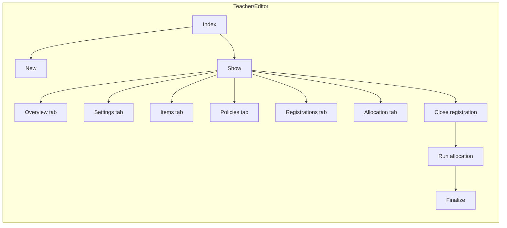
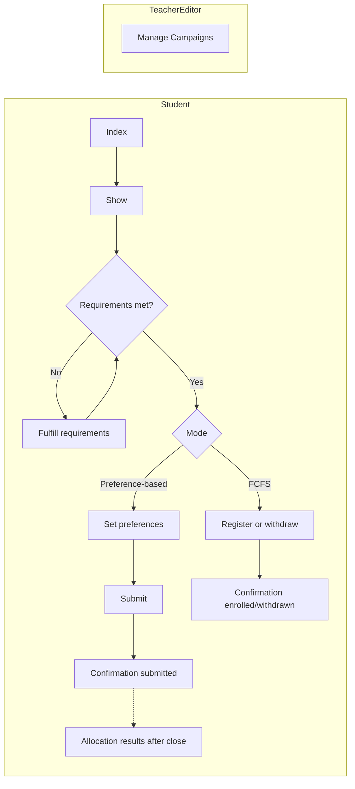
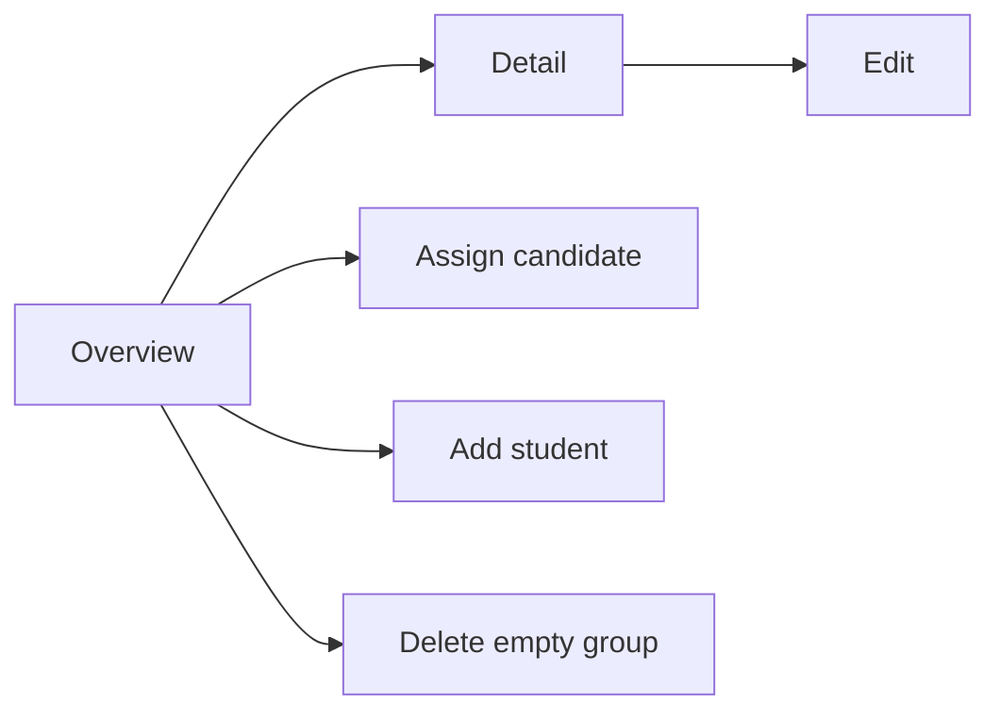
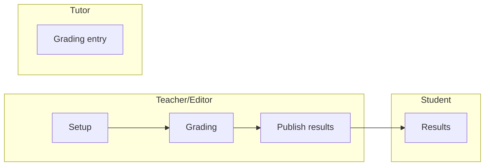
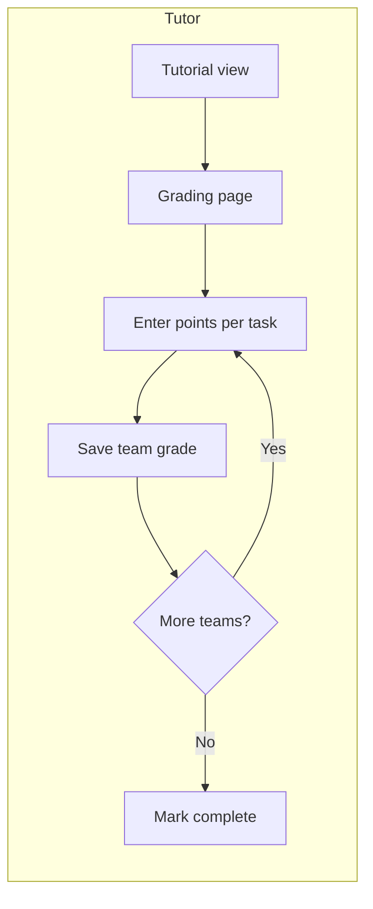
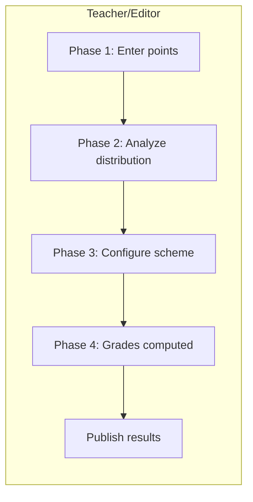
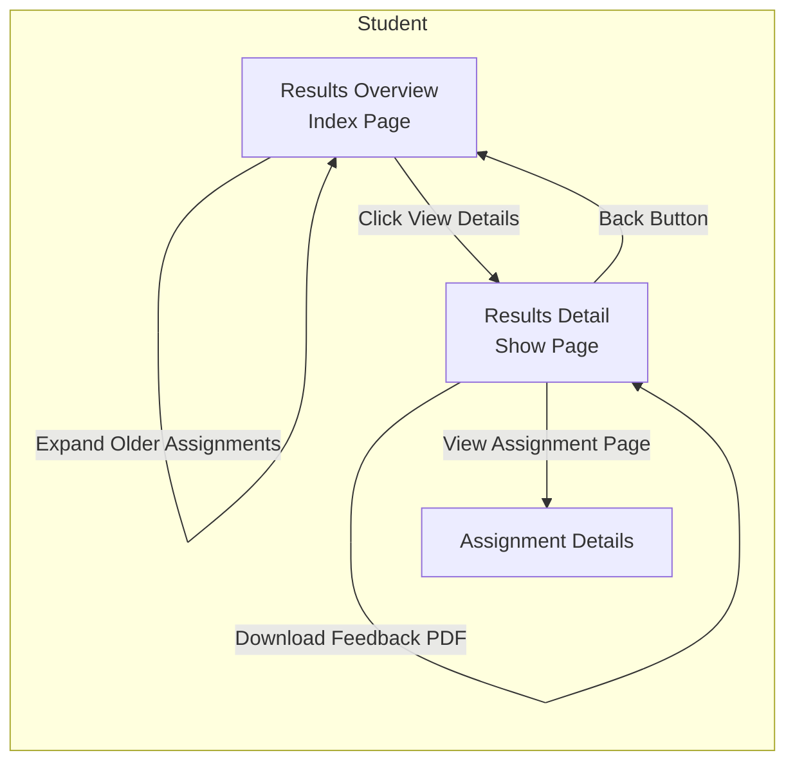
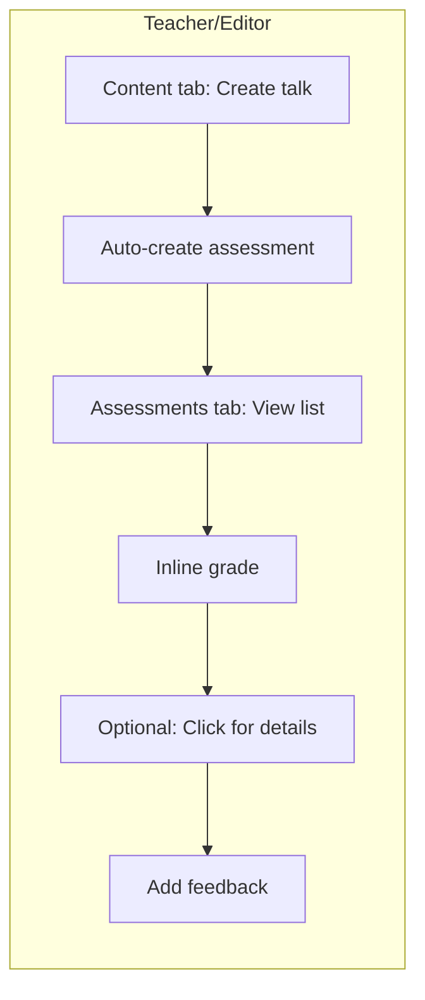
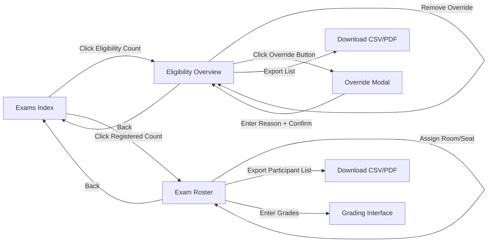

# View Architecture

This chapter outlines view conventions and examples for the MÜSLI integration. It pairs with the Controller Architecture chapter and focuses on HTML ERB views, Hotwire (Turbo Frames/Streams), and ViewComponents usage.

```admonish tip "How to read this chapter"
This chapter specifies view conventions and key screens by feature area.
It complements Controllers: prefer HTML + Turbo (Frames/Streams) with
server-rendered ERB and minimal JS via Stimulus.
```

### At a glance

| Area         | Key views/components                                 | Primary callers                     |
|--------------|-------------------------------------------------------|-------------------------------------|
| Registration | Campaigns (index/show/forms), Student Registration    | Teacher/Editor UI, Student UI       |
| Roster       | Maintenance (index/show/edit)                         | Teacher/Editor UI                   |
| Assessment   | Assessments (CRUD), Grading table, Grade schemes, Participations | Teacher/Editor UI, Tutor UI, Student|
| Exam         | Exams (CRUD), Eligibility table                       | Teacher/Editor UI                   |
| Dashboard    | Student dashboard, Teacher/Editor dashboard           | Student UI, Teacher/Editor UI       |

The feature sections below (Registration Screens, Rosters, Assessments,
Exams & Eligibility, Grade Schemes) include two tables:
- A Screens table to summarize each screen's purpose, main UI parts,
  and interaction model at a glance. It helps designers and developers
  align on scope and Hotwire usage, and links to static mockups when
  available.
- A Controller/action mapping table to tie those screens to concrete
  Rails endpoints and roles. It clarifies routing, authorization, and
  which actions are invoked from each screen.
The following keys apply:

```admonish info "Table keys (all sections)"
Screens tables:
- View: page/screen name.
- Key elements: main UI parts.
- Hotwire: Frames/Streams used on this screen (when listed).
- Mockup: link to static HTML when available.

Mapping tables:
- View: the screen the row refers to (links to mockup if present).
- Role: actor (Teacher/Editor, Tutor, Student) when access differs.
- Controller: Rails controller handling the request.
- Actions: controller actions called from the view.
- Scope/Notes: brief intent or constraints.
```

## Conventions

- Templates: ERB (`.html.erb`).
- Components: ViewComponents in `app/frontend/_components/` or feature folders.
- Hotwire: Frames vs Streams choice is deferred; decide per screen later.
- Stimulus: Use `.controller.js` suffix; colocate with feature folder under `app/frontend/`.
- Styling: SCSS; colocate per feature when practical.

 

## Partials vs ViewComponents

```admonish tip "Decision guide"
Start simple. Use a partial first. Promote to a ViewComponent when the
fragment becomes reusable, complex, or needs its own tests/JS/styles.
```

| Use a partial when...                               | Use a ViewComponent when...                             |
|-----------------------------------------------------|---------------------------------------------------------|
| It is local to a single page/feature                | It is reused across pages/features                      |
| Presentation-only, minimal branching                | Encapsulates logic/variants/states                      |
| Small fragment (row, cell, inline form field)       | Owns JS/CSS (Stimulus) or wraps a reusable Frame        |
| Minimal/no Stimulus behavior                        | Needs a stable API (kwargs/slots)                       |
| No dedicated unit tests needed                      | Deserves unit tests and composition via slots           |
| No caching/memoization required                     | Will benefit from caching/memoization                   |

```admonish tip "Turbo in views"
Both partials and components can live inside Turbo Frames. If background
jobs will stream updates to the same fragment in several contexts, prefer
a component and render it from stream templates. For one-off stream
responses, a partial is fine.
```

```admonish example "Placement & API"
Partials: colocate near the parent view (e.g.,
`app/frontend/registration/.../_row.html.erb`) and pass explicit locals.

ViewComponents: place in `app/frontend/_components/` or feature-specific
folders. Prefer keyword args and slots for a clear contract.
```

```admonish info "Migration path"
Extract a growing partial into a ViewComponent without changing callers.
Keep the component API narrow and clear via initializer and slots.
```

## Layout & Partials

- Use partials for reusable fragments (tables, forms, flash bars).
- Extract repeated frame shells (table headers, pagination) into partials.
- Keep forms server-rendered; augment with Stimulus when needed.

## Mockups

```admonish example "Mockups"
Preview static screens while wiring controllers and models. Mockup
links also appear in the per-feature tables below. All mockups are
styled with Bootstrap 5 (via CDN) to match the app's component library
for faster transfer from mockup to real views.

Yellow underlined rows in tables visualize an inline edit state of the
preceding white row. Mockups may show both side-by-side to illustrate
the edit UI; in the real UI, only one would be visible at a time.

```

## Registration Screens


### Campaigns (Teacher/Editor)

#### Screens

See Table keys above for column meanings.

```admonish tip "Settings live in Show"
All campaign settings are edited inline on the Show page via the
Settings tab. There is no separate Settings page.
```

```admonish note
When a campaign is completed, the Settings tab is read-only. The
"Planning-only" option is visible but disabled. In Draft/Open, the
"Planning-only" option can be toggled; enabling it hides finalization
paths in the UI (Allocation/Finalize).
```

| View   | Key elements                                          | Mockup |
|--------|--------------------------------------------------------|--------|
| Index (Lecture) | Minimal table for a single lecture; status chips       | [Mockup](../mockups/campaigns_index.html) |
| Index (Current term, grouped) | Grouped by lecture for the teacher/editor; no search needed | [Mockup](../mockups/campaigns_index_current_term.html) |
| Show (Exam – FCFS) | Summary panel; tabs: Overview, Settings, Items, Policies, Registrations, Allocation; FCFS shows eligibility | [Mockup](../mockups/campaigns_show_exam.html) |
| Show (Tutorials – FCFS, open) | Summary panel; tabs: Overview, Settings, Items, Policies, Registrations, Allocation; FCFS shows eligibility | [Mockup](../mockups/campaigns_show_tutorial_fcfs_open.html) |
| Show (Tutorials – preference-based, open) | Summary panel; tabs: Overview, Settings, Items, Policies, Registrations, Allocation; preference-based shows preferences | [Mockup](../mockups/campaigns_show_tutorial_open.html) |
| Show (Tutorials – preference-based, completed) | Summary panel; tabs: Overview, Settings, Items, Policies, Registrations, Allocation; preference-based shows preferences | [Mockup](../mockups/campaigns_show_tutorial.html) |
| Show (Interest – draft) | Summary panel; tabs: Overview, Settings, Items, Policies, Registrations, Allocation | [Mockup](../mockups/campaigns_show_interest_draft.html) |
| Forms (Items & Policies tabs) | Inline create/edit for items and policies              | See Show mockups (tabs) |


#### Flow



#### Controller and actions mapping (teacher/editor)
| Surface/Control                 | Controller                                                                             | Action(s)                               | Preconditions                         | Notes |
|---------------------------------|----------------------------------------------------------------------------------------|-----------------------------------------|---------------------------------------|-------|
| Index                           | [Registration::CampaignsController](11-controllers.md#registration-controllers)        | index                                   | —                                     | List campaigns for a lecture |
| Show                            | [Registration::CampaignsController](11-controllers.md#registration-controllers)        | show                                    | —                                     | Overview with tabs |
| New/Edit/Delete (campaign)      | [Registration::CampaignsController](11-controllers.md#registration-controllers)        | new, create, edit, update, destroy      | Destroy only if no registrations      | Manage metadata and dates |
| Open registration               | [Registration::CampaignsController](11-controllers.md#registration-controllers)        | open                                    | Draft only                            | Status: draft → open |
| Close registration              | [Registration::CampaignsController](11-controllers.md#registration-controllers)        | close                                   | Open only                             | Stop intake: open → processing |
| Reopen registration             | [Registration::CampaignsController](11-controllers.md#registration-controllers)        | reopen                                  | Processing only                       | Before finalization: processing → open |
| Policies tab (CRUD)             | [Registration::PoliciesController](11-controllers.md#registration-controllers)         | index, new, create, edit, update, destroy | —                                   | Manage eligibility policies |
| Allocation — show               | [Registration::AllocationController](11-controllers.md#registration-controllers)       | show                                    | —                                     | Allocation status/progress |
| Allocation — run                | [Registration::AllocationController](11-controllers.md#registration-controllers)       | create                                  | Processing; not planning-only         | Trigger allocation |
| Allocation — retry              | [Registration::AllocationController](11-controllers.md#registration-controllers)       | retry                                   | After failure                         | Retry failed run |
| Allocation — finalize           | [Registration::AllocationController](11-controllers.md#registration-controllers)       | finalize                                | Allocation ready; not planning-only   | Materialize results |
| Allocation — allocate+finalize  | [Registration::AllocationController](11-controllers.md#registration-controllers)       | allocate_and_finalize                   | Shortcut                               | One-step path |

### Student Registration

#### Screens

| View | Key elements | Mockup |
|------|---------------|--------|
| Index (tabs) | Tabs: Courses & seminars, Exams; global filters with per-tab scoping; groups: Open, Closed (you registered), Closed (not registered) | [Mockup](../mockups/student_registration_index_tabs.html) |
| Show (preference-based) | Rank-first preferences (K=6, M=5), searchable catalog with pagination, add/remove/reorder ranks, save status | [Mockup](../mockups/student_registration.html) |
| Show (FCFS) | Register/Withdraw for whole course (e.g., seminar), live seat counters, async save with status | [Mockup](../mockups/student_registration_fcfs.html) |
| Show (FCFS – tutorials) | Choose a specific tutorial; per-group capacity/filled, disabled when full; async save with status | [Mockup](../mockups/student_registration_fcfs_tutorials.html) |
| Show (FCFS – exam) | Exam seat registration; date/time/location details; register/withdraw; hall capacity info; async save with status | [Mockup](../mockups/student_registration_fcfs_exam.html) |
| Show (FCFS – exam; action required: institutional email) | Registration gated by campaign policy; example shown: institutional email domain. Page links to fulfill the requirement; Register enabled once satisfied | [Mockup](../mockups/student_registration_fcfs_exam_action_required_email.html) |
| Confirmation (result) | Completed registration outcome; shows assignment (e.g., Tutorial group C) and preference summary | [Mockup](../mockups/student_registration_confirmation.html) |

#### Flow




```admonish note
Teacher/Editor “Manage Campaigns” configures mode, policies, and dates
that govern the Student flow. It does not imply a navigation path to the
Student “Show”.
```

#### Controller and actions mapping (student)
| Surface/Control                        | Controller                                                                             | Action(s)  | Preconditions                         | Notes |
|----------------------------------------|----------------------------------------------------------------------------------------|------------|---------------------------------------|-------|
| Index (tabs)                           | [Registration::UserRegistrationsController](11-controllers.md#registration-controllers) | index      | —                                     | Tabs: Courses & seminars, Exams; filters: Status, Registration, Semester |
| Show (preference-based)                | [Registration::UserRegistrationsController](11-controllers.md#registration-controllers) | show       | —                                     | Rank-first page |
| Preferences — edit                     | [Registration::UserRegistrationsController](11-controllers.md#registration-controllers) | edit       | —                                     | Renders editor in-page |
| Preferences — save                     | [Registration::UserRegistrationsController](11-controllers.md#registration-controllers) | update     | Valid ranks only                      | Persists and re-renders |
| Show (FCFS — course)                   | [Registration::UserRegistrationsController](11-controllers.md#registration-controllers) | show       | —                                     | Enroll/withdraw context |
| Register (FCFS course)                 | [Registration::UserRegistrationsController](11-controllers.md#registration-controllers) | update     | Eligibility ok; seats available       | — |
| Choose tutorial + register (FCFS)      | [Registration::UserRegistrationsController](11-controllers.md#registration-controllers) | update     | Seats available                       | Multi-item picker |
| Register (exam)                        | [Registration::UserRegistrationsController](11-controllers.md#registration-controllers) | update     | Requirements met                      | Policy-gated; show required actions per campaign policy |
| Withdraw                               | [Registration::UserRegistrationsController](11-controllers.md#registration-controllers) | destroy    | Only when registered                  | — |
| Confirmation (result)                  | [Registration::UserRegistrationsController](11-controllers.md#registration-controllers) | show       | After submit/close                    | Shows assignment and summary |
| Fulfill requirements (policy)          | —                                                                                      | Policy-configured flow | External or internal                  | Follow instructions to satisfy policy, then retry |

## Rosters

#### Flow



| View     | Key elements                                       | Mockup |
|----------|-----------------------------------------------------|--------|
| Overview | List/table of groups with Tutor/Time/Place; search/filter; per-row capacity meter; Manage action; right-side “Candidates from campaign” panel (unassigned only) with search, top-3 preferences, Assign to…; capacity guard. For exams, the candidates panel is not shown. | [Tutorials](../mockups/roster_overview.html); [Seminar](../mockups/roster_overview_seminar.html); [Exam](../mockups/roster_overview_exam.html) |
| Detail   | Participants table with search; remove/move; capacity guard | [Tutorial](../mockups/roster_detail.html); [Seminar](../mockups/roster_detail_seminar.html); [Exam](../mockups/roster_detail_exam.html); [Tutor (read-only)](../mockups/roster_detail_tutor.html) |

#### Controller and actions mapping (teacher/editor)
| Surface/Control                 | Controller                                                   | Action(s) | Preconditions      | Notes |
|---------------------------------|--------------------------------------------------------------|-----------|--------------------|-------|
| Overview                        | [Roster::MaintenanceController](11-controllers.md#roster-controllers) | index     | —                  | Overview across rosters; candidates panel (unassigned only) |
| Show (Detail)                   | [Roster::MaintenanceController](11-controllers.md#roster-controllers) | show      | —                  | Participants table; capacity info |
| Edit/Update (roster metadata)   | [Roster::MaintenanceController](11-controllers.md#roster-controllers) | edit, update | —               | Inline edit frame; persist changes |
| Assign candidate (from Overview)| [Roster::MaintenanceController](11-controllers.md#roster-controllers) | update    | Capacity available | Add participant from candidates panel |
| Move participant (in Detail)    | [Roster::MaintenanceController](11-controllers.md#roster-controllers) | update    | Capacity available | Change group for a participant |
| Remove participant (in Detail)  | [Roster::MaintenanceController](11-controllers.md#roster-controllers) | update    | —                  | Remove a student from the roster |
| Delete empty roster             | [Roster::MaintenanceController](11-controllers.md#roster-controllers) | destroy   | Only when empty    | Delete action from Overview |

#### Controller and actions mapping (tutor)
| Surface/Control   | Controller                                                   | Action(s) | Preconditions | Notes                                    |
|-------------------|--------------------------------------------------------------|-----------|---------------|------------------------------------------|
| Show (Detail)     | [Roster::MaintenanceController](11-controllers.md#roster-controllers) | show      | —             | Read-only for own groups (if permitted) |
| —                 | —                                                            | —         | —             | No access to edit/update/destroy         |

## Assessments

```admonish info "Context-Specific Views"
Assessment views differ between regular lectures and seminars:
- **Lectures:** Show assignments and exams; "New Assessment" button with dropdown
- **Seminars:** Show talks only; no "New Assessment" button (talks created via Content tab); inline grading interface
```

### Assessments (Lectures - Teacher/Editor)

#### Screens

See Table keys above for column meanings.

```admonish note "Lecture Context Only"
The views below apply to regular lectures. For seminar-specific views, see the [Seminars](#assessments-seminars---teachereditor) section.
```

| View        | Key elements                                        | Mockup |
|-------------|------------------------------------------------------|--------|
| Index       | List of assignments and exams with status/type badges; filter tabs; progress indicators; "New Assessment" button | [Mockup](../mockups/assessments_index.html) |
| Index (End of Semester) | Same as Index, showing complete semester timeline: 8 graded assignments, midterm exam graded, final exam in progress | [Mockup](../mockups/assessments_index_end_of_semester.html) |
| New         | Form with type dropdown (Assignment/Exam); dual-mode support (Pointbook/Gradebook); dynamic task management; schedule settings | [Mockup](../mockups/assessments_new.html) |
| Show (Assignment - Open) | Tabbed interface (Overview/Settings/Tasks/Participants); submission progress tracking; before grading starts | [Mockup](../mockups/assessments_show_assignment_open.html) |
| Show (Assignment - Closed) | Tabbed interface (Overview/Settings/Tasks/Tutorials/Grading/Statistics); submission progress; tutorials publication management; grading table with filters and sorting | [Mockup](../mockups/assessments_show_assignment_closed.html) |
| Show (Exam - Draft) | Tabbed interface (Overview/Settings/Tasks/Exam Logistics/Participants); configuration and setup phase | [Mockup](../mockups/assessments_show_exam_draft.html) |
| Show (Exam - Closed) | Tabbed interface (Overview/Settings/Tasks/Exam Logistics/Participants); grading in progress; tutor assignment tracking | [Mockup](../mockups/assessments_show_exam_closed.html) |
| Show (Exam - Graded) | Tabbed interface with Statistics tab; grade distribution; results publication status; average scores per question | [Mockup](../mockups/assessments_show_exam_graded.html) |

#### Flow



#### Controller/action mapping (role-specific)
| Role          | Controller                          | Actions                                           | Scope                          |
|---------------|-------------------------------------|---------------------------------------------------|---------------------------------|
| Teacher/Editor| [Assessment::AssessmentsController](11-controllers.md#assessmentassessmentscontroller)   | index, new, create, show, edit, update, destroy   | Setup                          |
| Teacher/Editor| [Assessment::AssessmentsController](11-controllers.md#assessmentassessmentscontroller)   | publish_results                                   | Visibility lifecycle            |
| Teacher/Editor| [Assessment::GradingController](11-controllers.md#assessmentgradingcontroller)       | show, update, export, import                      | Grading + bulk ops             |
| Tutor         | [Assessment::GradingController](11-controllers.md#assessmentgradingcontroller)       | show, update                                      | Grading (enter/update points)  |
| Tutor         | [Assessment::AssessmentsController](11-controllers.md#assessmentassessmentscontroller)   | index, show                                       | Read-only                       |
| Student       | [Assessment::ParticipationsController](11-controllers.md#assessmentparticipationscontroller)| index, show                                       | Own results (when published)    |

### Assessments (Lectures - Tutor)

#### Screens

```admonish tip "Team-Based Grading"
Tutors grade their tutorial's teams for assignments. Points entered once per team are automatically applied to all team members. The interface works for both digital and paper submissions.
```

| View        | Key elements                                        | Mockup |
|-------------|------------------------------------------------------|--------|
| Grading (Tutorial) | Team-based grading table; per-task point inputs; progress indicator; filter by graded/not graded; submission links; auto-calculated totals | [Mockup](../mockups/assessments_grading_tutor.html) |

#### Flow



#### Controller/action mapping
| Role  | Controller                          | Actions                    | Scope                          |
|-------|-------------------------------------|----------------------------|--------------------------------|
| Tutor | [Assessment::GradingController](11-controllers.md#assessmentgradingcontroller) | show                       | Display grading table for tutorial |
| Tutor | [Assessment::GradingController](11-controllers.md#assessmentgradingcontroller) | update                     | Save points for one team (creates TaskPoints for all members) |

```admonish note "Team Grading Service"
The backend uses `Assessment::TeamGradingService` to propagate points from team input to individual `Assessment::TaskPoint` records for each team member. This ensures consistent grading within teams while maintaining per-user granularity for reporting.
```

### Assessments (Lectures - Exam Grading Workflow)

```admonish important "Phase-Based Workflow"
Exam grading uses a multi-phase workflow designed for paper-based exams where points are entered in batch, then a grade scheme is created based on the actual distribution.
```

```admonish tip "Backend Architecture"
For grade scheme data models, services, algorithms, and implementation details, see [Grading Schemes](05b-grading-schemes.md).
```

The exam grading workflow progresses through four phases:

1. **Phase 1: Point Entry** — Teachers enter task points for each student; grade column remains empty
2. **Phase 2: Distribution Analysis** — View histogram, statistics, and percentiles of achieved points
3. **Phase 3: Scheme Configuration** — Set excellence/passing thresholds or manually define grade boundaries
4. **Phase 4: Scheme Applied** — Grades auto-computed; point edits auto-update grades

#### Screens

| View        | Key elements                                        | Mockup |
|-------------|------------------------------------------------------|--------|
| Phase 1: Point Entry | Editable task point inputs; empty grade column with "—"; Grade Scheme tab disabled (tooltip: "Complete point entry first"); progress alert showing X/N graded | [Mockup](../mockups/assessments_show_exam_grading_phase1.html) |
| Phase 2: Distribution Analysis | Grade Scheme tab active with "New" badge; CSS histogram with 10 bars; statistics card (min/max/mean/median/std dev); percentiles card (10th-90th); "Create Grade Scheme" button | [Mockup](../mockups/assessments_show_exam_grading_phase2.html) |
| Phase 3: Scheme Configuration | Inline configuration card; two-mode tabs (Two-Point Auto / Manual Curve); threshold inputs (Excellence: 1.0, Passing: 4.0); "Auto-Generate Bands" button; generated bands preview table with 9 grades; pass rate calculation; "Save as Draft" button | [Mockup](../mockups/assessments_show_exam_grading_phase3.html) |
| Phase 4: Scheme Applied | Grading tab showing computed grades; grade cells have blue background with calculator icon; alert explaining auto-update behavior; all 145 students with final grades; success message with publish prompt | [Mockup](../mockups/assessments_show_exam_grading_phase4.html) |

#### Two-Point Auto Algorithm

The Two-Point Auto mode simplifies grade scheme creation:

1. Set **Excellence threshold** (e.g., 54 pts = 1.0) — Students at or above this score receive grade 1.0
2. Set **Passing threshold** (e.g., 30 pts = 4.0) — Minimum score to pass; below this is 5.0 (fail)
3. System **auto-generates** intermediate bands (1.3, 1.7, 2.0, 2.3, 3.0, 3.7) with equal intervals
4. Preview shows point ranges, student count, and percentage per grade band
5. Pass rate calculated automatically (students with 4.0 or better / total)

#### Grade Auto-Update Behavior

After applying a grade scheme:
- Grades are computed automatically from total points
- If teacher edits any task points, grade **recalculates immediately**
- Grade column shows blue background + calculator icon to indicate computed value
- Manual override possible (triggers warning, marks as overridden)

#### Flow



```admonish note "Single Scheme Version"
Only one active scheme exists per exam. No version history tracking. If teacher needs to adjust scheme, they edit the existing one.
```

```admonish tip "Manual Curve Mode"
For advanced users, Manual Curve mode allows direct control of each grade boundary by dragging markers on the histogram or editing the boundary table directly.
```

```admonish note "Controller Reference"
Grade scheme functionality is implemented in `GradeScheme::SchemesController` with actions: index, new, create, edit, update, preview, and apply. See [Controller Architecture](11-controllers.md#grade-scheme-controllers) for details.
```

### Assessments (Lectures - Student)

```admonish tip "Student Results Views"
Students can view their published assignment results, including overall progress toward exam eligibility and detailed feedback on individual assignments. Results are only visible after tutors publish grades.
```

#### Screens

| View | Key elements | Mockup |
|------|--------------|--------|
| Results Overview | Two-column layout: left sidebar with progress summary (large 80% display, points 192/240, graded 6/8, average 24/30), exam eligibility card (green check indicator), filter buttons (All/Graded/Pending); right column with compact assignment list (condensed cards showing title, dates, score, view button), collapsible section for older assignments | [Mockup](../mockups/assessments_student_results_overview.html) |
| Results Detail | Compact single-page layout with assignment header (title, dates, grader, score 28/30), condensed team info (single row), simple task breakdown table (just task numbers and points, no descriptions or percentages), optional short tutor comment, submitted files (student's submission + tutor's correction PDF), progress sidebar (overall points 192/240, exam eligibility status), action buttons | [Mockup](../mockups/assessments_student_results_detail.html) |

#### Flow



#### Controller/action mapping

| Role | Controller | Actions | Scope/Notes |
|------|------------|---------|-------------|
| Student | [Assessment::ParticipationsController](11-controllers.md#assessmentparticipationscontroller) | index, show | Own results (when published). Students can view their assignment results and detailed feedback only after tutors publish them. Results include overall progress tracking, exam eligibility status, per-task breakdown, and tutor feedback. |

### Assessments (Seminars - Teacher/Editor)

#### Screens

```admonish tip "Streamlined Grading"
Seminars show only talks with inline grading for fast workflow. Talks are created via the Content tab, not the Assessments tab.
```

| View        | Key elements                                        | Mockup |
|-------------|------------------------------------------------------|--------|
| Index (Seminar) | List of talks with inline grading; columns: Title, Speaker(s), Grade (inline dropdown), Status, Actions; no "New Assessment" button; help text: "Talks are created in the Content tab" | [Mockup](../mockups/assessments_index_seminar.html) |
| Show (Talk) | Tabbed interface (Overview/Settings/Participants); final grade display; speaker details; feedback notes | [Mockup](../mockups/assessments_show_talk.html) |

#### Flow



#### Controller/action mapping
| Role          | Controller                          | Actions                                           | Scope                          |
|---------------|-------------------------------------|---------------------------------------------------|---------------------------------|
| Teacher/Editor| [Assessment::AssessmentsController](11-controllers.md#assessmentassessmentscontroller)   | index, show                                       | Read-only list; inline grading |
| Teacher/Editor| [Assessment::GradingController](11-controllers.md#assessmentgradingcontroller)       | update                                            | Save inline grade              |
| Teacher/Editor| [Assessment::AssessmentsController](11-controllers.md#assessmentassessmentscontroller)   | show (detail view)                                | Add feedback notes             |
| Teacher/Editor| [Assessment::AssessmentsController](11-controllers.md#assessmentassessmentscontroller)   | publish_results                                   | Visibility lifecycle            |

```admonish warning "No Creation Actions"
Seminars do not expose `new`, `create`, or `destroy` actions in the Assessments tab. Talks (and their assessments) are managed via the Content tab.
```

## Exams & Eligibility

```admonish info "Context"
Exam eligibility depends on assignment grading (students must earn sufficient points from assignments). This section covers exam logistics and eligibility verification. For exam grading workflows, see [Exam Grading Workflow](#exam-grading-workflow) above.
```

### Exams & Eligibility (Teacher/Editor)

```admonish tip "Two Distinct Views"
Exam management involves two separate lists:
1. **Eligibility Overview** (pre-registration): Shows **all lecture students** with their computed eligibility status
2. **Exam Roster** (post-registration): Shows **only registered students** who will take the exam

The eligibility overview is used before and during registration to verify that eligibility rules are correctly applied. The exam roster is used after registration closes to manage actual exam participants, assign rooms, and enter grades.
```

#### Screens

| View       | Key elements                                  | Mockup |
|------------|-----------------------------------------------|--------|
| Exams Index | Compact table with exam name, date/time, location, registered count (clickable link to roster), eligibility count (clickable link to eligibility view), CRUD action buttons (edit/delete), summary cards (total exams, registered students count, eligible students count) | [Mockup](../mockups/exams_index.html) |
| Eligibility Overview (Pre-Registration) | **Shows all lecture students (150)** with eligibility status. Summary cards (total students, eligible count, not eligible count, manual overrides), eligibility threshold info alert (50% = 120/240 points), filter buttons (All/Eligible/Not Eligible/Overrides), search by name/matriculation, tutorial group dropdown, table with columns (student name, matriculation, tutorial group, points with percentage, status badge, actions), override button for non-eligible students, remove override button for overridden entries, export list button, pagination | [Mockup](../mockups/exams_eligibility.html) |
| Exam Roster (Post-Registration) | **Shows only registered students (e.g., 85 of 126 eligible)** who will take the exam. Summary cards (registered count, room assignments, grading progress), filter by tutorial group or room assignment, table with columns (student name, matriculation, tutorial group, seat/room assignment, grade entry link, status), assign rooms/seats action, export participant list, link to grading interface, pagination | [Mockup](../mockups/exam_roster.html) |

#### Flow



#### Controller/action mapping

| Role           | Controller                        | Actions                                 | Scope/Notes                                  |
|----------------|-----------------------------------|-----------------------------------------|-----------------------------------------------|
| Teacher/Editor | [ExamsController](11-controllers.md#exam-controllers) | index, new, create, show, edit, update, destroy | Full CRUD on exams                            |
| Teacher/Editor | [LecturePerformance::RecordsController](11-controllers.md#exam-controllers) | index, show, update, export | View eligibility (all students), override status, export lists |
| Teacher/Editor | [Exam::RostersController](11-controllers.md#exam-controllers) | show, update, export | View roster (registered students only), assign rooms, export |

### Exams & Eligibility (Tutor)

Tutors have read-only access if permitted by abilities.

#### Screens

| View       | Key elements                                  | Mockup |
|------------|-----------------------------------------------|--------|
| Exams      | View exam details                             | TODO   |
| Eligibility| View eligibility status                       | TODO   |

#### Controller/action mapping

| View       | Controller                        | Actions                                 | Scope/Notes                                  |
|------------|-----------------------------------|-----------------------------------------|-----------------------------------------------|
| Exams      | [ExamsController](11-controllers.md#exam-controllers) | index, show | Read-only (if permitted by abilities)         |
| Eligibility| [LecturePerformance::RecordsController](11-controllers.md#exam-controllers) | index, show | View if permitted; no overrides                |
