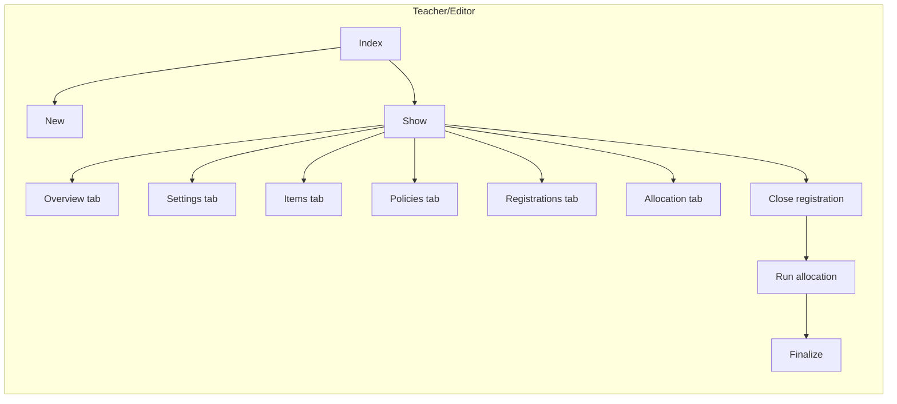
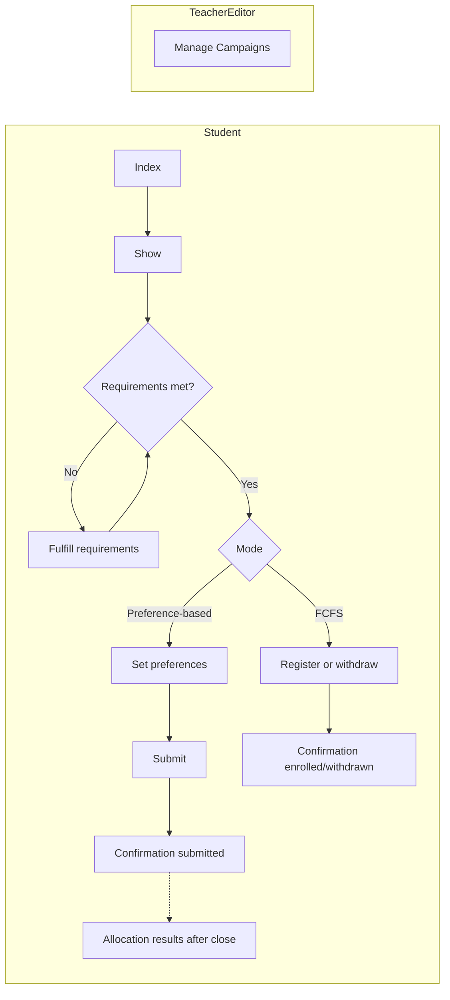
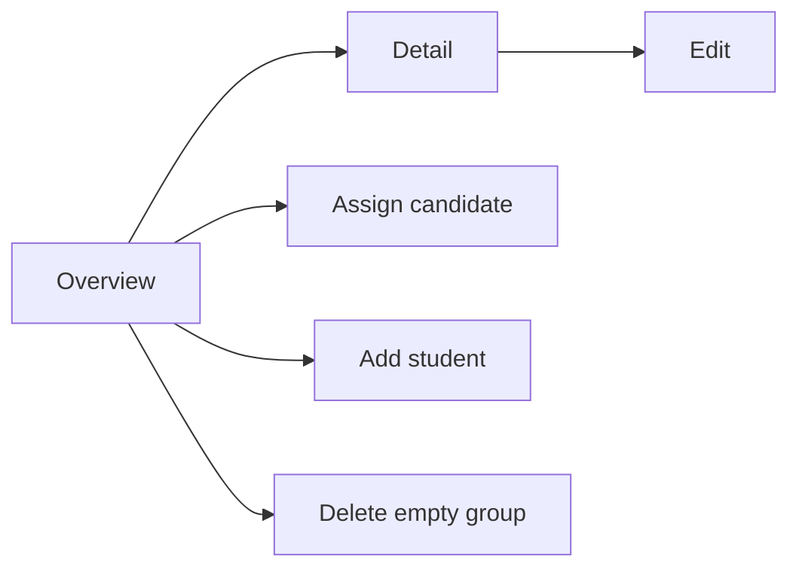
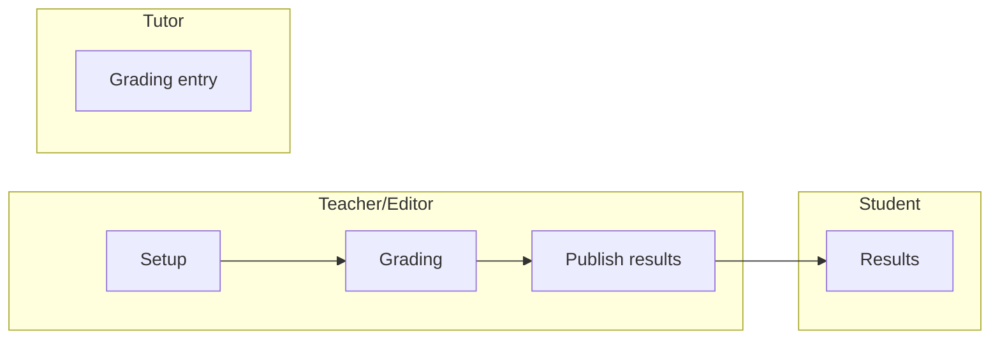
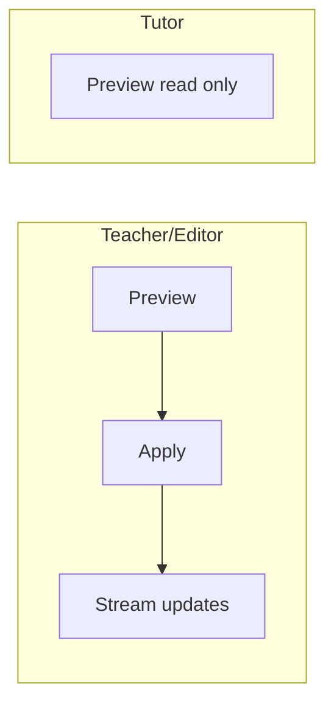

# View Architecture

This chapter outlines view conventions and examples for the MÜSLI integration. It pairs with the Controller Architecture chapter and focuses on HTML ERB views, Hotwire (Turbo Frames/Streams), and ViewComponents usage.

```admonish tip "How to read this chapter"
This chapter specifies view conventions and key screens by feature area.
It complements Controllers: prefer HTML + Turbo (Frames/Streams) with
server-rendered ERB and minimal JS via Stimulus.
```

### At a glance

| Area         | Key views/components                                 | Primary callers                     |
|--------------|-------------------------------------------------------|-------------------------------------|
| Registration | Campaigns (index/show/forms), Student Registration    | Teacher/Editor UI, Student UI       |
| Roster       | Maintenance (index/show/edit)                         | Teacher/Editor UI                   |
| Assessment   | Assessments (CRUD), Grading table, Participations     | Teacher/Editor UI, Tutor UI, Student|
| Exam         | Exams (CRUD), Eligibility table                       | Teacher/Editor UI                   |
| GradeScheme  | Schemes (preview/apply)                               | Teacher/Editor UI                   |
| Dashboard    | Student dashboard, Teacher/Editor dashboard           | Student UI, Teacher/Editor UI       |

The feature sections below (Registration Screens, Rosters, Assessments,
Exams & Eligibility, Grade Schemes) include two tables:
- A Screens table to summarize each screen's purpose, main UI parts,
  and interaction model at a glance. It helps designers and developers
  align on scope and Hotwire usage, and links to static mockups when
  available.
- A Controller/action mapping table to tie those screens to concrete
  Rails endpoints and roles. It clarifies routing, authorization, and
  which actions are invoked from each screen.
The following keys apply:

```admonish info "Table keys (all sections)"
Screens tables:
- View: page/screen name.
- Key elements: main UI parts.
- Hotwire: Frames/Streams used on this screen (when listed).
- Mockup: link to static HTML when available.

Mapping tables:
- View: the screen the row refers to (links to mockup if present).
- Role: actor (Teacher/Editor, Tutor, Student) when access differs.
- Controller: Rails controller handling the request.
- Actions: controller actions called from the view.
- Scope/Notes: brief intent or constraints.
```

## Conventions

- Templates: ERB (`.html.erb`).
- Components: ViewComponents in `app/frontend/_components/` or feature folders.
- Hotwire: Frames vs Streams choice is deferred; decide per screen later.
- Stimulus: Use `.controller.js` suffix; colocate with feature folder under `app/frontend/`.
- Styling: SCSS; colocate per feature when practical.

 

## Partials vs ViewComponents

```admonish tip "Decision guide"
Start simple. Use a partial first. Promote to a ViewComponent when the
fragment becomes reusable, complex, or needs its own tests/JS/styles.
```

| Use a partial when...                               | Use a ViewComponent when...                             |
|-----------------------------------------------------|---------------------------------------------------------|
| It is local to a single page/feature                | It is reused across pages/features                      |
| Presentation-only, minimal branching                | Encapsulates logic/variants/states                      |
| Small fragment (row, cell, inline form field)       | Owns JS/CSS (Stimulus) or wraps a reusable Frame        |
| Minimal/no Stimulus behavior                        | Needs a stable API (kwargs/slots)                       |
| No dedicated unit tests needed                      | Deserves unit tests and composition via slots           |
| No caching/memoization required                     | Will benefit from caching/memoization                   |

```admonish tip "Turbo in views"
Both partials and components can live inside Turbo Frames. If background
jobs will stream updates to the same fragment in several contexts, prefer
a component and render it from stream templates. For one-off stream
responses, a partial is fine.
```

```admonish example "Placement & API"
Partials: colocate near the parent view (e.g.,
`app/frontend/registration/.../_row.html.erb`) and pass explicit locals.

ViewComponents: place in `app/frontend/_components/` or feature-specific
folders. Prefer keyword args and slots for a clear contract.
```

```admonish info "Migration path"
Extract a growing partial into a ViewComponent without changing callers.
Keep the component API narrow and clear via initializer and slots.
```

## Layout & Partials

- Use partials for reusable fragments (tables, forms, flash bars).
- Extract repeated frame shells (table headers, pagination) into partials.
- Keep forms server-rendered; augment with Stimulus when needed.

## Mockups

```admonish example "Mockups"
Preview static screens while wiring controllers and models. Mockup
links also appear in the per-feature tables below. All mockups are
styled with Bootstrap 5 (via CDN) to match the app's component library
for faster transfer from mockup to real views.

Yellow underlined rows in tables visualize an inline edit state of the
preceding white row. Mockups may show both side-by-side to illustrate
the edit UI; in the real UI, only one would be visible at a time.

```

## Registration Screens


### Campaigns (Teacher/Editor)

#### Screens

See Table keys above for column meanings.

```admonish tip "Settings live in Show"
All campaign settings are edited inline on the Show page via the
Settings tab. There is no separate Settings page.
```

```admonish note
When a campaign is completed, the Settings tab is read-only. The
"Planning-only" option is visible but disabled. In Draft/Open, the
"Planning-only" option can be toggled; enabling it hides finalization
paths in the UI (Allocation/Finalize).
```

| View   | Key elements                                          | Mockup |
|--------|--------------------------------------------------------|--------|
| Index (Lecture) | Minimal table for a single lecture; status chips       | [Mockup](../mockups/campaigns_index.html) |
| Index (Current term, grouped) | Grouped by lecture for the teacher/editor; no search needed | [Mockup](../mockups/campaigns_index_current_term.html) |
| Show (Exam – FCFS) | Summary panel; tabs: Overview, Settings, Items, Policies, Registrations, Allocation; FCFS shows eligibility | [Mockup](../mockups/campaigns_show_exam.html) |
| Show (Tutorials – FCFS, open) | Summary panel; tabs: Overview, Settings, Items, Policies, Registrations, Allocation; FCFS shows eligibility | [Mockup](../mockups/campaigns_show_tutorial_fcfs_open.html) |
| Show (Tutorials – preference-based, open) | Summary panel; tabs: Overview, Settings, Items, Policies, Registrations, Allocation; preference-based shows preferences | [Mockup](../mockups/campaigns_show_tutorial_open.html) |
| Show (Tutorials – preference-based, completed) | Summary panel; tabs: Overview, Settings, Items, Policies, Registrations, Allocation; preference-based shows preferences | [Mockup](../mockups/campaigns_show_tutorial.html) |
| Show (Interest – draft) | Summary panel; tabs: Overview, Settings, Items, Policies, Registrations, Allocation | [Mockup](../mockups/campaigns_show_interest_draft.html) |
| Forms (Items & Policies tabs) | Inline create/edit for items and policies              | See Show mockups (tabs) |


#### Flow



#### Controller and actions mapping (teacher/editor)
| Surface/Control                 | Controller                                                                             | Action(s)                               | Preconditions                         | Notes |
|---------------------------------|----------------------------------------------------------------------------------------|-----------------------------------------|---------------------------------------|-------|
| Index                           | [Registration::CampaignsController](11-controllers.md#registration-controllers)        | index                                   | —                                     | List campaigns for a lecture |
| Show                            | [Registration::CampaignsController](11-controllers.md#registration-controllers)        | show                                    | —                                     | Overview with tabs |
| New/Edit/Delete (campaign)      | [Registration::CampaignsController](11-controllers.md#registration-controllers)        | new, create, edit, update, destroy      | Destroy only if no registrations      | Manage metadata and dates |
| Open registration               | [Registration::CampaignsController](11-controllers.md#registration-controllers)        | open                                    | Draft only                            | Status: draft → open |
| Close registration              | [Registration::CampaignsController](11-controllers.md#registration-controllers)        | close                                   | Open only                             | Stop intake: open → processing |
| Reopen registration             | [Registration::CampaignsController](11-controllers.md#registration-controllers)        | reopen                                  | Processing only                       | Before finalization: processing → open |
| Policies tab (CRUD)             | [Registration::PoliciesController](11-controllers.md#registration-controllers)         | index, new, create, edit, update, destroy | —                                   | Manage eligibility policies |
| Allocation — show               | [Registration::AllocationController](11-controllers.md#registration-controllers)       | show                                    | —                                     | Allocation status/progress |
| Allocation — run                | [Registration::AllocationController](11-controllers.md#registration-controllers)       | create                                  | Processing; not planning-only         | Trigger allocation |
| Allocation — retry              | [Registration::AllocationController](11-controllers.md#registration-controllers)       | retry                                   | After failure                         | Retry failed run |
| Allocation — finalize           | [Registration::AllocationController](11-controllers.md#registration-controllers)       | finalize                                | Allocation ready; not planning-only   | Materialize results |
| Allocation — allocate+finalize  | [Registration::AllocationController](11-controllers.md#registration-controllers)       | allocate_and_finalize                   | Shortcut                               | One-step path |

### Student Registration

#### Screens

| View | Key elements | Mockup |
|------|---------------|--------|
| Index (tabs) | Tabs: Courses & seminars, Exams; global filters with per-tab scoping; groups: Open, Closed (you registered), Closed (not registered) | [Mockup](../mockups/student_registration_index_tabs.html) |
| Show (preference-based) | Rank-first preferences (K=6, M=5), searchable catalog with pagination, add/remove/reorder ranks, save status | [Mockup](../mockups/student_registration.html) |
| Show (FCFS) | Register/Withdraw for whole course (e.g., seminar), live seat counters, async save with status | [Mockup](../mockups/student_registration_fcfs.html) |
| Show (FCFS – tutorials) | Choose a specific tutorial; per-group capacity/filled, disabled when full; async save with status | [Mockup](../mockups/student_registration_fcfs_tutorials.html) |
| Show (FCFS – exam) | Exam seat registration; date/time/location details; register/withdraw; hall capacity info; async save with status | [Mockup](../mockups/student_registration_fcfs_exam.html) |
| Show (FCFS – exam; action required: institutional email) | Registration gated by campaign policy; example shown: institutional email domain. Page links to fulfill the requirement; Register enabled once satisfied | [Mockup](../mockups/student_registration_fcfs_exam_action_required_email.html) |
| Confirmation (result) | Completed registration outcome; shows assignment (e.g., Tutorial group C) and preference summary | [Mockup](../mockups/student_registration_confirmation.html) |

#### Flow




```admonish note
Teacher/Editor “Manage Campaigns” configures mode, policies, and dates
that govern the Student flow. It does not imply a navigation path to the
Student “Show”.
```

#### Controller and actions mapping (student)
| Surface/Control                        | Controller                                                                             | Action(s)  | Preconditions                         | Notes |
|----------------------------------------|----------------------------------------------------------------------------------------|------------|---------------------------------------|-------|
| Index (tabs)                           | [Registration::UserRegistrationsController](11-controllers.md#registration-controllers) | index      | —                                     | Tabs: Courses & seminars, Exams; filters: Status, Registration, Semester |
| Show (preference-based)                | [Registration::UserRegistrationsController](11-controllers.md#registration-controllers) | show       | —                                     | Rank-first page |
| Preferences — edit                     | [Registration::UserRegistrationsController](11-controllers.md#registration-controllers) | edit       | —                                     | Renders editor in-page |
| Preferences — save                     | [Registration::UserRegistrationsController](11-controllers.md#registration-controllers) | update     | Valid ranks only                      | Persists and re-renders |
| Show (FCFS — course)                   | [Registration::UserRegistrationsController](11-controllers.md#registration-controllers) | show       | —                                     | Enroll/withdraw context |
| Register (FCFS course)                 | [Registration::UserRegistrationsController](11-controllers.md#registration-controllers) | update     | Eligibility ok; seats available       | — |
| Choose tutorial + register (FCFS)      | [Registration::UserRegistrationsController](11-controllers.md#registration-controllers) | update     | Seats available                       | Multi-item picker |
| Register (exam)                        | [Registration::UserRegistrationsController](11-controllers.md#registration-controllers) | update     | Requirements met                      | Policy-gated; show required actions per campaign policy |
| Withdraw                               | [Registration::UserRegistrationsController](11-controllers.md#registration-controllers) | destroy    | Only when registered                  | — |
| Confirmation (result)                  | [Registration::UserRegistrationsController](11-controllers.md#registration-controllers) | show       | After submit/close                    | Shows assignment and summary |
| Fulfill requirements (policy)          | —                                                                                      | Policy-configured flow | External or internal                  | Follow instructions to satisfy policy, then retry |

## Rosters (Teacher/Editor)

#### Flow



| View     | Key elements                                       | Mockup |
|----------|-----------------------------------------------------|--------|
| Overview | List/table of groups with Tutor/Time/Place; search/filter; per-row capacity meter; Manage action; right-side “Candidates from campaign” panel (unassigned only) with search, top-3 preferences, Assign to…; capacity guard. For exams, the candidates panel is not shown. | [Tutorials](../mockups/roster_overview.html); [Seminar](../mockups/roster_overview_seminar.html); [Exam](../mockups/roster_overview_exam.html) |
| Detail   | Participants table with search; remove/move; capacity guard | [Tutorial](../mockups/roster_detail.html); [Seminar](../mockups/roster_detail_seminar.html); [Exam](../mockups/roster_detail_exam.html); [Tutor (read-only)](../mockups/roster_detail_tutor.html) |

#### Controller and actions mapping (teacher/editor)
| Surface/Control                 | Controller                                                   | Action(s) | Preconditions      | Notes |
|---------------------------------|--------------------------------------------------------------|-----------|--------------------|-------|
| Overview                        | [Roster::MaintenanceController](11-controllers.md#roster-controllers) | index     | —                  | Overview across rosters; candidates panel (unassigned only) |
| Show (Detail)                   | [Roster::MaintenanceController](11-controllers.md#roster-controllers) | show      | —                  | Participants table; capacity info |
| Edit/Update (roster metadata)   | [Roster::MaintenanceController](11-controllers.md#roster-controllers) | edit, update | —               | Inline edit frame; persist changes |
| Assign candidate (from Overview)| [Roster::MaintenanceController](11-controllers.md#roster-controllers) | update    | Capacity available | Add participant from candidates panel |
| Move participant (in Detail)    | [Roster::MaintenanceController](11-controllers.md#roster-controllers) | update    | Capacity available | Change group for a participant |
| Remove participant (in Detail)  | [Roster::MaintenanceController](11-controllers.md#roster-controllers) | update    | —                  | Remove a student from the roster |
| Delete empty roster             | [Roster::MaintenanceController](11-controllers.md#roster-controllers) | destroy   | Only when empty    | Delete action from Overview |

#### Controller and actions mapping (tutor)
| Surface/Control   | Controller                                                   | Action(s) | Preconditions | Notes                                    |
|-------------------|--------------------------------------------------------------|-----------|---------------|------------------------------------------|
| Show (Detail)     | [Roster::MaintenanceController](11-controllers.md#roster-controllers) | show      | —             | Read-only for own groups (if permitted) |
| —                 | —                                                            | —         | —             | No access to edit/update/destroy         |

## Assessments

#### Flow



| View        | Key elements                                        | Mockup |
|-------------|------------------------------------------------------|--------|
| Setup (CRUD)| Title, points/submission flags; tasks table          | TODO   |
| Grading     | Sticky header table; per-task columns; bulk actions  | TODO   |
| Results     | Compact totals; collapsible per-task breakdown       | TODO   |

#### Controller/action mapping (role-specific)
| Role          | Controller                          | Actions                                           | Scope                          |
|---------------|-------------------------------------|---------------------------------------------------|---------------------------------|
| Teacher/Editor| [Assessment::AssessmentsController](11-controllers.md#assessment-controllers)   | index, new, create, show, edit, update, destroy   | Setup                          |
| Teacher/Editor| [Assessment::AssessmentsController](11-controllers.md#assessment-controllers)   | publish_results, unpublish_results                | Visibility lifecycle            |
| Teacher/Editor| [Assessment::GradingController](11-controllers.md#assessment-controllers)       | show, update, export, import                      | Grading + bulk ops             |
| Tutor         | [Assessment::GradingController](11-controllers.md#assessment-controllers)       | show, update                                      | Grading (enter/update points)  |
| Tutor         | [Assessment::GradingController](11-controllers.md#assessment-controllers)       | export, import                                    | Optional if permitted           |
| Tutor         | [Assessment::AssessmentsController](11-controllers.md#assessment-controllers)   | index, show                                       | Read-only                       |
| Student       | [Assessment::ParticipationsController](11-controllers.md#assessment-controllers)| index, show                                       | Own results (when published)    |

## Exams & Eligibility

#### Flow

```mermaid
flowchart LR
  subgraph TEACHER_EDITOR [Teacher/Editor]
    CR[Create exam] --> REV[Review eligibility]
    REV --> OV[Optional overrides]
    OV --> EXP[Export list]
  end
  subgraph TUTOR [Tutor]
    RE[Eligibility (view if permitted)]
    RED[Exam details (view if permitted)]
  end
```

| View       | Key elements                                  | Mockup |
|------------|-----------------------------------------------|--------|
| Exams      | Date/location schedule; links to eligibility   | TODO   |
| Eligibility| Filterable table; override modal in a frame    | TODO   |

#### Controller/action mapping (role-specific)
| View       | Role           | Controller                        | Actions                                 | Scope/Notes                                  |
|------------|----------------|-----------------------------------|-----------------------------------------|-----------------------------------------------|
| Exams      | Teacher/Editor | [ExamsController](11-controllers.md#exam-controllers)                    | index, new, create, show, edit, update, destroy | Manage exams                            |
| Eligibility| Teacher/Editor | [ExamEligibility::RecordsController](11-controllers.md#exam-controllers) | index, show, update, export             | Eligibility management (override/export)      |
| Eligibility| Tutor          | [ExamEligibility::RecordsController](11-controllers.md#exam-controllers) | index, show                             | View if permitted; no overrides                |
| Exams      | Tutor          | [ExamsController](11-controllers.md#exam-controllers)                    | index, show                             | Read-only (if permitted by abilities)         |
| —          | Student        | —                                   | —                                       | No access here (registration handled elsewhere)|

## Grade Schemes

#### Flow



| View    | Key elements                                              | Mockup |
|---------|-----------------------------------------------------------|--------|
| Preview | Histogram; draggable boundaries; distribution table       | TODO   |
| Apply   | Apply scheme and update results                           | TODO   |

#### Controller/action mapping (role-specific)
| View    | Role           | Controller                      | Actions                               | Scope/Notes                                 |
|---------|----------------|---------------------------------|---------------------------------------|----------------------------------------------|
| Setup   | Teacher/Editor | [GradeScheme::SchemesController](11-controllers.md#grade-scheme-controllers)  | index, new, create, edit, update      | Manage schemes                               |
| Preview | Teacher/Editor | [GradeScheme::SchemesController](11-controllers.md#grade-scheme-controllers)  | preview                               | Preview distribution                         |
| Apply   | Teacher/Editor | [GradeScheme::SchemesController](11-controllers.md#grade-scheme-controllers)  | apply                                 | Apply to results; stream updates             |
| Preview | Tutor          | [GradeScheme::SchemesController](11-controllers.md#grade-scheme-controllers)  | preview                               | Read-only (if permitted by abilities)        |
| —       | Student        | —                               | —                                     | No access to grading schemes                 |

## Notes

```admonish note "Guidance"
- Keep server responses small within frames.
- Use Streams for background job progress (allocation/grades publish).
- Avoid comments/docstrings in code per repository standards. Add
	top-level docstrings when needed in actual source files.
```
