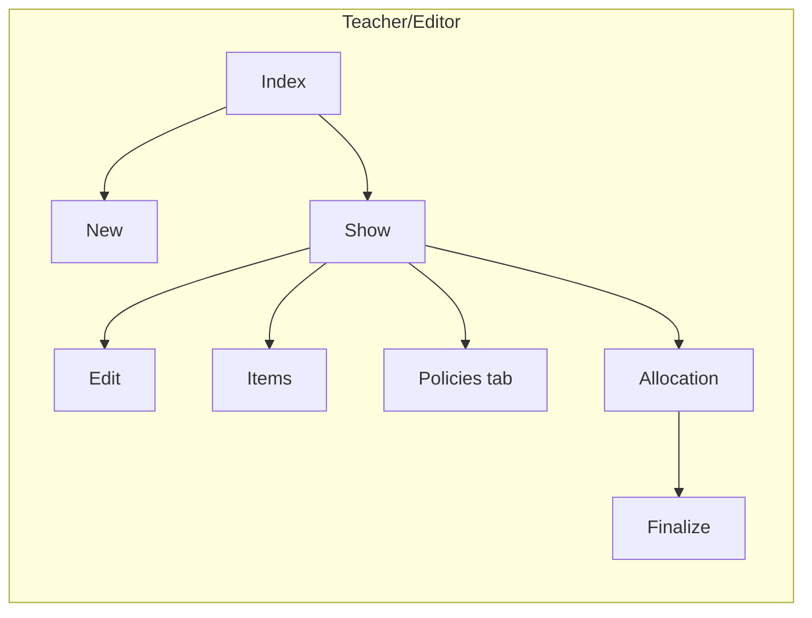
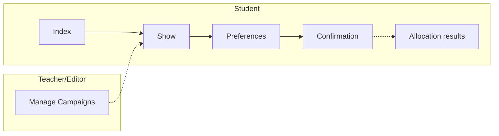
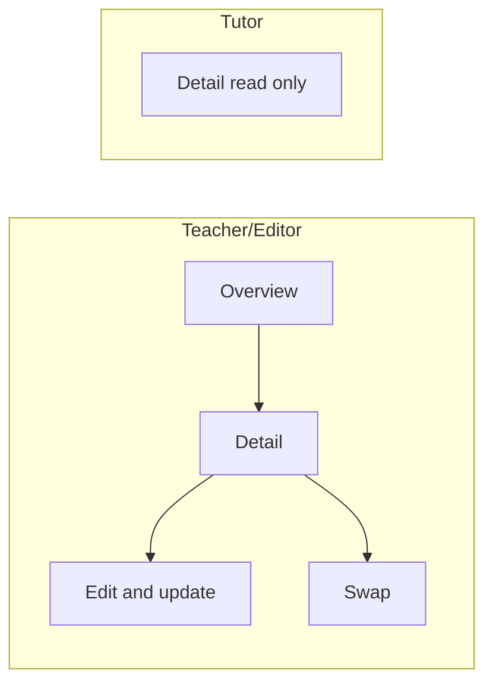
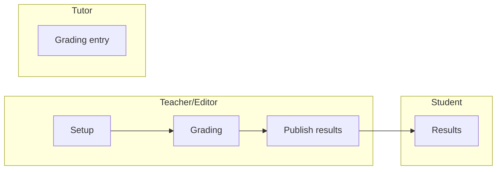
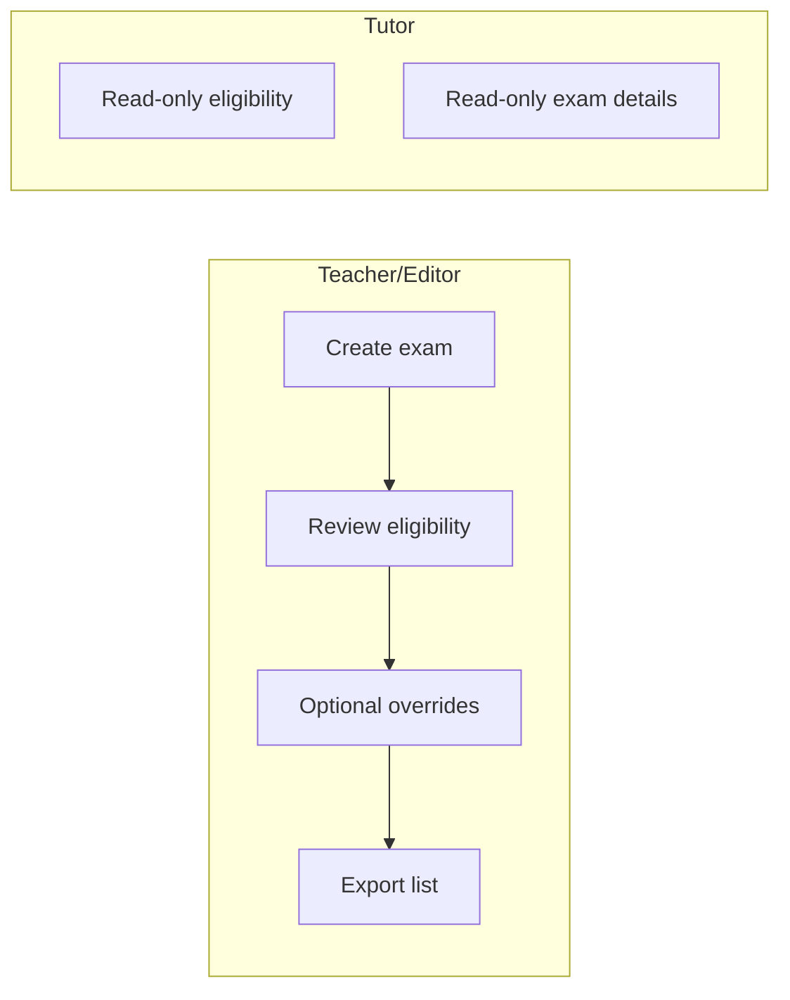
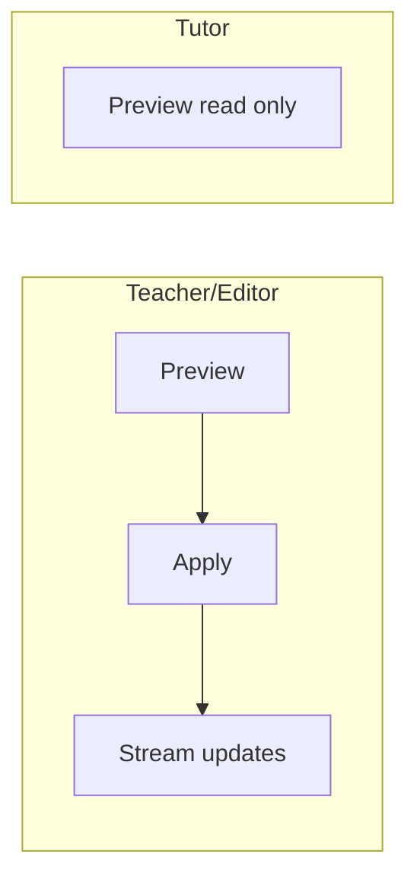

# View Architecture

This chapter outlines view conventions and examples for the MÜSLI integration. It pairs with the Controller Architecture chapter and focuses on HTML ERB views, Hotwire (Turbo Frames/Streams), and ViewComponents usage.

```admonish tip "How to read this chapter"
This chapter specifies view conventions and key screens by feature area.
It complements Controllers: prefer HTML + Turbo (Frames/Streams) with
server-rendered ERB and minimal JS via Stimulus.
```

### At a glance

| Area         | Key views/components                                 | Primary callers                     |
|--------------|-------------------------------------------------------|-------------------------------------|
| Registration | Campaigns (index/show/forms), Student Registration    | Teacher/Editor UI, Student UI       |
| Roster       | Maintenance (index/show/edit/swap)                    | Teacher/Editor UI                   |
| Assessment   | Assessments (CRUD), Grading table, Participations     | Teacher/Editor UI, Tutor UI, Student|
| Exam         | Exams (CRUD), Eligibility table                       | Teacher/Editor UI                   |
| GradeScheme  | Schemes (preview/apply)                               | Teacher/Editor UI                   |
| Dashboard    | Student dashboard, Teacher/Editor dashboard           | Student UI, Teacher/Editor UI       |

The feature sections below (Registration Screens, Rosters, Assessments,
Exams & Eligibility, Grade Schemes) include two tables:
- A Screens table to summarize each screen's purpose, main UI parts,
  and interaction model at a glance. It helps designers and developers
  align on scope and Hotwire usage, and links to static mockups when
  available.
- A Controller/action mapping table to tie those screens to concrete
  Rails endpoints and roles. It clarifies routing, authorization, and
  which actions are invoked from each screen.
The following keys apply:

```admonish info "Table keys (all sections)"
Screens tables:
- View: page/screen name.
- Key elements: main UI parts.
- Hotwire: Frames/Streams used on this screen (when listed).
- Mockup: link to static HTML when available.

Mapping tables:
- View: the screen the row refers to (links to mockup if present).
- Role: actor (Teacher/Editor, Tutor, Student) when access differs.
- Controller: Rails controller handling the request.
- Actions: controller actions called from the view.
- Scope/Notes: brief intent or constraints.
```

## Conventions

- Templates: ERB (`.html.erb`).
- Components: ViewComponents in `app/frontend/_components/` or feature folders.
- Hotwire: Prefer Turbo Frames for scoped interactions; Turbo Streams for incremental/broadcast updates.
- Stimulus: Use `.controller.js` suffix; colocate with feature folder under `app/frontend/`.
- Styling: SCSS; colocate per feature when practical.

### Turbo Frames vs Turbo Streams

- Frames: Scoped navigation and partial page updates. Use for tabs, inline
	forms, pagination, filters, and detail panels so only a fragment reloads.
- Streams: Incremental updates pushed after an action or background job.
	Use for append/replace of items, progress, and results broadcast.

## Partials vs ViewComponents

```admonish tip "Decision guide"
Start simple. Use a partial first. Promote to a ViewComponent when the
fragment becomes reusable, complex, or needs its own tests/JS/styles.
```

| Use a partial when...                               | Use a ViewComponent when...                             |
|-----------------------------------------------------|---------------------------------------------------------|
| It is local to a single page/feature                | It is reused across pages/features                      |
| Presentation-only, minimal branching                | Encapsulates logic/variants/states                      |
| Small fragment (row, cell, inline form field)       | Owns JS/CSS (Stimulus) or wraps a reusable Frame        |
| Minimal/no Stimulus behavior                        | Needs a stable API (kwargs/slots)                       |
| No dedicated unit tests needed                      | Deserves unit tests and composition via slots           |
| No caching/memoization required                     | Will benefit from caching/memoization                   |

```admonish tip "Turbo in views"
Both partials and components can live inside Turbo Frames. If background
jobs will stream updates to the same fragment in several contexts, prefer
a component and render it from stream templates. For one-off stream
responses, a partial is fine.
```

```admonish example "Placement & API"
Partials: colocate near the parent view (e.g.,
`app/frontend/registration/.../_row.html.erb`) and pass explicit locals.

ViewComponents: place in `app/frontend/_components/` or feature-specific
folders. Prefer keyword args and slots for a clear contract.
```

```admonish info "Migration path"
Extract a growing partial into a ViewComponent without changing callers.
Keep the component API narrow and clear via initializer and slots.
```

## Layout & Partials

- Use partials for reusable fragments (tables, forms, flash bars).
- Extract repeated frame shells (table headers, pagination) into partials.
- Keep forms server-rendered; augment with Stimulus when needed.

## Mockups

```admonish example "Mockups"
Preview static screens while wiring controllers and models. Mockup
links also appear in the per-feature tables below. All mockups are
styled with Bootstrap 5 (via CDN) to match the app's component library
for faster transfer from mockup to real views.

- Student Registration (Index): [Mockup](../mockups/student_registration_index_compact.html)
- Student Registration (Index, cards): [Mockup](../mockups/student_registration_index.html)
- Student Registration (Show): [Mockup](../mockups/student_registration.html)
```

## Registration Screens


```admonish tip "Turbo usage in Student Registration"
- Index: Frames for filters/pagination. No streams.
- Show: Frames for eligibility/details/preferences panels. Streams for
	allocation results once the job finishes.
- Preferences: Frame-wrapped form. Save returns the updated panel or
	validation errors within the frame.
```

### Campaigns (Teacher/Editor)

#### Screens

See Table keys above for column meanings.

| View   | Key elements                                          | Hotwire           | Mockup |
|--------|--------------------------------------------------------|-------------------|--------|
| Index (Lecture) | Minimal table for a single lecture; status chips       | Frames            | [Mockup](../mockups/campaigns_index.html) |
| Show   | Summary panel; tabs: Items, Policies, Registrations, Allocation; Inline actions: Finalize, Delete | Frames + Streams  | [Mockup](../mockups/campaigns_show.html) |
| Forms (Items & Policies tabs) | Inline create/edit for items and policies              | Frames            | TODO   |
| Settings (Edit) | Edit metadata, dates, and open/close controls           | Frames            | TODO   |

#### Flow



#### Controller/action mapping (teacher/editor)
| View/Area | Controller                             | Actions                                     | Scope/Notes |
|-----------|----------------------------------------|---------------------------------------------|-------------|
| Index     | Registration::CampaignsController      | index                                       | List campaigns for a lecture |
| Show      | Registration::CampaignsController      | show                                        | Campaign overview with tabs |
| New/Edit (Campaign settings) | Registration::CampaignsController      | new, create, edit, update, destroy          | Create/modify metadata and dates; destroy only if no registrations |
| Open for registration (member action) | Registration::CampaignsController     | open                                        | Set status to open (draft → open) |
| Policies tab (forms) | Registration::PoliciesController       | index, new, create, edit, update, destroy   | Manage eligibility policies within a campaign |
| Allocation tab        | Registration::AllocationController    | show, create, retry, finalize, allocate_and_finalize | Trigger/monitor allocation; finalize moves confirmed users to rosters |

### Student Registration

#### Flow



#### Controller/action mapping (student)
| View                     | Controller                                | Actions       | Scope/Notes                           |
|--------------------------|-------------------------------------------|---------------|----------------------------------------|
| [Index](../mockups/student_registration_index_compact.html) | Registration::UserRegistrationsController | index         | List available campaigns               |
| [Show](../mockups/student_registration.html)                | Registration::UserRegistrationsController | show          | Campaign registration page             |
| [Preferences panel (Show)](../mockups/student_registration.html) | Registration::UserRegistrationsController | edit, update  | Frame; edit/update preferences         |
| [Confirmation](../mockups/student_registration.html)        | Registration::UserRegistrationsController | show          | After submit; Streams for allocation   |
| Withdraw                 | Registration::UserRegistrationsController | destroy       | Optional, if enabled                   |

| View                     | Key elements                                    | Hotwire                | Mockup |
|--------------------------|--------------------------------------------------|------------------------|--------|
| Index                    | Available campaigns for current user             | Frames (filters)       | [Mockup](../mockups/student_registration_index_compact.html) |
| Show                     | Eligibility; campaign details; preferences panel | Frames + Streams       | [Mockup](../mockups/student_registration.html) |
| Preferences panel (Show) | Drag & drop or rank inputs within a frame        | Frame (edit/update)    | [Mockup](../mockups/student_registration.html) |
| Confirmation             | Post-submit confirmation; allocation result area | Streams (results push) | [Mockup](../mockups/student_registration.html) |

## Rosters (Teacher/Editor)

#### Flow



| View     | Key elements                                       | Hotwire | Mockup |
|----------|-----------------------------------------------------|---------|--------|
| Overview | Per-group cards; capacity meter; participant counts | Frames  | TODO   |
| Detail   | Table with add/remove/move; swap via two-selects    | Frames  | TODO   |

#### Controller/action mapping (role-specific)
| View    | Role           | Controller                    | Actions              | Scope/Notes                                  |
|---------|----------------|-------------------------------|----------------------|-----------------------------------------------|
| Overview| Teacher/Editor | Roster::MaintenanceController | index                | Overview across rosters                       |
| Detail  | Teacher/Editor | Roster::MaintenanceController | show, edit, update   | Single roster; inline edit frame; persist     |
| Detail  | Teacher/Editor | Roster::MaintenanceController | swap                 | Perform swap; stream or frame update          |
| Detail  | Tutor          | Roster::MaintenanceController | show                 | Read-only for own groups (if permitted)       |
| —       | Student        | —                             | —                    | No access to roster maintenance               |

## Assessments

#### Flow



| View        | Key elements                                        | Hotwire            | Mockup |
|-------------|------------------------------------------------------|--------------------|--------|
| Setup (CRUD)| Title, points/submission flags; tasks table          | Frames             | TODO   |
| Grading     | Sticky header table; per-task columns; bulk actions  | Frames + Streams   | TODO   |
| Results     | Compact totals; collapsible per-task breakdown       | Frames             | TODO   |

#### Controller/action mapping (role-specific)
| Role          | Controller                          | Actions                                           | Scope                          |
|---------------|-------------------------------------|---------------------------------------------------|---------------------------------|
| Teacher/Editor| Assessment::AssessmentsController   | index, new, create, show, edit, update, destroy   | Setup                          |
| Teacher/Editor| Assessment::AssessmentsController   | publish_results, unpublish_results                | Visibility lifecycle            |
| Teacher/Editor| Assessment::GradingController       | show, update, export, import                      | Grading + bulk ops             |
| Tutor         | Assessment::GradingController       | show, update                                      | Grading (enter/update points)  |
| Tutor         | Assessment::GradingController       | export, import                                    | Optional if permitted           |
| Tutor         | Assessment::AssessmentsController   | index, show                                       | Read-only                       |
| Student       | Assessment::ParticipationsController| index, show                                       | Own results (when published)    |

## Exams & Eligibility

#### Flow



| View       | Key elements                                  | Hotwire | Mockup |
|------------|-----------------------------------------------|---------|--------|
| Exams      | Date/location schedule; links to eligibility   | Frames  | TODO   |
| Eligibility| Filterable table; override modal in a frame    | Frames  | TODO   |

#### Controller/action mapping (role-specific)
| View       | Role           | Controller                        | Actions                                 | Scope/Notes                                  |
|------------|----------------|-----------------------------------|-----------------------------------------|-----------------------------------------------|
| Exams      | Teacher/Editor | ExamsController                    | index, new, create, show, edit, update, destroy | Manage exams                            |
| Eligibility| Teacher/Editor | ExamEligibility::RecordsController | index, show, update, export             | Eligibility management (override/export)      |
| Eligibility| Tutor          | ExamEligibility::RecordsController | index, show                             | Read-only; no overrides                        |
| Exams      | Tutor          | ExamsController                    | index, show                             | Read-only (if permitted by abilities)         |
| —          | Student        | —                                   | —                                       | No access here (registration handled elsewhere)|

## Grade Schemes

#### Flow



| View    | Key elements                                              | Hotwire            | Mockup |
|---------|-----------------------------------------------------------|--------------------|--------|
| Preview | Histogram; draggable boundaries; distribution table       | Frames             | TODO   |
| Apply   | Apply scheme and update results                           | Streams (+ Frames) | TODO   |

#### Controller/action mapping (role-specific)
| View    | Role           | Controller                      | Actions                               | Scope/Notes                                 |
|---------|----------------|---------------------------------|---------------------------------------|----------------------------------------------|
| Setup   | Teacher/Editor | GradeScheme::SchemesController  | index, new, create, edit, update      | Manage schemes                               |
| Preview | Teacher/Editor | GradeScheme::SchemesController  | preview                               | Preview distribution                         |
| Apply   | Teacher/Editor | GradeScheme::SchemesController  | apply                                 | Apply to results; stream updates             |
| Preview | Tutor          | GradeScheme::SchemesController  | preview                               | Read-only (if permitted by abilities)        |
| —       | Student        | —                               | —                                     | No access to grading schemes                 |

## Notes

```admonish note "Guidance"
- Keep server responses small within frames.
- Use Streams for background job progress (allocation/grades publish).
- Avoid comments/docstrings in code per repository standards. Add
	top-level docstrings when needed in actual source files.
```
