# View Architecture

This chapter outlines view conventions and examples for the MÜSLI integration. It pairs with the Controller Architecture chapter and focuses on HTML ERB views, Hotwire (Turbo Frames/Streams), and ViewComponents usage.

```admonish tip "How to read this chapter"
This chapter specifies view conventions and key screens by feature area.
It complements Controllers: prefer HTML + Turbo (Frames/Streams) with
server-rendered ERB and minimal JS via Stimulus.
```

### At a glance

| Area         | Key views/components                                 | Primary callers                     |
|--------------|-------------------------------------------------------|-------------------------------------|
| Registration | Campaigns (index/show/forms), Student Registration    | Teacher/Editor UI, Student UI       |
| Roster       | Maintenance (index/show/edit)                         | Teacher/Editor UI                   |
| Assessment   | Assessments (CRUD), Grading table, Grade schemes, Participations | Teacher/Editor UI, Tutor UI, Student|
| Lecture Performance | Certification Dashboard, Performance Records, Evaluator | Teacher/Editor UI, Student UI       |
| Exam         | Exams (CRUD), Exam Roster                            | Teacher/Editor UI                   |
| Dashboard    | Student dashboard, Teacher/Editor dashboard           | Student UI, Teacher/Editor UI       |

The feature sections below (Registration Screens, Rosters, Assessments,
Exams, Grade Schemes) include two tables:
- A Screens table to summarize each screen's purpose, main UI parts,
  and interaction model at a glance. It helps designers and developers
  align on scope and Hotwire usage, and links to static mockups when
  available.
- A Controller/action mapping table to tie those screens to concrete
  Rails endpoints and roles. It clarifies routing, authorization, and
  which actions are invoked from each screen.
The following keys apply:

```admonish info "Table keys (all sections)"
Screens tables:
- View: page/screen name.
- Key elements: main UI parts.
- Hotwire: Frames/Streams used on this screen (when listed).
- Mockup: link to static HTML when available.

Mapping tables:
- View: the screen the row refers to (links to mockup if present).
- Role: actor (Teacher/Editor, Tutor, Student) when access differs.
- Controller: Rails controller handling the request.
- Actions: controller actions called from the view.
- Scope/Notes: brief intent or constraints.
```

## Conventions

- Templates: ERB (`.html.erb`).
- Components: ViewComponents in `app/frontend/_components/` or feature folders.
- Hotwire: Frames vs Streams choice is deferred; decide per screen later.
- Stimulus: Use `.controller.js` suffix; colocate with feature folder under `app/frontend/`.
- Styling: SCSS; colocate per feature when practical.


## Partials vs ViewComponents

```admonish tip "Decision guide"
Start simple. Use a partial first. Promote to a ViewComponent when the
fragment becomes reusable, complex, or needs its own tests/JS/styles.
```

| Use a partial when...                               | Use a ViewComponent when...                             |
|-----------------------------------------------------|---------------------------------------------------------|
| It is local to a single page/feature                | It is reused across pages/features                      |
| Presentation-only, minimal branching                | Encapsulates logic/variants/states                      |
| Small fragment (row, cell, inline form field)       | Owns JS/CSS (Stimulus) or wraps a reusable Frame        |
| Minimal/no Stimulus behavior                        | Needs a stable API (kwargs/slots)                       |
| No dedicated unit tests needed                      | Deserves unit tests and composition via slots           |
| No caching/memoization required                     | Will benefit from caching/memoization                   |

```admonish tip "Turbo in views"
Both partials and components can live inside Turbo Frames. If background
jobs will stream updates to the same fragment in several contexts, prefer
a component and render it from stream templates. For one-off stream
responses, a partial is fine.
```

```admonish example "Placement & API"
Partials: colocate near the parent view (e.g.,
`app/frontend/registration/.../_row.html.erb`) and pass explicit locals.

ViewComponents: place in `app/frontend/_components/` or feature-specific
folders. Prefer keyword args and slots for a clear contract.
```

```admonish info "Migration path"
Extract a growing partial into a ViewComponent without changing callers.
Keep the component API narrow and clear via initializer and slots.
```

## Layout & Partials

- Use partials for reusable fragments (tables, forms, flash bars).
- Extract repeated frame shells (table headers, pagination) into partials.
- Keep forms server-rendered; augment with Stimulus when needed.

## Mockups

```admonish example "Mockups"
Preview static screens while wiring controllers and models. Mockup
links also appear in the per-feature tables below. All mockups are
styled with Bootstrap 5 (via CDN) to match the app's component library
for faster transfer from mockup to real views.

Yellow underlined rows in tables visualize an inline edit state of the
preceding white row. Mockups may show both side-by-side to illustrate
the edit UI; in the real UI, only one would be visible at a time.

```

## Registration Screens


### Campaigns (Teacher/Editor)

#### Screens

See Table keys above for column meanings.

```admonish tip "Settings live in Show"
All campaign settings are edited inline on the Show page via the
Settings tab. There is no separate Settings page.
```

```admonish note
When a campaign is completed, the Settings tab is read-only. The
"Planning-only" option is visible but disabled. In Draft/Open, the
"Planning-only" option can be toggled; enabling it hides finalization
paths in the UI (Allocation/Finalize).
```

| View   | Key elements                                          | Mockup |
|--------|--------------------------------------------------------|--------|
| Index (Lecture) | Minimal table for a single lecture; status chips       | [Mockup](../mockups/campaigns_index.html) |
| Index (Current term, grouped) | Grouped by lecture for the teacher/editor; no search needed | [Mockup](../mockups/campaigns_index_current_term.html) |
| Show (Exam – FCFS) | Summary panel; tabs: Overview, Settings, Items, Policies, Registrations, Allocation; FCFS shows certification status | [Mockup](../mockups/campaigns_show_exam.html) |
| Show (Exam – FCFS, draft with incomplete certifications) | Draft exam campaign with warning banner showing 24 incomplete certifications; pre-flight checks panel; highlighted certification policy; collapsible details; link to Certification Dashboard | [Mockup](../mockups/campaigns_show_exam_draft_incomplete_certs.html) |
| Show (Tutorials – FCFS, open) | Summary panel; tabs: Overview, Settings, Items, Policies, Registrations, Allocation | [Mockup](../mockups/campaigns_show_tutorial_fcfs_open.html) |
| Show (Tutorials – preference-based, open) | Summary panel; tabs: Overview, Settings, Items, Policies, Registrations, Allocation; preference-based shows preferences | [Mockup](../mockups/campaigns_show_tutorial_open.html) |
| Show (Tutorials – preference-based, completed) | Summary panel; tabs: Overview, Settings, Items, Policies, Registrations, Allocation; preference-based shows preferences | [Mockup](../mockups/campaigns_show_tutorial.html) |
| Show (Interest – draft) | Summary panel; tabs: Overview, Settings, Items, Policies, Registrations, Allocation | [Mockup](../mockups/campaigns_show_interest_draft.html) |
| Forms (Items & Policies tabs) | Inline create/edit for items and policies              | See Show mockups (tabs) |
| Pre-flight error modal (exam campaign, registration-phase policy) | Modal shown when attempting to open exam campaign with registration-phase lecture_performance policy and incomplete certifications; blocks opening until all lecture students have finalized certification status; scrollable table of 24 affected students with names, matriculation numbers, performance points/percentage, status (pending/missing); links to Certification Dashboard for batch resolution | [Mockup](../mockups/campaigns_preflight_error_modal.html) |


#### Flow

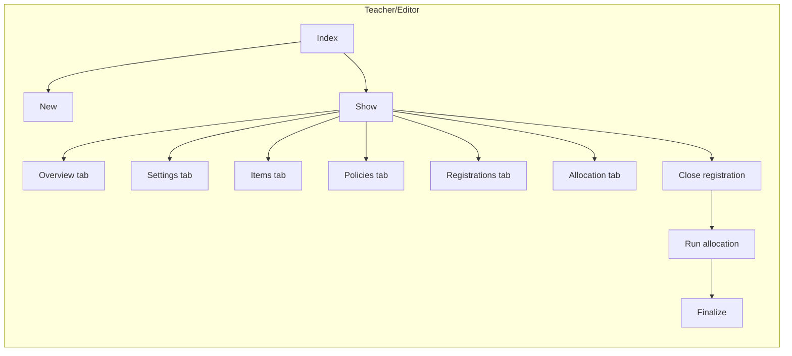

#### Controller and actions mapping (teacher/editor)
| Surface/Control                 | Controller                                                                             | Action(s)                               | Preconditions                         | Notes |
|---------------------------------|----------------------------------------------------------------------------------------|-----------------------------------------|---------------------------------------|-------|
| Index                           | [Registration::CampaignsController](11-controllers.md#registration-controllers)        | index                                   | —                                     | List campaigns for a lecture |
| Show                            | [Registration::CampaignsController](11-controllers.md#registration-controllers)        | show                                    | —                                     | Overview with tabs |
| New/Edit/Delete (campaign)      | [Registration::CampaignsController](11-controllers.md#registration-controllers)        | new, create, edit, update, destroy      | Destroy only if no registrations      | Manage metadata and dates |
| Open registration               | [Registration::CampaignsController](11-controllers.md#registration-controllers)        | open                                    | Draft only                            | Status: draft → open |
| Close registration              | [Registration::CampaignsController](11-controllers.md#registration-controllers)        | close                                   | Open only                             | Stop intake: open → processing |
| Reopen registration             | [Registration::CampaignsController](11-controllers.md#registration-controllers)        | reopen                                  | Processing only                       | Before finalization: processing → open |
| Policies tab (CRUD)             | [Registration::PoliciesController](11-controllers.md#registration-controllers)         | index, new, create, edit, update, destroy | —                                   | Manage registration policies |
| Allocation — show               | [Registration::AllocationController](11-controllers.md#registration-controllers)       | show                                    | —                                     | Allocation status/progress |
| Allocation — run                | [Registration::AllocationController](11-controllers.md#registration-controllers)       | create                                  | Processing; not planning-only         | Trigger allocation |
| Allocation — retry              | [Registration::AllocationController](11-controllers.md#registration-controllers)       | retry                                   | After failure                         | Retry failed run |
| Allocation — finalize           | [Registration::AllocationController](11-controllers.md#registration-controllers)       | finalize                                | Allocation ready; not planning-only   | Materialize results |
| Allocation — allocate+finalize  | [Registration::AllocationController](11-controllers.md#registration-controllers)       | allocate_and_finalize                   | Shortcut                               | One-step path |

### Student Registration

#### Screens

| View | Key elements | Mockup |
|------|---------------|--------|
| Index (tabs) | Tabs: Courses & seminars, Exams; global filters with per-tab scoping; groups: Open, Closed (you registered), Closed (not registered) | [Mockup](../mockups/student_registration_index_tabs.html) |
| Show (preference-based) | Rank-first preferences (K=6, M=5), searchable catalog with pagination, add/remove/reorder ranks, save status | [Mockup](../mockups/student_registration.html) |
| Show (FCFS) | Register/Withdraw for whole course (e.g., seminar), live seat counters, async save with status | [Mockup](../mockups/student_registration_fcfs.html) |
| Show (FCFS – tutorials) | Choose a specific tutorial; per-group capacity/filled, disabled when full; async save with status | [Mockup](../mockups/student_registration_fcfs_tutorials.html) |
| Show (FCFS – exam) | Exam seat registration; date/time/location details; register/withdraw; hall capacity info; async save with status; certification status badge (passed/failed/pending) | [Mockup](../mockups/student_registration_fcfs_exam.html) |
| Show (FCFS – exam; action required: institutional email) | Registration gated by campaign policy; example shown: institutional email domain. Page links to fulfill the requirement; Register enabled once satisfied | [Mockup](../mockups/student_registration_fcfs_exam_action_required_email.html) |
| Show (FCFS – exam; failed certification) | Registration blocked by failed certification. Error message: "Cannot register: You have not met the lecture performance requirements." Link to Performance Overview. No Register button. | [Mockup](../mockups/student_registration_fcfs_exam_failed_certification.html) |
| Show (FCFS – exam; pending certification) | Registration blocked by pending certification. Warning message: "Cannot register yet: Your certification is pending teacher review." Check back message. No Register button. | [Mockup](../mockups/student_registration_fcfs_exam_pending_certification.html) |
| Confirmation (result) | Completed registration outcome; shows assignment (e.g., Tutorial group C) and preference summary | [Mockup](../mockups/student_registration_confirmation.html) |

#### Flow

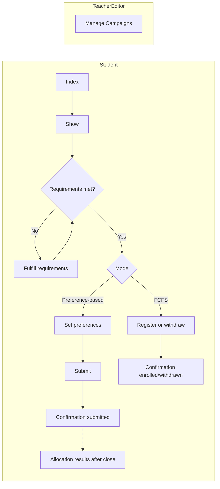


```admonish note
Teacher/Editor “Manage Campaigns” configures mode, policies, and dates
that govern the Student flow. It does not imply a navigation path to the
Student “Show”.
```

#### Controller and actions mapping (student)
| Surface/Control                        | Controller                                                                             | Action(s)  | Preconditions                         | Notes |
|----------------------------------------|----------------------------------------------------------------------------------------|------------|---------------------------------------|-------|
| Index (tabs)                           | [Registration::UserRegistrationsController](11-controllers.md#registration-controllers) | index      | —                                     | Tabs: Courses & seminars, Exams; filters: Status, Registration, Semester |
| Show (preference-based)                | [Registration::UserRegistrationsController](11-controllers.md#registration-controllers) | show       | —                                     | Rank-first page |
| Preferences — edit                     | [Registration::UserRegistrationsController](11-controllers.md#registration-controllers) | edit       | —                                     | Renders editor in-page |
| Preferences — save                     | [Registration::UserRegistrationsController](11-controllers.md#registration-controllers) | update     | Valid ranks only                      | Persists and re-renders |
| Show (FCFS — course)                   | [Registration::UserRegistrationsController](11-controllers.md#registration-controllers) | show       | —                                     | Enroll/withdraw context |
| Register (FCFS course)                 | [Registration::UserRegistrationsController](11-controllers.md#registration-controllers) | update     | Policy checks pass; seats available   | — |
| Choose tutorial + register (FCFS)      | [Registration::UserRegistrationsController](11-controllers.md#registration-controllers) | update     | Seats available                       | Multi-item picker |
| Register (exam)                        | [Registration::UserRegistrationsController](11-controllers.md#registration-controllers) | update     | Requirements met                      | Policy-gated; show required actions per campaign policy |
| Withdraw                               | [Registration::UserRegistrationsController](11-controllers.md#registration-controllers) | destroy    | Only when registered                  | — |
| Confirmation (result)                  | [Registration::UserRegistrationsController](11-controllers.md#registration-controllers) | show       | After submit/close                    | Shows assignment and summary |
| Fulfill requirements (policy)          | —                                                                                      | Policy-configured flow | External or internal                  | Follow instructions to satisfy policy, then retry |

## Rosters

#### Flow

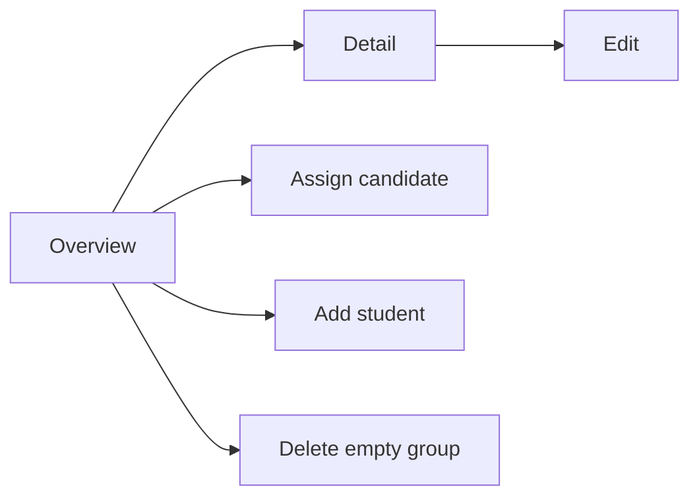

| View     | Key elements                                       | Mockup |
|----------|-----------------------------------------------------|--------|
| Overview | List/table of groups with Tutor/Time/Place; search/filter; per-row capacity meter; Manage action; right-side “Candidates from campaign” panel (unassigned only) with search, top-3 preferences, Assign to…; capacity guard. For exams, the candidates panel is not shown. | [Tutorials](../mockups/roster_overview.html); [Seminar](../mockups/roster_overview_seminar.html); [Exam](../mockups/roster_overview_exam.html) |
| Detail   | Participants table with search; remove/move; capacity guard | [Tutorial](../mockups/roster_detail.html); [Seminar](../mockups/roster_detail_seminar.html); [Exam](../mockups/roster_detail_exam.html); [Tutor (read-only)](../mockups/roster_detail_tutor.html) |

#### Controller and actions mapping (teacher/editor)
| Surface/Control                 | Controller                                                   | Action(s) | Preconditions      | Notes |
|---------------------------------|--------------------------------------------------------------|-----------|--------------------|-------|
| Overview                        | [Roster::MaintenanceController](11-controllers.md#roster-controllers) | index     | —                  | Overview across rosters; candidates panel (unassigned only) |
| Show (Detail)                   | [Roster::MaintenanceController](11-controllers.md#roster-controllers) | show      | —                  | Participants table; capacity info |
| Edit/Update (roster metadata)   | [Roster::MaintenanceController](11-controllers.md#roster-controllers) | edit, update | —               | Inline edit frame; persist changes |
| Assign candidate (from Overview)| [Roster::MaintenanceController](11-controllers.md#roster-controllers) | update    | Capacity available | Add participant from candidates panel |
| Move participant (in Detail)    | [Roster::MaintenanceController](11-controllers.md#roster-controllers) | update    | Capacity available | Change group for a participant |
| Remove participant (in Detail)  | [Roster::MaintenanceController](11-controllers.md#roster-controllers) | update    | —                  | Remove a student from the roster |
| Delete empty roster             | [Roster::MaintenanceController](11-controllers.md#roster-controllers) | destroy   | Only when empty    | Delete action from Overview |

#### Controller and actions mapping (tutor)
| Surface/Control   | Controller                                                   | Action(s) | Preconditions | Notes                                    |
|-------------------|--------------------------------------------------------------|-----------|---------------|------------------------------------------|
| Show (Detail)     | [Roster::MaintenanceController](11-controllers.md#roster-controllers) | show      | —             | Read-only for own groups (if permitted) |
| —                 | —                                                            | —         | —             | No access to edit/update/destroy         |

## Assessments

```admonish info "Context-Specific Views"
Assessment views differ between regular lectures and seminars:
- **Lectures:** Show assignments and exams; "New Assessment" button with dropdown
- **Seminars:** Show talks only; no "New Assessment" button (talks created via Content tab); inline grading interface
```

### Assessments (Lectures - Teacher/Editor)

#### Screens

See Table keys above for column meanings.

```admonish note "Lecture Context Only"
The views below apply to regular lectures. For seminar-specific views, see the [Seminars](#assessments-seminars---teachereditor) section.
```

| View        | Key elements                                        | Mockup |
|-------------|------------------------------------------------------|--------|
| Index       | List of assignments and exams with status/type badges; filter tabs; progress indicators; "New Assessment" button | [Mockup](../mockups/assessments_index.html) |
| Index (End of Semester) | Same as Index, showing complete semester timeline: 8 graded assignments, midterm exam graded, final exam in progress | [Mockup](../mockups/assessments_index_end_of_semester.html) |
| New         | Form with type dropdown (Assignment/Exam); dual-mode support (Pointbook/Gradebook); dynamic task management; schedule settings | [Mockup](../mockups/assessments_new.html) |
| Show (Assignment - Open) | Tabbed interface (Overview/Settings/Tasks/Participants); submission progress tracking; before grading starts | [Mockup](../mockups/assessments_show_assignment_open.html) |
| Show (Assignment - Closed) | Tabbed interface (Overview/Settings/Tasks/Tutorials/Grading/Statistics); submission progress; tutorials publication management; grading table with filters and sorting | [Mockup](../mockups/assessments_show_assignment_closed.html) |
| Show (Exam - Draft) | Tabbed interface (Overview/Settings/Tasks/Exam Logistics/Participants); configuration and setup phase | [Mockup](../mockups/assessments_show_exam_draft.html) |
| Show (Exam - Closed) | Tabbed interface (Overview/Settings/Tasks/Exam Logistics/Participants); grading in progress; tutor assignment tracking | [Mockup](../mockups/assessments_show_exam_closed.html) |
| Show (Exam - Graded) | Tabbed interface with Statistics tab; grade distribution; results publication status; average scores per question | [Mockup](../mockups/assessments_show_exam_graded.html) |

#### Flow

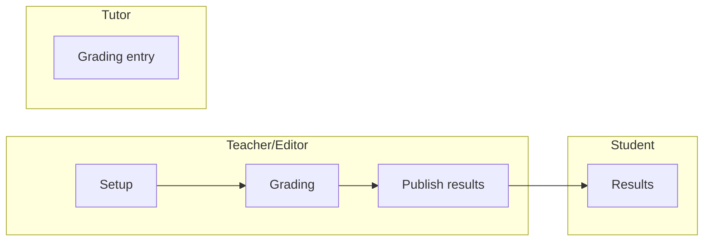

#### Controller/action mapping (role-specific)
| Role          | Controller                          | Actions                                           | Scope                          |
|---------------|-------------------------------------|---------------------------------------------------|---------------------------------|
| Teacher/Editor| [Assessment::AssessmentsController](11-controllers.md#assessmentassessmentscontroller)   | index, new, create, show, edit, update, destroy   | Setup                          |
| Teacher/Editor| [Assessment::AssessmentsController](11-controllers.md#assessmentassessmentscontroller)   | publish_results                                   | Visibility lifecycle            |
| Teacher/Editor| [Assessment::GradingController](11-controllers.md#assessmentgradingcontroller)       | show, update, export, import                      | Grading + bulk ops             |
| Tutor         | [Assessment::GradingController](11-controllers.md#assessmentgradingcontroller)       | show, update                                      | Grading (enter/update points)  |
| Tutor         | [Assessment::AssessmentsController](11-controllers.md#assessmentassessmentscontroller)   | index, show                                       | Read-only                       |
| Student       | [Assessment::ParticipationsController](11-controllers.md#assessmentparticipationscontroller)| index, show                                       | Own results (when published)    |

### Assessments (Lectures - Tutor)

#### Screens

```admonish tip "Team-Based Grading"
Tutors grade their tutorial's teams for assignments. Points entered once per team are automatically applied to all team members. The interface works for both digital and paper submissions.
```

| View        | Key elements                                        | Mockup |
|-------------|------------------------------------------------------|--------|
| Grading (Tutorial) | Team-based grading table; per-task point inputs; progress indicator; filter by graded/not graded; submission links; auto-calculated totals | [Mockup](../mockups/assessments_grading_tutor.html) |

#### Flow

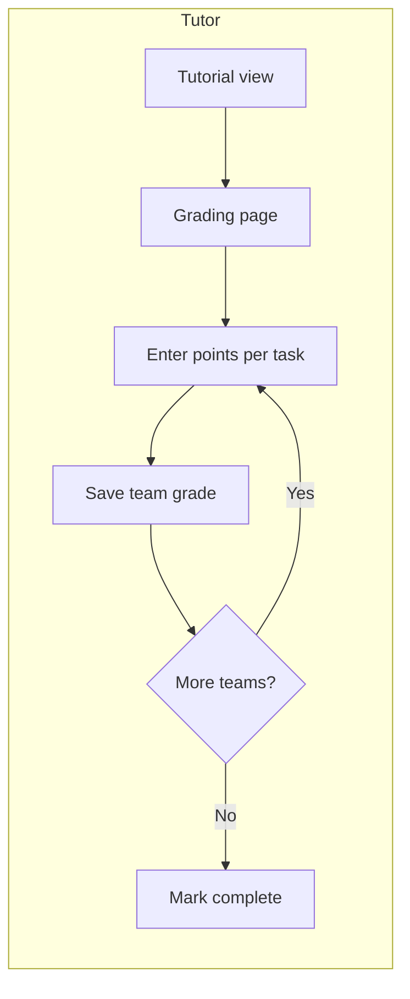

#### Controller/action mapping
| Role  | Controller                          | Actions                    | Scope                          |
|-------|-------------------------------------|----------------------------|--------------------------------|
| Tutor | [Assessment::GradingController](11-controllers.md#assessmentgradingcontroller) | show                       | Display grading table for tutorial |
| Tutor | [Assessment::GradingController](11-controllers.md#assessmentgradingcontroller) | update                     | Save points for one team (creates TaskPoints for all members) |

```admonish note "Team Grading Service"
The backend uses `Assessment::TeamGradingService` to propagate points from team input to individual `Assessment::TaskPoint` records for each team member. This ensures consistent grading within teams while maintaining per-user granularity for reporting.
```

### Assessments (Lectures - Exam Grading Workflow)

```admonish important "Phase-Based Workflow"
Exam grading uses a multi-phase workflow designed for paper-based exams where points are entered in batch, then a grade scheme is created based on the actual distribution.
```

```admonish tip "Backend Architecture"
For grade scheme data models, services, algorithms, and implementation details, see [Grading Schemes](05b-grading-schemes.md).
```

The exam grading workflow progresses through four phases:

1. **Phase 1: Point Entry** — Teachers enter task points for each student; grade column remains empty
2. **Phase 2: Distribution Analysis** — View histogram, statistics, and percentiles of achieved points
3. **Phase 3: Scheme Configuration** — Set excellence/passing thresholds or manually define grade boundaries
4. **Phase 4: Scheme Applied** — Grades auto-computed; point edits auto-update grades

#### Screens

| View        | Key elements                                        | Mockup |
|-------------|------------------------------------------------------|--------|
| Phase 1: Point Entry | Editable task point inputs; empty grade column with "—"; Grade Scheme tab disabled (tooltip: "Complete point entry first"); progress alert showing X/N graded | [Mockup](../mockups/assessments_show_exam_grading_phase1.html) |
| Phase 2: Distribution Analysis | Grade Scheme tab active with "New" badge; CSS histogram with 10 bars; statistics card (min/max/mean/median/std dev); percentiles card (10th-90th); "Create Grade Scheme" button | [Mockup](../mockups/assessments_show_exam_grading_phase2.html) |
| Phase 3: Scheme Configuration | Inline configuration card; two-mode tabs (Two-Point Auto / Manual Curve); threshold inputs (Excellence: 1.0, Passing: 4.0); "Auto-Generate Bands" button; generated bands preview table with 9 grades; pass rate calculation; "Save as Draft" button | [Mockup](../mockups/assessments_show_exam_grading_phase3.html) |
| Phase 4: Scheme Applied | Grading tab showing computed grades; grade cells have blue background with calculator icon; alert explaining auto-update behavior; all 145 students with final grades; success message with publish prompt | [Mockup](../mockups/assessments_show_exam_grading_phase4.html) |

#### Two-Point Auto Algorithm

The Two-Point Auto mode simplifies grade scheme creation:

1. Set **Excellence threshold** (e.g., 54 pts = 1.0) — Students at or above this score receive grade 1.0
2. Set **Passing threshold** (e.g., 30 pts = 4.0) — Minimum score to pass; below this is 5.0 (fail)
3. System **auto-generates** intermediate bands (1.3, 1.7, 2.0, 2.3, 3.0, 3.7) with equal intervals
4. Preview shows point ranges, student count, and percentage per grade band
5. Pass rate calculated automatically (students with 4.0 or better / total)

#### Grade Auto-Update Behavior

After applying a grade scheme:
- Grades are computed automatically from total points
- If teacher edits any task points, grade **recalculates immediately**
- Grade column shows blue background + calculator icon to indicate computed value
- Manual override possible (triggers warning, marks as overridden)

#### Flow

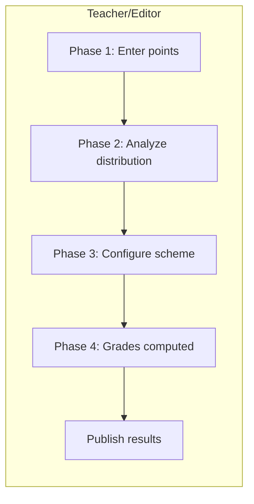

```admonish note "Single Scheme Version"
Only one active scheme exists per exam. No version history tracking. If teacher needs to adjust scheme, they edit the existing one.
```

```admonish tip "Manual Curve Mode"
For advanced users, Manual Curve mode allows direct control of each grade boundary by dragging markers on the histogram or editing the boundary table directly.
```

```admonish note "Controller Reference"
Grade scheme functionality is implemented in `GradeScheme::SchemesController` with actions: index, new, create, edit, update, preview, and apply. See [Controller Architecture](11-controllers.md#grade-scheme-controllers) for details.
```

### Assessments (Lectures - Student)

```admonish tip "Student Results Views"
Students can view their published assignment results, including overall progress and detailed feedback on individual assignments. Results are only visible after tutors publish grades.
```

#### Screens

| View | Key elements | Mockup |
|------|--------------|--------|
| Results Overview | Two-column layout: left sidebar with progress summary (large 80% display, points 192/240, graded 6/8, average 24/30), certification status card (passed/failed/pending with link to Performance Overview), filter buttons (All/Graded/Pending); right column with compact assignment list (condensed cards showing title, dates, score, view button), collapsible section for older assignments | [Mockup](../mockups/assessments_student_results_overview.html) |
| Results Detail (Assignment) | Compact single-page layout with assignment header (title, dates, grader, score 28/30), condensed team info (single row), simple task breakdown table (just task numbers and points, no descriptions or percentages), optional short tutor comment, submitted files (student's submission + tutor's correction PDF), progress sidebar (overall points 192/240, certification status), action buttons | [Mockup](../mockups/assessments_student_results_detail.html) |
| Results Detail (Exam) | Single-page layout with exam header (title, date/location, grader info). Large grade display (1.3) with pass/fail badge. Score display (55.0/60, 92%). Task breakdown table showing points per task. Full grading scheme table with your grade highlighted. Optional grader comment. Registration info. Class statistics (average, highest/lowest, pass rate). Lecture performance status sidebar. Download certificate button. | [Mockup](../mockups/exams_student_results_detail.html) |

#### Flow

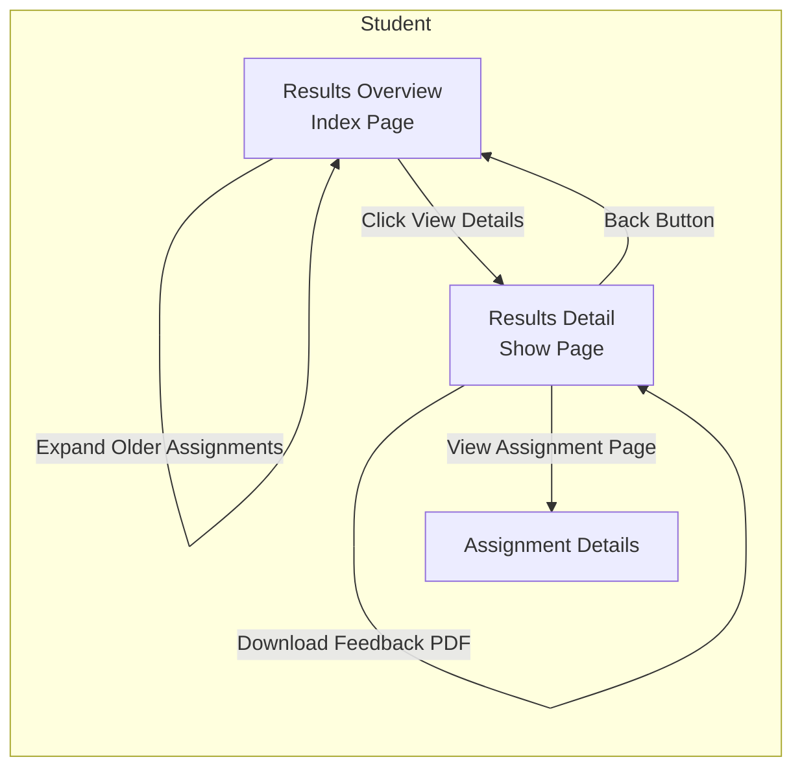

#### Controller/action mapping

| Role | Controller | Actions | Scope/Notes |
|------|------------|---------|-------------|
| Student | [Assessment::ParticipationsController](11-controllers.md#assessmentparticipationscontroller) | index, show | Own results (when published). Students can view their assignment results and detailed feedback only after tutors publish them. Results include overall progress tracking, certification status, per-task breakdown, and tutor feedback. |

### Assessments (Seminars - Teacher/Editor)

#### Screens

```admonish tip "Streamlined Grading"
Seminars show only talks with inline grading for fast workflow. Talks are created via the Content tab, not the Assessments tab.
```

| View        | Key elements                                        | Mockup |
|-------------|------------------------------------------------------|--------|
| Index (Seminar) | List of talks with inline grading; columns: Title, Speaker(s), Grade (inline dropdown), Status, Actions; no "New Assessment" button; help text: "Talks are created in the Content tab" | [Mockup](../mockups/assessments_index_seminar.html) |
| Show (Talk) | Tabbed interface (Overview/Settings/Participants); final grade display; speaker details; feedback notes | [Mockup](../mockups/assessments_show_talk.html) |

#### Flow

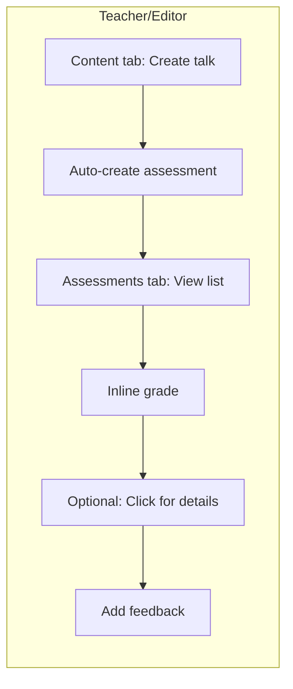

#### Controller/action mapping
| Role          | Controller                          | Actions                                           | Scope                          |
|---------------|-------------------------------------|---------------------------------------------------|---------------------------------|
| Teacher/Editor| [Assessment::AssessmentsController](11-controllers.md#assessmentassessmentscontroller)   | index, show                                       | Read-only list; inline grading |
| Teacher/Editor| [Assessment::GradingController](11-controllers.md#assessmentgradingcontroller)       | update                                            | Save inline grade              |
| Teacher/Editor| [Assessment::AssessmentsController](11-controllers.md#assessmentassessmentscontroller)   | show (detail view)                                | Add feedback notes             |
| Teacher/Editor| [Assessment::AssessmentsController](11-controllers.md#assessmentassessmentscontroller)   | publish_results                                   | Visibility lifecycle            |

```admonish warning "No Creation Actions"
Seminars do not expose `new`, `create`, or `destroy` actions in the Assessments tab. Talks (and their assessments) are managed via the Content tab.
```

## Lecture Performance & Certification

```admonish info "Context"
Lecture performance certification is a three-layer system:
1. **Records** (factual data): Points and achievements computed from assessments
2. **Evaluator** (proposals): Teacher-facing tool to generate pass/fail proposals
3. **Certification** (decisions): Teacher-approved status (passed/failed/pending)

Students can only register for exams if they have a **passed** certification.
```

### Lecture Performance (Teacher/Editor)

```admonish tip "Three Distinct Views"
Teachers interact with three separate interfaces:
1. **Performance Records** (factual data): View computed points and achievements for all students
2. **Certification Dashboard** (decision-making): Review proposals, bulk accept, manual override
3. **Rule Configuration** (criteria setup): Define thresholds for automatic proposals
```

#### Screens

| View | Key elements | Mockup |
|------|--------------|--------|
| Performance Records Index | Read-only factual data view. Table showing all lecture students (150) with columns: student name, matriculation, tutorial group, total points (computed), percentage, achievements completed (checkmarks), last computed timestamp. Filter by tutorial group. Search by name/matriculation. Recompute button (triggers background job). No override or status columns (this is pure data). Export list button. Pagination. | [Mockup](../mockups/lecture_performance_records_index.html) |
| Certification Dashboard | Decision-making interface. Summary cards (total students, passed count, failed count, pending count, stale count). Rule info alert (current thresholds: 50% points + 2 achievements). Filter buttons (All/Passed/Failed/Pending/Stale). Search by name. Table with columns: student name, matriculation, current points/achievements (from Records), proposed status (from Evaluator), certification status (from Certification table), override note (if manual), actions (Accept Proposal/Override). Bulk actions: "Accept All Proposals" button, "Mark Selected as Passed/Failed". Remediation alert if pending certifications block campaign. Export list button. Pagination. Includes manual override modal. | [Mockup](../mockups/lecture_performance_certifications_index.html) |
| Rule Configuration (inline on Lecture Settings) | Configuration card with tabs: "Percentage-based (Recommended)" and "Absolute Points". Percentage tab: min percentage input (e.g., 50%), required achievements checkboxes (with type badges). Absolute tab: min points input, achievement checkboxes. Preview button shows impact modal with summary stats. Save button. Alert: "Changing criteria will generate new proposals. Review in Certification Dashboard." | [Mockup](../mockups/lecture_performance_rule_configuration.html) |
| Rule Change Preview Modal | Triggered when saving rule changes. Side-by-side rule comparison (current vs new). Summary cards: total students, would pass (+12), would fail (-12), status changes (12). Alert: "12 students would change status". Diff table showing affected students: columns (student name, matriculation, current points/achievements, current proposal, new proposal, change indicator with arrow icon). Actions: "Apply Changes" (updates proposals only, teacher must review), "Cancel". Warning: manual overrides preserved, proposals regenerated, teacher review required. | [Mockup](../mockups/lecture_performance_rule_change_preview.html) |
| Certification Remediation Modal (finalization) | Triggered when teacher tries to finalize campaign **that has a finalization-phase lecture_performance policy** with pending certifications among confirmed registrants. Allows inline resolution of pending certifications during finalization workflow. Warning alert: "6 students have pending certifications. Resolve to continue finalization." Table showing only confirmed registrants with pending status, columns: checkbox, student name, matriculation, points, percentage, achievements, proposed status (from Evaluator), quick-resolve dropdown (pre-filled based on proposal: passed/failed), note field (optional). Bulk resolve buttons: "Mark All as Passed", "Mark All as Failed". Info alert explaining consequences (passed → added to roster, failed → auto-rejected from exam). Confirmation checkbox required to enable submit. Actions: "Cancel Finalization" (blocks finalization, returns to campaign), "Apply & Retry Finalization" (saves certifications, re-runs finalization check with auto-rejection of failed students). | [Mockup](../mockups/lecture_performance_certification_remediation.html) |

#### Flow

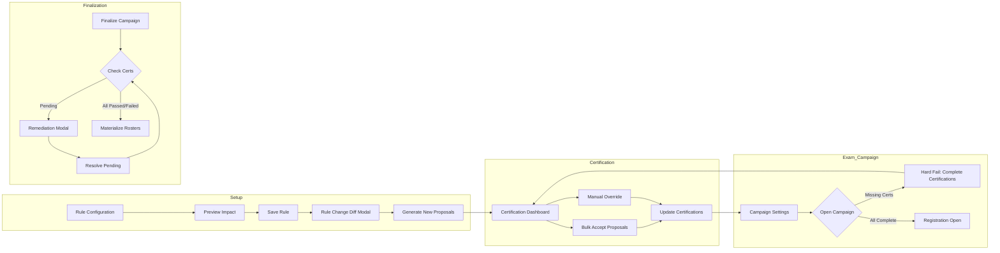

#### Controller/action mapping

| Role | Controller | Actions | Scope/Notes |
|------|------------|---------|-------------|
| Teacher/Editor | [LecturePerformance::RecordsController](11-controllers.md#lectureperformancerecordscontroller) | index, show, recompute | Read-only factual data; trigger background recomputation |
| Teacher/Editor | [LecturePerformance::CertificationsController](11-controllers.md#lectureperformancecertificationscontroller) | index, create, update, bulk_accept | Certification dashboard; bulk accept proposals; manual override with notes; remediation workflow for pending |
| Teacher/Editor | [LecturePerformance::EvaluatorController](11-controllers.md#lectureperformanceevaluatorcontroller) | bulk_proposals, preview_rule_change, single_proposal | Generate proposals (does NOT create Certifications); preview rule change impact |
| Teacher/Editor | [LecturePerformance::RulesController](11-controllers.md#lectureperformancerulescontroller) | edit, update | Configure thresholds; preview shows diff before save |

```admonish warning "Evaluator Does Not Create Certifications"
The Evaluator only generates proposals. Teachers must explicitly accept or override via the Certification Dashboard. This ensures teacher accountability for certification decisions.
```

### Lecture Performance (Student)

```admonish tip "Read-Only Performance View"
Students can view their own performance data and certification status. They cannot edit or challenge certification decisions (this must go through normal administrative channels).
```

#### Screens

| View | Key elements | Mockup |
|------|--------------|--------|
| Performance Overview | Single-student view. Summary card: total points (192/240), percentage (80%), achievements completed (3/3). Certification status badge: "Passed ✓" (green) or "Failed ✗" (red) or "Pending ⏳" (yellow). Certification date and note from teacher (if manual override). Assignment breakdown table: columns (assignment title, points earned, max points, percentage). Achievements breakdown table: columns (achievement title, status). Link to detailed assignment results. No edit actions. | [Mockup](../mockups/lecture_performance_student_overview.html) |

#### Flow

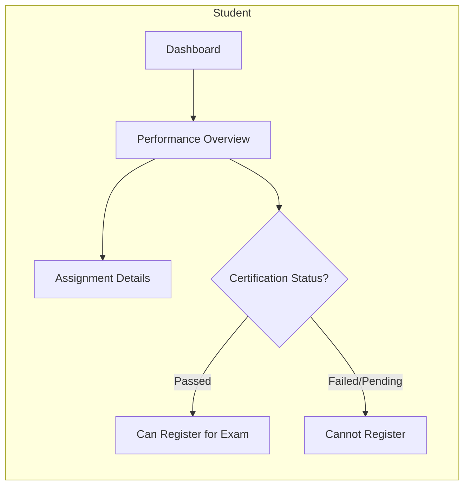

#### Controller/action mapping

| Role | Controller | Actions | Scope/Notes |
|------|------------|---------|-------------|
| Student | [LecturePerformance::RecordsController](11-controllers.md#lectureperformancerecordscontroller) | show | View own performance data (points, achievements) |
| Student | [LecturePerformance::CertificationsController](11-controllers.md#lectureperformancecertificationscontroller) | show | View own certification status (passed/failed/pending) and teacher note |

## Exams

```admonish info "Context"
Exam registration and roster management. Certification (from Lecture Performance) gates exam registration. For exam grading workflows, see [Exam Grading Workflow](#assessments-lectures---exam-grading-workflow) above.
```

### Exams (Teacher/Editor)

```admonish tip "Pre-flight Checks & Two-Modal Pattern"
Campaign opening and finalization may require certification checks depending on policy phase:

**Registration-phase policy** (rare): All lecture students must have finalized certifications before campaign can be opened. Pre-flight Error Modal blocks opening and redirects to Certification Dashboard.

**Finalization-phase policy** (standard): Students can register freely. At finalization time, confirmed registrants with pending certifications trigger Remediation Modal for inline quick-resolution. Failed certifications result in auto-rejection.

Most exams use finalization-phase policies (students register freely, certification verified before roster materialization).
```

#### Screens

| View | Key elements | Mockup |
|------|--------------|--------|
| Exams Index | Compact table with exam name, date/time, location, registered count (clickable link to roster), certification summary (passed/pending/failed counts with clickable link to Certification Dashboard), CRUD action buttons (edit/delete), summary cards (total exams, registered students count, certification status breakdown) | [Mockup](../mockups/exams_index.html) |
| Exam Roster (Post-Registration) | **Shows only registered students** who will take the exam. Summary cards (registered count: 85/150, grading progress: 12/85, auto-rejected: 3). Warning alert for auto-rejected students with link to details. Filter by tutorial group or grading status. Table with columns for each exam task showing individual points and max points, total points, student name, matriculation, tutorial group, certification status badge with manual override icon if applicable, grade, actions (Enter/Edit). View grading scheme link (opens modal showing task structure and points-to-grade conversion table). Export participant list. Link to grading interface. Pagination. Info alert clarifying this shows exam participants only, not all lecture students. | [Mockup](../mockups/exams_roster.html) |
| Campaign Pre-Flight Error Modal | Triggered when teacher tries to open campaign **that has a registration-phase lecture_performance policy** with incomplete certifications. Blocks campaign opening until all lecture students have finalized certifications. Red modal header. Danger alert: "24 students have incomplete lecture performance certifications" with explanation that all students need approved/rejected status before opening. Scrollable table (max-height 400px) showing affected students with columns (name, matriculation, performance points/percentage with icon indicating if meets threshold, status badge: Pending/Missing). Info note explaining threshold icons. Modal footer with Cancel button and "Go to Certification Dashboard" primary button linking to certification management where teacher can batch-resolve all pending certifications. | [Mockup](../mockups/campaigns_preflight_error_modal.html) |

#### Flow

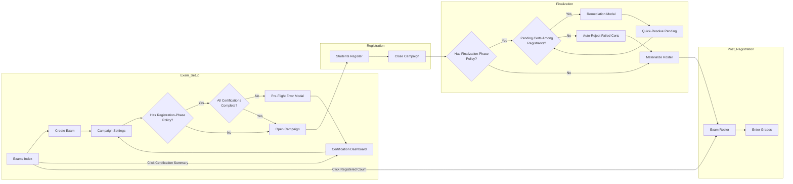

#### Controller/action mapping

| Role | Controller | Actions | Scope/Notes |
|------|------------|---------|-------------|
| Teacher/Editor | [ExamsController](11-controllers.md#examscontroller) | index, new, create, show, edit, update, destroy | Full CRUD on exams |
| Teacher/Editor | [Registration::CampaignsController](11-controllers.md#registrationcampaignscontroller) | open, finalize | Pre-flight checks for certification completeness; auto-reject failed certifications |
| Teacher/Editor | [Roster::MaintenanceController](11-controllers.md#rostermaintenancecontroller) | show, update, export | View roster (registered students only), assign rooms, export |
| Teacher/Editor | [LecturePerformance::CertificationsController](11-controllers.md#lectureperformancecertificationscontroller) | index | View certification status for campaign pre-flight checks |

### Exams (Tutor)

Tutors have read-only access if permitted by abilities.

#### Screens

| View | Key elements | Mockup |
|------|--------------|--------|
| Exams Index (Read-only) | Read-only view of exams. Info alert: "You have read-only access as a tutor". Summary cards (total exams, registered students count, certification status breakdown). Table with columns: exam name/type, date/time, location, registered count (clickable link to roster), certification summary (passed/pending/failed counts), View Details button (read-only). No CRUD actions available. | [Mockup](../mockups/exams_index_tutor.html) |
| Exam Roster (Read-only) | Read-only view of registered students. Info alert: "You have read-only access - cannot modify grades". Summary cards (registered count: 85/150, grading progress: 12/85, auto-rejected: 3). Filter by tutorial group or grading status. Table with columns for each exam task showing individual points and max points, total points, student name, matriculation, tutorial group, certification status badge with manual override icon if applicable, grade. Export list button available. No edit/enter grade actions. Pagination. Info alert clarifying shows exam participants only. | [Mockup](../mockups/exams_roster_tutor.html) |

#### Controller/action mapping

| Role | Controller | Actions | Scope/Notes |
|------|------------|---------|-------------|
| Tutor | [ExamsController](11-controllers.md#examscontroller) | index, show | Read-only (if permitted by abilities) |
| Tutor | [Roster::MaintenanceController](11-controllers.md#rostermaintenancecontroller) | show | View if permitted; no edit actions |

## Dashboards

```admonish tip "Context"
Dashboards serve as role-based landing pages providing quick access to actionable items, deadlines, and key information. For detailed architecture, see [Student Dashboard](student_dashboard.md) and [Teacher & Editor Dashboard](teacher_editor_dashboard.md).
```

### Student Dashboard

The student dashboard is the primary landing page for logged-in students, replacing the simple lecture list with a unified view of tasks, deadlines, and course progress.

#### Screens

| View | Key elements | Mockup |
|------|--------------|--------|
| Student Dashboard | Four-widget layout: **What's Next?** (urgent items: open registrations with deadline badges, assignment deadlines with due dates, Register Now/View/Submit action buttons); **My Courses** (lecture cards with progress bars, certification status badges, quick links to announcements/submissions/forum); **Recent Activity** (new grades with scores, recent announcements, View Details buttons); **My Tutoring Responsibilities** (conditional widget for student tutors showing assigned tutorial groups with links to roster and grading). Responsive grid layout. Color-coded deadline badges (red: tomorrow, yellow: 2 days, blue: future). | [Mockup](../mockups/student_dashboard.html) |

#### Flow

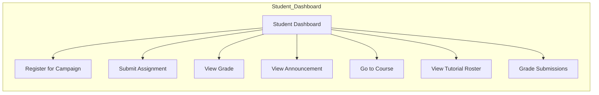

#### Controller/action mapping

| Role | Controller | Actions | Scope/Notes |
|------|------------|---------|-------------|
| Student | DashboardsController (or StudentsController) | show | Student dashboard with widgets for registrations, assignments, grades, announcements; conditional tutoring widget |

### Teacher & Editor Dashboard

The teacher/editor dashboard serves as the administrative mission control for staff managing one or more lectures.

#### Screens

```admonish tip "Context-Aware Performance Button"
The lecture admin card shows either "Points Overview" or "Certifications" depending on semester phase:

- **Start of semester / mid-semester:** "Points Overview" links to Performance Records (read-only factual data for monitoring progress)
- **End of semester (active exam campaign with certification policy):** "Certifications" links to Certification Dashboard (decision-making interface for issuing certifications)

The button displays a pending count badge when certifications require teacher review.
```

| View | Key elements | Mockup |
|------|--------------|--------|
| Teacher & Editor Dashboard (End of Semester) | Four-widget layout: **My Lectures** (1 lecture + 2 seminars; action buttons for campaigns, rosters, assessments, certifications, forum, comments, announcements); **Active Campaigns** (1 exam registration campaign); **My Tutoring Responsibilities** (conditional widget). Lecture shows finalized rosters, 1 active exam campaign, "Certifications" button with "6 pending" badge, moderate forum/comment activity. Seminars show closed campaigns, enrolled students, pending talk grades. | [Mockup](../mockups/teacher_editor_dashboard.html) |
| Teacher & Editor Dashboard (Start of Semester) | Four-widget layout: **My Lectures** (1 lecture + 2 seminars; same action buttons); **Active Campaigns** (tutorial registration + 2 seminar participant selections, all open); **My Tutoring Responsibilities** (conditional widget). Lecture shows draft rosters, active tutorial campaign, "Points Overview" button (no badge). Seminars show active campaigns, draft rosters, no talks graded yet, minimal forum/comment activity. | [Mockup](../mockups/teacher_editor_dashboard_start_of_semester.html) |

#### Flow

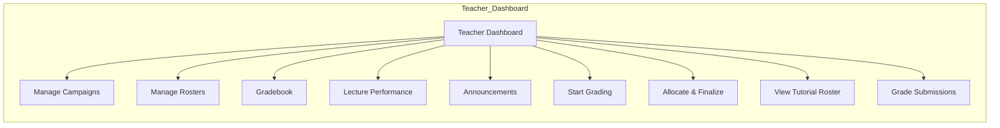

#### Controller/action mapping

| Role | Controller | Actions | Scope/Notes |
|------|------------|---------|-------------|
| Teacher/Editor | DashboardsController (or TeachersController) | show | Teacher dashboard with widgets for lectures, campaigns, grading queue; conditional tutoring widget |
