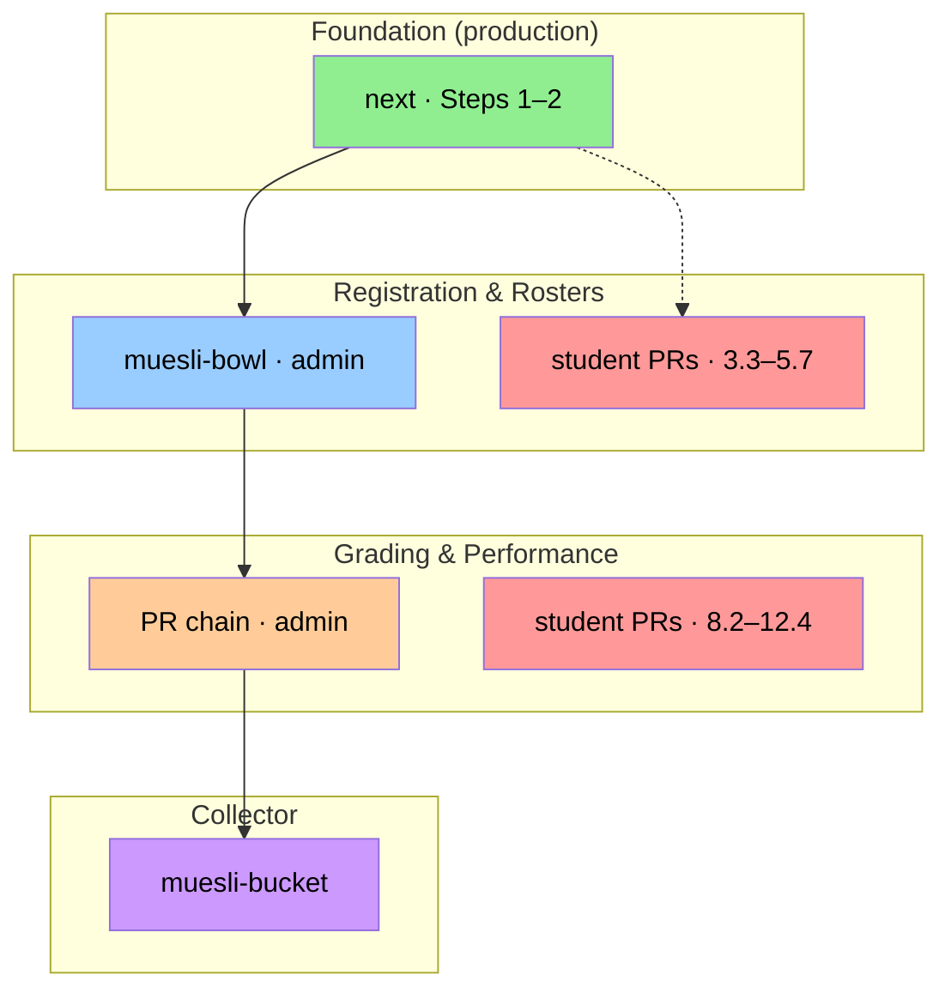
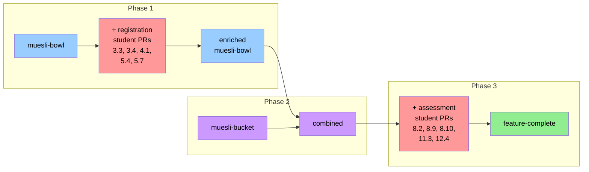
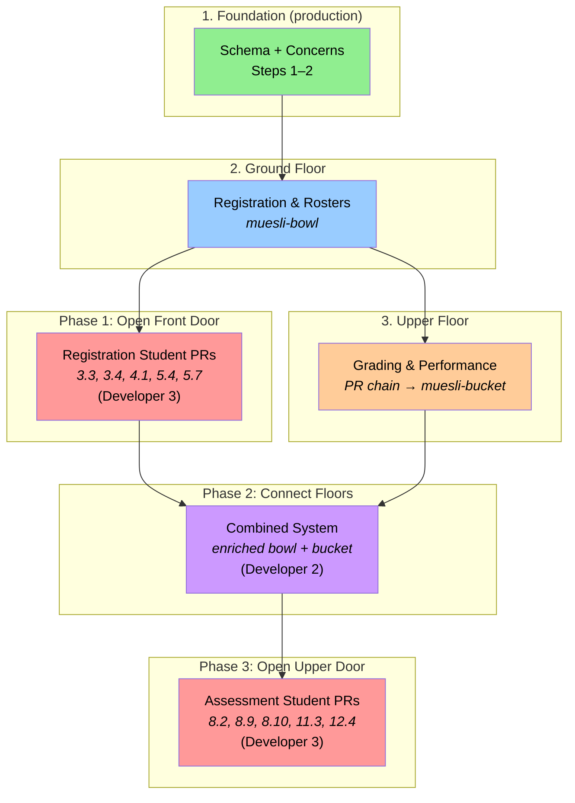

# Integration Strategy

This chapter describes the current state of the Müsli implementation
and the plan for integrating everything into a single deliverable.

## How the Code Was Built

The Müsli implementation grew as a single linear stack: each layer
builds on the one below it. Three developers work on the system:

- **Developer 1** worked linearly through the admin-facing PRs:
  first Layer 2 (registration & rosters), then Layer 3 (grading &
  performance) on top.
- **Developer 2** ("the closer") refines the collector branches and
  handles integration.
- **Developer 3** worked on the student-facing PRs in parallel with
  Developer 1: the registration student PRs (3.3–5.7) while
  Developer 1 was building Layer 2, and the assessment student PRs
  (8.2–12.4) while Developer 1 was building Layer 3.

### Layer 1: Foundation (production)

Steps 1–2 are merged into `next` and deployed. These provide the
schema foundations (models, migrations, concerns) that everything else
builds on.

### Layer 2: Registration & Rosters (`muesli-bowl`)

`muesli-bowl` is a **collector branch** where Developer 1 aggregated
all admin-facing registration and roster PRs:

| PR | Title |
|----|-------|
| 3.1 | Admin campaigns scaffold |
| 3.2 | Admin items CRUD |
| 4.3 | Solver + finalize |
| 4.3a | Solver sub-PR |
| 4.3b | Solver sub-PR |
| 5.1a | Roster maintenance UI (a) |
| 5.1b | Roster maintenance UI (b) |
| 5.1c | Roster maintenance UI (c) |
| 5.2 | Lecture roster superset |
| 5.3a | Self-materialization (a) |
| 5.3b | Self-materialization (b) |
| 5.8 | Integrity job |

Developer 2 is actively refining this branch.

### Layer 3: Grading & Performance (PR chain)

Built **on top of** `muesli-bowl` (branching from 5.8), Developer 1
continued with all admin-facing assessment, grading, and student
performance PRs as a linear chain of branches:

| PR | Branch | Title |
|----|--------|-------|
| 6.1 | `muesli/assessment-foundations` | Assessment schema |
| 7.1 | `muesli/assessable-concern` | Assessment backend |
| 7.2 | `muesli/assessment-crud` | Assessment CRUD UI |
| 8.1 | `muesli/exam-foundations` | Exam model + teacher UI |
| 8.3 | `muesli/read-only-grades` | Read-only grade view |
| 8.4 | `muesli/read-only-points` | Read-only point grid |
| 8.5 | `muesli/participation-creation` | Participation lifecycle |
| 9.1 | `muesli/grade-scheme-foundations` | Grade scheme schema |
| 9.2 | `muesli/grade-scheme-applier` | Grade scheme service |
| 9.3 | `muesli/grade-scheme-ui` | Grade scheme UI |
| 10.1 | `muesli/performance-foundations` | Performance schema |
| 10.2 | `muesli/performance-services` | Computation + evaluator |
| 10.3 | `muesli/performance-read-only-endpoints` | Read-only performance UI |
| 10.4 | `muesli/certifications` | Certifications + rules edit |
| 11.1 | `muesli/performance-policy` | Policy engine integration |
| 12.1 | `muesli/achievement-crud` | Achievement CRUD |
| 12.2 | `muesli/read-only-achievements` | Read-only marking view |
| 12.3 | `muesli/achievement-certifications` | Achievement → performance |

The tip of this chain (`muesli/achievement-certifications`) contains
the cumulative result of all 18 PRs on top of `muesli-bowl`.

### `muesli-bucket`: the full admin collector

`muesli-bucket` is a collector branch that packages `muesli-bowl`
together with the entire grading PR chain. Since the chain was built
on top of `muesli-bowl`, `muesli-bucket` essentially equals the tip
of the chain — it contains all admin-facing functionality from
Steps 3 through 12.

### Student-facing PRs (Developer 3)

Developer 3 built the student-facing counterparts in parallel with
Developer 1. These PRs fall into two groups that mirror the two
admin layers:

**Registration student PRs** — built while Developer 1 was working
on Layer 2:

| PR | Title |
|----|-------|
| 3.3 | Student register (single-item FCFS) |
| 3.4 | Student register (multi-item FCFS) |
| 4.1 | Student preference ranking UI |
| 5.4 | Self-materialization UI (student) |
| 5.7 | Roster change notifications |

**Assessment student PRs** — built while Developer 1 was working
on Layer 3:

| PR | Title |
|----|-------|
| 8.2 | Exam registration (student-facing) |
| 8.9 | Student results interface |
| 8.10 | Publish/unpublish results |
| 11.3 | Eligibility UI integration |
| 12.4 | Student achievement progress view |

## The Full Picture

## Integration Plan

Integration happens in three phases. Each phase adds a layer of
student-facing functionality on top of the admin infrastructure.

### Phase 1: Registration student PRs → `muesli-bowl`

Developer 2 integrates the **registration student PRs** into
`muesli-bowl`. These PRs give students the ability to register for
tutorials and express preferences — the counterpart to the admin
campaign and roster management that already exists:

- **3.3** — Student register (single-item FCFS)
- **3.4** — Student register (multi-item FCFS)
- **4.1** — Student preference ranking UI
- **5.4** — Self-materialization UI (student join/leave)
- **5.7** — Roster change notifications

After this phase, `muesli-bowl` covers the complete registration and
roster story end-to-end: admin setup through student interaction.

### Phase 2: Enriched bowl → `muesli-bucket`

The enriched `muesli-bowl` (now including student registration) is
combined with `muesli-bucket` (which already contains all the grading
and performance admin PRs). This produces a branch that has the full
admin + student registration system plus the full admin grading system.

### Phase 3: Assessment student PRs → final

The **assessment student PRs** are integrated into the combined result:

- **8.2** — Exam registration (student-facing)
- **8.9** — Student results interface
- **8.10** — Publish/unpublish results
- **11.3** — Eligibility UI integration
- **12.4** — Student achievement progress view

After this phase, the system is feature-complete for the current
roadmap scope.

## Mental Model

Think of it as building a house:

1. **Foundation** (Steps 1–2, `next`): the shared schema and concerns
   that everything rests on. Already in production.

2. **Ground floor** (`muesli-bowl`): the registration office —
   campaigns, rosters, allocation. Everything about *who goes where*.
   Developer 1 built this; Developer 2 is refining it.

3. **Upper floor** (PR chain → `muesli-bucket`): the grading office —
   assessments, points, grades, schemes, performance rules,
   certifications. Everything about *how students are evaluated*.
   Developer 1 built this on top of the ground floor.

4. **Open the front door** (Phase 1): let students into the ground
   floor — they can register for tutorials, express preferences,
   join/leave groups. These are the **registration student PRs**
   built by Developer 3.

5. **Connect the floors** (Phase 2): merge the enriched ground floor
   with the upper floor into one building.

6. **Open the upper door** (Phase 3): let students into the upper
   floor — they can register for exams, view their grades and results,
   check eligibility, and track achievements. These are the
   **assessment student PRs** built by Developer 3.

