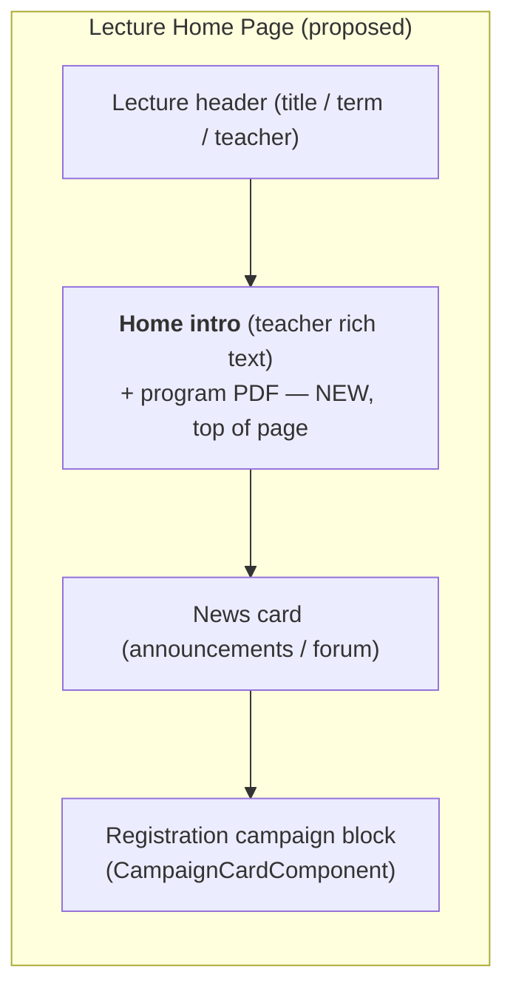

# Lecture Home Page

## Problem Overview

Every lecture exposes two front-facing pages:

- the **content page** — `GET /lectures/:id` (`LecturesController#show`), the media/outline catalog (chapters → sections → media); and
- the **lecture home page** — `GET /lectures/:id/home` (`Lectures::HomeController#show`), the newer per-lecture "front door" that hosts news and the registration workflow.

Which one a user first lands on is decided by a single subscription check in `LecturesController#check_for_subscribe`:

```ruby
# filepath: app/controllers/lectures_controller.rb
def check_for_subscribe
  return if @lecture.in?(current_user.lectures)   # subscribed  → content page
  return if current_user.can_edit?(@lecture)      # staff       → content page
  redirect_to lecture_home_path(@lecture)         # everyone else → lecture home
end
```

This uses *"are you subscribed?"* as a proxy for two unrelated questions — **do you have content access?** and **which page should be your home base?** Conflating them produces three concrete problems:

1. **Freshly subscribed → empty content page.** The moment a `LectureUserJoin` exists, the user is routed to the content page unconditionally, even when the lecture has no released media yet. New subscribers can land on a blank catalog.
2. **Subscribers stop seeing registration updates.** Subscription permanently routes past the home page, but the registration campaign block lives *only* on the home page. A subscriber never revisits it, so time-sensitive changes there — e.g. a spot freeing up in an open first-come campaign, or a self-materialization slot opening after finalization — go unnoticed.
3. **The home page is thin.** It renders only a header, a news card (announcements/forum, and only when non-empty), a subscribe hint, and the registration block. It carries **no teacher-authored content**, so outside an open campaign or a fresh announcement it is nearly empty — even though it is the very page prospective students see *before* deciding to subscribe or register.

```admonish note "Root cause"
The home page isn't rich enough to be worth returning to, and the routing
treats "subscribed" as "always skip home." The three symptoms above are two
sides of the same gap.
```

## Current State (as implemented)

The lecture home page (`app/frontend/lectures/home/lecture_home.html.erb`, rendered by `Lectures::HomeController`) is composed of:

| Section | Shown when | Source |
|---|---|---|
| Lecture header (title/term, teacher, edit pencil) | always | `@lecture`, staff for the pencil |
| News card (announcements + unread forum) | there is news | `lectures/show/_news_card` |
| Subscribe hint (+ passphrase field) | non-subscriber, non-staff | `@passphrase_required` |
| Registration workflow block (campaigns) | `@show_workflow_content` | `user_registrations/_user_registration` → `CampaignCardComponent` |
| "Start here" fallback card | nothing else to show | locale `lecture.home.empty_*` |

Access to the page is governed by `RegistrationUserRegistrationAbility` (`can :index, Lecture` for published lectures, plus staff/admin), and registration is deliberately **decoupled** from content access (subscription).

The only existing teacher-editable rich text on a lecture, `Lecture#organizational_concept` (a Trix field), is surfaced on a *separate* organizational page (`lecture_organizational_path`), **not** on the home page.

## Solution: A Richer Front Door

Give teachers a dedicated place to author a short welcome / organizational note and attach a program (e.g. a seminar schedule as a PDF), rendered at the **top of the lecture home page, above the registration block**, and only when filled in.

Concretely, for a seminar a teacher could write a few introductory words, explain that a registration is running, and attach the seminar program — with the live campaign shown directly below.

### Data model

```admonish info "New fields on Lecture"
- `home_intro` — a Trix **rich-text** column (`t.text "home_intro"`) for a short
  welcome / organizational note.
- `home_attachment` — an **optional PDF** managed by a Shrine uploader
  (`t.text "home_attachment_data"`), for a course/seminar program.
```

The PDF reuses the established Shrine pattern — the most recent, self-contained example is `StudentMessageUploader` (the campaign-mail attachment):

```ruby
# filepath: app/uploaders/lecture_home_attachment_uploader.rb  (mirror of StudentMessageUploader)
class LectureHomeAttachmentUploader < Shrine
  MAX_SIZE = 10 * 1024 * 1024
  plugin :determine_mime_type, analyzer: :marcel
  plugin :validation_helpers
  Attacher.validate do
    validate_min_size 1
    validate_max_size MAX_SIZE
    validate_mime_type_inclusion(["application/pdf"])
  end
end

# filepath: app/models/lecture.rb
include LectureHomeAttachmentUploader[:home_attachment]
```

```admonish tip "Why a dedicated field, not organizational_concept?"
`organizational_concept` already owns the organizational page and tends to hold
long, formal content. A separate `home_intro` keeps the two purposes distinct: a
short front-door welcome vs. a full organizational write-up. It avoids
double-booking one field across two pages and lets each evolve independently.
```

### Rendering

- A new block at the top of `lecture_home.html.erb`, above the registration workflow, rendering `sanitize(lecture.home_intro)` and, if attached, a download link/preview for `home_attachment`.
- The block renders **only when at least one of the two is present**, so an unused feature never adds an empty card (consistent with how the news card and campaign block already gate themselves).
- Editing happens in the existing lecture edit UI (a Trix editor for `home_intro` and a `file_field ..., accept: "application/pdf"` for the attachment), mirroring `app/frontend/lectures/edit/_organizational_concept.html.erb` and `_student_mail.html.erb`.

```admonish note "Implemented approach"
- **Authoring** lives in a dedicated **"Home" tab** on the lecture edit page
  (`app/frontend/lectures/edit/_home.html.erb`), kept distinct from the "Orga"
  tab so `home_intro` and `organizational_concept` don't get confused.
- **Feedback / nudge** is the *cheaper* variant: the home page renders the
  intro (or a staff-only empty-state placeholder — stronger when a campaign is
  live) with an edit pencil that **jumps to the Home tab**, rather than full
  inline WYSIWYG editing on the page itself. WYSIWYG stays a later upgrade if
  this proves insufficient.
- The PDF is streamed by an authorized `Lectures::HomeController#attachment`
  action (`send_data`), gated exactly like the home page.
```

This also improves the page for the audience that currently sees the thinnest version of it — **prospective students**, for whom the home page is the "shop window" that informs the decision to subscribe or register.

## Landing Logic (companion improvements)

The content enhancement above makes the home page worth landing on. Two small, optional routing corrections address the routing half of the problem without a rewrite:

1. **Never route to an empty content page.** In `check_for_subscribe`, if the content page would be empty (no released content yet), prefer the home page even for subscribers. There is precedent for state-driven landing: `Lecture#organizational_on_top` already flips the content page to organizational-first.
2. **Surface registration activity to subscribers.** The lecture sidebar already links to Home, so the gap is *discovery*, not reachability. A badge/banner on the content page (or a notification — the notification system already deep-links to `lecture_home`) can point subscribers back to Home when there is a live reason to look.

```admonish warning "Scope the 'spot freed up' nudge"
Spots only meaningfully "free up" in specific states: during an **open
first-come campaign**, or **after finalization when self-materialization
(add) is enabled**. The nudge should be conditional on those states, not
always-on.
```

```admonish note "A teacher 'which page is the front' toggle — deliberately omitted"
A per-lecture flag to swap the default landing is technically easy (again,
`organizational_on_top` is the precedent) but risks disorienting students when
flipped mid-semester ("where did my content go?"). Prefer letting the
**lifecycle** drive it — home during the registration/pre-semester phase,
content once the student is subscribed *and* content exists — over a manual
whole-page swap. If teacher control is ever wanted, scope it to "pin a home
banner," not "swap the landing page."
```

## Relationship to the Student Dashboard

This feature is intentionally **interim**: it improves the per-lecture experience *before* the [Student Dashboard](student_dashboard.md) exists, and it remains useful *after* the dashboard ships. The two occupy different levels of the information architecture:

| | **Student Dashboard** (future) | **Lecture Home Page** (this) |
|---|---|---|
| Scope | **Cross-lecture** — the global landing that replaces `main/start` | **Per-lecture** — one lecture's front door |
| Role | Aggregates *"where is activity?"* across all courses (the "What's Next?" widget lists open `Registration::Campaign`s and deadlines) | Hosts the *actual* per-lecture intro, program, and campaign UI |
| Direction | Points **into** lectures (deep-links to a campaign / lecture home) | Is a **destination** those links resolve to |

```admonish info "Division of responsibility"
The dashboard answers *"which of my lectures need my attention right now?"* and
links inward. The lecture home page answers *"what is this lecture about, and
what do I do here?"* — the welcome text, the program PDF, and the live campaign
live here, not on the dashboard.
```

Consequences for sequencing:

- **Durable now, safe to build:** the `home_intro` + PDF content is purely per-lecture and is **not** obsoleted by the dashboard — it is exactly the destination the dashboard's "What's Next?" links will resolve to.
- **Keep light:** the "registration activity" nudge (companion improvement #2) is genuinely centralized by the dashboard later. Build only a per-lecture banner now; do **not** invest in cross-lecture registration-status machinery — that is the dashboard's job (see the dashboard's [phased plan](student_dashboard.md#6-phased-implementation-strategy), Phase B "Open Registrations" widget).
- **Superseded later:** any manual "front page" toggle would be superseded by the dashboard + lifecycle routing, which is a further reason to omit it.

```admonish tip "One-line summary"
Make the lecture home page a genuine front door (teacher intro + program +
campaign), and stop treating "subscribed" as "always skip home." The dashboard
will later own the cross-lecture overview; the lecture home page stays the
per-lecture destination it links to.
```

## Layout sketch



## Key references

- Routing gate: `app/controllers/lectures_controller.rb` (`check_for_subscribe`)
- Home page: `app/controllers/lectures/home_controller.rb`, `app/frontend/lectures/home/lecture_home.html.erb`
- Home page access gate: `app/abilities/registration_user_registration_ability.rb` (`can :index, Lecture`)
- Existing teacher rich text (separate page): `app/frontend/lectures/edit/_organizational_concept.html.erb`, `app/frontend/lectures/organizational/_organizational.html.erb`
- PDF-attachment pattern to mirror: `app/uploaders/student_message_uploader.rb`, `app/frontend/lectures/edit/_student_mail.html.erb`
- Front-door copy: `config/locales/registration/en.yml` (`lecture.home.*`)
- Future landing: [Student Dashboard](student_dashboard.md)
