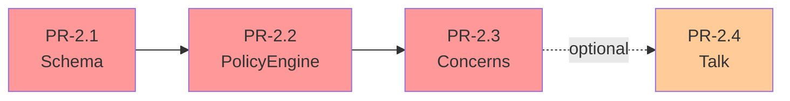
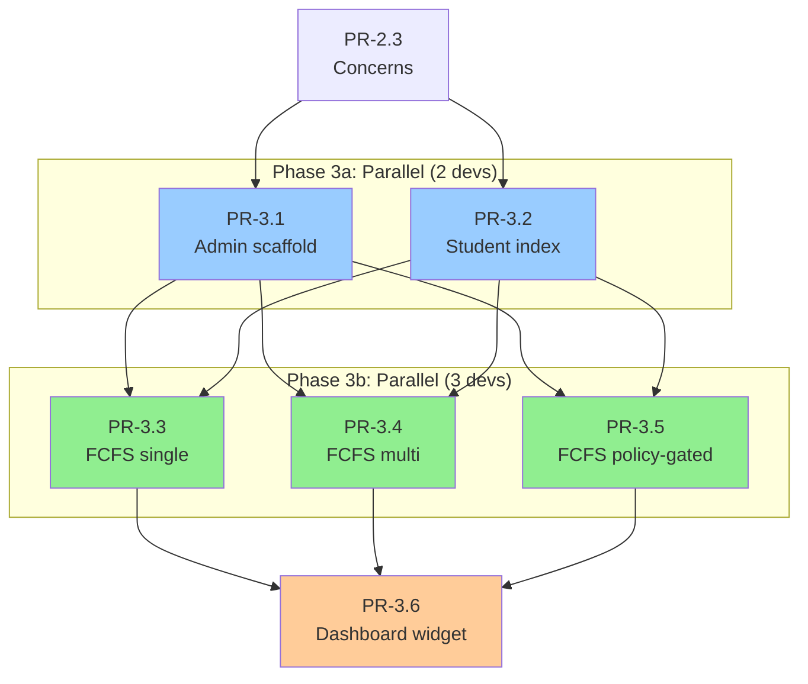
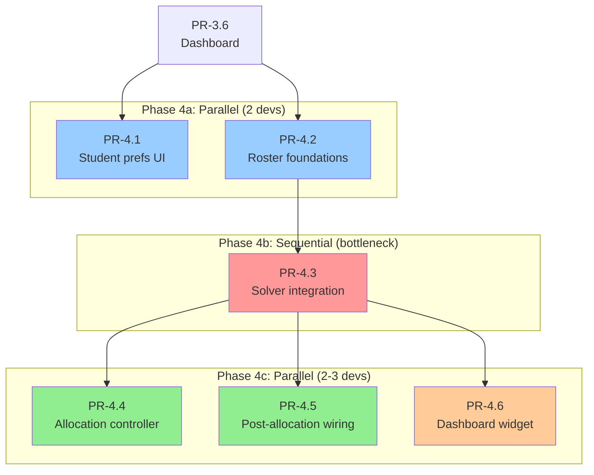
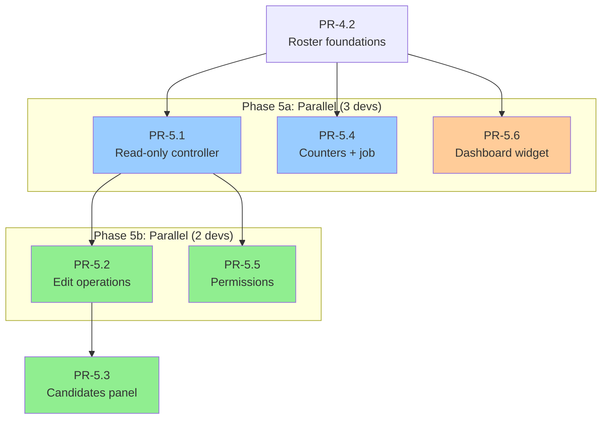
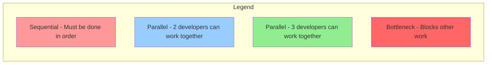
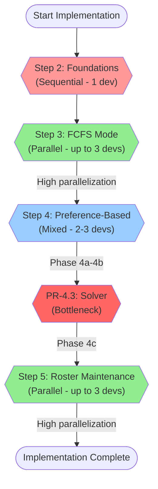

# Parallelization Strategy

This chapter outlines how multiple developers can work on the
Implementation Plan simultaneously. It identifies parallelization
opportunities, conflict hotspots, and coordination strategies for
efficient team collaboration.

```admonish success "High Parallelization Potential"
Steps 3 (FCFS mode) and 5 (Roster maintenance) allow up to 3 developers
to work concurrently on independent PRs.
```

## Overview

The Implementation Plan consists of 14 steps across 4 phases. Some steps
must be sequential due to hard dependencies, while others can be highly
parallelized. With a 3-developer team, strategic work distribution can
significantly reduce total implementation time.


## Step-by-Step Parallelization

### Step 2: Foundations (Sequential)

**Parallelization level:** 1 developer (sequential)

**Sequence:**
1. PR-2.1 (Schema) → PR-2.2 (PolicyEngine) → PR-2.3 (Concerns)

**Why sequential?** Each PR builds directly on the previous. The schema
must exist before the PolicyEngine can reference it; concerns depend on
schema models.

**Optional parallel work:**
- PR-2.4 (Talk as Registerable) can proceed after PR-2.3 if seminars
  are in scope for MVP.



---

### Step 3: FCFS Mode (High Parallelization)

**Parallelization level:** Up to 3 developers

#### Phase 3a: Admin & Student Foundations

**Parallel tracks (2 developers):**

| Track | PR | Developer Focus |
|-------|-----|----------------|
| A | PR-3.1 | Admin scaffold (campaigns/policies CRUD) |
| B | PR-3.2 | Student index (tabs/filters) |

**Prerequisites:** PR-2.3 must be merged.

**Why parallel?** Both PRs implement different controllers
(`CampaignsController` vs `UserRegistrationsController`) with no shared
code paths.

**Merge order:** Either can merge first; no dependencies between them.

#### Phase 3b: Student FCFS Flows

**Parallel tracks (3 developers):**

| Track | PR | Flow Type |
|-------|-----|-----------|
| A | PR-3.3 | FCFS single-item campaigns |
| B | PR-3.4 | FCFS multi-item picker |
| C | PR-3.5 | FCFS policy-gated registration |

**Prerequisites:** PR-3.1 and PR-3.2 merged.

**Why parallel?** All three implement different branches of
`UserRegistrationsController#show` logic. They share the controller file
but modify different action branches based on campaign configuration.

**Conflict management:**
- Each PR adds distinct routes (`register_single`, `register_multi`, `check_policies`)
- Shared private methods (`ensure_eligible!`, `enforce_capacity!`) can
  be extracted by the first PR to merge
- Last PR to merge handles route file conflicts (rebase before merge)

**Merge strategy:** Flexible order; coordinate in daily standup.



#### Phase 3c: Dashboard Integration

**Single track:**

| PR | Dependencies |
|----|--------------|
| PR-3.6 | Any student flow PR (3.3, 3.4, or 3.5) merged |

---

### Step 4: Preference-Based (Mixed Parallelization)

**Parallelization level:** 2-3 developers depending on phase

#### Phase 4a: UI & Persistence Foundations

**Parallel tracks (2 developers):**

| Track | PR | Purpose |
|-------|-----|---------|
| A | PR-4.1 | Student preference ranking UI |
| B | PR-4.2 | Roster foundations (models + service) |

**Prerequisites:** Step 3 complete.

**Why parallel?** PR-4.1 uses the stubbed `materialize_allocation!`
interface from PR-2.3. PR-4.2 implements the real roster persistence.
They don't conflict because PR-4.1 only reads the interface.

**Optional parallel work:**
- Developer C can research solver libraries (MCMF vs CP-SAT) and draft
  PR-4.3 structure.

#### Phase 4b: Solver Integration (Sequential Bottleneck)

**Single track (1 developer):**

| PR | Dependencies |
|----|--------------|
| PR-4.3 | PR-4.2 must be merged (needs roster persistence) |

**Why sequential?** The solver's `finalize!` method calls
`materialize_allocation!`, which writes to roster tables created in
PR-4.2. This is a hard dependency.

**Parallel work during PR-4.3:**
- Developer B: Draft views for PR-4.4 (allocation controller UI)
- Developer C: Write integration test suite for allocation flow

#### Phase 4c: Allocation UI & Wiring

**Parallel tracks (2-3 developers):**

| Track | PR | Dependencies |
|-------|-----|--------------|
| A | PR-4.4 | PR-4.3 merged |
| B | PR-4.5 | PR-4.3 merged (can draft in parallel with 4.4) |
| C | PR-4.6 | Independent (dashboard widget) |

**Why parallel?** PR-4.4 adds teacher UI for allocation operations.
PR-4.5 wires student-facing result views. PR-4.6 is an isolated
dashboard widget. Minimal overlap.

**Merge order:** PR-4.4 → PR-4.5 → PR-4.6 (preferred but flexible).



---

### Step 5: Roster Maintenance (High Parallelization)

**Parallelization level:** Up to 3 developers

#### Phase 5a: Foundation Work

**Parallel tracks (3 developers):**

| Track | PR | Purpose |
|-------|-----|---------|
| A | PR-5.1 | Read-only roster controller + views |
| B | PR-5.4 | Counters + integrity job |
| C | PR-5.6 | Dashboard widget (manage rosters) |

**Prerequisites:** PR-4.2 merged (roster infrastructure exists).

**Why parallel?** All three read from roster tables but don't modify
them. PR-5.1 displays rosters, PR-5.4 counts participants, PR-5.6 shows
summary stats. No write conflicts.

**Merge order:** Flexible; PR-5.1 should merge first to unblock Phase 5b.

#### Phase 5b: Operations & Permissions

**Parallel tracks (2 developers):**

| Track | PR | Purpose |
|-------|-----|---------|
| A | PR-5.2 | Edit operations (remove/move) |
| B | PR-5.5 | Permissions + tutor read-only variant |

**Prerequisites:** PR-5.1 merged.

**Why parallel?** PR-5.2 adds controller actions for edit operations.
PR-5.5 adds authorization rules (abilities) and conditional UI. Low
conflict risk because they touch different layers.

**Merge order:** Either can merge first.

**Parallel draft work:**
- Developer C: Start PR-5.3 draft (candidates panel) while waiting for
  PR-5.2.

#### Phase 5c: Candidates Panel

**Single track:**

| PR | Dependencies |
|----|--------------|
| PR-5.3 | PR-5.2 merged (needs edit operations to assign candidates) |



---

## Conflict Hotspots

When multiple developers work in parallel, watch these files for merge
conflicts:

### 1. Routes (`config/routes.rb`)

**Why conflicts occur:** Multiple PRs add new routes to the same
namespace.

**Mitigation strategies:**
- **Designate a "routes owner":** One developer handles all route-related
  conflicts during merge.
- **Use consistent formatting:** Follow Rails conventions for namespace
  blocks and member/collection actions.
- **Rebase frequently:** Pull latest `main` daily before pushing.
- **Coordinate merge order:** Agree in standup which PR merges first.

**Example conflict scenario:**
```ruby
# PR-3.3 adds:
post :register_single

# PR-3.4 adds (same location):
post :register_multi
```

**Resolution:** Both lines coexist; just order them consistently.

---

### 2. Abilities (`app/models/ability.rb`)

**Why conflicts occur:** Multiple PRs add authorization rules to the same
file or concern.

**Mitigation strategies:**
- **Split into concerns:** Create `app/abilities/registration_ability.rb`
  and `app/abilities/roster_ability.rb` to separate workstreams.
- **Use section comments:** Clearly mark sections like `# Registration — FCFS mode`
- **Group related rules:** Keep all rules for one controller together.

**Recommended structure:**
```ruby
# app/models/ability.rb
class Ability
  include CanCan::Ability
  include RegistrationAbility
  include RosterAbility
  include AssessmentAbility
  # ...
end
```

---

### 3. Dashboard Components

**Why conflicts occur:** PRs 3.6, 4.6, 5.6 all add widgets to dashboard
views.

**Mitigation strategies:**
- **Use separate component files:** Each widget is its own component
  (`OpenRegistrationsCard`, `AllocationResultsCard`,
  `ManageRostersCard`).
- **Feature flag each widget:** Enables independent testing without UI
  conflicts.
- **Merge in sequence when possible:** 3.6 → 4.6 → 5.6 minimizes conflicts
  in the main dashboard layout file.

---

### 4. UserRegistrationsController

**Why conflicts occur:** PRs 3.3, 3.4, 3.5 all modify the same controller.

**Mitigation strategies:**
- **Keep actions separate:** Each PR implements distinct actions or
  branches (`if campaign.single_item?` vs `if campaign.requires_preferences?`)
- **Extract shared methods early:** The first PR to merge should extract
  helpers like `ensure_eligible!`, `enforce_capacity!`,
  `build_registration_context`.
- **Coordinate merge order:** Agree which PR merges first; others rebase
  and adopt the extracted methods.

**Example of method extraction:**
```ruby
# First PR to merge extracts:
private

def ensure_eligible!(campaign)
  result = Registration::PolicyEngine.call(campaign, current_user)
  redirect_to(...) unless result.pass?
end
```

Later PRs reuse this method instead of duplicating logic.

---

## Parallelization Summary

**Key insight:** Steps 3 and 5 are highly parallelizable. Step 4 has a
bottleneck at PR-4.3 (solver integration) but allows parallelization
before and after.





