# Parallelization Strategy

This chapter outlines how multiple developers can work on the
Implementation Plan simultaneously. It identifies parallelization
opportunities, conflict hotspots, and coordination strategies for
efficient team collaboration.

```admonish success "High Parallelization Potential"
Steps 3 (FCFS mode) and 5 (Roster maintenance) allow up to 3 developers
to work concurrently on independent PRs.
```

## Overview

The Implementation Plan consists of 14 steps across 4 phases. Some steps
must be sequential due to hard dependencies, while others can be highly
parallelized. With a 3-developer team, strategic work distribution can
significantly reduce total implementation time.


## Step-by-Step Parallelization

### Step 2: Foundations (Sequential)

**Parallelization level:** 1 developer (sequential)

**Sequence:**
1. PR-2.1 (Schema) → PR-2.2 (PolicyEngine) → PR-2.3 (Concerns)

**Why sequential?** Each PR builds directly on the previous. The schema
must exist before the PolicyEngine can reference it; concerns depend on
schema models.

**Optional parallel work:**
- PR-2.4 (Talk as Registerable) can proceed after PR-2.3 if seminars
  are in scope for MVP. Talk registration follows the same pattern as
  Tutorial registration and can be implemented by a second developer in
  parallel with Tutorial-focused PRs in Step 3.

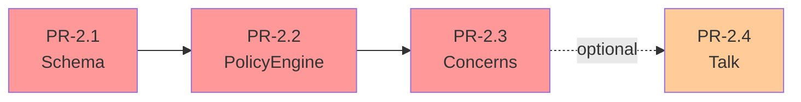

---

### Step 3: FCFS Mode (High Parallelization)

**Parallelization level:** Up to 3 developers

#### Phase 3a: Admin & Student Foundations

**Parallel tracks (2 developers):**

| Track | PR | Developer Focus |
|-------|-----|----------------|
| A | PR-3.1 | Admin scaffold (campaigns/policies CRUD) |
| B | PR-3.2 | Student index (tabs/filters) |

**Prerequisites:** PR-2.3 must be merged.

**Why parallel?** Both PRs implement different controllers
(`CampaignsController` vs `UserRegistrationsController`) with no shared
code paths.

**Merge order:** Either can merge first; no dependencies between them.

#### Phase 3b: Student FCFS Flows

**Parallel tracks (2 developers):**

| Track | PR | Flow Type |
|-------|-----|-----------|
| A | PR-3.3 | FCFS single-item campaigns |
| B | PR-3.4 | FCFS multi-item picker |

**Prerequisites:** PR-3.1 and PR-3.2 merged.

**Why parallel?** Both implement different branches of
`UserRegistrationsController#show` logic. They share the controller file
but modify different action branches based on campaign configuration.

**Conflict management:**
- Each PR adds distinct routes (`register_single`, `register_multi`)
- Shared private methods (`ensure_eligible!`, `enforce_capacity!`) can
  be extracted by the first PR to merge
- Last PR to merge handles route file conflicts (rebase before merge)

**Merge strategy:** Flexible order; coordinate in daily standup.

```admonish warning "Exam registration deferred"
PR-3.5 (policy-gated exam registration) has been moved to Step 12. Step 3
focuses on tutorial and talk registration only.
```

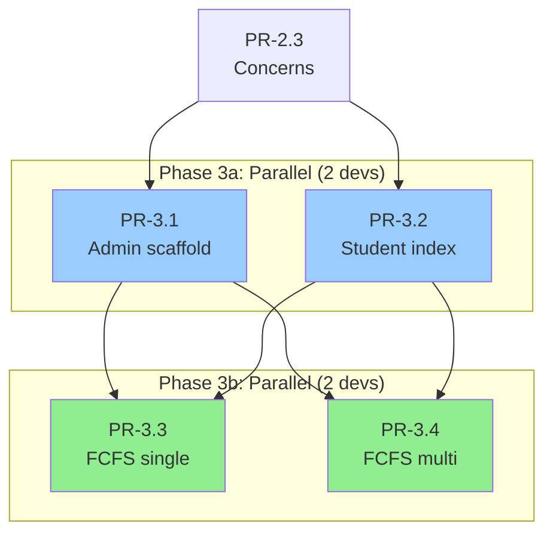

---

### Step 4: Preference-Based (Mixed Parallelization)

**Parallelization level:** 2-3 developers depending on phase

#### Phase 4a: UI & Persistence Foundations

**Parallel tracks (2 developers):**

| Track | PR | Purpose |
|-------|-----|---------|
| A | PR-4.1 | Student preference ranking UI |
| B | PR-4.2 | Roster foundations (models + service) |

**Prerequisites:** Step 3 complete.

**Why parallel?** PR-4.1 uses the stubbed `materialize_allocation!`
interface from PR-2.3. PR-4.2 implements the real roster persistence.
They don't conflict because PR-4.1 only reads the interface.

**Optional parallel work:**
- Developer C can research solver libraries (MCMF vs CP-SAT) and draft
  PR-4.3 structure while waiting for PR-4.2 to merge.

#### Phase 4b: Solver Integration (Draft in Parallel, Merge Sequentially)

**Single track (1 developer):**

| PR | Dependencies |
|----|--------------|
| PR-4.3 | PR-4.2 must be merged (needs roster persistence) |

**Why sequential merge?** The solver's `finalize!` method calls
`materialize_allocation!`, which writes to roster tables created in
PR-4.2. This is a hard dependency for merging.

**But drafting can be parallel:** Developer can write solver logic with
stubbed `materialize_allocation!` calls while PR-4.2 is in review. Only
the final merge requires PR-4.2 to land first.

**Parallel work during PR-4.3:**
- Developer B: Draft views for PR-4.4 (allocation controller UI)
- Developer C: Write integration test suite for allocation flow

#### Phase 4c: Allocation UI & Wiring

**Parallel tracks (2 developers):**

| Track | PR | Dependencies |
|-------|-----|--------------|
| A | PR-4.4 | PR-4.3 merged |
| B | PR-4.5 | PR-4.3 merged (can draft in parallel with 4.4) |

**Why parallel?** PR-4.4 adds teacher UI for allocation operations.
PR-4.5 wires student-facing result views. Minimal overlap.

**Merge order:** PR-4.4 → PR-4.5 (preferred but flexible).

```admonish warning "Dashboard widgets deferred"
Dashboard widgets for registration/allocation are now part of Step 10
(Dashboard Partial), not incremental additions in Steps 3-4.
```

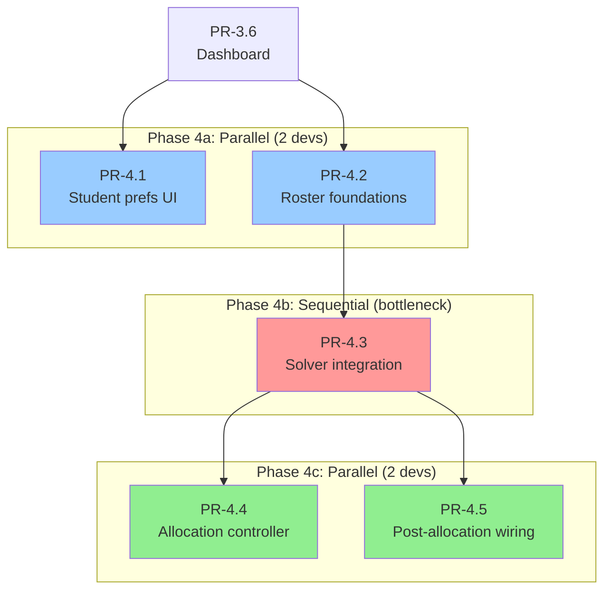

---

### Step 5: Roster Maintenance (High Parallelization)

**Parallelization level:** Up to 3 developers

#### Phase 5a: Foundation Work

**Parallel tracks (2 developers):**

| Track | PR | Purpose |
|-------|-----|---------|
| A | PR-5.1 | Read-only roster controller + views |
| B | PR-5.4 | Counters + integrity job |

**Prerequisites:** PR-4.2 must be merged (roster infrastructure).

**Why parallel?** Both read from roster tables but don't modify
them. PR-5.1 displays rosters, PR-5.4 counts participants. No write
conflicts.

**Merge order:** Flexible; PR-5.1 should merge first to unblock Phase 5b.

#### Phase 5b: Operations & Permissions

**Parallel tracks (2 developers):**

| Track | PR | Purpose |
|-------|-----|---------|
| A | PR-5.2 | Edit operations (remove/move) |
| B | PR-5.5 | Permissions + tutor read-only variant |

**Prerequisites:** PR-5.1 merged.

**Why parallel?** PR-5.2 adds controller actions for edit operations.
PR-5.5 adds authorization rules (abilities) and conditional UI. Low
conflict risk because they touch different layers.

**Merge order:** Either can merge first.

**Parallel draft work:**
- Developer C: Start PR-5.3 draft (candidates panel) while waiting for
  PR-5.2.

#### Phase 5c: Candidates Panel

**Single track:**

| PR | Dependencies |
|----|--------------|
| PR-5.3 | PR-5.2 merged (needs edit operations to assign candidates) |

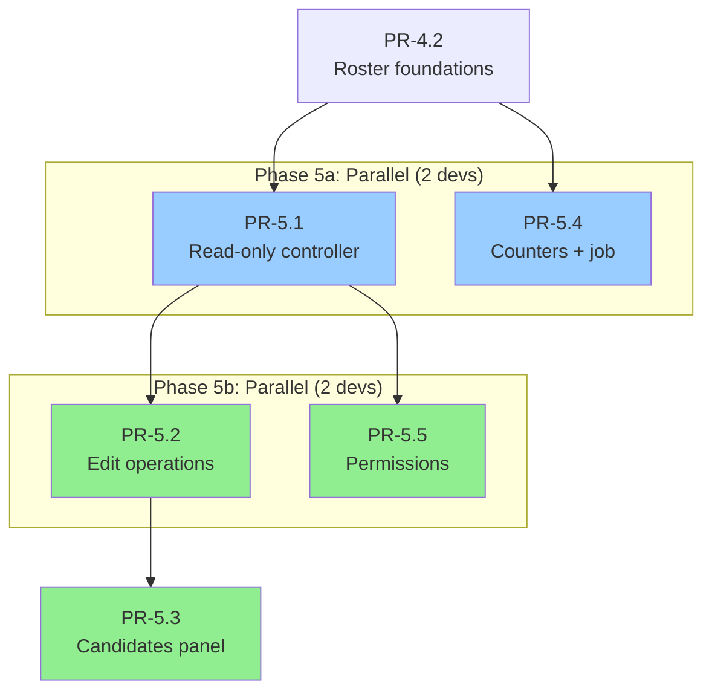

---

## Conflict Hotspots

When multiple developers work in parallel, watch these files for merge
conflicts:

### 1. Routes (`config/routes.rb`)

**Why conflicts occur:** Multiple PRs add new routes to the same
namespace.

**Mitigation strategies:**
- **Designate a "routes owner":** One developer handles all route-related
  conflicts during merge.
- **Use consistent formatting:** Follow Rails conventions for namespace
  blocks and member/collection actions.
- **Rebase frequently:** Pull latest `main` daily before pushing.
- **Coordinate merge order:** Agree in standup which PR merges first.

**Example conflict scenario:**
```ruby
# PR-3.3 adds:
post :register_single

# PR-3.4 adds (same location):
post :register_multi
```

**Resolution:** Both lines coexist; just order them consistently.

---

### 2. Abilities (`app/models/ability.rb`)

**Why conflicts occur:** Multiple PRs add authorization rules to the same
file or concern.

**Mitigation strategies:**
- **Split into concerns:** Create `app/abilities/registration_ability.rb`
  and `app/abilities/roster_ability.rb` to separate workstreams.
- **Use section comments:** Clearly mark sections like `# Registration — FCFS mode`
- **Group related rules:** Keep all rules for one controller together.

**Recommended structure:**
```ruby
# app/models/ability.rb
class Ability
  include CanCan::Ability
  include RegistrationAbility
  include RosterAbility
  include AssessmentAbility
  # ...
end
```

---

### 3. Dashboard Components

**Why conflicts occur:** Dashboard widgets are now consolidated in Step 10
(Dashboard Partial) rather than added incrementally.

**Mitigation strategies:**
- **Use separate component files:** Each widget is its own component
  (`OpenRegistrationsCard`, `AllocationResultsCard`,
  `ManageRostersCard`).
- **Feature flag each widget:** Enables independent testing without UI
  conflicts.
- **Coordinate in Step 10:** Multiple developers can work on different
  widgets in parallel during Step 10 implementation.

---

### 4. UserRegistrationsController

**Why conflicts occur:** PRs 3.3 and 3.4 both modify the same controller.

**Mitigation strategies:**
- **Keep actions separate:** Each PR implements distinct actions or
  branches (`if campaign.single_item?` vs `if campaign.multi_item?`)
- **Extract shared methods early:** The first PR to merge should extract
  helpers like `ensure_eligible!`, `enforce_capacity!`,
  `build_registration_context`.
- **Coordinate merge order:** Agree which PR merges first; others rebase
  and adopt the extracted methods.

**Example of method extraction:**
```ruby
# First PR to merge extracts:
private

def ensure_eligible!(campaign)
  result = Registration::PolicyEngine.call(campaign, current_user)
  redirect_to(...) unless result.pass?
end
```

Later PRs reuse this method instead of duplicating logic.

---

### Steps 6-9: Grading & Assessments

#### Step 6: Grading Foundations (Sequential)

**Parallelization level:** 1 developer

**Sequence:** PR-6.1 (Assessment schema) → PR-6.2 (Grade scheme schema)

**Why sequential?** Both are purely additive migrations. Can be combined
into a single PR or done sequentially. Low complexity.

---

#### Step 7: Assessments (Sequential)

**Parallelization level:** 1 developer

**Sequence:** PR-7.1 (Migration) → PR-7.2 (Controllers)

**Why sequential?** Controllers depend on migrated Assessment records
existing. Migration must complete first.

---

#### Step 8: Assignment Grading (High Parallelization)

**Parallelization level:** Up to 3 developers

**Parallel tracks:**

| Track | PR | Purpose |
|-------|-----|---------|
| A | PR-8.1 | Grading service (backend) |
| B | PR-8.2 | Grading UI (teacher/TA) |
| C | PR-8.3 | Publish/unpublish results |

**Prerequisites:** Step 7 complete.

**Why parallel?** PR-8.1 is pure service logic (no UI). PR-8.2 builds UI
that calls the service (can use doubles initially). PR-8.3 adds toggle
actions to existing AssessmentsController.

**Merge order:** PR-8.1 → PR-8.2 → PR-8.3 (preferred). PR-8.2 can draft
with stubbed service calls while PR-8.1 is in review.

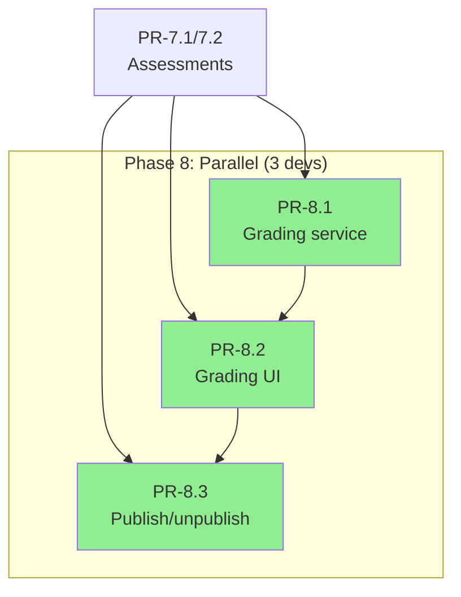

---

#### Step 9: Participation Tracking (Moderate Parallelization)

**Parallelization level:** 2 developers

**Parallel tracks:**

| Track | PR | Purpose |
|-------|-----|---------|
| A | PR-9.1 | Achievement model (new assessable type) |
| B | PR-9.2 | Achievement marking UI |

**Prerequisites:** Step 8 complete.

**Why parallel?** PR-9.1 creates model and migrations. PR-9.2 builds UI
(can draft with stubbed model initially).

**Merge order:** PR-9.1 → PR-9.2 (PR-9.2 requires model to exist).

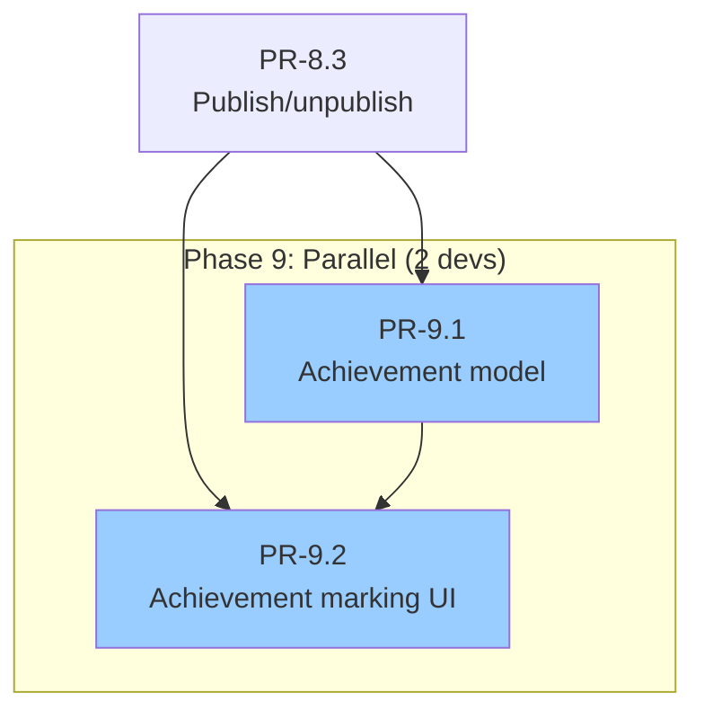

---

### Step 10: Dashboard (Partial) - High Parallelization

**Parallelization level:** Up to 2 developers

**Parallel tracks:**

| Track | PR | Purpose |
|-------|-----|---------|
| A | PR-10.1 | Student dashboard (partial) |
| B | PR-10.2 | Teacher/editor dashboard (partial) |

**Prerequisites:** Steps 2-9 complete.

**Why parallel?** Completely separate controllers and views. Student
dashboard shows registration/grades from student perspective.
Teacher dashboard shows campaigns/rosters/grading from admin perspective.

**Merge order:** Flexible (no dependencies).

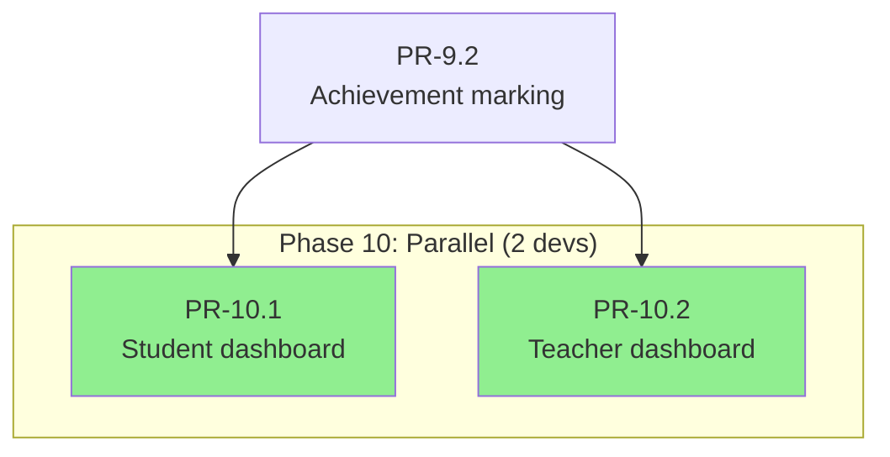

---

### Steps 11-13: Lecture Performance & Exam Registration

#### Step 11: Lecture Performance System (Very High Parallelization)

**Parallelization level:** Up to 4 developers

**Phase 11a: Schema & Services (3 developers):**

| Track | PR | Purpose |
|-------|-----|---------|
| A | PR-11.1 | Performance schema (4 tables) |
| B | PR-11.2 | Computation service (draft in parallel) |
| C | PR-11.3 | Evaluator (draft in parallel) |

**Prerequisites:** Step 9 complete (needs assessment data).

**Why parallel?** PR-11.2 and PR-11.3 can be drafted while PR-11.1 is in
review using local schema definitions. Merge after PR-11.1 lands.

**Phase 11b: Controllers (3 developers):**

| Track | PR | Purpose |
|-------|-----|---------|
| A | PR-11.4 | Records controller (factual data display) |
| B | PR-11.5 | Certifications controller (teacher workflow) |
| C | PR-11.6 | Evaluator controller (proposal endpoints) |

**Prerequisites:** PR-11.1, PR-11.2, PR-11.3 merged.

**Why parallel?** Three independent controllers with distinct purposes.
Minimal shared code.

**Merge order:** Flexible (PR-11.4 can merge first as it's simplest).

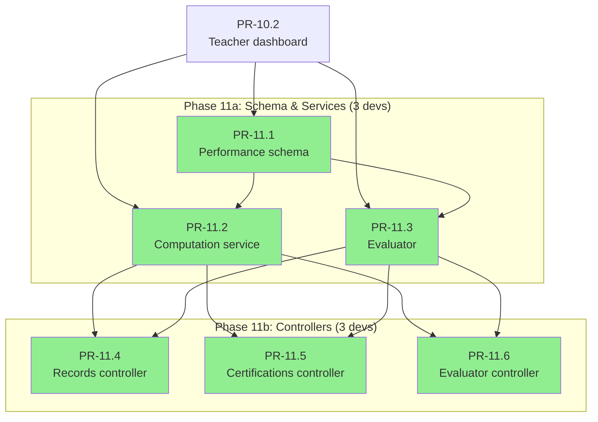

---

#### Step 12: Exam Registration (Moderate Parallelization)

**Parallelization level:** Up to 3 developers

**Parallel tracks:**

| Track | PR | Purpose |
|-------|-----|---------|
| A | PR-12.1 | Exam model (cross-cutting concerns) |
| B | PR-12.2 | Lecture performance policy (add to engine) |
| C | PR-12.3 | Pre-flight checks (draft in parallel) |

**Prerequisites:** Step 11 complete.

**Why parallel?** PR-12.1 creates Exam model. PR-12.2 adds policy kind to
existing PolicyEngine. PR-12.3 can draft pre-flight logic (merges after
PR-12.1 and PR-12.2).

**Sequential continuation:**

| PR | Dependencies |
|----|------------|
| PR-12.4 | PR-12.1, PR-12.2, PR-12.3 merged |
| PR-12.5 | PR-12.4 merged |

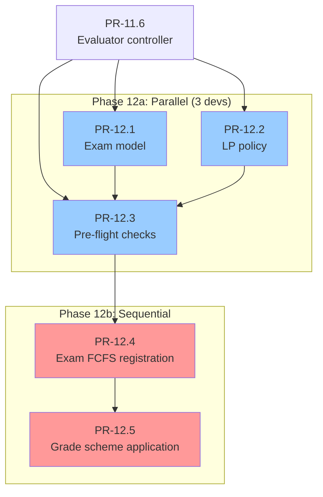

---

#### Step 13: Dashboard Extension (Low Parallelization)

**Parallelization level:** 2 developers

**Parallel tracks:**

| Track | PR | Purpose |
|-------|-----|---------|
| A | PR-13.1 | Student dashboard extension |
| B | PR-13.2 | Teacher dashboard extension |

**Prerequisites:** Steps 11-12 complete.

**Why parallel?** Extends existing dashboards from Step 10 with new
widgets. Student and teacher dashboards are independent.

**Merge order:** Flexible.

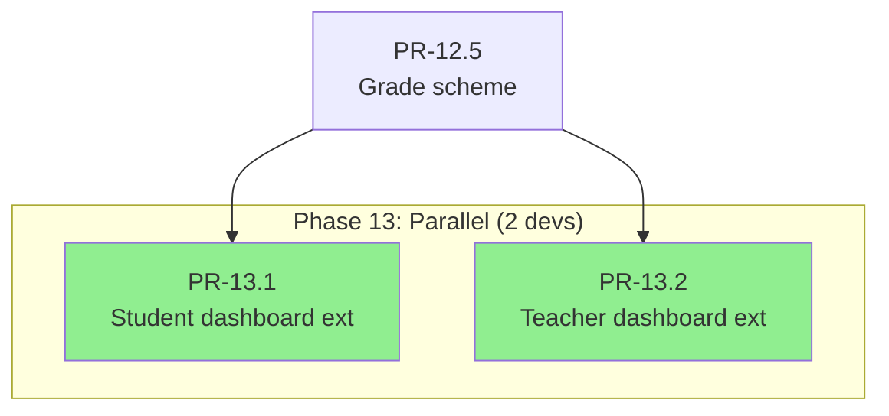

---

### Step 14: Quality & Hardening (Moderate Parallelization)

**Parallelization level:** 2 developers

**Parallel tracks:**

| Track | PR | Purpose |
|-------|-----|---------|
| A | PR-14.1 | Background jobs (performance/certification) |
| B | PR-14.2 | Admin reporting (integrity dashboard) |

**Prerequisites:** Steps 11-13 complete.

**Why parallel?** PR-14.1 creates background jobs. PR-14.2 builds admin UI
that displays job results (can use stubbed data initially).

**Merge order:** PR-14.1 → PR-14.2 (PR-14.2 displays job results).

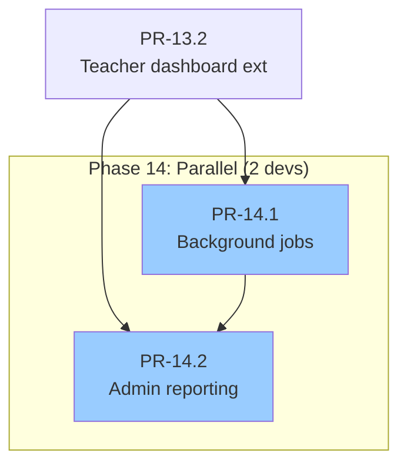

---

## Parallelization Summary

**Key insights:**
- **High parallelization:** Steps 3, 5, 8, 10, 11 (2-4 developers)
- **Moderate parallelization:** Steps 9, 12, 13, 14 (2 developers)
- **Sequential bottlenecks:** Steps 2, 4 (PR-4.3), 6, 7
- **Overall:** With 3-4 developers, Steps 3-5 can complete in ~60% of
  sequential time. Steps 6-14 add similar parallelization gains.

**Key insight:** Steps 3, 5, 8, 10, and 11 are highly parallelizable.
Steps 4, 6-7, and 12-14 have bottlenecks but allow parallelization before
and after.

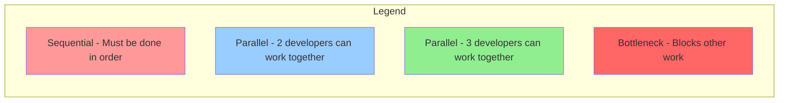

```mermaid
flowchart TD
    Start([Start Implementation])

    Step2{{"Step 2: Foundations<br/>(Sequential - 1 dev)"}}
    Step3{{"Step 3: FCFS Mode<br/>(Parallel - up to 2 devs)"}}
    Step4{{"Step 4: Preference-Based<br/>(Mixed - 2 devs)"}}
    Step4b{{"PR-4.3: Solver<br/>(Bottleneck)"}}
    Step5{{"Step 5: Roster Maintenance<br/>(Parallel - up to 2 devs)"}}
    Step6{{"Step 6-7: Grading Foundations<br/>(Sequential - 1 dev)"}}
    Step8{{"Step 8: Assignment Grading<br/>(Parallel - up to 3 devs)"}}
    Step9{{"Step 9: Participation<br/>(Parallel - 2 devs)"}}
    Step10{{"Step 10: Dashboard Partial<br/>(Parallel - 2 devs)"}}
    Step11{{"Step 11: Lecture Performance<br/>(Parallel - up to 4 devs)"}}
    Step12{{"Step 12: Exam Registration<br/>(Mixed - 2-3 devs)"}}
    Step13{{"Step 13: Dashboard Extension<br/>(Parallel - 2 devs)"}}
    Step14{{"Step 14: Quality & Hardening<br/>(Parallel - 2 devs)"}}
    Done([Implementation Complete])

    Start --> Step2
    Step2 --> Step3
    Step3 -->|High parallelization| Step4
    Step4 -->|Phase 4a-4b| Step4b
    Step4b -->|Phase 4c| Step5
    Step5 -->|High parallelization| Step6
    Step6 --> Step8
    Step8 -->|High parallelization| Step9
    Step9 --> Step10
    Step10 -->|High parallelization| Step11
    Step11 -->|Very high parallelization| Step12
    Step12 --> Step13
    Step13 --> Step14
    Step14 --> Done

    style Step2 fill:#ff9999
    style Step3 fill:#90ee90
    style Step4 fill:#99ccff
    style Step4b fill:#ff6666
    style Step5 fill:#90ee90
    style Step6 fill:#ff9999
    style Step8 fill:#90ee90
    style Step9 fill:#99ccff
    style Step10 fill:#90ee90
    style Step11 fill:#90ee90
    style Step12 fill:#99ccff
    style Step13 fill:#90ee90
    style Step14 fill:#99ccff
```

