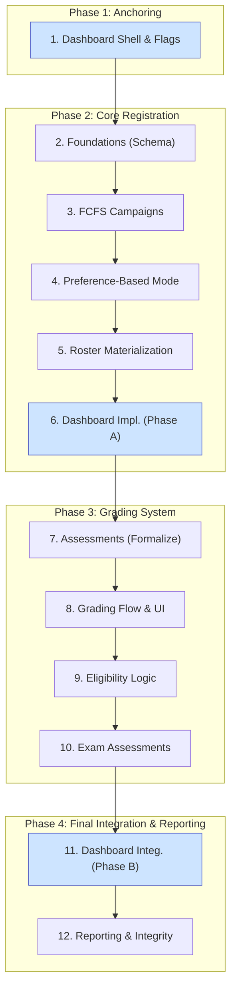

### Overarching Strategy: Parallel, Non-Disruptive Implementation

The core principle of this plan is to build the entire new registration and grading system in parallel with the existing, operational one. The new features will be built against new database tables and services and will only be activated for courses in the *next* academic semester. This ensures zero disruption to students and staff using the platform for the current, ongoing semester. Frontend development is integrated into each step, delivering complete "vertical slices" of functionality.

### Visual Implementation Roadmap



---

### The 12-Step Implementation Plan

1. **Dashboard Shell & Flags**
   Action: Introduce Student + Teacher/Editor dashboard controllers, blank widgets, navigation entries. All new feature areas render as disabled cards until their step enables them.

2. **Foundations (Additive Schema)**
   Action: Create the new database tables (`registration_campaigns`, `registration_items`, `registration_submissions`, `registration_policies`, `rosters`, `assessments`, `assessment_participations`, `assessment_tasks`, `assessment_task_points`, `exam_eligibility_records`, `exams`, etc.) and their corresponding Rails models. This step is purely backend and involves no UI changes.

    ```admonish success "Non-Disruptive Impact"
    This step is purely additive. It creates new, unused tables and models in the database. It does not alter or interfere with any existing tables (`assignments`, `submissions`, etc.) that are actively serving the current semester.
    ```

3. **Open FCFS Tutorial Campaigns**
    Action: Implement the backend controllers, services (`Registration::PolicyEngine`, `Registration::AllocationService`), and frontend UIs for the FCFS registration mode. This includes creating **admin UIs** to set up and manage campaigns and **student UIs** to view and register for items.

    ```admonish success "Non-Disruptive Impact"
    This new workflow is only triggered when a `Registration::Campaign` is created for a course. Since you will only create these campaigns for *next* semester's courses, the current semester's courses will continue to function entirely on the old logic.
    ```

4. **Preference-Based Mode**
    Action: Add the backend `Registration::AssignmentService` and background job. On the frontend, modify the student registration UI to support preference ranking (e.g., via drag-and-drop or numbered inputs) instead of a simple selection.

    ```admonish success "Non-Disruptive Impact"
    Like the FCFS mode, the preference-based solver and its UI are only invoked for new `Registration::Campaign`s. It will have no knowledge of or interaction with courses from the current semester.
    ```

5. **Materialization & Roster Operations**
   Action: Implement the backend `materialize_allocation!` method and `Roster::MaintenanceService`. Create a new admin-facing UI for post-allocation roster management (moves, swaps, etc.) that interacts with this new service.

    ```admonish success "Non-Disruptive Impact"
    Adding a new, unused method to a model is a passive change. The new admin UI and backend service will only operate on rosters from new campaigns, leaving current semester rosters unaffected.
    ```

6. **Dashboard Implementation (Phase A)**
   Action: Implement the initial versions of the Student Dashboard and Teacher/Editor Dashboard. This includes creating the new controllers, views, and routing. The dashboards will be populated with widgets that rely on existing data models (e.g., "My Courses", "Assignment Deadlines").

    ```admonish success "Non-Disruptive Impact"
    This provides an immediate UI/UX improvement for all users in the current semester without any dependency on the new systems. Widgets for new features (registration, grading) will be hidden.
    ```

7. **Assessments (Formalize `Assignment` as Assessable)**
   Action: Add the new assessment-related models (`Assessment::Assessment`, `Assessment::Task`, `Assessment::Participation`, `Assessment::TaskPoint`). Run a background migration to create a corresponding `Assessment::Assessment` record for each existing `Assignment`. This step formalizes existing assignments as items that can be graded within the new system.

    ```admonish success "Non-Disruptive Impact"
    The new assessment tables are created in parallel. The migration links existing `Assignment` records to the new system without altering any existing data or behavior for the current semester.
    ```

8. **Grading Flow & Submission Fan-out**
   Action: Introduce the backend `Assessment::GradingService`. Build new grading UIs for instructors and TAs where they can view submissions and enter points. This UI will call the new service to save points and grades to the new tables (`assessment_participations`, `assessment_task_points`).

    ```admonish success "Non-Disruptive Impact"
    This is a completely new UI and backend service. It will be deployed but not made accessible for current semester courses. The existing submission viewing UI remains untouched for the live semester.
    ```

9. **Eligibility & Exam Registration**
   Action: Implement the `ExamEligibility::ComputationService` to compute `ExamEligibility::Record` by reading from the new assessment and point tables. On the frontend, update the student registration UI to display eligibility status and errors. Create a new admin UI to inspect and override eligibility records.

    ```admonish success "Non-Disruptive Impact"
    This is entirely new functionality that depends only on the new grading data. It has no interaction with the current semester.
    ```

10. **Exam Assessments & Grade Schemes**
   Action: Build the `Exam` model and its integration with the assessment system. Implement `GradeScheme::Applier` service to apply grading schemes. This step will use the new grading UI built in Step 8, potentially adding minor UI elements for scheme configuration.

    ```admonish success "Non-Disruptive Impact"
    This is the final piece of the new grading workflow and is entirely dependent on the preceding steps. It will only be used for exams in the next semester.
    ```

11. **Extensions: Multiple Choice Exams** _(Optional, can be skipped for MVP)_
   Action: Extend `Exam` and `Assessment::Task` models with MC support fields (`has_multiple_choice`, `mc_weight`, `is_multiple_choice`, `grade_scheme_id`). Implement `Assessment::McGrader` service for German legal compliance (Gleitklausel). Add UI for MC task configuration and threshold visualization.

    ```admonish info "Extension Feature"
    This is an optional extension for exams requiring MC components with legal compliance. Can be implemented after core functionality is complete and stable.
    ```

12. **Dashboard Integration (Phase B)**
   Action: Activate and integrate the new features into the dashboards. Connect the "Open Registrations", "Recent Grades", "My Tutoring Responsibilities", "Manage Rosters", and "Grading Queue" widgets to their respective backend services and UIs.

    ```admonish success "Non-Disruptive Impact"
    This step "lights up" the full functionality of the dashboards, preparing them for the next semester. It depends on the completion of the core backend features from the preceding steps.
    ```

13. **Reporting & Integrity Jobs**
   Action: Create backend jobs for data integrity and reporting. On the frontend, build new admin dashboards and reporting views to visualize the data generated by these jobs from the new system's tables.

    ```admonish success "Non-Disruptive Impact"
    These maintenance jobs and reports will operate exclusively on the new set of tables, ensuring the integrity of the next semester's data without touching the live production data.
    ```
