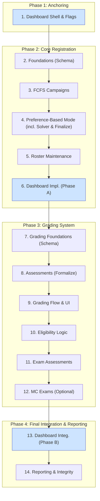

### Overarching Strategy: Parallel, Non-Disruptive Implementation

The core principle of this plan is to build the entire new registration and grading system in parallel with the existing, operational one. The new features will be built against new database tables and services and will only be activated for courses in the *next* academic semester. This ensures zero disruption to students and staff using the platform for the current, ongoing semester. Frontend development is integrated into each step, delivering complete "vertical slices" of functionality.

### Workstreams and step repetition

We implement major areas as separate workstreams (Registration, Grading,
Dashboards). Each workstream has a Foundations phase. In this plan:
Registration foundations are at Step 2; Grading foundations are at
Step 7; Dashboards have shell/integration at Steps 1, 6, and 12.
Foundations are schema-only for each workstream; controllers/services
and UI arrive in subsequent steps. The PR Roadmap chapter provides a
concrete crosswalk for the Registration workstream.

### Visual Implementation Roadmap



---

### The 14-Step Implementation Plan

1. **[Dashboards] Dashboard Shell & Flags**
   Action: Introduce Student + Teacher/Editor dashboard controllers, blank widgets, navigation entries. All new feature areas render as disabled cards until their step enables them.

    ```admonish tip "Incremental widgets"
    As Steps 3–4 land, expose lightweight widget endpoints and add
    hidden dashboard cards behind feature flags to exercise data paths.
    The dedicated dashboards step later enables these by default and
    adds polish.
    ```

2. **[Registration] Foundations (Additive Schema per Workstream)**
    Active workstream: Registration.
    Action: Create only the new tables and AR models for the active
    workstream. This step is purely backend and involves no UI changes.

    For example, for the Registration workstream this includes
    `registration_campaigns`, `registration_items`,
    `registration_user_registrations`, and `registration_policies`.
    Grading- and exam-related tables are added later when those
    workstreams are active.

    Also implement `Registration::PolicyEngine` with core policy kinds
    and introduce core concerns for controllers to target in the next step:
    - `Registration::Campaignable` for hosts of campaigns; include in `Lecture`.
    - `Registration::Registerable` for assignable targets; include in `Tutorial`.
    Provide interface stubs such as `materialize_allocation!`.

    ```admonish success "Non-Disruptive Impact"
    This step is purely additive. It creates new, unused tables and
    models scoped to the active workstream. It does not alter existing
    tables (`assignments`, `submissions`, etc.) serving the current
    semester.
    ```

    ```admonish tip "Crosswalk"
    See "Implementation PR Roadmap" for the Registration workstream's
    Step 2 breakdown.
    ```

3. **[Registration] Open FCFS Tutorial Campaigns**
    Action: Implement the backend controllers and frontend UIs for the FCFS registration mode. This includes creating **teacher/editor UIs** to set up and manage campaigns and **student UIs** to view and register for items. FCFS logic uses simple capacity checks (no complex allocation).
    ```admonish tip
    Prerequisites: Step 2 (schema, policy engine, core concerns
    included in `Lecture` and `Tutorial`).
    ```

    Controllers: Wire `Registration::CampaignsController`,
    `Registration::UserRegistrationsController`, and
    `Registration::PoliciesController` (HTML + Turbo Frames/Streams).

    Also add minimal dashboard widget data endpoints (counts/status)
    and update hidden cards under feature flags.

    ```admonish tip "Scope for MVP"
    Initial FCFS rollout targets Tutorials. Support for Talks/Seminars
    can follow post‑MVP (see PR‑2.4 in the PR Roadmap).
    ```

    ```admonish success "Non-Disruptive Impact"
    This new workflow is only triggered when a `Registration::Campaign` is created for a course. Since you will only create these campaigns for *next* semester's courses, the current semester's courses will continue to function entirely on the old logic.
    ```

4. **[Registration] Preference-Based Mode (incl. Solver & Finalization)**
    Action: Deliver preference-based registration, building on FCFS foundations. Implement student ranking UI and persistence, roster foundations for finalize (minimal persistence/service so `materialize_allocation!` can replace roster memberships), and solver integration with finalize wiring end-to-end.

    Controllers: Add `Registration::AllocationController` for
    trigger/retry/finalize and Turbo updates from background jobs.

    Also update hidden dashboard cards to surface preference-based
    counters and latest results when enabled via feature flags.

    ```admonish tip "Ordering"
    Build roster foundations before implementing `finalize!`,
    since `materialize_allocation!` replaces roster memberships.
    ```

    ```admonish success "Non-Disruptive Impact"
    Like FCFS, preference-based logic runs only for new
    `Registration::Campaign`s and does not affect the live semester.
    ```

5. **[Registration] Roster Maintenance (UI & Operations)**
     Action: Implement `Roster::MaintenanceController` and
     `Roster::MaintenanceService` with an admin-facing UI for
     post-allocation roster management (moves, adds/removes) with
     capacity enforcement. Finalize the UX:
     - Candidates panel lives on the Roster Overview (not on Detail)
         and lists unassigned users from a selected, completed campaign.
     - Provide a manual "Add student" action on Overview.
     - Tutor view is read-only; exams do not show a candidates panel.

        Also update denormalized counters (`Registration::Item.assigned_count`)
        and add `RecountAssignedJob` for integrity. Finalize abilities so
        tutors see read-only Detail for their groups. Add a hidden
        dashboard widget for teacher/editor with roster links and counts.

        ```admonish success "Non-Disruptive Impact"
        Operates only on rosters materialized from new campaigns. Current
        semester rosters remain untouched.
        ```

6. **[Dashboards] Dashboard Implementation (Phase A)**
   Action: Implement the initial versions of the Student Dashboard and Teacher/Editor Dashboard. This includes creating the new controllers, views, and routing. The dashboards will be populated with widgets that rely on existing data models (e.g., "My Courses", "Assignment Deadlines").

    ```admonish success "Non-Disruptive Impact"
    This provides an immediate UI/UX improvement for all users in the current semester without any dependency on the new systems. Widgets for new features (registration, grading) will be hidden.
    ```

7. **[Grading] Grading Foundations (Schema)**
    Action: Create all grading-related tables and AR models. This
    includes core assessment tables (`assessment_assessments`,
    `assessment_tasks`, `assessment_participations`,
    `assessment_task_points`), eligibility tables
    (`lecture_performance_records`), exam tables (`exams`), and grade scheme
    tables. Optional multiple-choice support fields can also be added
    here to keep schema changes concentrated.

     ```admonish success "Non-Disruptive Impact"
     This step is purely additive. It creates new, unused tables and
     models for the Grading workstream. It does not alter existing live
     semester tables.
     ```

8. **[Grading] Assessments (Formalize `Assignment` as Assessable)**
    Action: Run a background migration to create a corresponding
    `Assessment::Assessment` record for each existing `Assignment`.
    Expose controllers for read-only exploration.

    Controllers: `Assessment::AssessmentsController` (CRUD, read-only
    views) and `Assessment::ParticipationsController` (read-only).
    These become fully interactive after Step 9.

    ```admonish success "Non-Disruptive Impact"
    The new assessment tables are created in parallel. The migration links existing `Assignment` records to the new system without altering any existing data or behavior for the current semester.
    ```

9. **[Grading] Grading Flow & Submission Fan-out**
   Action: Introduce the backend `Assessment::GradingService`. Build new grading UIs for instructors and TAs where they can view submissions and enter points. This UI will call the new service to save points and grades to the new tables (`assessment_participations`, `assessment_task_points`).

    Controllers: Enable `Assessment::GradingController` and
    `Assessment::ParticipationsController`. Add `publish_results` and
    `unpublish_results` actions on `Assessment::AssessmentsController`.

    ```admonish success "Non-Disruptive Impact"
    This is a completely new UI and backend service. It will be deployed but not made accessible for current semester courses. The existing submission viewing UI remains untouched for the live semester.
    ```

10. **[Grading] Eligibility & Exam Registration**
    Action: Implement the `LecturePerformance::ComputationService` to compute `LecturePerformance::Record` by reading from the new assessment and point tables. On the frontend, update the student registration UI to display eligibility status and errors. Create a new teacher/editor UI to inspect and override eligibility records.

    Controllers: Provide `LecturePerformance::RecordsController` for
    viewing, override, and export of eligibility.

    ```admonish success "Non-Disruptive Impact"
    This is entirely new functionality that depends only on the new grading data. It has no interaction with the current semester.
    ```

11. **[Grading] Exam Assessments & Grade Schemes**
    Action: Create the `Exam` model and include the cross-cutting
    concerns to link it across registration, rosters, and grading:
    - `Registration::Campaignable` (host campaigns)
    - `Registration::Registerable` (be registered for)
    - `Roster::Rosterable` (manage registrants)
    - `Assessment::Assessable` (link to grading)

    Implement `materialize_allocation!` for exam rosters (delegating to
    `replace_roster!`), and wire `ExamsController` to the assessment
    system. Implement `GradeScheme::Applier` service to apply grading
    schemes. This step builds on the grading UI from Step 8 and may add
    minor UI elements for scheme configuration.

     Controllers: Introduce `ExamsController` (CRUD, scheduling) and
     `GradeScheme::SchemesController` (preview/apply).

     ```admonish success "Non-Disruptive Impact"
     This is the final piece of the new grading workflow and is entirely
     dependent on the preceding steps. It will only be used for exams in
     the next semester.
     ```

12. **[Grading] Extensions: Multiple Choice Exams** _(Optional, can be skipped for MVP)_
   Action: Extend `Exam` and `Assessment::Task` models with MC support fields (`has_multiple_choice`, `mc_weight`, `is_multiple_choice`, `grade_scheme_id`). Implement `Assessment::McGrader` service for German legal compliance (Gleitklausel). Add UI for MC task configuration and threshold visualization.

    ```admonish info "Extension Feature"
    This is an optional extension for exams requiring MC components with legal compliance. Can be implemented after core functionality is complete and stable.
    ```

13. **[Dashboards] Dashboard Integration (Phase B)**
   Action: Activate and integrate the new features into the dashboards. Connect the "Open Registrations", "Recent Grades", "My Tutoring Responsibilities", "Manage Rosters", and "Grading Queue" widgets to their respective backend services and UIs.

    ```admonish success "Non-Disruptive Impact"
    This step "lights up" the full functionality of the dashboards, preparing them for the next semester. It depends on the completion of the core backend features from the preceding steps.
    ```

14. **[Reporting] Reporting & Integrity Jobs**
   Action: Create backend jobs for data integrity and reporting. On the frontend, build new admin dashboards and reporting views to visualize the data generated by these jobs from the new system's tables.

    ```admonish success "Non-Disruptive Impact"
    These maintenance jobs and reports will operate exclusively on the new set of tables, ensuring the integrity of the next semester's data without touching the live production data.
    ```
