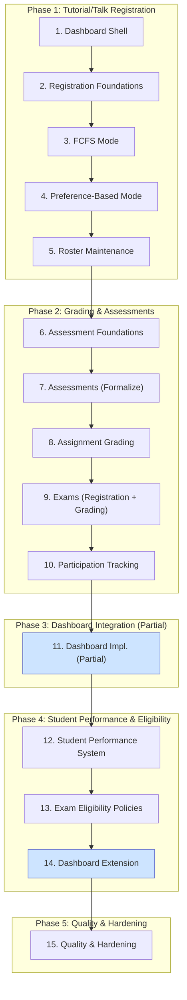

### Overarching Strategy: Parallel, Non-Disruptive Implementation

The core principle of this plan is to build the entire new registration and grading system in parallel with the existing, operational one. The new features will be built against new database tables and services and will only be activated for courses in the *next* academic semester. This ensures zero disruption to students and staff using the platform for the current, ongoing semester. Frontend development is integrated into each step, delivering complete "vertical slices" of functionality.

### Workstreams and step repetition

We implement major areas as separate workstreams (Registration, Grading,
Dashboards, Student Performance). Each workstream has a Foundations
phase. In this plan: Registration foundations are at Step 2; Grading
foundations are at Step 6; Student Performance foundations are at
Step 12. Dashboards have partial integration at Step 11 and complete
integration at Step 14. Foundations are schema-only for each workstream;
controllers/services and UI arrive in subsequent steps. The PR Roadmap
chapter provides a concrete crosswalk for the Registration workstream.

### Visual Implementation Roadmap



---

### The 15-Step Implementation Plan

1. **[Dashboards] Dashboard Shell & Flags**
   Action: Introduce Student + Teacher/Editor dashboard controllers, blank widgets, navigation entries. All new feature areas render as disabled cards until their step enables them.

    ```admonish tip "Incremental widgets"
    As Steps 3–4 land, expose lightweight widget endpoints and add
    hidden dashboard cards behind feature flags to exercise data paths.
    The dedicated dashboards step later enables these by default and
    adds polish.
    ```

2. **[Registration] Foundations (Additive Schema per Workstream)**
    Active workstream: Registration.
    Action: Create only the new tables and AR models for the active
    workstream. This step is purely backend and involves no UI changes.

    For the Registration workstream this includes
    `registration_campaigns`, `registration_items`,
    `registration_user_registrations`, and `registration_policies`.
    Grading- and exam-related tables are added later when those
    workstreams are active.

    Also implement `Registration::PolicyEngine` with core policy kinds
    (`institutional_email`, `prerequisite_campaign`) and introduce core
    concerns for controllers to target in the next step:
    - `Registration::Campaignable` for hosts of campaigns; include in `Lecture`.
    - `Registration::Registerable` for assignable targets; include in `Tutorial`.
    Provide interface stubs such as `materialize_allocation!` and
    `allocated_user_ids`.

    ```admonish warning "Exam features deferred"
    Exam registration is deferred to Step 9, and student performance
    eligibility policies to Step 13. This step focuses on tutorial/talk
    registration only.
    ```

    ```admonish success "Non-Disruptive Impact"
    This step is purely additive. It creates new, unused tables and
    models scoped to the active workstream. It does not alter existing
    tables (`assignments`, `submissions`, etc.) serving the current
    semester.
    ```

    ```admonish tip "Crosswalk"
    See "Implementation PR Roadmap" for the Registration workstream's
    Step 2 breakdown.
    ```

3. **[Registration] Open FCFS Tutorial/Talk Campaigns**
    Action: Implement the backend controllers and frontend UIs for the FCFS registration mode. This includes creating **teacher/editor UIs** to set up and manage campaigns and **student UIs** to view and register for items. FCFS logic uses simple capacity checks (no complex allocation).

    ```admonish tip
    Prerequisites: Step 2 (schema, policy engine, core concerns
    included in `Lecture` and `Tutorial`).
    ```

    Controllers: Wire `Registration::CampaignsController`,
    `Registration::UserRegistrationsController`, and
    `Registration::PoliciesController` (HTML + Turbo Frames/Streams).

    Also add minimal dashboard widget data endpoints (counts/status)
    and update hidden cards under feature flags.

    ```admonish tip "Scope for MVP"
    Initial FCFS rollout targets Tutorials and Talks. Exam registration
    is deferred to Step 9.
    ```

    ```admonish success "Non-Disruptive Impact"
    This new workflow is only triggered when a `Registration::Campaign`
    is created for a course. Since you will only create these campaigns
    for *next* semester's courses, the current semester's courses will
    continue to function entirely on the old logic.
    ```

4. **[Registration] Preference-Based Mode (incl. Solver & Finalization)**
    Action: Deliver preference-based registration, building on FCFS foundations. Implement student ranking UI and persistence, roster foundations for finalize (minimal persistence/service so `materialize_allocation!` can replace roster memberships), and solver integration with finalize wiring end-to-end.

    Controllers: Add `Registration::AllocationController` for
    trigger/retry/finalize and Turbo updates from background jobs.

    Also update hidden dashboard cards to surface preference-based
    counters and latest results when enabled via feature flags.

    ```admonish tip "Ordering"
    Build roster foundations before implementing `finalize!`,
    since `materialize_allocation!` replaces roster memberships.
    Add `source_campaign_id` to roster join tables for tracking.
    ```

    ```admonish success "Non-Disruptive Impact"
    Like FCFS, preference-based logic runs only for new
    `Registration::Campaign`s and does not affect the live semester.
    ```

5. **[Registration] Roster Maintenance (UI & Operations)**
     Action: Implement `Roster::MaintenanceController` and
     `Roster::MaintenanceService` with an admin-facing UI for
     post-allocation roster management (moves, adds/removes) with
     capacity enforcement. Finalize the UX:
     - Candidates panel lives on the Roster Overview (not on Detail)
         and lists unassigned users from a selected, completed campaign.
     - Provide a manual "Add student" action on Overview.
     - Tutor view is read-only; exams do not show a candidates panel.

        Also add `RecountAssignedJob` for integrity. Finalize abilities so
        tutors see read-only Detail for their groups. Add a hidden
        dashboard widget for teacher/editor with roster links and counts.

        ```admonish success "Non-Disruptive Impact"
        Operates only on rosters materialized from new campaigns. Current
        semester rosters remain untouched.
        ```

6. **[Grading] Assessment Foundations (Schema)**
    Action: Create core assessment tables and AR models:
    `assessment_assessments`, `assessment_tasks`,
    `assessment_participations`, `assessment_task_points`. Optional
    multiple-choice support fields can also be added here to keep schema
    changes concentrated.

     ```admonish warning "Exam, grade scheme, and performance tables deferred"
     Exam-related tables (`exams`) and grade scheme tables
     (`grade_schemes`, `grade_scheme_thresholds`) are deferred to Step 9.
     Student performance tables (`student_performance_records`,
     `student_performance_certifications`, etc.) are deferred to Step 12.
     This step focuses on core assessment infrastructure for assignment
     grading.
     ```

     ```admonish success "Non-Disruptive Impact"
     This step is purely additive. It creates new, unused tables and
     models for the Grading workstream. It does not alter existing live
     semester tables.
     ```

7. **[Grading] Assessments (Formalize `Assignment` as Assessable)**
    Action: Run a background migration to create a corresponding
    `Assessment::Assessment` record for each existing `Assignment`.
    Expose controllers for read-only exploration.

    Controllers: `Assessment::AssessmentsController` (CRUD, read-only
    views) and `Assessment::ParticipationsController` (read-only).
    These become fully interactive after Step 8.

    ```admonish success "Non-Disruptive Impact"
    The new assessment tables are created in parallel. The migration
    links existing `Assignment` records to the new system without
    altering any existing data or behavior for the current semester.
    ```

8. **[Grading] Grading Flow & Submission Fan-out**
   Action: Introduce the backend `Assessment::GradingService`. Build new grading UIs for instructors and TAs where they can view submissions and enter points. This UI will call the new service to save points and grades to the new tables (`assessment_participations`, `assessment_task_points`).

    Controllers: Enable `Assessment::GradingController` and
    `Assessment::ParticipationsController`. Add `publish_results` and
    `unpublish_results` actions on `Assessment::AssessmentsController`.

    ```admonish success "Non-Disruptive Impact"
    This is a completely new UI and backend service. It will be deployed
    but not made accessible for current semester courses. The existing
    submission viewing UI remains untouched for the live semester.
    ```

9. **[Exams] Exam Registration & Grading**
   Action: Create `Exam` model and enable full exam workflow including registration and grading. Build complete vertical slice from campaign creation through grade publication.

    Schema: Create `exams` table, `grade_schemes`, and
    `grade_scheme_thresholds` tables.

    Model concerns: `Exam` includes `Registration::Registerable`,
    `Roster::Rosterable`, and `Assessment::Assessable`. Note that
    `Lecture` (already campaignable from Step 2) hosts exam registration
    campaigns.

    Services: Implement `GradeScheme::Applier` for converting exam
    points to final grades.

    Controllers: `ExamsController` (CRUD, scheduling),
    `GradeScheme::SchemesController` (scheme configuration, preview,
    apply). Extend `Registration::CampaignsController` to support exam
    registration campaigns (lecture as campaignable, exam as
    registerable item).

    UI: Exam registration flows (reuses existing campaign
    infrastructure), exam grading interface with grade scheme
    configuration (two-point auto-generation and manual adjustment),
    and results publication.

    ```admonish tip "Policy support"
    At this stage, exam campaigns can use existing policies
    (`institutional_email`, `prerequisite_campaign`). The
    `student_performance` policy kind is added in Step 13.
    ```

    ```admonish success "Non-Disruptive Impact"
    Completes the grading story for Phase 2. Teachers can create exam
    campaigns and grade exams using the new infrastructure. Grade
    schemes become immediately useful instead of sitting unused for
    multiple steps.
    ```

10. **[Grading] Participation Tracking**
   Action: Implement Achievement model as a new assessable type for tracking non-graded participation (presentations, attendance). Build UI for teachers to mark achievements and for students to view their progress.

    Controllers: Add `Assessment::AchievementsController` for CRUD and
    `Assessment::ParticipationsController` extensions for achievement
    marking.

    ```admonish success "Non-Disruptive Impact"
    This is entirely new functionality with no dependencies on existing
    data. Will be used for next semester courses only.
    ```

11. **[Dashboards] Dashboard Implementation (Partial)**
   Action: Implement initial versions of Student Dashboard and Teacher/Editor Dashboard with widgets for tutorial/talk registration, assignment grading, exam registration, and roster management. Lecture performance and exam eligibility widgets remain hidden.

    Controllers: `DashboardsController` (student/teacher views) with
    widget partials for completed workstreams (Steps 2-10).

    ```admonish warning "Incomplete coverage"
    Dashboards will not show lecture performance certification or exam
    eligibility status yet. These widgets are added in Step 14.
    ```

    ```admonish success "Non-Disruptive Impact"
    Provides immediate UX improvement for all users. Widgets for new
    features show data from new tables only.
    ```

12. **[Student Performance] System Foundations**
    Action: Create student performance tables and models:
    `student_performance_records`, `student_performance_rules`,
    `student_performance_achievements`, and
    `student_performance_certifications`. Implement
    `StudentPerformance::ComputationService` to materialize Records from
    assessment data. Implement `StudentPerformance::Evaluator` to
    generate certification proposals. Build teacher certification
    workflow UI.

    Controllers: `StudentPerformance::RecordsController` (factual data
    display), `StudentPerformance::CertificationsController` (teacher
    certification workflow), and `StudentPerformance::EvaluatorController`
    (proposal generation).

    ```admonish warning "No policy integration yet"
    The `student_performance` policy kind is added in Step 13 when exam
    eligibility policies are implemented.
    ```

    ```admonish success "Non-Disruptive Impact"
    Creates new tables for performance tracking. Does not affect existing
    semester data.
    ```

13. **[Exam Eligibility] Student Performance Policy Integration**
    Action: Integrate student performance certifications into exam
    registration as an eligibility gate. Add the `student_performance`
    policy kind to enable exam campaigns to require certification before
    students can register.

    Policy Engine: Add `student_performance` policy kind to
    `Registration::PolicyEngine`. Policy checks
    `StudentPerformance::Certification.status` at runtime.

    Pre-flight checks: Implement certification completeness validation
    in `Registration::CampaignsController` (before campaign open) and
    `Registration::AllocationController` (before finalize). Campaigns
    with `student_performance` policies cannot open if any lecture
    students lack certifications or have pending status.

    Finalization filtering: On finalize, auto-reject students with
    `status: :failed` and only materialize students with
    `status: :passed` to exam rosters.

    UI: Add pre-flight validation warnings, remediation interface for
    incomplete certifications, and student-facing eligibility status
    displays.

    ```admonish tip "Extension: Multiple Choice"
    MC exam support can be added as optional extension after core
    functionality is stable.
    ```

    ```admonish success "Non-Disruptive Impact"
    Adds optional eligibility layer to existing exam registration from
    Step 9. Exams without student performance policies continue to work
    as before.
    ```

14. **[Dashboards] Dashboard Extension (Complete)**
   Action: Add student performance and exam eligibility widgets to dashboards. Connect "Exam Eligibility Status", "Certification Pending List", and "Performance Overview" to backend services from Steps 12-13.

    Controllers: Extend `DashboardsController` with widgets for lecture
    performance certification status and exam eligibility.

    ```admonish success "Non-Disruptive Impact"
    Completes dashboard functionality for next semester. All widgets
    read from new tables only.
    ```

15. **[Quality] Hardening & Integrity**
   Action: Create backend jobs for data integrity and reporting (`PerformanceRecordUpdateJob`, `CertificationStaleCheckJob`, `AllocatedAssignedMatchJob`). Build admin dashboards and reporting views.

    ```admonish success "Non-Disruptive Impact"
    Maintenance jobs operate exclusively on new tables without touching
    live production data.
    ```