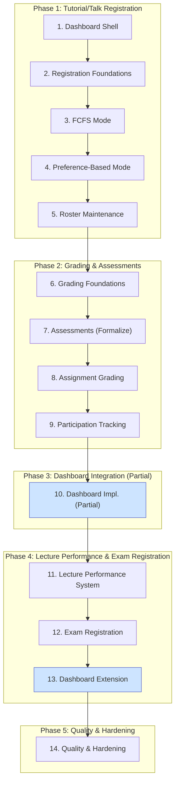

### Overarching Strategy: Parallel, Non-Disruptive Implementation

The core principle of this plan is to build the entire new registration and grading system in parallel with the existing, operational one. The new features will be built against new database tables and services and will only be activated for courses in the *next* academic semester. This ensures zero disruption to students and staff using the platform for the current, ongoing semester. Frontend development is integrated into each step, delivering complete "vertical slices" of functionality.

### Workstreams and step repetition

We implement major areas as separate workstreams (Registration, Grading,
Dashboards, Lecture Performance). Each workstream has a Foundations
phase. In this plan: Registration foundations are at Step 2; Grading
foundations are at Step 7; Lecture Performance foundations are at
Step 11. Dashboards have partial integration at Step 10 and complete
integration at Step 13. Foundations are schema-only for each workstream;
controllers/services and UI arrive in subsequent steps. The PR Roadmap
chapter provides a concrete crosswalk for the Registration workstream.

### Visual Implementation Roadmap



---

### The 14-Step Implementation Plan

1. **[Dashboards] Dashboard Shell & Flags**
   Action: Introduce Student + Teacher/Editor dashboard controllers, blank widgets, navigation entries. All new feature areas render as disabled cards until their step enables them.

    ```admonish tip "Incremental widgets"
    As Steps 3–4 land, expose lightweight widget endpoints and add
    hidden dashboard cards behind feature flags to exercise data paths.
    The dedicated dashboards step later enables these by default and
    adds polish.
    ```

2. **[Registration] Foundations (Additive Schema per Workstream)**
    Active workstream: Registration.
    Action: Create only the new tables and AR models for the active
    workstream. This step is purely backend and involves no UI changes.

    For the Registration workstream this includes
    `registration_campaigns`, `registration_items`,
    `registration_user_registrations`, and `registration_policies`.
    Grading- and exam-related tables are added later when those
    workstreams are active.

    Also implement `Registration::PolicyEngine` with core policy kinds
    (`institutional_email`, `prerequisite_campaign`) and introduce core
    concerns for controllers to target in the next step:
    - `Registration::Campaignable` for hosts of campaigns; include in `Lecture`.
    - `Registration::Registerable` for assignable targets; include in `Tutorial`.
    Provide interface stubs such as `materialize_allocation!` and
    `allocated_user_ids`.

    ```admonish warning "Exam registration deferred"
    Exam registration and lecture performance policies are deferred to
    Steps 11-12. This step focuses on tutorial/talk registration only.
    ```

    ```admonish success "Non-Disruptive Impact"
    This step is purely additive. It creates new, unused tables and
    models scoped to the active workstream. It does not alter existing
    tables (`assignments`, `submissions`, etc.) serving the current
    semester.
    ```

    ```admonish tip "Crosswalk"
    See "Implementation PR Roadmap" for the Registration workstream's
    Step 2 breakdown.
    ```

3. **[Registration] Open FCFS Tutorial/Talk Campaigns**
    Action: Implement the backend controllers and frontend UIs for the FCFS registration mode. This includes creating **teacher/editor UIs** to set up and manage campaigns and **student UIs** to view and register for items. FCFS logic uses simple capacity checks (no complex allocation).

    ```admonish tip
    Prerequisites: Step 2 (schema, policy engine, core concerns
    included in `Lecture` and `Tutorial`).
    ```

    Controllers: Wire `Registration::CampaignsController`,
    `Registration::UserRegistrationsController`, and
    `Registration::PoliciesController` (HTML + Turbo Frames/Streams).

    Also add minimal dashboard widget data endpoints (counts/status)
    and update hidden cards under feature flags.

    ```admonish tip "Scope for MVP"
    Initial FCFS rollout targets Tutorials and Talks. Exam registration
    is deferred to Step 12.
    ```

    ```admonish success "Non-Disruptive Impact"
    This new workflow is only triggered when a `Registration::Campaign`
    is created for a course. Since you will only create these campaigns
    for *next* semester's courses, the current semester's courses will
    continue to function entirely on the old logic.
    ```

4. **[Registration] Preference-Based Mode (incl. Solver & Finalization)**
    Action: Deliver preference-based registration, building on FCFS foundations. Implement student ranking UI and persistence, roster foundations for finalize (minimal persistence/service so `materialize_allocation!` can replace roster memberships), and solver integration with finalize wiring end-to-end.

    Controllers: Add `Registration::AllocationController` for
    trigger/retry/finalize and Turbo updates from background jobs.

    Also update hidden dashboard cards to surface preference-based
    counters and latest results when enabled via feature flags.

    ```admonish tip "Ordering"
    Build roster foundations before implementing `finalize!`,
    since `materialize_allocation!` replaces roster memberships.
    Add `source_campaign_id` to roster join tables for tracking.
    ```

    ```admonish success "Non-Disruptive Impact"
    Like FCFS, preference-based logic runs only for new
    `Registration::Campaign`s and does not affect the live semester.
    ```

5. **[Registration] Roster Maintenance (UI & Operations)**
     Action: Implement `Roster::MaintenanceController` and
     `Roster::MaintenanceService` with an admin-facing UI for
     post-allocation roster management (moves, adds/removes) with
     capacity enforcement. Finalize the UX:
     - Candidates panel lives on the Roster Overview (not on Detail)
         and lists unassigned users from a selected, completed campaign.
     - Provide a manual "Add student" action on Overview.
     - Tutor view is read-only; exams do not show a candidates panel.

        Also add `RecountAssignedJob` for integrity. Finalize abilities so
        tutors see read-only Detail for their groups. Add a hidden
        dashboard widget for teacher/editor with roster links and counts.

        ```admonish success "Non-Disruptive Impact"
        Operates only on rosters materialized from new campaigns. Current
        semester rosters remain untouched.
        ```

6. **[Grading] Grading Foundations (Schema)**
    Action: Create all grading-related tables and AR models. This
    includes core assessment tables (`assessment_assessments`,
    `assessment_tasks`, `assessment_participations`,
    `assessment_task_points`), and grade scheme tables. Optional
    multiple-choice support fields can also be added here to keep schema
    changes concentrated.

     ```admonish warning "Exam and performance tables deferred"
     Exam-related tables (`exams`) and lecture performance tables
     (`lecture_performance_records`, `lecture_performance_certifications`,
     etc.) are deferred to Steps 11-12. This step focuses on assignment
     grading only.
     ```

     ```admonish success "Non-Disruptive Impact"
     This step is purely additive. It creates new, unused tables and
     models for the Grading workstream. It does not alter existing live
     semester tables.
     ```

7. **[Grading] Assessments (Formalize `Assignment` as Assessable)**
    Action: Run a background migration to create a corresponding
    `Assessment::Assessment` record for each existing `Assignment`.
    Expose controllers for read-only exploration.

    Controllers: `Assessment::AssessmentsController` (CRUD, read-only
    views) and `Assessment::ParticipationsController` (read-only).
    These become fully interactive after Step 8.

    ```admonish success "Non-Disruptive Impact"
    The new assessment tables are created in parallel. The migration
    links existing `Assignment` records to the new system without
    altering any existing data or behavior for the current semester.
    ```

8. **[Grading] Grading Flow & Submission Fan-out**
   Action: Introduce the backend `Assessment::GradingService`. Build new grading UIs for instructors and TAs where they can view submissions and enter points. This UI will call the new service to save points and grades to the new tables (`assessment_participations`, `assessment_task_points`).

    Controllers: Enable `Assessment::GradingController` and
    `Assessment::ParticipationsController`. Add `publish_results` and
    `unpublish_results` actions on `Assessment::AssessmentsController`.

    ```admonish success "Non-Disruptive Impact"
    This is a completely new UI and backend service. It will be deployed
    but not made accessible for current semester courses. The existing
    submission viewing UI remains untouched for the live semester.
    ```

9. **[Grading] Participation Tracking**
   Action: Implement Achievement model as a new assessable type for tracking non-graded participation (presentations, attendance). Build UI for teachers to mark achievements and for students to view their progress.

    Controllers: Add `Assessment::AchievementsController` for CRUD and
    `Assessment::ParticipationsController` extensions for achievement
    marking.

    ```admonish success "Non-Disruptive Impact"
    This is entirely new functionality with no dependencies on existing
    data. Will be used for next semester courses only.
    ```

10. **[Dashboards] Dashboard Implementation (Partial)**
   Action: Implement initial versions of Student Dashboard and Teacher/Editor Dashboard with widgets for tutorial/talk registration, assignment grading, and roster management. Lecture performance and exam registration widgets remain hidden.

    Controllers: `DashboardsController` (student/teacher views) with
    widget partials for completed workstreams (Steps 2-9).

    ```admonish warning "Incomplete coverage"
    Dashboards will not show exam eligibility or certification status
    yet. These widgets are added in Step 13.
    ```

    ```admonish success "Non-Disruptive Impact"
    Provides immediate UX improvement for all users. Widgets for new
    features show data from new tables only.
    ```

11. **[Lecture Performance] System Foundations**
    Action: Create lecture performance tables and models:
    `lecture_performance_records`, `lecture_performance_rules`,
    `lecture_performance_achievements`, and
    `lecture_performance_certifications`. Implement
    `LecturePerformance::ComputationService` to materialize Records from
    assessment data. Implement `LecturePerformance::Evaluator` to
    generate certification proposals. Build teacher certification
    workflow UI.

    Controllers: `LecturePerformance::RecordsController` (factual data
    display), `LecturePerformance::CertificationsController` (teacher
    certification workflow), and `LecturePerformance::EvaluatorController`
    (proposal generation).

    ```admonish warning "No policy integration yet"
    The `lecture_performance` policy kind is added in Step 12 when exam
    registration is implemented.
    ```

    ```admonish success "Non-Disruptive Impact"
    Creates new tables for performance tracking. Does not affect existing
    semester data.
    ```

12. **[Exam] Registration & Certification Integration**
    Action: Create `Exam` model with cross-cutting concerns:
    - `Registration::Campaignable` (host campaigns)
    - `Registration::Registerable` (be registered for)
    - `Roster::Rosterable` (manage registrants)
    - `Assessment::Assessable` (link to grading)

    Add `lecture_performance` policy kind to `Registration::PolicyEngine`.
    Implement pre-flight certification checks in
    `Registration::CampaignsController` (before open) and
    `Registration::AllocationController` (before finalize). Wire exam
    grading to assessment system and implement `GradeScheme::Applier`.

    Controllers: `ExamsController` (CRUD, scheduling),
    `GradeScheme::SchemesController` (preview/apply), and updates to
    `Registration::CampaignsController` for certification checks.

    ```admonish tip "Extension: Multiple Choice"
    MC exam support can be added as optional extension after core
    functionality is stable.
    ```

    ```admonish success "Non-Disruptive Impact"
    Final piece of new grading workflow. Only used for next semester
    exams.
    ```

13. **[Dashboards] Dashboard Extension (Complete)**
   Action: Add lecture performance and exam registration widgets to dashboards. Connect "Exam Eligibility Status", "Certification Pending List", and "Performance Overview" to backend services from Steps 11-12.

    Controllers: Extend `DashboardsController` with widgets for lecture
    performance and exam registration.

    ```admonish success "Non-Disruptive Impact"
    Completes dashboard functionality for next semester. All widgets
    read from new tables only.
    ```

14. **[Quality] Hardening & Integrity**
   Action: Create backend jobs for data integrity and reporting (`PerformanceRecordUpdateJob`, `CertificationStaleCheckJob`, `AllocatedAssignedMatchJob`). Build admin dashboards and reporting views.

    ```admonish success "Non-Disruptive Impact"
    Maintenance jobs operate exclusively on new tables without touching
    live production data.
    ```