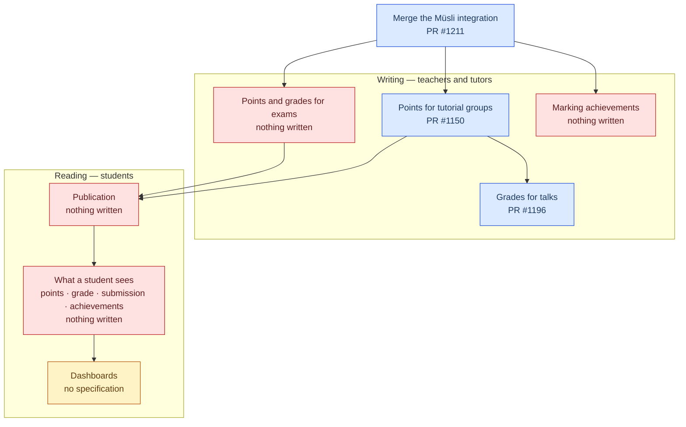

# Roadmap

```admonish info "Last reconciled: 2026-08-13"
Against the working tree, `next`, and the open pull requests — not against the
other planning chapters. Those describe what was intended and are still worth
reading for that; this one describes what is left.

To reconcile it again: take each entry, find the model or controller it names,
and check `git log -S` for it. Where an entry points at a pull request, check
whether that pull request has moved.
```

The [Implementation Plan](plan.md), the [PR Roadmap](implementation-prs.md) and
the [Parallelization Strategy](parallelization.md) were written before any of
this existed. They drifted, in two ways worth naming so this chapter does not
drift the same way.

They **name files**. Every migration filename in the PR roadmap is now wrong,
because timestamps moved when the work was actually done. This chapter names
models and controllers instead; those survive a rebase.

And they know only two states, **planned** and **done**. Most of what is left is
neither: the code is written, it sits in a pull request, and it is waiting for a
person. An entry that says "planned" for three months while a branch rots is
worse than no entry, because it hides the real blockage. Every entry below
therefore ends with what it waits on, and whether that is code or a decision.

```admonish tip "Roles, not names"
Entries say *a reviewer*, not who. Naming makes a document age badly and read as
an accusation; the pull request already carries the names. If your team prefers
names, swap them in — the point is that the waiting is visible either way.
```

---

## The shape of what is left

Everything below is one chain. Points have to be writable before anything can be
published, and nothing can be published before a student has a page to read it
on. The two halves are split that way here: what puts data in, and what lets
someone see it.



---

| # | Function | Who uses it | Where it stands | Waiting on |
|---|---|---|---|---|
| 1 | Merge the Müsli integration | — | PR #1211 | a decision to merge |
| 2 | Points for tutorial groups | tutors | PR #1150, code complete | a reviewer |
| 3 | Grades for talks | teachers | PR #1196, draft, stacked on 2 | entry 2, then a reviewer |
| 4 | Points and grades for exams | teachers | nothing written | entry 1, then code |
| 5 | Marking achievements | teachers, tutors | nothing written | entry 1, then code |
| 6 | Publication | the switch itself | nothing written | code |
| 7 | What a student sees — points, grade, submission, achievements | the participant | nothing written | entry 6, then code and a design call |
| 8 | Dashboards | everyone, differently | nothing written | a specification |

---

## Writing — teachers and tutors

Nothing in the merged tree writes a point. Every point in the system comes from
`lib/demo`. Grade schemes, performance records and the whole eligibility chain
run, but only ever on seeded data. Until that is fixed, everything downstream is
built on a floor nobody has stood on.

### 1 · Merge the Müsli integration

The five former slices in one branch, with the Playwright suite for the
assessment area and its own round of review. Every other entry either builds on
it or conflicts with it, so nothing below can start until it lands.

### 2 · Points for tutorial groups

The read-only point grid, the grade scheme pipeline, and the performance and
eligibility chain are all fed by hand-entered points that no interface can
produce. This is that interface — for tutorial groups, and nothing else. Talks,
exams and achievements each need their own path; entries 3 to 5 are those paths.

Open since May. Before a review it needs a duplicate `note` migration dropped —
the integration branch folded that column into the create-table migration — and a
rolled-back schema version fixed. CI has still never run for it: the test
workflow fires for pull requests based on `main` or `next` only, and this one
targets the integration branch.

### 3 · Grades for talks

The same surface for talks. Grades can otherwise be written for a whole cohort by
applying a scheme, and in no other way — there is no path for a single
correction.

### 4 · Points and grades for exams

An exam can be registered for, scheduled, and graded by applying a scheme to a
whole cohort. A single result cannot be entered or corrected by hand at all. This
is the exam-shaped version of what entries 2 and 3 build: points per
participation, the grade beside them, and the correction path the scheme-wide
application does not offer.

### 5 · Marking achievements

Achievements exist, the marking view exists, and the service that feeds them into
performance records exists. Nothing marks one except a seed, so the eligibility
rules that count achievements count only fixtures.

---

## Reading — students

The assessment surface is teacher-only from end to end. `AssessmentAbility`
grants everything through the lecture's edit right, and no route reaches a
student.

### 6 · Publication

`results_published_at` already decides whether an exam counts as graded, and no
production code sets it. What is missing is an action to publish and one to
withdraw, on the assessment, with the guard that says who may.

### 7 · What a student sees

A student cannot see their own points, grade, submission state or achievements
anywhere, and all four belong on the same page. This needs the student's own view
of a participation, and an ability that grants it to the participant rather than
to the lecture's staff. For achievements that includes progress: what is earned,
and what is still open.

It is also where the submission page has to be rebuilt rather than extended.
Today it answers one question — did I hand something in — and results have no
place on it. A student looking for a point, a grade and a submission state will
look in one place, and that place is the wrong shape for two of the three.

### 8 · Dashboards

The largest untouched block, and the only one where no code exists at all. Worth
re-specifying before starting: the chapters describing it were written before the
assessment area existed and assume screens that were never built.

---

## Then — what is left over from registration

### Exam registration, second pass

Making an exam the fourth thing a student can register for — next to tutorials,
talks and cohorts — left four screens half-fitting. The defects are fixed. What
remains is design, and it was deliberately kept out of the integration branch so
that it would not be reviewed inside a very large diff:

- what the "not assigned to a group yet" notice should say when an exam is one of
  the things a student holds, given that an exam involves no allocation at all
- whether that block should know about the campaigns, so it can speak per kind
  instead of once for everything
- whether the lecture roster should be a prerequisite for registering — today it
  is not, deliberately, and registration is decoupled from content access
- the tutorial-flavoured styling an exam tile inherits

It waits on entry 1, then a design call.

---

## Continuous

### CI health

The two named failures are gone. The end-to-end spec that had been red on `next`
was a blocked PDF loader, replaced by a separate rasterizer in PR #1216; the
strict-mode violation that followed — a second login button whose accessible name
contains the first one's — was PR #1218. Both are merged.

What remains is the intermittent one: the Playwright suite fails roughly two runs
in eleven, always the same shape, a test timing out with a navigation in flight.
Measured and excluded: browser memory, server latency, asset serving,
recompilation after an edit, background jobs, disk, CPU, and unhandled dialogs.
Not reproducible on demand. Recorded here so the next person does not start the
search from the beginning.

A permanently red pipeline hides real regressions, so the rule stands: fix it or
skip it, and say which in the pull request.

### The book

The chapters were written ahead of the code and have drifted. The known cases,
each small on its own:

- five controllers documented as if they existed; two live only on unmerged
  branches, three nowhere
- a whole section of student-facing views that no user can reach
- the roster namespace written in the singular throughout, while the models use
  the plural
- the policy engine described as a case statement, where the code dispatches to
  handler objects — and the service that actually decides eligibility has no
  chapter
- the evaluator's result described with fourteen fields where it has five, and
  without the deferred status the whole mechanism exists for
- duplicated sections and one file that is a heading and nothing else

None of it is hard. All of it costs a reader an hour of confusion, and some of it
will send them down the wrong path.
