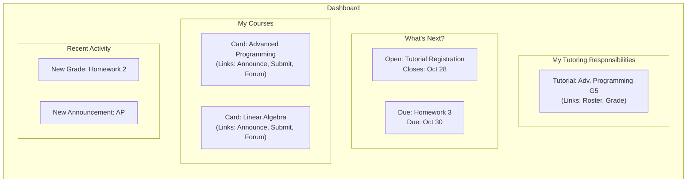

# Student Dashboard

## Problem Overview
The current landing page for students is a simple list of their subscribed lectures. It lacks a centralized, actionable view of a student's immediate tasks, deadlines, and overall status across all their courses. Students must navigate to separate pages to find open registrations, check assignment due dates, or see recent announcements, leading to a disconnected experience.

## Solution Architecture
We will introduce a new, unified dashboard as the primary landing page for all logged-in students, replacing the existing `main/start` view. The dashboard will be composed of dynamic "widgets" or "cards" that surface the most relevant and time-sensitive information from both existing and new systems. It will serve as a read-only presentation layer, providing clear, actionable links to the relevant parts of the application.

The development will be phased to provide immediate value while accommodating the parallel implementation of the new registration and grading systems:
-   **Phase A (Immediate Value):** The initial dashboard will be built using existing data models (`Assignment`, `Announcement`, user's lecture subscriptions). This provides an improved user experience for the current semester.
-   **Phase B (Integration):** As new systems come online, their corresponding widgets ("Open Registrations", "Recent Grades", "Tutoring") will be activated on the dashboard, ready for the next semester.

---

## 1) Dashboard Controller & View

```admonish info "What it represents"
-   The new Rails controller and view that will render the dashboard. It will be responsible for fetching and organizing all the necessary data for the current user.
```

```admonish note "Think of it as"
-   The central hub for the student experience.
```

```ruby
# filepath: app/controllers/dashboard_controller.rb
class DashboardController < ApplicationController
  before_action :authenticate_user!

  def show
    # Phase A: Data from existing models
    @my_lectures = current_user.current_subscribed_lectures
    @upcoming_assignments = find_upcoming_assignments(@my_lectures)
    @recent_announcements = find_recent_announcements(@my_lectures)

    # Phase B: Data from new models (conditionally enabled)
    if feature_enabled?(:roster_system)
      @tutored_groups = find_tutored_groups(current_user)
    end
    if feature_enabled?(:registration_system)
      @open_campaigns = find_open_campaigns(current_user)
    end
    if feature_enabled?(:grading_system)
      @recent_grades = find_recent_grades(current_user)
    end
  end

  private

  # ... helper methods to query the respective models ...
end
```

---

## 2) "What's Next?" Widget (Actionable Deadlines)

```admonish info "What it represents"
-   A timeline or sorted list of the most urgent, time-sensitive items for the student. This is the most critical component of the dashboard.
```

Content:
-   **Open Registrations:** Shows active `RegistrationCampaigns` the user is eligible for.
    -   **Displays:** Campaign Title, Lecture, and "Closes on: [deadline]".
    -   **Action:** A "Register Now" button linking to the campaign page.
-   **Assignment Deadlines:** Shows upcoming `Assignments` from the user's subscribed lectures.
    -   **Displays:** Assignment Title, Lecture, and "Due: [deadline]".
    -   **Action:** A "View/Submit" button linking to the submission page.

---

## 3) "My Courses" Widget (Quick Access)

```admonish info "What it represents"
-   An evolution of the existing "My current subscribed lectures" list, presented as a grid of cards for easier access.
```

Content:
-   Each card displays the lecture title and instructor.
-   Provides quick-access icons or links to key areas for that lecture, such as **Announcements**, **Submissions**, and the **Forum**.

---

## 4) "Recent Activity" Widget (Notifications)

```admonish info "What it represents"
-   A feed showing recent events and feedback relevant to the user.
```

Content:
-   **New Grades:** Once the new grading system is live, this will show recently published grades.
    -   **Displays:** "Grades for [Assignment Title] are now available."
    -   **Action:** A "View Grade" button linking to the `AssessmentParticipation` details.
-   **New Announcements:** Shows the 2-3 most recent announcements from the user's subscribed lectures.
    -   **Displays:** A snippet of the announcement text.
    -   **Action:** A link to view the full announcement.

---

## 5) "My Tutoring Responsibilities" Widget

```admonish info "What it represents"
-   A dedicated section that appears only for students who are also tutors for one or more tutorial groups. This is a key feature for student tutors.
```

Content:
-   A list of their assigned tutorial groups (e.g., "Advanced Programming - Tutorial Group 5").
-   For each group, provides direct links to:
    -   **"View Roster"**: See the list of students in their group.
    -   **"Grade Submissions"**: A direct link to the grading UI, pre-filtered for their group's submissions.

---

## 6) Phased Implementation Strategy

The dashboard's development is designed to be non-disruptive and deliver value incrementally.

-   **Phase A (During Current Semester):**
    -   **Action:** Build the dashboard shell, controller, and the "My Courses" and "Assignment Deadlines" widgets using existing data sources.
    -   **Placement:** This can be developed in parallel with **Steps 1-4** of the main implementation plan.
    -   **Outcome:** Students in the current semester get an improved, more organized landing page immediately.

-   **Phase B (Before Next Semester):**
    -   **Action:** Implement and activate the "Open Registrations", "Recent Activity" (grades), and "My Tutoring Responsibilities" widgets, connecting them to the new backend models.
    -   **Placement:** This work should be done after **Steps 5-8** of the main plan are functionally complete.
    -   **Outcome:** The dashboard is fully functional for the start of the next semester, seamlessly displaying information from the new systems.

---

## 7) UI Mockup (Placeholder)


