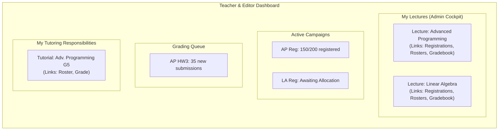

# Teacher & Editor Dashboard

## Problem Overview
Teachers and lecture editors currently lack a centralized administrative hub. Managing course registrations, viewing allocation progress, overseeing grading, and administering rosters requires navigating to disparate sections of the application for each lecture. This becomes inefficient, especially for staff managing multiple courses.

## Solution Architecture
We will introduce a new, role-based dashboard for users with `teacher` or `editor` permissions on one or more lectures. This dashboard will serve as the primary administrative entry point, providing a high-level overview of all assigned lectures and direct links to key management tasks like registration setup, roster administration, and grading.

---

## 1) Dashboard Controller & View

```admonish info "What it represents"
-   A new Rails controller and view, likely under an administrative namespace (e.g., `admin/dashboard_controller.rb`), that is the landing page for users with teaching roles.
```

```admonish note "Think of it as"
-   The mission control center for lecture administration.
```

```ruby
# filepath: app/controllers/admin/dashboard_controller.rb
class Admin::DashboardController < ApplicationController
  before_action :authenticate_user!
  # Add authorization check for teacher/editor roles

  def show
    @my_lectures = find_administrated_lectures(current_user)
    @active_campaigns = find_active_campaigns(@my_lectures)
    @grading_queue = find_grading_queue(@my_lectures)

    # For the case where a teacher is also a tutor
    @tutored_groups = find_tutored_groups(current_user)
  end

  private

  # ... helper methods to query the respective models ...
end
```

---

## 2) "My Lectures" Widget (Admin Cockpit)

```admonish info "What it represents"
-   The primary widget, showing a card for each lecture the user administers.
```

Content per card:
-   Lecture Title and Term.
-   Key administrative actions:
    -   **"Manage Registrations"**: Links to the `Registration::Campaign` teacher/editor UI for that lecture. Shows status (Draft, Open, Closed, Finalized).
    -   **"Manage Rosters"**: Links to the `Roster::MaintenanceService` UI for managing tutorial/exam rosters post-allocation.
    -   **"Gradebook"**: Links to the new grading UI for the lecture's assessments.
    -   **"Announcements"**: Links to create/edit announcements for the lecture.

---

## 3) "Active Campaigns" Widget (Registration Overview)

```admonish info "What it represents"
-   An aggregated view of all active or recently closed registration campaigns across the user's lectures.
```

Content:
-   A list of campaigns showing:
    -   Campaign Title & Lecture.
    -   **Status:** e.g., "Open - 150/200 registered", "Awaiting Allocation", "Finalized".
    -   **Action:** A "View Details" button linking to the campaign's admin page.

```admonish tip "API at a glance (Teacher)"
- campaign.evaluate_policies_for(user) → Result (pass, failed_policy, trace)
- campaign.policies_satisfied?(user) → Boolean
- campaign.open_for_registrations? → Boolean
- campaign.allocate_and_finalize! → Execute solver and finalize (preference-based)
- campaign.finalize! → Materialize confirmed results to rosters
- campaign.registration_policies / .registration_items / .user_registrations
```

---

## 4) "Grading Queue" Widget

```admonish info "What it represents"
-   An actionable list of assessments that have submissions awaiting grading.
```

Content:
-   A list of assessments showing:
    -   Assessment Title & Lecture.
    -   **Status:** e.g., "35 new submissions to grade".
    -   **Action:** A "Start Grading" button linking directly to the grading UI, filtered for that assessment.

---

## 5) "My Tutoring Responsibilities" Widget

```admonish info "What it represents"
-   A dedicated section for users who are also tutors for specific groups. This covers the case where teachers or editors are directly responsible for a tutorial.
```

Content:
-   A list of their assigned tutorial groups (e.g., "Advanced Programming - Tutorial Group 5").
-   For each group, provides direct links to:
    -   **"View Roster"**: See the list of students in their group.
    -   **"Grade Submissions"**: A direct link to the grading UI, pre-filtered for their group's submissions.

## 6) UI Mockup (Placeholder)


