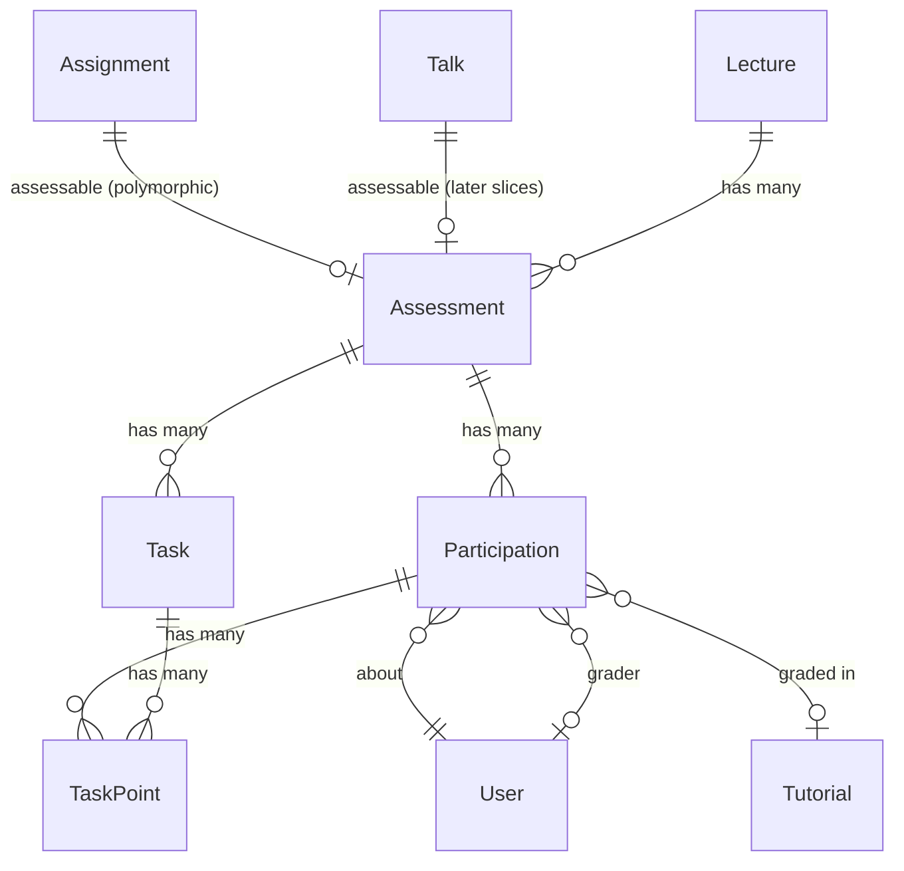

# Slice 1 — Assessment Core

```admonish info "What this page is"
An orientation map for the first Müsli slice (PR #1105, branch
`muesli-01-assessment-core`): which models it adds, how they relate to what
already exists, and which screens appear. Read it before the diff, not instead
of it.

[Before you read the code](#before-you-read-the-code) collects the places where
the diff is easy to misread. The reasoning behind each rule lives in the feature
chapters, linked from there.
```

## TL;DR

Slice 1 introduces a **generic assessment layer** that any domain object can opt
into, and a teacher-facing dashboard on top of it.

1. Anything that can be assessed — today an `Assignment`, later a `Talk`,
   `Achievement` or `Exam` — includes a concern and gets an `Assessment`
   attached.
2. An assessment optionally carries **tasks** with maximum points.
3. Each enrolled student gets a **participation**, which holds status, points and
   grade.
4. Points per task and student are stored as **task points**.

Everything above is inert until the `assessment_grading` feature flag is on.

```admonish warning "This slice also carries an unrelated feature"
About 880 added lines implement `submission_deletion_date` — a deletion date on
lectures that fans out to assignments and drives the submission cleaner. It has
no coupling to the assessment layer (the assessment code references it nowhere)
and can be reviewed independently. Files: `assignment.rb`,
`submission_cleaner.rb`, `assignments_controller.rb`, `submissions_controller.rb`
and their specs, plus migration `…000006`.
```

## New models

Each name links to its full description in
[Assessments & Grading](../features/04-assessments-and-grading.md), which covers
the fields, lifecycle and usage scenarios this page only summarises.

| Model | Purpose | Notable columns |
|---|---|---|
| [`Assessment::Assessment`](../features/04-assessments-and-grading.md#assessmentassessment-activerecord-model) | The assessment attached to one assessable | `assessable_type/_id`, `requires_points`, `requires_submission`, `results_published_at` |
| [`Assessment::Task`](../features/04-assessments-and-grading.md#assessmenttask-activerecord-model) | One task with a point maximum | `max_points`, `position` (`acts_as_list`) |
| [`Assessment::Participation`](../features/04-assessments-and-grading.md#assessmentparticipation-activerecord-model) | One student's participation | `status`, `points_total`, `grade_numeric`, `grade_text`, `submitted_at`, `graded_at`, `grader_id` |
| [`Assessment::TaskPoint`](../features/04-assessments-and-grading.md#assessmenttaskpoint-activerecord-model) | Points for one (task, participation) | `points` |

Plus three concerns that form a capability ladder:

| Concern | Grants |
|---|---|
| [`Assessment::Assessable`](../features/04-assessments-and-grading.md#assessmentassessable-concern) | `has_one :assessment`, `ensure_assessment!`, `grading_open?` |
| [`Assessment::Pointable`](../features/04-assessments-and-grading.md#assessmentpointable-concern) | `ensure_pointbook!` — an assessment that requires points |
| [`Assessment::Gradable`](../features/04-assessments-and-grading.md#assessmentgradable-concern) | `ensure_gradebook!`, `set_grade!` |

`Pointable` and `Gradable` both include `Assessable`, so including either is
enough. In slice 1 `Assignment` includes `Pointable` and `Talk` includes
`Gradable`; slices 2 and 4 add `Achievement` and `Exam` on the same interface.

## Before you read the code

Ten places where the diff is easy to misread — what the mechanism is, and what
you would otherwise conclude. The reasoning behind each rule lives in the
[Assessments & Grading chapter](../features/04-assessments-and-grading.md); this
page says what you need in order to read *this branch*, and links there for the
rest.

### Capability is a property of the class, not of the row

Whether something carries points or grades is decided by which concern it
[includes][c1-assessable] — `Pointable`, `Gradable`, both. "Is this gradable?" is
answered by `assessable.is_a?(Assessment::Gradable)`, which is exactly what
`Participation` asks before allowing a numeric grade.

So making a new kind of thing gradable is a code change, never a setting. If you
are looking for a column or a flag that switches it, there is none. See
[the concern](../features/04-assessments-and-grading.md#assessmentassessable-concern).

### One assessment per assessable — by convention, not by constraint

Every later slice reaches through [`assessable.assessment`][c1-ensure] and relies
on there being exactly one. Two details are worth carrying into the review: the
index on `(assessable_type, assessable_id)` is **not** unique and no validation
enforces the rule, so it is held by a single code path; and every caller is an
`after_create`, so `ensure_assessment!` runs once per record and its idempotency
is a safeguard rather than something currently in use.

### The grade scale skips 4.3 and 4.7

Below 4.0 everything is 5.0 — an [inclusion validation plus a schema check
constraint][c1-grades] enforce it. Slice 5 repeats the same list as
`GradeScheme::PASSING_GRADES` (without 5.0), so it now lives in two places.

### Grading opens only once nobody can still submit

For an assignment, [`grading_open?` is aliased to `totally_expired?`][c1-assignopen],
so it turns true only after the deadline **and** the grace period have passed.
While it is false, [`grading_lifecycle_must_be_open`][c1-lifecycle] rejects any
change to `grade_numeric`, `grade_text`, `points_total`, `grader_id` or
`graded_at`, and any move away from `pending`. `Assessment::TaskPoint` carries
the same guard, so individual point entries are covered too.

Two things are easy to misread. The alias hides *which* deadline is meant —
`friendly_deadline`, not `deadline` — so anything reasoning about the boundary has
to account for the grace period. And the guard blocks *changes*, not just first
entries, so it also constrains corrections while an assignment is briefly
reopened.

Assessables that do not [override `grading_open?`][c1-open] — `Talk` here, `Exam`
and `Achievement` in later slices — are always open. The rule is in
[Grading Rules](../features/04-assessments-and-grading.md#grading-rules).

Covered by `participation_spec` (`describe "the grading lifecycle guard"`) and
`task_point_spec`.

### Tasks are the only source of what an assessment is worth

[`effective_total_points`][c1-effective] is the sum of the tasks' `max_points`,
full stop. There is no column to override it.

**A result may exceed the total, and that is intended.** `TaskPoint#points` has a
floor of 0 and no ceiling against the task's `max_points` — that is how a bonus
task works. So `points_total` can be larger than `effective_total_points`, and
percentages above 100 % are normal. Every consumer handles it: the performance
record stores the value uncapped, an eligibility rule's `min_percentage` is
cleared by it, and the grade schemes match bands descending with `>=`, so the top
band applies.

Covered by `task_point_spec` ("accepts bonus points exceeding task maximum") and
by `grade_scheme_applier_spec`.

### Participations are seeded in bulk, past the validations

[`seed_participations_from!`][c1-seed] writes rows with `insert_all` — one
statement instead of one `create!` per student. Its only caller in this slice is
`AssessmentBackfillWorker`: for an assignment whose deadline has passed and whose
lecture still keeps submissions, it collects the tutorial memberships and seeds a
participation for each member, carrying the tutorial along.

Going straight to SQL means Rails does none of its usual work, which is visible
in the method: the enum has to be written as `Participation.statuses[:pending]`
and the timestamps by hand.

**No validation is skipped that would have mattered.** `Participation` has four
and no callbacks at all, and a seeded row — `pending`, every grading field empty
— passes all four: the lifecycle guard does not fire without grading data, the
grade inclusion allows nil, and the gradability check only runs when a numeric
grade is present. Uniqueness is covered twice over: the method first plucks the
existing `user_id`s and drops them, and `unique_by: [:assessment_id, :user_id]`
adds an `ON CONFLICT DO NOTHING` against the unique index
`index_participations_on_assessment_and_user`, so even two concurrent runs cannot
duplicate.

The one thing to carry forward: this is a second write path. A validation added
to `Participation` later will not apply to seeded rows, and would need a second
home here.

Covered by `assessment_backfill_worker_spec` — eleven examples, including
idempotency and that existing participations are never overwritten.

~~~admonish danger "Concerns another PR: this seeding disables a feature on `muesli/tutor-grading-view`"
**What that branch is trying to do.** With a paper assignment nobody uploads
anything, so the system has no way of knowing who handed a sheet in. Without that,
a student whose work is sitting in the tutor's pile is indistinguishable from one
who brought nothing. The grading view therefore gives the tutor a button, "Mark as
participated", and records the answer by **creating a participation row**:

```ruby
def init_participation(assessment, user, tutorial)
  participation = Participation.find_or_initialize_by(
    assessment_id: assessment.id, user_id: user.id
  )
  participation.update!(tutorial_id: tutorial.id) if participation.new_record?
  participation
end
```

Whether the button is offered at all is decided the same way — by asking whether a
row is already there, with no further condition:

```ruby
def assessment_participation_in_assignment(assignment)
  assessment_participations.where(assessment: assignment.assessment)&.first
end
```

**Why it cannot work.** The worker described above creates exactly that row, for
every tutorial member of every expired assignment, and `config/schedule.yml` runs
it on `*/1 * * * *` — every minute. A minute after the deadline everyone has a
row. The button is never offered, every non-submitter counts as having
participated, and the "not yet marked" tally sits at zero for good.

Neither change is wrong on its own. They simply use the same fact for two
different statements — *this is due for grading* and *this was handed in* — which
is the kind of collision that only surfaces when the branches meet, since both are
green apart.

**Why it reaches into slice 2.** `points_max_pending_materialized` recognises work
awaiting marking as `pending` **and** `submitted_at` present. A paper assignment
has no `submitted_at`, so for those lectures the figure is permanently zero and
slice 3 cannot defer an eligibility decision that a marking backlog has distorted —
exactly the case the column was added for.

**What would fix it, on that branch.** Have `init_participation` set
`submitted_at` as well, the way the upload path already does in
`SubmissionsController`, and have the view ask for that instead of for the row.
Then `submitted_at` means one thing everywhere — handed in, on paper or digitally
— the seeding stops interfering, and slice 2's figure covers both kinds of
assignment. It is also the convention this slice set: see [the display status
entry](#submission-is-a-timestamp-so-the-display-status-is-derived), where
`submitted_at` is deliberately the only record of whether something was handed in.

Fixing it here instead — by seeding fewer rows — would be the wrong end. The
worker creates them so that tutors have something to grade against; that is its
purpose, not its mistake.
~~~

### Entered points block deleting a task; the deadline does not

A task is deletable until somebody has recorded a result for it. From then on
[`check_no_points_entered`][c1-nopoints] aborts the destroy, so grading data can
never disappear underneath a student.

"Recorded a result" is [`points_entered?`][c1-pointsentered] — a task point whose
`points` is not nil. The distinction matters in both directions: a row with
`points: nil` is an empty form field, not a mark, and does not block; `points: 0`
*is* a mark and does.

The deadline on its own does **not** protect a task. A question that turns out to
be wrongly posed or unsolvable has to be removable after the fact, and by then
nobody will have marked it — so the guard that used to fire on
`past_deadline?` was dropped, together with the disabled button it drove.

Two consequences worth knowing. Deleting a task changes what the assessment is
worth, so from slice 2 on `Task`'s `after_commit` recomputes every performance
record in the lecture — which is exactly what you want when an unsolvable
question is removed. And the block is not silent: the task card disables the
button with the tooltip "Cannot delete: Points have been entered for this task.",
and `TasksController#destroy` checks the return value and shows an alert.

Covered by `task_spec`, `describe "destruction"` — the four `points_entered?`
cases, and a passed-deadline context asserting deletion still works while no
points exist and stops once they do.

### Submission is a timestamp, so the display status is derived

The enum has four values — `pending`, `reviewed`, `absent`, `exempt` — but the
views need five, because `pending` covers two quite different situations.
[`display_status`][c1-display] tells them apart by `submitted_at`: pending with
no submission reads as `:not_submitted`, pending with one as `:pending_grading`,
and every other status passes through unchanged.

Why it is derived rather than stored is in
[the status workflow](../features/04-assessments-and-grading.md#status-workflow).

Querying is barely affected: `submitted` is already a scope, so
`pending.submitted` is exactly the "waiting to be marked" set and
`pending.where(submitted_at: nil)` the other one.

`ParticipationStatusBadgeComponent` knows all five symbols and falls back to
`:not_submitted` for anything unexpected, so the contract has no gap.

Note the method is defined here but first used in slice 2, by
`records_controller` and the record view.

Covered by `participation_spec` (`describe "#display_status"`) — one example per
branch, plus one pinning that `submitted_at` stops mattering once the status
leaves `pending`.

### The lecture is stored twice, and the assessable may not move

An assessment hangs off its subject polymorphically, so the lecture is reachable
only as `assessment.assessable.lecture`. Answering "all assessments of this
lecture" that way means joining across four different tables and merging the
results. The assessment therefore keeps its own `lecture_id`, and five places in
the stack query it directly — `ComputationService` twice, `records_controller`
twice, `lectures_controller` once.

That second copy has to be kept honest, from both sides:

- [`lecture_matches_assessable`][c1-lecmatch] rejects saving an assessment whose
  lecture disagrees with its subject's.
- [`lecture_id_immutable`][c1-lecimmutable] in `Assessable` rejects moving the
  *subject* to another lecture at all.

Because the second rule lives in the concern it covers `Assignment` and `Talk`
here, and `Achievement` and `Exam` as soon as those arrive. Why the copy has to be
frozen is in [the concern](../features/04-assessments-and-grading.md#assessmentassessable-concern).

Note what this does *not* fix: `lecture_id` is still in `AssignmentsController`'s
permit list, and `authorize_resource` runs against the record as loaded, before
the change is applied. Both predate this stack — the rule above stops the write
regardless of which path attempts it.

Covered by `assessable_spec` (`describe "lecture immutability"`) and
`assessment_spec` ("validates lecture matches assessable lecture").

### `requires_submission` freezes once the deadline has passed

The switch says whether something is handed in. It lives on the assessment only —
`assignments` has no such column; [`Assignment#requires_submission`][c1-reqsub]
reads through to the assessment, falling back to an in-memory value before one
exists, which is how the creation form's value gets in.

What it controls is what **teachers see**, not what students may do: nothing in
`SubmissionsController` or `Submission` consults it. It switches three views —
the grading overview between a submission table and a plain participant count,
the statistics tab's submission figures, and an icon in the index.

[`requires_submission_locked_after_deadline`][c1-locksub] rejects changing it once
an assignment is past its deadline. Only that one attribute is frozen; the guard
is conditional on `requires_submission_changed?`, so everything else on the
assessment stays editable.

What the freeze protects — the grading view's account of what actually happened —
is in [the submission-support note](../features/04-assessments-and-grading.md#assessmentassessment-activerecord-model).

As with task deletion, the block is not silent: the settings form renders the
checkbox `disabled: assessable.past_deadline?` with a padlock and an explanation,
and the validation is what catches anything that gets past the form.

Covered by `assessment_spec`, `describe "requires_submission locking after
deadline"`.

## How they relate



```admonish note "The assessable link is polymorphic and one-to-one"
`has_one :assessment, as: :assessable` — an assignment has at most one
assessment, and `ensure_assessment!` is idempotent, so calling it repeatedly is
safe. There is no path that gives one assessable two assessments.
```

~~~admonish note "`lecture_id` on Assessment is denormalised"
The lecture is reachable through the assessable, but stored again on the
assessment. A validation keeps the two in sync. It exists so that queries can
filter by lecture without joining through a polymorphic association — which
slice 2's computation service relies on heavily.
~~~

## New screens

| Screen | What it does |
|---|---|
| `assessment/assessments/components/assessments_overview_component` | The Assessments tab, with its subtab bar |
| `assessment/assessments/components/assessments_index_component` | List of assessables in the lecture |
| `assessment/assessments` (show, dashboard partials) | One assessment: task list, participations, point entry |
| `assessment/tasks` | Create, edit, reorder and delete tasks |
| `lectures/edit` | Assessment-related lecture preferences |
| `assignments`, `submissions`, `media` (existing views) | Touched by the deletion-date feature |

## New controllers

`Assessment::AssessmentsController` and `Assessment::TasksController`.
`AssignmentsController`, `SubmissionsController`, `LecturesController` and
`MediaController` are extended.

## Migrations

| Migration | Effect |
|---|---|
| `…000000_create_assessment_assessments` | table, polymorphic assessable |
| `…000001_create_assessment_tasks` | table |
| `…000002_create_assessment_participations` | table |
| `…000003_create_assessment_task_points` | table |
| `…000004_add_note_to_assessment_participations` | column |
| `…000005_add_index_on_deadline_and_deletion_date_to_assignments` | index |
| `…000006_add_submission_deletion_date_to_lectures` | column (deletion-date feature) |

## Suggested reading order (~20 min)

1. `app/models/assessment/assessable.rb` — the interface, three methods
2. `app/models/assessment/assessment.rb` — what an assessment owns and validates
3. `app/models/assessment/participation.rb` — status, grade, and the grading
   lifecycle guard
4. `app/models/assessment/task.rb` — the deletion guards
5. `app/models/assessment/gradable.rb` — `set_grade!`, which later slices call
6. [Before you read the code](#before-you-read-the-code) — the ten places where
   what you just read is easy to misread

Files you can skip: locale files, `db/schema.rb`,
`app/frontend/js/mampf_routes.js`.

---

Next: [Slice 2 — Achievements & Performance Records](02-performance.md)

<!-- ------------------------------------------------------------------ -->
<!-- Code permalinks — all pinned to 09fd35df, the tip of                -->
<!-- muesli-01-assessment-core. To re-pin, replace the SHA below.        -->
<!-- ------------------------------------------------------------------ -->

[c1-assessable]: https://github.com/MaMpf-HD/mampf/blob/09fd35df6ea3f600f2f03c72bdf7583d6f719f32/app/models/assessment/assessable.rb
[c1-ensure]: https://github.com/MaMpf-HD/mampf/blob/09fd35df6ea3f600f2f03c72bdf7583d6f719f32/app/models/assessment/assessable.rb#L15-L22
[c1-effective]: https://github.com/MaMpf-HD/mampf/blob/09fd35df6ea3f600f2f03c72bdf7583d6f719f32/app/models/assessment/assessment.rb#L31-L36
[c1-grades]: https://github.com/MaMpf-HD/mampf/blob/09fd35df6ea3f600f2f03c72bdf7583d6f719f32/app/models/assessment/participation.rb#L27-L31
[c1-open]: https://github.com/MaMpf-HD/mampf/blob/09fd35df6ea3f600f2f03c72bdf7583d6f719f32/app/models/assessment/assessable.rb#L24-L28
[c1-assignopen]: https://github.com/MaMpf-HD/mampf/blob/09fd35df6ea3f600f2f03c72bdf7583d6f719f32/app/models/assignment.rb#L66-L69
[c1-lifecycle]: https://github.com/MaMpf-HD/mampf/blob/09fd35df6ea3f600f2f03c72bdf7583d6f719f32/app/models/assessment/participation.rb#L53-L68
[c1-seed]: https://github.com/MaMpf-HD/mampf/blob/09fd35df6ea3f600f2f03c72bdf7583d6f719f32/app/models/assessment/assessment.rb#L42-L68
[c1-nopoints]: https://github.com/MaMpf-HD/mampf/blob/09fd35df6ea3f600f2f03c72bdf7583d6f719f32/app/models/assessment/task.rb#L28-L30
[c1-pointsentered]: https://github.com/MaMpf-HD/mampf/blob/09fd35df6ea3f600f2f03c72bdf7583d6f719f32/app/models/assessment/task.rb#L16-L18
[c1-display]: https://github.com/MaMpf-HD/mampf/blob/09fd35df6ea3f600f2f03c72bdf7583d6f719f32/app/models/assessment/participation.rb#L41-L49
[c1-lecmatch]: https://github.com/MaMpf-HD/mampf/blob/09fd35df6ea3f600f2f03c72bdf7583d6f719f32/app/models/assessment/assessment.rb#L72-L78
[c1-lecimmutable]: https://github.com/MaMpf-HD/mampf/blob/09fd35df6ea3f600f2f03c72bdf7583d6f719f32/app/models/assessment/assessable.rb
[c1-locksub]: https://github.com/MaMpf-HD/mampf/blob/09fd35df6ea3f600f2f03c72bdf7583d6f719f32/app/models/assessment/assessment.rb#L80-L84
[c1-reqsub]: https://github.com/MaMpf-HD/mampf/blob/09fd35df6ea3f600f2f03c72bdf7583d6f719f32/app/models/assignment.rb#L14-L18
