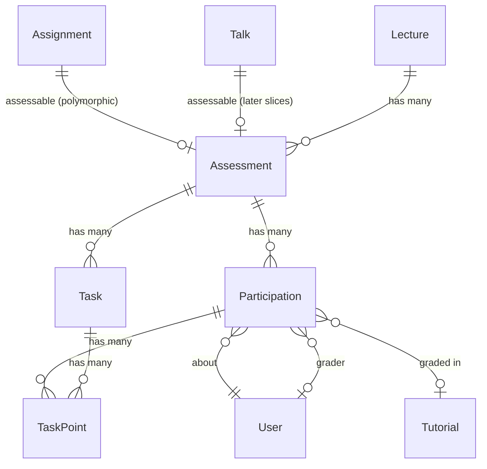

# Slice 1 — Assessment Core

```admonish info "What this page is"
An orientation map for the first Müsli slice (PR #1105, branch
`muesli-01-assessment-core`): which models it adds, how they relate to what
already exists, and which screens appear. Read it before the diff, not instead
of it.

The judgement calls this slice makes are collected in
[Slice 1 — Decisions](01-assessment-core-decisions.md).
```

## TL;DR

Slice 1 introduces a **generic assessment layer** that any domain object can opt
into, and a teacher-facing dashboard on top of it.

1. Anything that can be assessed — today an `Assignment`, later a `Talk`,
   `Achievement` or `Exam` — includes a concern and gets an `Assessment`
   attached.
2. An assessment optionally carries **tasks** with maximum points.
3. Each enrolled student gets a **participation**, which holds status, points and
   grade.
4. Points per task and student are stored as **task points**.

Everything above is inert until the `assessment_grading` feature flag is on.

```admonish warning "This slice also carries an unrelated feature"
About 880 added lines implement `submission_deletion_date` — a deletion date on
lectures that fans out to assignments and drives the submission cleaner. It has
no coupling to the assessment layer (the assessment code references it nowhere)
and can be reviewed independently. Files: `assignment.rb`,
`submission_cleaner.rb`, `assignments_controller.rb`, `submissions_controller.rb`
and their specs, plus migration `…000006`.
```

## New models

| Model | Purpose | Notable columns |
|---|---|---|
| `Assessment::Assessment` | The assessment attached to one assessable | `assessable_type/_id`, `requires_points`, `requires_submission`, `total_points`, `results_published_at` |
| `Assessment::Task` | One task with a point maximum | `max_points`, `position` (`acts_as_list`) |
| `Assessment::Participation` | One student's participation | `status`, `points_total`, `grade_numeric`, `grade_text`, `submitted_at`, `graded_at`, `grader_id` |
| `Assessment::TaskPoint` | Points for one (task, participation) | `points` |

Plus three concerns that form a capability ladder:

| Concern | Grants |
|---|---|
| `Assessment::Assessable` | `has_one :assessment`, `ensure_assessment!`, `grading_open?` |
| `Assessment::Pointable` | `ensure_pointbook!` — an assessment that requires points |
| `Assessment::Gradable` | `ensure_gradebook!`, `set_grade!` |

`Pointable` and `Gradable` both include `Assessable`, so including either is
enough. In slice 1 only `Assignment` uses them; slices 2, 4 and 5 add
`Achievement`, `Exam` and grading on top of the same interface.

## How they relate



```admonish note "The assessable link is polymorphic and one-to-one"
`has_one :assessment, as: :assessable` — an assignment has at most one
assessment, and `ensure_assessment!` is idempotent, so calling it repeatedly is
safe. There is no path that gives one assessable two assessments.
```

```admonish note "`lecture_id` on Assessment is denormalised"
The lecture is reachable through the assessable, but stored again on the
assessment. A validation keeps the two in sync. It exists so that queries can
filter by lecture without joining through a polymorphic association — which
slice 2's computation service relies on heavily.
```

## New screens

| Screen | What it does |
|---|---|
| `assessment/assessments/components/assessments_overview_component` | The Assessments tab, with its subtab bar |
| `assessment/assessments/components/assessments_index_component` | List of assessables in the lecture |
| `assessment/assessments` (show, dashboard partials) | One assessment: task list, participations, point entry |
| `assessment/tasks` | Create, edit, reorder and delete tasks |
| `lectures/edit` | Assessment-related lecture preferences |
| `assignments`, `submissions`, `media` (existing views) | Touched by the deletion-date feature |

## New controllers

`Assessment::AssessmentsController` and `Assessment::TasksController`.
`AssignmentsController`, `SubmissionsController`, `LecturesController` and
`MediaController` are extended.

## Migrations

| Migration | Effect |
|---|---|
| `…000000_create_assessment_assessments` | table, polymorphic assessable |
| `…000001_create_assessment_tasks` | table |
| `…000002_create_assessment_participations` | table |
| `…000003_create_assessment_task_points` | table |
| `…000004_add_note_to_assessment_participations` | column |
| `…000005_add_index_on_deadline_and_deletion_date_to_assignments` | index |
| `…000006_add_submission_deletion_date_to_lectures` | column (deletion-date feature) |

## Suggested reading order (~20 min)

1. `app/models/assessment/assessable.rb` — the interface, three methods
2. `app/models/assessment/assessment.rb` — what an assessment owns and validates
3. `app/models/assessment/participation.rb` — status, grade, and the grading
   lifecycle guard
4. `app/models/assessment/task.rb` — the deletion guards
5. `app/models/assessment/gradable.rb` — `set_grade!`, which later slices call
6. [Slice 1 — Decisions](01-assessment-core-decisions.md)

Files you can skip: locale files, `db/schema.rb`,
`app/frontend/js/mampf_routes.js`.

---

Next: [Slice 2 — Achievements & Performance Records](02-performance.md)
