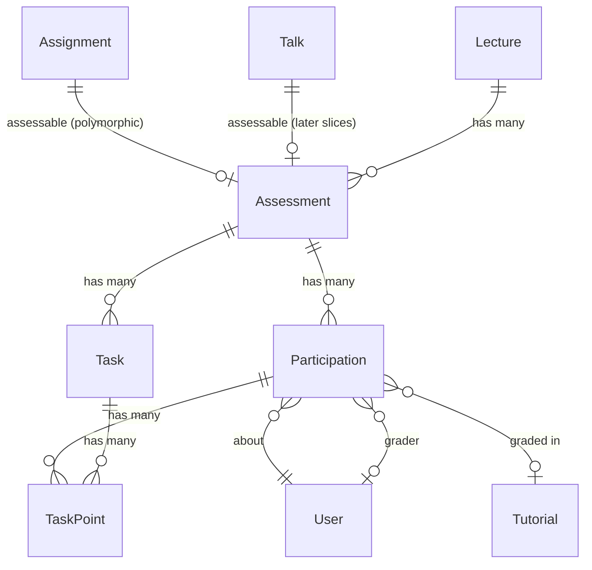

# Slice 1 — Assessment Core

```admonish info "What this page is"
An orientation map for the first Müsli slice (PR #1105, branch
`muesli-01-assessment-core`): which models it adds, how they relate to what
already exists, and which screens appear. Read it before the diff, not instead
of it.

Two sections below carry the design rationale: what the slice inherits from the
architecture book, and what it decided itself.
```

## TL;DR

Slice 1 introduces a **generic assessment layer** that any domain object can opt
into, and a teacher-facing dashboard on top of it.

1. Anything that can be assessed — today an `Assignment`, later a `Talk`,
   `Achievement` or `Exam` — includes a concern and gets an `Assessment`
   attached.
2. An assessment optionally carries **tasks** with maximum points.
3. Each enrolled student gets a **participation**, which holds status, points and
   grade.
4. Points per task and student are stored as **task points**.

Everything above is inert until the `assessment_grading` feature flag is on.

```admonish warning "This slice also carries an unrelated feature"
About 880 added lines implement `submission_deletion_date` — a deletion date on
lectures that fans out to assignments and drives the submission cleaner. It has
no coupling to the assessment layer (the assessment code references it nowhere)
and can be reviewed independently. Files: `assignment.rb`,
`submission_cleaner.rb`, `assignments_controller.rb`, `submissions_controller.rb`
and their specs, plus migration `…000006`.
```

## New models

Each name links to its full description in
[Assessments & Grading](../features/04-assessments-and-grading.md), which covers
the fields, lifecycle and usage scenarios this page only summarises.

| Model | Purpose | Notable columns |
|---|---|---|
| [`Assessment::Assessment`](../features/04-assessments-and-grading.md#assessmentassessment-activerecord-model) | The assessment attached to one assessable | `assessable_type/_id`, `requires_points`, `requires_submission`, `results_published_at` |
| [`Assessment::Task`](../features/04-assessments-and-grading.md#assessmenttask-activerecord-model) | One task with a point maximum | `max_points`, `position` (`acts_as_list`) |
| [`Assessment::Participation`](../features/04-assessments-and-grading.md#assessmentparticipation-activerecord-model) | One student's participation | `status`, `points_total`, `grade_numeric`, `grade_text`, `submitted_at`, `graded_at`, `grader_id` |
| [`Assessment::TaskPoint`](../features/04-assessments-and-grading.md#assessmenttaskpoint-activerecord-model) | Points for one (task, participation) | `points` |

Plus three concerns that form a capability ladder:

| Concern | Grants |
|---|---|
| [`Assessment::Assessable`](../features/04-assessments-and-grading.md#assessmentassessable-concern) | `has_one :assessment`, `ensure_assessment!`, `grading_open?` |
| [`Assessment::Pointable`](../features/04-assessments-and-grading.md#assessmentpointable-concern) | `ensure_pointbook!` — an assessment that requires points |
| [`Assessment::Gradable`](../features/04-assessments-and-grading.md#assessmentgradable-concern) | `ensure_gradebook!`, `set_grade!` |

`Pointable` and `Gradable` both include `Assessable`, so including either is
enough. In slice 1 `Assignment` includes `Pointable` and `Talk` includes
`Gradable`; slices 2 and 4 add `Achievement` and `Exam` on the same interface.

## Following the architecture book

Four things below are the architecture design realised in code, not choices this
PR makes. Read them as background: they tell you *why* the code looks the way it
does, and they save you from weighing questions that were answered before the
branch existed. What the slice genuinely decides is the
[section after this one](#decisions-made-in-this-slice).

| Design | Realised as | Reference |
|---|---|---|
| Capabilities are concerns, not columns | `Assessable` → `Pointable` / `Gradable`, opted into by `include` | [book](../features/04-assessments-and-grading.md#assessmentassessable-concern) · [code][c1-assessable] |
| One assessment per assessable | `has_one … as: :assessable` + `ensure_assessment!` | [book](../features/04-assessments-and-grading.md#assessmentassessable-concern) · [code][c1-ensure] |
| The German grade scale | inclusion validation plus a schema check constraint | [book](../features/04-assessments-and-grading.md#assessmentparticipation-activerecord-model) · [code][c1-grades] |

**Capabilities as concerns** means that whether something carries points or
grades is a property of the *class*, not of the row. "Is this gradable?" is
answered by `assessable.is_a?(Assessment::Gradable)` — exactly what
`Participation` checks before allowing a numeric grade. Making a new kind of
thing gradable is therefore a code change, never a setting, which is what keeps
the answer identical for every row of a type.

**One assessment per assessable** is what every later slice relies on when it
reaches through `assessable.assessment`. Two details are worth carrying into the
review: the uniqueness is a convention held by a single code path rather than a
database constraint — the index on `(assessable_type, assessable_id)` is not
unique and no validation enforces it — and every caller is an `after_create`, so
`ensure_assessment!` runs once per record and its idempotency is a safeguard
rather than something in use.

**The grade scale** skips 4.3 and 4.7: below 4.0 everything is 5.0. Slice 5
repeats the same list as `GradeScheme::PASSING_GRADES` (without 5.0), so it now
lives in two places.

## Decisions made in this slice

Choices this branch made on its own, with the reasoning behind each. Unlike the
section above, these *are* open to argument — if one looks wrong, this is the
place to say so.

### Grading opens only once nobody can still submit

For an assignment, [`grading_open?` is aliased to `totally_expired?`][c1-assignopen],
so it turns true only after the deadline **and** the grace period have passed.
While it is false, [`grading_lifecycle_must_be_open`][c1-lifecycle] rejects any
change to `grade_numeric`, `grade_text`, `points_total`, `grader_id` or
`graded_at`, and any move away from `pending`. `Assessment::TaskPoint` carries
the same guard, so individual point entries are covered too.

A tutor therefore cannot start grading while classmates can still submit or
revise — no partial grading, no early leak of results. Because the guard blocks
*changes* as well, it also constrains corrections made while an assignment is
briefly reopened; that is the intended trade.

Assessables that do not [override `grading_open?`][c1-open] — `Talk` here, `Exam`
and `Achievement` in later slices — are always open, which is the right default
for things without a submission deadline.

Covered by `participation_spec` (`describe "the grading lifecycle guard"`) and
`task_point_spec`.

### Tasks are the only source of what an assessment is worth

[`effective_total_points`][c1-effective] is the sum of the tasks' `max_points`,
full stop. There is no column to override it.

The architecture book originally described an optional `total_points` column,
"computed from tasks if blank". It was created by the migration but never
written: no permit list accepted it, no form offered it, nothing in `app/`
assigned it. Only specs set it, as a shortcut for "this exam is worth 60"
without modelling the tasks — which produced test scenarios that could not occur
in production. This slice drops the column and the specs build tasks instead;
the book has been corrected to match.

**A result may exceed the total, and that is intended.** `TaskPoint#points` has a
floor of 0 and no ceiling against the task's `max_points` — that is how a bonus
task works. So `points_total` can be larger than `effective_total_points`, and
percentages above 100 % are normal. Every consumer handles it: the performance
record stores the value uncapped, an eligibility rule's `min_percentage` is
cleared by it, and the grade schemes match bands descending with `>=`, so the top
band applies.

Covered by `task_point_spec` ("accepts bonus points exceeding task maximum") and
by `grade_scheme_applier_spec`.

### Participations are seeded in bulk, past the validations

[`seed_participations_from!`][c1-seed] writes rows with `insert_all` — one
statement instead of one `create!` per student. Its only caller in this slice is
`AssessmentBackfillWorker`: for an assignment whose deadline has passed and whose
lecture still keeps submissions, it collects the tutorial memberships and seeds a
participation for each member, carrying the tutorial along.

Going straight to SQL means Rails does none of its usual work, which is visible
in the method: the enum has to be written as `Participation.statuses[:pending]`
and the timestamps by hand.

**No validation is skipped that would have mattered.** `Participation` has four
and no callbacks at all, and a seeded row — `pending`, every grading field empty
— passes all four: the lifecycle guard does not fire without grading data, the
grade inclusion allows nil, and the gradability check only runs when a numeric
grade is present. Uniqueness is covered twice over: the method first plucks the
existing `user_id`s and drops them, and `unique_by: [:assessment_id, :user_id]`
adds an `ON CONFLICT DO NOTHING` against the unique index
`index_participations_on_assessment_and_user`, so even two concurrent runs cannot
duplicate.

The one thing to carry forward: this is a second write path. A validation added
to `Participation` later will not apply to seeded rows, and would need a second
home here.

Covered by `assessment_backfill_worker_spec` — eleven examples, including
idempotency and that existing participations are never overwritten.

### Entered points block deleting a task; the deadline does not

A task is deletable until somebody has recorded a result for it. From then on
[`check_no_points_entered`][c1-nopoints] aborts the destroy, so grading data can
never disappear underneath a student.

"Recorded a result" is [`points_entered?`][c1-pointsentered] — a task point whose
`points` is not nil. The distinction matters in both directions: a row with
`points: nil` is an empty form field, not a mark, and does not block; `points: 0`
*is* a mark and does.

The deadline on its own does **not** protect a task. A question that turns out to
be wrongly posed or unsolvable has to be removable after the fact, and by then
nobody will have marked it — so the guard that used to fire on
`past_deadline?` was dropped, together with the disabled button it drove.

Two consequences worth knowing. Deleting a task changes what the assessment is
worth, so from slice 2 on `Task`'s `after_commit` recomputes every performance
record in the lecture — which is exactly what you want when an unsolvable
question is removed. And the block is not silent: the task card disables the
button with the tooltip "Cannot delete: Points have been entered for this task.",
and `TasksController#destroy` checks the return value and shows an alert.

Covered by `task_spec`, `describe "destruction"` — the four `points_entered?`
cases, and a passed-deadline context asserting deletion still works while no
points exist and stops once they do.

### Submission is a timestamp, so the display status is derived

The enum has four values — `pending`, `reviewed`, `absent`, `exempt` — but the
views need five, because `pending` covers two quite different situations.
[`display_status`][c1-display] tells them apart by `submitted_at`: pending with
no submission reads as `:not_submitted`, pending with one as `:pending_grading`,
and every other status passes through unchanged.

The alternative would be a fifth enum value maintained on submission. That gives
two sources for one truth — the status and the timestamp — which can drift.
Deriving keeps `submitted_at` the only record of whether something was handed in.

Querying is barely affected: `submitted` is already a scope, so
`pending.submitted` is exactly the "waiting to be marked" set and
`pending.where(submitted_at: nil)` the other one.

`ParticipationStatusBadgeComponent` knows all five symbols and falls back to
`:not_submitted` for anything unexpected, so the contract has no gap.

Note the method is defined here but first used in slice 2, by
`records_controller` and the record view.

Covered by `participation_spec` (`describe "#display_status"`) — one example per
branch, plus one pinning that `submitted_at` stops mattering once the status
leaves `pending`.

### The lecture is stored twice, and the assessable may not move

An assessment hangs off its subject polymorphically, so the lecture is reachable
only as `assessment.assessable.lecture`. Answering "all assessments of this
lecture" that way means joining across four different tables and merging the
results. The assessment therefore keeps its own `lecture_id`, and five places in
the stack query it directly — `ComputationService` twice, `records_controller`
twice, `lectures_controller` once.

That second copy has to be kept honest, from both sides:

- [`lecture_matches_assessable`][c1-lecmatch] rejects saving an assessment whose
  lecture disagrees with its subject's.
- [`lecture_id_immutable`][c1-lecimmutable] in `Assessable` rejects moving the
  *subject* to another lecture at all. Without it the assessment would keep
  pointing at the old lecture, with nothing to notice — the performance data of
  one lecture quietly counted towards another.

The second rule follows `Tutorial`, which has carried the same guard for the same
attribute all along, down to the `:immutable` error key. Because it lives in the
concern it covers `Assignment` and `Talk` here, and `Achievement` and `Exam` as
soon as those arrive.

Note what this does *not* fix: `lecture_id` is still in `AssignmentsController`'s
permit list, and `authorize_resource` runs against the record as loaded, before
the change is applied. Both predate this stack — the rule above stops the write
regardless of which path attempts it.

Covered by `assessable_spec` (`describe "lecture immutability"`) and
`assessment_spec` ("validates lecture matches assessable lecture").

### `requires_submission` freezes once the deadline has passed

The switch says whether something is handed in. It lives on the assessment only —
`assignments` has no such column; [`Assignment#requires_submission`][c1-reqsub]
reads through to the assessment, falling back to an in-memory value before one
exists, which is how the creation form's value gets in.

What it controls is what **teachers see**, not what students may do: nothing in
`SubmissionsController` or `Submission` consults it. It switches three views —
the grading overview between a submission table and a plain participant count,
the statistics tab's submission figures, and an icon in the index.

[`requires_submission_locked_after_deadline`][c1-locksub] rejects changing it once
an assignment is past its deadline. Only that one attribute is frozen; the guard
is conditional on `requires_submission_changed?`, so everything else on the
assessment stays editable.

The point is not to stop a retroactive obligation — the flag imposes none — but
to stop the grading view from misrepresenting what happened. Turned off after the
fact, a table of 120 submitted files is replaced by "no submission required" while
the files sit untouched underneath. Turned on after the fact, all 120 students
appear as *not submitted*, for work nobody ever asked them to upload.

As with task deletion, the block is not silent: the settings form renders the
checkbox `disabled: assessable.past_deadline?` with a padlock and an explanation,
and the validation is what catches anything that gets past the form.

Covered by `assessment_spec`, `describe "requires_submission locking after
deadline"`.

## How they relate



```admonish note "The assessable link is polymorphic and one-to-one"
`has_one :assessment, as: :assessable` — an assignment has at most one
assessment, and `ensure_assessment!` is idempotent, so calling it repeatedly is
safe. There is no path that gives one assessable two assessments.
```

~~~admonish note "`lecture_id` on Assessment is denormalised"
The lecture is reachable through the assessable, but stored again on the
assessment. A validation keeps the two in sync. It exists so that queries can
filter by lecture without joining through a polymorphic association — which
slice 2's computation service relies on heavily.
~~~

## New screens

| Screen | What it does |
|---|---|
| `assessment/assessments/components/assessments_overview_component` | The Assessments tab, with its subtab bar |
| `assessment/assessments/components/assessments_index_component` | List of assessables in the lecture |
| `assessment/assessments` (show, dashboard partials) | One assessment: task list, participations, point entry |
| `assessment/tasks` | Create, edit, reorder and delete tasks |
| `lectures/edit` | Assessment-related lecture preferences |
| `assignments`, `submissions`, `media` (existing views) | Touched by the deletion-date feature |

## New controllers

`Assessment::AssessmentsController` and `Assessment::TasksController`.
`AssignmentsController`, `SubmissionsController`, `LecturesController` and
`MediaController` are extended.

## Migrations

| Migration | Effect |
|---|---|
| `…000000_create_assessment_assessments` | table, polymorphic assessable |
| `…000001_create_assessment_tasks` | table |
| `…000002_create_assessment_participations` | table |
| `…000003_create_assessment_task_points` | table |
| `…000004_add_note_to_assessment_participations` | column |
| `…000005_add_index_on_deadline_and_deletion_date_to_assignments` | index |
| `…000006_add_submission_deletion_date_to_lectures` | column (deletion-date feature) |

## Suggested reading order (~20 min)

1. `app/models/assessment/assessable.rb` — the interface, three methods
2. `app/models/assessment/assessment.rb` — what an assessment owns and validates
3. `app/models/assessment/participation.rb` — status, grade, and the grading
   lifecycle guard
4. `app/models/assessment/task.rb` — the deletion guards
5. `app/models/assessment/gradable.rb` — `set_grade!`, which later slices call
6. [Decisions made in this slice](#decisions-made-in-this-slice) — the reasoning
   behind what you just read

Files you can skip: locale files, `db/schema.rb`,
`app/frontend/js/mampf_routes.js`.

---

Next: [Slice 2 — Achievements & Performance Records](02-performance.md)

<!-- ------------------------------------------------------------------ -->
<!-- Code permalinks — all pinned to 1b18286c, the tip of                -->
<!-- muesli-01-assessment-core. To re-pin, replace the SHA below.        -->
<!-- ------------------------------------------------------------------ -->

[c1-assessable]: https://github.com/MaMpf-HD/mampf/blob/1b18286c708e89d5982b00eaf6a216c54c2b0584/app/models/assessment/assessable.rb
[c1-ensure]: https://github.com/MaMpf-HD/mampf/blob/1b18286c708e89d5982b00eaf6a216c54c2b0584/app/models/assessment/assessable.rb#L11-L18
[c1-effective]: https://github.com/MaMpf-HD/mampf/blob/1b18286c708e89d5982b00eaf6a216c54c2b0584/app/models/assessment/assessment.rb#L31-L33
[c1-grades]: https://github.com/MaMpf-HD/mampf/blob/1b18286c708e89d5982b00eaf6a216c54c2b0584/app/models/assessment/participation.rb#L27-L31
[c1-open]: https://github.com/MaMpf-HD/mampf/blob/1b18286c708e89d5982b00eaf6a216c54c2b0584/app/models/assessment/assessable.rb#L20-L24
[c1-assignopen]: https://github.com/MaMpf-HD/mampf/blob/1b18286c708e89d5982b00eaf6a216c54c2b0584/app/models/assignment.rb#L66-L69
[c1-lifecycle]: https://github.com/MaMpf-HD/mampf/blob/1b18286c708e89d5982b00eaf6a216c54c2b0584/app/models/assessment/participation.rb#L53-L68
[c1-seed]: https://github.com/MaMpf-HD/mampf/blob/1b18286c708e89d5982b00eaf6a216c54c2b0584/app/models/assessment/assessment.rb#L39-L65
[c1-nopoints]: https://github.com/MaMpf-HD/mampf/blob/1b18286c708e89d5982b00eaf6a216c54c2b0584/app/models/assessment/task.rb#L35-L37
[c1-pointsentered]: https://github.com/MaMpf-HD/mampf/blob/1b18286c708e89d5982b00eaf6a216c54c2b0584/app/models/assessment/task.rb#L17-L19
[c1-display]: https://github.com/MaMpf-HD/mampf/blob/1b18286c708e89d5982b00eaf6a216c54c2b0584/app/models/assessment/participation.rb#L41-L49
[c1-lecmatch]: https://github.com/MaMpf-HD/mampf/blob/1b18286c708e89d5982b00eaf6a216c54c2b0584/app/models/assessment/assessment.rb#L69-L75
[c1-lecimmutable]: https://github.com/MaMpf-HD/mampf/blob/1b18286c708e89d5982b00eaf6a216c54c2b0584/app/models/assessment/assessable.rb
[c1-locksub]: https://github.com/MaMpf-HD/mampf/blob/1b18286c708e89d5982b00eaf6a216c54c2b0584/app/models/assessment/assessment.rb#L77-L81
[c1-reqsub]: https://github.com/MaMpf-HD/mampf/blob/1b18286c708e89d5982b00eaf6a216c54c2b0584/app/models/assignment.rb#L14-L18
