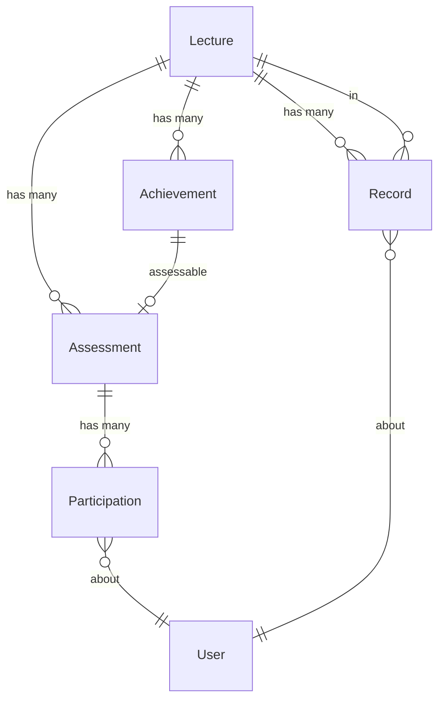
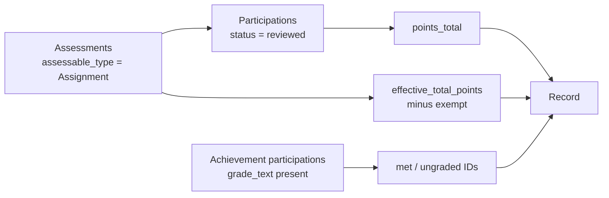

# Slice 2 — Achievements & Performance Records

```admonish info "What this page is"
An orientation map for the second Müsli slice (PR #1106, branch
`muesli-02-performance-achievements`).

[Before you read the code](#before-you-read-the-code) collects the places where
the diff is easy to misread. The reasoning behind each rule lives in the feature
chapters, linked from there.
```

## TL;DR

Slice 2 adds the **facts** that slice 3 will later turn into a decision.

1. **Achievements** — qualitative accomplishments ("gave a blackboard
   presentation", "solved 60 % of the bonus sheet") that are not point-based.
   Each becomes an assessable in slice 1's framework.
2. **Performance records** — one materialised row per (lecture, student) holding
   total points, maximum points, percentage, and which achievements are met or
   still ungraded.
3. A **computation service** that aggregates both and upserts the records.

The record contains facts only, no interpretation. Nothing here decides whether
a student passes — that arrives in slice 3.

## New models

Each name links to its full description in
[Student Performance](../features/05-student-performance.md).

| Model | Purpose | Notable columns |
|---|---|---|
| [`Achievement`](../features/05-student-performance.md#achievement-activerecord-model) | A qualitative criterion in a lecture | `title`, `value_type` (boolean/numeric/percentage), `threshold` |
| [`StudentPerformance::Record`](../features/05-student-performance.md#studentperformancerecord-activerecord-model) | Materialised facts per (lecture, user) | `points_total_materialized`, `points_max_materialized`, `percentage_materialized`, `achievements_met_ids`, `achievements_ungraded_ids`, `computed_at` |
| [`StudentPerformance::ComputationService`](../features/05-student-performance.md#studentperformanceservice-service-object) | Aggregates and upserts records | *(no table)* |

~~~admonish note "The design page calls the service `StudentPerformance::Service`"
Same object, older name — the section it links to describes exactly this
aggregate-and-upsert step. The implementation renamed it.
~~~

`Achievement` includes slice 1's `Assessment::Assessable`, so an achievement gets
an assessment with `requires_points: false` and is "graded" through
`Participation#grade_text` rather than points.

## How they relate



```admonish warning "A Record is not linked to what it summarises"
`Record` has only `lecture_id` and `user_id`. The participations, task points and
achievements it was computed from are not referenced — the arrays
`achievements_met_ids` and `achievements_ungraded_ids` hold bare integers, with
no foreign keys. Deleting an achievement leaves its ID in every record until the
next recomputation.
```

~~~admonish note "Achievements are graded through `grade_text`, not points"
`value_type` decides how the free-text grade is interpreted: `"pass"` for
boolean, a number compared against `threshold` for numeric, a percentage for
percentage. So the same column carries three different meanings depending on the
achievement.
~~~

## What feeds the numbers

The service walks a deliberately narrow path:



Only assignments count towards the points. Exams have points of their own from
slice 4 on, but those are not included here: these totals are what decide who is
admitted to the exam.

## Before you read the code

Four places where the diff is easy to misread. The reasoning behind each lives in
[Student Performance](../features/05-student-performance.md); this page says what
you need in order to read *this branch*.

### The record holds facts, and deliberately no verdict

[`StudentPerformance::Record`](../features/05-student-performance.md#studentperformancerecord-activerecord-model)
stores points earned and achievements met — never an interpretation like
"eligible" or "passed". That is why every column is named `..._materialized` and
why there is no status field to look for.

The separation is what lets slice 3 add the judgement without touching the facts.
If a number looks like it ought to carry a verdict, the verdict is in slice 3.

### Staleness is expected; recomputing is the guarantee

The record is allowed to be out of date between recomputations. Correctness comes
from anything that decides on it recomputing first, not from keeping it in sync
continuously — so a stale row is not a bug.

*How much* is recomputed, and when, is this slice's own choice: changing an
achievement's threshold or type sweeps every record in the lecture, synchronously,
inside the request that saved it. Measured on 400 students with twelve
assignments, that sweep is 0.17 s and eleven queries, the query count being
independent of lecture size.

### Unmarked work is recorded, not counted

Points count only once a tutor has awarded them, while the sheet they belong to
sits in the maximum from the day it exists. That is the right arithmetic — nobody
has earned anything yet — but on its own it makes a marking backlog look exactly
like work never done. Jonas hands in all twelve assignments, eleven come back
worth 96 points, the twelfth is still on his tutor's desk: 96 of 120, 80 %, and
nothing says the missing 24 points are unmarked rather than lost.

So the record carries a fourth figure, `points_max_pending_materialized` — the
maximum of every assessment this student handed in that is not fully marked. The
total, the maximum and the percentage are untouched, so the percentage still means
*share of the term's points*, which is what an eligibility threshold is stated
against. The outstanding amount sits beside it instead of being folded in.

Two readers use it. The overview marks the **assignment's column** with an
hourglass while any of its submissions are unmarked — that is a property of the
sheet, not of the student, so repeating it on every row would say nothing. And
slice 3 defers the eligibility decision rather than refusing it, but only where
the outstanding points could still carry the student over the threshold: somebody
already past it is proposed eligible, somebody who cannot reach it even with
everything outstanding is proposed ineligible, and only the genuinely open cases
wait. Otherwise one unmarked sheet would defer a whole cohort.

A submission counts as awaiting marking while its participation is `pending` with
a `submitted_at`. Paper hand-ins have no such timestamp today, so for them the
figure stays zero — see the note on `muesli/tutor-grading-view` in
[slice 1](01-assessment-core.md).

### A percentage of nothing is nil, not zero

`compute_percentage` returns `nil` rather than `0` when the maximum is zero. That
happens to a student exempt from every assignment, and to everyone in a lecture
that has no assignments yet.

Zero would be a lie: it says the student earned none of what was asked, when in
fact nothing was asked. Consider Bea, excused from both sheets of the term on
medical grounds, next to Cem, who handed in neither. Their totals are identical —
0 points — but Bea's maximum is 0 and Cem's is 40, and only the maximum tells them
apart.

Slice 3 reads that difference: a zero maximum makes the points criterion
`:not_measurable`, which defers the eligibility decision instead of refusing it.
So Cem is proposed ineligible and Bea's case goes to a person, which is where a
full exemption belongs.

## New screens

| Screen | What it does |
|---|---|
| `student_performance/achievements` (index, form, components) | Create and manage achievements, enter per-student grades |
| `student_performance/records` (index, show) | The Performance subtab: computed records, per-student detail |
| `student_performance/components` | Shared badges and status chips |
| `assessment/assessments/components` | Overview component gains the Performance and Achievements subtabs |

## New controllers

`StudentPerformance::AchievementsController` and
`StudentPerformance::RecordsController`. `SubmissionsController` is extended so
that grading a submission triggers a recomputation.

## Migrations

| Migration | Effect |
|---|---|
| `…000001_create_achievements` | table |
| `…000002_create_student_performance_records` | table, with the two ID arrays |

## Suggested reading order (~20 min)

1. `app/models/achievement.rb` — the three value types and the recompute trigger
2. `app/models/student_performance/record.rb` — tiny; note what it does *not* hold
3. `app/models/student_performance/computation_service.rb` — the aggregation,
   read `assessments`, `aggregate_from_prefetched` and `achievement_ids_*` first

---

Previous: [Slice 1 — Assessment Core](01-assessment-core.md) ·
Next: [Slice 3 — Exam Eligibility & Certification](03-eligibility.md)
