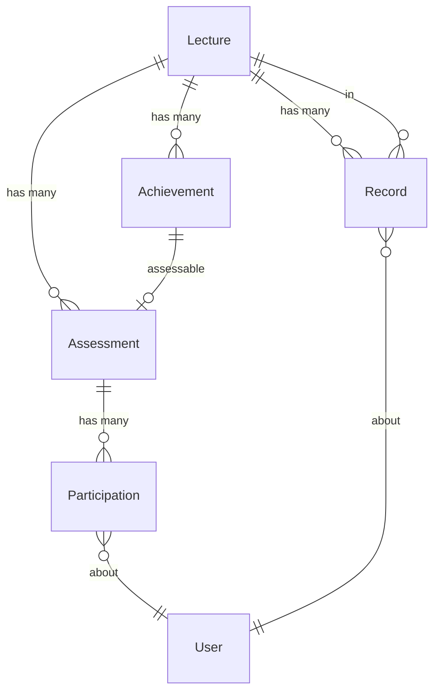
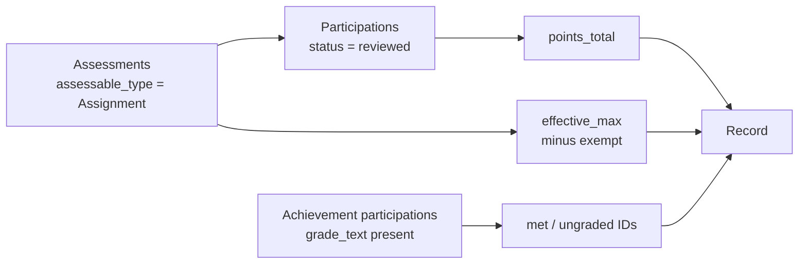

# Slice 2 — Achievements & Performance Records

```admonish info "What this page is"
An orientation map for the second Müsli slice (PR #1106, branch
`muesli-02-performance-achievements`). The judgement calls are collected in
[Slice 2 — Decisions](02-performance-decisions.md).
```

## TL;DR

Slice 2 adds the **facts** that slice 3 will later turn into a decision.

1. **Achievements** — qualitative accomplishments ("gave a blackboard
   presentation", "solved 60 % of the bonus sheet") that are not point-based.
   Each becomes an assessable in slice 1's framework.
2. **Performance records** — one materialised row per (lecture, student) holding
   total points, maximum points, percentage, and which achievements are met or
   still ungraded.
3. A **computation service** that aggregates both and upserts the records.

The record contains facts only, no interpretation. Nothing here decides whether
a student passes — that arrives in slice 3.

## New models

| Model | Purpose | Notable columns |
|---|---|---|
| `Achievement` | A qualitative criterion in a lecture | `title`, `value_type` (boolean/numeric/percentage), `threshold` |
| `StudentPerformance::Record` | Materialised facts per (lecture, user) | `points_total_materialized`, `points_max_materialized`, `percentage_materialized`, `achievements_met_ids`, `achievements_ungraded_ids`, `computed_at` |
| `StudentPerformance::ComputationService` | Aggregates and upserts records | *(no table)* |

`Achievement` includes slice 1's `Assessment::Assessable`, so an achievement gets
an assessment with `requires_points: false` and is "graded" through
`Participation#grade_text` rather than points.

## How they relate



```admonish warning "A Record is not linked to what it summarises"
`Record` has only `lecture_id` and `user_id`. The participations, task points and
achievements it was computed from are not referenced — the arrays
`achievements_met_ids` and `achievements_ungraded_ids` hold bare integers, with
no foreign keys. Deleting an achievement leaves its ID in every record until the
next recomputation.
```

```admonish note "Achievements are graded through `grade_text`, not points"
`value_type` decides how the free-text grade is interpreted: `"pass"` for
boolean, a number compared against `threshold` for numeric, a percentage for
percentage. So the same column carries three different meanings depending on the
achievement.
```

## What feeds the numbers

The service walks a deliberately narrow path:



Everything that is *not* an assignment — talks, exams, achievements themselves —
contributes nothing to the point totals. See
[E-2.1](02-performance-decisions.md#e-21--only-assignments-count-towards-points).

## New screens

| Screen | What it does |
|---|---|
| `student_performance/achievements` (index, form, components) | Create and manage achievements, enter per-student grades |
| `student_performance/records` (index, show) | The Performance subtab: computed records, per-student detail |
| `student_performance/components` | Shared badges and status chips |
| `assessment/assessments/components` | Overview component gains the Performance and Achievements subtabs |

## New controllers

`StudentPerformance::AchievementsController` and
`StudentPerformance::RecordsController`. `SubmissionsController` is extended so
that grading a submission triggers a recomputation.

## Migrations

| Migration | Effect |
|---|---|
| `…000001_create_achievements` | table |
| `…000002_create_student_performance_records` | table, with the two ID arrays |

## Suggested reading order (~20 min)

1. `app/models/achievement.rb` — the three value types and the recompute trigger
2. `app/models/student_performance/record.rb` — tiny; note what it does *not* hold
3. `app/models/student_performance/computation_service.rb` — the aggregation,
   read `assessments`, `aggregate_from_prefetched` and `achievement_ids_*` first
4. [Slice 2 — Decisions](02-performance-decisions.md)

---

Previous: [Slice 1 — Assessment Core](01-assessment-core.md) ·
Next: [Slice 3 — Exam Eligibility & Certification](03-eligibility.md)
