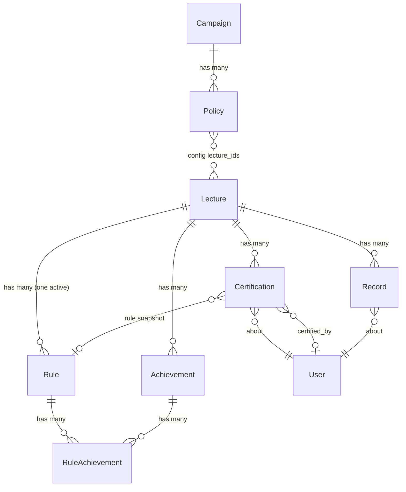

# Slice 3 — Exam Eligibility & Certification

```admonish info "What this page is"
An orientation map for the third Müsli slice (PR #1107, branch
`muesli-03-eligibility`): which models it adds, how they relate to what already
exists, and which screens appear. It is **not** a tutorial — read it before the
diff, not instead of it.

[Before you read the code](#before-you-read-the-code) collects the places where
the diff is easy to misread. The reasoning behind each rule lives in the feature
chapters, linked from there.
```

## TL;DR

Slice 3 turns the *factual* performance data from slice 2 into a **decision**:
who is admitted to an exam.

1. A teacher configures **one eligibility rule per lecture** — a point threshold
   plus optional required achievements.
2. The **evaluator** interprets each student's factual record against that rule
   and proposes `passed` / `failed` / `inconclusive`.
3. A **certification** stores the teacher's decision, with an audit trail and a
   pointer to the rule it was based on.
4. A new `Registration::Policy` kind, `student_performance`, lets a registration
   campaign require a passed certification at finalization.

Slice 3 deliberately stops there. It does **not** create exams
(slice 4) and does **not** grade them (slice 5).

## New models

Each name links to its full description in
[Student Performance](../features/05-student-performance.md).
`RuleAchievement` has no section of its own — it is described inside the rule's.

| Model | Purpose | Notable columns |
|---|---|---|
| [`StudentPerformance::Rule`](../features/05-student-performance.md#studentperformancerule-activerecord-model) | The eligibility criteria for one lecture | `threshold_mode`, `min_percentage`, `min_points_absolute`, `active` |
| `StudentPerformance::RuleAchievement` | Join: which achievements a rule requires | `position` (ordered via `acts_as_list`) |
| [`StudentPerformance::Certification`](../features/05-student-performance.md#studentperformancecertification-activerecord-model) | The teacher's decision per (lecture, user) | `status`, `source`, `certified_by_id`, `certified_at`, `rule_id` |
| [`StudentPerformance::Evaluator`](../features/05-student-performance.md#studentperformanceevaluator-service-object) | PORO — interprets a record against a rule | *(no table)* |
| [`Registration::Policy::StudentPerformanceHandler`](../features/05-student-performance.md#integration-with-registrationpolicy) | PORO — evaluates the new policy kind | *(no table)* |

Two existing models are extended rather than replaced:

- `Registration::Policy` gains the enum value `student_performance` (kind `2`),
  configured through `config["lecture_ids"]`.
- `Lecture` gains the boolean `uses_exam_eligibility`.

## How they relate



Three edges deserve attention, because they are where the surprises live:

```admonish warning "Certification and Record are not linked by a foreign key"
Both hang off `(lecture_id, user_id)` independently. The `stale` scope therefore
joins them on that pair by hand (Arel), not through an association. A student can
have a `Record` without a `Certification` and vice versa — nothing enforces the
pairing.
```

~~~admonish note "`Certification#rule_id` is a snapshot, not a dependency"
It records *which rule the decision was based on*, and is optional. A manually
created certification has no rule. This is what makes staleness detectable: if
`rule.updated_at` is newer than `certified_at`, the decision predates the current
rule.
~~~

```admonish note "The policy references lectures through JSON, not an association"
`Registration::Policy#config["lecture_ids"]` holds an array of stringified IDs.
There is no join table and no referential integrity — a deleted lecture leaves a
dangling ID. A legacy single-value `config["lecture_id"]` shape is still read as
a fallback.
```

## Relation to the neighbouring slices

| Comes from | What slice 3 consumes |
|---|---|
| Slice 2 | `StudentPerformance::Record` (the facts), `Achievement` |
| Registration system | `Registration::Campaign`, `Registration::Policy`, the finalization guard |
| Slice 4 | *(forward)* `Exam` creates the campaign whose finalization policy calls into this slice |

The seam towards slice 4 is worth holding on to while reviewing: slice 3 provides
the *answer* ("is this student eligible?"), slice 4 provides the *question*
("finalize this exam roster").

## Before you read the code

Seven places where the diff is easy to misread. The reasoning behind each rule
lives in [Student Performance](../features/05-student-performance.md); this page says what you need in order to read
*this branch*.

### An unmarked requirement makes a student pending, not ineligible

`Evaluator#achievements_status` returns `:ungraded` when a required achievement
has no grade yet. That becomes the proposal `:inconclusive`, stored as
`Certification(status: :pending)` — the student lands in the **Open** column of
the dashboard, not under *Not eligible*.

Read the branch carefully here: `:inconclusive` has three sources, not one. An
ungraded achievement, points still awaiting marking, and a points criterion with
nothing to measure all end there. The rule that weighs them is in
[how the decision is reached](../features/05-student-performance.md#how-the-decision-is-reached).

If nobody ever grades the achievement the student stays pending indefinitely, and
a finalization policy requiring a decided certification blocks the whole campaign
rather than just that student. Treating ungraded as failed would shift that cost
onto the student instead.

### A policy naming several lectures requires all of them

`StudentPerformanceHandler#evaluate` passes only when no configured lecture is
left without a passed certification. With two lectures in one policy, passing one
of them is not enough.

The failure looks only at the lectures still outstanding, and among those a
`failed` outranks a `pending`: the first settles the case, which is what turns a
blocked registration into an outright rejection. The titles of the outstanding
lectures travel in the result details.

Note that the policy kind is filtered out of the campaign form
(`available_policy_kinds`) until slice 4, so nothing configured today can reach
this code.

### `certified_at` on a pending row means "last evaluated"

The column began as an audit field and the staleness scopes reused it. On a
decided row both readings coincide; on a pending one only the second applies.

The scopes compare with `>`, and `x > NULL` is NULL rather than false — so a row
that was never evaluated is spelled out separately, or it would drop out of every
scope and never be re-examined. It counts as stale, and the next evaluation fills
the timestamp in.

### Switching exam eligibility off keeps the data

`Lecture#exam_eligibility_can_be_disabled` blocks only while a registration policy
still refers to the lecture. Certifications and rules do not block: they record
what happened, they decide nothing once the feature is off, and neither can be
deleted through the interface — so making them an obstacle left teachers with no
way out at all.

Turning the switch off removes exactly one thing from the interface, the
**Prüfungszulassungen** tab. The data stays and reappears if the switch goes back
on, which is why the checkbox says how many certifications it is about to hide.

### One active rule per lecture is a database truth

A partial unique index on `lecture_id WHERE active = true`. Both
`EvaluatorController#set_rule` and `RulesController#preview` fetch the rule with an
unordered `.first`, which is only safe because a second active row cannot exist.

A rule also has to constrain something — a threshold or at least one achievement.
An empty one would certify every student in the lecture and was reachable from the
form in two clicks.

### One performance policy per campaign, enforced twice

A model validation for a readable message, plus a partial unique index on
`registration_campaign_id WHERE kind = 2` for the race. The check-then-act between
`.exists?` and the insert is real: two requests interleaving would both pass the
validation.

The index is scoped to `kind = 2` only. The same race exists for
`institutional_email` and is deliberately left as it was.

### `threshold_mode` is stored, not derived

An enum column, kept in agreement with the two value columns by one validation, so
a rule can never claim a threshold it does not carry. Deriving the mode from
whichever column is filled would work only while a single writer sets both
together — and a rule with both columns NULL would be indistinguishable from a
deliberate "no point threshold", making the form assert a decision nobody took.

The enum carries `prefix: true` because a bare `none` would collide with
ActiveRecord's own `none` scope.

## New screens

All teacher-facing, all inside the lecture's **Assessments** tab unless noted.

| Screen | What it does |
|---|---|
| `student_performance/certifications/index` | The dashboard: per-student status, bulk accept, re-evaluate, stale warnings |
| `student_performance/rules/edit` | Configure threshold and required achievements |
| `student_performance/rules/preview` | Show how many students change status if the rule is saved |
| `student_performance/evaluator/bulk_proposals` | Proposals for all students at once |
| `student_performance/evaluator/single_proposal` | Proposal plus evidence for one student |
| `student_performance/evaluator/preview_rule_change` | Impact of a hypothetical threshold |
| `student_performance/records/show` | Extended with the eligibility trace |
| `lectures/edit/_preferences` | The `uses_exam_eligibility` toggle |
| `registration/policies/_form` | Configuration for the new policy kind (multi-select of lectures) |

Two Stimulus controllers ship with these: `threshold-mode` (switches the rule
form between percentage and absolute) and `certification-inline` (inline editing
in the dashboard).

The Assessments overview component gains a fourth tab, **Certifications**, shown
only when `uses_exam_eligibility` is on.

## New controllers

`StudentPerformance::{Rules,Certifications,Evaluator,Achievements}Controller`.
All four authorize with `authorize!(:edit, @lecture)` against a
`LectureAbility`, after a `before_action` has loaded the lecture — the
instance-bound pattern, not class-level `authorize_resource`.

## Migrations

| Migration | Effect |
|---|---|
| `…000001_create_student_performance_rules` | table, incl. the `threshold_mode` enum column |
| `…000002_create_student_performance_rule_achievements` | join table with `position` |
| `…000003_add_unique_active_rule_per_lecture` | partial unique index, `WHERE active = true` |
| `…000004_create_student_performance_certifications` | table |
| `…000005_add_uses_exam_eligibility_to_lectures` | boolean flag |
| `…000006_add_unique_student_performance_policy_per_campaign` | partial unique index, `WHERE kind = 2` |

## Background work

`CertificationStaleCheckJob` logs, per lecture, how many certifications have gone
stale. It is diagnostic only — it changes no data and drives no UI.

## Suggested reading order (~20 min)

1. `app/models/student_performance/rule.rb` — what a rule *is*
2. `app/models/student_performance/evaluator.rb` — how a rule meets a record
3. `app/models/student_performance/certification.rb` — especially the three
   `stale*` scopes
4. `app/models/registration/policy/student_performance_handler.rb` — the seam
   into registration
5. `app/controllers/student_performance/certifications_controller.rb` — the bulk
   actions, which is where the policy choices become visible
6. [Before you read the code](#before-you-read-the-code) — the seven places
   where what you just read is easy to misread

Files you can skip: locale files, `db/schema.rb`, and
`app/frontend/js/mampf_routes.js` — all generated or mechanical.

---

Previous: [Slice 2 — Achievements & Performance Records](02-performance.md) ·
Next: [Slice 4 — Exam Core & Registrations](04-exam-core.md)
