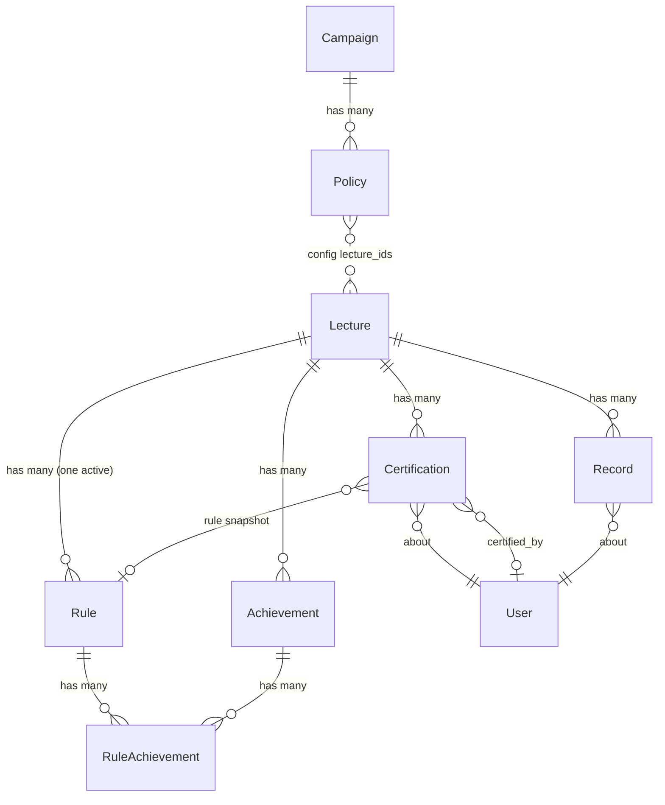

# Slice 3 — Exam Eligibility & Certification

```admonish info "What this page is"
An orientation map for the third Müsli slice (PR #1107, branch
`muesli-03-eligibility`): which models it adds, how they relate to what already
exists, and which screens appear. It is **not** a tutorial — read it before the
diff, not instead of it.

The judgement calls this slice makes are collected separately in
[Slice 3 — Decisions](03-eligibility-decisions.md).
```

## TL;DR

Slice 3 turns the *factual* performance data from slice 2 into a **decision**:
who is admitted to an exam.

1. A teacher configures **one eligibility rule per lecture** — a point threshold
   plus optional required achievements.
2. The **evaluator** interprets each student's factual record against that rule
   and proposes `passed` / `failed` / `inconclusive`.
3. A **certification** stores the teacher's decision, with an audit trail and a
   pointer to the rule it was based on.
4. A new `Registration::Policy` kind, `student_performance`, lets a registration
   campaign require a passed certification at finalization.

Slice 3 deliberately stops there. It does **not** create exams
(slice 4) and does **not** grade them (slice 5).

## New models

| Model | Purpose | Notable columns |
|---|---|---|
| `StudentPerformance::Rule` | The eligibility criteria for one lecture | `min_percentage`, `min_points_absolute`, `active` |
| `StudentPerformance::RuleAchievement` | Join: which achievements a rule requires | `position` (ordered via `acts_as_list`) |
| `StudentPerformance::Certification` | The teacher's decision per (lecture, user) | `status`, `source`, `certified_by_id`, `certified_at`, `rule_id` |
| `StudentPerformance::Evaluator` | PORO — interprets a record against a rule | *(no table)* |
| `Registration::Policy::StudentPerformanceHandler` | PORO — evaluates the new policy kind | *(no table)* |

Two existing models are extended rather than replaced:

- `Registration::Policy` gains the enum value `student_performance` (kind `2`),
  configured through `config["lecture_ids"]`.
- `Lecture` gains the boolean `uses_exam_eligibility`.

## How they relate



Three edges deserve attention, because they are where the surprises live:

```admonish warning "Certification and Record are not linked by a foreign key"
Both hang off `(lecture_id, user_id)` independently. The `stale` scope therefore
joins them on that pair by hand (Arel), not through an association. A student can
have a `Record` without a `Certification` and vice versa — nothing enforces the
pairing.
```

```admonish note "`Certification#rule_id` is a snapshot, not a dependency"
It records *which rule the decision was based on*, and is optional. A manually
created certification has no rule. This is what makes staleness detectable: if
`rule.updated_at` is newer than `certified_at`, the decision predates the current
rule.
```

```admonish note "The policy references lectures through JSON, not an association"
`Registration::Policy#config["lecture_ids"]` holds an array of stringified IDs.
There is no join table and no referential integrity — a deleted lecture leaves a
dangling ID. A legacy single-value `config["lecture_id"]` shape is still read as
a fallback.
```

## Relation to the neighbouring slices

| Comes from | What slice 3 consumes |
|---|---|
| Slice 2 | `StudentPerformance::Record` (the facts), `Achievement` |
| Registration system | `Registration::Campaign`, `Registration::Policy`, the finalization guard |
| Slice 4 | *(forward)* `Exam` creates the campaign whose finalization policy calls into this slice |

The seam towards slice 4 is worth holding on to while reviewing: slice 3 provides
the *answer* ("is this student eligible?"), slice 4 provides the *question*
("finalize this exam roster").

## New screens

All teacher-facing, all inside the lecture's **Assessments** tab unless noted.

| Screen | What it does |
|---|---|
| `student_performance/certifications/index` | The dashboard: per-student status, bulk accept, re-evaluate, stale warnings |
| `student_performance/rules/edit` | Configure threshold and required achievements |
| `student_performance/rules/preview` | Show how many students change status if the rule is saved |
| `student_performance/evaluator/bulk_proposals` | Proposals for all students at once |
| `student_performance/evaluator/single_proposal` | Proposal plus evidence for one student |
| `student_performance/evaluator/preview_rule_change` | Impact of a hypothetical threshold |
| `student_performance/records/show` | Extended with the eligibility trace |
| `lectures/edit/_preferences` | The `uses_exam_eligibility` toggle |
| `registration/policies/_form` | Configuration for the new policy kind (multi-select of lectures) |

Two Stimulus controllers ship with these: `threshold-mode` (switches the rule
form between percentage and absolute) and `certification-inline` (inline editing
in the dashboard).

The Assessments overview component gains a fourth tab, **Certifications**, shown
only when `uses_exam_eligibility` is on.

## New controllers

`StudentPerformance::{Rules,Certifications,Evaluator,Achievements}Controller`.
All four authorize with `authorize!(:edit, @lecture)` against a
`LectureAbility`, after a `before_action` has loaded the lecture — the
instance-bound pattern, not class-level `authorize_resource`.

## Migrations

| Migration | Effect |
|---|---|
| `…000001_create_student_performance_rules` | table |
| `…000002_create_student_performance_rule_achievements` | join table with `position` |
| `…000003_add_unique_active_rule_per_lecture` | partial unique index, `WHERE active = true` |
| `…000004_create_student_performance_certifications` | table |
| `…000005_add_uses_exam_eligibility_to_lectures` | boolean flag |
| `…000006_add_unique_student_performance_policy_per_campaign` | partial unique index, `WHERE kind = 2` |

## Background work

`CertificationStaleCheckJob` logs, per lecture, how many certifications have gone
stale. It is diagnostic only — it changes no data and drives no UI.

## Suggested reading order (~20 min)

1. `app/models/student_performance/rule.rb` — what a rule *is*
2. `app/models/student_performance/evaluator.rb` — how a rule meets a record
3. `app/models/student_performance/certification.rb` — especially the three
   `stale*` scopes
4. `app/models/registration/policy/student_performance_handler.rb` — the seam
   into registration
5. `app/controllers/student_performance/certifications_controller.rb` — the bulk
   actions, which is where the policy choices become visible
6. [Slice 3 — Decisions](03-eligibility-decisions.md)

Files you can skip: locale files, `db/schema.rb`, and
`app/frontend/js/mampf_routes.js` — all generated or mechanical.
