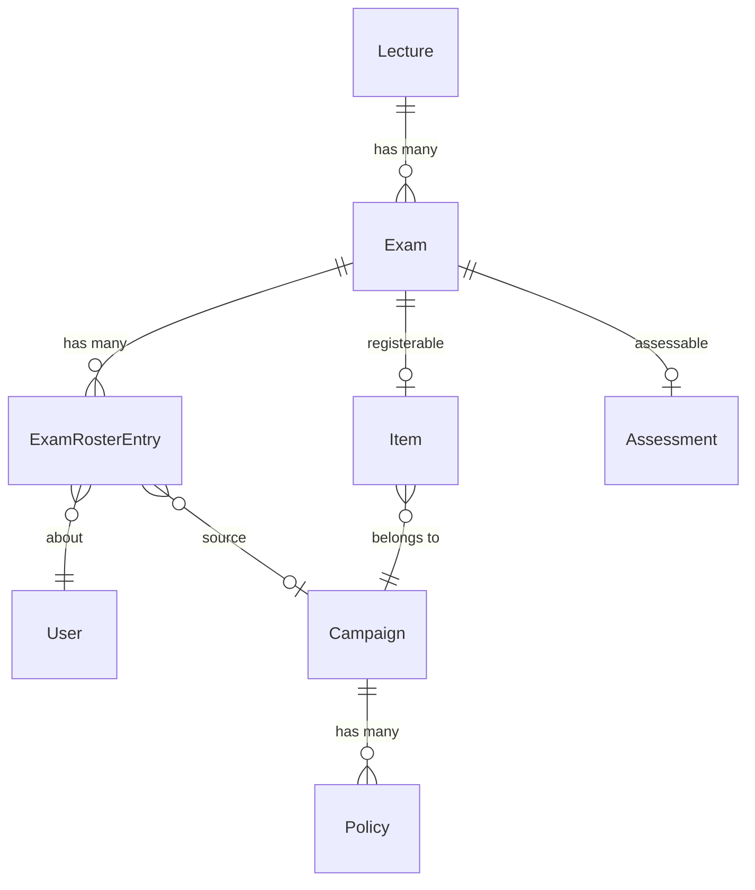
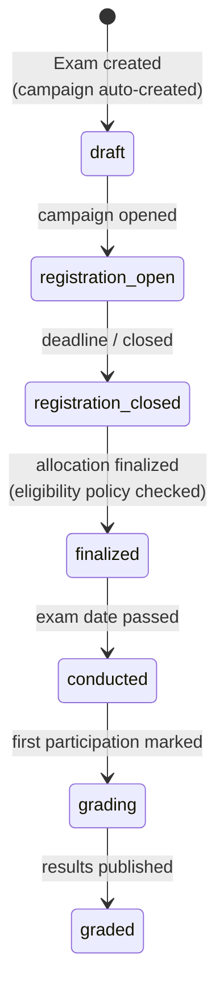

# Slice 4 — Exam Core & Registrations

```admonish info "What this page is"
An orientation map for the fourth Müsli slice (PR #1109, branch
`muesli-04-exam-core`).
```

## TL;DR

Slice 4 introduces the **exam** itself and the roster of people who may sit it.

1. An `Exam` belongs to a lecture and carries a date, location, capacity and
   description.
2. Creating one **automatically creates its registration campaign**, so students
   can register through the existing registration machinery.
3. Finalizing that campaign materialises an **exam roster** — one entry per
   admitted student, which is where slice 3's eligibility policy finally bites.
4. Teachers can add and remove participants by hand after finalization.

This is the slice where the seam from slice 3 closes: eligibility answered the
question *"may this student sit the exam?"*, and slice 4 is what asks it.

## New models

| Model | Purpose | Notable columns |
|---|---|---|
| [`Exam`](../features/05a-exam-model.md#exam-activerecord-model) | An exam in a lecture | `title`, `date`, `location`, `capacity`, `description`, `skip_campaigns`, `self_materialization_mode` |
| `ExamRosterEntry` | One person on one exam's roster | `exam_id`, `user_id`, `source_campaign_id`, `excluded_at` |

`ExamRosterEntry` has no section in the book — it exists only to satisfy
`Rosters::Rosterable`'s `#roster_entries` contract.

`Exam` includes **four** concerns at once, each documented where it comes from:

| Concern | From | Grants |
|---|---|---|
| [`Registration::Registerable`](../features/02-registration.md#registrationregisterable-concern) | registration system | can be the target of a campaign |
| [`Rosters::Rosterable`](../features/03-rosters.md#rostersrosterable-concern) | roster system | allocation can be materialised into it |
| [`Assessment::Pointable`](../features/04-assessments-and-grading.md#assessmentpointable-concern) | slice 1 | an assessment with tasks and points |
| [`Assessment::Gradable`](../features/04-assessments-and-grading.md#assessmentgradable-concern) | slice 1 | grades on participations (used by slice 5) |

## How they relate



```admonish warning "The exam's campaign is reached through the item, not an association"
There is no `belongs_to :registration_campaign`. `Exam#registration_campaign`
does `Registration::Item.find_by(registerable: self)&.registration_campaign` —
a lookup, not a join. One exam therefore has exactly one item and one campaign
by construction, but nothing in the schema enforces it.
```

```admonish note "Three roster associations over one table"
`all_exam_roster_entries` (everything), `exam_roster_entries` (scoped `active`)
and `excluded_exam_roster_entries` (scoped `excluded`). `has_many :users,
through: :exam_roster_entries` therefore silently means *active* users. Code
that wants removed people must reach for the `all_` or `excluded_` association
by name.
```

## The lifecycle



`Exam#status_phase` derives this from the campaign's status, the exam date and
the assessment; it is not a stored column. The last two transitions cannot be
triggered anywhere in this stack — see
[Lifecycle](../features/05a-exam-model.md#lifecycle) for what is still missing.

## Before you read the code

Six places where the diff is easy to misread. The rules that outlive this branch
live in [Registration](../features/02-registration.md) and
[Exam Model](../features/05a-exam-model.md); this page says what you need in
order to read *this branch*.

### The roster does not exist until the campaign is finalized

`finalize!` calls the materializer and sets the campaign to `completed` in the
same breath. Before that there are registrations but no `ExamRosterEntry` rows at
all, and the tab shows a read-only list of registrations with the note that an
editable list follows later.

That matters for reading `add_user_to_roster!` and `remove_user_from_roster!`:
both look like they belong to the registration phase, and neither can be reached
from the interface during it.

### The same button removes in two different ways

`remove_user_from_roster!` marks the row `excluded_at` when the campaign is
`completed`, and destroys it otherwise. Read as a timeline that suggests
"before" and "after" finalization — but as above, there is no editable roster
before it. The branch that the `else` actually serves is the **nil** case: an
exam with `skip_campaigns`, which has no campaign at all and whose list the
teacher keeps by hand from the start.

So the rule is *managed by a campaign* versus *managed by hand*, not early
versus late. In the first case the removal stays visible — the row moves to
**Nicht auf der Prüfungsliste** with a reason and can be undone. In the second it
is gone.

`Exam` is the only rosterable that does this at all; `Rosters::Rosterable`
destroys the row unconditionally, and tutorials and talks use that.

### Adding someone back revives their old row

`add_user_to_roster!` looks the user up in `all_exam_roster_entries` — the
association that still contains excluded rows — so an excluded participant is
reinstated rather than added afresh, and the roster does not grow a second row
for them.

The `||=` on `source_campaign` is the whole decision and one character wide. The
manual re-add passes no campaign, so `||=` preserves whichever campaign first
admitted them; a plain `=` would erase it and make them look hand-added. It
changes what the roster reports about their origin, nothing else.

### Grading data blocks removal three times over

The remove button renders disabled with a tooltip, the controller checks
`participant_removable?` again and answers 422, and only then does the model
raise `ParticipantRemovalNotAllowedError`.

Nothing rescues that exception, and nothing needs to: the generic roster
controller cannot address exams (`Rosters::Rosterable::TYPE_CLASS_MAP` lists
Tutorial, Talk, Cohort and Lecture), and within one request the controller and
the model read the same memoised result. It is a backstop for future callers, not
part of the flow.

### Deletion is the one guard that holds in the model

`non_destructible_reason` refuses while the roster is not empty or the campaign
is past draft, and — unlike the removal guard above — `Rosters::Rosterable`
enforces it with a `before_destroy`, so a programmatic `destroy` is stopped too.
When both reasons apply, `:roster_not_empty` wins; the order of the two `return`s
decides that and a spec pins it.

The draft campaign is cleaned up in the same callback chain, deliberately *after*
the guard rather than before it.

### The campaign is created with validations disabled

`campaign.save!(validate: false)` is not a shortcut. The deadline derived for the
campaign is the exam date minus three days, which is already past for an exam
less than three days out or one entered after the fact — and the campaign
validates its deadline even as a draft. Without the flag the exception would
propagate out of the `after_create` and the **exam itself** could not be saved.

Nothing is lost: the same validation runs again when someone opens the
registration, and refuses until the deadline is corrected.

## New screens

| Screen | What it does |
|---|---|
| `exams` (index, show, form) | Exam CRUD inside the lecture |
| `exams/components/exam_registration_tab_component` | The registration/roster tab: registrations before finalization, editable roster after |
| `exams/components` (settings, status, info bar) | Status chips, deadline form, capacity hints |
| `registration/allocations` | Extended with an exam workspace and the eligibility violation panel |
| `registration/campaigns` | Extended so exam campaigns render in the exam context rather than the lecture's campaign list |
| `lectures/edit` | Exams subtab |

## New controllers

`ExamsController`. `Registration::{Allocations,Campaigns,Policies,UserRegistrations}Controller`
and `Assessment::TasksController` are extended.

## Migrations

| Migration | Effect |
|---|---|
| `…000000_create_exams` | table |
| `…000001_create_exam_roster_entries` | table, unique on (user, exam) |
| `…000002_add_excluded_at_to_exam_roster_entries` | soft-exclusion column |

## Suggested reading order (~25 min)

1. `app/models/exam.rb` — top to bottom; the concern stack, then the campaign
   hooks at the bottom
2. `app/models/exam_roster_entry.rb` — small, but note `excluded_at`
3. `Exam#add_user_to_roster!` / `#remove_user_from_roster!` — the asymmetry is
   the heart of this slice
4. `app/controllers/exams_controller.rb`

---

Previous: [Slice 3 — Exam Eligibility & Certification](03-eligibility.md) ·
Next: [Slice 5 — Exam Gradability](05-exam-grading.md)
