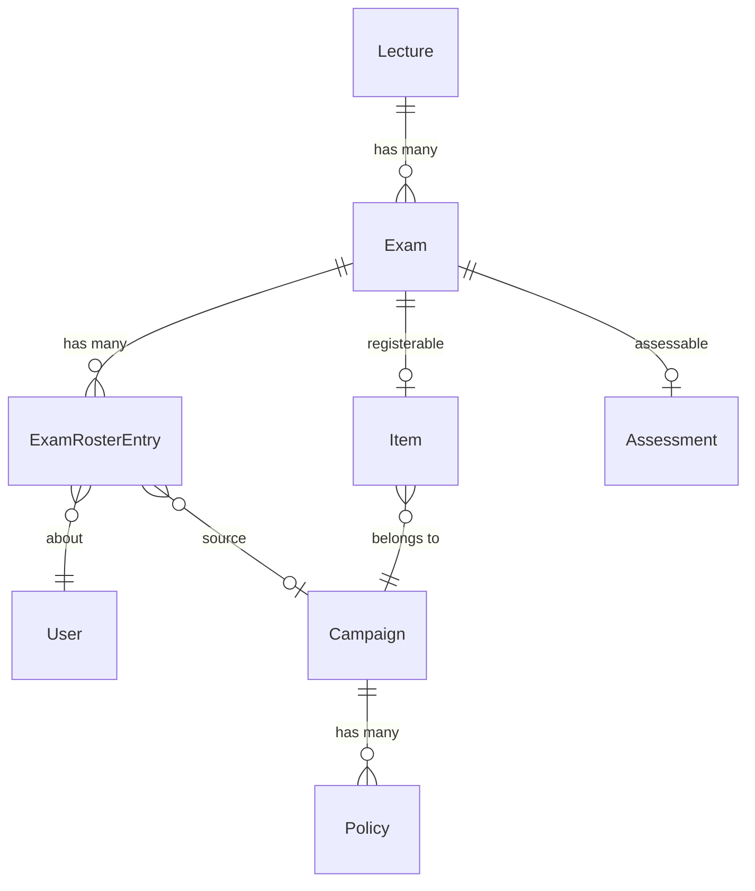
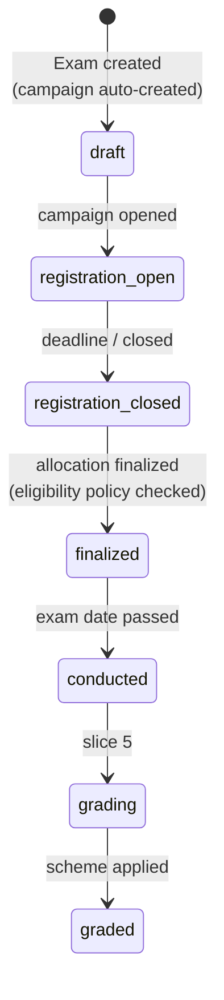

# Slice 4 — Exam Core & Registrations

```admonish info "What this page is"
An orientation map for the fourth Müsli slice (PR #1109, branch
`muesli-04-exam-core`).
```

## TL;DR

Slice 4 introduces the **exam** itself and the roster of people who may sit it.

1. An `Exam` belongs to a lecture and carries a date, location, capacity and
   description.
2. Creating one **automatically creates its registration campaign**, so students
   can register through the existing registration machinery.
3. Finalizing that campaign materialises an **exam roster** — one entry per
   admitted student, which is where slice 3's eligibility policy finally bites.
4. Teachers can add and remove participants by hand after finalization.

This is the slice where the seam from slice 3 closes: eligibility answered the
question *"may this student sit the exam?"*, and slice 4 is what asks it.

## New models

| Model | Purpose | Notable columns |
|---|---|---|
| [`Exam`](../features/05a-exam-model.md#exam-activerecord-model) | An exam in a lecture | `title`, `date`, `location`, `capacity`, `description`, `skip_campaigns`, `self_materialization_mode` |
| `ExamRosterEntry` | One person on one exam's roster | `exam_id`, `user_id`, `source_campaign_id`, `excluded_at` |

`ExamRosterEntry` has no section in the book — it exists only to satisfy
`Rosters::Rosterable`'s `#roster_entries` contract.

`Exam` includes **four** concerns at once, each documented where it comes from:

| Concern | From | Grants |
|---|---|---|
| [`Registration::Registerable`](../features/02-registration.md#registrationregisterable-concern) | registration system | can be the target of a campaign |
| [`Rosters::Rosterable`](../features/03-rosters.md#rostersrosterable-concern) | roster system | allocation can be materialised into it |
| [`Assessment::Pointable`](../features/04-assessments-and-grading.md#assessmentpointable-concern) | slice 1 | an assessment with tasks and points |
| [`Assessment::Gradable`](../features/04-assessments-and-grading.md#assessmentgradable-concern) | slice 1 | grades on participations (used by slice 5) |

## How they relate



```admonish warning "The exam's campaign is reached through the item, not an association"
There is no `belongs_to :registration_campaign`. `Exam#registration_campaign`
does `Registration::Item.find_by(registerable: self)&.registration_campaign` —
a lookup, not a join. One exam therefore has exactly one item and one campaign
by construction, but nothing in the schema enforces it.
```

```admonish note "Three roster associations over one table"
`all_exam_roster_entries` (everything), `exam_roster_entries` (scoped `active`)
and `excluded_exam_roster_entries` (scoped `excluded`). `has_many :users,
through: :exam_roster_entries` therefore silently means *active* users. Code
that wants removed people must reach for the `all_` or `excluded_` association
by name.
```

## The lifecycle



`Exam#status_phase` derives this from the campaign's status and the exam date;
it is not a stored column.

## New screens

| Screen | What it does |
|---|---|
| `exams` (index, show, form) | Exam CRUD inside the lecture |
| `exams/components/exam_registration_tab_component` | The registration/roster tab: registrations before finalization, editable roster after |
| `exams/components` (settings, status, info bar) | Status chips, deadline form, capacity hints |
| `registration/allocations` | Extended with an exam workspace and the eligibility violation panel |
| `registration/campaigns` | Extended so exam campaigns render in the exam context rather than the lecture's campaign list |
| `lectures/edit` | Exams subtab |

## New controllers

`ExamsController`. `Registration::{Allocations,Campaigns,Policies,UserRegistrations}Controller`
and `Assessment::TasksController` are extended.

## Migrations

| Migration | Effect |
|---|---|
| `…000000_create_exams` | table |
| `…000001_create_exam_roster_entries` | table, unique on (user, exam) |
| `…000002_add_excluded_at_to_exam_roster_entries` | soft-exclusion column |

## Suggested reading order (~25 min)

1. `app/models/exam.rb` — top to bottom; the concern stack, then the campaign
   hooks at the bottom
2. `app/models/exam_roster_entry.rb` — small, but note `excluded_at`
3. `Exam#add_user_to_roster!` / `#remove_user_from_roster!` — the asymmetry is
   the heart of this slice
4. `app/controllers/exams_controller.rb`

---

Previous: [Slice 3 — Exam Eligibility & Certification](03-eligibility.md) ·
Next: [Slice 5 — Exam Gradability](05-exam-grading.md)
